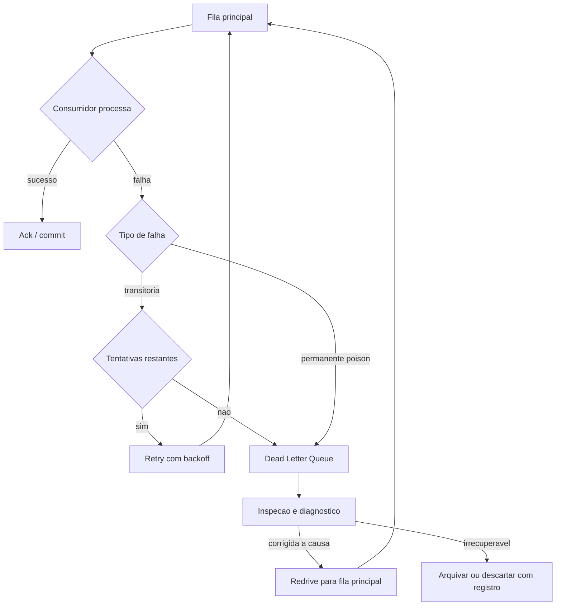

# Dead Letter Queue e Poison Messages

> **Bloco:** Mensageria e streaming · **Nível:** Intermediário/Avançado · **Tempo de leitura:** ~21 min

## TL;DR

Uma **poison message** (mensagem venenosa) é uma mensagem que o consumidor **nunca** consegue processar com sucesso — por estar malformada, por violar uma invariante, ou por referenciar um recurso que não existe mais. Se o pipeline reentrega essa mensagem indefinidamente (retry/requeue), ela trava o consumidor num **loop infinito**, bloqueando todas as outras mensagens atrás dela e consumindo recursos sem fim. A **Dead Letter Queue (DLQ)** — ou *Dead Letter Exchange* (DLX) no vocabulário do RabbitMQ — é o destino para onde essas mensagens são desviadas após esgotar as tentativas, permitindo que o fluxo principal continue enquanto as mensagens problemáticas ficam isoladas para inspeção, correção e *reprocessamento* manual ou automático. A regra de ouro: **todo consumidor de produção precisa de uma DLQ e de um limite de tentativas explícito.** Sem isso, uma única mensagem ruim derruba o throughput do sistema inteiro.

## O problema que resolve

Mensageria confiável quase sempre opera em semântica **at-least-once**: se o consumidor falha antes de confirmar, a mensagem é reentregue. Isso é o que torna o sistema resiliente a crashes transitórios. Mas há uma classe de falha que **não** é transitória: a mensagem em si está errada. Exemplos: um JSON corrompido que falha na desserialização; um evento `PedidoPago` que referencia um `cliente_id` que foi deletado; um campo obrigatório nulo que viola uma constraint; um schema incompatível após um deploy.

Para essas mensagens, retry é inútil — a 1ª, a 100ª e a 10.000ª tentativa falham igual. Pior: no modelo de fila com `requeue=true`, a mensagem volta para a frente da fila e é imediatamente reentregue ao mesmo (ou outro) consumidor, que falha de novo, e de novo. A documentação do RabbitMQ alerta explicitamente: *"nacking with requeue on a message that always fails creates an infinite redelivery loop where the message bounces between the queue and the consumer forever"*. Esse loop não só queima CPU — ele **bloqueia o progresso** de todas as mensagens legítimas que estão atrás na fila (em Kafka, na mesma partição). Uma poison message não tratada pode parar a operação inteira de um serviço. A DLQ existe para quebrar esse loop: depois de N tentativas, tira a mensagem do caminho e deixa o resto fluir.

## O que é (definição aprofundada)

Uma **Dead Letter Queue (DLQ)** é uma fila (ou tópico) secundária que recebe mensagens que **não puderam ser processadas com sucesso** pela fila de origem (*source queue*) dentro das condições configuradas. A DLQ não é estrutura especial — é uma fila comum cujo único papel é servir de "estacionamento" para mensagens problemáticas. A documentação da AWS resume bem o propósito: *"DLQs are useful for debugging your application because you can isolate unconsumed messages to determine why processing did not succeed"*.

As condições que mandam uma mensagem para a DLQ variam por tecnologia:

- **AWS SQS**: a *redrive policy* define `maxReceiveCount` — após uma mensagem ser **recebida** esse número de vezes sem ser deletada (= sem ser processada com sucesso), o SQS a move automaticamente para a DLQ. O tipo da DLQ tem que casar com o da source (FIFO→FIFO, standard→standard).
- **RabbitMQ**: o **Dead Letter Exchange (DLX)** é um exchange normal associado a uma fila. Uma mensagem é *dead-lettered* quando: (a) é rejeitada com `basic.reject`/`basic.nack` e `requeue=false`; (b) seu TTL expira; ou (c) a fila atinge o limite de tamanho. O DLX então roteia a mensagem para uma fila de DLQ.
- **Kafka**: **não tem DLQ nativa**. É um *padrão* implementado pela aplicação (ou por frameworks como Spring Kafka, Kafka Connect com `errors.deadletterqueue.topic.name`): após N tentativas, o consumidor **produz** a mensagem problemática em um tópico auxiliar (ex.: `pedidos.pagos.DLT`) com headers de contexto (exceção, stacktrace, offset original, número de tentativas) e faz commit do offset original para destravar a partição.

Termos-chave: **poison message** (a mensagem que sempre falha), **redrive policy / maxReceiveCount** (SQS), **dead letter exchange / DLX** (RabbitMQ), **dead letter topic / DLT** (convenção Kafka), **redelivery loop** (o loop infinito a evitar), **redrive** (reprocessar mensagens da DLQ de volta para a source após corrigir a causa), **retry com backoff** (a etapa intermediária antes da DLQ).

## Como funciona

O fluxo robusto tem três estágios: **processar → retry com backoff → DLQ**.

1. **Tentativa de processamento.** O consumidor tenta processar. Se sucesso, ack/commit normal.
2. **Falha transitória → retry com backoff.** Se a falha pode ser temporária (banco indisponível, timeout de rede, gateway fora do ar), vale a pena retentar — idealmente com **exponential backoff** e *jitter*, para não martelar um recurso já estressado. Em RabbitMQ, isso costuma ser feito com filas de retry que usam TTL + DLX para "atrasar" a reentrega (um padrão de *delay queue*). Em SQS, o `VisibilityTimeout` esconde a mensagem temporariamente. Em Kafka, frameworks implementam tópicos de retry escalonados (`retry-5s`, `retry-1m`, etc.).
3. **Esgotou tentativas → DLQ.** Após `maxReceiveCount` (SQS) / N nacks (RabbitMQ) / N tentativas (Kafka), a mensagem é desviada para a DLQ. **O fluxo principal continua.** A mensagem fica na DLQ com metadados que permitem diagnosticar a causa.

Distinguir **falha transitória** de **poison message** é a decisão de design central. Erros de desserialização, validação de schema e violação de invariante de negócio são quase sempre permanentes → DLQ direto, sem retry (ou com pouquíssimo). Timeouts, indisponibilidade e *deadlocks* são transitórios → retry faz sentido. Tratar tudo como transitório gera loops; tratar tudo como permanente joga fora mensagens que só precisavam de uma segunda chance.

O ciclo de vida da DLQ não termina ali. Um operador (ou um job automático) inspeciona a DLQ, identifica a causa raiz, corrige (deploy de fix, ajuste de dado, mudança de schema) e faz o **redrive**: reenviar as mensagens da DLQ de volta para a fila de origem para reprocessamento. O AWS SQS tem *DLQ redrive* embutido no console; em RabbitMQ/Kafka, é um shovel/consumer dedicado. Mensagens que **continuam** falhando após redrive (ex.: dado irrecuperável) podem ir para um arquivamento frio ou descarte controlado, com registro.

## Diagrama de fluxo



O ponto crítico é o ramo `permanente → DLQ` direto e o teto de tentativas no ramo transitório: sem eles, a seta voltaria a `Q` para sempre, criando o redelivery loop.

## Exemplo prático / caso real

Em uma fintech, o serviço de **conciliação** consome de uma fila SQS `transacoes.conciliar` eventos de transações para cruzar com o extrato do adquirente. Configuração:

- Fila de origem `transacoes.conciliar` com **redrive policy**: `maxReceiveCount = 5` apontando para a DLQ `transacoes.conciliar.dlq`.
- O consumidor tem `VisibilityTimeout` de 30s. Falhas transitórias (adquirente fora do ar) fazem a mensagem reaparecer após o timeout e ser retentada, até 5 vezes.
- Uma transação com `valor` negativo (bug do produtor) falha na validação de invariante **toda vez**. Após 5 recebimentos, o SQS a move automaticamente para a DLQ. O fluxo principal nunca trava.
- Um alarme do CloudWatch dispara quando `ApproximateNumberOfMessagesVisible` da DLQ > 0 — a DLQ com mensagens é, por definição, um sinal de problema que pede atenção humana.
- O time identifica o bug do produtor, faz o deploy do fix e usa o **DLQ redrive** do SQS para reprocessar as transações represadas.

```text
// Pseudocodigo do consumidor (SQS)
on message(msg):
  try:
    tx = parse(msg)
    validar(tx)              // lanca em poison (valor negativo)
    conciliar(tx)
    sqs.deleteMessage(msg)   // sucesso -> remove
  except TransientError:
    # nao deleta; SQS reentrega apos VisibilityTimeout (ate maxReceiveCount)
    raise
  # erros permanentes: deixa o maxReceiveCount levar a DLQ;
  # ou move explicitamente para a DLQ se quiser pular os retries
```

No mundo **Kafka** de um marketplace, o serviço de faturamento consome `pedidos.pagos`. Como não há DLQ nativa, usa Spring Kafka com `DeadLetterPublishingRecoverer`: após 3 tentativas com backoff, a mensagem é publicada em `pedidos.pagos.DLT` com headers `kafka_dlt-exception-message`, `kafka_dlt-original-offset` e `kafka_dlt-original-partition`. Isso é vital em Kafka porque uma poison message **bloqueia a partição inteira** — sem desviá-la, todos os pedidos daquela partição ficam represados atrás dela. No **RabbitMQ**, o mesmo padrão usa um DLX: a fila `faturamento` declara `x-dead-letter-exchange: dlx.faturamento`, e o consumidor faz `basic.nack(requeue=false)` em falha permanente, roteando a mensagem para `faturamento.dlq`.

## Quando usar / Quando evitar

**Use DLQ sempre** em consumidores de produção. É praticamente não-negociável: qualquer fila/tópico consumido por um serviço crítico deve ter DLQ e limite de tentativas. O custo de configurá-la é baixo; o custo de não tê-la é um redelivery loop derrubando o serviço no pico.

**Combine DLQ com retry/backoff** quando há falhas transitórias plausíveis (dependências externas, rede). Reserve retries para o transitório; mande o permanente direto para a DLQ.

**Não use retry (vá direto à DLQ)** para erros claramente permanentes: desserialização, schema inválido, validação de invariante. Retentar é desperdício e atrasa o diagnóstico.

**Evite tratar a DLQ como buraco negro.** DLQ sem monitoramento e sem processo de redrive é só um lugar onde mensagens vão morrer silenciosamente. Se ninguém olha a DLQ, você tem perda de dados com etapas extras. Toda DLQ precisa de alarme e de um runbook de triagem.

**Cuidado com DLQ em fluxos que exigem ordem estrita.** Desviar uma mensagem para a DLQ e processar as seguintes quebra a ordem original. Se a ordem por entidade é inviolável, talvez seja preciso parar a partição/chave inteira em vez de pular a mensagem — uma decisão de domínio.

## Anti-padrões e armadilhas comuns

- **`requeue=true` em poison message.** O anti-padrão clássico do RabbitMQ: a mensagem volta para a frente da fila e gira em loop infinito, travando o consumidor. Sempre use `requeue=false` + DLX para falhas permanentes.
- **DLQ sem limite de tentativas.** Configurar a DLQ mas esquecer o `maxReceiveCount`/N — a mensagem nunca chega lá porque continua sendo retentada para sempre.
- **DLQ sem monitoramento.** Mensagens caem na DLQ e ninguém percebe. Sem alarme em "DLQ não vazia", a DLQ vira um cemitério de dados perdidos.
- **Reprocessar da DLQ sem corrigir a causa.** Fazer redrive de volta para a source sem ter resolvido o bug → a mensagem só volta a falhar e reentrar na DLQ. Redrive é a *última* etapa, após o fix.
- **Poison message bloqueando a partição no Kafka.** Quem esquece que Kafka não tem DLQ nativa e não implementa o padrão de DLT acaba com uma partição inteira travada atrás de uma única mensagem ruim — e todos os eventos daquela chave param.
- **Perder contexto na DLQ.** Mandar a mensagem para a DLQ sem headers de diagnóstico (exceção, offset, contagem de tentativas, timestamp) torna a triagem um pesadelo. Sempre enriqueça a mensagem com metadados da falha.
- **Confundir retry com falta de idempotência.** Retry só é seguro se o processamento for **idempotente**. Retentar uma operação não-idempotente (ex.: debitar uma conta) que falhou *após* o efeito colateral duplica o efeito.

## Relação com outros conceitos

DLQ é a contraparte de robustez do contrato **at-least-once** que sustenta **Message Brokers** e **Log-based Streaming**. Está profundamente ligada à **idempotência**: como at-least-once garante reentrega (e retry implica reprocessamento), o consumidor precisa ser idempotente para que retries não dupliquem efeitos — DLQ e idempotência são parceiras inseparáveis. Conecta-se a **Backpressure** como mecanismos complementares: backpressure regula *volume*, DLQ isola *mensagens defeituosas*. No nível de **Consumer Groups / Partições**, a DLQ é o que evita que uma poison message trave uma partição inteira no Kafka. Em **Event-Driven Architecture**, a DLQ é parte essencial do contrato de resiliência da coreografia: serviços que reagem a eventos precisam de uma rota de escape para eventos que não conseguem honrar.

## Referências

- [AWS — Using dead-letter queues in Amazon SQS](https://docs.aws.amazon.com/AWSSimpleQueueService/latest/SQSDeveloperGuide/sqs-dead-letter-queues.html) — DLQ, redrive policy e `maxReceiveCount`.
- [AWS — Configure a dead-letter queue using the Amazon SQS console](https://docs.aws.amazon.com/AWSSimpleQueueService/latest/SQSDeveloperGuide/sqs-configure-dead-letter-queue.html) — configuração e redrive.
- [AWS — Amazon SNS dead-letter queues](https://docs.aws.amazon.com/sns/latest/dg/sns-dead-letter-queues.html) — DLQ no contexto pub/sub.
- [RabbitMQ — Dead Letter Exchanges (DLX)](https://www.rabbitmq.com/docs/dlx) — condições de dead-lettering e roteamento.
- [RabbitMQ — Consumer Acknowledgements and Publisher Confirms](https://www.rabbitmq.com/docs/confirms) — `basic.nack`, `requeue` e o redelivery loop.
- [RabbitMQ — At-Least-Once Dead Lettering](https://www.rabbitmq.com/blog/2022/03/29/at-least-once-dead-lettering) — garantias de dead-lettering em quorum queues.
- [Apache Kafka — Documentation](https://kafka.apache.org/documentation/) — ausência de DLQ nativa e o consumo por offset que motiva o padrão de DLT.
- *Designing Data-Intensive Applications*, Martin Kleppmann (O'Reilly, 2017) — semântica de entrega (at-least-once) e tratamento de falhas em mensageria (Cap. 11).
