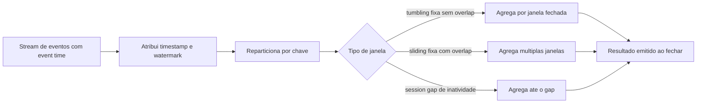

# Stream Processing: Kafka Streams, Flink e Janelas

> **Bloco:** Mensageria e streaming · **Nível:** Intermediário/Avançado · **Tempo de leitura:** ~24 min

## TL;DR

**Stream processing** é processar dados **em movimento**, de forma contínua e incremental, à medida que os eventos chegam — em oposição a *batch*, que processa lotes de dados parados. Os dois frameworks de referência têm filosofias distintas: **Kafka Streams** é uma **biblioteca** que roda dentro da sua aplicação (sem cluster próprio), ideal quando os dados já estão em Kafka e você quer transformações com estado embarcadas no serviço; **Apache Flink** é um **engine distribuído** com cluster próprio, *checkpointing* sofisticado, *exactly-once* end-to-end e suporte de primeira classe a *event time* — escolhido para pipelines grandes e complexos. O conceito central de ambos é a **janela** (*window*): como agregar um stream infinito em fatias finitas de tempo. As três janelas fundamentais são **tumbling** (fatias fixas, sem sobreposição), **sliding** (fatias fixas que se sobrepõem, deslizando por um intervalo menor) e **session** (fatias dinâmicas que se fecham após um período de inatividade). Dominar janelas, *event time* vs *processing time* e *watermarks* é o que separa relatórios corretos de números que mentem.

## O problema que resolve

A computação tradicional é *request/response* (síncrona) ou *batch* (processa um lote acumulado de tempos em tempos). Batch tem um problema fundamental de **latência**: se você roda o job de faturamento à meia-noite, os dados do dia só ficam disponíveis no dia seguinte. Para casos como detecção de fraude, monitoramento operacional, recomendação em tempo real e dashboards ao vivo, isso é inaceitável — a informação precisa ser processada **segundos** após o evento acontecer.

Stream processing nasceu para fechar essa lacuna: tratar o fluxo de eventos como uma computação contínua, atualizando resultados incrementalmente a cada evento. Mas isso traz um desafio que batch não tem: um stream é **infinito e desordenado**. Você não pode "esperar todos os dados chegarem" para agregar, porque eles nunca param de chegar. E os eventos chegam fora de ordem (latência de rede, partições, retries). Então surgem duas questões centrais que definem todo o campo: **(1) como recortar um fluxo infinito em pedaços finitos para agregar?** — esse é o problema das **janelas**; e **(2) qual noção de tempo usar?** — o *event time* (quando o evento realmente ocorreu) ou o *processing time* (quando o processador o viu)? Responder bem a essas duas perguntas é o que torna stream processing correto e não apenas rápido.

## O que é (definição aprofundada)

**Stream processing** é o paradigma de consumir, transformar e produzir streams de eventos de forma contínua. As operações fundamentais incluem *stateless* (map, filter, transformações elemento-a-elemento) e *stateful* (agregações, joins, contagens, que exigem manter **estado** entre eventos).

**Kafka Streams** é, segundo a documentação oficial, *"a client library for building applications and microservices, where the input and output data are stored in Kafka clusters"*. Não há cluster de processamento separado — a lógica roda como parte da sua aplicação Java/Scala, escalando pelo mesmo mecanismo de consumer groups do Kafka. Seu conceito-chave é a **stream-table duality**: um stream (`KStream`) é uma sequência infinita de eventos imutáveis; uma tabela (`KTable`) é o estado materializado resultante de agregar esse stream (o "último valor por chave"). O estado fica em *state stores* locais (RocksDB) respaldados por *changelog topics* no Kafka para tolerância a falha.

**Apache Flink** é um engine de processamento distribuído com cluster próprio (JobManager + TaskManagers). Trata batch como caso especial de stream, tem *checkpointing* distribuído para *exactly-once*, e oferece o modelo mais rico de tempo e janelas do mercado. É a referência quando o pipeline é grande, exige baixa latência com alta correção, ou faz joins/agregações complexas sobre múltiplas fontes.

**Janela (window)** é a abstração que recorta o stream infinito em conjuntos finitos de eventos para agregar. A documentação do Flink lista os tipos pré-definidos: tumbling, sliding, session e global. As três essenciais:

- **Tumbling window** (cai/vira): janelas de tamanho fixo, **não-sobrepostas**, contíguas. Cada evento pertence a **exatamente uma** janela. Ex.: "total de vendas a cada 1 minuto". A doc do Flink confirma: cada elemento pertence a exatamente uma janela.
- **Sliding window** (deslizante): janelas de tamanho fixo que **se sobrepõem**, controladas por dois parâmetros — *size* (tamanho) e *slide* (de quanto em quanto tempo uma nova janela começa). Se o slide < size, as janelas se sobrepõem e um evento pode pertencer a **várias** janelas. Ex.: "média móvel dos últimos 10 min, recalculada a cada 1 min".
- **Session window** (sessão): janelas de tamanho **dinâmico**, definidas por um *gap* de inatividade. A janela permanece aberta enquanto chegam eventos; após um período sem eventos (o *session gap*), ela fecha. Ideal para agrupar atividade por sessão de usuário. A doc do Flink: as janelas começam em pontos individuais por chave e fecham após um período de inatividade.

Termos-chave adicionais: **event time** (timestamp do evento na origem), **processing time** (relógio do processador), **watermark** (marca que diz "provavelmente já vi todos os eventos até o tempo T", permitindo fechar janelas mesmo com eventos atrasados), **allowed lateness** (tolerância a eventos que chegam após o watermark), **state store**, **checkpoint** (snapshot do estado para recuperação).

## Como funciona

**Event time vs processing time — o coração da correção.** Imagine eventos de cliques gerados em celulares com conexão instável. Um clique acontece às 10h00 (event time) mas só chega ao processador às 10h05 (processing time) porque o celular estava sem rede. Se você janela por *processing time*, esse clique entra na janela das 10h05 — número errado. Se janela por *event time*, ele entra corretamente na janela das 10h00. Por isso Flink e Kafka Streams permitem extrair o timestamp do próprio evento e janelar por event time. O preço é que você precisa lidar com eventos atrasados, e é aí que entram os **watermarks**.

**Watermarks.** Um watermark é uma heurística: "acredito que já recebi todos os eventos com event time ≤ T". Quando o watermark passa do fim de uma janela, o engine pode **fechar** a janela e emitir o resultado, mesmo que algum evento muito atrasado ainda apareça depois. Watermarks são o que permite obter resultados em tempo finito sobre um stream infinito e desordenado. O *allowed lateness* define quanto tempo após o watermark ainda se aceita atualizar uma janela já emitida antes de descartar definitivamente o evento atrasado.

**Estado e tolerância a falha.** Agregações por janela exigem manter estado (o acumulador da janela). No Kafka Streams, esse estado vive em state stores locais (RocksDB) e é respaldado por *changelog topics* — se uma instância morre, outra reconstrói o estado relendo o changelog. No Flink, o estado é gerenciado pelo engine e periodicamente fotografado por **checkpoints** distribuídos (algoritmo de barreiras de Chandy-Lamport); na recuperação, o job volta ao último checkpoint consistente, dando **exactly-once** sobre o estado. Combinado com sinks transacionais (ex.: produtor transacional do Kafka), Flink atinge exactly-once *end-to-end*.

**Reparticionamento por chave.** Agregações e joins com estado precisam que todos os eventos da mesma chave cheguem ao mesmo operador/instância. Tanto Kafka Streams quanto Flink **reparticionam** o stream por chave (shuffle) antes de operações stateful — o que conecta diretamente stream processing ao conceito de partição e chave da mensageria. A escolha da chave de agregação define onde os dados vão parar e o paralelismo possível.

## Diagrama de fluxo



Para visualizar a diferença entre as janelas no eixo do tempo:

```mermaid
gantt
    title Tumbling vs Sliding vs Session no tempo
    dateFormat HH:mm
    axisFormat %H:%M
    section Tumbling 5min
    J1 :t1, 10:00, 5m
    J2 :t2, 10:05, 5m
    J3 :t3, 10:10, 5m
    section Sliding size5 slide2
    S1 :s1, 10:00, 5m
    S2 :s2, 10:02, 5m
    S3 :s3, 10:04, 5m
    section Session gap2
    A1 :a1, 10:00, 3m
    A2 :a2, 10:08, 2m
```



Tumbling: fatias contíguas e disjuntas. Sliding: fatias que se sobrepõem (slide < size). Session: fatias de duração variável, separadas por períodos de inatividade.

## Exemplo prático / caso real

**Marketplace — detecção de pico de pedidos em tempo real (tumbling, Kafka Streams).** O time de operação quer um dashboard que mostre o total de pedidos por categoria a cada minuto, para detectar anomalias durante a Black Friday. Como os dados já estão no tópico `pedidos.criados`, Kafka Streams é a escolha natural — sem cluster extra, roda dentro do próprio serviço de operação.

```text
KStream<categoria, pedido> stream = builder.stream("pedidos.criados");
stream
  .groupByKey()                                 // reparticiona por categoria
  .windowedBy(TimeWindows.ofSizeWithNoGrace(Duration.ofMinutes(1)))  // tumbling 1min
  .count()                                      // estado: contagem por janela
  .toStream()
  .to("pedidos.por-categoria-por-minuto");
```

Cada pedido cai em exatamente uma janela de 1 minuto (tumbling). Janelar por *event time* (timestamp do pedido) garante que um pedido atrasado por latência de rede ainda seja contado no minuto correto.

**E-commerce — análise de sessões de navegação (session, Flink).** O time de produto quer entender o comportamento por sessão: quantas páginas, quanto tempo, qual a taxa de conversão. Uma sessão termina quando o usuário fica 30 minutos inativo. Isso é session window por excelência — a duração da janela é dinâmica, definida pelo gap. Flink é escolhido por causa do event time robusto, watermarks (cliques chegam fora de ordem de vários dispositivos) e exactly-once para não contar a mesma sessão duas vezes.

```text
clicks
  .keyBy(evento -> evento.usuarioId)
  .window(EventTimeSessionWindows.withGap(Time.minutes(30)))
  .aggregate(new SessionAggregator())   // paginas, duracao, converteu?
```

**Fintech — média móvel de transações para antifraude (sliding, Flink).** Para detectar comportamento anômalo, calcula-se o valor total transacionado por conta nos **últimos 10 minutos, recalculado a cada 1 minuto** — uma sliding window (size=10min, slide=1min). Cada transação contribui para múltiplas janelas sobrepostas. Se o total ultrapassa um limiar, dispara um alerta. Sliding é o tipo certo aqui porque queremos uma visão contínua e suave do comportamento recente, não fatias estanques.

A escolha entre Kafka Streams e Flink é arquitetural: o marketplace acima usa Kafka Streams para o dashboard simples (dados em Kafka, transformação leve, deploy junto com o serviço), mas a fintech e o time de produto usam Flink para pipelines com event time complexo, múltiplas fontes e exactly-once crítico.

## Quando usar / Quando evitar

**Use Kafka Streams quando** os dados de entrada e saída já vivem em Kafka, você quer evitar operar um cluster separado, a topologia é embarcável no microsserviço, e o time domina a JVM. É leve, escala pelo modelo de consumer groups e é ótimo para transformações, enriquecimentos e agregações de complexidade moderada.

**Use Apache Flink quando** o pipeline é grande e complexo, exige *event time* robusto com watermarks sofisticados, precisa de **exactly-once end-to-end**, faz joins entre múltiplas fontes (não só Kafka), ou quando latência baixa com alta correção é requisito. O custo é operar um cluster e a curva de aprendizado.

**Use stream processing (em geral) quando** a latência importa: detecção de fraude, monitoramento, dashboards ao vivo, recomendação, alertas, ETL contínuo.

**Evite stream processing quando** o caso é genuinamente batch — relatórios diários, reprocessamentos massivos sem requisito de latência, agregações que só fazem sentido sobre o conjunto completo. Streaming aqui adiciona complexidade (estado, watermarks, recuperação) sem ganho. **Evite janelas por processing time** quando a correção temporal importa — você obtém números rápidos porém errados.

## Anti-padrões e armadilhas comuns

- **Janelar por processing time quando event time é o que importa.** Resultados que parecem certos mas mentem: eventos atrasados são contabilizados na janela errada. Quase todo bug sutil de relatório em streaming é isso.
- **Ignorar eventos atrasados (late events).** Sem `allowed lateness` configurado, eventos que chegam após o watermark são **silenciosamente descartados** — perda de dados invisível. Decida explicitamente o que fazer com atrasados.
- **State store sem limite em sliding/session windows.** Janelas sobrepostas e sessões longas mantêm muito estado simultâneo; sem TTL/retenção adequada do estado e do changelog, o RocksDB/checkpoint cresce até estourar disco.
- **Watermark mal calibrado.** Watermark agressivo demais fecha janelas cedo e perde eventos atrasados legítimos; conservador demais atrasa todos os resultados. É um trade-off latência × completude que precisa ser ajustado ao perfil real de atraso.
- **Assumir ordem global no stream.** Como na mensageria, a ordem só existe por partição/chave. Lógica de janela que assume ordem total entre chaves diferentes quebra.
- **Usar Kafka Streams para o que exige exactly-once end-to-end complexo.** Kafka Streams tem garantias fortes dentro do ecossistema Kafka, mas integrações com sistemas externos transacionais e joins multi-fonte complexos são território do Flink.
- **Session window sem fechamento garantido.** Uma sessão que nunca recebe o gap de inatividade (usuário sempre ativo, ou stream que nunca avança o watermark) nunca fecha e nunca emite resultado.

## Relação com outros conceitos

Stream processing consome diretamente o substrato de **Log-based Streaming** (Kafka/Pulsar) e depende da mecânica de **Partição e Consumer Groups** — o reparticionamento por chave para operações stateful é a mesma chave de partição da mensageria. É a tecnologia que viabiliza a arquitetura **Kappa** (um único pipeline de streaming substitui o par batch+streaming da arquitetura Lambda) e se conecta a **Event Sourcing** (o log de eventos como fonte de verdade, reprocessável). A *stream-table duality* do Kafka Streams é prima do **Event-carried State Transfer** e do **CQRS** descritos por Fowler — materializar uma view (tabela) a partir de um fluxo de eventos. **Backpressure** aparece internamente (Flink propaga contrapressão entre operadores; Kafka Streams herda o pull do consumer). E a tolerância a falha via checkpoint/changelog é uma aplicação direta dos princípios de **idempotência** e *exactly-once* em sistemas distribuídos.

## Referências

- [Apache Kafka — Streams Documentation](https://kafka.apache.org/documentation/streams/) — visão geral da biblioteca Kafka Streams.
- [Apache Kafka — Streams Core Concepts](https://kafka.apache.org/39/documentation/streams/core-concepts) — streams, tabelas, stream-table duality, windowing, event time vs processing time.
- [Apache Flink — Windows](https://nightlies.apache.org/flink/flink-docs-master/docs/dev/datastream/operators/windows/) — tumbling, sliding, session e global windows.
- [Confluent — Kafka Streams Basics](https://docs.confluent.io/platform/current/streams/concepts.html) — conceitos de KStream, KTable e estado.
- [Apache Flink — documentação oficial (nightlies)](https://nightlies.apache.org/flink/flink-docs-master/) — event time, watermarks, checkpointing e exactly-once.
- [Apache Kafka — Documentation](https://kafka.apache.org/documentation/) — o log como fonte de eventos para processamento.
- *Designing Data-Intensive Applications*, Martin Kleppmann (O'Reilly, 2017) — Capítulo 11 "Stream Processing": janelas, event time, watermarks e arquitetura Kappa.
