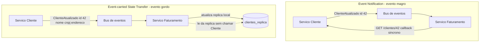

# Event-carried State Transfer vs Event Notification

> **Bloco:** Mensageria e streaming · **Nível:** Intermediário/Avançado · **Tempo de leitura:** ~22 min

## TL;DR

Quando dizemos "arquitetura orientada a eventos", estamos misturando padrões bem diferentes. Martin Fowler, no artigo *"What do you mean by Event-Driven?"*, separou-os. Dois deles estão em tensão direta: **Event Notification** e **Event-carried State Transfer**. Em **Event Notification**, o evento é magro — diz apenas "algo aconteceu" (ex.: `ClienteAtualizado{clienteId: 42}`) e o consumidor, se precisar de detalhes, faz uma **chamada de volta** ao produtor para buscá-los. Em **Event-carried State Transfer (ECST)**, o evento é gordo — carrega **todo o estado relevante** (ex.: `ClienteAtualizado{id, nome, endereco, telefone, ...}`), de modo que o consumidor **nunca precisa chamar de volta**: ele mantém sua própria réplica local dos dados. O trade-off é claro: notification minimiza acoplamento de dados e tamanho de payload mas reintroduz acoplamento de tempo de execução (o consumidor depende do produtor estar online para o callback); ECST elimina esse acoplamento de runtime e a latência do callback, ao custo de payloads maiores, dados replicados/eventualmente consistentes e o desafio da ordem dos eventos.

## O problema que resolve

Em uma arquitetura de microsserviços, o serviço B frequentemente precisa de dados que pertencem ao serviço A. A abordagem síncrona clássica é B chamar a API de A toda vez que precisa (REST/gRPC). Isso cria **acoplamento de runtime**: se A está lento ou fora do ar, B falha ou degrada. Em escala, isso vira uma teia de dependências síncronas onde a indisponibilidade de um serviço propaga falhas por toda a malha — o oposto de resiliência.

Eventos prometem quebrar esse acoplamento. Mas *como* exatamente o evento transporta a informação? É aqui que os dois padrões divergem. Se o evento só notifica ("o cliente 42 mudou"), B ainda precisa chamar A para saber *o que* mudou — então o acoplamento de runtime volta pela porta dos fundos, só que de forma menos óbvia e mais difícil de rastrear. Se o evento carrega o estado completo ("o cliente 42 agora é {...}"), B pode atualizar sua cópia local e nunca mais precisar de A — acoplamento de runtime de fato eliminado, mas agora B tem uma réplica dos dados de A que precisa manter consistente.

Fowler escreveu o artigo justamente porque, num workshop da Thoughtworks, percebeu-se que *"when people talk about 'events', they actually mean quite different things"*. Distinguir notification de ECST é o primeiro passo para discutir EDA sem falar línguas diferentes.

## O que é (definição aprofundada)

**Event Notification.** Um componente publica um evento para sinalizar que algo mudou, **sem** incluir os dados detalhados da mudança. O evento contém tipicamente um identificador e o tipo do acontecimento. Consumidores interessados reagem; se precisarem dos detalhes, fazem uma **query de volta** ao sistema de origem (uma API REST, por exemplo). Fowler descreve o benefício e o risco: notification gera baixo acoplamento *e* facilita uma armadilha — o fluxo lógico fica espalhado e difícil de enxergar, porque não há um lugar único que descreva a sequência completa. O evento é uma **mensagem-gatilho**, não uma **mensagem-dado**.

**Event-carried State Transfer (ECST).** O evento carrega consigo o **estado** necessário para que os consumidores ajam sem precisar voltar ao produtor. Nas palavras de Fowler, é o padrão que permite *"components to access data without calling the source"*. O consumidor mantém uma **réplica local** (uma view materializada) dos dados de que precisa, atualizada exclusivamente pelo fluxo de eventos. O produtor empurra o estado; o consumidor o persiste. Isso elimina o callback síncrono e, portanto, o acoplamento de runtime — o consumidor funciona mesmo se o produtor estiver fora do ar, porque já tem os dados localmente.

A diferença prática é o **conteúdo do evento** e a **propriedade dos dados**:

| Dimensão | Event Notification | Event-carried State Transfer |
|---|---|---|
| Payload | Magro (id + tipo) | Gordo (estado completo/relevante) |
| Callback ao produtor | Sim, para detalhes | Não, nunca |
| Acoplamento de runtime | Reintroduzido (no callback) | Eliminado |
| Dados no consumidor | Não replica | Réplica local materializada |
| Consistência | Lê o dado mais fresco de A | Eventualmente consistente |
| Tamanho/tráfego | Pequeno | Maior |

Termos-chave: **fat event / thin event** (evento gordo vs magro), **réplica local / view materializada** (cópia dos dados que o consumidor mantém), **acoplamento de runtime** (dependência de disponibilidade entre serviços), **eventual consistency** (a réplica fica desatualizada por um intervalo), **callback / query-back** (a chamada de volta do notification).

## Como funciona

**Event Notification na prática.** O serviço de Cliente publica `ClienteAtualizado{clienteId: 42, versao: 7}` no tópico `clientes.eventos`. O serviço de Faturamento, que está montando uma fatura, recebe o evento e percebe "preciso dos dados atualizados do cliente 42" — então faz `GET /clientes/42` na API do serviço de Cliente para obter nome, CNPJ, endereço. O evento foi apenas o gatilho; o dado veio por uma chamada síncrona. Vantagem: o serviço de Faturamento sempre lê o estado **mais recente** e não precisa armazenar dados de cliente. Desvantagem: se o serviço de Cliente estiver fora do ar no momento do callback, o Faturamento trava (ou precisa de fallback/retry); e há latência extra do round-trip.

**ECST na prática.** O serviço de Cliente publica `ClienteAtualizado{id: 42, nome, cnpj, endereco, telefone, versao: 7}` — o evento carrega o estado completo. O serviço de Faturamento consome e **atualiza sua tabela local `clientes_replica`** com esses dados. Quando precisa montar a fatura, lê de sua própria cópia local — **sem nenhuma chamada ao serviço de Cliente**. Mesmo que o serviço de Cliente esteja completamente offline por horas, o Faturamento continua faturando, usando a última versão que recebeu. O preço: a réplica do Faturamento pode estar momentaneamente desatualizada (eventual consistency), os dados de cliente agora existem em N lugares, e é preciso garantir que os eventos sejam aplicados na **ordem correta** (a `versao` no evento serve para descartar eventos fora de ordem ou antigos).

**O papel do log (Kafka) no ECST.** ECST combina especialmente bem com log-based streaming e **log compaction**. Um tópico compactado por chave (`clienteId`) retém sempre o **último** evento de cada chave, funcionando como uma tabela durável de "estado atual por entidade". Um novo consumidor pode ler o tópico do início e reconstruir a réplica completa — o log vira a fonte para materializar a view. Essa é exatamente a *stream-table duality* do Kafka Streams: o `KStream` de eventos vira uma `KTable` (a réplica). Por isso ECST e log-based streaming são parceiros naturais, enquanto notification funciona bem até com brokers tradicionais (o evento é só um gatilho leve).

**Ordem e idempotência.** No ECST, aplicar eventos fora de ordem corromperia a réplica (uma atualização antiga sobrescrevendo uma nova). A solução é a chave de partição garantir ordem por entidade (todos os eventos do cliente 42 na mesma partição) e/ou um número de versão/timestamp para o consumidor ignorar eventos obsoletos. Como o consumo é at-least-once, a aplicação do evento precisa ser **idempotente** (aplicar o mesmo evento duas vezes deixa a réplica no mesmo estado).

## Diagrama de fluxo



No topo, a seta de callback de volta ao serviço de Cliente revela o acoplamento de runtime reintroduzido. Embaixo, o serviço de Faturamento lê de sua réplica local e nunca chama o serviço de Cliente.

## Exemplo prático / caso real

**Marketplace — catálogo de produtos consumido por busca, carrinho e checkout.** O serviço de Catálogo é dono dos dados de produto (nome, preço, descrição, imagens). Vários serviços precisam desses dados: a Busca (indexa no Elasticsearch), o Carrinho (mostra itens), o Checkout (calcula total).

Com **Event Notification**, o Catálogo publicaria `ProdutoAtualizado{produtoId}` e cada serviço chamaria `GET /produtos/{id}` para buscar os dados. Problema: numa Black Friday, milhares de eventos por segundo gerariam uma tempestade de callbacks síncronos contra o Catálogo, que viraria gargalo e ponto único de falha — se ele cai, busca, carrinho e checkout caem junto.

Com **ECST**, o Catálogo publica `ProdutoAtualizado{id, nome, preco, descricao, ...}` em um tópico Kafka compactado por `produtoId`. Cada serviço mantém sua **réplica local** otimizada para seu uso: a Busca materializa direto no índice; o Carrinho guarda um cache enxuto. Resultado: o Checkout calcula o total lendo sua própria réplica, **sem tocar no Catálogo**. Se o Catálogo cai para deploy, o checkout continua funcionando com a última versão conhecida dos produtos. A contrapartida aceita: por alguns segundos, uma mudança de preço pode não ter propagado para todas as réplicas (eventual consistency) — geralmente tolerável, e mitigável com a `versao` do evento.

```text
// Produtor (Catalogo) - ECST, evento gordo
producer.send(topic="catalogo.produtos", key=produto.id,
              value={id, nome, preco, descricao, versao})

// Consumidor (Checkout) - mantem replica local
on event(e):
  if e.versao > replica.get(e.id).versao:   // ignora eventos antigos (ordem)
    replica.upsert(e.id, e)                  // idempotente
// Ao montar a fatura: le de replica, nunca chama o Catalogo
```

**Fintech — quando notification é a escolha certa.** Considere um evento `LimiteCreditoRecalculado{contaId}`. O valor do limite é dado **sensível** e que muda com regras complexas; replicá-lo em todos os consumidores aumentaria a superfície de exposição e o risco de usar um valor obsoleto numa decisão de crédito. Aqui **Event Notification** faz mais sentido: o evento avisa "recalculou o limite da conta X", e o serviço que vai *autorizar* uma transação chama a API de Crédito no momento exato da decisão, garantindo o valor **fresco e autoritativo**. O acoplamento de runtime, neste caso, é um preço aceitável pela necessidade de consistência forte e por não querer espalhar dado sensível.

## Quando usar / Quando evitar

**Prefira Event-carried State Transfer quando:**

- A **disponibilidade e resiliência** são prioritárias — o consumidor deve funcionar mesmo com o produtor offline.
- O dado é **lido com muito mais frequência do que muda** (replicar evita uma enxurrada de callbacks).
- **Eventual consistency é aceitável** para o caso de uso (catálogos, perfis, dados de referência).
- Você já usa **log-based streaming** com compaction, facilitando a materialização da réplica.

**Prefira Event Notification quando:**

- O consumidor precisa do **valor mais fresco e autoritativo** no momento da ação (decisões financeiras, autorização).
- O dado é **sensível** e replicá-lo amplia indevidamente a superfície de exposição.
- O dado é **grande/raramente necessário** — carregá-lo em todo evento desperdiçaria banda.
- A **consistência forte** importa mais que a resiliência ao produtor estar offline.

**Evite ECST quando** o dado muda muito mais do que é lido (você gera tráfego de eventos sem ninguém aproveitar a réplica), quando a consistência forte é inegociável, ou quando o custo de manter réplicas consistentes em muitos consumidores supera o benefício. **Evite Event Notification** como padrão default em arquiteturas que buscam resiliência: o acoplamento de runtime escondido nos callbacks é uma fonte silenciosa de falhas em cascata.

## Anti-padrões e armadilhas comuns

- **"EDA resiliente" feita só com Event Notification.** A equipe acha que adotou eventos e está desacoplada, mas todo consumidor faz callback síncrono ao produtor — o acoplamento de runtime continua lá, só mais difícil de ver e de monitorar. Falhas em cascata persistem.
- **Ignorar ordem no ECST.** Aplicar um evento antigo sobre um novo corrompe a réplica (preço volta ao valor anterior). Sem chave de partição garantindo ordem por entidade ou sem versionamento, a réplica diverge silenciosamente.
- **Réplica sem idempotência.** Como o consumo é at-least-once, o mesmo evento pode chegar duas vezes. Se o upsert não for idempotente, a réplica fica inconsistente após redelivery.
- **Evento gordo com dados demais (ou de menos).** ECST exige projetar o que vai no evento. Carregar dados que nenhum consumidor usa desperdiça banda e acopla o produtor a campos internos; carregar de menos força os consumidores a fazer callbacks, derrotando o propósito.
- **Tratar a réplica como fonte de verdade.** A réplica é uma view eventualmente consistente; a fonte de verdade continua sendo o produtor. Usar a réplica para operações que exigem o valor exato e atual (sem aceitar atraso) é um erro de consistência.
- **Misturar os padrões sem critério.** Usar ECST para dado que muda toda hora e notification para dado estável é inverter o trade-off. A escolha deve ser por caso, não por moda.
- **Esquecer da governança de schema.** No ECST, o schema do evento é um **contrato de dados** entre produtor e muitos consumidores. Mudar campos sem versionamento/compatibilidade (ex.: Schema Registry com regras de compat) quebra réplicas em produção.

## Relação com outros conceitos

Estes dois padrões são parte da taxonomia de **Event-Driven Architecture** de Fowler, ao lado de **Event Sourcing** e **CQRS** (a réplica materializada do ECST é, na prática, o lado *read* de um CQRS alimentado por eventos). ECST se apoia fortemente em **Log-based Streaming** e **log compaction** (Kafka) para materializar e reconstruir réplicas, e na *stream-table duality* do **Stream Processing** (Kafka Streams). Depende de **Partição e Consumer Groups** para garantir ordem por entidade, e de **idempotência** para aplicar eventos at-least-once com segurança. No nível de estilo, ECST é o que viabiliza **coreografia** verdadeiramente desacoplada em microsserviços (sem o acoplamento de runtime que a notification reintroduz), enquanto Event Notification se aproxima de uma integração orientada a eventos porém ainda dependente de chamadas síncronas — útil, mas com trade-offs de resiliência distintos.

## Referências

- [Martin Fowler — What do you mean by "Event-Driven"?](https://martinfowler.com/articles/201701-event-driven.html) — define Event Notification, Event-carried State Transfer, Event Sourcing e CQRS.
- [Martin Fowler — Event architectures (tag)](https://martinfowler.com/tags/event%20architectures.html) — coletânea de artigos sobre arquiteturas de eventos.
- [Martin Fowler — bliki: CQRS](https://martinfowler.com/bliki/CQRS.html) — separação de leitura e escrita, relacionada à réplica materializada do ECST.
- [Martin Fowler — Domain Event](https://martinfowler.com/eaaDev/DomainEvent.html) — conceito de evento de domínio.
- [Apache Kafka — Documentation](https://kafka.apache.org/documentation/) — log compaction e tópicos como tabela de estado por chave.
- [Confluent — Kafka Streams Basics](https://docs.confluent.io/platform/current/streams/concepts.html) — stream-table duality e materialização de views.
- [Apache Pulsar — Messaging](https://pulsar.apache.org/docs/next/concepts-messaging/) — entrega e subscrição que suportam padrões de eventos.
- *Designing Data-Intensive Applications*, Martin Kleppmann (O'Reilly, 2017) — Capítulos 11 e 12 sobre eventos, derivação de estado e replicação por logs.
