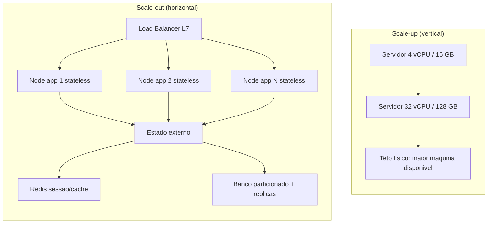
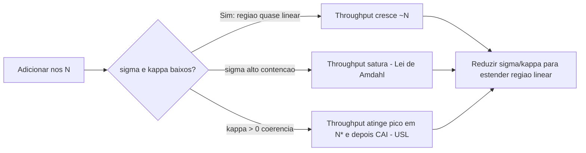

# Escalabilidade horizontal vs vertical

> **Bloco:** Performance e escalabilidade · **Nível:** Intermediário/Avançado · **Tempo de leitura:** ~22 min

## TL;DR

Escalar **verticalmente** (scale-up) é aumentar a capacidade de uma única máquina — mais CPU, mais RAM, NVMe mais rápido, mais largura de banda de rede. Escalar **horizontalmente** (scale-out) é adicionar mais máquinas e distribuir a carga entre elas. Scale-up é simples operacionalmente mas esbarra em um teto físico, é caro na margem (o último incremento de hardware custa desproporcionalmente caro) e mantém um ponto único de falha. Scale-out é o caminho para alta disponibilidade e elasticidade praticamente ilimitada, mas paga o preço da **complexidade distribuída**: estado compartilhado, coordenação, consistência, particionamento e a presença de overheads de contenção e coerência que a Universal Scalability Law modela explicitamente. Na prática você combina os dois: escala vertical até onde for barato e simples, escala horizontal o que for **stateless** e empurra o estado para componentes especializados (bancos, caches, filas) que escalam por particionamento/replicação. A pergunta arquitetural central não é "qual é melhor", e sim "o que neste sistema é serializável/compartilhado e como eu reduzo essa fração", porque é ela que limita o ganho real de adicionar nós.

## O problema que resolve

Todo sistema tem um limite de capacidade: um número de requisições por segundo, de transações concorrentes, de conexões simultâneas, de volume de dados que consegue servir dentro de um SLO de latência. Quando a demanda cresce — sazonalidade, crescimento orgânico, um pico de marketing — você precisa de mais capacidade sem degradar a experiência. Escalabilidade é a **propriedade de adicionar recursos para aumentar capacidade de forma previsível e econômica**.

Historicamente, a resposta padrão da indústria por décadas foi scale-up: comprar um servidor maior (mainframes, big-iron Unix, servidores de banco com dezenas de cores e centenas de GB de RAM). Era simples — o software não precisava saber nada sobre distribuição. O problema é que essa abordagem tem três limites duros. Primeiro, um **teto físico**: existe um servidor maior que você pode comprar, e depois dele não há mais nada. Segundo, **custo marginal não linear**: dobrar a capacidade de uma única máquina custa muito mais que o dobro, porque hardware de ponta é vendido com prêmio. Terceiro, **disponibilidade**: uma máquina é um ponto único de falha; manutenção, patch de kernel ou falha de hardware derrubam tudo.

A era da web e da computação em nuvem inverteu o default. Em vez de uma máquina grande e confiável, usa-se um grande número de máquinas commodity baratas e descartáveis, assumindo que falhas são rotina e tratando-as no software. Esse é o modelo que Google, Amazon e similares popularizaram. Mas distribuir não é grátis: a coordenação entre nós introduz overhead. **Gene Amdahl** (Lei de Amdahl, 1967) mostrou que a fração serial de um programa limita o speedup por mais processadores que você adicione. **Neil Gunther** generalizou isso com a **Universal Scalability Law (USL)**, que adiciona um segundo termo — a **coerência** (custo de manter dados consistentes entre nós) — capaz de fazer o throughput não só estagnar mas efetivamente *piorar* além de um ponto ótimo. Entender essas leis é o que separa escalar com método de simplesmente jogar máquinas no problema e torcer.

## O que é (definição aprofundada)

**Escalabilidade vertical (scale-up / scale-down):** alterar a capacidade de um nó individual. Você troca a instância `m5.xlarge` (4 vCPU, 16 GB) por uma `m5.8xlarge` (32 vCPU, 128 GB), ou adiciona RAM/CPU a um servidor físico. O *shape* da aplicação não muda — continua um processo numa máquina. O ganho é limitado por: (a) o maior nó disponível; (b) o quão bem o software usa múltiplos cores (paralelismo intra-processo, contenção de locks, GC); (c) gargalos que não são CPU (IO de disco, banda de rede, locks de banco).

**Escalabilidade horizontal (scale-out / scale-in):** adicionar ou remover nós e distribuir trabalho entre eles. Requer um mecanismo de **distribuição de carga** (load balancer L4/L7, sharding, consistent hashing) e uma estratégia para o **estado**. Aqui surge a distinção mais importante de design:

- **Serviços stateless:** não guardam estado de sessão localmente; qualquer nó atende qualquer requisição. Escalam horizontalmente de forma quase trivial — basta adicionar réplicas atrás de um load balancer. É por isso que a regra de ouro é *empurrar o estado para fora do nó de aplicação*.
- **Serviços stateful:** guardam dados (bancos, caches, brokers). Escalam horizontalmente por **particionamento (sharding)** — dividir os dados entre nós, cada um responsável por uma fatia — e/ou **replicação** — múltiplas cópias do mesmo dado para leitura e tolerância a falhas. Ambos introduzem problemas de consistência, rebalanceamento e roteamento.

**Elasticidade** é a capacidade de escalar horizontalmente *automaticamente e rápido* em resposta à carga (autoscaling). É uma propriedade que só scale-out oferece de verdade.

**Lei de Amdahl** (limite de speedup por paralelismo). Se *p* é a fração paralelizável de um trabalho e *N* o número de processadores:

```
Speedup(N) = 1 / ( (1 - p) + p/N )

Limite quando N -> infinito:  Speedup_max = 1 / (1 - p)
```

Se 5% do trabalho é serial (*p = 0,95*), o speedup máximo é 1/0,05 = **20x**, por mais cores que você jogue. A fração serial é o teto.

**Universal Scalability Law (Gunther)** — generaliza Amdahl adicionando o termo de coerência. Com *N* nós, *σ* (sigma) = coeficiente de **contenção** (fração serializada, fila por recurso compartilhado) e *κ* (kappa) = coeficiente de **coerência** (custo de sincronizar/consistir dados entre nós, cresce com *N(N-1)*):

```
C(N) = N / ( 1 + σ(N - 1) + κ·N·(N - 1) )
```

Quando *κ = 0*, a USL degenera na Lei de Amdahl. O termo *κ* é o que faz a curva ter um **ponto de máximo** (N* = sqrt((1-σ)/κ)) e depois **decair**: adicionar mais nós piora o throughput porque o custo de coordenação cresce quadraticamente. Esse é o insight central — sistemas distribuídos podem ter *retrocesso* de escalabilidade.

## Como funciona

**Scale-up** funciona porque o sistema operacional e o runtime aproveitam mais recursos no mesmo espaço de endereçamento: mais threads rodam em paralelo nos cores extras, mais dados cabem em cache de página/RAM, mais conexões cabem. Não há mudança de topologia. O limite aparece quando: o software não paraleliza (single-thread bound, GIL, hot lock global); o gargalo migra para IO ou rede; ou o GC/coerência de cache da CPU passa a dominar. Verticalmente, você também paga *downtime* para muitos resize (precisa reiniciar a instância), embora live-migration em nuvem mitigue parte disso.

**Scale-out** funciona pela coordenação de três peças:

1. **Distribuição.** Um load balancer (ELB/ALB, NGINX, Envoy, HAProxy) ou um esquema de hashing decide qual nó atende cada requisição. Round-robin, least-connections, hash por chave. Para stateful, consistent hashing minimiza o rebalanceamento quando nós entram/saem.
2. **Estado.** Sessão vai para um store externo (Redis, banco). Dados são particionados (shard por `customer_id`, por geografia, por hash) e/ou replicados (primário-réplica, multi-primário, quórum). Cada estratégia tem trade-off de consistência (CAP/PACELC) e de hot-spotting (uma shard quente vira gargalo).
3. **Coordenação.** Service discovery, health checks, draining de conexões, replicação de cache, sincronização de relógios. É aqui que mora *σ* e *κ* da USL: locks distribuídos, transações cross-shard, invalidação de cache em N nós, gossip de cluster.

A mecânica do ganho: enquanto a fração serializada (*σ*) e a coerência (*κ*) forem baixas, dobrar nós quase dobra throughput (região linear da USL). Conforme *σ* e *κ* crescem, cada nó adicional rende menos (sublinear), atinge um pico e depois — se *κ > 0* — o throughput agregado cai. **A engenharia de escalabilidade é, na prática, a redução sistemática de *σ* e *κ*:** eliminar locks globais, evitar transações distribuídas, particionar para reduzir coordenação, usar consistência eventual onde a coerência forte não é necessária, tornar serviços idempotentes e independentes.

## Diagrama de fluxo





## Exemplo prático / caso real

Marketplace brasileiro, véspera de Black Friday. O time de plataforma projeta o pico do **checkout** a partir do histórico e de Little's Law. Eles esperam **λ = 8.000 requisições/segundo** no endpoint de criação de pedido, e cada requisição leva em média **W = 120 ms** (0,12 s) para completar o ciclo (validação, reserva de estoque, criação do pedido, chamada ao gateway de pagamento). Pela Lei de Little, o número médio de requisições simultâneas em voo é:

```
L = λ × W = 8.000 × 0,12 = 960 requisições concorrentes
```

Isso significa que, no pico, há ~960 unidades de trabalho ativas ao mesmo tempo no serviço de checkout. Esse número dimensiona threads, conexões e nós.

**Opção vertical:** subir uma instância gigante (`c6i.32xlarge`, 128 vCPU). Problema: o serviço Java tem um lock de aplicação na reserva de estoque (fração serial) e o gateway de pagamento responde em p99 de 600 ms — o gargalo nem é CPU. Uma máquina única ainda é ponto único de falha num evento onde indisponibilidade custa milhões em GMV por minuto. Rejeitada como solução principal.

**Opção horizontal (escolhida):** o serviço de checkout é stateless (sessão no Redis, idempotência por `Idempotency-Key`). Dimensionam para suportar 960 concorrentes com folga: cada nó roda um pool de 50 conexões úteis (HikariCP, dimensionado pela própria fórmula da documentação do HikariCP, não inflado), e calculam ~**24 nós** atrás de um ALB para o pico, com autoscaling baseado em **p95 de latência** e CPU. O Redis e o banco escalam horizontalmente por sharding de `order_id`/`customer_id`. Observam tudo no **Prometheus/Grafana** com dashboards no estilo RED (rate, errors, duration) por serviço.

O detalhe que separa o sênior do júnior: durante o teste de carga, ao passar de 18 para 24 nós o throughput agregado **subiu menos do que o esperado** — sinal clássico de *κ > 0*. A causa: invalidação de cache de catálogo propagada para todos os nós e um lock pessimista na reserva de estoque criando contenção. Eles atacam *σ* e *κ*: trocam o lock pessimista por reserva otimista com retry idempotente e particionam o estoque por SKU, reduzindo a coordenação. Com isso, a curva volta a ser quase linear e os mesmos 24 nós passam a entregar o throughput-alvo dentro do SLO (p99 do checkout < 800 ms). Lição: jogar mais máquinas sem reduzir *σ*/*κ* teria sido caro e ineficaz.

## Quando usar / Quando evitar

**Prefira escala vertical quando:**

- A carga é moderada e o gargalo é claramente CPU/RAM em um workload que paraleliza bem dentro do processo.
- O componente é **stateful e difícil de particionar** (bancos relacionais monolíticos, por exemplo) — escala-se verticalmente o primário e horizontalmente as réplicas de leitura.
- Simplicidade operacional importa mais que disponibilidade extrema; o custo de reescrever para distribuição não se paga.
- Você ainda está longe do teto de hardware e o custo marginal é aceitável.

**Prefira escala horizontal quando:**

- Você precisa de **alta disponibilidade** (sem ponto único de falha) e **elasticidade** (autoscaling para picos como Black Friday).
- O serviço é ou pode tornar-se **stateless**.
- A demanda pode exceder o maior nó disponível.
- Você quer pagar pela capacidade de forma incremental e proporcional.

**Evite scale-out prematuro quando:** o sistema é pequeno, a complexidade distribuída (consistência, observabilidade, deploy, debugging) não se justifica, e *σ*/*κ* do seu design ainda são desconhecidos — distribuir um design com alta contenção só multiplica o problema. Meça antes.

## Anti-padrões e armadilhas comuns

- **Achar que scale-out é linear.** Ignorar a USL e assumir que 2x nós = 2x throughput. Quase nunca é verdade; meça o ponto de máximo e o decaimento.
- **Distribuir estado sem necessidade.** Manter sessão sticky no nó (sticky sessions) impede balanceamento real e cria hot-spots; um nó que cai derruba sessões. Empurre o estado para fora.
- **Escalar a aplicação e esquecer o banco.** Adicionar 50 nós de app que abrem 50 conexões cada satura o banco (2.500 conexões) e o derruba. O gargalo migra; dimensione o pool de conexões corretamente.
- **Lock global / hot lock.** Uma fração serial pequena (Amdahl) ou um lock distribuído (κ) destrói o ganho. Caçar e eliminar contenção é o trabalho real.
- **Vertical até o limite sem plano B.** Crescer numa máquina cada vez maior até bater no teto sem que o software esteja pronto para distribuir — depois não há para onde ir.
- **Autoscaling por métrica errada.** Escalar só por CPU quando o gargalo é IO/latência; o pool enche, a latência explode, mas a CPU está baixa e nada escala. Escale por p95/p99 de latência ou saturação de fila.

## Relação com outros conceitos

- **Lei de Little, Amdahl e USL** (arquivo 06 deste bloco) são a base teórica: Little dimensiona concorrência, Amdahl/USL explicam por que scale-out satura e decai. Escalabilidade é a aplicação dessas leis.
- **Latência vs throughput e percentis** (arquivo 02): você escala para manter o SLO de latência (p95/p99), não a média; autoscaling deve disparar por percentil.
- **Connection/thread pooling e async I/O** (arquivo 05): scale-up depende de paralelismo eficiente intra-processo; pools mal dimensionados são contenção (σ) disfarçada.
- **Caching em múltiplas camadas** (arquivo 04): reduz a carga que precisa ser escalada e, se mal feita (invalidação em N nós), vira fonte de κ.
- **Particionamento e replicação** (Bloco de Dados): a mecânica concreta de escalar componentes stateful horizontalmente; CAP/PACELC governa os trade-offs.
- **Observabilidade / USE-RED-Golden Signals** (arquivo 03): saturação e filas são os sinais que indicam quando e como escalar.

## Referências

- [Amdahl's law — Wikipedia](https://en.wikipedia.org/wiki/Amdahl%27s_law) — formulação clássica do limite de speedup por paralelismo.
- [How to Quantify Scalability — Universal Scalability Law (Neil Gunther, Performance Dynamics)](https://www.perfdynamics.com/Manifesto/USLscalability.html) — a USL completa com contenção (σ) e coerência (κ).
- [USL Scalability Modeling with Three Parameters — The Pith of Performance (Neil Gunther)](http://perfdynamics.blogspot.com/2018/05/usl-scalability-modeling-with-three.html) — modelagem prática da USL.
- [Neil J. Gunther — Wikipedia](https://en.wikipedia.org/wiki/Neil_J._Gunther) — contexto biográfico e origem da USL.
- [Little's law — Wikipedia](https://en.wikipedia.org/wiki/Little's_law) — L = λW, base para dimensionar concorrência ao escalar.
- [Static stability using Availability Zones — Amazon Builders' Library](https://aws.amazon.com/builders-library/static-stability-using-availability-zones/) — escala horizontal e disponibilidade com estabilidade estática em nuvem.
- [About Pool Sizing — HikariCP Wiki](https://github.com/brettwooldridge/HikariCP/wiki/About-Pool-Sizing) — por que pools menores escalam melhor; gargalo no banco ao escalar app.
