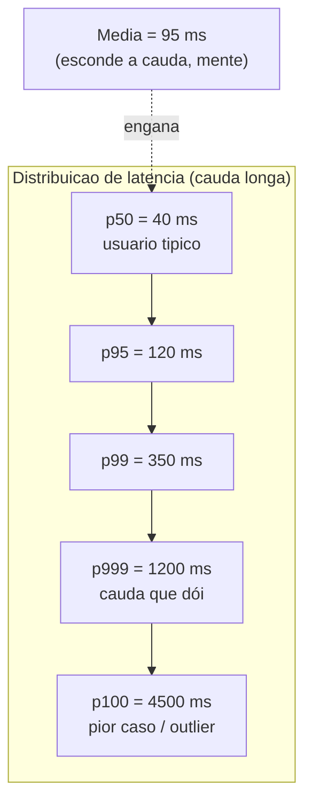
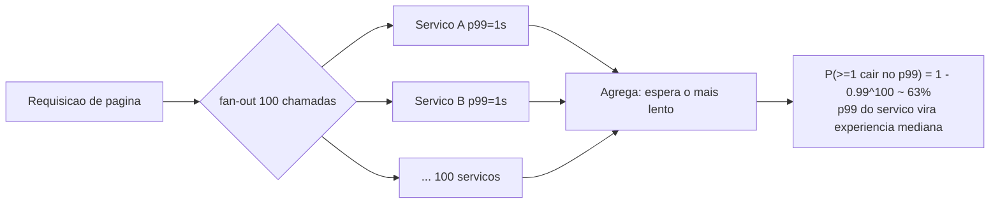

# Latência vs Throughput e como medir (p50, p95, p99, p999)

> **Bloco:** Performance e escalabilidade · **Nível:** Intermediário/Avançado · **Tempo de leitura:** ~23 min

## TL;DR

**Latência** é o tempo de resposta de uma operação individual; **throughput** é a taxa de operações concluídas por unidade de tempo. São propriedades distintas e frequentemente em tensão: otimizar throughput (batching, filas, mais concorrência) costuma aumentar a latência de cauda, e vice-versa. A latência **nunca** deve ser resumida pela média — ela esconde a cauda, que é justamente o que os usuários sentem. Use **percentis**: p50 (mediana, o usuário típico), p95, p99, p999 (um em mil) e p100 (pior caso). Em sistemas com fan-out, a latência do *p99 de um único serviço* vira a *latência típica* da requisição agregada — esse é o efeito de amplificação de cauda. Medir certo exige histogramas (não médias pré-agregadas), atenção a **coordinated omission** (Gil Tene) e percentis calculados na origem correta. Percentis são a ponte para **SLI/SLO**: você define o objetivo como "p99 < 300 ms em 99,9% do tempo", não como "latência média < 150 ms", porque a média é otimista e mente sobre a experiência real.

## O problema que resolve

Quando alguém diz "o sistema está rápido", precisa-se desambiguar *o quê*. Há duas perguntas independentes. "Quanto tempo leva uma operação?" é latência. "Quantas operações por segundo o sistema aguenta?" é throughput. Confundi-las leva a decisões erradas: um sistema com altíssimo throughput pode ter latência horrível para requisições individuais (pense em um pipeline batch), e um sistema com latência baixíssima por requisição pode ter throughput pífio se não paraleliza.

O problema mais insidioso, porém, é *como reportar latência*. A prática histórica de usar a **média** (ou pior, a "latência média no dashboard") é profundamente enganosa. Latência não é normalmente distribuída — é uma distribuição de cauda longa, assimétrica à direita. A grande maioria das requisições é rápida, mas uma fração é muito lenta (GC pause, contenção de lock, cache miss, retry, fila cheia, vizinho barulhento). A média é puxada por essa cauda de forma imprevisível e, ao mesmo tempo, *esconde* o quão ruim a cauda é. Uma média de 50 ms pode conviver com um p99 de 2 segundos. O usuário cujo request caiu no p99 não experimenta "50 ms em média" — experimenta 2 segundos, e provavelmente abandona.

**Gil Tene** (autor da palestra "How NOT to Measure Latency") popularizou a crítica de que olhar média e até p99 isolado pode ser insuficiente, e cunhou o termo **coordinated omission**: a armadilha em que o instrumento de medição *coordena* com o sistema medido de um jeito que faz desaparecer os outliers — tipicamente quando o load generator espera a resposta antes de enviar o próximo request, então um request lento "trava" todos os que deveriam ter sido enviados durante a lentidão, e eles nunca são contados. O resultado é uma medição que parece ótima e está completamente errada justamente nos momentos ruins. O **Google SRE** e a comunidade de observabilidade consolidaram percentis como a forma correta de definir e medir objetivos de serviço (SLO).

## O que é (definição aprofundada)

**Latência:** o intervalo entre o início de uma requisição e a disponibilidade de sua resposta. Medida em unidades de tempo (ms, µs). Atenção a *de onde* você mede: latência do servidor (service time) é diferente de latência percebida pelo cliente (inclui rede, fila, retries). É preciso também distinguir **latência de requisições bem-sucedidas vs falhas** — uma falha rápida (fail-fast) pode mascarar problemas se você não separar.

**Throughput:** taxa de trabalho concluído — requisições/segundo (RPS/QPS), transações/segundo (TPS), mensagens/segundo, bytes/segundo. É a vazão. Limitado por gargalos: CPU, IO, banda, locks, pool de conexões.

A relação entre os dois é mediada por **concorrência**, e a ponte é a **Lei de Little**: `L = λ × W`, onde *L* é o número médio de itens no sistema (concorrência), *λ* é o throughput (taxa de chegada/saída em estado estável) e *W* é a latência média no sistema. Reorganizando: `λ = L / W`. Para um nível fixo de concorrência *L*, throughput e latência são *inversamente* relacionados: se a latência *W* sobe (por contenção), o throughput *λ* que aquele *L* sustenta cai. Conforme você empurra o throughput para perto da saturação, a latência dispara de forma não linear (teoria de filas: a partir de ~70-80% de utilização, o tempo de fila cresce assintoticamente).

**Percentis.** Ordene todas as latências de um intervalo. O percentil **pN** é o valor abaixo do qual estão N% das amostras:

- **p50 (mediana):** metade das requisições foram mais rápidas que isso. O usuário "típico".
- **p95:** 95% mais rápidas; 1 em 20 foi pior.
- **p99:** 1 em 100 foi pior. Cauda relevante para SLO.
- **p999 (p99.9):** 1 em 1.000 foi pior. Usuários de alto volume veem isso o tempo todo.
- **p100 (máximo):** o pior caso absoluto. Ruidoso, mas útil para detectar outliers catastróficos.

Por que percentis altos importam mais do que parece: um usuário que faz **muitas** requisições por sessão tem alta probabilidade de encostar na cauda. Se uma página faz 100 chamadas internas e cada uma tem p99 de 1 s, a probabilidade de *pelo menos uma* das 100 cair no p99 é `1 − 0,99^100 ≈ 63%`. Ou seja: o p99 *de um serviço* vira a experiência *mediana* de uma página com fan-out de 100. Isso é **amplificação de cauda (tail amplification)** e é a razão pela qual sistemas com micro-serviços precisam de p99 baixíssimos nos serviços individuais.

## Como funciona

**Medição correta de percentis** não se faz guardando médias. Você precisa preservar a *distribuição*. As abordagens:

1. **Histogramas.** Buckets de latência (ex.: <1ms, <2ms, <5ms, ...). Conta-se quantas amostras caem em cada bucket. O percentil é estimado interpolando o bucket onde o N% acumulado é atingido. Prometheus usa esse modelo (`histogram_quantile()` sobre buckets cumulativos). Trade-off: a precisão depende da resolução dos buckets; buckets grandes erram a estimativa na cauda.
2. **Estruturas de quantis aproximados.** HdrHistogram (de Gil Tene) é o padrão-ouro para alta precisão em latência: buckets logarítmicos cobrindo de microssegundos a horas com erro limitado, e — crucialmente — **correção de coordinated omission** embutida. t-digest e DDSketch são alternativas para sistemas distribuídos.

**A regra cardinal: percentis não se mediam.** Você não pode tirar a média de p99 de 10 servidores e obter o p99 do conjunto. Isso é matematicamente errado. É preciso **agregar os histogramas/buckets** e recalcular o percentil sobre a distribuição combinada. Dashboards que fazem `avg(p99)` por engano produzem números sem sentido.

**Coordinated omission**, em detalhe: imagine um load generator que dispara 1 request a cada 1 ms (esperando 1.000 RPS) mas espera a resposta antes do próximo. Se um request leva 1 segundo (em vez de 1 ms), durante esse segundo *mil requests que deveriam ter sido enviados não foram*. Esses mil "perdidos" teriam latência crescente (999 ms, 998 ms, ...) e jamais são registrados. O resultado: você mediu *um* request lento e *zero* dos mil que a fila real teria acumulado. O p99 reportado fica artificialmente baixo. A correção (HdrHistogram, ou geradores como wrk2) é registrar a latência *como se* o request tivesse sido enviado no horário planejado — contabilizando o tempo de espera não-enviado. Sem isso, sua medição é cega justamente quando o sistema está sofrendo.

**Como ligar a SLO/SLI:** define-se um **SLI** (indicador) como "fração de requisições servidas em menos de X ms" e um **SLO** (objetivo) como "99,9% das requisições com latência < 300 ms ao longo de 28 dias". O **error budget** é o complemento (0,1%). Isso é mensurável, é honesto sobre a cauda e é o que se monitora — não a média.

## Diagrama de fluxo





## Exemplo prático / caso real

Fintech brasileira, API de autorização de pagamento PIX. SLO definido com o time de produto: **99,9% das autorizações com latência < 250 ms**, medida no edge (latência percebida pelo cliente). Throughput de pico esperado: **5.000 TPS**.

No dashboard inicial, a equipe via "latência média 80 ms" e dormia tranquila. Até que reclamações de timeouts de parceiros começaram. Ao instrumentar com **HdrHistogram** na aplicação e expor para **Prometheus**, com painéis **Grafana** mostrando p50/p95/p99/p999, o quadro real apareceu:

- p50 = 45 ms (ótimo)
- p95 = 110 ms (ok)
- p99 = 380 ms (acima do SLO!)
- p999 = 1.400 ms (timeout de parceiro = 1.000 ms, então 0,1% das transações estourava)

A média de 80 ms estava escondendo que 1 em 100 transações violava o SLO e 1 em 1.000 dava timeout. Investigando a cauda com tracing distribuído, encontraram dois culpados: **GC pauses** (stop-the-world de ~300 ms a cada poucos minutos na JVM, batendo no p99) e **cache stampede** no preço de risco quando uma chave expirava sob carga, serializando milhares de requests num recálculo (cauda extrema do p999).

Aplicando Little's Law para dimensionar: com λ = 5.000 TPS e meta de W = 0,12 s (folga sobre os 250 ms), a concorrência alvo é `L = λ × W = 5.000 × 0,12 = 600` operações em voo — o que dimensionou pools e nós. Correções: tuning de GC (G1 com pausa-alvo menor, depois ZGC), e *single-flight* + soft/hard TTL no cache para matar o stampede. Resultado pós-correção: p99 = 180 ms, p999 = 320 ms, SLO cumprido com error budget de sobra. A lição operacional ficou registrada: **nenhum SLO é definido sobre média; alertas disparam em p99/p999 e em violação de error budget**, nunca em média de CPU.

```text
# Pseudocódigo: percentil correto vs errado
errado:  alerta_se( avg(latencia) > 150ms )            # mente
errado:  p99_global = avg(p99_por_servidor)            # matematicamente inválido
certo:   p99_global = histogram_quantile(0.99, sum(rate(bucket[5m])) by (le))
certo:   alerta_se( p99 > 250ms OR error_budget_burn_rate alto )
```

## Quando usar / Quando evitar

**Use percentis (p95/p99/p999) sempre que:**

- Definir SLI/SLO de serviços user-facing.
- A experiência do usuário importa (qualquer API síncrona, página, checkout).
- Há fan-out: a cauda de cada serviço amplifica.
- Dimensionar autoscaling — escale por p95/p99 de latência ou saturação, não por média.

**Use throughput como métrica primária quando:**

- O workload é batch/assíncrono e ninguém espera resposta imediata (ETL, processamento de filas, geração de relatórios). Aqui maximizar vazão e custo-por-operação é o objetivo, e latência por item importa pouco.
- Você está medindo capacidade do sistema (RPS máximo antes da saturação).

**Cuidado / evite:**

- Confiar na média para latência — praticamente nunca é correto.
- Otimizar throughput cegamente em sistemas síncronos: batching e filas aumentam a latência de cauda.
- p100 como SLO: é ruidoso demais (um único outlier o domina); use-o para *detectar* anomalias, não como objetivo.

## Anti-padrões e armadilhas comuns

- **Olhar só a média.** O anti-padrão número um. A média esconde a cauda e é o que o usuário *não* experimenta.
- **Coordinated omission.** Load generators que esperam a resposta antes do próximo request medem latência otimista e falsa sob estresse. Use wrk2, HdrHistogram, ou geradores com schedule fixo.
- **Promediar percentis entre nós.** `avg(p99)` não é o p99 do conjunto. Agregue histogramas.
- **Misturar latência de sucesso e de falha.** Falhas rápidas (fail-fast) baixam o p99 e escondem que o sistema está rejeitando requests. Separe.
- **Buckets de histograma mal escolhidos.** Resolução ruim na cauda faz o p999 estimado ser lixo. Use escala logarítmica (HdrHistogram).
- **Medir só no servidor.** O p99 do server pode estar ótimo enquanto o cliente sofre com fila, rede e retries. Meça também no edge/cliente.
- **SLO sobre throughput quando o problema é latência** (e vice-versa). Defina o SLO sobre a dimensão que importa para o usuário daquele serviço.

## Relação com outros conceitos

- **Lei de Little** (arquivo 06): a ponte algébrica entre latência, throughput e concorrência; dimensiona pools e nós.
- **SLI/SLO/error budget** (Bloco de Observabilidade): percentis *são* a definição prática de SLI de latência; alertas disparam por percentil e burn rate.
- **Four Golden Signals / RED** (arquivo 03): "duration/latency" é um dos sinais; medido sempre como distribuição de percentis.
- **Escalabilidade** (arquivo 01): autoscaling deve disparar por p95/p99, não por média; perto da saturação a latência explode (teoria de filas).
- **Caching** (arquivo 04) e **pooling/async** (arquivo 05): cache stampede, GC e contenção de pool são as causas-raiz clássicas da cauda (p99/p999).

## Referências

- [Monitoring Distributed Systems — Google SRE Book](https://sre.google/sre-book/monitoring-distributed-systems/) — latência como Golden Signal; por que distinguir sucesso de falha e usar distribuições.
- [Everything You Know About Latency Is Wrong — Brave New Geek](https://bravenewgeek.com/everything-you-know-about-latency-is-wrong/) — síntese da palestra de Gil Tene e do problema de medir latência.
- [On Coordinated Omission — ScyllaDB](https://www.scylladb.com/2021/04/22/on-coordinated-omission/) — explicação detalhada de coordinated omission e como corrigir.
- [If P99 Latency is BS, What's the Alternative? — P99 CONF](https://www.p99conf.io/2023/09/14/if-p99-latency-is-bs-whats-the-alternative/) — discussão sobre limites do p99 e percentis mais altos.
- [What Is P99 Latency? — Aerospike](https://aerospike.com/blog/what-is-p99-latency/) — definição prática de p99 e cauda de latência.
- [Little's law — Wikipedia](https://en.wikipedia.org/wiki/Little's_law) — L = λW, relação entre latência, throughput e concorrência.
- [Timeouts, retries, and backoff with jitter — Amazon Builders' Library](https://aws.amazon.com/builders-library/timeouts-retries-and-backoff-with-jitter/) — usar o percentil p99.9 do downstream para escolher timeouts.
