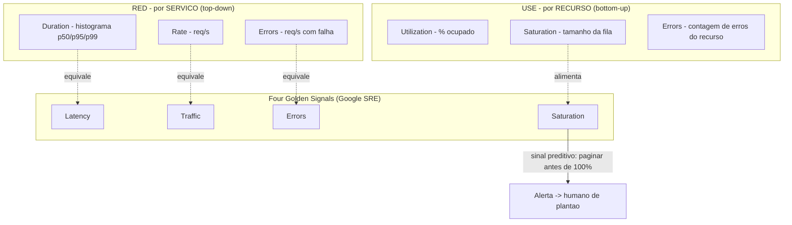
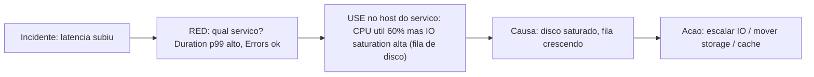

# USE Method, RED Method e Four Golden Signals

> **Bloco:** Performance e escalabilidade · **Nível:** Intermediário/Avançado · **Tempo de leitura:** ~22 min

## TL;DR

Três metodologias de monitoramento, complementares, cada uma respondendo a uma pergunta diferente sobre saúde de sistema. **USE** (Brendan Gregg) é orientada a **recursos**: para cada recurso (CPU, memória, disco, rede, fila), meça **U**tilization, **S**aturation, **E**rrors — ótima para diagnóstico de gargalos de infraestrutura. **RED** (Tom Wilkie) é orientada a **serviços/requisições**: para cada serviço, meça **R**ate (req/s), **E**rrors (req/s com erro) e **D**uration (distribuição de latência) — ótima para a saúde de microsserviços do ponto de vista de quem chama. **Four Golden Signals** (Google SRE) é a síntese para sistemas user-facing: **Latency, Traffic, Errors, Saturation** — combina a visão de requisição (latency, traffic, errors) com a de recurso (saturation). Regra prática: USE para *resources* (do lado de baixo, infra), RED para *services* (do lado de cima, requisições), Golden Signals como o conjunto canônico para alertar humanos. As três se encaixam: RED ≈ Golden Signals sem saturation; USE cobre o saturation/errors de recurso que o RED não vê.

## O problema que resolve

Quando um sistema degrada, a pergunta sob pressão é "o que eu olho primeiro?". Sem método, o engenheiro abre dez dashboards, olha cem métricas e perde tempo precioso. As três metodologias existem para dar uma **checklist disciplinada** — como a checklist de um piloto — que cobre o sistema de forma completa e rápida, evitando pontos cegos e evitando afogar-se em métricas irrelevantes.

**Brendan Gregg** criou o **USE Method** explicitamente como uma "checklist de emergência": ele percebeu que engenheiros gastavam tempo demais olhando as métricas erradas durante incidentes de performance. A ideia é que, para *qualquer recurso de hardware/sistema*, três métricas bastam para identificar saturação e gargalo cedo: utilização, saturação e erros. É exaustivo por recurso e foca em achar o gargalo sistêmico rapidamente, antes de mergulhar em detalhes. Gregg observou também a limitação: USE é sobre *recursos físicos/lógicos* (disco, CPU, interfaces de rede), não sobre serviços de aplicação.

**Tom Wilkie** criou o **RED Method** (por volta de 2015) justamente porque USE não se aplica bem a serviços. Em uma arquitetura de microsserviços, você quer uma visão **homogênea**: cada serviço, independentemente do que faz, expõe as mesmas três métricas (rate, errors, duration). Isso permite dashboards padronizados, escala a equipe de operações e — palavra dele — permite "colocar pessoas de plantão para código que não escreveram", porque a forma de olhar a saúde é sempre a mesma. RED é a visão *do consumidor* do serviço.

**Google SRE** consolidou os **Four Golden Signals** no livro *Site Reliability Engineering* (capítulo "Monitoring Distributed Systems") como a recomendação destilada: se você só pudesse medir quatro métricas de um sistema user-facing, meça latency, traffic, errors e saturation, e pagine um humano quando alguma estiver problemática (ou, no caso de saturation, *quase* problemática). É a fusão pragmática das outras duas visões.

## O que é (definição aprofundada)

### USE Method (recursos)

Para **cada recurso**, meça:

- **Utilization (Utilização):** percentual do tempo em que o recurso esteve ocupado servindo trabalho, em um intervalo. Ex.: "disco a 90% de utilização". Para alguns recursos (memória), utilização é a fração de capacidade usada.
- **Saturation (Saturação):** o grau em que o recurso tem trabalho *enfileirado* que não consegue servir — a fila de espera. Ex.: "comprimento médio da run-queue da CPU = 4", swap em uso, fila de IO. Saturação > 0 já significa que há espera; é o sinal mais sensível de pressão.
- **Errors (Erros):** contagem de eventos de erro do recurso. Ex.: erros de IO, pacotes descartados, ECC errors, retransmissões. Devem ser investigados mesmo quando recuperáveis, pois degradam performance silenciosamente.

A receita: enumere todos os recursos (CPUs, memória, controladores de disco, interfaces de rede, barramentos, file descriptors, locks), e para cada um preencha U, S, E. O recurso com saturação alta ou erros é o gargalo. É um método *bottom-up*, de infraestrutura.

### RED Method (serviços/requisições)

Para **cada serviço**, meça:

- **Rate (Taxa):** requisições por segundo que o serviço está processando. É o *throughput* / tráfego de entrada.
- **Errors (Erros):** número (ou taxa) de requisições que falham por segundo — HTTP 5xx, exceptions, timeouts. Frequentemente expresso como taxa de erro (% das requisições).
- **Duration (Duração):** a *distribuição* do tempo que as requisições levam — sempre como histograma/percentis (p50, p95, p99), nunca média.

RED é *top-down*, do ponto de vista de quem consome o serviço. Funciona uniformemente para qualquer serviço de request/response e é a base de dashboards padronizados em arquiteturas de microsserviços com Prometheus/Grafana.

### Four Golden Signals (Google SRE)

- **Latency (Latência):** tempo para servir uma requisição; distinguir latência de sucesso vs falha (uma falha rápida pode mascarar problema).
- **Traffic (Tráfego):** demanda sobre o sistema (RPS, transações/s, IO/s). Equivale ao *Rate* do RED.
- **Errors (Erros):** taxa de requisições que falham (explícitas: 5xx; implícitas: 200 com conteúdo errado; por política: latência acima do limite).
- **Saturation (Saturação):** quão "cheio" está o sistema — a fração mais restrita de um recurso (memória, IO, CPU, conexões). É o sinal preditivo: serviços degradam *antes* de 100% de utilização, então sature em ~70-80%.

**Como as três se relacionam, com precisão:** RED ≈ Golden Signals **menos** saturation (Rate=Traffic, Errors=Errors, Duration=Latency). Golden Signals adiciona explicitamente **saturation**, que vem da visão de recurso do **USE**. E USE traz o *errors* e *saturation de recurso* (fila de disco, swap) que nem RED nem latency/traffic capturam. Em resumo: **RED para serviços + USE para recursos = cobertura completa, e os Golden Signals são o subconjunto canônico que você pagina.**

## Como funciona

A mecânica operacional combina as três camadas:

1. **Instrumentação RED na borda de cada serviço.** Cada handler emite: contador de requisições (rate), contador de erros (errors), e um histograma de latência (duration). Em Prometheus, tipicamente `http_requests_total{status}` (counter) e `http_request_duration_seconds_bucket` (histogram). Dashboards Grafana padronizados por serviço.

2. **Instrumentação USE na infraestrutura.** Exporters (node_exporter, cAdvisor) expõem utilização e saturação de CPU (run-queue via load average / `node_pressure`), memória (uso + swap + OOM), disco (utilização + fila + erros de IO), rede (banda + drops + erros). Para cada recurso, painel U/S/E.

3. **Golden Signals como camada de alerta.** Sobre RED+USE você define os alertas que paginam humanos: latência p99 acima do SLO, taxa de erro acima do budget, saturação se aproximando do limite. **Saturação é o sinal antecipatório** — você quer ser paginado quando a fila começa a crescer, não quando o sistema já caiu.

**Por que saturação é o pivô:** a teoria de filas diz que o tempo de espera cresce de forma não linear conforme a utilização se aproxima de 100%. Um recurso a 95% de utilização pode estar com fila explodindo e latência catastrófica. Por isso o USE mede *saturação* (fila) e não só utilização — e por isso os Golden Signals incluem saturação como sinal próprio. Olhar só utilização (ex.: CPU a 70%) e concluir "está tudo bem" é um erro: o gargalo pode ser fila de IO ou pool de conexões esgotado, com CPU baixa.

**Sinais black-box vs white-box:** Golden Signals e RED são frequentemente medidos como *white-box* (instrumentação interna) mas também devem ter contrapartida *black-box* (sonda externa que mede a experiência real do usuário). O SRE recomenda ambos: white-box para causa, black-box para sintoma real.

## Diagrama de fluxo





## Exemplo prático / caso real

E-commerce brasileiro, plataforma de microsserviços, durante uma campanha de Dia das Mães. O time de SRE opera com **Prometheus + Grafana** e padronizou três camadas de painel.

**Camada RED (por serviço).** O dashboard do serviço `carrinho` mostra: Rate subindo de 1.200 para 4.500 req/s (esperado), Errors em 0,2% (ok), Duration p99 saltando de 90 ms para 1,8 s (problema). O alerta de SLO de latência (p99 < 400 ms) dispara e pagina o on-call. RED localizou *qual* serviço dói.

**Camada USE (no host/pod do serviço).** O engenheiro abre o painel USE do `carrinho`: CPU em 55% de utilização (não é CPU), memória ok, mas a **saturação do pool de conexões com o banco** está em 100% (fila de espera por conexão crescendo) e o **node_exporter** mostra `iowait` alto na réplica de leitura. A saturação — não a utilização — apontou o gargalo: o pool HikariCP estava subdimensionado para o pico, requests enfileiravam esperando conexão, e a latência da fila dominava o p99.

**Camada Golden Signals (alertas).** Os alertas configurados eram: Latency (p99 do carrinho > 400 ms — disparou), Traffic (para detectar quedas anômalas — ok), Errors (taxa de 5xx > budget — ok), Saturation (pool de conexões > 85% e iowait > 30% — **disparou junto**, confirmando a causa). O alerta de saturação foi o que deu o diagnóstico, exatamente o papel preditivo que o SRE prescreve.

A correção: redimensionar o pool de conexões pela fórmula da documentação do HikariCP (não inflar — pool grande demais piora), adicionar uma réplica de leitura e um cache de leitura de catálogo. Pós-correção, p99 do carrinho voltou para 110 ms sob 5.000 req/s. O insight para o post-mortem: **olhar só utilização teria escondido o problema** (CPU estava confortável); foi a *saturação* (fila de conexões + iowait) que revelou a causa — exatamente a razão de USE separar utilização de saturação e de os Golden Signals tratarem saturation como sinal de primeira classe.

```text
# RED em PromQL (esquema)
rate(http_requests_total[5m])                                  # Rate
rate(http_requests_total{status=~"5.."}[5m])                   # Errors
histogram_quantile(0.99, rate(http_request_duration_bucket[5m])) # Duration p99

# Saturation (Golden / USE)
pool_connections_waiting > 0                                    # fila no pool = saturacao
node_pressure_io_waiting_seconds                                # iowait = saturacao de disco
```

## Quando usar / Quando evitar

- **Use USE** para diagnosticar gargalos de **infraestrutura/recurso**: CPU, memória, disco, rede, file descriptors, pools, locks. É a ferramenta de quem investiga "por que o host/serviço está lento por baixo". Excelente em incidentes de performance de sistema. Menos útil isolado para entender a experiência do usuário.
- **Use RED** como o **dashboard padrão de cada serviço** em arquitetura de microsserviços/request-response. Homogêneo, escalável para muitos serviços, ideal para on-call de código alheio. Pouco aplicável a workloads não-request (batch, streaming contínuo) e não captura saturação de recurso interno.
- **Use Four Golden Signals** como o **conjunto canônico de alertas** de qualquer sistema user-facing — é a recomendação SRE de "se só puder medir quatro coisas". Combine com black-box probes.

**Quando evitar/limitar:** não tente forçar USE em serviços de aplicação (foi feito para recursos) nem RED em recursos físicos. Para sistemas batch/ETL, métricas de throughput, lag e tempo de conclusão fazem mais sentido que duration de request. Não confunda muitas métricas com boa observabilidade — o valor das três metodologias é justamente *restringir* ao que importa.

## Anti-padrões e armadilhas comuns

- **Monitorar utilização e ignorar saturação.** CPU a 70% "parece ok" enquanto a fila de IO ou o pool de conexões está saturado e a latência explode. Saturação é o sinal sensível; meça-a.
- **Duration como média.** "Duration" no RED é *distribuição* (percentis), nunca média. Média esconde a cauda (ver arquivo 02).
- **Misturar latência de sucesso e falha.** Falhas rápidas baixam a duration e mascaram que o serviço está rejeitando requests; separe sucesso de erro.
- **Alertar em sintomas demais (alert fatigue).** Paginar em toda métrica de recurso gera ruído. Os Golden Signals existem para focar o que realmente paga humano; alerte em sintoma (SLO), use USE/RED para diagnóstico.
- **Esquecer a saturação preditiva.** Alertar só quando o sistema já caiu, em vez de quando a fila começa a crescer. Sature em ~70-80%.
- **Só white-box.** Instrumentação interna ótima, mas sem sonda externa você não vê quedas de rede/DNS/CDN que o usuário sente. Combine white-box e black-box.

## Relação com outros conceitos

- **Latência e percentis** (arquivo 02): Duration/Latency são sempre medidos como distribuição de percentis; a base estatística vem daquele conceito.
- **SLI/SLO/error budget** (Bloco de Observabilidade): os Golden Signals são os SLIs canônicos; alertas disparam por violação de SLO e burn rate, não por threshold cru.
- **Escalabilidade** (arquivo 01): saturação (fila) é o gatilho correto de autoscaling — escale quando a fila cresce, não pela média de CPU.
- **Pooling e async** (arquivo 05): pool de conexões esgotado é o exemplo clássico de *saturação* invisível à utilização de CPU.
- **Observabilidade (métricas, logs, traces)**: RED/USE são metodologias de *métricas*; traces explicam o *porquê* da cauda que o RED revela.

## Referências

- [The USE Method — Brendan Gregg](https://www.brendangregg.com/usemethod.html) — definição canônica de Utilization, Saturation, Errors por recurso.
- [Thinking Methodically about Performance — ACM Queue (Brendan Gregg)](https://queue.acm.org/detail.cfm?id=2413037) — artigo formal do USE Method.
- [The RED Method: How to Instrument Your Services — Grafana Labs (Tom Wilkie)](https://grafana.com/blog/the-red-method-how-to-instrument-your-services/) — Rate, Errors, Duration por serviço.
- [The RED Method: A New Approach to Monitoring Microservices — The New Stack](https://thenewstack.io/monitoring-microservices-red-method/) — contexto da criação do RED por Tom Wilkie e por que USE não basta para serviços.
- [Monitoring Distributed Systems — Google SRE Book](https://sre.google/sre-book/monitoring-distributed-systems/) — os Four Golden Signals (latency, traffic, errors, saturation).
- [Monitoring — Google SRE Workbook](https://sre.google/workbook/monitoring/) — práticas atualizadas de monitoramento sobre os Golden Signals.
- [RED and USE Metrics for Monitoring and Observability — Better Stack](https://betterstack.com/community/guides/monitoring/red-use-metrics/) — comparação prática entre USE e RED.
