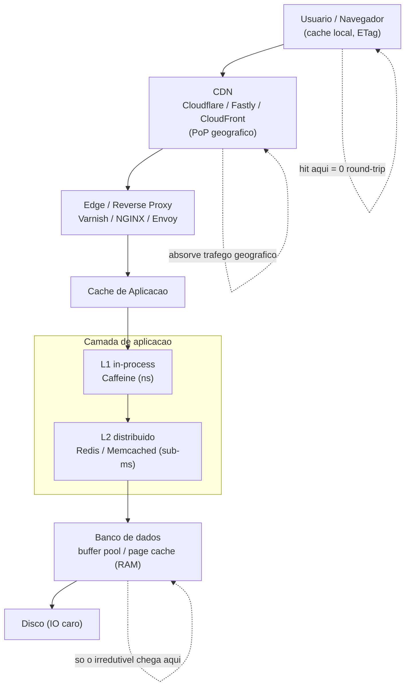
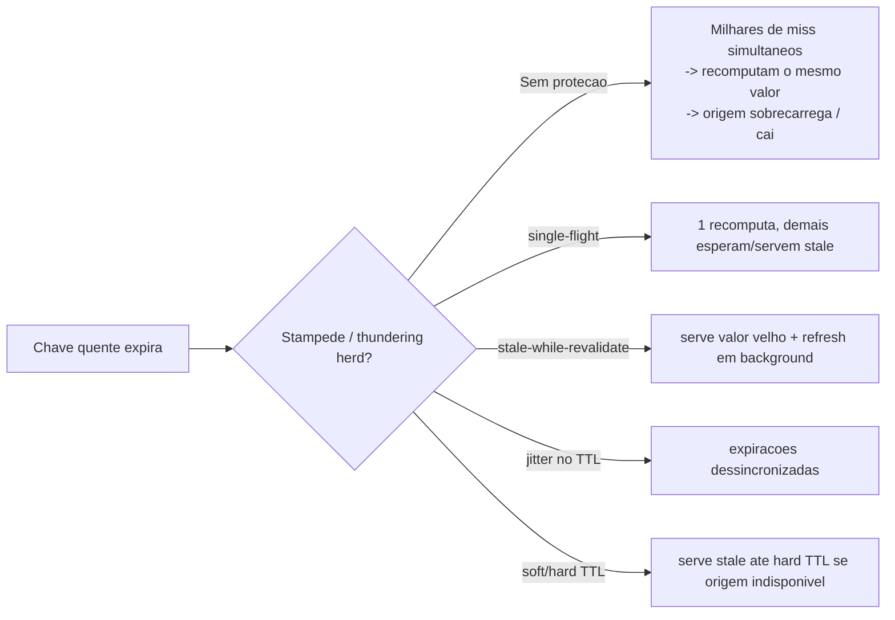

# Caching em múltiplas camadas: CDN, edge, aplicação, banco

> **Bloco:** Performance e escalabilidade · **Nível:** Intermediário/Avançado · **Tempo de leitura:** ~24 min

## TL;DR

Caching é guardar o resultado de uma computação ou leitura cara para reaproveitá-lo, trocando **frescor por velocidade e custo**. Em arquitetura web séria, cache não é uma coisa, é uma **hierarquia de camadas**, cada uma mais próxima do usuário e mais barata de servir: **navegador → CDN → edge/reverse proxy → cache de aplicação (in-process e distribuído) → cache do banco/buffer pool**. Quanto mais alto na pilha o hit acontece, menor a latência e menor a carga nas camadas abaixo. A regra de ouro é maximizar o hit-rate nas camadas de cima sem servir dados perigosamente velhos. Os dois problemas eternos de cache — invalidação e nomenclatura (a piada de Phil Karlton citada por Martin Fowler) — dominam o design: TTLs, invalidação por chave/tag, e padrões de consistência. As armadilhas operacionais que derrubam sistemas em pico são **cache stampede** (thundering herd quando uma chave quente expira), **hot keys**, e **cache penetration**. Técnicas como **soft TTL / hard TTL** (Amazon Builders' Library), single-flight e jitter de expiração são o que mantém o cache de pé em Black Friday.

## O problema que resolve

Toda leitura tem um custo: uma query no banco, um cálculo de preço, uma renderização de página, um round-trip até um servidor de origem do outro lado do continente. Em escala, esses custos se somam e dominam tanto a latência percebida quanto o custo de infraestrutura. Caching ataca os dois ao mesmo tempo: serve o resultado já pronto, mais perto de quem pede.

O problema, historicamente, é que cache é fácil de adicionar e difícil de acertar. A frase de **Phil Karlton**, popularizada por **Martin Fowler** ("There are only two hard things in Computer Science: cache invalidation and naming things"), não é piada gratuita — **invalidação** é genuinamente difícil porque você precisa saber *quando* o dado em cache deixou de ser válido, e essa informação muitas vezes mora em outro sistema, em outro momento, sob concorrência. Servir dado velho pode ir de inofensivo (um contador de likes atrasado) a catastrófico (um saldo bancário errado, um preço desatualizado num checkout).

A motivação para **múltiplas camadas** é que cada camada resolve um sub-problema diferente. A CDN tira da origem o tráfego de assets estáticos e conteúdo cacheável geograficamente distribuído. O cache de aplicação evita recomputar lógica de negócio cara. O buffer pool do banco evita ir ao disco. A **Amazon Builders' Library** documenta padrões maduros — notavelmente o de **soft TTL e hard TTL** com backpressure — para que o cache não vire um single point of failure nem amplifique brownouts da origem. O objetivo arquitetural é construir uma hierarquia onde a maioria esmagadora das requisições é servida o mais alto possível, e a origem só vê a fração irredutível.

## O que é (definição aprofundada)

Uma **camada de cache** é definida por: o que guarda (objeto), por quanto tempo (TTL/política de expiração), como é invalidada, e onde fica (proximidade do cliente). Da mais próxima do usuário para a mais profunda:

**1. Cache de navegador (client-side).** Controlado por headers HTTP: `Cache-Control` (`max-age`, `s-maxage`, `no-store`, `private/public`), `ETag` + `If-None-Match` (validação condicional, retorna 304), `Last-Modified`. Hit aqui = zero round-trip. Ideal para assets versionados (`app.a1b2c3.js`).

**2. CDN (Content Delivery Network).** Cloudflare, Fastly, CloudFront, Akamai. Réplicas geograficamente distribuídas (PoPs) que cacheiam conteúdo perto do usuário. Servem estáticos e, com cuidado, conteúdo dinâmico cacheável. Suportam invalidação por **purge** (por URL ou por **tag/surrogate key**), **stale-while-revalidate** e **stale-if-error**. Reduzem latência geográfica e protegem a origem.

**3. Edge / reverse proxy.** NGINX, Varnish, Envoy na borda do seu datacenter. Cache HTTP de página/fragmento, ESI (Edge Side Includes), terminação TLS. Funciona como um amortecedor entre internet e aplicação; um *caching reverse proxy* também isola a aplicação de falhas (serve stale se a origem cai).

**4. Cache de aplicação.** Dois sub-tipos:

- **In-process (local/L1):** dentro da JVM/processo (Caffeine, Guava). Latência nanossegundos, zero rede, mas não compartilhado entre nós e duplica memória. Risco de inconsistência entre réplicas.
- **Distribuído (remoto/L2):** Redis, Memcached. Compartilhado entre todos os nós, latência de rede (sub-ms a poucos ms), escala por sharding. Padrão para sessão, resultados de query, objetos de domínio.

Frequentemente combinados em **cache em dois níveis (near-cache)**: L1 in-process na frente de L2 distribuído.

**5. Cache do banco.** O **buffer pool / page cache** (InnoDB buffer pool, shared_buffers do Postgres) mantém páginas quentes em RAM, evitando IO de disco. Há também o **query result cache** (em alguns bancos) e o **plan cache**. É a camada mais profunda; um buffer pool bem dimensionado é caching também.

**Padrões de população/escrita** (detalhados em "cache patterns" no Bloco de Dados): **cache-aside** (lazy loading, a aplicação consulta o cache e popula no miss), **read-through**, **write-through**, **write-behind/write-back**. **TTL** governa expiração; **invalidação ativa** (por evento/key/tag) governa consistência forte.

**Métricas-chave:** **hit rate** (fração servida do cache), **miss rate**, latência por camada, taxa de evicção, e o efeito sobre a carga da origem.

## Como funciona

A mecânica de uma requisição numa pilha bem montada: o navegador checa seu cache local (304 ou hit → fim). Miss → vai à CDN; o PoP mais próximo checa seu cache (hit → serve, latência de dezenas de ms). Miss na CDN → bate no edge/reverse proxy; hit → serve sem tocar a aplicação. Miss → aplicação consulta seu L1 in-process; miss → consulta o L2 distribuído (Redis); miss → executa a lógica/query, na qual o banco serve do buffer pool (RAM) ou, em último caso, do disco. No caminho de volta, cada camada **popula** seu cache conforme a política. Cada hit numa camada superior *absorve* carga de todas as inferiores — é por isso que a pilha é multiplicativa: 90% de hit na CDN + 90% nos 10% restantes no Redis significa que só ~1% chega ao banco.

**Invalidação e consistência.** Três estratégias coexistem:

- **Expiração por TTL:** simples, eventual. O dado vive até o TTL; aceita-se staleness limitada. A maioria do conteúdo web tolera segundos a minutos de atraso.
- **Invalidação ativa:** ao escrever no dado de origem, dispara-se purge/delete da(s) chave(s) afetada(s) (e tags na CDN). Consistência mais forte, mas requer rastrear *quais* chaves são afetadas — o lado difícil da invalidação.
- **Validação condicional:** ETag/Last-Modified; o cache pergunta à origem "mudou?" e revalida barato (304).

**Soft TTL / Hard TTL (padrão da Amazon Builders' Library).** Mantenha dois TTLs por item: o **soft TTL** (curto) marca quando o item *deveria* ser refrescado; o **hard TTL** (longo) marca quando o item *não pode mais* ser usado. Após o soft TTL, o cliente serve o valor atual e dispara um refresh assíncrono. Se a origem está indisponível (ou enviou um sinal de **backpressure**), continua servindo o valor cacheado até o hard TTL — isso transforma o cache em um amortecedor de resiliência durante *brownouts* da origem, em vez de um ponto de falha que despeja toda a carga na origem no instante da expiração.

**Combate ao stampede.** Quando uma chave quente expira e milhares de requests chegam simultaneamente, todos "perdem" (miss) e correm para recomputar o mesmo valor — o **thundering herd** sobrecarrega a origem e pode derrubá-la. Técnicas: **single-flight / lock de recomputação** (só um request recomputa, os outros esperam ou servem stale), **stale-while-revalidate** (serve o velho enquanto um refresca em background), **jitter no TTL** (randomizar a expiração para dessincronizar), e **pré-aquecimento** (warm-up) de chaves quentes antes do pico.

## Diagrama de fluxo





## Exemplo prático / caso real

Marketplace brasileiro, página de produto (PDP) na Black Friday. Sem cache, cada visualização dispara ~12 queries (produto, preço, estoque, avaliações, recomendações, frete). Pico projetado: **40.000 page views/segundo**. Bater 480.000 queries/s no banco é inviável. A solução é a pilha:

**CDN (Fastly).** O HTML semi-estático da PDP e todos os assets (imagens, JS/CSS versionados) são cacheados nos PoPs com `Cache-Control: s-maxage=60, stale-while-revalidate=300`. Surrogate keys por `product_id` permitem **purge cirúrgico** quando o produto muda. Hit-rate de ~85% — a maior parte do tráfego nem sai da CDN. A origem recebe ~6.000 req/s, não 40.000.

**Edge (Varnish) + L1/L2 de aplicação.** Os fragmentos dinâmicos (preço, estoque) que não podem ser cacheados longamente na CDN são servidos do **Redis (L2)** com **TTL curto + jitter** (ex.: 5 s ± 1 s aleatório, para evitar expiração sincronizada de milhões de chaves). Dados de catálogo quase imutáveis (nome, descrição, atributos) ficam também no **Caffeine (L1)** in-process com TTL de minutos, eliminando ida ao Redis na maioria dos hits.

**Combate ao stampede.** O preço é caro de calcular (regras de promoção, cupom, frete). Quando uma SKU em destaque tem seu preço expirado às 20h00 sob 40k views/s, sem proteção haveria stampede. Implementam **single-flight** (lock por chave no Redis: só uma thread recalcula, as demais aguardam ou servem o valor anterior) + **soft TTL/hard TTL** (Builders' Library): soft 5 s, hard 60 s — se o serviço de precificação dá brownout sob carga e sinaliza backpressure, a PDP continua servindo o último preço válido até 60 s em vez de martelar o serviço caído.

**Banco.** As ~1.000 queries/s que escapam de toda a pilha batem no Postgres com `shared_buffers` dimensionado para manter o working set quente em RAM, mais réplicas de leitura. Hit no buffer pool > 99%.

**Observação no Grafana/Prometheus:** dashboards de hit-rate por camada. Durante o evento, um alerta dispara quando o hit-rate da CDN cai abaixo de 80% (sinal de purge mal feito ou TTL curto demais). Resultado: a origem nunca passou de 7.000 req/s e o banco de ~1.100 queries/s — três ordens de grandeza abaixo dos 480k crus. p99 da PDP ficou em 140 ms. Lição registrada: **o jitter de TTL e o single-flight foram o que evitaram o colapso às 20h00**; numa rodada anterior de teste, sem jitter, milhões de chaves expiraram no mesmo segundo e a origem caiu.

```text
# Pseudocódigo: cache-aside com single-flight + soft/hard TTL
get(key):
  v = cache.get(key)
  if v and now < v.soft_ttl: return v.value                 # fresco
  if v and now < v.hard_ttl:                                # stale aceitável
      async refresh_with_singleflight(key)                  # refresca em background
      return v.value
  return blocking_refresh_with_singleflight(key)            # miss real, 1 recomputa
```

## Quando usar / Quando evitar

**Use caching quando:**

- A leitura é cara (query pesada, cálculo, round-trip remoto) e relativamente **read-heavy** (mais leituras que escritas).
- Os dados toleram alguma **staleness** (TTL aceitável) ou você tem invalidação confiável.
- Há **localidade** (mesmas chaves acessadas repetidamente — distribuição de cauda longa beneficia muito o cache).
- Você precisa proteger a origem de picos e isolar de falhas (caching reverse proxy + stale-if-error).

**Evite ou tenha cautela quando:**

- Os dados exigem **consistência forte e imediata** e o custo de servir stale é alto (saldos, controle de estoque crítico na confirmação final do pedido — ali se valida na fonte).
- O **hit-rate seria baixo** (chaves únicas, cardinalidade altíssima): o cache só adiciona latência e complexidade sem retorno.
- Escritas dominam: write-heavy + invalidação constante anula o ganho e a invalidação vira o gargalo.
- O custo de uma invalidação errada (servir dado errado) excede o ganho de performance.

## Anti-padrões e armadilhas comuns

- **Cache stampede / thundering herd.** Chave quente expira e milhares de requests recomputam o mesmo valor, derrubando a origem. Use single-flight, stale-while-revalidate, jitter no TTL e soft/hard TTL.
- **Expiração sincronizada.** Popular muitas chaves ao mesmo tempo com o mesmo TTL faz todas expirarem juntas → stampede em massa. Adicione jitter.
- **Hot key.** Uma única chave (ex.: produto mais vendido) concentra tráfego e satura um shard do Redis. Replique a hot key, use L1 in-process na frente, ou shard por sufixo.
- **Cache penetration.** Requests por chaves que *não existem* (IDs inválidos, ataque) sempre dão miss e batem na origem. Cacheie negativos (null) com TTL curto ou use bloom filter.
- **Invalidação esquecida / dado eterno velho.** Esquecer de invalidar ao escrever → usuários veem dado obsoleto indefinidamente. Mapeie escrita → chaves/tags afetadas.
- **Cachear dado sensível em camada errada.** `Cache-Control: public` num response com dados pessoais → CDN/proxy serve dado de um usuário para outro. Use `private`/`no-store` para conteúdo per-user.
- **Cache como SPOF.** Aplicação que não funciona se o Redis cai. Tenha fallback (servir da origem, circuit breaker) e não dependa do cache para *correção*, só para *performance*.
- **Confiar em hit-rate sem olhar a cauda.** 95% de hit pode esconder que os 5% de miss são justamente as requisições caras que dominam o p99.

## Relação com outros conceitos

- **Cache patterns** (Bloco de Dados): cache-aside, read/write-through, write-behind são *como* cada camada é populada e mantida consistente.
- **Latência e percentis** (arquivo 02): cache reduz p50 drasticamente, mas miss/stampede inflam o p99/p999 — cuidado com a cauda.
- **Escalabilidade** (arquivo 01): cache reduz a carga a ser escalada; invalidação propagada para N nós vira coerência (κ da USL) — pode *limitar* o scale-out.
- **CDN / edge computing** (Bloco de Distribuídos): a camada geográfica do cache; static stability servindo stale durante falhas.
- **Timeouts/retries/backoff** (Builders' Library): backpressure e stale-if-error conectam cache à resiliência; retries cegos a uma origem em brownout amplificam o stampede.
- **Buffer pool / storage do banco** (Bloco de Dados): a camada mais profunda de cache; dimensionar `shared_buffers`/buffer pool é caching.

## Referências

- [Caching challenges and strategies — Amazon Builders' Library](https://aws.amazon.com/builders-library/caching-challenges-and-strategies/) — soft TTL / hard TTL, backpressure, e por que cache pode virar SPOF.
- [Two Hard Things — Martin Fowler (bliki)](https://www.martinfowler.com/bliki/TwoHardThings.html) — a frase de Phil Karlton sobre invalidação de cache.
- [Timeouts, retries, and backoff with jitter — Amazon Builders' Library](https://aws.amazon.com/builders-library/timeouts-retries-and-backoff-with-jitter/) — jitter e por que retries cegos amplificam sobrecarga (e stampede).
- [Different ways of caching and maintaining cache consistency — Lu's blog](https://uvdn7.github.io/different-ways-of-caching-in-distributed-system/) — estratégias de consistência de cache em sistemas distribuídos.
- [Catalog of Patterns of Distributed Systems — Martin Fowler](https://martinfowler.com/articles/patterns-of-distributed-systems/) — padrões relacionados a estado distribuído e consistência.
- [Static stability using Availability Zones — Amazon Builders' Library](https://aws.amazon.com/builders-library/static-stability-using-availability-zones/) — servir dados cacheados/estáveis durante falhas (stale-if-error em escala).
