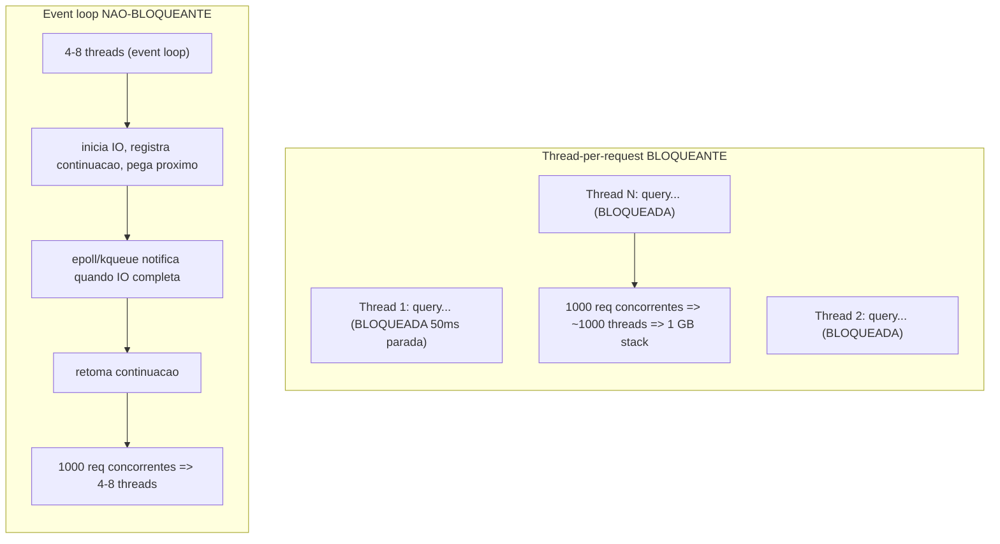
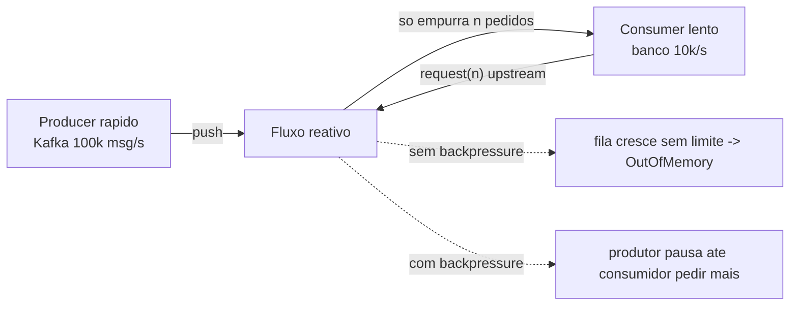

# Connection pooling, thread pooling, async I/O e reactive programming

> **Bloco:** Performance e escalabilidade · **Nível:** Intermediário/Avançado · **Tempo de leitura:** ~24 min

## TL;DR

Estes quatro conceitos atacam o mesmo problema sob ângulos diferentes: **como usar eficientemente recursos caros e finitos (conexões, threads, CPU) sob concorrência alta**. **Connection pooling** reutiliza conexões de banco/HTTP — caras de abrir — em vez de criar uma por requisição; o contraintuitivo, documentado pelo HikariCP, é que pools *menores* costumam ser mais rápidos. **Thread pooling** reutiliza threads de OS (caras em memória e troca de contexto) limitando concorrência e provendo uma fila — mas no modelo *thread-per-request* síncrono cada chamada bloqueante prende uma thread parada esperando IO. **Async I/O** quebra esse acoplamento: poucas threads servem milhares de conexões porque ninguém fica bloqueado esperando IO — a thread é liberada e retomada via callback/evento quando o IO completa. **Reactive programming** (Project Reactor, RxJava; princípios no Reactive Manifesto) é o modelo de programação que torna o async componível e — crucialmente — adiciona **backpressure**: o consumidor sinaliza ao produtor o quanto consegue processar, evitando que filas cresçam sem limite e estourem memória. A escolha não é "async é sempre melhor": é entender onde o gargalo está (IO-bound vs CPU-bound) e qual modelo paga seu custo de complexidade.

## O problema que resolve

Servidores atendem muitas requisições concorrentes, e cada requisição consome recursos finitos: precisa de uma **conexão** com o banco, de uma **thread** para executar, de **CPU**. Esses recursos são caros de criar e limitados em quantidade. Sem gestão, dois fracassos opostos ocorrem: ou você cria recursos sob demanda e paga o custo de criação + esgota o sistema (abrir uma conexão TCP+TLS+auth com o banco a cada request, ou criar uma thread por request até a máquina derreter), ou você limita demais e cria uma fila que dispara a latência.

**Connection pooling** nasceu porque abrir uma conexão de banco é caríssimo — handshake de rede, autenticação, alocação de recursos no servidor de banco. Reusar é ordens de grandeza mais barato. Mas há uma sutileza que o **HikariCP** documenta com dados: pools *grandes demais* pioram a performance, porque o gargalo real é o número de threads que o banco consegue executar de fato em paralelo (limitado por cores e discos do servidor de banco), e excesso de conexões só adiciona contenção e troca de contexto no banco. O ganho de reduzir um pool inchado pode ser de **50x** na latência.

**Thread pooling** resolve o custo de criar threads de OS (cada uma reserva memória de stack — tipicamente ~1 MB — e custa troca de contexto). Um pool limita a concorrência e oferece uma fila. O problema é o modelo dominante **thread-per-request síncrono/bloqueante**: cada request ocupa uma thread do início ao fim, e quando essa thread faz uma chamada de IO (query, HTTP a outro serviço), ela **bloqueia** — fica parada, ocupando memória e um slot do pool, sem fazer nada além de esperar. Sob alta concorrência com muito IO, você precisa de milhares de threads (caro) ou o pool esgota e tudo enfileira.

**Async I/O** ataca exatamente esse desperdício: separar a thread do IO. Uma thread inicia o IO e é *liberada* para fazer outra coisa; quando o IO completa, o sistema operacional notifica (epoll/kqueue/IOCP) e a continuação é executada. Poucas threads (na ordem dos cores) servem dezenas de milhares de conexões. **Reactive programming** e o **Reactive Manifesto** (responsivo, resiliente, elástico, *message-driven*) dão a esse modelo uma forma componível e — o ponto que distingue reactive de "só async" — **backpressure**, o mecanismo que impede que um produtor rápido afogue um consumidor lento.

## O que é (definição aprofundada)

**Connection pool.** Um conjunto de conexões pré-abertas e mantidas vivas, emprestadas a quem precisa e devolvidas após o uso. Parâmetros-chave (nomenclatura HikariCP): `maximumPoolSize` (teto de conexões), `minimumIdle` (mínimo ocioso — o HikariCP recomenda *não* setar e deixar o pool ser de tamanho fixo), `connectionTimeout` (quanto esperar por uma conexão livre antes de falhar), `maxLifetime`, `idleTimeout`. A fórmula de dimensionamento da documentação do HikariCP para evitar deadlock: `pool_size = Tn × (Cm − 1) + 1`, onde `Tn` é o número máximo de threads e `Cm` o máximo de conexões simultâneas que uma thread segura. Para throughput, a heurística clássica é `conexões ≈ (cores_do_banco × 2) + número_de_discos_efetivos` — **pequeno**, não grande.

**Thread pool.** Um conjunto fixo/elástico de threads worker que consomem tarefas de uma fila. Parâmetros (estilo `ThreadPoolExecutor` Java): `corePoolSize`, `maximumPoolSize`, `queueCapacity`, `keepAlive`, e a **política de rejeição** (o que fazer quando fila e pool estão cheios: abortar, descartar, caller-runs). O dimensionamento depende do tipo de trabalho:

- **CPU-bound:** threads ≈ número de cores (mais threads só adiciona troca de contexto).
- **IO-bound (bloqueante):** threads ≈ cores × (1 + tempo_de_espera / tempo_de_CPU) — precisa de muitas threads porque a maioria fica bloqueada esperando IO.

**Async / non-blocking I/O.** Modelo em que operações de IO não bloqueiam a thread. Em vez de "chame e espere", é "chame e seja notificado depois". Bases: event loop (Node.js, Netty), `epoll`/`kqueue`/IOCP no kernel, `CompletableFuture`/`async-await`/callbacks no código. Um **event loop** com poucas threads multiplexa milhares de conexões. O custo: o código vira uma cadeia de continuações; perde-se o stack trace linear, debugging é mais difícil, e qualquer chamada *bloqueante* acidental no event loop trava tudo (o pecado capital do async).

**Reactive programming.** Paradigma declarativo de fluxos de dados assíncronos com operadores componíveis (`map`, `flatMap`, `filter`, `merge`). Em Java/JVM, **Project Reactor** (`Mono`/`Flux`, base do Spring WebFlux) e **RxJava** implementam a especificação **Reactive Streams**. A peça que define reactive: **backpressure** — o `Subscriber` envia um sinal `request(n)` upstream indicando quantos elementos consegue processar, e o `Publisher` respeita esse limite. Isso é *pull-based demand sobre push-based delivery*: o produtor só empurra o que o consumidor pediu, prevenindo overflow de buffer. O **Reactive Manifesto** define o sistema reactive como **Responsive** (responde a tempo), **Resilient** (continua respondendo sob falha, via isolamento/replicação), **Elastic** (continua responsivo sob carga variável, escalando recursos) e **Message Driven** (comunicação assíncrona por mensagens, fronteiras claras, isolamento).

## Como funciona

**Pooling (a mecânica do gargalo).** O pool de conexões não acelera nada por si: ele *limita e reusa*. O contraintuitivo do HikariCP: imagine 10.000 threads de aplicação querendo falar com um banco de 8 cores. Se o pool tiver 10.000 conexões, o banco recebe 10.000 queries "simultâneas", mas só consegue executar ~8-16 de fato em paralelo — o resto vira fila *dentro do banco*, com troca de contexto e contenção de lock degradando todas. Reduzir o pool para ~20 faz as queries enfileirarem *do lado da aplicação* (esperando uma conexão livre), mas o banco executa cada uma rápido, sem contenção. Resultado: latência total despenca. A fila tem que existir; a questão é *onde* ela é mais barata — e quase sempre é antes do recurso saturado, não dentro dele. Isso é teoria de filas aplicada (e conecta com a Lei de Little: `conexões_em_uso = throughput × tempo_por_query`).

**Thread-per-request bloqueante vs event loop.** No modelo bloqueante, a thread faz: recebe request → query (bloqueia 50 ms parada) → processa → responde. Durante os 50 ms ela ocupa ~1 MB de stack e um slot, fazendo nada. Com 1.000 requests concorrentes IO-bound, precisa de ~1.000 threads (1 GB de stack, troca de contexto pesada). No modelo async/event loop: a thread inicia a query, **registra uma continuação e pega o próximo request**; quando a query completa, o `epoll` notifica e a continuação roda. 4-8 threads servem os mesmos 1.000 requests. A memória e a troca de contexto caem drasticamente. **Mas:** se a carga é CPU-bound (cálculo pesado), async não ajuda — a thread está ocupada *computando*, não esperando; aí o limite são os cores e thread pool dimensionado para cores é o correto. **Async vence em IO-bound, é neutro ou pior em CPU-bound.**

**Backpressure (o que torna reactive diferente).** Async sem backpressure é perigoso: um produtor rápido (ex.: lendo de um broker Kafka a 100k msg/s) empurrando para um consumidor lento (escrevendo num banco a 10k/s) faz a fila intermediária crescer indefinidamente até estourar a memória (OOM). Backpressure inverte: o consumidor declara `request(1000)` — "me mande no máximo 1000" — e o produtor para de empurrar até receber novo `request`. O sinal de demanda propaga-se *upstream* através de toda a cadeia. Estratégias quando o produtor não pode ser pausado (ex.: cliques de usuário): `buffer` (com limite), `drop`, `latest`, `error`. Project Reactor implementa isso nativamente via `request(n)` do `Subscriber`.

**Virtual threads (contexto moderno).** Vale notar: virtual threads (Project Loom, Java 21+) oferecem o modelo de programação *bloqueante e simples* do thread-per-request com o custo de escala do async — o runtime desmonta a thread virtual quando ela bloqueia em IO, liberando a thread de OS portadora. Para muitos casos IO-bound, isso reduz a necessidade de reescrever em estilo reactive, embora reactive ainda ofereça backpressure e composição de streams que virtual threads sozinhas não dão.

## Diagrama de fluxo





## Exemplo prático / caso real

Fintech brasileira, serviço de consulta de extrato que faz fan-out: para cada requisição, chama 4 serviços downstream (saldo, transações, investimentos, cartão), cada um IO-bound com latência média de 60 ms. Pico: **3.000 req/s**.

**Diagnóstico de pool (HikariCP).** O time inicial setou `maximumPoolSize=200` "para aguentar o pico". Sob carga, a latência p99 explodia para 2 s e o banco mostrava contenção. Aplicando a lição do HikariCP, reduziram para `maximumPoolSize=25` (banco com 8 cores + storage rápido). A latência p99 caiu para 180 ms — o banco parou de se afogar em conexões e executou cada query rápido. Dimensionaram pela Lei de Little: com `throughput = 3.000 req/s` e cada request usando uma conexão por ~20 ms de query efetiva, `conexões_em_uso ≈ 3.000 × 0,02 = 60` — mas distribuído entre instâncias, 25 por instância em 4 instâncias = 100 conexões totais, dentro do que o banco aguenta.

**Modelo de execução (thread-per-request → reactive).** Originalmente, o serviço era Spring MVC bloqueante: o fan-out de 4 chamadas era *sequencial e bloqueante* (4 × 60 ms = 240 ms por request) e cada request prendia uma thread por todo esse tempo. Com 3.000 req/s e 240 ms cada, pela Lei de Little precisariam de `L = 3.000 × 0,24 = 720` threads ativas — um thread pool gigante, muita memória, troca de contexto pesada.

Migraram para **Spring WebFlux com Project Reactor**: as 4 chamadas viraram um `Flux.merge` paralelo e não-bloqueante (latência cai para ~max(60ms) ≈ 70 ms, pois rodam concorrentes) e o event loop do Netty (8 threads) serve todos os 3.000 req/s sem thread pool inflado. A memória do serviço caiu de ~4 GB para ~800 MB sob o mesmo pico.

**Backpressure no consumo de eventos.** Há também um consumidor que lê eventos de transação de um tópico Kafka para atualizar projeções de leitura. O produtor (outros serviços) emite rajadas de até 80k eventos/s; o sink (banco de projeção) aguenta ~12k/s. Sem backpressure, o serviço dava OOM em rajadas. Com Project Reactor + `request(n)` propagado até o consumer Kafka (limitando o `poll`), o consumo se autorregula ao ritmo do banco — o lag do tópico cresce sob rajada (aceitável) mas a memória fica estável e o serviço não cai. Tudo observado no **Grafana** (lag de consumo, uso de heap, latência p99) com métricas do **Prometheus**.

```text
# Pseudocódigo: fan-out reativo com backpressure
extrato(id):
  return Flux.merge(                         # 4 chamadas concorrentes, nao-bloqueantes
      saldoClient.get(id),
      transacoesClient.get(id),
      investimentosClient.get(id),
      cartaoClient.get(id)
  ).collectList()                            # latencia ~ max das 4, nao a soma

# consumidor com backpressure
kafkaFlux
  .onBackpressureBuffer(10_000)              # limite explicito
  .flatMap(evento -> banco.upsert(evento), CONCORRENCIA=64)  # limita demanda upstream
```

## Quando usar / Quando evitar

**Connection pool:** sempre que houver acesso a banco/recurso remoto caro de conectar. Dimensione **pequeno** (cores do banco como referência), não grande. Use sempre uma biblioteca madura (HikariCP) em vez de gerenciar conexões à mão.

**Thread pool:** o default razoável para workloads **CPU-bound** (dimensione ~cores) e para sistemas síncronos simples. Para IO-bound bloqueante, dimensione conforme a fração de espera — mas considere se async/virtual threads não seria melhor.

**Async I/O / reactive:** vale a pena quando o workload é **IO-bound com alta concorrência** (muitos clientes, muitas chamadas downstream, gateways, streaming) e a escala de conexões/threads é o gargalo. Reactive especificamente quando você precisa de **backpressure** (produtor pode superar consumidor) e/ou composição de streams assíncronos.

**Evite async/reactive quando:** o workload é CPU-bound (não ajuda); a equipe não domina o modelo (custo cognitivo, debugging difícil, stack traces fragmentados); o sistema é simples e a escala não exige (a complexidade não se paga); ou quando virtual threads (Loom) já resolvem o problema de escala IO-bound mantendo o código bloqueante simples. **Nunca** faça chamada bloqueante dentro de um event loop reactive — isso anula tudo e trava o servidor.

## Anti-padrões e armadilhas comuns

- **Pool de conexões gigante.** "Mais conexões = mais throughput" é falso; pools inchados saturam o banco com contenção. Dimensione pequeno (HikariCP).
- **Escalar a app sem dimensionar o pool/banco.** 50 instâncias × 100 conexões = 5.000 conexões → derruba o banco. O gargalo migra para baixo.
- **Thread pool mal dimensionado.** Pequeno demais → fila enche, latência explode, requests rejeitados. Grande demais → troca de contexto e memória. Dimensione pelo tipo de carga (CPU vs IO).
- **Fila ilimitada no thread pool.** `LinkedBlockingQueue` sem limite esconde a saturação: a fila cresce, a latência sobe silenciosamente, e eventualmente OOM. Use fila limitada + política de rejeição (backpressure local).
- **Bloquear o event loop.** Chamada síncrona/bloqueante (JDBC bloqueante, `Thread.sleep`, CPU pesada) dentro de um runtime reactive trava todas as conexões servidas por aquela thread. Isole em scheduler dedicado ou não use reactive ali.
- **Async sem backpressure.** Produtor rápido + consumidor lento + buffer ilimitado = OOM garantido sob rajada. Reactive Streams existe justamente para isso.
- **Reactive por hype.** Adotar WebFlux num CRUD simples CPU-bound só adiciona complexidade sem ganho. Meça o gargalo antes.
- **Ignorar `connectionTimeout`.** Sem timeout para pegar conexão, requests ficam pendurados indefinidamente quando o pool esgota, em vez de falhar rápido.

## Relação com outros conceitos

- **Lei de Little** (arquivo 06): dimensiona pools, threads e concorrência — `recursos_em_uso = throughput × tempo_de_serviço`.
- **Latência e percentis** (arquivo 02): pool/thread mal dimensionado é causa-raiz clássica de cauda (p99/p999); fila de espera por recurso domina o p99.
- **USE / saturação** (arquivo 03): pool esgotado é *saturação* invisível à utilização de CPU; é o sinal que revela o gargalo.
- **Escalabilidade** (arquivo 01): contenção de pool e locks são *σ* (contenção) da USL; reduzi-los estende a região linear de scale-out.
- **Backpressure & streaming** (Bloco de Mensageria): a base do consumo controlado de filas/tópicos; soft/hard TTL com backpressure (caching, arquivo 04) é o mesmo princípio na origem.
- **Reactive Manifesto & resiliência** (Bloco de Distribuídos): message-driven, isolamento, bulkheads e circuit breakers complementam o modelo async.

## Referências

- [About Pool Sizing — HikariCP Wiki (Brett Wooldridge)](https://github.com/brettwooldridge/HikariCP/wiki/About-Pool-Sizing) — por que pools menores são mais rápidos; fórmula de dimensionamento.
- [HikariCP — repositório oficial](https://github.com/brettwooldridge/HikariCP) — connection pool JDBC de referência e sua configuração.
- [The Reactive Manifesto](https://www.reactivemanifesto.org/) — responsivo, resiliente, elástico, message-driven.
- [Project Reactor](https://projectreactor.io/) — biblioteca reativa para a JVM (Mono/Flux, base do Spring WebFlux).
- [Introduction to Reactive Programming — Reactor Core Reference Guide](https://projectreactor.io/docs/core/release/reference/reactiveProgramming.html) — modelo reativo e Reactive Streams.
- [Reactor 3 Reference Guide](https://projectreactor.io/docs/core/3.6.8/reference) — backpressure, `request(n)`, operadores e schedulers.
- [Backpressure in Reactive Systems — Foojay.io](https://foojay.io/today/backpressure-in-reactive-systems/) — explicação prática de backpressure e estratégias de overflow.
- [Little's law — Wikipedia](https://en.wikipedia.org/wiki/Little's_law) — base para dimensionar pools e concorrência.
