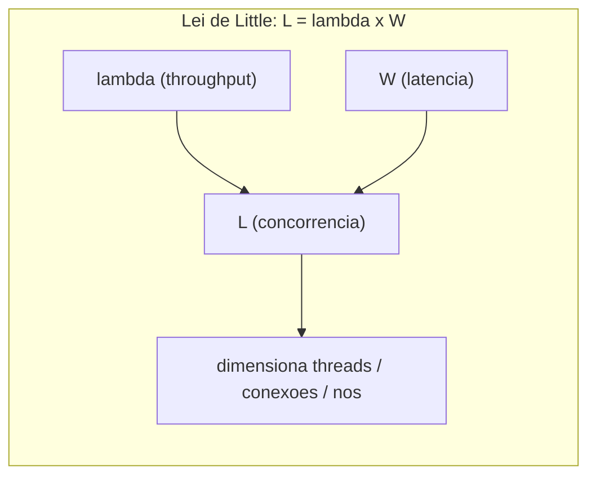
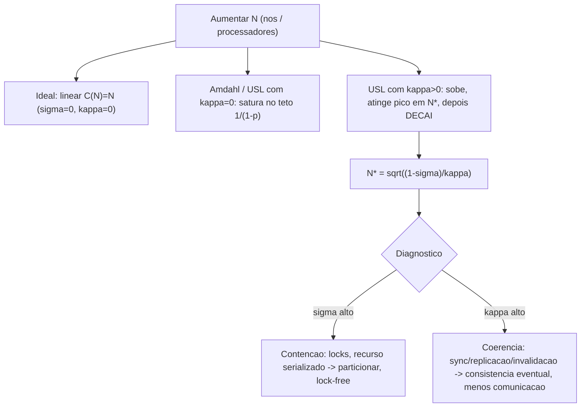

# Lei de Little, Lei de Amdahl e Universal Scalability Law

> **Bloco:** Performance e escalabilidade · **Nível:** Intermediário/Avançado · **Tempo de leitura:** ~24 min

## TL;DR

Três leis quantitativas que governam o comportamento de sistemas sob carga. A **Lei de Little** (`L = λ × W`) relaciona concorrência, throughput e latência em qualquer sistema estável — é a ferramenta de dimensionamento mais útil que existe (quantos threads/conexões/nós você precisa). A **Lei de Amdahl** mostra que a fração *serial* de um trabalho impõe um teto ao speedup por mais paralelismo que você adicione: 5% serial = no máximo 20x, ponto final. A **Universal Scalability Law (USL)**, de Neil Gunther, generaliza Amdahl adicionando um segundo custo — a **coerência** (κ, custo de sincronizar dados entre componentes, que cresce com N²) — e revela algo que Amdahl não captura: o throughput não só satura, ele pode **regredir** (cair) ao adicionar nós além de um ponto ótimo. Juntas, as três respondem: *quanto recurso preciso* (Little), *qual o teto teórico de paralelismo* (Amdahl) e *por que e onde escalar mais piora o sistema* (USL). Um arquiteto que internaliza essas leis para de escalar por tentativa e erro e passa a prever, dimensionar e atacar as causas certas (contenção σ e coerência κ).

## O problema que resolve

Escalabilidade e capacidade são frequentemente tratadas com intuição e força bruta: "está lento, joga mais máquina", "está enfileirando, aumenta o pool". Essas três leis transformam intuição em **modelo quantitativo**. Elas respondem perguntas que de outra forma exigiriam tentativa e erro caro em produção.

A **Lei de Little** foi provada formalmente por **John D. C. Little** (1961) na teoria de filas. Seu poder é a generalidade absurda: vale para *qualquer* sistema estável, independentemente da distribuição de chegada, do tempo de serviço ou da ordem de atendimento. Ela conecta as três grandezas que todo engenheiro de performance manipula — quantas coisas estão no sistema (concorrência), com que taxa entram/saem (throughput) e quanto tempo cada uma fica (latência). Sem ela, dimensionar pools, filas e nós é chute.

A **Lei de Amdahl** foi formulada por **Gene Amdahl** (1967) para contestar o otimismo sobre processamento paralelo. O argumento: por mais processadores que você adicione, a parte do programa que é inerentemente *sequencial* não acelera, e ela domina o tempo total no limite. Isso impôs um teto sóbrio às expectativas de paralelismo e continua válido para qualquer sistema com uma fração que não distribui.

A **Universal Scalability Law** foi desenvolvida por **Neil Gunther** (por volta de 1993, refinada depois) porque Amdahl, embora correta, é incompleta para sistemas distribuídos reais. Amdahl modela apenas a *contenção* (espera por recurso serializado). Gunther observou que sistemas distribuídos têm um segundo custo: a **coerência** — o esforço de manter dados consistentes entre componentes (invalidação de cache, replicação, sincronização, gossip), que cresce com o *número de pares* de componentes, ou seja, quadraticamente em N. Esse termo extra explica fenômenos que Amdahl não prevê: por que adicionar servidores às vezes *reduz* o throughput total, e onde fica o ponto de máximo retorno. A USL é hoje a ferramenta canônica de modelagem de escalabilidade, disponível no site de Gunther (perfdynamics.com).

## O que é (definição aprofundada)

### Lei de Little

```
L = λ × W
```

- **L** = número médio de itens no sistema (concorrência / "work in progress").
- **λ** (lambda) = taxa média de chegada = throughput em estado estável (itens/tempo).
- **W** = tempo médio que um item passa no sistema (latência, incluindo espera + serviço).

Vale em **estado estável** (entrada ≈ saída ao longo do tempo) e é **independente de distribuições**. Rearranjos úteis: `λ = L / W` (throughput dado concorrência e latência) e `W = L / λ` (latência média dado concorrência e throughput — Little te dá a latência sem medi-la diretamente). Aplica-se em qualquer fronteira: um servidor, um pool de threads, uma fila, um banco, o sistema inteiro.

### Lei de Amdahl

Seja *p* a fração paralelizável do trabalho (e *1 − p* a fração serial), *N* o número de processadores:

```
Speedup(N) = 1 / ( (1 - p) + p/N )

Limite (N -> infinito):  Speedup_max = 1 / (1 - p)
```

Interpretação: o `1/N` do termo paralelo tende a zero com muitos processadores, sobrando só a fração serial `(1 − p)` no denominador. Exemplos: *p = 0,90* → teto 10x; *p = 0,95* → teto 20x; *p = 0,99* → teto 100x. A lição é brutal — **a fração serial domina**; reduzir de 5% para 1% de serial vale mais (20x → 100x) que multiplicar processadores.

### Universal Scalability Law

Throughput relativo (ou speedup) com *N* nós/processos, *σ* (sigma) = coeficiente de **contenção** (fração serializada / fila por recurso compartilhado), *κ* (kappa) = coeficiente de **coerência** (custo de consistência entre componentes):

```
C(N) = N / ( 1 + σ·(N - 1) + κ·N·(N - 1) )
```

- **Termo de contenção** `σ(N−1)`: cresce linearmente; é o análogo da fração serial de Amdahl (espera por recursos compartilhados, locks, seções críticas).
- **Termo de coerência** `κ·N·(N−1)`: cresce **quadraticamente** (≈ κN²); modela o custo de comunicação ponto-a-ponto para manter dados consistentes entre todos os pares de nós.

Casos degenerados: com **σ = κ = 0**, `C(N) = N` (escalabilidade linear perfeita). Com **κ = 0**, a USL reduz-se exatamente à Lei de Amdahl (só contenção). Com **κ > 0**, surge um **ponto de máximo** e depois **decaimento**:

```
N* = sqrt( (1 - σ) / κ )      # numero de nos que maximiza o throughput
```

Além de *N\**, adicionar nós **diminui** o throughput total — o custo de coerência supera o ganho de capacidade. Esse retrocesso é a contribuição única da USL.

## Como funciona

**Little na prática — dimensionamento.** Você quer saber quantas conexões/threads/nós precisa. Meça duas das três grandezas e derive a terceira. Quer suportar `λ = 5.000 req/s` com latência média `W = 100 ms = 0,1 s`? A concorrência necessária é `L = λ × W = 5.000 × 0,1 = 500` requisições simultâneas em voo. Isso dimensiona o pool de threads, o número de conexões, o número de nós (dividindo L pela capacidade concorrente de cada nó). Inversamente: se você tem um pool de 200 conexões e cada query leva 40 ms, o throughput máximo daquele pool é `λ = L / W = 200 / 0,04 = 5.000 queries/s` — acima disso, requests enfileiram e W sobe. Little também avisa quando você está saturando: se L (itens no sistema) cresce mas λ (throughput) não, é sinal de que W está explodindo — fila crescente, saturação.

**Amdahl na prática — teto de paralelismo.** Antes de paralelizar, identifique a fração serial. Se 5% do tempo de uma requisição é uma seção crítica protegida por lock global, nenhum número de cores/threads te leva além de 20x de speedup naquela operação. A ação não é adicionar paralelismo — é *eliminar a serialização* (quebrar o lock, particionar o recurso, tornar lock-free). Amdahl é o argumento quantitativo para investir em reduzir contenção em vez de comprar hardware.

**USL na prática — modelar e prever.** O fluxo profissional: rode testes de carga em *vários* níveis de N (2, 4, 8, 16, 32 nós, ou níveis de concorrência), meça o throughput em cada um, e **ajuste a curva da USL** (regressão para estimar σ e κ — Gunther fornece a metodologia). Com σ e κ estimados, você pode: (a) prever o throughput em níveis de N que ainda não testou; (b) calcular *N\**, o ponto ótimo, e saber se adicionar mais nós vale a pena ou vai piorar; (c) diagnosticar a causa — σ alto indica contenção (locks, recurso serializado), κ alto indica coerência excessiva (sincronização/replicação/invalidação demais). A engenharia então ataca o termo dominante: reduzir σ (particionar, lock-free, otimismo) ou reduzir κ (consistência eventual, menos sincronização, menos comunicação cross-node).

**A conexão entre as três.** Little dimensiona o *quanto* (concorrência alvo). Amdahl e USL explicam *por que* adicionar recursos rende cada vez menos: a concorrência L que você quer sustentar exige throughput λ, mas λ não cresce linearmente com N por causa de σ (Amdahl/USL) e pode até cair por causa de κ (USL). Juntas, são o aparato quantitativo completo de capacidade e escalabilidade.

## Diagrama de fluxo





## Exemplo prático / caso real

E-commerce brasileiro preparando o serviço de **reserva de estoque** para a Black Friday. Três decisões guiadas pelas três leis.

**1. Dimensionamento com Little.** O time projeta `λ = 6.000 reservas/s` no pico. Mediram que cada reserva leva, em média, `W = 80 ms` (validação + escrita no banco + publicação de evento). Pela Lei de Little, a concorrência em voo é `L = 6.000 × 0,08 = 480` operações simultâneas. Cada instância sustenta com folga ~40 operações concorrentes (pool de conexões + threads dimensionados), então precisam de `480 / 40 = 12` instâncias, e arredondam para **16** com margem. O pool de conexões por instância é dimensionado pequeno (lição do HikariCP) e validado: `λ_por_instância = L_pool / W_query`. Tudo derivado, não chutado.

**2. Teto de paralelismo com Amdahl.** A reserva original usava um **lock pessimista global** sobre o item de estoque — uma seção crítica serial. Medindo, ~8% do tempo total era essa serialização. Pela Lei de Amdahl, o speedup máximo por mais threads/nós naquela operação era `1/0,08 ≈ 12,5x` — ou seja, escalar para 16 instâncias *não* daria 16x, pois o lock serializava. A ação correta não era mais hardware: era **eliminar a serialização**. Trocaram o lock pessimista global por reserva **otimista por SKU** (compare-and-set com retry idempotente), reduzindo a fração serial de 8% para ~1%, elevando o teto para ~100x.

**3. Prever e diagnosticar com USL.** Rodaram teste de carga em 2, 4, 8, 12, 16 instâncias e mediram o throughput. A curva ajustada da USL revelou `σ ≈ 0,02` (contenção baixa, após a correção do lock) mas `κ ≈ 0,0008` (coerência não-desprezível). A causa de κ: cada reserva publicava um evento que invalidava o cache de estoque em **todas** as instâncias (broadcast), e a coordenação cross-instância crescia quadraticamente. Calcularam o ponto de máximo: `N* = sqrt((1−0,02)/0,0008) ≈ sqrt(1225) ≈ 35` instâncias. Ou seja, até ~35 instâncias o throughput cresce; além disso, *decai*. Como precisavam de só 16, estavam na região saudável da curva — mas a USL os avisou que escalar cegamente para 50 instâncias num pico maior *reduziria* o throughput. Para ganhar margem, atacaram κ: trocaram a invalidação broadcast por particionamento do estoque por SKU (cada instância dona de um subconjunto, sem coordenação global), derrubando κ e empurrando N\* para muito além de qualquer necessidade.

Tudo monitorado com **Prometheus/Grafana** (throughput, p99, saturação de pool), e o gráfico da USL ajustada virou artefato de planejamento de capacidade. O insight de sênior: **as três leis transformaram "quantas máquinas?" e "por que não escala linear?" de chute em cálculo.**

```text
# Little para dimensionar
L = lambda * W           # 6000 * 0.08 = 480 concorrentes
nos = ceil(L / cap_por_no)  # 480 / 40 = 12 -> 16 com margem

# Amdahl: teto antes de escalar
speedup_max = 1 / (1 - p)   # p=0.92 -> 12.5x ; reduzir serial primeiro

# USL: ponto otimo
N_star = sqrt((1 - sigma) / kappa)   # avisa onde escalar mais PIORA
```

## Quando usar / Quando evitar

**Lei de Little — use sempre.** É a ferramenta de dimensionamento universal: pools de thread/conexão, tamanho de fila, número de nós, capacidade de filas de mensageria, planejamento de capacidade. Requer apenas estado estável. Não há "quando evitar" — apenas cuidado para medir as grandezas na mesma fronteira e em regime estável (não vale durante transientes/picos instantâneos).

**Lei de Amdahl — use** para estimar o teto de qualquer esforço de paralelização e para argumentar a favor de reduzir serialização antes de adicionar hardware. Limitação: assume tamanho de problema fixo (a Lei de Gustafson modela o caso em que o problema cresce com os recursos — relevante para batch/HPC, menos para serviços online de latência fixa).

**Universal Scalability Law — use** para modelar escalabilidade de sistemas reais (distribuídos ou multi-core), prever throughput em níveis não testados, encontrar o ponto ótimo de nós e diagnosticar se o limitante é contenção (σ) ou coerência (κ). Requer dados de carga em múltiplos níveis de N para ajustar a curva. Evite tratá-la como exata para extrapolações longe dos dados medidos — é um modelo, e σ/κ podem mudar com mudanças de arquitetura.

## Anti-padrões e armadilhas comuns

- **Ignorar a USL e assumir escala linear.** "2x nós = 2x throughput" quase nunca vale; sem modelar σ/κ você escala às cegas e pode pagar por capacidade que *reduz* o throughput.
- **Escalar quando o limitante é a fração serial (Amdahl).** Adicionar nós a um sistema com lock global/seção crítica dominante desperdiça dinheiro; ataque a serialização primeiro.
- **Aplicar Little fora do estado estável.** Medir L, λ, W durante um transiente (rampa de carga, pico instantâneo) dá números inconsistentes; a lei vale em regime estável.
- **Confundir utilização com saturação ao dimensionar.** Little dimensiona concorrência, mas perto de 100% de utilização W explode não-linearmente (teoria de filas) — deixe folga (~70-80%).
- **Estimar σ/κ com poucos pontos.** Ajustar a USL com 2-3 medições dá σ/κ não confiáveis. Use vários níveis de N.
- **Tratar κ como inevitável.** Coerência alta quase sempre vem de decisões de design (broadcast de invalidação, transações distribuídas, consistência forte onde não precisa). É atacável: particionar, consistência eventual, reduzir comunicação cross-node.
- **Otimizar throughput esquecendo a latência.** Little liga as duas; empurrar λ para o limite infla W (a cauda, p99) — ver arquivo 02.

## Relação com outros conceitos

- **Escalabilidade horizontal vs vertical** (arquivo 01): Amdahl/USL são *a* base teórica de por que scale-out satura e regride; σ e κ são o que a engenharia de escalabilidade reduz.
- **Latência vs throughput e percentis** (arquivo 02): Little é a ponte algébrica entre as três grandezas; perto da saturação, W (e o p99) explode.
- **Pooling e async** (arquivo 05): Little dimensiona pools e threads; contenção de pool/lock é σ; backpressure controla L para não explodir W.
- **USE / saturação** (arquivo 03): saturação (fila) é o sinal de que L cresce sem λ crescer — Little explicando o que o USE mede.
- **Caching** (arquivo 04): invalidação propagada para N nós é uma fonte clássica de κ (coerência), limitando o scale-out.
- **Particionamento e consistência** (Bloco de Dados): particionar reduz σ e κ; consistência forte aumenta κ — o trade-off central de escalar sistemas stateful.

## Referências

- [Little's law — Wikipedia](https://en.wikipedia.org/wiki/Little's_law) — formulação `L = λW`, prova e independência de distribuição.
- [Using Little's Law to Measure System Performance — Kevin Sookocheff](https://sookocheff.com/post/modeling/littles-law/) — aplicação prática de Little a performance de software.
- [Amdahl's law — Wikipedia](https://en.wikipedia.org/wiki/Amdahl%27s_law) — fórmula do speedup limitado pela fração serial.
- [How to Quantify Scalability — Universal Scalability Law (Neil Gunther, Performance Dynamics)](https://www.perfdynamics.com/Manifesto/USLscalability.html) — a USL com contenção (σ) e coerência (κ).
- [USL Scalability Modeling with Three Parameters — The Pith of Performance (Neil Gunther)](http://perfdynamics.blogspot.com/2018/05/usl-scalability-modeling-with-three.html) — modelagem prática e ajuste da curva USL.
- [Neil J. Gunther — Wikipedia](https://en.wikipedia.org/wiki/Neil_J._Gunther) — contexto e origem da Universal Scalability Law.
- [Gustafson's law — Wikipedia](https://en.wikipedia.org/wiki/Gustafson's_law) — alternativa a Amdahl quando o tamanho do problema cresce com os recursos.
- [Summary of Computing Laws: Amdahl, Dennard, Gustafson, Little, Moore — Pramod Kumbhar](https://pramodkumbhar.com/2019/07/summary-of-computing-laws-amdahl-dennard-gustafson-little-moore-and-more/) — visão consolidada das leis fundamentais.
