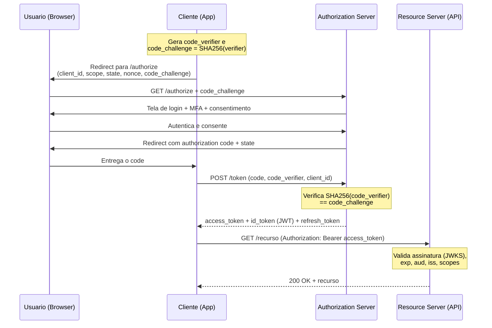

# OAuth 2.0, OpenID Connect, SAML, JWT e quando usar cada um

> **Bloco:** Segurança arquitetural · **Nível:** Intermediário/Avançado · **Tempo de leitura:** ~25 min

## TL;DR

Quatro tecnologias frequentemente confundidas, com responsabilidades distintas:

- **OAuth 2.0** é um framework de **autorização delegada** (RFC 6749): permite que uma aplicação obtenha acesso *limitado* a um recurso em nome do usuário, sem ver a senha dele. Emite **access tokens** com escopo. **Não** é, por si só, um protocolo de autenticação.
- **OpenID Connect (OIDC)** é uma **camada de identidade sobre o OAuth 2.0**: adiciona **autenticação** (saber *quem* é o usuário) via um **ID Token** (sempre um JWT). É o padrão moderno para login/SSO em web, mobile e SPAs.
- **SAML 2.0** é um padrão **anterior, baseado em XML**, para **SSO e federação de identidade**, dominante em ambientes corporativos/enterprise e integrações B2B com IdPs legados.
- **JWT (RFC 7519)** é um **formato de token** (não um protocolo): um JSON compacto, assinado (JWS) e/ou cifrado (JWE), usado *dentro* de OAuth/OIDC para carregar claims de forma verificável.

Regra prática: **autenticação ≠ autorização**. OAuth2 autoriza; OIDC autentica (sobre OAuth2); SAML faz ambos via XML para enterprise; JWT é o veículo. O fluxo recomendado hoje, para qualquer tipo de cliente, é **Authorization Code Flow + PKCE**.

## O problema que resolve

Antes de OAuth, integrar um app de terceiros para acessar seus dados (ex.: um app que lê sua agenda) exigia entregar **sua senha** ao terceiro — o anti-padrão da *password anti-pattern*. Isso dá ao terceiro acesso total, irrevogável sem trocar a senha, e impossível de escopar. OAuth resolveu isso introduzindo uma **camada de autorização** que separa o papel do **cliente** do papel do **resource owner** (o usuário). Em vez da senha, o cliente recebe um **access token** com escopo, validade e atributos próprios — revogável e limitado.

A genealogia:

- **OAuth 1.0** (RFC 5849, 2010) — complexo, com assinaturas criptográficas no cliente. Substituído.
- **OAuth 2.0** — **RFC 6749 (2012)**, "The OAuth 2.0 Authorization Framework", da IETF. Simplificou (delegando segurança ao TLS), tornou-se onipresente. Acompanhado da RFC 6750 (Bearer Tokens).
- O ponto cego do OAuth2: ele foi desenhado para **autorização de acesso a APIs**, não para **autenticar usuários**. Muita gente o usou erroneamente como mecanismo de login (o "log in with X" feito errado, sem validar identidade), criando brechas. Para preencher essa lacuna de forma padronizada, a **OpenID Foundation** publicou o **OpenID Connect 1.0 (2014)** — uma camada de identidade *sobre* OAuth2.
- **SAML 2.0** (OASIS, 2005) precede tudo isso e resolveu o problema de **SSO federado** no mundo corporativo baseado em navegador e XML, muito antes de APIs REST e mobile dominarem.
- **JWT** — **RFC 7519 (2015)** — padronizou um formato de token compacto e verificável, que virou o veículo natural de ID Tokens (OIDC) e, frequentemente, access tokens.
- **PKCE** — **RFC 7636 (2015)** — fechou o buraco da interceptação de código de autorização em clientes públicos (mobile, SPA). Hoje, em OAuth 2.1, é **obrigatório** para todos os clientes que usam Authorization Code.

## O que é (definição aprofundada)

### Papéis do OAuth 2.0 (RFC 6749)

- **Resource Owner**: o usuário, dono dos dados.
- **Client**: a aplicação que quer acesso. Pode ser **confidencial** (backend, guarda segredo com segurança) ou **público** (SPA, mobile — não guarda segredo de forma confiável).
- **Authorization Server (AS)**: emite tokens após autenticar o resource owner e obter consentimento.
- **Resource Server (RS)**: a API que hospeda os recursos protegidos e aceita access tokens.

**Access token** = credencial de **autorização** (o que o portador pode fazer, via *scopes*). **Refresh token** = credencial de longa duração para obter novos access tokens sem reautenticar. **Scope** = string que delimita o acesso (ex.: `read:orders`).

### Grant types (fluxos)

- **Authorization Code** (+ PKCE): o fluxo padrão e seguro. O cliente recebe primeiro um *código* (via redirect no browser) e depois o **troca** por tokens em uma chamada back-channel. PKCE protege essa troca. Recomendado para **todos** os tipos de cliente hoje.
- **Client Credentials**: máquina-a-máquina (M2M), sem usuário. O cliente se autentica com suas próprias credenciais e recebe um access token. Usado entre serviços.
- **Refresh Token**: renova access tokens expirados.
- **Implicit** (legado, depreciado): retornava o token direto no fragmento da URL. Inseguro — não use.
- **Resource Owner Password Credentials (ROPC)** (legado, evitar): cliente coleta usuário/senha diretamente. Reintroduz o anti-padrão da senha.

### OpenID Connect (autenticação)

OIDC adiciona ao OAuth2:

- O **ID Token**: um **JWT** que afirma *quem* o usuário é, com claims padronizados (`iss`, `sub`, `aud`, `exp`, `iat`, `nonce`, e claims de perfil). É a prova de autenticação para o cliente (Relying Party).
- O endpoint **UserInfo** e o **discovery** (`/.well-known/openid-configuration`).
- O scope `openid` que ativa o comportamento OIDC.

A distinção crucial: o **access token** é para o **Resource Server** (autorização — "este portador pode chamar esta API"); o **ID Token** é para o **cliente** (autenticação — "este usuário fez login, e é fulano"). Confundi-los — por exemplo, usar o access token para identificar o usuário no frontend — é um erro de segurança comum.

### SAML 2.0

Baseado em **XML**. Os papéis: **Identity Provider (IdP)** autentica e emite uma **SAML Assertion** (documento XML assinado com identidade e atributos); o **Service Provider (SP)** consome a assertion e concede acesso. Funciona via **navegador** (POST/Redirect bindings). Faz autenticação *e* transporta atributos de autorização. Dominante em SSO corporativo e federações enterprise.

### JWT (formato)

Três partes separadas por ponto, em Base64URL: **Header** (algoritmo, ex.: `RS256`), **Payload** (claims) e **Signature**. Como **JWS**, é *assinado* (integridade + autenticidade verificáveis pela chave pública do emissor) mas **não cifrado** — o payload é legível por qualquer um. Para confidencialidade, usa-se **JWE**. JWT é **stateless**: o RS valida a assinatura e os claims (`exp`, `aud`, `iss`) sem consultar o AS.

## Como funciona

O fluxo de referência é o **Authorization Code Flow com PKCE**:

1. O cliente gera um **code_verifier** (string aleatória de alta entropia) e calcula o **code_challenge** = `BASE64URL(SHA256(code_verifier))`.
2. O cliente redireciona o usuário ao endpoint `/authorize` do AS, enviando `client_id`, `redirect_uri`, `scope` (incluindo `openid` para OIDC), `state` (anti-CSRF), `nonce` (anti-replay do ID token) e o **code_challenge** + método (`S256`).
3. O AS **autentica** o usuário (login + MFA) e obtém **consentimento** para os scopes.
4. O AS redireciona de volta à `redirect_uri` com um **authorization code** e o `state`.
5. O cliente, **back-channel** (servidor-a-servidor), chama `/token` enviando o `code`, `client_id`, `redirect_uri` e o **code_verifier** original.
6. O AS verifica que `SHA256(code_verifier) == code_challenge` recebido no passo 2 — provando que quem troca o código é quem o iniciou. Se válido, emite **access token** (+ **ID token** se OIDC, + opcional **refresh token**).
7. O cliente usa o access token como **Bearer** no header `Authorization` para chamar o Resource Server.
8. O RS **valida** o token: assinatura (via JWKS do AS), `exp`, `aud`, `iss`, e os scopes necessários. Concede ou nega.

PKCE elimina o **authorization code interception attack**: mesmo que um app malicioso no mesmo dispositivo capture o código no redirect, ele não tem o `code_verifier` e não consegue trocá-lo por tokens.

O fluxo **SAML** é análogo no objetivo, diferente na mecânica: o SP redireciona o navegador ao IdP; o IdP autentica e POSTa de volta uma **assertion XML assinada**; o SP valida a assinatura e cria a sessão. Tudo via browser e XML, sem o conceito de access token para APIs.

## Diagrama de fluxo



## Exemplo prático / caso real

Uma **fintech brasileira** com app mobile, painel web (SPA) e integrações B2B. Decisões:

- **Login do cliente final (mobile e SPA)**: **OIDC com Authorization Code + PKCE**, usando **Keycloak** (open source, self-hosted, atende compliance de soberania de dados) ou **Auth0/Okta** (gerenciado). O app recebe um **ID Token** (JWT) para saber quem é o usuário e um **access token** para chamar as APIs internas. MFA obrigatório no AS. Refresh tokens rotativos com detecção de reuso.
- **Comunicação entre microsserviços (M2M)**: **OAuth2 Client Credentials**. O serviço de `cobranca` obtém um access token do Keycloak para chamar o serviço de `ledger`, escopado a `write:transactions`. Combinado com mTLS no service mesh (ver `03-mtls-entre-servicos.md`), tem-se autenticação de identidade de workload + autorização por scope.
- **Integração com um banco parceiro legado (enterprise)**: o parceiro só fala **SAML 2.0**. Configura-se uma federação SAML — o Keycloak atua como SP recebendo assertions do IdP do banco, e internamente traduz para OIDC. Aqui SAML é imposto pelo legado, não escolhido por mérito técnico.

Validação de JWT no Resource Server (pseudocódigo leve):

```
ao receber requisicao:
  token = extrair_bearer(header.Authorization)
  jwks  = buscar_chaves_publicas(AS_jwks_uri)   # cacheadas, com rotacao
  se NAO verificar_assinatura(token, jwks): rejeitar 401
  claims = decodificar(token)
  se claims.exp < agora: rejeitar 401          # expirado
  se claims.aud != "api://ledger": rejeitar 401 # audiencia errada
  se claims.iss != "https://idp.fintech.br": rejeitar 401
  se "write:transactions" NAO IN claims.scope: rejeitar 403
  prosseguir
```

Ferramentas reais nesse cenário: **Keycloak**, **Auth0**, **Okta** (IdPs/AS); bibliotecas de validação JWT (`jose`, `nimbus-jose-jwt`); o **OWASP JSON Web Token Cheat Sheet** como guia de hardening.

## Quando usar / Quando evitar

**OIDC (Authorization Code + PKCE)** — use para **autenticação de usuários** em web, SPA e mobile. É o padrão moderno. Evite só se preso a um ecossistema exclusivamente SAML.

**OAuth2 puro** — use para **autorização de acesso a APIs** e **M2M** (Client Credentials). **Não use OAuth2 sozinho como mecanismo de login** — para isso, use OIDC. Usar access token para identificar usuário é o erro clássico.

**SAML** — use quando **integrar com IdPs corporativos legados** que só falam SAML, ou em ambientes enterprise/B2B já padronizados nele. Evite para apps mobile/SPA novos (XML pesado, sem suporte nativo a APIs REST, mau ajuste a fluxos sem navegador). Para greenfield moderno, prefira OIDC.

**JWT stateless vs. sessão (server-side)**:

- **JWT stateless**: ótimo para escalar horizontalmente sem sessão compartilhada — o RS valida localmente. Custo: **revogação é difícil** (o token vale até expirar). Mitiga-se com **tokens de curta duração** + refresh tokens + denylist para casos críticos.
- **Sessão server-side (opaque token / cookie + store)**: revogação imediata (apaga a sessão), mas exige store compartilhado (Redis) e introduz estado. Melhor quando revogação instantânea é mandatória (ex.: banking) e o custo do store é aceitável.

Padrão pragmático: access tokens **curtos** (5–15 min) + refresh tokens com rotação; assim o JWT stateless escala e a janela de exposição em caso de vazamento é pequena.

## Anti-padrões e armadilhas comuns

- **JWT sem validação de assinatura**: aceitar o payload sem verificar a assinatura, ou pior, aceitar `alg: none`. Falha crítica — qualquer um forja claims.
- **JWT sem expiração** (`exp`) ou sem validar `aud`/`iss`: token eterno e/ou usável fora do escopo pretendido (token de um serviço aceito por outro).
- **Confundir vulnerabilidade de algoritmo**: aceitar tanto HS256 quanto RS256 sem fixar o algoritmo permite o ataque de *algorithm confusion* (usar a chave pública RSA como segredo HMAC). Fixe o algoritmo esperado.
- **Segredo HMAC fraco**: o OWASP recomenda segredo de ao menos 64 caracteres, gerado de fonte segura — HMAC com segredo fraco é quebrável offline (Hashcat).
- **Armazenar JWT em `localStorage`** numa SPA: exposto a XSS. Prefira cookies `HttpOnly`/`Secure`/`SameSite` quando possível.
- **Usar Implicit Flow ou ROPC** em projetos novos: ambos depreciados/inseguros. Use Authorization Code + PKCE.
- **Tratar access token como ID token**: usar o access token para extrair identidade do usuário. O access token é opaco para o cliente por design.
- **Esquecer `state` (CSRF) e `nonce` (replay)** no fluxo de autorização.
- **Colocar dados sensíveis no payload do JWT**: ele é assinado, não cifrado — é legível. Não coloque PII desnecessária nem segredos.
- **SAML mal validado**: não validar a assinatura XML ou ser vulnerável a XML Signature Wrapping — clássico de implementações SAML caseiras.

## Relação com outros conceitos

- **OIDC ↔ Zero Trust**: identidade forte com tokens curtos e escopados é o substrato de autenticação do sujeito em ZTA. Ver `01-zero-trust-architecture.md`.
- **OAuth2 Client Credentials ↔ mTLS**: M2M frequentemente combina scope (autorização) com mTLS (autenticação de identidade de workload). Ver `03-mtls-entre-servicos.md`.
- **OAuth2/OIDC ↔ Least Privilege**: scopes são Least Privilege aplicado a APIs. Ver `04-defense-in-depth-least-privilege-secure-by-default.md`.
- **Segredos do cliente / chaves de assinatura ↔ Secrets Management**: client secrets e chaves privadas de assinatura JWT devem viver em Vault/KMS, nunca no código. Ver `05-secrets-management-vault-kms.md`.
- **JWT/tokens ↔ Threat Modeling**: ameaças de *Spoofing* e *Elevation of Privilege* (STRIDE) atacam diretamente a validação de token. Ver `06-threat-modeling-stride-pasta.md`.

## Referências

- [RFC 6749 - The OAuth 2.0 Authorization Framework](https://datatracker.ietf.org/doc/html/rfc6749)
- [RFC 7519 - JSON Web Token (JWT)](https://datatracker.ietf.org/doc/html/rfc7519)
- [RFC 7636 - Proof Key for Code Exchange by OAuth Public Clients (PKCE)](https://datatracker.ietf.org/doc/html/rfc7636)
- [RFC 9700 - Best Current Practice for OAuth 2.0 Security](https://datatracker.ietf.org/doc/rfc9700/)
- [OAuth 2.1 (oauth.net)](https://oauth.net/2.1/)
- [What's the Difference Between OAuth, OpenID Connect, and SAML? | Okta](https://www.okta.com/identity-101/whats-the-difference-between-oauth-openid-connect-and-saml/)
- [OAuth 2.0 and OpenID Connect overview | Okta Developer](https://developer.okta.com/docs/concepts/oauth-openid/)
- [JSON Web Token for Java - OWASP Cheat Sheet Series](https://cheatsheetseries.owasp.org/cheatsheets/JSON_Web_Token_for_Java_Cheat_Sheet.html)
