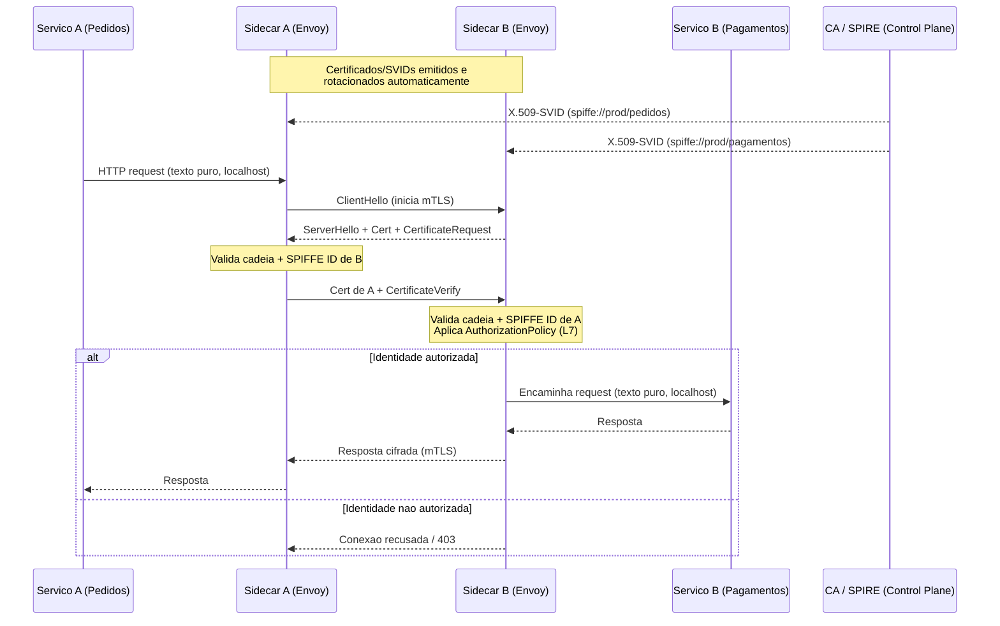

# mTLS entre serviços

> **Bloco:** Segurança arquitetural · **Nível:** Intermediário/Avançado · **Tempo de leitura:** ~22 min

## TL;DR

**mTLS (mutual TLS)** estende o TLS tradicional exigindo que **ambos** os lados da conexão apresentem e validem certificados X.509 — não só o servidor prova sua identidade ao cliente, mas o cliente também prova a sua ao servidor. Em arquiteturas de microsserviços, mTLS provê simultaneamente **autenticação mútua de identidade de workload**, **criptografia em trânsito** e **integridade** para o tráfego leste-oeste (service-to-service), substituindo a confiança baseada em rede/IP por confiança baseada em **identidade criptográfica**. O grande desafio operacional não é o protocolo (TLS é maduro), mas a **gestão do ciclo de vida de certificados em escala**: emissão, distribuição, rotação frequente e revogação para centenas de serviços efêmeros. Por isso o padrão moderno delega tudo isso a um **service mesh** (Istio, Linkerd) com **sidecars** que automatizam o handshake, combinado a um framework de identidade de workload como **SPIFFE/SPIRE**. mTLS é a tecnologia central que materializa Zero Trust para tráfego interno.

## O problema que resolve

Em uma arquitetura de microsserviços, a maior parte do tráfego é **leste-oeste**: serviços chamando serviços dentro do datacenter ou cluster. O modelo tradicional confia nesse tráfego porque ele está "dentro da rede" — premissa que Zero Trust desmonta. Os problemas concretos:

1. **Spoofing de serviço**: sem autenticação, o serviço A não tem como saber se quem o chama é realmente o serviço B legítimo ou um atacante que comprometeu um pod vizinho. Autenticação por IP/sub-rede é frágil — IPs são reciclados e reatribuídos constantemente em Kubernetes.
2. **Sniffing/interceptação interna**: tráfego não criptografado dentro do cluster é legível por quem tiver acesso à rede (atacante com foothold, side-channel em multi-tenant, logs de captura). Compliance (PCI-DSS, LGPD) frequentemente exige criptografia também *in transit* internamente.
3. **Movimento lateral**: como discutido em Zero Trust, a rede plana interna confiável é o vetor de propagação após o primeiro comprometimento.
4. **Identidade de workload**: serviços não têm "usuário e senha"; precisam de uma forma robusta e automatizável de provar quem são. Credenciais estáticas (API keys, senhas em config) são frágeis e difíceis de rotacionar.

mTLS resolve os quatro de uma vez: cada serviço carrega um **certificado** que é sua identidade criptográfica; o handshake mútuo autentica ambos os lados; a sessão TLS cifra e protege a integridade do tráfego. O problema histórico que impedia a adoção em massa era operacional — gerenciar PKI e certificados para muitos serviços era penoso e manual. A virada veio com:

- **SPIFFE** (Secure Production Identity Framework For Everyone) e **SPIRE** (seu runtime), projetos da CNCF que padronizam **identidade de workload** e entregam **certificados X.509 de curta duração, rotacionados automaticamente** (X.509-SVIDs), adequados a estabelecer mTLS diretamente entre workloads via a Workload API.
- **Service meshes** (Istio, Linkerd) que injetam um **sidecar proxy** (Envoy no Istio) capturando o tráfego e fazendo o mTLS de forma transparente, sem mudar o código da aplicação.

## O que é (definição aprofundada)

Termos-chave:

- **TLS (Transport Layer Security)**: protocolo que provê confidencialidade, integridade e autenticação do **servidor** via certificado X.509 validado contra uma **CA (Certificate Authority)** confiável. O cliente verifica o servidor; o servidor não verifica o cliente (autentica-se por outras vias, ex.: senha na camada de aplicação).
- **mTLS (mutual TLS)**: variação em que o **servidor também solicita e valida o certificado do cliente**. Resultado: **autenticação bidirecional** na própria camada de transporte. Cada parte confia na outra porque seu certificado foi emitido por uma CA confiável e a chave privada correspondente foi provada durante o handshake.
- **Certificado X.509**: documento que liga uma identidade (subject, ou no caso de workloads um **SPIFFE ID** no SAN URI, ex.: `spiffe://prod/ns/pagamentos/sa/pagamentos`) a uma chave pública, assinado por uma CA.
- **CA / PKI (Public Key Infrastructure)**: a autoridade que emite e a infraestrutura que gerencia certificados. Em mesh, frequentemente uma CA interna (Istio Citadel/istiod, ou SPIRE Server).
- **SVID (SPIFFE Verifiable Identity Document)**: a credencial de identidade SPIFFE, implementada como certificado X.509 (X.509-SVID) ou como JWT (JWT-SVID).
- **Sidecar / data plane**: o proxy (Envoy) ao lado de cada serviço que faz o mTLS transparentemente. É o **PEP** de Zero Trust.
- **Control plane**: o componente (istiod) que distribui configuração, políticas e certificados.

A diferença essencial frente a um access token (JWT/OAuth): o token autentica/autoriza no nível de **aplicação (L7)** e geralmente representa um *usuário* ou um *escopo de acesso*; o mTLS autentica no nível de **transporte (L4/L5)** e representa a **identidade do workload** (o serviço em si). São complementares — bom design usa **mTLS para identidade de serviço** e **tokens para autorização e contexto de usuário**.

## Como funciona

O **handshake mTLS** estende o handshake TLS clássico:

1. **ClientHello**: o cliente inicia, propondo versões de TLS e cipher suites.
2. **ServerHello + Certificate**: o servidor responde escolhendo parâmetros e **envia seu certificado** X.509.
3. **CertificateRequest**: a diferença do mTLS — o servidor **solicita** o certificado do cliente.
4. **Cliente valida o certificado do servidor**: verifica a cadeia até uma CA confiável, validade, e (em workloads) o SPIFFE ID esperado.
5. **Cliente envia seu certificado** + **CertificateVerify**: o cliente prova posse da chave privada assinando dados do handshake.
6. **Servidor valida o certificado do cliente**: cadeia, validade, e identidade (SPIFFE ID autorizado).
7. **Key exchange + Finished**: ambos derivam as chaves de sessão (ephemeral, via ECDHE — forward secrecy). A partir daí, o tráfego é cifrado e mutuamente autenticado.

Em um **service mesh** (Istio), nada disso toca o código da aplicação:

- O serviço `pedidos` faz uma chamada HTTP comum para `pagamentos`.
- O **sidecar Envoy** de `pedidos` intercepta o tráfego de saída, inicia mTLS com o sidecar de `pagamentos`, apresentando o certificado/SVID de `pedidos`.
- O sidecar de `pagamentos` valida o certificado de `pedidos`, e o istiod aplica a `AuthorizationPolicy` (L7) decidindo se `pedidos` pode chamar aquele endpoint.
- Os certificados são emitidos pelo control plane (ou SPIRE) e **rotacionados automaticamente** (tipicamente a cada poucas horas — SVIDs de curta duração reduzem a janela de comprometimento e dispensam revogação complexa).

Modos de aplicação no Istio:

- **`PERMISSIVE`**: aceita tanto tráfego mTLS quanto texto puro. Usado em **migração** (rolling adoption) para não quebrar serviços ainda não meshados.
- **`STRICT`**: exige mTLS para todo tráfego. Estado-alvo. Esquecer de promover de `PERMISSIVE` para `STRICT` é anti-padrão clássico.

A integração **Istio + SPIRE** permite substituir o SDS padrão do Istio pelo SPIRE, padronizando a identidade entre clusters e habilitando atestação mais granular que apenas namespace + service account — após registrar a entrada do workload, o Envoy recebe a identidade emitida pelo SPIRE e a usa em toda comunicação TLS/mTLS.

## Diagrama de fluxo



## Exemplo prático / caso real

Um **e-commerce brasileiro** roda dezenas de microsserviços em Kubernetes: `storefront`, `catalogo`, `carrinho`, `checkout`, `pagamentos`, `ledger`, `antifraude`. Requisito de PCI-DSS: tráfego que toca dados de pagamento deve ser criptografado e autenticado mesmo internamente; o serviço de `pagamentos` só pode ser chamado por `checkout` e `antifraude`.

Implementação com **Istio**:

1. Injeta-se o sidecar Envoy em todos os pods. Adota-se **SPIFFE/SPIRE** para identidade de workload, integrado ao Istio.
2. Configura-se `PeerAuthentication` em modo `PERMISSIVE` durante a migração; após validar que todo o tráfego está meshado, promove-se para `STRICT` no namespace `prod`.
3. Define-se uma `AuthorizationPolicy` em `pagamentos` que só permite chamadas vindas dos SPIFFE IDs de `checkout` e `antifraude`. Se o `catalogo` (comprometido por uma dependência vulnerável) tentar chamar `pagamentos`, o sidecar de `pagamentos` recusa — a identidade `spiffe://prod/catalogo` não está autorizada. Movimento lateral bloqueado.

Política conceitual (Istio `AuthorizationPolicy`, simplificada):

```
AuthorizationPolicy "pagamentos-allow":
  selector: app=pagamentos
  action: ALLOW
  rules:
    - from.principals:
        - "spiffe://prod/ns/checkout/sa/checkout"
        - "spiffe://prod/ns/antifraude/sa/antifraude"
      to.operation.methods: ["POST"]
      to.operation.paths: ["/charge", "/refund"]
```

Ferramentas reais: **Istio** (mesh + mTLS automático), **Linkerd** (alternativa mais leve, mTLS por padrão), **SPIFFE/SPIRE** (identidade de workload, atestação, SVIDs rotacionados), **cert-manager** (emissão de certificados em Kubernetes), **HashiCorp Vault** como CA/PKI backend para emissão de certificados (ver `05-secrets-management-vault-kms.md`). A combinação típica em produção: SPIRE para identidade + Istio para mTLS e políticas L7 + Vault como raiz de confiança.

## Quando usar / Quando evitar

**Usar quando:**

- Arquitetura de microsserviços com tráfego leste-oeste significativo e requisito de Zero Trust / micro-segmentação por identidade.
- Compliance que exige criptografia in-transit interna e autenticação forte de serviços (PCI-DSS, dados sensíveis, multi-tenant).
- Já há (ou se adota) um service mesh — nesse caso o custo marginal do mTLS é baixo, pois o mesh automatiza o ciclo de vida de certificados.

**Evitar / ponderar quando:**

- Sistema monolítico ou com pouquíssimos serviços: gerenciar PKI e sidecars para 2-3 serviços é overhead desproporcional. TLS simples + autenticação por token pode bastar.
- Sem service mesh e sem automação de PKI: fazer mTLS "na unha", com certificados manuais, é uma fonte garantida de incidentes por certificado expirado. Não faça mTLS manual em escala.
- Latência ultra-crítica em caminho extremamente quente: o handshake e a terminação no sidecar adicionam latência (mitigada por conexões persistentes e reuso de sessão, mas existe). Meça.

**Trade-offs explícitos**: mTLS adiciona **latência** (handshake; o sidecar adiciona ~1 hop e CPU), **complexidade operacional** (control plane do mesh é crítico) e **consumo de recursos** (cada sidecar consome CPU/memória). Em contrapartida, entrega autenticação mútua, criptografia e micro-segmentação por identidade praticamente de graça do ponto de vista do código de aplicação. mTLS autentica o **workload**, não o **usuário** — para contexto de usuário você ainda precisa de tokens (OIDC/JWT). Não confunda os dois nem use um para substituir o outro.

## Anti-padrões e armadilhas comuns

- **Certificados de longa duração sem rotação automática**: SVIDs/certs devem ser de curta duração e rotacionados. Certificado anual gerenciado à mão é bomba-relógio (expira em produção, fora do horário, sem alerta).
- **Ficar em `PERMISSIVE` para sempre**: aceitar mTLS *e* texto puro indefinidamente anula a garantia — basta o atacante falar texto puro. Promova para `STRICT`.
- **mTLS sem autorização (L7)**: autenticar que o chamador é "algum serviço válido do mesh" mas não restringir *qual* serviço pode chamar o quê. mTLS prova identidade; você ainda precisa de `AuthorizationPolicy` para restringir o acesso (Least Privilege).
- **Confiar em qualquer cert assinado pela CA**: aceitar qualquer certificado da CA interna sem validar a identidade específica (SPIFFE ID) significa que qualquer workload comprometido no mesh pode falar com qualquer outro.
- **Raiz de confiança mal protegida**: a chave privada da CA raiz, se vazar, compromete todo o mesh. Deve viver em HSM/KMS (ver Secrets Management).
- **mTLS manual em escala**: distribuir certificados via ConfigMaps/Secrets manuais, sem automação — não escala e quebra.
- **Ignorar revogação**: confiar apenas em validade longa sem mecanismo de revogação. SVIDs curtos contornam isso (a "revogação" é simplesmente não renovar), mas certs longos exigem CRL/OCSP funcionais.
- **Terminar TLS no LB e ir texto puro internamente** achando que é mTLS: terminação na borda não é mTLS leste-oeste.

## Relação com outros conceitos

- **mTLS ↔ Zero Trust e Service Mesh**: mTLS é a implementação concreta de ZTA para tráfego leste-oeste; o sidecar é o PEP, o control plane é o PDP. Ver `01-zero-trust-architecture.md`.
- **mTLS ↔ OAuth2 Client Credentials / JWT**: complementares — mTLS autentica o workload (transporte), tokens autorizam a operação e carregam contexto de usuário (aplicação). Ver `02-oauth2-oidc-saml-jwt.md`.
- **mTLS ↔ Secrets Management**: chaves privadas e a CA raiz são segredos críticos; Vault pode atuar como PKI backend. Ver `05-secrets-management-vault-kms.md`.
- **mTLS ↔ Least Privilege**: a `AuthorizationPolicy` por identidade de workload é Least Privilege aplicado ao tráfego de serviços. Ver `04-defense-in-depth-least-privilege-secure-by-default.md`.
- **mTLS ↔ Threat Modeling**: mitiga diretamente *Spoofing* (autenticação mútua) e *Information Disclosure*/*Tampering* (criptografia + integridade) no STRIDE. Ver `06-threat-modeling-stride-pasta.md`.

## Referências

- [SPIFFE – Secure Production Identity Framework for Everyone](https://spiffe.io/)
- [An overview of the SPIFFE specification](https://spiffe.io/docs/latest/spiffe-about/overview/)
- [SPIFFE | SPIRE Concepts](https://spiffe.io/docs/latest/spire-about/spire-concepts/)
- [SPIFFE | SPIRE Use Cases](https://spiffe.io/docs/latest/spire-about/use-cases/)
- [Istio / SPIRE integration](https://istio.io/latest/docs/ops/integrations/spire/)
- [AWS KMS | Vault | HashiCorp Developer (PKI / key management)](https://developer.hashicorp.com/vault/docs/secrets/key-management)
