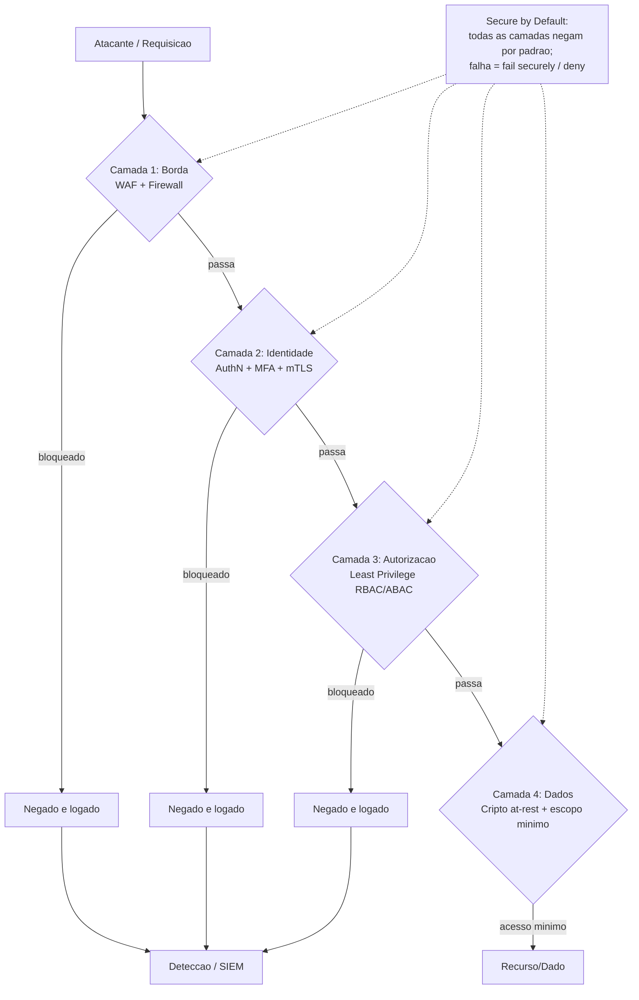

# Defense in Depth, Least Privilege, Secure by Default

> **Bloco:** Segurança arquitetural · **Nível:** Intermediário/Avançado · **Tempo de leitura:** ~22 min

## TL;DR

Três princípios fundamentais de segurança que todo arquiteto deve internalizar como reflexo de design:

- **Defense in Depth** (defesa em profundidade): nunca dependa de uma única camada de proteção. Empilhe controles redundantes e independentes (rede, host, aplicação, dados, identidade) de modo que a falha de um não comprometa o sistema. Origem na doutrina militar; codificado na guidance da NSA/NIST.
- **Least Privilege** (menor privilégio): toda entidade (usuário, serviço, processo) deve ter **apenas** as permissões estritamente necessárias para sua função, pelo menor tempo possível. Princípio articulado por **Saltzer e Schroeder (1975)**, "The Protection of Information in Computer Systems".
- **Secure by Default** (seguro por padrão): o estado inicial e a configuração-padrão de um sistema devem ser os mais seguros, exigindo ação consciente para *reduzir* a segurança — não o contrário. Inclui *fail securely*, negação por padrão e desabilitar o que não é usado.

Os três se reforçam: Least Privilege é uma das camadas de Defense in Depth; Secure by Default garante que as camadas estejam ligadas desde o início. Juntos, reduzem **blast radius** (o dano de um comprometimento) e são pré-requisitos de Zero Trust.

## O problema que resolve

Sistemas reais falham — sempre. Bugs, configurações erradas, credenciais vazadas, dependências vulneráveis, erro humano. A questão arquitetural não é *se* uma camada será violada, mas *o que acontece depois*. Os anti-padrões que esses princípios combatem:

1. **Ponto único de defesa**: a falácia do firewall de perímetro como única barreira. Quando ele cai (ou é contornado por phishing, por uma credencial legítima roubada, por movimento lateral), não há mais nada. A história da segurança é uma sucessão de "estávamos protegidos pela camada X" seguida de violação da camada X.
2. **Privilégio excessivo (over-provisioning)**: a tendência de conceder permissões amplas "para não dar trabalho depois" ou "por garantia". Roles de IAM com `*:*`, contas de serviço admin, bancos acessíveis de tudo. Cada permissão excedente é um caminho a mais para o atacante após comprometer aquela entidade. O blast radius de uma credencial vazada é proporcional aos privilégios dela.
3. **Configuração insegura por padrão**: software que vem com porta aberta, senha default, debug ligado, criptografia opcional, S3 bucket público. A maioria dos vazamentos de dados em nuvem decorre de *misconfiguration* — defaults inseguros que ninguém endureceu.

A genealogia conceitual:

- **Least Privilege** foi formalmente articulado por **Jerome Saltzer e Michael Schroeder** no clássico paper de 1975, "The Protection of Information in Computer Systems", que enumera oito princípios de design seguro — entre eles *least privilege*, *fail-safe defaults* (a origem do Secure by Default), *economy of mechanism*, *complete mediation* e *separation of privilege*. É a base teórica de quase tudo que veio depois.
- **Defense in Depth** vem da estratégia militar (camadas de defesa que desgastam o atacante) e foi adotada na segurança da informação pela NSA e pelo NIST como princípio arquitetural — múltiplos controles independentes e sobrepostos.
- **Secure by Default** ganhou força com a crise de segurança dos anos 2000 (Trustworthy Computing da Microsoft, 2002) e hoje é central nas iniciativas **Secure by Design / Secure by Default** da CISA e do NCSC britânico, e em práticas como as do **OWASP**.

## O que é (definição aprofundada)

### Defense in Depth

Empilhamento de **controles independentes e redundantes** em múltiplas camadas, de modo que comprometer uma não dê acesso ao alvo. Camadas típicas, da borda ao dado:

- **Rede**: firewalls, segmentação, WAF, micro-segmentação, NetworkPolicies.
- **Transporte**: TLS/mTLS, criptografia in-transit.
- **Host / runtime**: hardening de OS, EDR, contêineres com least privilege (não-root, read-only filesystem, seccomp).
- **Aplicação**: validação de input, autenticação/autorização, rate limiting, output encoding.
- **Dados**: criptografia at-rest, tokenização, mascaramento, controle de acesso granular.
- **Identidade**: MFA, RBAC/ABAC, rotação de credenciais.
- **Detecção/resposta**: logging, SIEM, alertas, capacidade de resposta a incidentes.

A chave é **independência**: as camadas não devem compartilhar o mesmo modo de falha. Dois firewalls do mesmo fornecedor com o mesmo bug não são defesa em profundidade real. **Importante**: Defense in Depth **não** é desculpa para camadas individualmente fracas ("não tem problema, a próxima camada pega") — cada camada deve ser robusta; a redundância é seguro contra o inesperado, não muleta para o relaxamento.

### Least Privilege

Cada entidade recebe o **conjunto mínimo** de permissões necessárias para sua função legítima, e **apenas pelo tempo necessário**. Dimensões:

- **Granularidade**: permissões específicas (`s3:GetObject` em um bucket) em vez de amplas (`s3:*`).
- **Escopo temporal**: credenciais de curta duração, acesso *just-in-time* (JIT), elevação temporária com expiração — em vez de privilégios permanentes.
- **Separação de deveres (Separation of Duties)**: nenhuma entidade acumula poder suficiente para causar dano sozinha (ex.: quem aprova ≠ quem executa).
- **Princípio relacionado — Need to Know**: acesso a dados restrito a quem precisa deles.

Operacionaliza-se via **IAM** (roles, policies), **RBAC** (role-based) e **ABAC** (attribute-based), além de scopes de OAuth e `AuthorizationPolicy` em mesh.

### Secure by Default

O estado padrão é o **mais seguro**; relaxar exige decisão explícita e auditável. Manifestações:

- **Fail securely / fail-safe defaults**: em caso de erro/dúvida, **negar** acesso, não conceder. Uma falha no sistema de autorização deve bloquear, não liberar.
- **Deny by default**: tudo proibido a menos que explicitamente permitido (allowlist > denylist).
- **Minimização de superfície de ataque**: desabilitar features, portas e endpoints não usados; instalar o mínimo.
- **Defaults seguros de configuração**: sem senhas default, criptografia ligada, debug desligado, recursos privados por padrão.

## Como funciona

A mecânica integrada de aplicar os três em um sistema:

1. **Modele as camadas (Defense in Depth)**: para cada ativo crítico, identifique pelo menos 2-3 camadas independentes que um atacante teria de atravessar. Ex.: para chegar ao banco de pagamentos — (1) atravessar a borda, (2) ter identidade de workload autorizada (mTLS), (3) ter credencial de DB com permissão específica, (4) passar pela criptografia at-rest. Cada uma é independente.
2. **Aplique Least Privilege em cada camada**: defina roles IAM mínimas, scopes mínimos, NetworkPolicies que negam por padrão e permitem só o necessário, contas de serviço sem privilégios de admin. Use credenciais de curta duração e JIT para acessos privilegiados de humanos.
3. **Configure Secure by Default**: comece de uma postura de *deny all* e abra explicitamente; desligue o que não usa; falhe fechando. Em IaC (Terraform), o módulo-base já vem hardened, e abrir algo exige sobrescrever explicitamente (visível em code review).
4. **Valide com Threat Modeling**: cada *trust boundary* do DFD deve ter controles; cada ameaça STRIDE deve ter uma mitigação em pelo menos uma camada.

O **fail securely** merece destaque arquitetural: muitos incidentes vêm de *fail open*. Exemplo clássico — um middleware de autorização que, ao falhar em consultar o serviço de permissões (timeout), "libera para não derrubar o sistema". Isso transforma uma indisponibilidade do serviço de auth em uma brecha de autorização total. O correto é **negar** e degradar funcionalidade, não segurança.

## Diagrama de fluxo



## Exemplo prático / caso real

Um **marketplace fintech brasileiro** projeta o acesso ao subsistema de pagamentos aplicando os três princípios:

**Defense in Depth** — para um atacante chegar a debitar uma conta, precisa atravessar:

1. WAF + rate limiting na borda (bloqueia ataques automatizados e injeção).
2. Autenticação OIDC + MFA no IdP (Keycloak) para humanos; mTLS para serviços.
3. `AuthorizationPolicy` no service mesh: só `checkout` e `antifraude` chamam `pagamentos`.
4. Credencial de banco escopada: o serviço `pagamentos` usa uma role de DB que só pode executar as procedures específicas, não `DROP`/`TRUNCATE`.
5. Dados de cartão tokenizados e cifrados at-rest com chave em **AWS KMS**.
6. Logging completo para SIEM, com alertas de anomalia.

Comprometer o serviço de `catalogo` (porta de entrada mais provável, por dependência vulnerável) não dá nada: ele não tem identidade autorizada para falar com `pagamentos`, nem credencial de DB, nem chave KMS.

**Least Privilege** — políticas IAM concretas (conceitual, AWS):

```
# Anti-padrao a evitar:
# Effect: Allow, Action: "*", Resource: "*"

# Least Privilege:
PolicyServicoPagamentos:
  - Effect: Allow
    Action: ["kms:Decrypt"]
    Resource: "arn:aws:kms:...:key/chave-tokenizacao-cartao"
  - Effect: Allow
    Action: ["dynamodb:GetItem", "dynamodb:PutItem"]
    Resource: "arn:aws:dynamodb:...:table/transacoes"
    Condition: { StringEquals: { "dynamodb:LeadingKeys": ["${aws:PrincipalTag/tenant}"] } }
```

A role não pode listar outras tabelas, não pode usar outras chaves KMS, não pode acessar dados de outros tenants. Acesso administrativo de humanos é **JIT**: um engenheiro solicita elevação temporária (aprovada por outro, separation of duties), válida por 1 hora, com tudo auditado.

**Secure by Default** — os módulos Terraform do marketplace vêm com: buckets S3 privados e cifrados por padrão (bloqueio de acesso público no nível da conta), security groups que negam tudo, TLS obrigatório, logging habilitado. Abrir um bucket ao público exige sobrescrever explicitamente um parâmetro — visível e questionável em code review.

Ferramentas: **AWS IAM** + **IAM Access Analyzer** (detecta permissões excessivas e acessos externos), **AWS Organizations SCPs** (guardrails), **HashiCorp Vault** (credenciais dinâmicas de curta duração), **OPA/Gatekeeper** (políticas como código), **tfsec/Checkov** (detecta IaC insegura no CI).

## Quando usar / Quando evitar

Estes não são opcionais — são **princípios universais** que se aplicam a qualquer sistema com requisitos de segurança. A questão não é *se* aplicar, mas *quanto* (proporcional ao valor do ativo e ao risco). Trade-offs reais:

- **Defense in Depth vs. complexidade e custo**: mais camadas = mais componentes para operar, mais latência, mais custo. Em um sistema interno de baixo risco, três camadas pesadas podem ser exagero. Calibre pela criticidade. O erro grave é o oposto: ativo crítico com camada única.
- **Least Privilege vs. fricção operacional**: permissões mínimas e JIT criam atrito (pedir acesso toda vez, esperar aprovação). Mal calibrado, vira teatro burlado (gente compartilhando credenciais admin para "agilizar"). A solução é **automatizar** a concessão mínima (IaC, roles bem definidas) e o JIT, não afrouxar. Privilégio amplo "por produtividade" é dívida de segurança garantida.
- **Secure by Default vs. usabilidade/DX**: defaults muito restritivos podem frustrar quem só quer começar. O balanço: seguro por padrão, com caminho **claro e auditável** para abrir o necessário. Nunca o inverso (inseguro por padrão, "lembre de fechar depois" — ninguém lembra).

Em protótipos/POCs descartáveis, é legítimo relaxar — desde que fique **explícito que não vão a produção** e que o caminho a produção force o hardening.

## Anti-padrões e armadilhas comuns

- **Perímetro como única defesa**: o firewall/VPN como única barreira. Cai e expõe tudo. (Ver Zero Trust.)
- **Camadas fracas justificadas pela profundidade**: "a próxima camada pega" — cada camada deve ser robusta por si.
- **Privilégio permanente e amplo**: roles com `*:*`, contas de serviço admin, "deixa aberto que depois a gente restringe" (nunca restringem).
- **Fail open**: liberar acesso quando o sistema de autorização falha. Transforma indisponibilidade em brecha.
- **Privilege creep**: permissões acumuladas ao longo do tempo (mudanças de função, acessos temporários que viraram permanentes) e nunca revisadas. Faça **revisões periódicas de acesso**.
- **Defaults inseguros**: senha padrão, S3 público, debug/verbose em produção, criptografia opcional, portas administrativas expostas.
- **Allowlist confundida com denylist**: bloquear o "ruim conhecido" (denylist) em vez de permitir só o "bom conhecido" (allowlist). Atacantes acham o que não está na denylist.
- **Segredos como exceção ao princípio**: dar a um serviço acesso ao cofre inteiro de segredos em vez de apenas aos seus. (Ver Secrets Management.)
- **Confundir Defense in Depth com Security Theater**: empilhar controles redundantes do mesmo tipo (mesmo modo de falha) e achar que está mais seguro.

## Relação com outros conceitos

- **Least Privilege ↔ IAM**: IAM é o mecanismo primário de operacionalizar Least Privilege em nuvem; roles, policies e SCPs são a materialização.
- **Least Privilege ↔ Zero Trust**: ZTA é, em parte, Least Privilege aplicado dinamicamente e por sessão. Ver `01-zero-trust-architecture.md`.
- **Defense in Depth ↔ mTLS / Service Mesh**: mTLS e micro-segmentação são camadas da defesa em profundidade para tráfego interno. Ver `03-mtls-entre-servicos.md`.
- **Least Privilege ↔ OAuth scopes**: scopes são Least Privilege para acesso a APIs. Ver `02-oauth2-oidc-saml-jwt.md`.
- **Secure by Default ↔ Secrets Management / IaC**: módulos de infra hardened por padrão e segredos com acesso mínimo. Ver `05-secrets-management-vault-kms.md`.
- **Os três ↔ Threat Modeling**: o threat model identifica onde cada camada e cada restrição de privilégio são necessárias; as mitigações STRIDE materializam Defense in Depth. Ver `06-threat-modeling-stride-pasta.md`.

## Referências

- [SP 800-207, Zero Trust Architecture | CSRC (NIST)](https://csrc.nist.gov/pubs/sp/800/207/final)
- [The OWASP Threat Modeling Cheat Sheet (controles e mitigacoes)](https://cheatsheetseries.owasp.org/cheatsheets/Threat_Modeling_Cheat_Sheet.html)
- [JSON Web Token for Java - OWASP Cheat Sheet Series (fail securely, hardening)](https://cheatsheetseries.owasp.org/cheatsheets/JSON_Web_Token_for_Java_Cheat_Sheet.html)
- [SPIFFE – Secure Production Identity Framework for Everyone (identidade minima de workload)](https://spiffe.io/)
- [AWS KMS | Vault | HashiCorp Developer (controle de chaves)](https://developer.hashicorp.com/vault/docs/secrets/key-management)
