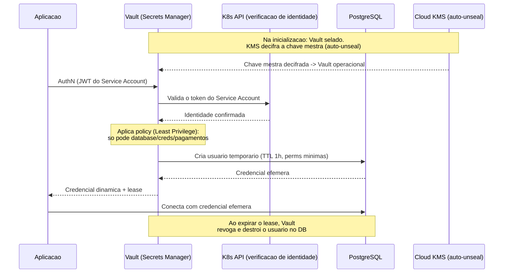

# Secrets Management (Vault, KMS)

> **Bloco:** Segurança arquitetural · **Nível:** Intermediário/Avançado · **Tempo de leitura:** ~23 min

## TL;DR

**Secrets Management** é a disciplina de armazenar, distribuir, rotacionar, auditar e revogar **segredos** — senhas de banco, API keys, tokens, chaves de criptografia, certificados — de forma centralizada e segura, fora do código e da configuração versionada. O problema central que resolve é o **secret sprawl**: segredos espalhados em código, arquivos `.env`, variáveis de ambiente, pipelines de CI, imagens de contêiner e canais de chat, impossíveis de rastrear, rotacionar ou revogar. Duas categorias de ferramentas dominam: **gerenciadores de segredos** (HashiCorp Vault, AWS Secrets Manager) que guardam e servem segredos com auditoria e rotação; e **KMS (Key Management Services)** (AWS KMS, GCP/Azure KMS) que gerenciam o ciclo de vida de **chaves criptográficas** e realizam operações de cripto sem nunca expor a chave mestra. O padrão de ouro é **segredos dinâmicos de curta duração** (credenciais geradas sob demanda, com TTL) em vez de segredos estáticos de longa vida, e **criptografia em camadas** com chave mestra protegida por hardware (HSM/KMS). Secrets Management é pré-requisito de Zero Trust, Least Privilege e infraestrutura imutável.

## O problema que resolve

Toda aplicação não-trivial precisa de segredos para funcionar: conectar ao banco, chamar APIs externas, cifrar dados. O problema é *onde* esses segredos vivem. As soluções ingênuas — e por que falham:

1. **Segredos no código-fonte**: hardcoded em strings, ou em arquivos de config commitados. É o pior caso: o segredo fica no histórico do Git **para sempre** (mesmo após "remover", o commit anterior persiste); vaza junto com o código; é visível a todo desenvolvedor; impossível rotacionar sem novo deploy. Vazamentos de chaves AWS no GitHub levando a contas sequestradas e faturas de milhares de dólares são lugar-comum.
2. **Variáveis de ambiente versionadas / `.env` no repo**: parece melhor, mas se o `.env` é commitado (acidental ou "temporariamente"), recai no problema 1. Mesmo não versionado, env vars vazam em logs, dumps de processo, mensagens de erro, e são herdadas por processos-filho.
3. **Segredos estáticos de longa duração**: uma senha de banco que vale por anos. Se vazar, a janela de exposição é enorme; rotacionar manualmente em todos os consumidores é doloroso, então ninguém rotaciona.
4. **Falta de auditoria e revogação**: sem registro de quem acessou qual segredo quando, e sem capacidade de revogar instantaneamente um segredo comprometido.

A indústria respondeu com ferramentas dedicadas. O **HashiCorp Vault** popularizou o conceito de gerenciador de segredos centralizado com **segredos dinâmicos** (gera credenciais sob demanda, com TTL e revogação automática), engine de criptografia como serviço, e auditoria completa. Os provedores de nuvem ofereceram **AWS Secrets Manager** / **AWS Systems Manager Parameter Store** (armazenamento e rotação gerenciados) e **AWS KMS** (gerenciamento de chaves com FIPS 140-2 e HSMs). O **KMS** ataca um subproblema distinto: como cifrar dados sem expor a **chave mestra**? Resposta: a chave mestra (CMK) **nunca sai** do KMS/HSM; o KMS realiza as operações de cripto/decripto, ou implementa **envelope encryption**.

## O que é (definição aprofundada)

Termos-chave:

- **Secret (segredo)**: qualquer dado cuja exposição compromete segurança — senhas, API keys, tokens, chaves privadas, certificados, strings de conexão.
- **Secrets Manager**: sistema que armazena segredos cifrados, controla acesso (com authn/authz e Least Privilege), audita cada acesso, e suporta rotação. Ex.: Vault, AWS Secrets Manager.
- **Segredo estático vs. dinâmico**:
  - **Estático**: armazenado e servido como está (ex.: uma API key de terceiro). Rotação é manual ou agendada.
  - **Dinâmico**: **gerado sob demanda** pelo gerenciador no momento do acesso, com **TTL** curto, e **revogado automaticamente** ao expirar. Ex.: o Vault cria um usuário temporário no PostgreSQL com permissões mínimas, válido por 1 hora, e o destrói depois. Reduz drasticamente a janela de exposição.
- **KMS (Key Management Service)**: gerencia o ciclo de vida de **chaves criptográficas**. A **CMK / chave mestra** nunca é exportada em texto puro.
- **Envelope Encryption**: padrão central do KMS. Em vez de cifrar dados diretamente com a chave mestra (custoso e arriscado), gera-se uma **Data Encryption Key (DEK)** por item; a DEK cifra o dado; a DEK é então cifrada pela **Key Encryption Key (KEK / CMK)** no KMS. Armazena-se o dado cifrado + a DEK cifrada juntos. Para decifrar, o KMS decifra a DEK (operação rápida, a CMK nunca sai), e a DEK decifra o dado. Permite cifrar grandes volumes com chamadas mínimas ao KMS e isolar a chave mestra.
- **HSM (Hardware Security Module)**: dispositivo de hardware que guarda chaves e faz operações cripto à prova de extração. KMS usa HSMs por trás (FIPS 140-2/140-3).
- **Sealing / Unsealing (Vault)**: o Vault inicia "selado" — seus dados estão cifrados e a chave mestra não está em memória. Para operar, precisa ser "dessellado". O **auto-unseal** delega isso a um KMS de nuvem (AWS KMS, Azure Key Vault, GCP KMS), evitando o processo manual de Shamir's Secret Sharing.
- **Rotação**: troca periódica e automática de segredos, idealmente sem downtime, com período de overlap (dois segredos válidos durante a transição).
- **Auditoria**: log imutável de cada acesso (quem, o quê, quando), essencial para compliance e forense.

A distinção arquitetural: **Secrets Manager** responde "onde guardo e como sirvo segredos com segurança"; **KMS** responde "como faço criptografia sem expor a chave mestra". Eles se combinam — o Vault frequentemente usa um KMS de nuvem para auto-unseal e pode atuar como front-end de cripto sobre chaves do KMS.

## Como funciona

Fluxo de um segredo **dinâmico** com Vault (caso de credencial de banco):

1. A aplicação (ou seu sidecar/agent) se **autentica** no Vault. Em vez de uma senha estática (problema circular: como guardar o segredo de acesso ao cofre de segredos?), usa-se um **auth method** baseado em identidade verificável: **Kubernetes Service Account** (Vault valida o JWT do SA contra a API do K8s), **AWS IAM** (valida a identidade da instância/role), **AppRole**, ou identidade SPIFFE.
2. O Vault aplica **policies** (Least Privilege): aquela identidade só pode ler o caminho `database/creds/pagamentos`.
3. O Vault, via seu **database secrets engine**, conecta-se ao PostgreSQL com sua credencial privilegiada e **cria sob demanda** um usuário temporário com permissões mínimas e **TTL** (ex.: 1h).
4. O Vault retorna essas credenciais efêmeras à aplicação, junto a um **lease**.
5. A aplicação usa as credenciais. Ao expirar o lease (ou por revogação explícita), o Vault **destrói** o usuário no banco automaticamente.

Resultado: nenhuma credencial de longa duração; cada workload tem credenciais únicas e rastreáveis; comprometimento tem janela de minutos/horas, não anos; revogação é instantânea.

Fluxo de **envelope encryption** com AWS KMS (cifrar um dado):

1. A aplicação chama `GenerateDataKey` no KMS, referenciando a CMK.
2. O KMS retorna a **DEK em texto puro** (para uso imediato) **e** a **DEK cifrada** pela CMK.
3. A aplicação cifra o dado com a DEK em texto puro, depois **descarta a DEK em texto puro da memória**.
4. Armazena: `dado_cifrado` + `DEK_cifrada`.
5. Para decifrar: envia a `DEK_cifrada` ao KMS (`Decrypt`), recebe a DEK em texto puro, decifra o dado, descarta a DEK. A CMK **nunca** deixou o KMS.

O **auto-unseal** do Vault usa o KMS como mecanismo de seal wrapping: a chave mestra do Vault é cifrada pelo KMS; ao iniciar, o Vault pede ao KMS para decifrá-la, dessellando automaticamente sem intervenção humana.

## Diagrama de fluxo



## Exemplo prático / caso real

Uma **fintech brasileira** em Kubernetes na AWS precisa eliminar segredos do código e atender auditoria (LGPD, exigências do regulador). Arquitetura:

- **HashiCorp Vault** como gerenciador central, com **auto-unseal via AWS KMS** (a chave mestra do Vault é selada pela CMK no KMS; sem operadores dessellando à mão).
- **Autenticação por Kubernetes Service Account**: cada microsserviço se autentica no Vault com seu SA; nenhum segredo de bootstrap embutido. A policy do Vault dá a cada serviço acesso **apenas** aos seus segredos (Least Privilege).
- **Credenciais de banco dinâmicas**: o serviço `pagamentos` recebe um usuário PostgreSQL efêmero (TTL 1h) com permissão só nas tabelas que usa. Vazamento da credencial expõe por no máximo 1 hora, e com privilégios mínimos.
- **Criptografia de dados sensíveis com envelope encryption + AWS KMS**: números de cartão tokenizados; o token e a chave de dados (DEK) cifrada são armazenados; a CMK no KMS nunca é exposta. Acesso à CMK é restrito por política IAM e logado no CloudTrail.
- **Segredos de terceiros (API keys de gateways de pagamento)**: armazenados como segredos estáticos no Vault (ou **AWS Secrets Manager** com rotação agendada), nunca em env vars versionadas.

Injeção sem expor em env var versionada — o **Vault Agent** (ou **External Secrets Operator**) injeta o segredo em um arquivo em volume `tmpfs` (memória) ou diretamente na aplicação, fora do `git` e fora da imagem.

Pseudocódigo leve de leitura de segredo dinâmico:

```
# A aplicacao NUNCA tem credencial de banco embutida.
identidade = service_account_token()          # provido pelo K8s
sessao_vault = vault.login(method="kubernetes", jwt=identidade)
creds = sessao_vault.read("database/creds/pagamentos")  # usuario+senha efemeros
db = conectar(usuario=creds.user, senha=creds.pass)      # TTL 1h
# ... ao fim do lease, Vault revoga automaticamente
```

Ferramentas: **HashiCorp Vault**, **AWS KMS**, **AWS Secrets Manager**, **AWS Systems Manager Parameter Store** (alternativa econômica para configs/segredos simples), **External Secrets Operator** (sincroniza segredos para o K8s), **SOPS** + KMS (cifrar segredos em GitOps), **git-secrets**/**gitleaks**/**truffleHog** (detectar segredos vazados no CI).

## Quando usar / Quando evitar

**Usar gerenciador de segredos (Vault / Secrets Manager) quando:**

- Qualquer sistema que vá a produção com segredos (ou seja, praticamente todos). Não há justificativa para segredo em código em produção.
- Necessidade de rotação automática, auditoria, revogação e segredos dinâmicos (compliance, dados sensíveis, multi-equipe).
- Muitos serviços/ambientes — centralizar evita secret sprawl.

**Usar KMS quando:**

- Você precisa cifrar dados at-rest com gestão robusta de chaves (compliance exige chave gerenciada com HSM e auditoria).
- Envelope encryption para grandes volumes sem expor a chave mestra.
- Auto-unseal de Vault, assinatura, gestão de chaves de mTLS/PKI.

**Vault self-hosted vs. serviço gerenciado (Secrets Manager)** — trade-off:

- **Vault**: mais poderoso e portável (multi-cloud, segredos dinâmicos ricos, PKI, transit engine), mas você opera um sistema **crítico e complexo** (HA, unseal, upgrades, backup). Errar aqui é catastrófico (cofre indisponível = sistema parado; cofre comprometido = tudo comprometido).
- **AWS Secrets Manager / KMS**: gerenciado, menos operação, integração nativa com IAM, mas **lock-in** ao provedor e menos flexível em segredos dinâmicos.

**Evitar overengineering**: para um script interno trivial, montar Vault em HA é exagero — Parameter Store ou um secret store gerenciado simples basta. Calibre pela criticidade.

**Trade-offs explícitos**: o gerenciador de segredos vira **dependência crítica** no caminho de inicialização (se o Vault está fora, serviços não sobem) — exige HA, cache e degradação graciosa. Segredos dinâmicos adicionam latência (geração sob demanda) — mitigada por caching de lease. KMS adiciona latência e custo por chamada — mitigado por envelope encryption (poucas chamadas) e cache de DEK.

## Anti-padrões e armadilhas comuns

- **Segredos hardcoded no código** ou em config commitada — vazam no histórico do Git para sempre.
- **`.env` / variáveis de ambiente versionadas** — recai no problema acima; env vars vazam em logs e dumps.
- **Segredos em imagens de contêiner** (ARG/ENV no Dockerfile) — ficam nas layers, extraíveis por qualquer um com a imagem.
- **Segredos em logs / mensagens de erro / URLs** — captura acidental em telemetria.
- **Segredos estáticos eternos** sem rotação — janela de exposição infinita.
- **Um segredo mestre dando acesso a tudo** — viola Least Privilege; comprometê-lo compromete o cofre inteiro. Cada serviço acessa só os seus segredos.
- **Não rotacionar a chave mestra / CMK** ou não restringir quem pode usá-la (política IAM frouxa no KMS).
- **Auto-unseal mal configurado** ou chaves de unseal manuais guardadas inseguramente — recria o problema circular.
- **Confundir codificação com criptografia** — Base64 não é segurança (caso clássico em Kubernetes: Secrets nativos são apenas Base64 por padrão; habilite *encryption at rest* no etcd e/ou use Vault/KMS).
- **Não ter plano de revogação** — descobrir um vazamento e não conseguir revogar rápido.
- **Não escanear o repositório** por segredos vazados (sem gitleaks/truffleHog no CI).

## Relação com outros conceitos

- **Secrets ↔ Immutable Infrastructure / GitOps**: a infra imutável e o GitOps exigem que segredos *não* fiquem no repositório versionado — daí ferramentas como SOPS+KMS (cifrar antes de commitar) e External Secrets Operator (injetar em runtime). Ver bloco de Evolução/Práticas.
- **Secrets ↔ Least Privilege**: cada workload acessa apenas seus próprios segredos; segredos dinâmicos são Least Privilege temporal. Ver `04-defense-in-depth-least-privilege-secure-by-default.md`.
- **Secrets ↔ mTLS / PKI**: o Vault pode atuar como CA, emitindo certificados de curta duração para mTLS; a chave raiz fica protegida no KMS/HSM. Ver `03-mtls-entre-servicos.md`.
- **Secrets ↔ OAuth2/OIDC**: client secrets e chaves de assinatura de JWT são segredos que devem viver no cofre. Ver `02-oauth2-oidc-saml-jwt.md`.
- **Secrets ↔ Zero Trust**: a autenticação no cofre por identidade verificável (SA do K8s, IAM) é Zero Trust aplicado ao acesso a segredos. Ver `01-zero-trust-architecture.md`.
- **Secrets ↔ Threat Modeling**: *Information Disclosure* e *Elevation of Privilege* (STRIDE) frequentemente exploram segredos mal geridos. Ver `06-threat-modeling-stride-pasta.md`.

## Referências

- [Vault product documentation | HashiCorp Developer](https://developer.hashicorp.com/vault/docs)
- [Key management secrets engine | Vault | HashiCorp Developer](https://developer.hashicorp.com/vault/docs/secrets/key-management)
- [AWS KMS seal configuration | Vault | HashiCorp Developer](https://developer.hashicorp.com/vault/docs/configuration/seal/awskms)
- [Auto-unseal Vault using AWS KMS | Vault | HashiCorp Developer](https://developer.hashicorp.com/vault/tutorials/auto-unseal/autounseal-aws-kms)
- [AWS KMS | Vault | HashiCorp Developer (key management secrets engine)](https://developer.hashicorp.com/vault/docs/secrets/key-management/awskms)
- [JSON Web Token for Java - OWASP Cheat Sheet Series (gestao de segredo de assinatura)](https://cheatsheetseries.owasp.org/cheatsheets/JSON_Web_Token_for_Java_Cheat_Sheet.html)
