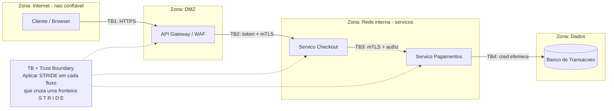

# Threat Modeling (STRIDE, PASTA)

> **Bloco:** Segurança arquitetural · **Nível:** Intermediário/Avançado · **Tempo de leitura:** ~24 min

## TL;DR

**Threat Modeling** é a prática estruturada de, ainda na fase de design, **identificar sistematicamente** o que pode dar errado em termos de segurança, *antes* de o atacante fazer por você. Responde a quatro perguntas (formuladas por Adam Shostack): *O que estamos construindo? O que pode dar errado? O que vamos fazer a respeito? Fizemos um bom trabalho?* Duas metodologias dominam o repertório do arquiteto:

- **STRIDE** (Microsoft): um mnemônico de seis categorias de ameaça — **S**poofing, **T**ampering, **R**epudiation, **I**nformation Disclosure, **D**enial of Service, **E**levation of Privilege — aplicado sobre um **DFD (Data Flow Diagram)** com **trust boundaries**. É *threat-centric*, ótimo para começar e para análise técnica orientada a arquitetura.
- **PASTA** (Process for Attack Simulation and Threat Analysis), de **Tony UcedaVélez**: um processo *risk-centric* de **sete estágios** que alinha ameaças aos **objetivos de negócio**, perfila o atacante e simula ataques. Mais pesado, mais completo, melhor quando a análise precisa falar a língua do risco de negócio.

A regra é que threat modeling deve ser **contínuo e barato**, integrado ao design, não um ritual anual. Ferramentas como **OWASP Threat Dragon** e o **Microsoft Threat Modeling Tool** ajudam a desenhar DFDs e derivar ameaças.

## O problema que resolve

Segurança adicionada *depois* (bolt-on) é cara, incompleta e frágil. Corrigir uma falha de design em produção custa ordens de magnitude mais que evitá-la no quadro branco. O problema concreto que threat modeling ataca: equipes projetam sistemas focando em funcionalidade ("o caminho feliz") e descobrem as ameaças só quando um pentest, um auditor — ou um atacante — as encontra. Sem um método, a análise de segurança vira *ad hoc*: depende da intuição de quem está na sala, esquece categorias inteiras de ameaça, e não é reproduzível nem auditável.

Threat modeling traz **sistematicidade**: força a olhar cada elemento do sistema e cada fluxo de dado através de uma lente estruturada de "como isso pode ser atacado", garantindo cobertura e priorização racional. Origens:

- **STRIDE** foi criado na **Microsoft** (Loren Kohnfelder e Praerit Garg, 1999) e popularizado pela cultura de Security Development Lifecycle (SDL) da empresa nos anos 2000. É hoje o ponto de partida mais comum, especialmente para equipes que trabalham com arquiteturas baseadas em DFD. Adam Shostack ("Threat Modeling: Designing for Security", 2014) consolidou a abordagem.
- **PASTA** foi criado por **Tony UcedaVélez** (com Marco Morana) por volta de 2012 como um framework de threat modeling focado em **risco**, estruturado em sete estágios. Resolve uma limitação do STRIDE puro: STRIDE diz *quais* ameaças técnicas existem, mas não as conecta naturalmente ao **impacto de negócio** nem à **probabilidade real** dado um perfil de atacante. PASTA cobre componentes técnicos *e* adiciona objetivos de negócio, perfilamento técnico e simulação de ataque por cima.
- O **OWASP** mantém o **Threat Modeling Cheat Sheet** e o projeto **OWASP Threat Dragon** (ferramenta open source que suporta STRIDE/LINDDUN/CIA, modela diagramas e usa um motor de regras para auto-gerar ameaças e mitigações).

## O que é (definição aprofundada)

### Conceitos transversais

- **DFD (Data Flow Diagram)**: representação do sistema com quatro tipos de elemento — **External Entity** (ator/usuário/sistema externo, desenhado como retângulo), **Process** (componente que processa, círculo), **Data Store** (onde dados repousam, linhas paralelas), e **Data Flow** (movimento de dados, seta). É a base do STRIDE.
- **Trust Boundary**: linha que separa zonas de confiança diferentes (ex.: internet ↔ DMZ, frontend ↔ backend, app ↔ banco). É onde os dados cruzam de uma zona menos confiável para outra — **os pontos mais críticos** do modelo, onde ataques se concentram e onde controles (autenticação, validação, ZTA, mTLS) são imperativos.
- **Asset**: o que tem valor e precisa ser protegido (dados de clientes, fundos, integridade transacional, disponibilidade).
- **Threat / Ameaça**: evento potencial que causa dano a um asset. **Vulnerability**: fraqueza que a ameaça explora. **Attack/Exploit**: a concretização. **Mitigation/Control**: o que reduz a ameaça.

### STRIDE — as seis categorias

Cada categoria viola uma propriedade de segurança:

| Categoria | Ameaça | Propriedade violada | Mitigação típica |
|---|---|---|---|
| **S**poofing | Fingir ser outra entidade | Autenticação | AuthN forte, MFA, mTLS, assinatura |
| **T**ampering | Alterar dados/código indevidamente | Integridade | Assinatura, hashing, checksums, controle de acesso |
| **R**epudiation | Negar ter feito uma ação | Não-repúdio | Logging auditável, assinatura, timestamps |
| **I**nformation Disclosure | Vazar dados a quem não deveria ver | Confidencialidade | Criptografia (in-transit/at-rest), Least Privilege |
| **D**enial of Service | Tornar o sistema indisponível | Disponibilidade | Rate limiting, autoscaling, redundância, quotas |
| **E**levation of Privilege | Ganhar permissões além das devidas | Autorização | Least Privilege, sandboxing, validação, RBAC/ABAC |

O método STRIDE-per-element aplica essas categorias a cada elemento do DFD (External Entities tipicamente sofrem S e R; Data Flows sofrem T, I, D; Data Stores sofrem T, I, R, D; Processes sofrem todos).

### PASTA — os sete estágios

1. **Define Objectives**: objetivos de negócio e de segurança, requisitos de compliance, análise de impacto preliminar.
2. **Define Technical Scope**: fronteiras técnicas — arquitetura, componentes, dependências, superfície de ataque.
3. **Application Decomposition**: decompor o sistema (DFDs, fluxos, atores, trust boundaries) e identificar assets.
4. **Threat Analysis**: analisar ameaças usando inteligência (threat intel, logs, padrões de ataque reais).
5. **Vulnerability Analysis**: correlacionar ameaças com vulnerabilidades concretas (CVEs, fraquezas de design, achados de scanners).
6. **Attack Modeling**: modelar ataques (attack trees, simulação) — como o atacante encadearia as vulnerabilidades para atingir os assets.
7. **Risk & Impact Analysis**: quantificar risco (probabilidade × impacto), priorizar e definir contramedidas alinhadas ao negócio.

A diferença essencial: **STRIDE é threat-centric** (parte das categorias de ameaça e varre o sistema); **PASTA é risk-centric** (parte do negócio e do atacante, e termina em risco priorizado). STRIDE é mais leve e técnico; PASTA é mais abrangente e custoso, melhor para sistemas de alto risco onde a conversa precisa chegar à diretoria em termos de risco financeiro.

## Como funciona

O fluxo prático do **STRIDE** (o mais comum no dia a dia):

1. **Desenhe o DFD**: mapeie external entities, processes, data stores e data flows. Trace as **trust boundaries** — todo ponto onde dados cruzam zonas de confiança.
2. **Enumere ameaças por elemento (STRIDE-per-element)**: para cada elemento e cada fluxo que cruza uma trust boundary, pergunte as seis categorias. "Este fluxo do cliente para a API pode sofrer Spoofing? (alguém finge ser o cliente?) Tampering? (dados alterados em trânsito?) Information Disclosure? (interceptação?)" e assim por diante.
3. **Para cada ameaça identificada, decida a resposta**: **Mitigar** (adicionar controle), **Eliminar** (remover o elemento/fluxo), **Transferir** (terceirizar o risco) ou **Aceitar** (risco residual documentado e assinado).
4. **Defina mitigações** e mapeie-as para os controles arquiteturais (autenticação, criptografia, Least Privilege — note que cada mitigação é uma camada de Defense in Depth).
5. **Valide e itere**: revise quando a arquitetura mudar. Threat modeling é vivo.

O **PASTA** percorre os sete estágios sequencialmente, mas o coração técnico (estágios 3-6) reaproveita DFDs e pode usar STRIDE internamente na análise de ameaças — as metodologias não são mutuamente exclusivas; PASTA frequentemente embute STRIDE.

Ponto operacional crítico: threat modeling deve ser **incremental e barato**. Não espere o sistema pronto. Faça em sessões curtas no design de cada feature relevante, idealmente como parte do refinamento. Ferramentas: **OWASP Threat Dragon** (desenha DFD e auto-sugere ameaças STRIDE com mitigações), **Microsoft Threat Modeling Tool** (DFD + geração de ameaças STRIDE), e até quadros brancos para começar.

## Diagrama de fluxo

DFD simplificado de um checkout de e-commerce com trust boundaries — o material-base sobre o qual o STRIDE é aplicado:

## Exemplo prático / caso real

Time de uma **fintech brasileira** vai lançar a feature de **transferência entre contas** e faz uma sessão de threat modeling STRIDE no design, usando **OWASP Threat Dragon**.

Desenham o DFD: Cliente (external entity) → API Gateway (process, na DMZ) → Serviço de Transferências (process) → Serviço Antifraude (process) → Banco de Transações (data store). Trust boundaries: internet↔DMZ, DMZ↔interna, serviço↔banco.

Aplicam STRIDE ao fluxo crítico Cliente → Transferências:

- **Spoofing**: atacante finge ser o cliente. *Mitigação*: OIDC + MFA no IdP (Keycloak), validação rigorosa de JWT (assinatura, `aud`, `exp`), mTLS entre serviços. (Ver `02` e `03`.)
- **Tampering**: alterar o valor ou o destino da transferência em trânsito ou no payload. *Mitigação*: HTTPS/TLS, assinatura de payload de transações sensíveis, validação server-side de todos os campos (nunca confiar no cliente para valor/saldo).
- **Repudiation**: cliente nega ter feito a transferência. *Mitigação*: logging auditável e imutável (append-only), com identidade, timestamp e correlação — essencial para disputa e compliance.
- **Information Disclosure**: vazamento de saldo, dados de conta. *Mitigação*: criptografia in-transit (TLS/mTLS) e at-rest (envelope encryption + AWS KMS), Least Privilege no acesso ao banco, mascaramento em logs.
- **Denial of Service**: flood de transferências para derrubar o serviço. *Mitigação*: rate limiting no API Gateway, quotas por cliente, autoscaling, circuit breaker para o antifraude.
- **Elevation of Privilege**: usuário comum executa operação de admin (ex.: transferir de conta alheia). *Mitigação*: autorização granular (ABAC checando que a conta de origem pertence ao usuário autenticado), `AuthorizationPolicy` no mesh, validação de propriedade do recurso em cada operação.

Cada mitigação é registrada no Threat Dragon, associada à ameaça e ao elemento, e vira **requisito de segurança** rastreável no backlog. Riscos aceitos (ex.: "não cobrimos ataque de canal lateral em hardware compartilhado neste release") ficam documentados e assinados.

Para um sistema de risco mais alto (ex.: o core bancário inteiro), a fintech usaria **PASTA**: começaria pelos objetivos de negócio e compliance (estágio 1), perfilaria atacantes reais do setor financeiro com threat intel (estágio 4), modelaria attack trees encadeando vulnerabilidades (estágio 6) e quantificaria risco financeiro para priorizar investimento (estágio 7) — uma análise que conversa com o board.

Ferramentas: **OWASP Threat Dragon**, **Microsoft Threat Modeling Tool**, attack trees, e o **OWASP Threat Modeling Cheat Sheet** como guia de processo.

## Quando usar / Quando evitar

**STRIDE** — use como **default** para a maioria dos sistemas e features. É leve, técnico, integra-se ao design, e equipes novas em threat modeling começam por ele. Ideal para arquiteturas que se prestam a DFD (a grande maioria). Ótimo custo-benefício por sessão.

**PASTA** — use quando o sistema é de **alto risco** e a análise precisa ser **risk-centric e alinhada ao negócio**: fintech core, saúde, infraestrutura crítica, ou quando há exigência de demonstrar gestão de risco a reguladores/board. Custa caro (sete estágios, threat intel, simulação) — não é para toda feature.

**Quando evitar / calibrar:**

- Não transforme threat modeling em **burocracia anual pesada** desconectada do desenvolvimento — perde o propósito. Prefira sessões curtas e contínuas.
- Para uma feature trivial de baixo risco, um threat model formal completo é overkill; uma checagem rápida das seis categorias basta.
- PASTA completo em uma startup pré-PMF é desperdício — comece com STRIDE.

**Trade-offs explícitos**: threat modeling tem **custo de tempo** e exige **expertise** (alguém que conheça ameaças). O retorno é altíssimo — encontrar falhas de design no quadro branco é incomparavelmente mais barato que em produção. STRIDE troca profundidade por velocidade; PASTA troca velocidade por abrangência e alinhamento de risco. Há também **LINDDUN** (foco em privacidade) e **attack trees** (foco em caminhos de ataque) — escolha o método pelo objetivo.

## Anti-padrões e armadilhas comuns

- **Threat modeling só uma vez** (no início, e nunca mais): a arquitetura evolui; o modelo fica obsoleto. Deve ser **contínuo**.
- **Threat modeling sem DFD / sem entender o sistema**: pular a fase "o que estamos construindo" leva a um modelo de ameaças desconectado da realidade.
- **Ignorar trust boundaries**: elas são o coração da análise; não marcá-las faz perder os pontos mais críticos.
- **Listar ameaças sem decidir a resposta**: enumerar e não mitigar/aceitar/transferir é teatro. Cada ameaça precisa de uma decisão registrada.
- **Aceitar risco implicitamente** (não documentar riscos residuais): risco aceito deve ser explícito e assinado por quem tem autoridade.
- **Tratar como ritual de compliance** desconectado do design e do backlog — vira documento morto.
- **Confundir threat modeling com pentest/scan**: threat modeling é *design-time, proativo, sobre o que pode dar errado*; pentest é *runtime, reativo, encontrando o que já deu*. São complementares.
- **Sobrecarregar (analysis paralysis)**: tentar PASTA completo em tudo, ou enumerar ameaças irrelevantes ao contexto, paralisa. Calibre pelo risco.
- **Excluir quem constrói**: threat model feito só pelo time de segurança, sem os engenheiros que conhecem o sistema, perde realismo e adesão.

## Relação com outros conceitos

- **Threat Modeling ↔ atributos de qualidade (NFRs)**: as seis categorias STRIDE mapeiam diretamente a propriedades de segurança — confidencialidade, integridade, disponibilidade, autenticidade, não-repúdio — que são atributos de qualidade arquiteturais. O threat model é onde requisitos de segurança nascem como NFRs.
- **Threat Modeling ↔ Defense in Depth**: cada mitigação identificada é uma camada; o conjunto de mitigações forma a defesa em profundidade. Ver `04-defense-in-depth-least-privilege-secure-by-default.md`.
- **Threat Modeling ↔ Zero Trust**: as trust boundaries do DFD são exatamente onde ZTA insere PEPs e verificação contínua. Ver `01-zero-trust-architecture.md`.
- **Threat Modeling ↔ mTLS / OAuth**: as mitigações de Spoofing/Tampering/Information Disclosure se materializam em mTLS, OIDC e validação de JWT. Ver `02` e `03`.
- **Threat Modeling ↔ Secrets Management**: ameaças de Information Disclosure e Elevation of Privilege frequentemente envolvem segredos mal geridos. Ver `05-secrets-management-vault-kms.md`.

## Referências

- [Threat Modeling - OWASP Cheat Sheet Series](https://cheatsheetseries.owasp.org/cheatsheets/Threat_Modeling_Cheat_Sheet.html)
- [OWASP Threat Dragon | OWASP Foundation](https://owasp.org/www-project-threat-dragon/)
- [JSON Web Token for Java - OWASP Cheat Sheet Series (mitigacoes de Spoofing/Tampering)](https://cheatsheetseries.owasp.org/cheatsheets/JSON_Web_Token_for_Java_Cheat_Sheet.html)
- [SP 800-207, Zero Trust Architecture | CSRC (NIST) (trust boundaries e verificacao)](https://csrc.nist.gov/pubs/sp/800/207/final)
- [RFC 6749 - The OAuth 2.0 Authorization Framework (mitigacao de autorizacao)](https://datatracker.ietf.org/doc/html/rfc6749)
