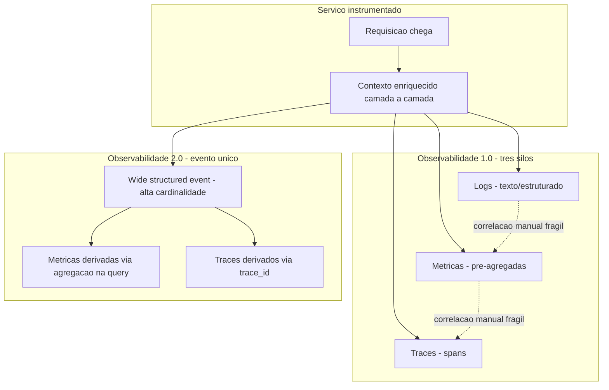

# Os três pilares: logs, métricas e traces — e por que não bastam mais

> **Bloco:** Observabilidade · **Nível:** Intermediário/Avançado · **Tempo de leitura:** ~22 min

## TL;DR

A narrativa dos "três pilares da observabilidade" (logs, métricas e traces) virou senso comum de mercado, mas é uma simplificação enganosa. Os três são **fontes de dados independentes**, armazenadas em silos separados, com custos e modelos de consulta distintos — não um sistema coeso de observabilidade. Charity Majors (Honeycomb) argumenta que a observabilidade de verdade nasce de **eventos estruturados de alta cardinalidade** (high-cardinality structured events), dos quais métricas e traces podem ser **derivados**, e não o contrário. O "quarto pilar" não é um pilar adicional empilhado sobre os outros três: é uma mudança de fundação. Um evento canônico amplo (canonical wide event) por unidade de trabalho, com dezenas a centenas de campos arbitrários, permite responder perguntas que você não previu na hora de instrumentar — que é a definição funcional de observabilidade. Este documento dissocia **monitoramento** (perguntas conhecidas, dashboards pré-definidos) de **observabilidade** (perguntas desconhecidas, exploração ad hoc) e mostra por que a arquitetura de pré-agregação dos três pilares limita a segunda.

## O problema que resolve

A expressão "observabilidade" vem da teoria de controle: um sistema é observável se você consegue inferir seu estado interno a partir de suas saídas externas. Aplicada a software distribuído, a pergunta é: **quando algo dá errado em produção, você consegue entender o que aconteceu sem fazer um novo deploy para adicionar instrumentação?**

Durante a era do monolito, monitoramento bastava. Você tinha um punhado de servidores, um conjunto fechado de modos de falha conhecidos, e dashboards que cobriam quase tudo. Quando o pager tocava, o engenheiro de plantão geralmente já sabia em qual dos cinco gráficos olhar. As falhas eram **previsíveis**: o disco encheu, a CPU saturou, a fila cresceu.

A migração para **microsserviços, cloud e infraestrutura efêmera** quebrou esse modelo. Uma única requisição de usuário pode atravessar 20, 50, 100 serviços. O espaço de estados explodiu. A maioria dos incidentes em sistemas distribuídos modernos são **"unknown-unknowns"**: combinações de condições que ninguém previu e, portanto, para as quais ninguém criou um dashboard. Charity Majors resume isso afirmando que a tarefa mudou de "detectar os poucos modos de falha conhecidos" para "explorar um espaço infinito de modos de falha desconhecidos".

A indústria respondeu codificando a tríade **logs, métricas e traces** como "os três pilares". A formulação é útil como taxonomia de telemetria, mas Majors é direta na crítica: *"observability is not a synonym for monitoring, and there are no three pillars. The pillars are bullshit."* O ponto não é que logs, métricas e traces sejam inúteis — são essenciais. O problema é tratá-los como **três sistemas paralelos e desconectados**, cada um com seu armazenamento, sua linguagem de consulta e seu modelo de custo, sem uma fonte única de verdade que os correlacione. Ela rotula essa geração de ferramentas de **"observabilidade 1.0"** e propõe a **"observabilidade 2.0"**, construída sobre eventos estruturados arbitrariamente amplos como bloco fundamental único.

## O que é (definição aprofundada)

### Monitoramento vs. observabilidade

- **Monitoramento** é o ato de coletar, agregar e alertar sobre conjuntos **conhecidos** de métricas. Você define de antemão o que medir e quais limiares disparam alertas. Responde "está tudo dentro do esperado?". É reativo a perguntas previstas.
- **Observabilidade** é a capacidade de fazer perguntas **arbitrárias e novas** sobre o comportamento do sistema, sem precisar antecipá-las no momento da instrumentação. Responde "por que isto está acontecendo, especificamente para este subconjunto de requisições?". É exploratório.

Monitoramento é um subconjunto de capacidades que um sistema observável também entrega. A diferença prática está na **cardinalidade** e na **dimensionalidade** dos dados retidos.

### Os três sinais (signals)

A terminologia atual do OpenTelemetry usa **signals** em vez de "pilares". Há três sinais primários:

- **Logs** — registros textuais ou estruturados de eventos discretos. Um log line é emitido em um ponto do código com uma mensagem e, idealmente, campos estruturados (chave-valor). Logs não estruturados (texto livre) são caros de consultar e quase impossíveis de agregar.
- **Métricas (metrics)** — medições numéricas **pré-agregadas** ao longo de janelas de tempo: counters, gauges, histograms. São baratas de armazenar e rápidas de consultar porque já perderam a granularidade individual. Uma métrica como `http_requests_total{status="500"}` é um número agregado; você não consegue, a partir dela, descobrir **quais** requisições falharam.
- **Traces** — representação da jornada de uma requisição por múltiplos serviços, composta de **spans** (unidades de trabalho) com relação pai/filho. Detalhado no documento sobre distributed tracing.

### A armadilha da cardinalidade

**Cardinalidade** é o número de valores únicos que um campo pode assumir. `país` tem cardinalidade baixa (~200). `user_id`, `request_id`, `build_id`, `device_fingerprint` têm cardinalidade altíssima (milhões+).

Sistemas de métricas baseados em séries temporais (como Prometheus) explodem em custo com cardinalidade alta: cada combinação única de labels gera uma nova série temporal. Adicionar `user_id` como label a uma métrica é a forma clássica de derrubar um Prometheus — a **cardinality explosion**. Por isso, métricas tradicionais são forçadas a permanecer de baixa cardinalidade. Mas é exatamente a **alta cardinalidade** que permite o debugging fino: *"me mostre todos os usuários canadenses no iOS 11.0.4 com o pacote de idioma francês que tiveram timeout no serviço de pagamento entre 14h03 e 14h07"* — cada uma dessas restrições é uma dimensão de alta cardinalidade.

### O quarto pilar: eventos estruturados de alta cardinalidade

A proposta de Majors é que o bloco fundamental seja o **wide structured event** (evento estruturado amplo): um único registro por unidade de trabalho (tipicamente uma requisição por serviço), contendo **dezenas a centenas de campos arbitrários** de alta cardinalidade — IDs, atributos de negócio, versão de build, feature flags ativas, latências de cada dependência, tamanho de payload, etc. Esse evento é a **fonte única de verdade**. A partir dele:

- **Métricas** são derivadas por agregação (conte, some, faça percentis).
- **Traces** são derivados conectando eventos pelo `trace_id` e `parent_span_id`.
- **Logs** são, essencialmente, esses próprios eventos.

A inversão é o ponto central: em vez de emitir três tipos de telemetria desconectados, você emite **um evento rico** e deriva os outros sinais sob demanda. Isso é o que Majors chama de capturar "context persisted through execution paths without indexes or schemas, high-cardinality and high-dimensionality". O "quarto pilar" não soma — ele **substitui a fundação**.

## Como funciona

No modelo dos três pilares (observabilidade 1.0), o fluxo é fragmentado:

1. O código emite **logs** para um sistema (ex.: ELK, Loki).
2. Emite **métricas** para outro (ex.: Prometheus), já agregadas no cliente ou no scrape.
3. Emite **traces** para um terceiro (ex.: Jaeger, Tempo).

Quando um alerta dispara numa métrica, o engenheiro pula manualmente entre as três ferramentas tentando correlacionar — sem um identificador comum confiável, isso é trabalho detetivesco. Cada salto perde contexto. E, crucialmente, **nenhuma das três retém a granularidade necessária para perguntas novas**: a métrica já agregou, o log pode não ter os campos certos, e o trace pode ter sido descartado por sampling.

No modelo de evento estruturado amplo (observabilidade 2.0):

1. Cada serviço acumula, ao longo do processamento de uma requisição, um **contexto** (um mapa chave-valor) que vai sendo enriquecido em cada camada — middleware HTTP, camada de negócio, chamada a dependências.
2. Ao final da unidade de trabalho, **um único evento amplo** é emitido com todo esse contexto.
3. O backend (Honeycomb, e cada vez mais soluções baseadas em colunas/wide events) armazena o evento **sem pré-agregação**, mantendo todas as dimensões.
4. Consultas agregam, filtram (`BREAK DOWN BY`, `WHERE`) e calculam percentis **em tempo de query**, sobre os dados brutos, permitindo perguntas não antecipadas.

A diferença arquitetural decisiva é **quando a agregação acontece**: no modelo de métricas, na escrita (irreversível); no modelo de eventos, na leitura (preserva opcionalidade).

## Diagrama de fluxo



## Exemplo prático / caso real

Considere um marketplace brasileiro processando um **checkout**. O fluxo passa por `api-gateway`, `carrinho`, `estoque`, `pagamento` (que chama um PSP externo) e `pedido`.

**Cenário com três pilares.** Às 14h, o time recebe um alerta: a métrica `checkout_p99_latency` subiu de 800 ms para 4 s. O dashboard do Grafana sobre Prometheus mostra o pico, mas a métrica é agregada — não diz **quais** checkouts foram lentos. O engenheiro vai ao Loki, busca logs por timestamp, encontra milhares de linhas e tenta filtrar. Sem um `trace_id` consistente, ele não consegue ligar um log do `carrinho` ao log correspondente do `pagamento`. Vai ao Jaeger, mas o **sampling** descartou 99% dos traces e os lentos não foram capturados. Três ferramentas, três contextos perdidos, e a pergunta "o que esses checkouts lentos têm em comum?" continua sem resposta.

**Cenário com eventos estruturados amplos.** Cada serviço emite um evento por requisição com campos como: `trace_id`, `user_id`, `payment_method`, `psp_name`, `cart_value_brl`, `coupon_applied`, `feature_flag_new_checkout`, `db_query_ms`, `psp_latency_ms`, `region`, `app_version`. No Honeycomb (ou backend equivalente), o engenheiro digita: *"BREAK DOWN BY `psp_name` WHERE `checkout_latency_ms > 3000`"*. Em segundos descobre que **todos** os checkouts lentos usavam `psp_name = "psp-novo"` e tinham `feature_flag_new_checkout = true`. A causa raiz — uma integração nova ativada por feature flag para 5% dos usuários — aparece sem que ninguém tivesse criado um dashboard para "latência do PSP novo por feature flag". Essa é a pergunta que **não foi antecipada**.

Ferramentas reais nesse espaço: **Honeycomb** (pioneiro em wide events), **OpenTelemetry** (padrão de instrumentação que coleta os três sinais e suporta atributos arbitrários em spans), **Prometheus + Grafana** (métricas clássicas), **Grafana Loki** (logs), **Grafana Tempo** e **Jaeger** (traces), **Datadog** (suíte unificada que tem evoluído para correlacionar os sinais). Pseudocódigo do enriquecimento:

```text
ao iniciar requisicao:
    evento = novo_contexto(trace_id, user_id, region, app_version)
em cada camada:
    evento.adicionar("db_query_ms", medir(...))
    evento.adicionar("psp_name", psp.nome)
    evento.adicionar("psp_latency_ms", medir(chamada_psp))
ao finalizar:
    emitir(evento)   # um unico evento amplo
```

## Quando usar / Quando evitar

**Use eventos estruturados de alta cardinalidade quando:**

- O sistema é distribuído, com muitas dependências e modos de falha imprevisíveis.
- Você precisa de debugging exploratório e responder perguntas não antecipadas.
- Atributos de negócio (cliente, plano, região, feature flag) são relevantes para diagnóstico.

**Prefira métricas pré-agregadas quando:**

- Você precisa de alertas baratos e rápidos sobre sinais conhecidos e estáveis (os Four Golden Signals: latência, tráfego, erros, saturação).
- Retenção de longo prazo (meses/anos) a baixo custo é prioridade — métricas comprimem muito bem; eventos brutos não.
- A pergunta é sempre a mesma ("qual a taxa de erro?"), sem necessidade de drill-down de alta cardinalidade.

**Trade-offs explícitos:**

- **Custo de cardinalidade**: métricas explodem com labels de alta cardinalidade; eventos brutos custam armazenamento e ingestão, mas preservam dimensionalidade. A escolha é entre custo de escrita/armazenamento e opcionalidade de consulta.
- **Sampling**: para conter custo de eventos/traces, aplica-se sampling. **Head sampling** decide cedo (barato, mas pode descartar o trace problemático); **tail sampling** decide depois de ver o trace inteiro (caro, mas retém os erros e os lentos). Detalhado no documento de tracing.
- **Maturidade do time**: extrair valor de exploração ad hoc exige cultura de debugging em produção; times acostumados só a dashboards podem subutilizar o modelo de eventos.

## Anti-padrões e armadilhas comuns

- **Logs sem correlation/trace ID.** Logs órfãos, impossíveis de ligar a uma requisição que atravessou vários serviços. O log mais detalhado é inútil se você não consegue reconstruir o contexto distribuído. Sempre propague e registre um identificador comum.
- **Tratar "três pilares" como arquitetura, não taxonomia.** Comprar três produtos desconectados e achar que isso é "observabilidade". Sem correlação por ID e sem granularidade preservada, você tem três silos caros.
- **Métricas de alta cardinalidade.** Colocar `user_id` ou `request_id` como label de métrica e derrubar o Prometheus por cardinality explosion. Alta cardinalidade pertence a eventos/traces, não a métricas.
- **Pré-agregar tudo na escrita.** Descartar a granularidade individual cedo demais elimina a possibilidade de perguntas novas. Você só pode perguntar o que decidiu medir antecipadamente — isso é monitoramento, não observabilidade.
- **Log spam / cardinalidade textual.** Emitir milhões de log lines não estruturadas. Volume não é observabilidade; estrutura e correlação são.
- **Confundir dashboards bonitos com observabilidade.** Dashboards respondem perguntas conhecidas. Se toda investigação real exige SSH na máquina ou novo deploy de instrumentação, você não tem observabilidade.

## Relação com outros conceitos

- **Observabilidade ↔ atributos de qualidade.** Observabilidade não é um requisito funcional; é um atributo de qualidade transversal (como segurança e disponibilidade) que habilita operabilidade e reduz MTTR. Um sistema inobservável é, na prática, não-mantível em escala.
- **Eventos ↔ distributed tracing.** Traces são uma **vista derivada** de eventos correlacionados por `trace_id`. Entender eventos amplos esclarece por que tracing é uma projeção, não uma fonte separada.
- **Métricas ↔ Four Golden Signals e percentis p99.** As métricas continuam essenciais para alertar sobre latência/tráfego/erros/saturação; percentis (p99) sobre métricas detectam **que** há um problema, enquanto eventos de alta cardinalidade explicam **por quê**.
- **Eventos ↔ SLI/SLO.** SLIs são frequentemente calculados a partir de eventos (proporção de eventos "bons" sobre o total), conectando este documento ao de SLI/SLO/SLA e error budgets.
- **Correlation ID ↔ tudo.** O identificador comum é o que costura logs, métricas exemplares e traces numa narrativa única; sem ele, nem o modelo de três pilares nem o de eventos funcionam de verdade.

## Referências

- [Structured Events Are the Basis of Observability — Honeycomb (Charity Majors)](https://www.honeycomb.io/blog/structured-events-basis-observability)
- [It's Time to Version Observability: Introducing Observability 2.0 — Honeycomb](https://www.honeycomb.io/blog/time-to-version-observability-signs-point-to-yes)
- [Observability 2.0 vs. Observability 1.0 — Honeycomb](https://www.honeycomb.io/blog/one-key-difference-observability1dot0-2dot0)
- [Signals — OpenTelemetry](https://opentelemetry.io/docs/concepts/signals/)
- [What is OpenTelemetry? — OpenTelemetry](https://opentelemetry.io/docs/what-is-opentelemetry/)
- [Monitoring Distributed Systems (Four Golden Signals) — Google SRE Book](https://sre.google/sre-book/monitoring-distributed-systems/)
- [Domain-Oriented Observability — Martin Fowler](https://martinfowler.com/articles/domain-oriented-observability.html)
- [Bottleneck #05: Resilience and Observability — Martin Fowler](https://martinfowler.com/articles/bottlenecks-of-scaleups/05-resilience-and-observability.html)
