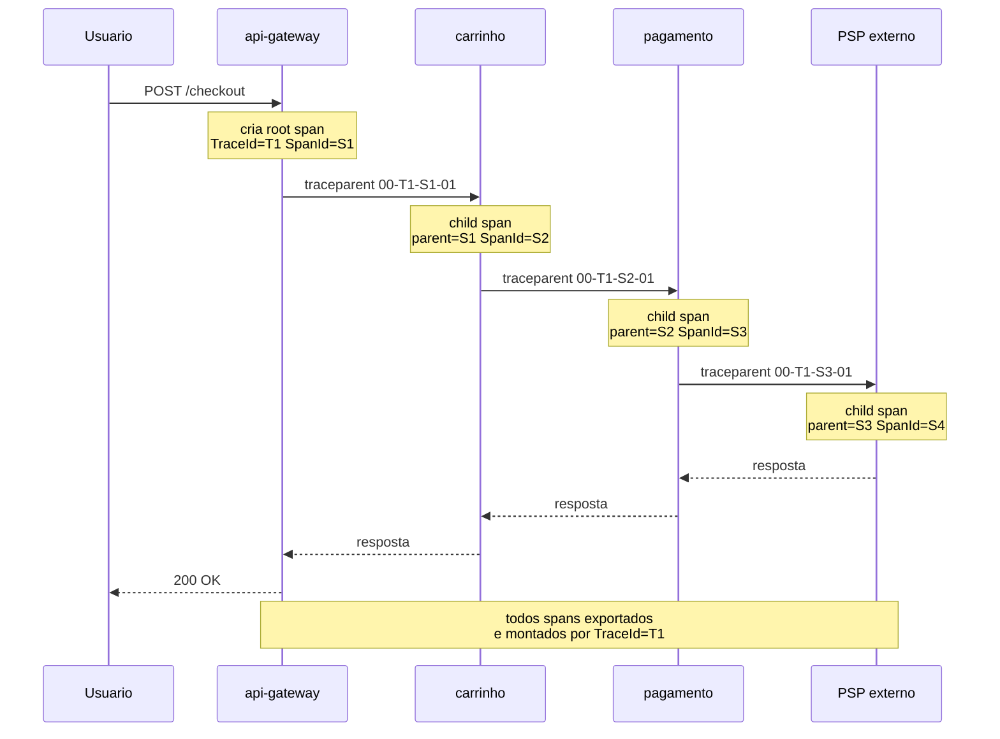
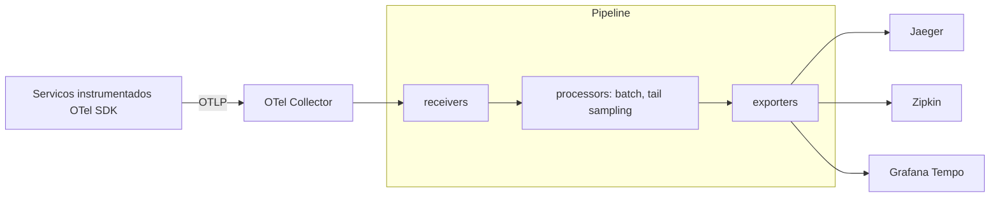

# Distributed Tracing (OpenTelemetry, Jaeger, Zipkin)

> **Bloco:** Observabilidade · **Nível:** Intermediário/Avançado · **Tempo de leitura:** ~24 min

## TL;DR

**Distributed tracing** reconstrói a jornada completa de uma requisição enquanto ela atravessa múltiplos serviços, modelando-a como um **trace** — um grafo acíclico dirigido (DAG) de **spans**. Cada span é uma unidade de trabalho com nome de operação, timestamp de início, duração, atributos e referências de causalidade (pai/filho). O conceito nasceu do **Dapper**, da Google (Sigelman et al., 2010), que estabeleceu os princípios de baixo overhead, transparência para a aplicação e **sampling**. **OpenTelemetry (OTel)** é hoje o padrão de fato da indústria (projeto CNCF) para instrumentação e coleta, vendor-neutral; **Jaeger** (origem Uber) e **Zipkin** (origem Twitter) são backends open-source de armazenamento e visualização. O coração técnico do tracing é a **context propagation**: passar `trace_id` e `span_id` adiante em cada chamada, hoje padronizado pelo **W3C Trace Context** (headers `traceparent` e `tracestate`). A decisão arquitetural mais cara é o **sampling**: head-based (decisão na origem, barato, pode perder o trace ruim) versus tail-based (decisão após ver o trace inteiro, caro, retém erros e outliers de latência).

## O problema que resolve

Em um monolito, um stack trace local responde "onde travou?". Em uma arquitetura de microsserviços, uma requisição de checkout pode tocar 30 serviços, cada um com seu próprio log, seu próprio processo, sua própria máquina efêmera. Quando a latência p99 dispara, a pergunta crítica é: **em qual dos 30 serviços está o gargalo, e por quê?** Métricas dizem que há um problema; logs dizem o que aconteceu localmente; mas só o tracing reconstrói a **causalidade ponta a ponta** e atribui latência a cada hop.

A origem canônica é o **Dapper**, descrito no paper "Dapper, a Large-Scale Distributed Systems Tracing Infrastructure" (Benjamin H. Sigelman, Luiz André Barroso, Mike Burrows et al., Google, 2010). Dapper rodava em produção na Google e estabeleceu três objetivos de projeto que ainda guiam o campo:

- **Baixo overhead (low overhead)**: tracing não pode degradar a performance dos serviços em produção; daí a centralidade do **sampling**.
- **Transparência para a aplicação (application-level transparency)**: desenvolvedores não deveriam precisar instrumentar manualmente cada serviço; a instrumentação vive em bibliotecas comuns (RPC, HTTP), de forma quase invisível.
- **Implantação ubíqua em escala**: o sistema precisa funcionar uniformemente em toda a frota.

Dapper inspirou diretamente **Zipkin** (Twitter, 2012) e **Jaeger** (Uber, 2015), e a padronização posterior via **OpenTracing** e **OpenCensus**, que convergiram no **OpenTelemetry**. Hoje, tracing distribuído é considerado pré-requisito de microsserviços (Martin Fowler lista monitoramento/observabilidade entre os "Microservice Prerequisites").

## O que é (definição aprofundada)

### Span

Um **span** é a unidade fundamental: representa uma operação lógica única com:

- **operation name** (ex.: `HTTP GET /checkout`, `db.query`, `psp.charge`);
- **start timestamp** e **duration**;
- **SpanContext**: contém o **TraceId** (16 bytes aleatórios, único globalmente, agrupa todos os spans de um trace) e o **SpanId** (8 bytes aleatórios, identifica o span);
- **parent span id**: quando um span tem pai, o SpanId do pai vira o parent id do filho — é isso que constrói a árvore;
- **attributes**: pares chave-valor arbitrários (alta cardinalidade permitida: `user_id`, `http.status_code`, `db.statement`);
- **span events**: marcos timestampados dentro do span (ex.: "cache miss");
- **span status**: Ok, Error, Unset;
- **links**: referências a outros spans não-pai (úteis para fan-in, batches).

### Trace

Um **trace** é o caminho de uma requisição pela aplicação. No OpenTelemetry, traces são definidos **implicitamente pelos seus spans**: um trace é um **DAG de spans**, onde as arestas são as relações pai/filho. Todos os spans com o mesmo `TraceId` pertencem ao mesmo trace. O span sem pai é o **root span**.

### Context propagation

**Context propagation** é o mecanismo que torna o tracing distribuído possível. Quando o serviço A chama o serviço B, A precisa transmitir a B o `TraceId` corrente e o `SpanId` que será o pai do span de B. Sem essa propagação, B abriria um trace novo e desconexo. A propagação acontece **in-process** (entre threads/funções do mesmo processo, via context object) e **cross-process** (entre serviços, via injeção em headers HTTP, metadados gRPC, atributos de mensagem em filas).

A documentação do OpenTelemetry coloca isso de forma precisa: *"Context Propagation is the core concept that enables Distributed Tracing. With Context Propagation, Spans can be correlated with each other and assembled into a trace, regardless of where Spans are generated."*

### W3C Trace Context

Historicamente cada vendor usava seu próprio formato de header (B3 do Zipkin, X-Ray da AWS, etc.), o que quebrava o tracing em fronteiras entre sistemas. O **W3C Trace Context** padronizou dois headers HTTP que toda ferramenta compatível lê e escreve:

- **`traceparent`**: carrega quatro campos em formato fixo — `version`, `trace-id`, `parent-id`, `trace-flags`. Exemplo:

  `traceparent: 00-0af7651916cd43dd8448eb211c80319c-b7ad6b7169203331-01`

  Aqui `00` é a versão, o hex de 32 dígitos é o trace-id, o de 16 é o parent-id (o span pai), e `01` indica que o trace está marcado para sampling.

- **`tracestate`**: um "sidecar" para dados específicos de vendor, que viajam junto sem interferir no `traceparent`.

Regras importantes da spec: o nome do header deve ser aceito em qualquer caixa (maiúscula/minúscula), preferencialmente enviado em minúsculas; um serviço que recebe `traceparent` **DEVE** repassá-lo às requisições de saída (podendo mutar o `parent-id` para o seu próprio span); e se o `traceparent` falhar no parse, **NÃO** se deve tentar parsear o `tracestate`.

### OpenTelemetry, Jaeger, Zipkin

- **OpenTelemetry (OTel)**: projeto CNCF que define a **API** (interfaces de instrumentação), o **SDK** (implementação por linguagem), as **convenções semânticas** (nomes padronizados de atributos como `http.method`, `db.system`), o protocolo **OTLP** (OpenTelemetry Protocol) e o **Collector**. OTel é **agnóstico de backend**: você instrumenta uma vez e exporta para Jaeger, Tempo, Datadog, etc. Não armazena nem visualiza dados — é a camada de geração e coleta.
- **Jaeger**: backend de tracing open-source (CNCF, origem Uber). Recebe spans, armazena (Cassandra, Elasticsearch, ou direto via collector), indexa e oferece UI de busca e visualização de dependências. Suporta **adaptive/remote sampling** (collectors servem configuração de sampling para os SDKs).
- **Zipkin**: o backend de tracing open-source mais antigo (origem Twitter), baseado conceitualmente no Dapper. Coletor recebe spans (HTTP/JSON, Kafka, Scribe), armazena (in-memory, MySQL, Cassandra, Elasticsearch), e serve API + UI.

## Como funciona

O ciclo de vida de um trace:

1. **Origem do trace.** Uma requisição chega ao serviço de entrada (ex.: `api-gateway`). O SDK do OTel cria o **root span**, gera um `TraceId` novo de 16 bytes e um `SpanId` de 8 bytes.
2. **Decisão de sampling (head).** No modo head sampling, decide-se cedo se este trace será amostrado (ex.: probabilístico consistente baseado no `TraceId`). A flag de sampling é gravada no `traceparent`.
3. **Propagação na saída.** Ao chamar o próximo serviço, o **propagator** injeta o header `traceparent` (e `tracestate`) na requisição HTTP / metadados gRPC / cabeçalho da mensagem.
4. **Continuação no próximo serviço.** O serviço seguinte **extrai** o contexto do header, cria um **child span** cujo `parent-id` é o `SpanId` recebido, e mantém o mesmo `TraceId`.
5. **Repetição.** Isso se repete em cada hop, construindo a árvore de spans.
6. **Exportação.** Cada serviço **exporta** seus spans (via OTLP) para um **OpenTelemetry Collector** ou diretamente para um backend.
7. **Coleta e montagem.** O backend (Jaeger/Zipkin/Tempo) recebe os spans assincronamente, agrupa por `TraceId`, monta o DAG e os disponibiliza para busca e visualização como um **waterfall** (cascata) de latências.

### O OpenTelemetry Collector

O **Collector** é um proxy de telemetria vendor-neutral que desacopla a aplicação dos backends. Seu modelo é de **pipeline** com três tipos de componente:

- **receivers**: recebem dados (OTLP, Jaeger, Zipkin, Prometheus...).
- **processors**: transformam/filtram (batching, sampling, redaction de PII, tail sampling).
- **exporters**: enviam adiante (para Jaeger, Tempo, Datadog, etc.).

Os dados fluem do receiver, passam por todos os processors em sequência, e cada exporter recebe uma cópia de cada elemento. Pipelines operam sobre traces, metrics e logs. Colocar o **tail sampling** no Collector é o padrão recomendado quando se quer reter inteligentemente apenas os traces interessantes.

### Sampling: head vs tail

- **Head-based sampling**: a decisão de amostrar é tomada **no início**, sem inspecionar o trace inteiro. A forma mais comum é o **Consistent Probability Sampling** (decisão baseada no `TraceId`, garantindo que todos os serviços tomem a mesma decisão). Barato e simples, mas você decide antes de saber se o trace teve erro ou foi lento — pode descartar exatamente o trace que importava.
- **Tail-based sampling**: a decisão é tomada **depois** de ver todos (ou a maioria) dos spans do trace. Permite políticas como "sempre retenha traces com erro" ou "retenha o p99 de latência". Muito mais caro (precisa bufferizar spans até o trace completar) e exige um componente centralizado (Collector). Frequentemente combina-se ambos: head sampling para cortar volume bruto, depois tail sampling para selecionar inteligentemente.

## Diagrama de fluxo





## Exemplo prático / caso real

Uma fintech brasileira processa transferências PIX por cinco serviços: `api-gateway`, `autenticacao`, `antifraude`, `core-bancario` e `notificacao`. Clientes reclamam que algumas transferências demoram 8 segundos, mas a métrica de latência média parece normal (1,2 s) porque o problema é p99.

O time instrumenta tudo com **OpenTelemetry SDK** e exporta via **OTLP** para um **OpenTelemetry Collector**, que aplica **tail sampling** com a política "retenha 100% dos traces com `duration > 3s` ou `status = error`, e 1% do restante". Os traces vão para **Grafana Tempo**, correlacionados com métricas do **Prometheus** e logs do **Loki** dentro do Grafana.

Ao abrir um trace lento no waterfall, o engenheiro vê que `api-gateway`, `autenticacao` e `core-bancario` levam ~200 ms cada, mas o span de `antifraude` consome **7,2 s**. Expandindo, um span event mostra "external model scoring timeout, retry x3". O atributo `model_version = "v3-canary"` revela que o trace lento sempre tem essa versão — um modelo canário de antifraude com latência ruim, ativado para uma fração do tráfego. O p99 estava sendo dominado por esse subconjunto, invisível na média.

Sem tracing, o time teria três métricas normais-ish e logs desconexos. Com tracing + tail sampling, o **gargalo foi atribuído a um span específico em um serviço específico**, com o atributo de alta cardinalidade que explicava a causa. Pseudocódigo da propagação manual (geralmente automática via auto-instrumentação):

```text
# servico chamador
ctx = span_atual.contexto()
headers = {}
propagator.inject(ctx, headers)   # escreve traceparent/tracestate
http.post(url, headers=headers)

# servico chamado
ctx = propagator.extract(request.headers)  # le traceparent
span = tracer.start_span("antifraude.score", parent=ctx)
```

## Quando usar / Quando evitar

**Use distributed tracing quando:**

- A arquitetura é distribuída (microsserviços, serverless) e a causalidade ponta a ponta importa.
- Você precisa atribuir latência a hops específicos e diagnosticar gargalos entre serviços.
- Quer entender dependências reais entre serviços (service graph/map).

**Evite ou minimize quando:**

- O sistema é um monolito simples sem fan-out de chamadas — o ganho não paga o overhead.
- Cargas extremamente sensíveis a latência onde até o overhead mínimo de instrumentação é inaceitável (raro; OTel é projetado para overhead baixo).

**Trade-offs explícitos:**

- **Head vs tail sampling**: head é barato mas cego ao resultado; tail captura erros e outliers mas exige buffering centralizado e mais recursos no Collector.
- **Custo de armazenamento e cardinalidade**: 100% de retenção em alto volume é proibitivo; o sampling é inevitável em escala.
- **Overhead de instrumentação**: auto-instrumentação reduz esforço mas pode gerar spans demais (ruído); instrumentação manual dá controle mas custa tempo de engenharia.
- **Lock-in**: usar headers/SDK proprietários cria lock-in; OTel + W3C Trace Context preserva portabilidade entre Jaeger, Zipkin, Tempo e vendors.

## Anti-padrões e armadilhas comuns

- **Quebrar a propagação de contexto.** Esquecer de injetar/extrair o `traceparent` em uma fronteira (uma fila, um cliente HTTP custom, uma thread pool) parte o trace em dois — o sintoma é traces "curtos" que terminam abruptamente.
- **Head sampling agressivo demais.** Amostrar 0,1% no head e depois reclamar que "nunca encontro o trace do incidente". Os traces problemáticos são raros — head sampling cego tende a descartá-los. Use tail sampling para reter erros/lentidão.
- **Spans gigantes ou genéricos.** Um único span cobrindo um serviço inteiro esconde os gargalos internos. Spans devem mapear operações significativas (query, chamada externa, processamento).
- **Atributos inconsistentes / não usar convenções semânticas.** Cada time nomeando atributos do seu jeito (`status` vs `http.status_code`) inviabiliza consultas cross-service. Adote as **semantic conventions** do OTel.
- **Misturar trace_id e correlation_id sem alinhar.** Ter um correlation id de negócio nos logs que não bate com o `trace_id` do tracing — duas verdades que não se cruzam. Idealmente o `trace_id` é injetado nos logs (log-trace correlation).
- **Tail sampling sem capacidade no Collector.** Tail sampling bufferiza spans; subdimensionar o Collector causa perda de spans e traces incompletos.
- **PII em atributos de span.** Gravar CPF, número de cartão ou token em atributos. Use processors de redaction no Collector.

## Relação com outros conceitos

- **Tracing ↔ correlation IDs / propagação de contexto.** O `trace_id` é o correlation id canônico do tracing; o documento dedicado a correlation IDs aprofunda a propagação em filas, jobs assíncronos e fronteiras não-HTTP.
- **Tracing ↔ eventos de alta cardinalidade.** Um trace é uma vista derivada de eventos correlacionados; os atributos de span são exatamente os campos de alta cardinalidade discutidos no documento sobre os pilares.
- **Tracing ↔ métricas e Four Golden Signals.** Métricas (latência p99) detectam que há problema; o tracing localiza **onde**. Span metrics derivadas de traces alimentam os Golden Signals por serviço.
- **Tracing ↔ SLI/SLO.** Latência por span e taxa de erro por serviço alimentam SLIs; traces explicam violações de SLO.
- **Tracing ↔ microsserviços e service mesh.** Service meshes (Istio, Linkerd) podem injetar tracing automaticamente nos sidecars, reduzindo a necessidade de instrumentação manual em cada serviço.

## Referências

- [Dapper, a Large-Scale Distributed Systems Tracing Infrastructure — Google Research (Sigelman et al.)](https://research.google/pubs/dapper-a-large-scale-distributed-systems-tracing-infrastructure/)
- [Traces — OpenTelemetry](https://opentelemetry.io/docs/concepts/signals/traces/)
- [Context propagation — OpenTelemetry](https://opentelemetry.io/docs/concepts/context-propagation/)
- [Sampling — OpenTelemetry](https://opentelemetry.io/docs/concepts/sampling/)
- [Collector Architecture — OpenTelemetry](https://opentelemetry.io/docs/collector/architecture/)
- [Tail Sampling: Why it's useful, how to do it — OpenTelemetry Blog](https://opentelemetry.io/blog/2022/tail-sampling/)
- [Architecture — Jaeger](https://www.jaegertracing.io/docs/1.76/architecture/)
- [Architecture — OpenZipkin](https://zipkin.io/pages/architecture.html)
- [Trace Context — W3C Recommendation](https://www.w3.org/TR/trace-context/)
- [Tempo architecture — Grafana Tempo](https://grafana.com/docs/tempo/latest/introduction/architecture/)
