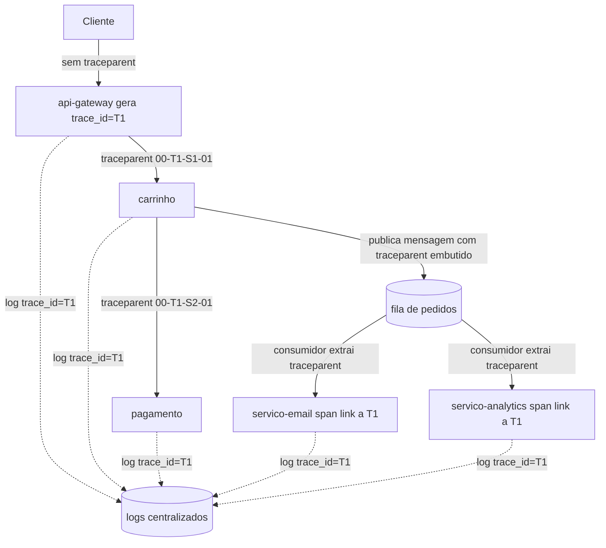
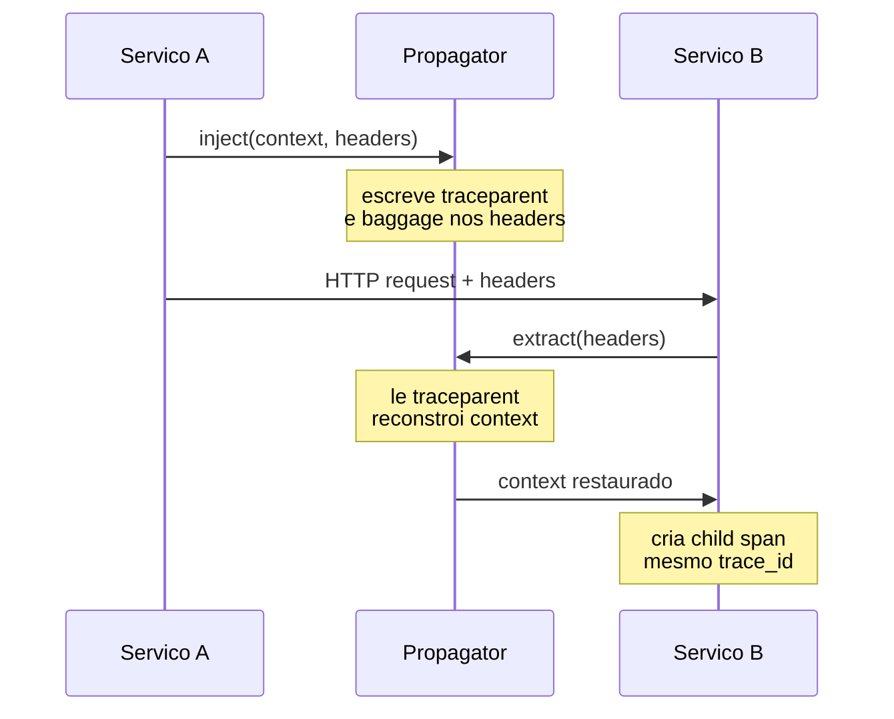

# Correlation IDs e propagação de contexto

> **Bloco:** Observabilidade · **Nível:** Intermediário/Avançado · **Tempo de leitura:** ~21 min

## TL;DR

Um **correlation ID** é um identificador único atribuído a uma unidade lógica de trabalho (tipicamente uma requisição de usuário) e **propagado** por todos os serviços, logs, mensagens e jobs que aquela unidade dispara. É o fio condutor que costura telemetria fragmentada numa narrativa única: sem ele, logs de serviços diferentes são órfãos impossíveis de correlacionar. A **propagação de contexto (context propagation)** é o mecanismo que carrega esse identificador (e metadados associados) através de fronteiras de processo — HTTP, gRPC, filas de mensagens, jobs em background. Há uma distinção importante entre o **`trace_id`** do distributed tracing (gerado e propagado automaticamente pelo OpenTelemetry, padronizado pelo **W3C Trace Context** via header `traceparent`) e o **correlation/request ID** de nível de negócio, que pode ter semântica adicional. O padrão de fundo do OTel é o **Context + Propagators** e o conceito de **baggage** (metadados arbitrários que viajam com a requisição). Os erros mais comuns: gerar o ID tarde demais, perder a propagação em fronteiras assíncronas (filas, threads) e não injetar o ID nos logs estruturados.

## O problema que resolve

Você está investigando um erro reportado por um cliente: "minha compra falhou às 14h32". Em um sistema distribuído, essa única ação atravessou `api-gateway`, `carrinho`, `estoque`, `pagamento`, `pedido` e disparou eventos assíncronos para `email` e `analytics`. Cada serviço gerou logs. Sem um identificador comum, reconstruir o que aconteceu com **aquela** compra específica significa cruzar timestamps manualmente entre sete sistemas de log — e timestamps colidem quando há milhares de requisições por segundo.

O correlation ID resolve isso reduzindo o problema a um único filtro: `correlation_id = "abc-123"` retorna **todos** os eventos daquela requisição, em todos os serviços, em ordem causal. É o pré-requisito mais básico de observabilidade em sistemas distribuídos, e a ausência dele é o anti-padrão número um citado em qualquer discussão sobre logging distribuído.

A formalização moderna desse conceito veio com o distributed tracing (Dapper, da Google) e foi padronizada pelo **W3C Trace Context**, que tornou o `trace_id` interoperável entre vendors. Antes dessa padronização, cada organização inventava seu header (`X-Request-ID`, `X-Correlation-ID`, `X-Trace-Token`), o que funcionava internamente mas quebrava em fronteiras com sistemas de terceiros. A documentação do OpenTelemetry coloca a propagação como o conceito central que habilita tracing: *"With Context Propagation, Spans can be correlated with each other and assembled into a trace, regardless of where Spans are generated."*

## O que é (definição aprofundada)

### Correlation ID, request ID, trace ID

Há vocabulário sobreposto que vale desambiguar:

- **Trace ID**: identificador de 16 bytes do distributed tracing. Agrupa todos os **spans** de uma requisição distribuída. Gerado e propagado automaticamente pelo SDK de tracing. É o identificador canônico no W3C Trace Context.
- **Span ID**: identificador de 8 bytes de uma operação específica (um span) dentro do trace. Muda a cada hop.
- **Correlation ID / Request ID**: termo mais genérico e mais antigo. Frequentemente é **o mesmo** que o trace ID, mas em sistemas que não adotaram tracing completo, pode ser um ID separado gerado no edge e propagado em um header custom. Em alguns contextos carrega semântica de negócio (ex.: ID que correlaciona uma jornada de checkout que cruza sessões).
- **Causation ID / Session ID / User ID**: identificadores adicionais que podem viajar junto para enriquecer a correlação (ID da operação que causou esta, ID da sessão, ID do usuário).

Na prática moderna, o objetivo é **unificar**: usar o `trace_id` do W3C Trace Context como correlation ID universal e injetá-lo em **todos os logs**, de modo que tracing e logging compartilhem o mesmo eixo de correlação (log-trace correlation).

### Context

**Context** é um objeto que armazena valores **cross-cutting** que precisam atravessar limites de API e fronteiras lógicas dentro de um processo. No OpenTelemetry, o `Context` carrega o `SpanContext` atual (com trace_id e span_id) e o **baggage**. Cada operação cria um novo `Context` imutável; ele é passado explicitamente (em algumas linguagens) ou implicitamente via mecanismos da linguagem (ThreadLocal no Java, `context.Context` no Go, `contextvars` no Python, AsyncLocalStorage no Node).

### Propagators

**Propagators** são os objetos que **serializam** o context em um formato transportável (ex.: headers HTTP) na saída (`inject`) e o **desserializam** na entrada (`extract`). O propagator padrão do OTel implementa o W3C Trace Context (`traceparent`/`tracestate`) e, opcionalmente, o W3C Baggage.

### W3C Trace Context — recapitulação aplicada

O header **`traceparent`** carrega `version-traceid-parentid-traceflags`:

`traceparent: 00-0af7651916cd43dd8448eb211c80319c-b7ad6b7169203331-01`

Esse `trace-id` (`0af7...319c`) é o correlation ID que deve aparecer em cada log de cada serviço. A spec exige que um serviço que recebe `traceparent` o **repasse** nas chamadas de saída (mutando o `parent-id` para o seu próprio span). O **`tracestate`** carrega dados de vendor.

### Baggage

**Baggage** é um mecanismo do OTel para propagar **pares chave-valor arbitrários** ao longo de toda a requisição distribuída, disponíveis em todos os serviços downstream. Diferente dos atributos de span (que ficam num span só), o baggage **viaja com o contexto**. Exemplo: propagar `tenant_id=acme` ou `experiment_group=B` no baggage para que todos os serviços possam logar/decidir com base nele. Cuidado: baggage é propagado em headers, então tem custo de tamanho e **nunca deve conter dados sensíveis** (vaza para downstream e pode ser logado).

## Como funciona

O ciclo de propagação, hop a hop:

1. **Geração na borda (edge).** A primeira coisa que o serviço de entrada faz é verificar se já existe um `traceparent` na requisição. Se existir (ex.: veio de um gateway que já iniciou o trace), **continua** o trace. Se não, **gera** um `trace_id` novo. Regra de ouro: gere o ID o **mais cedo possível**, no edge, antes de qualquer log.
2. **Armazenamento no Context.** O `trace_id`/`span_id` é colocado no `Context` corrente do processo, de onde toda a stack de execução pode lê-lo.
3. **Injeção em logs.** Um log enricher/MDC (Mapped Diagnostic Context) injeta automaticamente o `trace_id` em cada log line estruturado, sem o desenvolvedor precisar passá-lo manualmente.
4. **Injeção na saída (inject).** Ao chamar outro serviço, o propagator escreve o `traceparent` (e baggage) no transporte: header HTTP, metadado gRPC, atributo de mensagem (Kafka header, SQS message attribute, atributo AMQP).
5. **Extração na entrada (extract).** O serviço receptor extrai o context do transporte, reconstrói o `Context`, cria seu span filho e repete o ciclo.
6. **Fronteiras assíncronas.** Aqui está o ponto crítico. Quando a requisição publica uma mensagem numa fila e retorna, o consumidor que processa a mensagem **minutos depois** precisa restaurar o contexto. Isso exige propagar o `traceparent` **dentro da mensagem** (não no header HTTP, que já não existe). No consumidor, extrai-se o context da mensagem e cria-se um span ligado (via **span link**, já que não é estritamente pai/filho síncrono).

### O desafio assíncrono e in-process

A propagação **in-process** é tão traiçoeira quanto a cross-process:

- **Thread pools / executors**: ao submeter trabalho a outra thread, o `ThreadLocal`/`contextvar` não viaja sozinho — é preciso capturar o context e restaurá-lo na thread worker. Bibliotecas de instrumentação fazem isso, mas código custom de concorrência frequentemente quebra a propagação.
- **Programação assíncrona (async/await, callbacks)**: idem; o runtime precisa de suporte (AsyncLocalStorage no Node, `contextvars` no Python asyncio).
- **Batch jobs / cron**: um job que processa um lote pode querer um `trace_id` por item ou um por lote, decisão que afeta a granularidade da correlação.

## Diagrama de fluxo





## Exemplo prático / caso real

Um e-commerce brasileiro investiga por que pedidos ocasionalmente "somem": o pagamento é aprovado mas o e-mail de confirmação nunca chega. O fluxo síncrono (`api-gateway` → `carrinho` → `pagamento` → `pedido`) está bem instrumentado com **OpenTelemetry**, e todos os logs no **Grafana Loki** carregam o `trace_id`. Mas o envio de e-mail é **assíncrono**: `pedido` publica uma mensagem numa fila (SQS) e o serviço `notificacao` consome depois.

O problema: o time configurou a propagação só para HTTP. Quando `pedido` publicava na fila, o `traceparent` **não era embutido na mensagem**. O consumidor `notificacao` iniciava um trace **novo e desconexo**. Resultado: ao filtrar logs por `trace_id = "T1"`, o engenheiro via tudo até `pedido`, e então o rastro **terminava** — os logs de `notificacao` existiam, mas com outro `trace_id`, impossíveis de correlacionar.

A correção: usar o propagator do OTel para **injetar o `traceparent` nos message attributes** do SQS ao publicar, e **extrair** no consumidor, criando um span com **span link** para o trace original. Depois disso, um único `trace_id` cobria a jornada inteira, incluindo o salto assíncrono — e ficou evidente que falhas de e-mail ocorriam quando a mensagem caía na **DLQ (dead-letter queue)** por timeout do provedor de e-mail, algo que antes era invisível porque o rastro se perdia na fronteira da fila.

Ferramentas reais: **OpenTelemetry** (Context API, Propagators, Baggage), **Jaeger**/**Grafana Tempo** (visualização do trace com o salto assíncrono via span link), **Loki**/**Datadog** (log-trace correlation pelo `trace_id`). Pseudocódigo do salto na fila:

```text
# publicador
attrs = {}
propagator.inject(context_atual, carrier=attrs)   # escreve traceparent
fila.publicar(mensagem, message_attributes=attrs)

# consumidor
ctx = propagator.extract(carrier=mensagem.message_attributes)
span = tracer.start_span("notificacao.enviar_email",
                         links=[link(ctx)])  # liga ao trace original
log.info("enviando email", trace_id=span.trace_id)
```

## Quando usar / Quando evitar

**Sempre use correlation ID / propagação quando:**

- O sistema tem mais de um serviço, ou processa trabalho assíncrono (filas, jobs). Isto é praticamente não-negociável em arquiteturas distribuídas.
- Você emite logs que precisam ser correlacionados durante incidentes.

**Considerações sobre o que propagar:**

- **`trace_id` (W3C Trace Context)**: sempre. É o eixo de correlação universal.
- **Baggage**: use com parcimônia. Cada chave viaja em **todos** os hops, inflando headers e custo. Bom para `tenant_id`, `experiment_group`; ruim para dados volumosos ou sensíveis.

**Trade-offs explícitos:**

- **Overhead de propagação**: headers maiores, custo de serialização. Baggage extenso degrada performance de rede.
- **Header custom vs W3C padrão**: headers proprietários (`X-Request-ID`) funcionam internamente, mas quebram interoperabilidade com sistemas de terceiros e vendors. Prefira `traceparent`. Em transição, propague ambos.
- **Granularidade em batch**: um `trace_id` por lote agrega; um por item dá rastreabilidade fina mas multiplica traces.

## Anti-padrões e armadilhas comuns

- **Logs sem correlation/trace ID.** O pecado capital. Logs detalhados que não podem ser ligados a uma requisição são quase inúteis em debugging distribuído. Injete o `trace_id` no MDC/log context globalmente.
- **Gerar o ID tarde demais.** Criar o correlation ID no terceiro serviço, não no edge. Os primeiros hops ficam sem ID e o início da jornada some. Gere no ponto de entrada, antes de qualquer log.
- **Perder propagação em fronteiras assíncronas.** Não embutir o `traceparent` em mensagens de fila / eventos. O rastro morre na fila e o trabalho assíncrono fica órfão (caso clássico do exemplo acima).
- **Perder propagação em thread pools / async.** Submeter trabalho a outra thread sem capturar/restaurar o context. O span filho perde o pai.
- **Gerar um trace_id novo a cada serviço.** Não verificar se já existe `traceparent` na entrada e sempre criar um novo — quebra a continuidade do trace.
- **Dados sensíveis em baggage ou no ID.** Baggage vaza para todos os downstreams e pode ser logado por terceiros. Nunca coloque PII, tokens ou segredos em baggage ou no correlation ID.
- **Múltiplos IDs concorrentes desalinhados.** Ter um `X-Request-ID` nos logs e um `trace_id` no tracing que não batem — duas verdades paralelas. Unifique no `trace_id`.
- **Não validar formato na entrada.** Confiar cegamente em `traceparent` malformado vindo do exterior. A spec exige: se o parse de `traceparent` falhar, gere um novo (e não parseie `tracestate`).

## Relação com outros conceitos

- **Correlation ID ↔ distributed tracing.** O `trace_id` é o correlation ID canônico; a propagação de contexto é literalmente o mecanismo que monta o trace (ver documento de distributed tracing). Os dois conceitos são duas faces da mesma moeda.
- **Correlation ID ↔ logs e eventos.** Injetar o `trace_id` em logs estruturados é o que transforma logs órfãos em telemetria correlacionável; conecta diretamente ao documento dos pilares/eventos de alta cardinalidade.
- **Propagação ↔ mensageria e padrões assíncronos.** O salto de contexto em filas conecta a observabilidade aos padrões de mensageria (event-driven, choreography) e ao tratamento de DLQs.
- **Baggage ↔ multi-tenancy e experimentos.** Propagar `tenant_id` ou `experiment_group` no baggage liga observabilidade a decisões de roteamento, isolamento e feature flags.
- **Correlation ID ↔ SLI/SLO.** Para atribuir violações de SLO a causas, você precisa correlacionar a requisição lenta/falha com seu rastro completo — o que só o correlation ID permite.

## Referências

- [Context propagation — OpenTelemetry](https://opentelemetry.io/docs/concepts/context-propagation/)
- [Traces — OpenTelemetry](https://opentelemetry.io/docs/concepts/signals/traces/)
- [Trace Context — W3C Recommendation](https://www.w3.org/TR/trace-context/)
- [Dapper, a Large-Scale Distributed Systems Tracing Infrastructure — Google Research](https://research.google/pubs/dapper-a-large-scale-distributed-systems-tracing-infrastructure/)
- [Architecture — Jaeger](https://www.jaegertracing.io/docs/1.76/architecture/)
- [Architecture — OpenZipkin](https://zipkin.io/pages/architecture.html)
- [Structured Events Are the Basis of Observability — Honeycomb](https://www.honeycomb.io/blog/structured-events-basis-observability)
- [Domain-Oriented Observability — Martin Fowler](https://martinfowler.com/articles/domain-oriented-observability.html)
