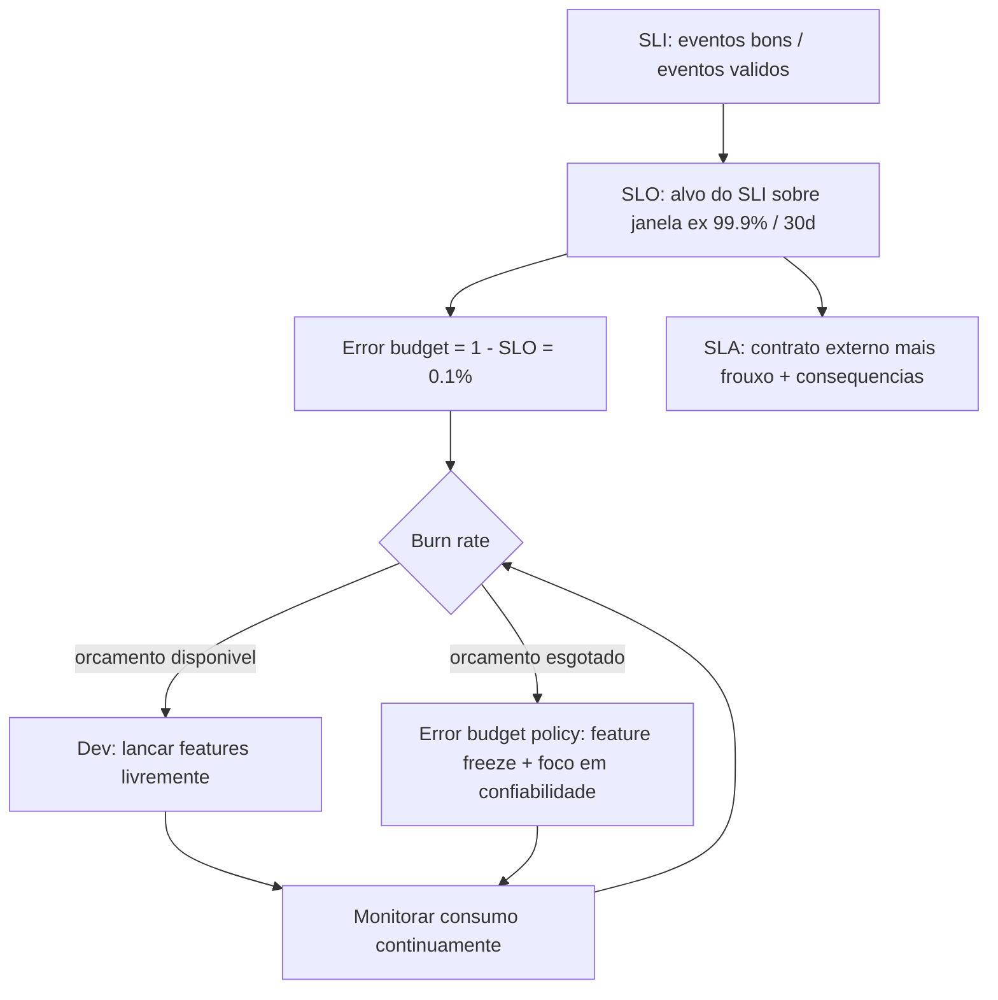
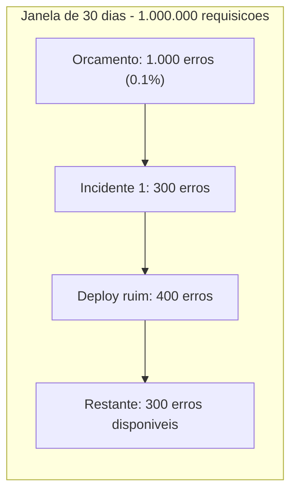

# SLI, SLO, SLA e Error Budgets

> **Bloco:** Observabilidade · **Nível:** Intermediário/Avançado · **Tempo de leitura:** ~23 min

## TL;DR

**SLI (Service Level Indicator)** é uma medida quantitativa cuidadosamente definida de algum aspecto do nível de serviço — por exemplo, a proporção de requisições bem-sucedidas. **SLO (Service Level Objective)** é um valor-alvo (ou faixa) para esse SLI — por exemplo, "99,9% das requisições em 200 ms". **SLA (Service Level Agreement)** é um contrato **externo** com clientes que inclui SLOs e **consequências** (multas, créditos) por violação; SLAs costumam ser mais frouxos que os SLOs internos, deixando uma margem. O **error budget (orçamento de erro)** é a contrapartida operacional do SLO: ele é `1 − SLO`. Um SLO de 99,9% concede um orçamento de 0,1% de falha. Esse orçamento transforma confiabilidade de um ideal absoluto ("zero erros") em um **recurso finito e gerenciável**, alinhando incentivos entre desenvolvimento (que quer lançar features) e operações (que quer estabilidade). Toda essa formalização vem do **Google SRE Book** (capítulos de Service Level Objectives e Embracing Risk). A regra de ouro: **100% é a meta errada** — perseguir confiabilidade perfeita é caro, contraproducente e desnecessário do ponto de vista do usuário.

## O problema que resolve

Confiabilidade não tem um valor óbvio "correto". Mais nove (99% → 99,9% → 99,99%) custa exponencialmente mais — em infraestrutura, redundância e, sobretudo, em **velocidade de entrega**, porque cada nove adicional exige mais cautela, mais revisão, menos deploys. Ao mesmo tempo, confiabilidade abaixo de um certo limiar destrói a confiança do usuário. Onde fica o ponto ótimo?

Antes dos SLOs, a tensão entre **Dev** (incentivado a lançar features rápido) e **Ops** (incentivado a manter o sistema estável, logo avesso a mudanças) era resolvida por poder político e brigas. O Google SRE Book formalizou uma solução elegante: defina explicitamente **quanta** indisponibilidade é aceitável (o SLO), derive disso um **orçamento de erro**, e use esse orçamento como um **recurso compartilhado** que ambos os times gastam. Enquanto há orçamento, Dev lança à vontade. Quando o orçamento esgota, o foco vira estabilidade. A decisão deixa de ser política e vira **dado**.

O SRE Book é categórico sobre o anti-padrão da perfeição: *"100% is the wrong reliability target for basically everything."* O raciocínio: a diferença entre 99,99% e 100% é imperceptível para o usuário (cuja própria conexão, ISP, dispositivo já introduzem mais falhas que isso), mas o custo de fechar essa última fração é enorme. O capítulo "Embracing Risk" argumenta que o objetivo do SRE não é eliminar risco, mas **gerenciá-lo** dentro de um orçamento explícito.

## O que é (definição aprofundada)

### SLI — Service Level Indicator

Um **SLI** é uma medida quantitativa, cuidadosamente definida, de um aspecto do nível de serviço. A forma recomendada pelo SRE Book é a de **proporção de eventos bons sobre eventos válidos**, expressa de 0 a 100%:

`SLI = (eventos bons / eventos válidos) × 100`

Exemplos de SLIs comuns, mapeados aos **Four Golden Signals**:

- **Disponibilidade**: proporção de requisições que retornam sucesso (não-5xx).
- **Latência**: proporção de requisições servidas abaixo de um limiar (ex.: < 300 ms). Atenção: latência é quase sempre medida por **percentis** (p50, p90, p99), nunca por média, porque a média esconde a cauda.
- **Qualidade / corretude**: proporção de respostas corretas.
- **Throughput / frescor de dados**: para pipelines, proporção de dados processados dentro de uma janela.

Um SLI ruim mede o que é fácil, não o que importa para o usuário. A regra: **meça a experiência do usuário**, idealmente o mais perto possível do ponto de consumo (ex.: na borda, não no fundo do banco).

### SLO — Service Level Objective

Um **SLO** é um valor-alvo (ou faixa) para um SLI, medido sobre uma **janela de tempo** definida. Formato: *"SLI ≥ alvo, ao longo de janela"*. Exemplos:

- "99,9% das requisições retornam sucesso, medido sobre uma janela móvel de 30 dias."
- "99% das requisições têm latência < 300 ms (p99), sobre 28 dias."

SLOs são **internos**: a meta operacional que o time se compromete a atingir. Não há consequências contratuais diretas, mas há consequências **operacionais** (a política de error budget).

A escolha da **janela** importa: janelas curtas (1 dia) reagem rápido mas são voláteis; janelas longas (30 dias) são estáveis mas lentas para refletir melhora/piora. Janelas **móveis (rolling)** são comuns para alertas; janelas **de calendário** (mês) para relatórios e SLAs.

### SLA — Service Level Agreement

Um **SLA** é um **contrato explícito com o cliente** que especifica SLOs e as **consequências** de descumprimento — tipicamente créditos, reembolsos ou multas. SLAs são o nível **comercial/jurídico**. Regra de ouro do SRE: o **SLA deve ser mais frouxo que o SLO interno**. Se o SLA promete 99,9%, o SLO interno deve mirar algo como 99,95%, criando uma margem de segurança — assim o time recebe o alerta (violação de SLO) **antes** de incorrer em penalidade contratual (violação de SLA). Nem todo serviço tem SLA (serviços internos geralmente só têm SLO), mas todo SLA deveria ter um SLO interno mais rígido por trás.

### Error budget — orçamento de erro

O **error budget** é a quantidade de indisponibilidade/erro que o serviço **pode** acumular em uma janela sem violar o SLO. Definição formal do SRE Book:

`error budget = 1 − SLO`

Um SLO de 99,9% ⇒ error budget de 0,1%. Se o serviço recebe 1.000.000 de requisições em quatro semanas, um SLO de 99,9% concede um orçamento de **1.000 erros** nesse período. O orçamento é uma **taxa à qual os SLOs podem ser perdidos**, rastreada diária ou semanalmente.

A genialidade do conceito: confiabilidade perfeita não é o objetivo. Há um orçamento de falha que **pode ser gasto** — em deploys arriscados, experimentos, manutenção planejada, chaos engineering. O orçamento alinha incentivos: enquanto há saldo, o time pode lançar agressivamente; quando esgota, a **error budget policy** entra em vigor (congelar features, focar em confiabilidade).

### Burn rate

O **burn rate** (taxa de consumo) mede quão rápido o orçamento está sendo gasto em relação ao esperado. Um burn rate de 1 consome o orçamento exatamente ao longo da janela. Burn rate de 10 esgota-o 10x mais rápido. Alertas modernos de SLO são baseados em **multi-window, multi-burn-rate**: alertar com urgência quando um burn rate alto persiste por uma janela curta (incidente agudo) e com menos urgência para burn rates baixos sustentados (degradação lenta). Isso resolve o velho dilema de alertas: muito sensível gera ruído, pouco sensível perde incidentes.

## Como funciona

O ciclo de vida operacional de SLOs e error budgets:

1. **Identifique a jornada crítica do usuário** (ex.: "completar um checkout").
2. **Defina o SLI** que captura a experiência (ex.: proporção de checkouts que completam em < 2 s sem erro).
3. **Instrumente** a medição (a partir de métricas/eventos — ver os outros documentos do bloco).
4. **Defina o SLO** (ex.: 99,9% sobre 30 dias) com base no que o usuário realmente precisa, não no máximo tecnicamente possível.
5. **Derive o error budget** (`1 − SLO`) e converta em números absolutos (minutos de downtime, número de requisições com erro).
6. **Monitore o burn rate** continuamente; configure alertas multi-burn-rate.
7. **Aplique a error budget policy**: documento acordado entre Dev, SRE e gestão que define **o que acontece** quando o orçamento esgota — tipicamente um **feature freeze** até a confiabilidade voltar ao verde.
8. **Revise periodicamente** os SLOs (trimestralmente), ajustando à realidade do uso e do negócio.

### Cálculo concreto do orçamento de downtime

Para um SLO de disponibilidade, o orçamento traduz-se em tempo de indisponibilidade permitido por período:

| SLO | Downtime/mês (30 dias) | Downtime/ano |
|---|---|---|
| 99% ("dois noves") | ~7h 18min | ~3,65 dias |
| 99,9% ("três noves") | ~43min 49s | ~8,76h |
| 99,95% | ~21min 54s | ~4,38h |
| 99,99% ("quatro noves") | ~4min 23s | ~52,6min |
| 99,999% ("cinco noves") | ~26s | ~5,26min |

Esses números explicitam por que cada nove adicional é dramaticamente mais caro: ir de 99,9% para 99,99% reduz o orçamento mensal de ~44 minutos para ~4 minutos — uma margem que praticamente proíbe manutenção manual e exige automação cara.

## Diagrama de fluxo





## Exemplo prático / caso real

Uma fintech brasileira opera a API de **autorização de pagamentos PIX**. Definição de SLOs:

- **SLI de disponibilidade**: proporção de requisições de autorização que retornam status válido (não-5xx, não-timeout).
- **SLO**: 99,95% sobre janela móvel de 30 dias.
- **Error budget**: `1 − 0,9995 = 0,05%`. Com ~20.000.000 de autorizações/mês, isso são **10.000 falhas** permitidas no mês, ou ~21min 54s de downtime total.
- **SLA com clientes corporativos**: 99,9% com crédito de 5% da fatura por mês abaixo do alvo. Note que o SLA (99,9%) é **mais frouxo** que o SLO interno (99,95%) — a fintech tem margem para detectar e corrigir antes de pagar multa.

**Operação na prática.** No dia 12, um deploy do serviço de antifraude introduz timeouts que causam 4.000 falhas em 2 horas. O dashboard de SLO no **Grafana** (alimentado por métricas do **Prometheus** e por SLIs derivados de eventos) mostra que **40% do orçamento mensal** foi consumido de uma vez, e o **burn rate** dispara para ~14x. O alerta multi-burn-rate aciona o on-call **imediatamente** (não esperou a violação total). Rollback feito, consumo estancado em 4.000/10.000.

No dia 20, com 60% do orçamento já gasto, o time discute lançar uma feature arriscada de parcelamento. A **error budget policy** acordada diz: abaixo de 25% de orçamento restante, freeze de mudanças não-essenciais. Como ainda há 40%, eles lançam — mas com canary e feature flag para rollback rápido. Se outro incidente esgotar o orçamento, o freeze entra automaticamente, e o time pausa features para investir em resiliência (timeouts melhores, circuit breakers, testes de carga). A decisão de "lançar ou não" virou uma consulta ao **saldo do orçamento**, não uma discussão política.

Ferramentas: **Prometheus** (métricas), **Grafana** (dashboards de SLO e burn rate), **OpenTelemetry** (instrumentação dos SLIs), **Datadog**/**Honeycomb** (SLO tracking nativo). Pseudocódigo do cálculo:

```text
eventos_bons   = contar(requisicoes onde status_valido E latencia < 2s)
eventos_total  = contar(requisicoes validas)
sli            = eventos_bons / eventos_total
budget_total   = (1 - 0.9995) * eventos_total      # 10.000
budget_gasto   = eventos_total - eventos_bons
budget_restante_pct = (budget_total - budget_gasto) / budget_total
burn_rate      = (budget_gasto / janela_decorrida) / (budget_total / janela_total)
```

## Quando usar / Quando evitar

**Use SLO + error budget quando:**

- O serviço tem usuários (internos ou externos) cuja experiência você consegue medir.
- Há tensão entre velocidade de entrega e estabilidade que precisa de arbitragem objetiva.
- Você quer alertas baseados em impacto ao usuário, não em sintomas de infraestrutura.

**Evite ou simplifique quando:**

- O serviço é experimental/early-stage sem tráfego significativo — SLOs prematuros viram teatro. Comece simples.
- Você não consegue medir um SLI que reflita a experiência real do usuário — um SLO sobre a métrica errada é pior que nenhum.

**Trade-offs explícitos:**

- **Rigor do SLO vs custo**: cada nove adicional custa exponencialmente. Não persiga 99,99% se 99,9% atende o usuário.
- **Janela curta vs longa**: curta reage rápido mas é volátil; longa é estável mas lenta. Use múltiplas janelas para alertas vs relatórios.
- **SLO interno vs SLA externo**: mantenha sempre a folga (SLO mais rígido que SLA).
- **Número de SLOs**: poucos e significativos batem muitos e ruidosos. Cubra as jornadas críticas, não cada endpoint.

## Anti-padrões e armadilhas comuns

- **SLO sem error budget acionável.** Definir um SLO bonito que ninguém usa para decidir nada. Sem uma **error budget policy** que muda comportamento (freeze, priorização), o SLO é decoração. O orçamento precisa ter dentes.
- **Mirar 100%.** Perseguir confiabilidade perfeita. É caro, impossível e desnecessário — *"100% is the wrong reliability target."* Sem orçamento de erro, não há espaço para lançar nada com segurança.
- **SLA mais rígido que o SLO.** Prometer ao cliente um nível que o time não monitora com folga — você descobre a violação pela multa, não pelo alerta.
- **Medir o SLI no lugar errado.** Medir disponibilidade no servidor de aplicação enquanto o load balancer já derruba requisições. Meça o mais perto possível do usuário.
- **Latência por média, não por percentil.** A média esconde a cauda. Um p99 de 5 s é invisível numa média de 200 ms. Sempre use percentis (p90/p99) para latência.
- **Alertar no sintoma errado.** Paginar humanos por "CPU a 80%" em vez de por impacto ao usuário (erros, latência). Alerte em SLI/burn rate, não em causas que podem ser benignas. Os Four Golden Signals existem para isso.
- **Alertas single-window.** Um único limiar gera ou ruído (sensível demais) ou cegueira (insensível demais). Use multi-window multi-burn-rate.
- **SLOs que ninguém revisa.** Definir uma vez e esquecer. Uso e negócio mudam; SLOs estáticos perdem relevância. Revise trimestralmente.
- **Vanity SLO.** Escolher um SLI fácil de bater em vez do que importa, só para o dashboard ficar verde.

## Relação com outros conceitos

- **SLO ↔ percentis p99 e Four Golden Signals.** SLIs de latência são definidos por percentis; os Four Golden Signals (latência, tráfego, erros, saturação) são a base natural dos SLIs. Conecta diretamente ao documento dos pilares e ao monitoramento.
- **SLI ↔ observabilidade e eventos.** SLIs são frequentemente calculados como proporção de **eventos bons/válidos**; eventos estruturados de alta cardinalidade permitem fatiar SLOs por cliente, região ou feature flag.
- **SLO ↔ distributed tracing.** Quando o SLO de latência é violado, traces explicam **onde** o tempo foi gasto. SLO detecta, tracing diagnostica.
- **Error budget ↔ trunk-based development / feature toggles.** O orçamento habilita entrega contínua segura: enquanto há saldo, deploys frequentes e feature flags com canary são incentivados; o esgotamento aciona freeze. O orçamento é o que torna o "ship fast" responsável.
- **Error budget ↔ resiliência e chaos engineering.** Gastar orçamento deliberadamente em experimentos de chaos é uma forma legítima de investir o budget para aprender sobre falhas antes que elas aconteçam por acaso.
- **SLA ↔ atributos de qualidade.** SLAs traduzem disponibilidade e performance (atributos de qualidade) em compromissos comerciais mensuráveis.

## Referências

- [Service Level Objectives — Google SRE Book (Cap. 4)](https://sre.google/sre-book/service-level-objectives/)
- [Embracing Risk — Google SRE Book (Cap. 3)](https://sre.google/sre-book/embracing-risk/)
- [Implementing SLOs — Google SRE Workbook](https://sre.google/workbook/implementing-slos/)
- [Error Budget Policy — Google SRE Workbook](https://sre.google/workbook/error-budget-policy/)
- [Monitoring Distributed Systems (Four Golden Signals) — Google SRE Book](https://sre.google/sre-book/monitoring-distributed-systems/)
- [Signals — OpenTelemetry](https://opentelemetry.io/docs/concepts/signals/)
- [Bottleneck #05: Resilience and Observability — Martin Fowler](https://martinfowler.com/articles/bottlenecks-of-scaleups/05-resilience-and-observability.html)
- [Observability 2.0 vs. Observability 1.0 — Honeycomb](https://www.honeycomb.io/blog/one-key-difference-observability1dot0-2dot0)
