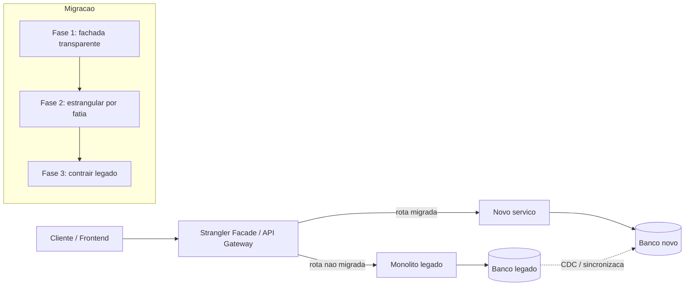

# Strangler Fig Pattern para modernização de legados

> **Bloco:** Evolução e práticas · **Nível:** Intermediário/Avançado · **Tempo de leitura:** ~22 min

## TL;DR

O **Strangler Fig Pattern** (Padrão da Figueira-estranguladora) é uma estratégia de modernização incremental na qual um novo sistema cresce *ao redor* do sistema legado, interceptando e assumindo gradualmente suas responsabilidades, até que o legado seja completamente substituído e possa ser desligado. O nome vem das figueiras-estranguladoras australianas, que germinam nos galhos de uma árvore hospedeira, descem raízes até o solo e crescem ao redor do tronco até a hospedeira morrer e apodrecer, deixando uma coluna oca no formato exato da árvore original.

A peça central da implementação é uma **fachada de interceptação** (interception facade) — frequentemente chamada de *strangler facade* — posicionada na borda do sistema, que roteia cada requisição ou para o legado ou para a nova implementação, de acordo com o estado da migração. O roteamento começa enviando 100% do tráfego ao legado e migra fatia por fatia (por endpoint, por capacidade de negócio, por entidade de domínio) até atingir 100% no novo sistema.

O grande valor frente a um *big bang rewrite* (reescrita total seguida de cutover único) é o **risco fracionado**: cada incremento entra em produção, gera valor e pode ser revertido isoladamente. O grande risco do padrão é o **strangler que nunca termina** — quando a organização para de investir após capturar a parte fácil, ficando permanentemente presa em uma arquitetura híbrida, mais cara de operar do que qualquer dos dois extremos.

## O problema que resolve

Sistemas legados acumulam **valor de negócio** ao longo de anos: regras de negócio sutis, casos de borda descobertos em produção, integrações tácitas. Ao mesmo tempo acumulam **dívida técnica**: stacks obsoletas, acoplamento que torna mudanças arriscadas, conhecimento que saiu da empresa junto com os engenheiros originais. A pressão para modernizar é real, mas a tentação clássica — a **reescrita total** — é uma das decisões mais perigosas em engenharia de software. Joel Spolsky, em 2000, já chamava reescrever do zero de "o pior erro estratégico que uma empresa de software pode cometer", precisamente porque você joga fora todo o conhecimento codificado e aposta tudo em um cutover futuro, durante o qual o negócio fica congelado: nenhuma feature nova entra enquanto a equipe corre atrás de paridade funcional com o sistema antigo.

**Martin Fowler** cunhou o padrão originalmente como *StranglerApplication* em 2004 (depois renomeado para **Strangler Fig Application** em 2019, para honrar melhor a biologia da planta e evitar a conotação violenta de "estrangular"). A origem é literalmente uma observação de campo: em 2001, durante férias na floresta tropical de Queensland, na Austrália, Fowler viu as figueiras-estranguladoras e percebeu uma analogia precisa com a forma como bons times faziam modernização — não substituindo o legado de uma vez, mas crescendo o novo sistema nas bordas do antigo até o velho ser sufocado.

**Sam Newman** popularizou e detalhou o padrão no contexto de microsserviços, primeiro em *Building Microservices* (O'Reilly, 2015; 2ª ed. 2021) e depois, exaustivamente, em *Monolith to Microservices* (O'Reilly, 2019), onde o Strangler Fig é apresentado como o padrão-mãe da decomposição de monolitos, ao lado de técnicas complementares como UI Composition, Branch by Abstraction, Parallel Run, Decorating Collaborator e Change Data Capture. **Chris Richardson** catalogou o mesmo conceito em microservices.io como *Strangler Application*.

O problema concreto que o padrão resolve, portanto, é: **como modernizar um sistema crítico em produção sem parar o negócio, sem um cutover de alto risco e sem perder o conhecimento embutido no legado** — entregando valor e reduzindo risco a cada passo.

## O que é (definição aprofundada)

O Strangler Fig é, antes de tudo, um **padrão de migração incremental com coexistência controlada**. Seus elementos definidores:

**Fachada de interceptação (interception layer / asset capture point):** um ponto de controle no caminho das requisições onde se decide o roteamento entre legado e novo. Pode ser implementada em diferentes camadas, e a escolha da camada determina a granularidade e a dificuldade da migração. Possibilidades comuns:

- **HTTP / reverse proxy / API gateway:** roteia por path, host ou header. É a camada mais limpa quando o legado já expõe HTTP. Ferramentas: NGINX, Envoy, um API gateway (Kong, AWS API Gateway), ou um *backend for frontend* que compõe respostas.
- **Mensageria / event interception:** intercepta eventos ou mensagens, redirecionando alguns tipos de mensagem para o novo consumidor.
- **Código (in-process):** quando não há uma costura de rede, a interceptação acontece dentro do processo, frequentemente combinada com **Branch by Abstraction** (uma camada de abstração interna seleciona a implementação).
- **Camada de dados (CDC / triggers):** em casos onde o ponto de captura é o banco — embora capturar pelo banco seja arriscado porque expõe o esquema interno do legado.

**Asset capture (captura de ativos):** estratégia complementar que Fowler descreve em verbete próprio. Em vez de pensar em "endpoints" você pensa em **ativos** — as entidades de negócio que o sistema gerencia (clientes, pedidos, produtos). A migração se organiza em torno de mover a *autoridade* sobre cada ativo do legado para o novo sistema. Um ativo migrado é aquele cujo *system of record* passou a ser o novo serviço.

**Coexistência e fonte da verdade (source of truth):** durante a migração, dados e comportamento existem em ambos os lados. O ponto mais delicado do padrão é decidir, para cada ativo, **qual sistema é a fonte da verdade em cada momento** e como manter os dois lados sincronizados durante a transição (replicação, *dual writes*, ou CDC).

**Estrangulamento incremental:** o legado encolhe monotonicamente. Cada incremento *deveria* poder remover código morto do legado — se você nunca consegue deletar nada do velho sistema, o padrão está degenerando para "novo sistema empilhado sobre o velho".

Conceitualmente, o Strangler Fig se opõe ao **big bang rewrite** (substituição total, cutover único) e se distingue de uma simples **reescrita paralela mantida em sombra** — no Strangler, o novo sistema *assume tráfego real de produção* progressivamente, não apenas roda em paralelo para validação (isso último é o **Parallel Run**, técnica que se *combina* com o Strangler, mas não é o mesmo).

## Como funciona

A mecânica do Strangler Fig segue três fases que se repetem por ativo/capacidade, ecoando o ciclo *expand → migrate → contract* do Parallel Change:

**1. Instalar a fachada (transparente).** Antes de migrar qualquer coisa, insere-se a fachada de interceptação no caminho das requisições, roteando 100% para o legado. Nesse momento ela deve ser **comportamentalmente invisível**: o sistema funciona exatamente como antes. Esse passo, aparentemente sem valor, é o que viabiliza tudo o que vem depois — é a "costura" (seam, no sentido de Michael Feathers) por onde o estrangulamento vai acontecer. Riscos: a fachada vira gargalo de latência ou ponto único de falha; precisa ser dimensionada e observada como componente de produção crítico desde o dia zero.

**2. Estrangular incremento a incremento.** Escolhe-se uma fatia — idealmente uma **capacidade de negócio** coesa e de baixo acoplamento (ex.: "cálculo de frete", "catálogo de produtos"). Implementa-se essa fatia no novo sistema, decide-se a fonte da verdade e a estratégia de sincronização de dados, e então **muda-se o roteamento daquela fatia** na fachada. O roteamento é tipicamente progressivo via *feature toggle* ou *canary*: 1% → 10% → 50% → 100% do tráfego daquele endpoint vai ao novo serviço, com monitoramento de erro e latência a cada degrau. Se algo der errado, reverte-se o toggle (rollback de tráfego), não um deploy. Combinar com **Parallel Run** aqui é poderoso: por um período, ambas as implementações processam a mesma requisição e suas saídas são comparadas, sem que o usuário veja a diferença, antes de confiar o tráfego ao novo lado.

**3. Contrair o legado.** Uma vez que 100% de uma fatia esteja servida pelo novo sistema e estável, o código correspondente no legado é **removido**. Esta fase é a que costuma ser negligenciada — e cuja negligência transforma o Strangler em dívida permanente. O legado precisa encolher; a contração é onde se realiza o ganho de manutenibilidade.

Sincronização de dados é o ponto mais difícil na prática. Padrões usados:

- **Dual write:** a aplicação escreve em ambos os lados. Simples de pensar, traiçoeiro na consistência (escritas parciais, ordenação) — geralmente desencorajado salvo com idempotência e reconciliação.
- **Change Data Capture (CDC):** uma ferramenta (Debezium lendo o WAL/binlog) propaga mudanças de um lado ao outro de forma assíncrona, desacoplando os sistemas e mantendo a réplica atualizada com baixo acoplamento ao código.
- **Mudança de fonte da verdade por ativo:** num dado momento, vira-se a chave de qual lado é autoritativo para aquele ativo, com o outro lado passando a ser réplica somente-leitura.

## Diagrama de fluxo



O diagrama mostra a fachada decidindo o roteamento por rota: o que ainda não foi migrado vai ao monolito, o que já foi vai ao novo serviço. A linha tracejada de CDC representa a sincronização de dados que mantém os dois lados coerentes durante a coexistência. O subgrafo resume o ciclo de três fases que se repete por capacidade.

## Exemplo prático / caso real

Considere uma fintech brasileira com um monolito PHP de oito anos que faz tudo: onboarding de clientes, conta digital, emissão de boletos, Pix, antifraude e relatórios. O monolito está acoplado a um único MySQL gigante, e qualquer mudança no módulo de Pix arrisca quebrar o de boletos. O time decide modernizar com Strangler Fig, começando pela capacidade de **emissão de Pix**, que é a de maior crescimento e a que mais sofre com a rigidez do monolito.

**Passo 1 — fachada.** Coloca-se um **Envoy** (ou Kong) na frente do monolito. Todo tráfego de `api.fintech.com.br/*` passa por ele; inicialmente roteia 100% ao monolito. A fachada é instrumentada com métricas (latência p99, taxa de erro) e tracing distribuído desde o início.

**Passo 2 — novo serviço de Pix.** Um novo serviço em Go é construído para `POST /pix/cobranca` e `POST /pix/devolucao`, com seu próprio PostgreSQL. As regras de negócio são extraídas do monolito — e aqui o time descobre, lendo o código antigo, três casos de borda de devolução parcial que ninguém documentara. Uma **Anti-Corruption Layer** isola o novo serviço do modelo de dados legado, traduzindo o esquema antigo para o modelo limpo do novo bounded context.

**Passo 3 — Parallel Run + canary.** Por duas semanas, requisições de cobrança Pix são processadas por *ambos* os sistemas; a saída do monolito é a que vale (servida ao usuário), mas a do novo serviço é registrada e comparada. Divergências viram bugs corrigidos no novo serviço. Validado, abre-se o canary via **feature toggle** controlado por **Unleash** (ou LaunchDarkly): 1% → 5% → 25% → 100% do tráfego de Pix vai ao novo serviço, com a fachada reescrevendo a rota. A cada degrau, observam-se os dashboards; um pico de erro reverte o toggle em segundos, sem redeploy.

**Passo 4 — sincronização e fonte da verdade.** Durante o canary, **Debezium** captura mudanças nas tabelas de Pix do MySQL e as projeta no PostgreSQL novo, e vice-versa, até que se vire a chave: o PostgreSQL passa a ser a fonte da verdade do Pix, e o MySQL recebe uma projeção somente-leitura para os relatórios legados que ainda dependem dele.

**Passo 5 — contração.** Com 100% do Pix estável no novo serviço por 30 dias, o time **deleta** o módulo de Pix do monolito PHP. O monolito encolheu. Repete-se o ciclo para a próxima capacidade (boletos, depois conta digital). A infraestrutura do novo serviço é provisionada via **Terraform** e entregue por **GitOps com ArgoCD**, de forma que cada serviço estrangulado nasce já dentro da plataforma moderna.

Pseudocódigo da decisão de roteamento na fachada (ilustrativo):

```
on request(path, headers):
    if feature_enabled("pix-novo-servico", context=request) and path startswith "/pix":
        forward_to(NOVO_SERVICO)
    else:
        forward_to(MONOLITO)
```

## Quando usar / Quando evitar

**Usar quando:**

- O sistema legado é grande, crítico e está em produção contínua — o negócio não pode parar para um cutover.
- É possível identificar **costuras** (endpoints HTTP, capacidades de negócio, ativos) que permitam interceptação e migração por fatias.
- Há apetite organizacional para um esforço de meses/anos com entregas incrementais, em vez de um projeto de reescrita de duração indefinida.
- A redução de risco por incremento vale o custo da fachada e da coexistência.

**Evitar (ou preferir alternativas) quando:**

- O legado é **pequeno** o suficiente para uma reescrita rápida e de baixo risco — o overhead da fachada, da sincronização de dados e da coexistência pode custar mais do que reescrever de uma vez.
- Não há costuras claras: um monolito com acoplamento tão profundo que qualquer fatia arrasta o sistema inteiro pode primeiro precisar de refatoração interna (Branch by Abstraction) antes que o Strangler de rede seja viável.
- A organização não tem disciplina ou orçamento para chegar à **fase de contração** — sem isso, o padrão produz uma arquitetura híbrida permanente, o pior dos mundos.
- O domínio está prestes a mudar radicalmente de regras de negócio: às vezes vale repensar o modelo em vez de migrar comportamento legado fielmente.

Trade-off central: o Strangler troca **risco concentrado** (big bang) por **complexidade prolongada** (coexistência). Você paga em duração e em sincronização de dados o que economiza em risco de cutover.

## Anti-padrões e armadilhas comuns

- **O Strangler que nunca termina.** O anti-padrão mais comum e mais caro. Captura-se a parte fácil/visível, declara-se vitória, e o legado residual fica para sempre. Resultado: dois sistemas para operar, dois bancos para sincronizar, custo operacional permanentemente maior. Mitigação: tratar a **fase de contração como entregável obrigatório** de cada incremento e medir o encolhimento do legado (linhas de código removidas, endpoints desligados) como métrica de sucesso.
- **Fachada que vira monolito de roteamento.** A camada de interceptação acumula lógica de negócio, transformações e exceções até virar ela própria um sistema complexo e frágil. Mantenha a fachada burra: roteamento e, no máximo, composição.
- **Sincronização de dados por dual write ingênuo.** Escrever nos dois bancos sem idempotência nem reconciliação produz divergência silenciosa. Prefira CDC e uma fonte da verdade clara por ativo.
- **Capturar pela camada de dados expondo o esquema legado.** Interceptar via banco acopla o novo sistema ao modelo interno do legado — exatamente o que se quer evitar. Use ACL para traduzir.
- **Migrar por camada técnica em vez de por capacidade.** Tentar mover "toda a camada de persistência" ou "toda a UI" de uma vez recria o big bang dentro do Strangler. Migre verticalmente, por capacidade de negócio.
- **Ignorar a fachada como componente de produção.** Ela vira ponto único de falha e gargalo de latência se não for dimensionada, replicada e observada como infraestrutura crítica.

## Relação com outros conceitos

- **Anti-Corruption Layer (ACL):** quase sempre andam juntos. A ACL protege o novo serviço do modelo de dados e das idiossincrasias do legado durante a coexistência, traduzindo entre os dois modelos. O Strangler diz *como* migrar tráfego; a ACL diz *como* impedir que o legado contamine o novo design.
- **Microsserviços:** o Strangler é a rota canônica de decomposição de monolito em serviços. Cada fatia estrangulada tende a se tornar um serviço com seu próprio dado, alinhado a uma capacidade de negócio.
- **Branch by Abstraction:** o equivalente *in-process* do Strangler. Quando a costura é interna ao código (não há rede para interceptar), usa-se uma camada de abstração para selecionar implementações — frequentemente como passo preparatório antes de extrair um serviço.
- **Parallel Run:** técnica de validação que se combina com o Strangler — roda velho e novo em paralelo comparando saídas antes de confiar o tráfego ao novo lado.
- **Feature Toggles / Canary:** o mecanismo operacional do roteamento progressivo e do rollback de tráfego durante o estrangulamento.
- **CDC / Change Data Capture:** a técnica de sincronização de dados que sustenta a coexistência.

## Referências

- [bliki: Strangler Fig Application — Martin Fowler](https://martinfowler.com/bliki/StranglerFigApplication.html)
- [bliki: Asset Capture — Martin Fowler](https://martinfowler.com/bliki/AssetCapture.html)
- [Pattern: Strangler Application — microservices.io (Chris Richardson)](https://microservices.io/patterns/refactoring/strangler-application.html)
- [Strangler Fig Pattern — Sam Newman](https://samnewman.io/patterns/refactoring/strangler-fig-application/)
- [Monolith Decomposition Patterns (talk) — Sam Newman](https://samnewman.io/talks/monolith-decomposition-patterns/)
- [Monolith to Microservices (livro) — O'Reilly](https://www.oreilly.com/library/view/monolith-to-microservices/9781492047834/)
- [bliki: Parallel Change — Martin Fowler](https://martinfowler.com/bliki/ParallelChange.html)
