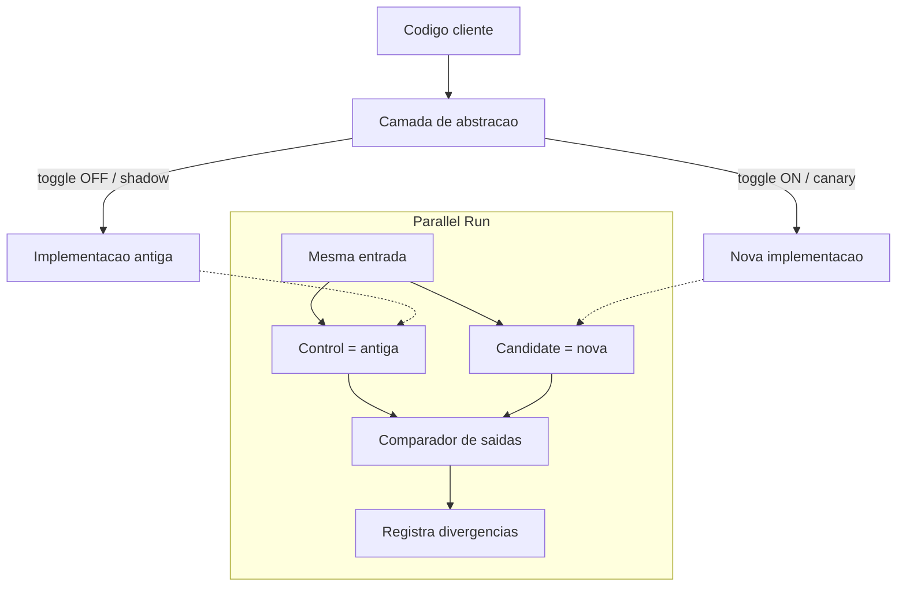

# Branch by Abstraction, Parallel Run e Feature Toggles

> **Bloco:** Evolução e práticas · **Nível:** Intermediário/Avançado · **Tempo de leitura:** ~24 min

## TL;DR

Estes três padrões formam o tripé que torna possível fazer **mudanças grandes e arriscadas com o sistema continuamente em produção e integrável** — pré-requisito para Trunk-Based Development e Continuous Delivery. Eles resolvem o mesmo problema sob ângulos diferentes:

**Branch by Abstraction** é uma técnica para fazer uma mudança em larga escala *gradualmente*, mantendo o sistema sempre liberável, sem usar feature branches de longa duração. Em vez de ramificar no controle de versão, você ramifica no *código*: introduz uma **camada de abstração** entre os clientes e a parte a substituir, implementa a nova versão por trás dessa abstração, migra os clientes incrementalmente e remove a implementação antiga e (opcionalmente) a abstração ao final.

**Parallel Run** (Execução Paralela) executa a implementação antiga e a nova *simultaneamente* para a mesma entrada, compara as saídas e usa a antiga como fonte da verdade até confiar na nova. É uma técnica de **verificação em produção** de alta fidelidade, especialmente para reescritas de lógica crítica onde testes não capturam todos os casos de borda.

**Feature Toggles** (ou Feature Flags) são pontos de decisão em runtime que permitem ligar/desligar funcionalidades sem deploy. **Pete Hodgson**, no artigo de referência hospedado no site de Martin Fowler, classifica-os em quatro categorias por *longevidade* e *dinamismo*: **Release**, **Experiment**, **Ops** e **Permission** toggles — e adverte: feature toggles geram **dívida técnica** que precisa ser ativamente gerenciada, ou viram um pântano de condicionais.

## O problema que resolve

A tensão fundamental do desenvolvimento moderno: como entregar **continuamente** (CI/CD, trunk-based) enquanto se fazem mudanças que levam **dias ou semanas** para concluir? A resposta tradicional — *feature branch* de longa duração — adia a integração, gerando o "merge hell": quanto mais tempo um branch vive isolado, mais ele diverge do trunk e mais doloroso e arriscado é o merge final. **Jez Humble** e **Dave Farley**, em *Continuous Delivery* (2010), e a equipe **DORA** em *Accelerate* (2018) mostram empiricamente que branches de vida curta (menos de um dia) e trunk-based development correlacionam fortemente com alta performance de entrega. Mas isso só é possível se a equipe tiver técnicas para integrar trabalho *incompleto* sem quebrar o sistema. É exatamente o que estes três padrões fornecem.

**Branch by Abstraction:** o termo foi cunhado por **Paul Hammant** (que credita **Stacy Curl** pela ideia original), justamente como argumento *a favor* do Trunk-Based Development e contra branches de longa duração. **Martin Fowler** formalizou-o em verbete de janeiro de 2014. A motivação: fazer uma mudança grande (trocar um ORM, substituir um sistema de persistência, reescrever um subsistema) sem nunca ter o trunk quebrado e sem ramificar no VCS.

**Parallel Run:** descrito por **Sam Newman** em *Monolith to Microservices* (2019) como padrão de migração, e relacionado por **Martin Fowler** no contexto de validação. A ideia tem raízes em práticas de migração de sistemas financeiros, onde o sistema novo roda "em sombra" comparando com o antigo antes de assumir.

**Feature Toggles:** **Martin Fowler** descreveu o conceito básico no verbete *FeatureFlag*; **Pete Hodgson** (ex-Thoughtworks) escreveu o artigo de referência *Feature Toggles (aka Feature Flags)* em 2017, hospedado em martinfowler.com, que se tornou a taxonomia canônica. O problema que toggles resolvem: **desacoplar deploy de release**. Você faz deploy do código (binário em produção) sem necessariamente *liberar* a funcionalidade ao usuário; a liberação vira uma decisão de configuração, reversível em segundos.

## O que é (definição aprofundada)

### Branch by Abstraction

Os passos canônicos:

1. **Criar uma camada de abstração** sobre a parte do código que será substituída (a "supplier"). Os clientes passam a usar essa abstração em vez da implementação concreta.
2. **Refatorar os clientes** para usar a abstração, mantendo a implementação antiga como única realização da abstração. O sistema continua idêntico em comportamento — e liberável a cada commit.
3. **Construir a nova implementação** por trás da mesma abstração.
4. **Migrar incrementalmente** os clientes/casos para a nova implementação, frequentemente controlados por um **feature toggle** (o que conecta os dois padrões).
5. **Remover a implementação antiga** quando ninguém mais a usa.
6. **Remover a abstração** se ela era apenas um andaime — ou mantê-la se virou uma fronteira útil.

O ponto-chave: a abstração é um **seam** (costura) que permite ter as duas implementações coexistindo *no mesmo binário*, sempre integrado no trunk. É o análogo *in-process* do Strangler Fig (que opera na borda de rede).

### Parallel Run

Modos de operação:

- **Shadow / dark launch:** a nova implementação recebe a mesma entrada da antiga, mas sua saída é *descartada* (apenas registrada e comparada). O usuário só vê a saída da implementação confiável.
- **Comparação ativa:** ambas executam; um *comparador* registra divergências (diffs) entre as saídas, que viram material de depuração. Ferramentas como o **GitHub Scientist** (biblioteca de "refactoring science") automatizam isso: executam *control* e *candidate*, comparam, e reportam mismatches sem afetar o resultado.
- **Considerações:** custo computacional dobrado durante o período; cuidado extremo com **side effects** — a implementação candidata *não pode* causar efeitos colaterais reais (não pode cobrar o cliente duas vezes, enviar e-mail duplicado, escrever no system of record). Saídas não-determinísticas (timestamps, IDs gerados) exigem normalização antes de comparar.

### Feature Toggles (taxonomia de Pete Hodgson)

A taxonomia organiza toggles em dois eixos: **longevidade** (quanto tempo o toggle deve existir) e **dinamismo** (com que frequência sua decisão muda — desde estático em deploy até por-requisição):

- **Release Toggles:** escondem trabalho incompleto que já está em produção (continuous delivery / trunk-based). Vida curta (dias/semanas), dinamismo baixo. São os que mais facilmente viram dívida — devem ser removidos assim que a feature é liberada.
- **Experiment Toggles:** dividem usuários em coortes para A/B testing. Vida curta-média, dinamismo por-requisição (cada usuário cai consistentemente numa variante). A decisão é estatística.
- **Ops Toggles:** controlam aspectos operacionais — *kill switches* para degradar graciosamente, desligar features pesadas sob carga. Podem ser de vida longa (alguns kill switches ficam permanentemente). Dinamismo alto (mudam em runtime, por operadores).
- **Permission Toggles:** expõem features a grupos específicos (usuários premium, internos, beta). Vida potencialmente longa (viram parte do produto), dinamismo por-requisição (por usuário).

Hodgson também destaca práticas de implementação: **separar a decisão do toggle do ponto de decisão** (não espalhar `if flag` pelo código; usar injeção/strategy), preferir **toggle router** configurável a flags hard-coded, e manter um **inventário de toggles** com dono e data de remoção.

## Como funciona

A mecânica integrada dos três é o que viabiliza uma reescrita segura no trunk:

1. **Branch by Abstraction** cria a costura no código e permite que velha e nova implementação coexistam.
2. **Feature Toggle** controla, em runtime, *qual* implementação atende cada requisição — e permite migração progressiva (canary) e rollback instantâneo.
3. **Parallel Run** valida que a nova implementação produz os mesmos resultados que a antiga, antes de o toggle confiar o tráfego a ela.

Fluxo típico de uma reescrita de subsistema crítico:

- Introduz-se a abstração; clientes passam a chamá-la; só há a implementação antiga. Sistema permanece liberável (commits no trunk diariamente).
- Constrói-se a nova implementação por trás da abstração.
- Liga-se o **Parallel Run**: ambas executam, comparam saídas; antiga é a fonte da verdade. Diffs viram bugs a corrigir.
- Quando as divergências zeram em produção, abre-se o **toggle** progressivamente (1% → 100%), com rollback de tráfego pronto.
- Atingido 100% e estável, remove-se o toggle, a implementação antiga e (se for andaime) a abstração — fechando o ciclo *expand → migrate → contract*.

## Diagrama de fluxo



O diagrama mostra a camada de abstração roteando entre implementação antiga e nova conforme o estado do feature toggle, e o bloco de Parallel Run alimentando ambas com a mesma entrada e comparando as saídas — a antiga (control) servindo de fonte da verdade enquanto a nova (candidate) é validada silenciosamente.

## Exemplo prático / caso real

Um e-commerce brasileiro precisa **reescrever o motor de cálculo de frete**, hoje um emaranhado de regras dentro do monolito Java (tabelas Correios, transportadoras parceiras, frete grátis por região, descontos por volume). A lógica é crítica — um erro cobra frete errado e gera prejuízo ou reclamação — e tem dezenas de casos de borda não documentados. Reescrever e fazer cutover seria um tiro no escuro.

**Branch by Abstraction.** Cria-se a interface `CalculadoraFrete` com um único método `calcular(carrinho, endereco): Frete`. Todo o checkout passa a chamar a abstração; a implementação atual vira `CalculadoraFreteLegada`. Commits diários no trunk; nada muda para o usuário. Isso, sozinho, já é uma melhoria de design (a lógica de frete agora tem fronteira clara).

**Nova implementação.** Constrói-se `CalculadoraFreteNova`, mais limpa e testável, atrás da mesma interface. Durante semanas, ela é desenvolvida no trunk, integrada continuamente, mas nunca atende tráfego real.

**Parallel Run com Scientist.** Usando uma biblioteca estilo GitHub Scientist, o checkout executa as duas calculadoras para cada carrinho real: a legada é a `control` (seu valor é o que o cliente paga); a nova é a `candidate` (saída registrada, nunca usada). Um comparador registra divergências. Na primeira semana, 0,8% dos carrinhos divergem — todos rastreados a três regras de frete grátis regional que a nova implementação não tratava. Corrigidas, as divergências caem para zero.

**Feature Toggle / canary.** Com as saídas idênticas em produção, abre-se o toggle via **Unleash** (auto-hospedado) ou **LaunchDarkly**: 1% dos checkouts passam a *usar* o valor da nova calculadora, depois 10%, 50%, 100%, observando taxa de erro e reclamações a cada degrau. Um `Ops Toggle` (kill switch) fica disponível para reverter instantaneamente ao motor legado se algo escapar.

**Contração.** Atingidos 100% e estabilidade por 30 dias, removem-se o toggle de release, a `CalculadoraFreteLegada` e o aparato de Parallel Run. A interface `CalculadoraFrete` permanece — virou uma fronteira de domínio útil, candidata a se tornar um microsserviço de frete no futuro (ponto de conexão com Strangler Fig).

Pseudocódigo do Parallel Run (estilo Scientist):

```
resultado = experimento("calculo-frete")
    .control(() -> calculadoraLegada.calcular(carrinho, endereco))
    .candidate(() -> calculadoraNova.calcular(carrinho, endereco))
    .comparador((a, b) -> a.valor == b.valor && a.prazo == b.prazo)
    .run()   // retorna o valor do control; registra diff se divergir
```

## Quando usar / Quando evitar

**Branch by Abstraction — usar quando:** a mudança é grande demais para um único commit/PR mas você quer manter o trunk integrável e liberável; existe (ou pode existir) uma costura natural no código. **Evitar quando:** a mudança é pequena (um PR resolve) — a abstração vira cerimônia desnecessária; ou quando não há costura razoável e forçá-la distorce o design.

**Parallel Run — usar quando:** a lógica é crítica e difícil de cobrir totalmente por testes (cálculos financeiros, pricing, frete, antifraude), e você pode rodar a candidata *sem side effects*. **Evitar quando:** as operações têm efeitos colaterais inevitáveis e não-mockáveis; o custo computacional dobrado é proibitivo; ou a comparação de saídas não-determinísticas é inviável de normalizar.

**Feature Toggles — usar quando:** quer desacoplar deploy de release, fazer canary/rollback de tráfego, A/B testing, ou kill switches operacionais. **Evitar / cuidado quando:** a flag seria de release e a equipe não tem disciplina de removê-la — toggles de release esquecidos são dívida pura; ou quando o número de flags ativas cresce a ponto de a combinatória de estados tornar o sistema impossível de testar e raciocinar.

## Anti-padrões e armadilhas comuns

- **Feature toggles que viram dívida permanente.** O anti-padrão clássico de Hodgson: release toggles que nunca são removidos. Cada flag esquecida é um `if` morto, um caminho de código não testado, e contribui para a explosão combinatória de estados. Mitigação: dono + data de expiração por toggle; "toggle debt" no backlog; testes de que a flag pode ser removida.
- **Lógica de toggle espalhada (magic flags).** `if flag` espalhado por dezenas de pontos torna impossível saber o que cada flag controla. Mitigação: centralizar a decisão (toggle router), usar strategy/injeção, manter o ponto de decisão único.
- **Parallel Run com side effects na candidata.** Se a candidata escreve no system of record, cobra o cliente ou dispara e-mails, você corrompe produção. A candidata deve ser estritamente *somente leitura / efeito descartável*.
- **Abstração que vira andaime permanente desnecessário.** Manter a camada de abstração e ambas as implementações "por garantia" após a migração — recriando o problema do Strangler que nunca contrai.
- **Combinar toggles e branches longos.** Usar feature toggle *e* feature branch de longa duração ao mesmo tempo é o pior dos mundos: você paga o overhead da flag sem ganhar a integração contínua. Toggles existem justamente para *substituir* branches longos.
- **Testar apenas um estado dos toggles.** Se o CI só testa as flags no estado "ligado", o estado "desligado" (que é o que está em produção) fica sem cobertura. Idealmente testar ambos os caminhos das flags ativas.

## Relação com outros conceitos

- **Trunk-Based Development:** os três padrões são *habilitadores* do trunk-based. Branch by Abstraction substitui o feature branch longo; toggles escondem trabalho incompleto integrado no trunk; Parallel Run dá confiança para integrar reescritas. Foi precisamente como argumento pró-trunk que Hammant cunhou Branch by Abstraction.
- **Strangler Fig:** Branch by Abstraction é o equivalente *in-process* do Strangler (que opera na borda de rede); frequentemente é o passo preparatório que cria a costura antes de extrair um serviço. Parallel Run e toggles são reaproveitados dentro do Strangler para validar e rotear cada fatia.
- **Continuous Delivery:** desacoplar deploy de release (via toggles) é um pilar do CD; permite deploy frequente e liberação controlada.
- **Error budgets / SRE:** Ops toggles (kill switches) são instrumentos de proteção do error budget — degradam graciosamente sob estresse para preservar a disponibilidade prometida. A capacidade de reverter uma feature em segundos via toggle é o que torna o gasto controlado do error budget viável.
- **Parallel Change (expand/contract):** os três seguem o mesmo arco de três fases (introduzir → migrar → remover) que Fowler descreve em Parallel Change.

## Referências

- [Feature Toggles (aka Feature Flags) — Pete Hodgson em martinfowler.com](https://martinfowler.com/articles/feature-toggles.html)
- [bliki: Feature Flag — Martin Fowler](https://martinfowler.com/bliki/FeatureFlag.html)
- [bliki: Branch By Abstraction — Martin Fowler](https://martinfowler.com/bliki/BranchByAbstraction.html)
- [Make Large Scale Changes Incrementally with Branch By Abstraction — continuousdelivery.com (Jez Humble)](https://continuousdelivery.com/2011/05/make-large-scale-changes-incrementally-with-branch-by-abstraction/)
- [bliki: Parallel Change — Martin Fowler](https://martinfowler.com/bliki/ParallelChange.html)
- [Monolith to Microservices (livro) — Sam Newman / O'Reilly](https://www.oreilly.com/library/view/monolith-to-microservices/9781492047834/)
- [Accelerate (livro) — Forsgren, Humble, Kim](https://itrevolution.com/product/accelerate/)
