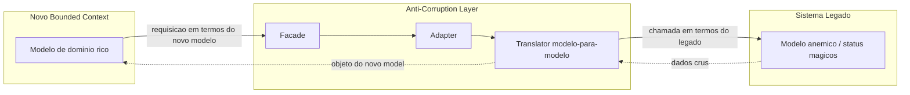

# Anti-Corruption Layer em migrações

> **Bloco:** Evolução e práticas · **Nível:** Intermediário/Avançado · **Tempo de leitura:** ~21 min

## TL;DR

A **Anti-Corruption Layer** (ACL, Camada Anticorrupção) é uma camada de tradução e isolamento posicionada entre dois sistemas com **modelos de domínio diferentes**, que impede que os conceitos, o vocabulário e as idiossincrasias de um sistema "vazem" e corrompam o modelo do outro. O termo vem do **Domain-Driven Design** de **Eric Evans** (2003), onde a ACL é um dos *context mapping patterns* — o padrão defensivo por excelência para um bounded context que precisa integrar com outro sistema (legado, externo, de outro time) cujo modelo você não controla e não quer importar.

Em **migrações**, a ACL é a peça que torna o **Strangler Fig** viável sem contaminação: enquanto o novo serviço cresce ao redor do legado, é a ACL que traduz entre o modelo limpo do novo *bounded context* e o modelo confuso, anêmico ou mal-modelado do legado. Sem ela, o novo sistema nasce já acoplado ao esquema de banco e às convenções do velho — herdando a dívida que a migração pretendia eliminar.

Mecanicamente, a ACL combina padrões táticos: **Adapter** (adapta interfaces), **Facade** (simplifica a interface do legado), e **Translator** (mapeia modelo-para-modelo). O custo é real — código adicional, latência de tradução, manutenção — e por isso a ACL é um trade-off consciente: você paga isolamento com complexidade. A armadilha comum é a **ACL que vaza** (tradução incompleta que deixa conceitos do legado passarem) ou a **ACL que vira novo monolito** (acumula lógica de negócio em vez de só traduzir).

## O problema que resolve

Toda integração entre sistemas é uma integração entre **modelos mentais**. Um sistema legado de e-commerce pode chamar de "cliente" qualquer pessoa que já visitou o site, misturar conceitos de "pedido" e "carrinho", usar status numéricos mágicos (`status = 7`), e ter campos cujo significado mudou três vezes ao longo dos anos. Quando você constrói um novo *bounded context* — digamos, um serviço de "Gestão de Pedidos" com um modelo de domínio rico e bem definido — e precisa integrar com esse legado, há um perigo concreto: ao consumir os dados e conceitos do legado diretamente, o **modelo limpo do novo contexto é puxado em direção ao modelo do legado**. As entidades novas começam a carregar campos legados sem sentido, os status numéricos vazam, o vocabulário se mistura. O modelo é *corrompido*.

**Eric Evans** descreve isso em *Domain-Driven Design: Tackling Complexity in the Heart of Software* (Addison-Wesley, 2003), no capítulo sobre integração de contextos. Sua observação: quando dois bounded contexts precisam se comunicar e um deles tem um modelo que você não quer (legado, sistema de terceiro, modelo de outro time com qualidade duvidosa), a relação mais segura é a **Anticorruption Layer** — uma das relações no *Context Map*, ao lado de Shared Kernel, Customer/Supplier, Conformist, Open Host Service e Published Language. A ACL é especificamente a escolha do contexto *downstream* que decide **não se conformar** ao modelo upstream, mas isolar-se dele.

Em **migrações de legado**, esse problema é agudo porque a integração não é eventual — é o caminho diário pelo qual o novo sistema lê e escreve dados ainda sob autoridade do legado durante a coexistência. A ACL é, nesse contexto, a fronteira que permite ao novo design florescer sem ser sufocado pelo velho — complementando exatamente o que o **Strangler Fig** (Fowler/Newman) faz na borda de roteamento.

## O que é (definição aprofundada)

A ACL não é um único padrão, mas uma **composição** de padrões táticos a serviço do isolamento de modelo. Seus componentes típicos:

- **Facade (Fachada):** apresenta ao novo contexto uma interface simplificada e coerente sobre o legado, escondendo a complexidade e a fragmentação das APIs/tabelas legadas. A fachada fala a linguagem do legado internamente, mas expõe algo mais limpo.
- **Adapter (Adaptador):** converte a interface técnica do legado (protocolo SOAP, stored procedures, formato fixo, mensageria proprietária) para o que o novo sistema espera (REST, gRPC, eventos de domínio).
- **Translator (Tradutor):** o coração da ACL — mapeia *conceitos de domínio* entre os dois modelos. Traduz a entidade "Cliente legado" (com 47 campos, status numéricos, flags obscuras) para o **Agregado** "Cliente" do novo domínio (rico, com invariantes, vocabulário da linguagem ubíqua do novo contexto). Inclui mapeamento de identidade, de estados/enums, de unidades, de semântica de campos.

Conceitos-chave do DDD que a ACL protege:

- **Bounded Context:** a fronteira dentro da qual um modelo é consistente e tem significado único. A ACL é o que mantém dois bounded contexts *limpos nas suas fronteiras*.
- **Linguagem ubíqua (ubiquitous language):** a ACL impede que o vocabulário do legado polua a linguagem ubíqua do novo contexto. "Status 7" não entra no novo modelo; vira `PedidoStatus.AGUARDANDO_PAGAMENTO`.
- **Modelo anêmico vs. rico:** legados frequentemente têm modelos anêmicos (dados sem comportamento, lógica espalhada em procedures). A ACL traduz para o modelo rico do novo contexto, onde invariantes vivem dentro dos agregados.

Direção do fluxo: a ACL pode ser de **leitura** (traduz dados que entram do legado no novo modelo), de **escrita** (traduz comandos do novo modelo de volta para o formato/API que o legado entende) ou **bidirecional**. Em migrações com coexistência, costuma ser bidirecional, e essa simetria é onde mais bugs sutis aparecem.

## Como funciona

A ACL opera como uma **membrana semipermeável** entre os contextos. Cada chamada que cruza a fronteira passa por tradução:

1. O novo contexto faz uma requisição em *seus próprios termos* (ex.: `repositorioCliente.buscarPorCpf(cpf)`).
2. A ACL recebe e **adapta o protocolo**: transforma a chamada idiomática numa chamada que o legado entende (uma stored procedure, um endpoint SOAP, uma query na tabela legada).
3. A ACL recebe a resposta crua do legado e o **Translator mapeia** estrutura e semântica para o modelo de domínio do novo contexto — descartando campos sem sentido, convertendo status mágicos em enums, reconciliando identidades.
4. O novo contexto recebe um objeto que pertence *inteiramente* ao seu modelo, sem rastros do legado.

Para escrita, o caminho é inverso: o comando rico do novo contexto é traduzido de volta para a forma que o legado aceita, preservando invariantes onde possível e registrando incompatibilidades onde não.

Padrões de implementação:

- **ACL síncrona (in-line):** traduz em tempo de requisição. Simples, mas adiciona latência e acopla a disponibilidade do novo serviço à do legado.
- **ACL assíncrona via eventos / CDC:** o legado emite eventos (ou um **Change Data Capture** com Debezium lê o binlog) e a ACL os traduz para eventos de domínio do novo contexto, materializando uma réplica no modelo novo. Desacopla disponibilidade e suporta a coexistência do Strangler com sincronização de dados.
- **ACL como serviço dedicado:** em arquiteturas maiores, a ACL pode ser um serviço próprio (ou um conjunto de adaptadores) que centraliza toda tradução com o legado.

Ponto de atenção: a ACL deve ser **fina em lógica e densa em tradução**. Ela não deve conter regras de negócio do novo domínio (isso pertence ao core do bounded context) nem virar um lugar onde se "conserta" o legado. Seu único trabalho é traduzir e isolar.

## Diagrama de fluxo



O diagrama mostra a ACL como uma camada de três responsabilidades (Facade, Adapter, Translator) que fica entre o modelo de domínio rico do novo contexto e o modelo anêmico do legado. Nada do vocabulário ou da estrutura do legado atravessa a ACL em direção ao novo contexto sem passar pela tradução.

## Exemplo prático / caso real

Uma fintech está migrando seu **cadastro de clientes** de um core bancário legado (um sistema em COBOL exposto via uma API SOAP de 2009, com um modelo `ClienteVO` de 53 campos) para um novo *bounded context* "Identidade do Cliente" em um microsserviço Kotlin. Durante a migração (orquestrada por Strangler Fig), o novo serviço ainda precisa ler e escrever no core legado, que continua sendo a fonte da verdade para várias capacidades.

O legado representa o cliente assim: `tipoPessoa` é `"F"` ou `"J"`; `situacao` é um número (`1`=ativo, `2`=bloqueado, `5`=encerrado, `9`=óbito); endereço vem como três campos `endereco1`, `endereco2`, `endereco3` concatenados de formas inconsistentes; e há campos como `flagAntigoSistema` que ninguém sabe mais o que significam.

**Sem ACL**, o serviço Kotlin importaria `ClienteVO` direto, e logo o domínio "Identidade do Cliente" estaria poluído com `situacao: Int` e checagens espalhadas como `if (situacao == 9)`. O modelo novo nasceria corrompido.

**Com ACL**, define-se um `CoreBancarioAdapter` que:

- **Facade:** expõe ao domínio apenas `buscarCliente(cpf): Cliente` e `atualizarDados(cliente): Resultado`, escondendo a complexidade SOAP.
- **Adapter:** monta o envelope SOAP, chama o WSDL legado, trata timeouts e o famigerado código de erro `-1` que o COBOL retorna para tudo.
- **Translator:** mapeia `ClienteVO` para o agregado rico `Cliente` do novo domínio. `tipoPessoa "F"` vira `TipoPessoa.FISICA`; `situacao 9` vira `StatusConta.ENCERRADA_POR_OBITO` (vocabulário explícito da linguagem ubíqua); os três campos de endereço viram um `Endereco` estruturado e validado; `flagAntigoSistema` é simplesmente **descartado** — não entra no novo modelo.

Para a coexistência durante o Strangler, a sincronização usa **Debezium** lendo o banco do core; a ACL traduz os change events em eventos de domínio (`ClienteAtualizado`) consumidos pelo novo serviço, que mantém sua projeção local. A infraestrutura da ACL e do serviço é provisionada via **Terraform** e entregue por **GitOps (ArgoCD)**.

Pseudocódigo do Translator (ilustrativo):

```
fun traduzir(vo: ClienteVO): Cliente {
    val status = when (vo.situacao) {
        1 -> StatusConta.ATIVA
        2 -> StatusConta.BLOQUEADA
        5 -> StatusConta.ENCERRADA
        9 -> StatusConta.ENCERRADA_POR_OBITO
        else -> throw TraducaoInvalida("situacao ${vo.situacao} desconhecida")
    }
    return Cliente(
        documento = Cpf(vo.cpf),
        tipo = if (vo.tipoPessoa == "F") FISICA else JURIDICA,
        endereco = parseEndereco(vo.endereco1, vo.endereco2, vo.endereco3),
        status = status
        // flagAntigoSistema deliberadamente NAO mapeado
    )
}
```

Note o `throw TraducaoInvalida` no `else`: a ACL **falha alto** diante de um valor que não sabe traduzir, em vez de deixar passar silenciosamente — isso evita o anti-padrão da ACL que vaza.

## Quando usar / Quando evitar

**Usar quando:**

- Você integra com um sistema cujo modelo você **não controla** e **não quer importar**: legado, sistema de terceiro, ou contexto de outro time com modelo de qualidade duvidosa.
- Está em uma **migração com coexistência** (Strangler Fig) e precisa proteger o novo design enquanto consome o legado.
- O modelo do outro sistema é significativamente diferente, anêmico ou mal-modelado, e importá-lo corromperia sua linguagem ubíqua.

**Evitar (ou simplificar) quando:**

- Os dois modelos são **muito próximos** — a tradução vira identidade quase pura, e o custo da ACL não se justifica. Aqui um relacionamento *Conformist* (aceitar o modelo upstream) pode ser pragmático.
- O sistema upstream é **bem-modelado e estável** e expõe uma *Published Language* limpa (ex.: uma API pública bem desenhada) — você pode consumir diretamente ou com adaptação mínima.
- A integração é trivial e efêmera (um script de migração único, não uma integração contínua).

Trade-off central: a ACL troca **acoplamento de modelo** por **complexidade e latência**. Você adiciona código, pontos de manutenção e custo de tradução para ganhar a liberdade de evoluir seu modelo independentemente do legado. Em sistemas críticos e legados ruins, esse trade-off quase sempre compensa; em integrações simples, pode ser overkill.

## Anti-padrões e armadilhas comuns

- **ACL que vaza (leaky ACL).** Tradução incompleta que deixa conceitos do legado passarem — status numéricos, campos obscuros, vocabulário legado — derrotando o propósito da camada. Mitigação: falhar alto em valores não-mapeados; testes de contrato que verificam que nenhum tipo legado escapa para o domínio.
- **ACL que vira novo monolito.** A camada acumula regras de negócio, validações de domínio e lógica que pertencem ao core do bounded context. A ACL deve ser fina em lógica: só traduz e isola. Regra de negócio vai no domínio.
- **ACL como desculpa para não migrar dados.** Manter a ACL eternamente porque "funciona" pode mascarar um Strangler que nunca contrai — você fica permanentemente traduzindo do legado em vez de eventualmente assumir a autoridade dos dados.
- **Tradução bidirecional inconsistente.** A tradução de ida (legado → novo) e de volta (novo → legado) precisa ser coerente; assimetrias geram corrupção de dados silenciosa, especialmente em campos que o novo modelo enriqueceu e o legado não comporta.
- **Acoplar disponibilidade.** ACL síncrona faz o novo serviço cair junto com o legado. Onde possível, desacople via eventos/CDC.
- **ACL sem testes de tradução.** A correção da ACL é difícil de inspecionar visualmente. Sem testes que cubram cada mapeamento (especialmente enums e casos de borda), bugs de tradução chegam à produção como dados corrompidos.

## Relação com outros conceitos

- **Strangler Fig:** simbiose direta. O Strangler diz *como* migrar tráfego e capacidades incrementalmente; a ACL diz *como* impedir que o legado contamine o novo modelo durante a coexistência. Praticamente toda migração via Strangler usa ACLs nas fronteiras com o legado.
- **Domain-Driven Design / Bounded Context / Context Map:** a ACL é um dos context mapping patterns de Evans; é a escolha defensiva do contexto downstream que recusa se conformar ao upstream. Entender Bounded Context e linguagem ubíqua é pré-requisito para usar ACL bem.
- **Microsserviços:** cada serviço é (idealmente) um bounded context; ACLs aparecem nas fronteiras de integração entre serviços de modelos divergentes, não só com legados.
- **Change Data Capture (CDC):** mecanismo frequente de alimentação assíncrona da ACL em migrações, desacoplando disponibilidade.
- **Adapter / Facade / Translator (GoF e correlatos):** os padrões táticos que compõem a implementação concreta de uma ACL.
- **Ports & Adapters (Arquitetura Hexagonal):** a ACL frequentemente vive na camada de adaptadores de saída, isolando o domínio (o "dentro" do hexágono) das particularidades do mundo externo.

## Referências

- [bliki: Strangler Fig Application — Martin Fowler](https://martinfowler.com/bliki/StranglerFigApplication.html)
- [Pattern: Strangler Application — microservices.io (Chris Richardson)](https://microservices.io/patterns/refactoring/strangler-application.html)
- [Strangler Fig Pattern — Sam Newman](https://samnewman.io/patterns/refactoring/strangler-fig-application/)
- [Monolith to Microservices (livro) — Sam Newman / O'Reilly](https://www.oreilly.com/library/view/monolith-to-microservices/9781492047834/)
- [bliki: Asset Capture — Martin Fowler](https://martinfowler.com/bliki/AssetCapture.html)
- [bliki: Bounded Context — Martin Fowler](https://martinfowler.com/bliki/BoundedContext.html)
