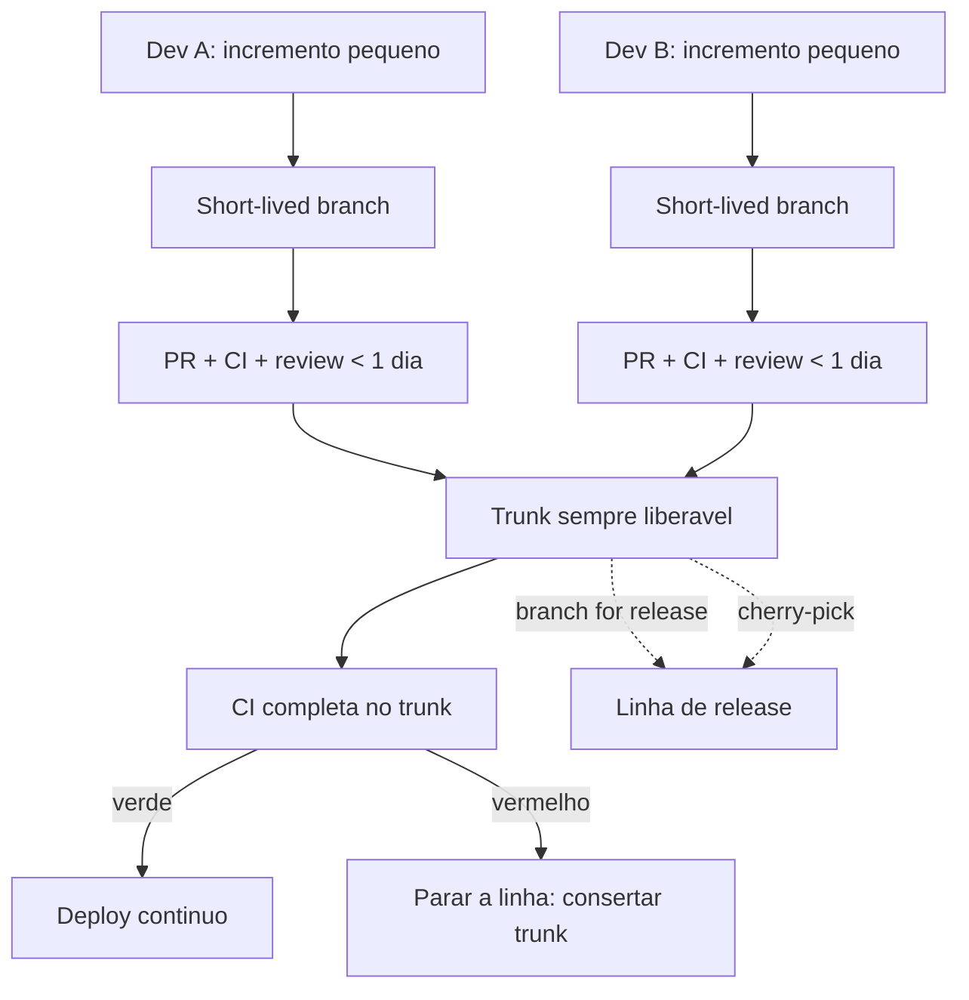

# Trunk-Based Development e seu impacto arquitetural

> **Bloco:** Evolução e práticas · **Nível:** Intermediário/Avançado · **Tempo de leitura:** ~22 min

## TL;DR

**Trunk-Based Development (TBD)** é uma prática de controle de versão na qual todos os desenvolvedores integram seu trabalho em uma única linha compartilhada (o **trunk**, `main`/`master`) com altíssima frequência — pelo menos uma vez por dia, idealmente várias —, evitando branches de longa duração. Branches, quando existem, são *short-lived* (vida inferior a um dia) e servem apenas para revisão e checagem de CI antes de fundir no trunk. O trunk deve permanecer **sempre liberável**.

TBD é o **pré-requisito real do Continuous Integration**: a definição clássica de CI (Grady Booch, depois Kent Beck/XP) exige que todos integrem no trunk ao menos diariamente — algo impossível com feature branches de semanas. **Paul Hammant** mantém o site de referência trunkbaseddevelopment.com e cataloga os estilos (commit direto ao trunk para times pequenos; *short-lived feature branches* para times maiores). A pesquisa **DORA**, sintetizada em *Accelerate* (Forsgren, Humble, Kim, 2018), identifica TBD — operacionalizado como "menos de três branches ativos" e "branches com vida inferior a um dia" — como um dos preditores estatísticos de **alta performance de entrega** (deploy frequency, lead time, change failure rate, MTTR).

O impacto **arquitetural** é o ponto frequentemente esquecido: TBD não é apenas uma escolha de Git. Para integrar trabalho incompleto continuamente sem quebrar o trunk, você é *forçado* a adotar técnicas que moldam a arquitetura — **feature toggles**, **branch by abstraction**, **Parallel Change** (expand/contract para mudanças de banco e API), modularização que permita mudanças localizadas, e contratos versionados. TBD recompensa baixo acoplamento e pune fortemente arquiteturas que exigem mudanças coordenadas amplas (*big bang*).

## O problema que resolve

O modelo dominante por anos foi o **GitFlow** (Vincent Driessen, 2010) e variantes baseadas em feature branches de longa duração: cada feature vive isolada em seu branch por dias ou semanas, e a integração acontece tarde, num merge final. O resultado é o **merge hell**: quanto mais um branch diverge do trunk, mais doloroso, demorado e arriscado é o merge — e mais bugs de integração surgem precisamente quando há menos tempo para corrigi-los. Pior: enquanto o branch vive isolado, o trabalho nele é *invisível* ao resto do time e à CI, escondendo conflitos semânticos (não apenas textuais) que só explodem na integração.

A prática de **Continuous Integration**, originalmente descrita por Grady Booch e codificada por Kent Beck no Extreme Programming, sempre teve um requisito central que muita gente ignora: *integrar no mainline ao menos uma vez por dia*. Ter um servidor de CI rodando testes em feature branches **não é** Continuous Integration — é "continuous building of isolated branches". CI de verdade significa que todos convergem no trunk diariamente, e é exatamente isso que feature branches longos impossibilitam. Martin Fowler é enfático sobre essa distinção em seu artigo sobre CI e em *FeatureBranch* vs. *ContinuousIntegration*.

**Paul Hammant** dedicou mais de duas décadas a documentar e ensinar TBD como a forma de trabalho que realmente habilita CI/CD, mantendo trunkbaseddevelopment.com. A pesquisa **DORA** fechou o argumento empírico: em *Accelerate*, a análise de dezenas de milhares de respostas mostra que práticas de TBD predizem performance de entrega superior. O problema que TBD resolve, portanto, é **eliminar o atraso de integração** — colapsar a distância entre escrever código e integrá-lo, transformando a integração de um evento doloroso e arriscado em um não-evento contínuo.

## O que é (definição aprofundada)

**Trunk:** a linha principal de desenvolvimento compartilhada (`main`). É a única fonte da verdade do estado integrado do sistema, e deve estar **sempre em estado liberável** — todo commit no trunk deveria poder, em princípio, ir para produção.

**Estilos de TBD (taxonomia de Hammant):**

- **Commit direto ao trunk:** apropriado para times pequenos e maduros. Cada dev faz pull, integra localmente, roda testes e empurra ao trunk várias vezes ao dia. Não há branches.
- **Short-lived feature branches:** para times maiores ou onde se exige *code review* e *CI gate* antes da fusão. O branch vive *menos de um dia* (idealmente algumas horas), com um único autor ou par, existe apenas para o PR/review e a checagem automatizada, e é fundido e deletado imediatamente. A chave é a **vida curta**: o branch não é uma feature inteira, é um passo pequeno e integrável.

**Release lines (linhas de release):** TBD não proíbe branches de release. Para versionar releases, cria-se um branch a partir do trunk no momento do release (*branch for release*), e correções urgentes são feitas no trunk e *cherry-picked* para a linha de release — nunca o contrário. Isso mantém o trunk como fonte da verdade.

**Diferença crucial vs. GitFlow:** GitFlow tem múltiplas linhas de longa duração (`develop`, `feature/*`, `release/*`, `hotfix/*`) e integração tardia. TBD tem uma linha de longa duração (o trunk) e integração contínua. GitFlow otimiza para releases versionados infrequentes (bibliotecas, software empacotado); TBD otimiza para entrega contínua (SaaS, serviços).

**Requisitos de habilitação:** TBD só funciona com uma rede de segurança forte: suíte de testes automatizados rápida e confiável, CI que **previne a quebra do trunk** (verifica antes do merge), e — arquiteturalmente — técnicas para integrar trabalho incompleto: **feature toggles** (esconder o que não está pronto), **branch by abstraction** (mudanças grandes em passos pequenos no código), e **Parallel Change / expand-contract** (mudanças de schema e API sem quebra).

## Como funciona

O fluxo de trabalho diário de um time em TBD com short-lived branches:

1. **Pull do trunk** no início de cada pequena unidade de trabalho.
2. **Trabalhar em incrementos pequenos** — não uma feature inteira, mas um passo coeso e integrável (algumas horas de trabalho). Se a mudança é grande, ela é *decomposta* em passos que mantêm o trunk funcionando, usando branch by abstraction e feature toggles.
3. **Branch curto + PR**: cria-se um branch, abre-se o PR, a **CI roda na proposta** (testes, lint, build) e um revisor humano aprova. Tanto a aprovação humana quanto a verificação de máquina ocorrem *antes* do código entrar no trunk.
4. **Merge e delete** assim que aprovado — no mesmo dia. O branch desaparece.
5. **CI no trunk**: após o merge, a pipeline completa roda no trunk; se quebrar, "parar a linha" (consertar o trunk é prioridade máxima do time).
6. **Trabalho incompleto fica escondido por toggle**, não por branch. O código está no trunk, integrado e testado, mas a feature está desligada até estar pronta.

A disciplina central: **manter o trunk sempre verde e liberável**. Times de alta performance configuram a CI para *impedir* a quebra do trunk (gates de pré-merge) em vez de detectar a quebra depois.

O ciclo de vida de uma mudança grande (que não cabe num passo) é o ponto onde TBD encontra a arquitetura: você usa **Parallel Change** — expandir (adicionar o novo sem remover o velho), migrar (mover consumidores incrementalmente), contrair (remover o velho) — para que cada commit individual no trunk seja seguro e liberável, mesmo que a mudança completa leve semanas.

## Diagrama de fluxo

O diagrama mostra múltiplos desenvolvedores integrando incrementos pequenos via branches de vida curta, cada um passando por CI e review antes de entrar no trunk; o trunk permanece sempre liberável e alimenta deploy contínuo, com linhas de release derivadas dele e correções fluindo do trunk para a release via cherry-pick (nunca o contrário).

## Exemplo prático / caso real

Um time de plataforma de uma fintech brasileira mantém o serviço de **autorização de transações** (Java, deploy várias vezes ao dia em produção). Eles operam em TBD com short-lived branches. Precisam fazer uma mudança grande: **trocar o algoritmo de scoring antifraude**, uma reescrita de semanas. Fazê-la num feature branch de três semanas seria suicídio — o serviço evolui diariamente, e o merge final seria catastrófico.

**Como fazem em TBD:**

1. **Branch by abstraction:** introduzem a interface `MotorScore`, e o código de autorização passa a chamá-la. A implementação atual vira `MotorScoreV1`. Commit no trunk, deploy — nada muda em produção. Trunk segue verde.
2. **Nova implementação no trunk:** `MotorScoreV2` é desenvolvido em incrementos pequenos, cada um fundido no trunk no mesmo dia, sempre atrás de um **feature toggle** desligado (release toggle gerido via **Unleash**). O código novo está em produção há semanas, integrado e testado, mas inerte.
3. **Parallel Run:** com a V2 completa, liga-se um modo shadow: ambas calculam o score; a V1 decide (fonte da verdade), a V2 só registra para comparação. Divergências viram bugs corrigidos — sempre em passos pequenos no trunk.
4. **Canary via toggle:** validado, abre-se o toggle progressivamente (1% → 100% das transações usam a V2), com **kill switch** (Ops toggle) pronto para reverter em segundos sem deploy.
5. **Contração:** estável, removem-se o toggle, a `MotorScoreV1` e o aparato shadow — em commits pequenos no trunk.

**Mudança de schema sob TBD (Parallel Change / expand-contract):** quando a V2 precisa de uma nova coluna, eles **não** fazem um `ALTER TABLE` que quebra a V1. Expandem (adicionam a coluna nova, nullable), migram (o código passa a escrever em ambas, depois a ler da nova), contraem (removem a coluna velha) — cada passo um deploy independente e reversível, mantendo trunk e produção sempre consistentes.

**Impacto arquitetural observável:** o time percebe que módulos com alto acoplamento (onde uma mudança força tocar muitos lugares) são *dolorosos* sob TBD — branches que precisariam ficar mais de um dia. Isso vira pressão evolutiva: TBD **incentiva refatorar para baixo acoplamento e fronteiras claras**, porque só assim mudanças cabem em incrementos diários integráveis. A infraestrutura é provisionada via **Terraform** e entregue por **GitOps (ArgoCD)**, fechando o loop entre o commit no trunk e produção.

## Quando usar / Quando evitar

**Usar quando:**

- O alvo é **entrega contínua** de um serviço/SaaS — deploy frequente, uma versão "viva" em produção.
- O time tem (ou pode construir) uma **rede de segurança de testes** rápida e confiável e CI capaz de proteger o trunk.
- Há disposição para adotar as técnicas de habilitação (toggles, branch by abstraction, parallel change).
- Deseja-se a performance de entrega que a DORA correlaciona com TBD.

**Evitar (ou adaptar) quando:**

- O produto é **software versionado distribuído** (bibliotecas, apps desktop, firmware) com múltiplas versões suportadas simultaneamente em campo — GitFlow ou modelos com release branches longos podem fazer mais sentido.
- O time **não tem** suíte de testes confiável: TBD sem testes vira "integrar bugs continuamente no trunk". Aqui o pré-requisito é construir a rede de segurança *antes* de migrar para TBD.
- Contribuições externas não confiáveis (open source com muitos colaboradores) — fork-and-pull com revisão pesada pode ser necessário, embora o trunk dos mantenedores ainda possa ser TBD.

Trade-off central: TBD troca o **conforto do isolamento** (e seu custo escondido, o merge hell) pela **disciplina da integração contínua** (e seu custo explícito, manter o trunk sempre verde). Exige maturidade de testes e arquitetura desacoplada; recompensa com lead time baixo e baixa taxa de falha.

## Anti-padrões e armadilhas comuns

- **"CI" em feature branches longos.** Rodar testes num branch que vive semanas não é Continuous Integration — a integração de verdade segue adiada. É o equívoco mais comum.
- **Trunk vermelho tolerado.** Deixar o trunk quebrado "para consertar depois" destrói o invariante fundamental (trunk sempre liberável) e bloqueia todo o time. A cultura precisa tratar trunk quebrado como emergência ("parar a linha").
- **TBD sem testes automatizados.** Sem rede de segurança, integrar continuamente significa propagar bugs continuamente. Testes confiáveis e rápidos são pré-requisito não-negociável.
- **Feature toggles que viram dívida.** TBD aumenta o uso de release toggles; se não forem removidos após a liberação, acumulam dívida e explosão combinatória de estados (ver Pete Hodgson).
- **Branches "short-lived" que esticam.** Um branch que deveria durar horas e dura uma semana é GitFlow disfarçado. Disciplina de decompor o trabalho é essencial.
- **Ignorar o impacto arquitetural.** Adotar TBD numa arquitetura de alto acoplamento sem investir em modularização gera atrito constante — mudanças não cabem em incrementos pequenos. TBD e arquitetura evoluem juntos.

## Relação com outros conceitos

- **Continuous Integration / Continuous Delivery:** TBD é a prática de versionamento que *habilita* CI de verdade (integração diária no trunk) e, por extensão, CD. Não há CI sério com feature branches longos.
- **Branch by Abstraction:** a técnica que Paul Hammant cunhou *justamente* para defender TBD — permite mudanças grandes sem branches longos, mantendo o trunk liberável.
- **Feature Toggles (Pete Hodgson):** o mecanismo para esconder trabalho incompleto integrado no trunk; substitui o isolamento do feature branch pelo isolamento em runtime, desacoplando deploy de release.
- **Parallel Change (expand/contract):** o padrão que permite mudanças de schema e API sob TBD, mantendo cada commit seguro e reversível.
- **DORA / Accelerate:** a evidência empírica de que TBD prediz alta performance de entrega; conecta a prática a métricas de negócio (lead time, deploy frequency, MTTR, change failure rate).
- **Arquitetura evolutiva / baixo acoplamento:** TBD exerce pressão seletiva por fronteiras claras e baixo acoplamento, porque só arquiteturas modulares permitem que mudanças caibam em incrementos diários integráveis. É um exemplo da Lei de Conway operando ao contrário: a prática de integração molda a arquitetura.

## Referências

- [Trunk Based Development — trunkbaseddevelopment.com (Paul Hammant)](https://trunkbaseddevelopment.com/)
- [What is Trunk-Based Development? — Paul Hammant's Blog](https://paulhammant.com/2013/04/05/what-is-trunk-based-development/)
- [bliki: Branch By Abstraction — Martin Fowler](https://martinfowler.com/bliki/BranchByAbstraction.html)
- [Make Large Scale Changes Incrementally with Branch By Abstraction — continuousdelivery.com (Jez Humble)](https://continuousdelivery.com/2011/05/make-large-scale-changes-incrementally-with-branch-by-abstraction/)
- [bliki: Parallel Change — Martin Fowler](https://martinfowler.com/bliki/ParallelChange.html)
- [Feature Toggles (aka Feature Flags) — Pete Hodgson em martinfowler.com](https://martinfowler.com/articles/feature-toggles.html)
- [Accelerate (livro) — Forsgren, Humble, Kim](https://itrevolution.com/product/accelerate/)
