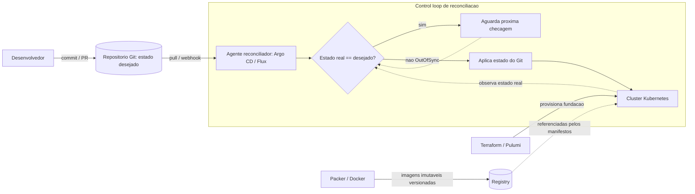

# GitOps, Infrastructure as Code e Immutable Infrastructure

> **Bloco:** Evolução e práticas · **Nível:** Intermediário/Avançado · **Tempo de leitura:** ~24 min

## TL;DR

Estes três conceitos formam a base operacional da entrega moderna de software em nuvem, e se encaixam em camadas:

**Infrastructure as Code (IaC)** é a prática de definir e provisionar infraestrutura (redes, VMs, clusters, bancos, DNS) por meio de **arquivos de configuração versionados** em vez de cliques manuais em consoles. Ferramentas: **Terraform** (HCL, modelo declarativo com state), **Pulumi** (linguagens de propósito geral — TypeScript, Python, Go), **OpenTofu** (fork open-source do Terraform), CloudFormation. IaC torna a infraestrutura **reproduzível, revisável e auditável**.

**Immutable Infrastructure** é o princípio de que, uma vez provisionado, um servidor/artefato **nunca é modificado** — para mudar, você substitui por uma instância nova construída do zero a partir de uma imagem versionada. **Martin Fowler** descreve os padrões correlatos *Immutable Server* e *Phoenix Server*. Ferramentas: **Packer** (constrói imagens/AMIs imutáveis), containers/imagens Docker. Elimina o *configuration drift* e os "snowflake servers".

**GitOps** é um modelo operacional onde o **Git é a única fonte da verdade** do estado desejado do sistema, e um **agente reconciliador** observa continuamente o estado real do cluster e o converge para o estado declarado no Git. Cunhado pela **Weaveworks** em 2017, formalizado pelo projeto **OpenGitOps** (CNCF) em **quatro princípios**: declarativo, versionado e imutável, *pulled* automaticamente, continuamente reconciliado. Ferramentas: **Argo CD** e **Flux**. GitOps é, em essência, IaC + Immutable Infrastructure + um *control loop* de reconciliação dirigido por Git.

## O problema que resolve

O problema histórico da operação de infraestrutura é o **configuration drift** e os **snowflake servers**: servidores configurados manualmente ao longo do tempo, cada um único e impossível de reproduzir, cuja configuração real diverge silenciosamente de qualquer documentação. Quando um snowflake morre, ninguém sabe recriá-lo exatamente — o conhecimento se evaporou em ajustes manuais esquecidos. Operações manuais também são não-auditáveis, propensas a erro e impossíveis de revisar antes de aplicar.

**IaC** ataca a reprodutibilidade: se a infraestrutura é código versionado, ela pode ser recriada identicamente, revisada em PR, testada e auditada — tratada com o mesmo rigor de engenharia que o software de aplicação.

**Immutable Infrastructure** ataca o drift na raiz. **Martin Fowler** descreve o *Immutable Server* (2013) como "a conclusão lógica de aplicar gestão de configuração automatizada a servidores": uma vez implantado, o servidor nunca é modificado, apenas substituído por uma instância nova e atualizada. O padrão complementar *Phoenix Server* (2012) propõe destruir e reconstruir servidores rotineiramente a partir de uma imagem base — "renascendo das cinzas" — de modo que 100% dos elementos do servidor voltem a um estado conhecido sem manter especificações detalhadas de configuração. O foco da gestão de configuração migra do servidor rodando para a **imagem base** (construída com ferramentas como Packer). Isso vinha de práticas da Netflix, Google e Thoughtworks por volta de 2012.

**GitOps** ataca o problema de *operar* essa infraestrutura declarativa de forma confiável e auditável. A **Weaveworks** cunhou o termo em 2017 (Alexis Richardson e equipe) ao operar Kubernetes: em vez de rodar `kubectl apply` manualmente (push imperativo), eles colocaram o estado desejado no Git e construíram um operador (o **Flux**, primeiro operador GitOps open-source) que *puxa* esse estado e reconcilia o cluster continuamente. Argo CD surgiu logo depois. Em 2021, o **OpenGitOps**, working group sob a CNCF (com Amazon, Microsoft, GitHub, Red Hat, Codefresh, Weaveworks), publicou os quatro princípios para dar uma definição neutra e interoperável. O problema que GitOps resolve: tornar deploys e mudanças de infraestrutura **declarativos, auditáveis (todo estado é um commit), reversíveis (git revert), e auto-corretivos** (drift é detectado e revertido pelo reconciliador).

## O que é (definição aprofundada)

### Infrastructure as Code

Dois paradigmas:

- **Declarativo (Terraform/OpenTofu, CloudFormation):** você descreve o *estado desejado* ("quero 3 instâncias, esta VPC, este cluster"), e a ferramenta calcula o *diff* entre o estado atual (rastreado num **state file**) e o desejado, aplicando apenas as mudanças necessárias (*plan* → *apply*). O **Terraform** usa HCL e tem o maior ecossistema de providers (3000+). O **state** é peça crítica e delicada: é a representação que o Terraform tem do mundo real; precisa ser armazenado remotamente com locking.
- **Imperativo/programático com resultado declarativo (Pulumi):** você escreve em linguagem de propósito geral (TypeScript, Python, Go, C#), ganhando loops, condicionais, abstrações, testes unitários e ferramentas de IDE — mas o modelo de execução ainda converge para um estado desejado. Pulumi também mantém state.

Princípios-chave: **idempotência** (aplicar a mesma config N vezes leva ao mesmo estado), **versionamento** (a infra vive no Git, com histórico e PRs), e **plano antes de aplicar** (revisar o diff antes de mudar produção).

### Immutable Infrastructure

- **Immutable Server:** servidor que, após implantado, nunca recebe mudança em runtime. Patches, upgrades e mudanças de config produzem uma **nova imagem**, e a instância antiga é descartada e substituída.
- **Phoenix Server:** servidores destruídos e reconstruídos frequentemente a partir da imagem base, garantindo estado conhecido.
- **Imagem como artefato versionado:** **Packer** "assa" (*bakes*) uma imagem (AMI, imagem de container, OVA) já com tudo configurado; essa imagem é imutável e versionada. Containers Docker são a expressão mais difundida desse princípio.
- **Snowflake vs. Phoenix:** o snowflake é o anti-padrão (servidor único, mutável, irreproduzível); o phoenix é o ideal (efêmero, reconstruível, idêntico).

Benefícios: elimina drift, simplifica rollback (volte para a imagem anterior), torna *scaling* trivial (suba mais cópias idênticas), e torna a infra previsível.

### GitOps

Os **quatro princípios do OpenGitOps**:

1. **Declarativo:** o estado desejado é expresso declarativamente (manifestos Kubernetes, Helm, Kustomize).
2. **Versionado e imutável:** o estado desejado é armazenado de forma versionada e imutável, com histórico completo (Git).
3. **Pulled automaticamente:** agentes de software *puxam* automaticamente as declarações de estado da fonte (em vez de um pipeline *empurrar* via push).
4. **Continuamente reconciliado:** agentes observam continuamente o estado real e tentam aplicar o estado desejado, corrigindo desvios.

A distinção **pull vs. push** é central. No modelo push tradicional (CI roda `kubectl apply`), a pipeline tem credenciais do cluster e empurra mudanças — superfície de ataque maior, drift não detectado. No modelo **pull do GitOps**, o agente (**Argo CD** ou **Flux**) roda *dentro* do cluster, observa o Git, e puxa/aplica — credenciais ficam no cluster, e o reconciliador detecta e corrige drift automaticamente.

**Argo CD** é um controlador Kubernetes que monitora apps e compara o estado *live* com o *target* no Git, com forte UI. **Flux** (CNCF graduated) é construído como um conjunto de controladores compostos — o *GitOps Toolkit* (source-controller, kustomize-controller, helm-controller, notification-controller, image-automation) — sem UI própria, mais orientado a composição.

## Como funciona

O coração do GitOps é um **control loop de reconciliação**, conceitualmente idêntico ao loop de controle do próprio Kubernetes:

1. O desenvolvedor faz um **commit/PR** no repositório Git que contém os manifestos declarativos do estado desejado (ex.: `deployment.yaml` com `image: app:v2.3`).
2. O **agente reconciliador** (Argo CD/Flux), rodando no cluster, **observa** o repositório Git (poll ou webhook).
3. O agente **compara** o estado desejado (Git) com o estado real (cluster).
4. Havendo divergência (*OutOfSync*), o agente **aplica** o estado do Git ao cluster — puxando as imagens imutáveis, criando/atualizando recursos.
5. O loop **repete continuamente**: se alguém alterar o cluster manualmente (drift), o agente detecta e **reverte** ao estado do Git automaticamente (self-healing).

**Rollback** vira `git revert` + reconciliação. **Auditoria** é o `git log`. **Aprovação** é o PR review. **Disaster recovery** é apontar o agente para o Git e deixá-lo reconstruir tudo.

A integração das três camadas em produção:

- **IaC (Terraform/Pulumi)** provisiona a camada de fundação: VPCs, o cluster Kubernetes em si, IAM, bancos gerenciados — o que está *abaixo* ou *fora* do cluster.
- **Immutable Infrastructure (Packer/containers)** produz os artefatos imutáveis versionados que serão implantados.
- **GitOps (Argo CD/Flux)** opera o que roda *dentro* do cluster, reconciliando os manifestos que referenciam essas imagens imutáveis.

Há sobreposição e debate de fronteira (alguns usam GitOps também para IaC, via operadores de Terraform como o Crossplane ou o tf-controller do Flux), mas o padrão mais comum trata IaC como a fundação e GitOps como a operação de workloads.

## Diagrama de fluxo



O diagrama mostra o loop GitOps central: commit no Git, o agente puxa e compara o estado real do cluster com o desejado, e reconcilia quando divergem — corrigindo drift continuamente. Em paralelo, Packer/Docker produzem as imagens imutáveis referenciadas pelos manifestos, e Terraform/Pulumi provisionam a fundação onde o cluster roda.

## Exemplo prático / caso real

Uma fintech brasileira migrou seu e-commerce de pagamentos para Kubernetes na AWS e adotou as três camadas:

**IaC com Terraform.** A fundação — VPC, subnets, o cluster EKS, RDS PostgreSQL, IAM roles, Route 53 — é definida em módulos Terraform versionados. O state fica em S3 com locking em DynamoDB. Toda mudança de infraestrutura passa por PR, `terraform plan` automatizado na CI (mostrando o diff em produção), review e `apply`. Quando precisaram replicar o ambiente para uma região de DR, foi `terraform apply` com outra variável de região — reprodutibilidade que seria impossível com cliques no console.

**Immutable Infrastructure com Packer e containers.** Os serviços são empacotados em imagens Docker imutáveis, versionadas por tag de commit (`pagamentos:a3f9c1`). Para os poucos componentes que ainda rodam em EC2 (um gateway legado), o **Packer** assa AMIs imutáveis; uma mudança nunca é um SSH no servidor, mas uma nova AMI e substituição da instância (Phoenix Server). Drift deixou de existir: não há configuração manual a divergir.

**GitOps com Argo CD.** Um repositório Git contém todos os manifestos Kubernetes (Helm + Kustomize) que descrevem o estado desejado de cada serviço. O **Argo CD**, rodando no cluster, observa esse repo. Para fazer deploy da versão `a3f9c1` do serviço de pagamentos, um engenheiro abre um PR mudando a tag da imagem no manifesto; após aprovação e merge, o Argo CD detecta o *OutOfSync*, puxa a nova imagem imutável e reconcilia o cluster. Um rollback emergencial é um `git revert`. Quando um operador, em uma madrugada de incidente, alterou manualmente o número de réplicas via `kubectl scale`, o Argo CD detectou o drift e **reverteu automaticamente** ao valor do Git — o que gerou uma lição: mudanças emergenciais legítimas também precisam passar pelo Git, ou pelo desligamento temporário do auto-sync.

Para promover entre ambientes, usam o padrão de **repositórios/diretórios por ambiente** (dev, staging, prod), promovendo uma versão via PR que copia a tag de um ambiente ao próximo. A plataforma interna expõe isso via **Backstage**, onde os times disparam deploys sem tocar diretamente nos manifestos.

Pseudocódigo conceitual do reconciliador (ilustrativo):

```
loop forever:
    desejado = git.fetch(repo, path)        # estado declarado
    real     = cluster.observe(namespace)   # estado live
    if diff(desejado, real) != empty:
        cluster.apply(desejado)             # converge para o Git
    sleep(interval)
```

## Quando usar / Quando evitar

**Usar quando:**

- A plataforma-alvo é **Kubernetes** (onde GitOps brilha, pelo modelo declarativo nativo e o control loop).
- Deseja-se **auditabilidade total** (todo estado é um commit), **reversibilidade trivial** (git revert) e **self-healing** contra drift.
- A organização já trata infraestrutura como código e quer fechar o loop de operação.
- Há requisitos de compliance/segurança que se beneficiam do modelo pull (credenciais no cluster, não na CI).

**Evitar (ou adaptar) quando:**

- A infraestrutura é majoritariamente **não-Kubernetes** e não-declarativa — GitOps puro depende de um reconciliador; fora do K8s ele é menos maduro (embora existam abordagens, ver INNOQ "GitOps without Kubernetes").
- O time é **pequeno** e o overhead de Git + reconciliador + repositórios por ambiente supera o ganho — para um único app simples, pode ser cerimônia demais.
- Estado mutável legítimo é grande (bancos, dados) — GitOps gerencia bem *configuração declarativa*, não dados mutáveis; migrações de schema exigem cuidado fora do loop.
- A cultura ainda depende de operações manuais frequentes: GitOps com auto-sync brigará com elas até a disciplina mudar.

Trade-offs: IaC troca conveniência de cliques por disciplina de código (e a complexidade do state). Immutable Infrastructure troca a facilidade de "só dar um SSH e ajustar" pela necessidade de reconstruir imagens (e tempo de build), ganhando previsibilidade. GitOps troca o controle imperativo direto pela indireção do Git + reconciliador, ganhando auditoria, reversibilidade e self-healing.

## Anti-padrões e armadilhas comuns

- **GitOps em push disfarçado.** Usar CI para `kubectl apply` e chamar de GitOps. Sem o agente pull e o loop de reconciliação contínua, você não tem detecção de drift nem self-healing — é só CD imperativo com YAML no Git.
- **Drift por mudanças manuais.** Editar o cluster com `kubectl` em produção quebra a premissa do GitOps; ou o reconciliador reverte (frustrando o operador) ou, se auto-sync está off, o drift persiste. Disciplina: tudo pelo Git.
- **Secrets em texto plano no Git.** O princípio "tudo no Git" tropeça em segredos. Mitigação: Sealed Secrets, SOPS, External Secrets Operator — nunca segredos crus no repo.
- **State do Terraform mal gerido.** State local, sem locking, compartilhado por cliques manuais — receita para corrupção e drift. Use backend remoto com locking; nunca edite o state à mão.
- **Snowflake escondido.** Aplicar IaC mas ainda fazer "só um ajuste manual" recria o snowflake e o drift que IaC deveria eliminar. Imutabilidade exige disciplina: mudança = nova imagem/aplicação, nunca edição em runtime.
- **Imagens mutáveis (`latest`).** Usar tag `latest` quebra a imutabilidade e a reprodutibilidade — você não sabe o que está rodando. Sempre tag versionada/imutável.
- **Repositórios por ambiente sem governança.** Promoção entre ambientes via copy-paste manual de tags gera divergência; precisa de processo (PR, automação de promoção).

## Relação com outros conceitos

- **GitOps ↔ Immutable Infrastructure ↔ IaC:** as três camadas se compõem. IaC provisiona a fundação; Immutable Infrastructure produz os artefatos versionados; GitOps opera os workloads reconciliando o Git. GitOps é, em larga medida, a aplicação dos princípios de imutabilidade e declaratividade ao *runtime* operacional.
- **Continuous Delivery / Trunk-Based Development:** GitOps é a forma moderna de CD; o estado em Git e a reconciliação se encaixam naturalmente com TBD (todo deploy é um commit no trunk de manifestos).
- **Platform Engineering / IDP:** GitOps e IaC são tipicamente *encapsulados* por uma Internal Developer Platform (ex.: Backstage), que oferece self-service sobre eles sem expor a complexidade aos times de produto.
- **Control loop / Kubernetes:** o loop de reconciliação do GitOps é o mesmo padrão de controlador do Kubernetes, estendido para abranger o Git como fonte da verdade.
- **Error budgets / SRE:** GitOps facilita rollback rápido (git revert), o que ajuda a manter MTTR baixo e a gastar o error budget de forma controlada.
- **Security / least privilege:** o modelo pull reduz a superfície de ataque (credenciais no cluster, não na CI) e torna toda mudança auditável e atribuível a um commit.

## Referências

- [OpenGitOps — Princípios e definição (opengitops.dev)](https://opengitops.dev/)
- [OpenGitOps — Sobre / GitOps Working Group (CNCF)](https://opengitops.dev/about/)
- [Argo CD — Declarative GitOps CD for Kubernetes (docs)](https://argo-cd.readthedocs.io/en/stable/)
- [Flux — Documentação e GitOps Toolkit (fluxcd.io)](https://fluxcd.io/flux/)
- [Terraform — Documentação oficial (HashiCorp)](https://developer.hashicorp.com/terraform/docs)
- [Pulumi — Documentação oficial (Infrastructure as Code)](https://www.pulumi.com/docs/iac/)
- [bliki: Immutable Server — Martin Fowler](https://martinfowler.com/bliki/ImmutableServer.html)
- [bliki: Phoenix Server — Martin Fowler](https://martinfowler.com/bliki/PhoenixServer.html)
- [GitOps — what you need to know (Weaveworks)](https://www.weave.works/technologies/gitops/)
