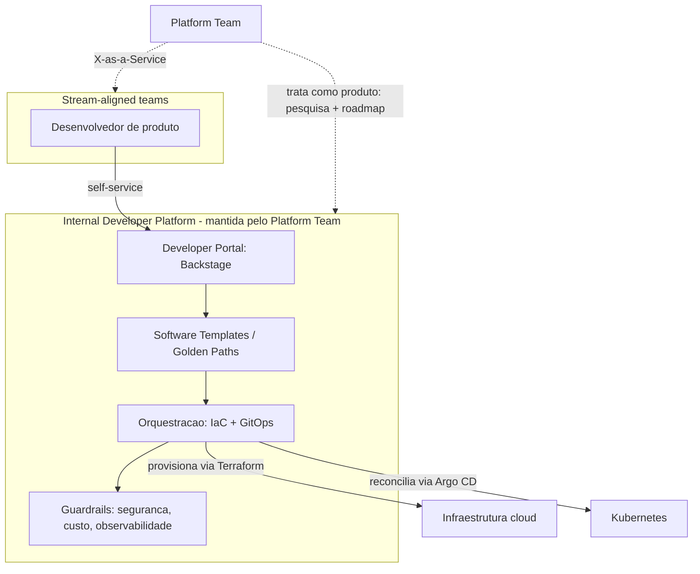

# Platform Engineering e Internal Developer Platforms

> **Bloco:** Evolução e práticas · **Nível:** Intermediário/Avançado · **Tempo de leitura:** ~23 min

## TL;DR

**Platform Engineering** é a disciplina de construir e operar uma **plataforma interna como produto** (a *Internal Developer Platform*, IDP) que oferece aos times de produto **caminhos pavimentados** (*golden paths*) e **self-service**, reduzindo a carga cognitiva e a coordenação necessárias para entregar software com segurança. Surge como resposta ao excesso do "you build it, you run it" levado ao pé da letra: à medida que microsserviços, Kubernetes, IaC e observabilidade proliferaram, cada time de produto passou a precisar dominar uma stack operacional vasta — carga cognitiva insustentável.

Uma **Internal Developer Platform (IDP)**, conforme definido em internaldeveloperplatform.org, é construída e fornecida *como produto* por um **time de plataforma** aos desenvolvedores de aplicação, "colando" tecnologias e ferramentas em *golden paths* que reduzem carga cognitiva e habilitam self-service — sem abstrair completamente o contexto e as tecnologias subjacentes. O **portal do desenvolvedor** (ex.: **Backstage**, do Spotify) é frequentemente a face visível da IDP, mas não é a IDP inteira.

O fundamento organizacional vem de **Team Topologies** (Matthew Skelton e Manuel Pais, 2019): o **platform team** existe para que **stream-aligned teams** entreguem features mais rápido, com menos coordenação, consumindo a plataforma via **X-as-a-Service**. A pesquisa **DORA** incorporou capacidades de plataforma como preditoras de performance. O anti-padrão central: tratar a plataforma como projeto/torre de marfim em vez de **produto** com clientes (os devs), gerando uma plataforma que ninguém quer usar — ou impor "você constrói, você opera" sem dar a plataforma que torne isso viável.

## O problema que resolve

A primeira onda de DevOps trouxe o mantra **"you build it, you run it"** (Werner Vogels, Amazon, 2006): o time que constrói um serviço também o opera, alinhando incentivos e acelerando feedback. Funcionou — mas escalou mal. Ao longo dos anos 2010, a stack operacional explodiu: Kubernetes, service mesh, IaC (Terraform), GitOps, observabilidade (tracing distribuído, métricas, logs), CI/CD, gestão de secrets, políticas de segurança, multi-cloud. Pedir que *cada* time de produto domine tudo isso, *além* do domínio de negócio, é impor uma **carga cognitiva** esmagadora. O resultado: times reinventando soluções inconsistentes, padrões de segurança aplicados de forma desigual, e velocidade de entrega caindo sob o peso operacional.

**Team Topologies** (Skelton & Pais, IT Revolution, 2019) deu o vocabulário e o modelo. Os autores definem quatro tipos fundamentais de time: **stream-aligned** (alinhado a um fluxo de valor — um produto, serviço ou jornada de usuário), **platform** (que fornece serviços/ferramentas para os stream-aligned entregarem mais rápido com menos coordenação), **enabling** (especialistas que preenchem lacunas de capacidade temporariamente) e **complicated-subsystem** (expertise profunda em um subsistema complexo). O insight central: a missão do platform team é **reduzir a carga cognitiva** dos stream-aligned teams, oferecendo a plataforma via **X-as-a-Service** (a plataforma é consumida como um serviço autoatendível, com contratos claros). E, crucialmente, a plataforma deve ser **tratada como produto** ("Platform as a Product"), com gestão de produto, pesquisa com usuários e loops de feedback — não como um projeto de infraestrutura jogado por cima do muro.

**Thoughtworks** ("platform as a product"), **internaldeveloperplatform.org** e a comunidade de **platformengineering.org** consolidaram a disciplina. A pesquisa **DORA** (em relatórios recentes do State of DevOps e em dora.dev) passou a investigar o impacto de capacidades de plataforma e de developer experience na performance de entrega. O problema que Platform Engineering resolve, portanto: **escalar boas práticas operacionais por toda a engenharia sem afogar cada time em carga cognitiva**, oferecendo abstrações de self-service que padronizam por design.

## O que é (definição aprofundada)

**Internal Developer Platform (IDP):** o produto construído pelo platform team. Não é uma ferramenta única, mas a **integração curada** de muitas tecnologias (Kubernetes, IaC, CI/CD, observabilidade, secrets) em uma experiência coesa que reduz carga cognitiva *sem* esconder por completo o contexto subjacente. Componentes conceituais comuns de uma IDP (taxonomia influenciada por Humanitec/internaldeveloperplatform.org):

- **Application Configuration Management:** gestão declarativa e dinâmica da configuração de cada aplicação por ambiente.
- **Infrastructure Orchestration:** provisionamento da infraestrutura sob demanda (frequentemente via IaC e GitOps por baixo).
- **Environment Management:** criação de ambientes (dev, staging, prod, ephemeral) de forma autoatendível.
- **Deployment Management:** pipelines de deploy padronizados (canary, blue-green).
- **Role-Based Access Control:** permissões e políticas.

**Golden Paths (caminhos pavimentados):** o conceito-chave. Um golden path é uma rota *opinionada, suportada e bem-documentada* para fazer algo comum (criar um novo serviço, adicionar um banco, expor uma API) — que já vem com os padrões corretos de segurança, observabilidade e CI/CD embutidos. Não é uma camisa de força (times podem sair do caminho se necessário, "paved road, not a cage"), mas é o caminho de menor resistência, que torna fazer a coisa certa também a coisa fácil.

**Developer Portal / Service Catalog (ex.: Backstage):** a interface visível. **Backstage**, criado pelo Spotify e open-sourced em 2020 (hoje na CNCF), oferece um **Software Catalog** (descoberta de serviços e metadados), **Software Templates** (scaffolding de novos projetos com os padrões da empresa) e **TechDocs** (documentação "docs-like-code"). É importante notar que **Backstage não é, por si só, uma IDP completa** — é um portal que dá uma fachada à IDP; falta-lhe a orquestração operacional que os componentes acima exigem. Portal e plataforma são camadas distintas que frequentemente se confundem.

**Self-service:** o objetivo operacional. O desenvolvedor consegue, sozinho e em minutos, fazer o que antes exigia um ticket para o time de infra e dias de espera — criar um serviço, um ambiente, um banco — dentro dos guardrails da plataforma.

**Carga cognitiva (cognitive load):** o conceito de Team Topologies que mede o quanto um time precisa manter na cabeça. A plataforma existe para baixar a carga *extrínseca* (acidental, da stack operacional) e liberar capacidade para a carga *intrínseca* (o domínio de negócio).

## Como funciona

A mecânica de Platform Engineering opera em duas dimensões: **organizacional** e **técnica**.

**Organizacional (Team Topologies):**

1. O **platform team** descobre as necessidades recorrentes dos **stream-aligned teams** (pesquisa com usuários — os próprios devs).
2. Constrói golden paths e capacidades de self-service que atendem essas necessidades, tratando a plataforma como produto (roadmap, métricas de adoção, feedback contínuo).
3. Oferece a plataforma via **X-as-a-Service**: os times consomem via APIs, portais e templates, com contratos claros e sem precisar coordenar com o platform team a cada uso.
4. Onde há lacuna de capacidade, um **enabling team** ajuda temporariamente os stream-aligned a adotarem a plataforma — e depois se retira.

**Técnica (a IDP por baixo):**

1. O desenvolvedor usa o **portal** (ex.: Backstage) ou uma CLI/API para uma ação (ex.: "criar serviço a partir do template Go").
2. O **Software Template** faz o scaffolding: cria o repo, a pipeline de CI/CD, os manifestos Kubernetes, a configuração de observabilidade — tudo já com os padrões da empresa.
3. Por baixo, a plataforma aciona **IaC (Terraform/Pulumi)** para provisionar infraestrutura e **GitOps (Argo CD/Flux)** para operar os workloads — mas o desenvolvedor não vê essa complexidade; vê a abstração de self-service.
4. Guardrails (políticas de segurança, custo, compliance) são aplicados *por design* no golden path, não como gates manuais depois.

O princípio que costura tudo: **fazer a coisa certa ser a coisa fácil**. Se o caminho seguro e padronizado é o de menor atrito, os times o seguem naturalmente, e a padronização emerge sem imposição.

## Diagrama de fluxo



O diagrama mostra o stream-aligned team consumindo a plataforma por self-service através do portal, que aciona templates/golden paths e a orquestração (IaC + GitOps) por baixo, com guardrails aplicados por design. O platform team mantém a IDP tratando-a como produto e a oferece via X-as-a-Service, escondendo a complexidade da infraestrutura subjacente.

## Exemplo prático / caso real

Uma fintech brasileira com 40 times de produto e 300 microsserviços enfrentava o esgotamento do "you build it, you run it": cada time reinventava pipelines, aplicava segurança de forma desigual, e levava semanas para subir um novo serviço. Criaram um **platform team** com mentalidade de produto.

**Golden path para novo serviço.** Construíram um **Software Template** no **Backstage**: um desenvolvedor escolhe "Novo serviço de pagamentos (Go)", preenche nome e dono, e em minutos tem um repositório criado com a estrutura padrão, pipeline de CI configurada (testes, scan de segurança, build de imagem imutável), manifestos Kubernetes, integração de observabilidade (tracing, métricas, logs) e um registro no **Software Catalog**. O que levava semanas e três tickets vira self-service de minutos.

**Orquestração escondida.** Por baixo, o template aciona **Terraform** (provisiona o namespace, o banco gerenciado, IAM) e registra os manifestos no repo GitOps que o **Argo CD** reconcilia. O desenvolvedor *não vê* Terraform nem Argo CD — vê a abstração "criar serviço". A carga cognitiva da stack operacional fica no platform team.

**Guardrails por design.** O golden path já embute as políticas: nenhuma imagem `latest`, secrets via External Secrets Operator, limites de recurso, dashboards de observabilidade pré-criados. Fazer a coisa certa é o caminho de menor atrito. Times *podem* sair do golden path (paved road, não jaula), mas aí assumem a operação daquele desvio — o que raramente compensa.

**Platform as a Product.** O platform team roda pesquisas trimestrais com os devs (NPS interno), mantém um roadmap visível, e mede **adoção** (% de serviços criados via golden path) e **time-to-first-deploy** de um novo serviço como métricas de sucesso da plataforma. Quando descobriram, por feedback, que o golden path de serviços de dados era fraco, priorizaram-no — porque a plataforma tem clientes, não usuários cativos.

**X-as-a-Service e Team Topologies.** Os stream-aligned teams consomem a plataforma autonomamente; o platform team raramente entra no fluxo de cada deploy. Um **enabling team** ajudou os primeiros cinco times a migrarem para o golden path e depois se dissolveu. A estrutura organizacional (quem é stream-aligned, quem é plataforma) foi desenhada conscientemente para refletir e moldar a arquitetura — Conway operando deliberadamente.

Pseudocódigo conceitual de um Software Template (ilustrativo):

```
template "servico-go":
  inputs: nome, dono, time
  steps:
    - criar_repo(nome, template=go-padrao)
    - configurar_ci(scan_seguranca=true, build_imagem_imutavel=true)
    - gerar_manifestos_k8s(observabilidade=true, limites=padrao)
    - registrar_no_catalogo(dono, time)
    - abrir_pr_gitops(namespace=nome)
```

## Quando usar / Quando evitar

**Usar quando:**

- A organização tem **escala** suficiente (muitos times de produto) para que a duplicação de esforço operacional e a inconsistência de padrões doam — tipicamente dezenas de times.
- A carga cognitiva operacional está claramente prejudicando a velocidade dos stream-aligned teams.
- Há comprometimento em tratar a plataforma **como produto** (com gestão, pesquisa de usuário, métricas de adoção) — sem isso, falha.
- Deseja-se padronizar segurança, observabilidade e CI/CD por design, em escala.

**Evitar (ou adiar) quando:**

- A organização é **pequena** (poucos times): o custo de manter um platform team e uma IDP supera o ganho; um conjunto compartilhado de scripts e convenções pode bastar.
- Não há apetite para mentalidade de produto: uma plataforma construída como torre de marfim, sem ouvir os devs, vira shelfware que ninguém adota e que os times contornam.
- A diversidade de stacks é tão grande e legítima que golden paths se multiplicam sem convergência — antes vale reduzir a variedade de stacks.
- Espera-se que a plataforma resolva problemas organizacionais que são, na verdade, de incentivo ou de fronteiras de time (ferramenta não conserta organização disfuncional).

Trade-off central: Platform Engineering troca **autonomia total dos times** (cada um faz do seu jeito) por **autonomia dentro de guardrails** (self-service sobre caminhos padronizados). Ganha-se consistência, segurança e velocidade em escala; paga-se com o custo de manter a plataforma e o risco de centralizar gargalos se o self-service falhar.

## Anti-padrões e armadilhas comuns

- **"You build it, you run it" sem plataforma.** Impor responsabilidade operacional total aos times sem dar a plataforma que torna isso viável é abandono disfarçado de empoderamento — gera burnout, inconsistência e queda de velocidade. A plataforma é o que torna o "run it" sustentável.
- **Plataforma como projeto, não produto.** Construir a IDP num esforço único, sem gestão de produto, pesquisa de usuário ou métricas de adoção. Resultado: uma plataforma que ninguém quer usar e que os times contornam com "shadow IT".
- **Torre de marfim / abstração que esconde demais.** Abstrair tanto a tecnologia subjacente que os devs perdem o contexto necessário para depurar problemas — internaldeveloperplatform.org alerta: reduzir carga cognitiva *sem* abstrair completamente o contexto. Vazamento de abstração mal gerido é pior que exposição honesta.
- **Confundir portal com plataforma.** Instalar Backstage e achar que tem uma IDP. O portal é a fachada; sem a orquestração operacional por baixo, é só um catálogo bonito.
- **Golden path como jaula.** Forçar o caminho único sem permitir saídas legítimas mata a autonomia e gera resistência. "Paved road, not a cage": o golden path deve ser o de menor atrito, não o único possível.
- **Platform team que vira gargalo.** Se cada uso da plataforma exige interação com o platform team (em vez de self-service de verdade), recriou-se o ticket de infra com outro nome. X-as-a-Service significa consumo autônomo.
- **Construir antes de entender a demanda.** Plataforma criada com base no que o platform team *acha* que os devs precisam, não no que a pesquisa mostra. Loop de feedback é não-negociável.

## Relação com outros conceitos

- **Conway's Law / Team Topologies:** Platform Engineering é a aplicação deliberada da Lei de Conway. A estrutura de times (stream-aligned consumindo plataforma via X-as-a-Service) é desenhada para produzir a arquitetura desejada e reduzir carga cognitiva. Team Topologies é o arcabouço organizacional da disciplina.
- **DevOps / "you build it, you run it":** Platform Engineering é a evolução madura do DevOps — mantém o princípio de ownership, mas torna-o sustentável em escala via plataforma, em vez de exigir que cada time domine tudo.
- **GitOps / IaC / Immutable Infrastructure:** são as tecnologias *encapsuladas* pela IDP. A plataforma oferece self-service sobre elas sem expor sua complexidade aos times de produto.
- **DORA / Accelerate:** a pesquisa que conecta capacidades de plataforma e developer experience à performance de entrega, dando base empírica para o investimento em plataforma.
- **Microsserviços:** Platform Engineering nasce em larga medida da dor operacional dos microsserviços — muitos serviços, muitos times, muita stack. A plataforma é o que torna a arquitetura de microsserviços operável em escala.
- **Self-service / golden paths ↔ guardrails de segurança:** a plataforma é onde políticas de segurança e compliance são aplicadas por design, padronizando por construção em vez de por auditoria posterior.

## Referências

- [What is an Internal Developer Platform (IDP)? — internaldeveloperplatform.org](https://internaldeveloperplatform.org/what-is-an-internal-developer-platform/)
- [Why build an Internal Developer Platform? — internaldeveloperplatform.org](https://internaldeveloperplatform.org/why-build-an-internal-developer-platform/)
- [Developer Portals & Service Catalogs — internaldeveloperplatform.org](https://internaldeveloperplatform.org/developer-portals/)
- [Backstage — Open Source Developer Portal (Spotify)](https://backstage.io/)
- [Team Topologies — Livro (Skelton & Pais)](https://teamtopologies.com/book)
- [The Four Team Types from Team Topologies — IT Revolution](https://itrevolution.com/articles/four-team-types/)
- [bliki: Team Topologies — Martin Fowler](https://martinfowler.com/bliki/TeamTopologies.html)
- [Pattern: Service per team — microservices.io (Chris Richardson)](https://microservices.io/patterns/decomposition/service-per-team.html)
- [DORA — DevOps Research and Assessment (dora.dev)](https://dora.dev/)
