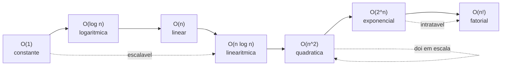
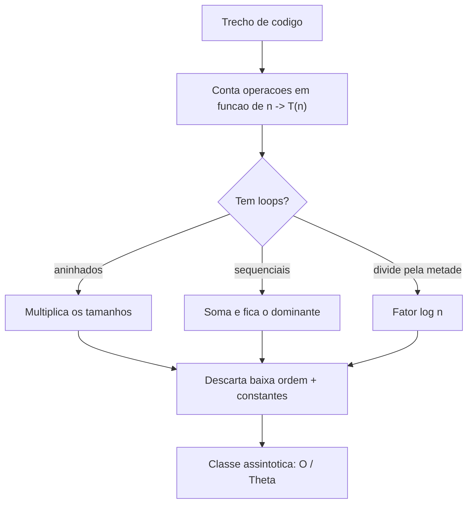

# Notação Assintótica: Big O, Big Theta (Θ) e Big Omega (Ω)

> **Bloco:** Complexidade e análise algorítmica · **Nível:** Intermediário/Avançado · **Tempo de leitura:** ~32 min

## TL;DR

Notação assintótica é a linguagem com que descrevemos **como o custo de um algoritmo cresce conforme a entrada cresce**, abstraindo constantes e termos de baixa ordem que dependem de máquina, compilador e detalhes de implementação. Três notações formam o núcleo: **Big O (O)** dá um **limite superior** assintótico — "não cresce mais rápido que"; **Big Omega (Ω)** dá um **limite inferior** — "não cresce mais devagar que"; e **Big Theta (Θ)** dá um **limite justo** (tight bound) — quando os limites superior e inferior coincidem, "cresce exatamente na ordem de". Formalmente, `f(n) = O(g(n))` se existem constantes `c > 0` e `n₀` tais que `f(n) ≤ c·g(n)` para todo `n ≥ n₀`; `Ω` inverte a desigualdade; `Θ` exige ambas (`c₁·g(n) ≤ f(n) ≤ c₂·g(n)`). As classes de crescimento que todo engenheiro precisa reconhecer instantaneamente, da melhor para a pior: **O(1)** constante, **O(log n)** logarítmica, **O(n)** linear, **O(n log n)** linearítmica, **O(n²)** quadrática, **O(2ⁿ)** exponencial, **O(n!)** fatorial. A diferença entre elas não é acadêmica: em 10 milhões de itens, O(log n) faz ~23 passos e O(n) faz 10.000.000 — a mesma operação que leva microssegundos pode levar segundos. O erro mais comum em entrevistas é dizer "Big O" querendo dizer Θ, e confundir notação assintótica (sobre **crescimento**) com **medição** (sobre tempo de relógio).

## O problema que resolve

Suponha que você precisa escolher entre dois algoritmos de busca para um catálogo de produtos. O algoritmo A faz uma varredura item a item; o B faz uma busca binária sobre dados ordenados. Como comparar objetivamente qual é "melhor"?

A tentação ingênua é **cronometrar**: roda os dois e mede o tempo. Mas essa medição é traiçoeira. Ela depende da máquina (um notebook lento vs. um servidor de 64 núcleos), da linguagem (C vs. Python), do compilador e suas otimizações, do estado do cache, da carga do sistema no momento, e — crucialmente — **do tamanho específico da entrada testada**. O algoritmo A pode parecer mais rápido para 10 itens (menos overhead de setup) e ser catastroficamente mais lento para 10 milhões. Medir um ponto isolado não responde à pergunta que importa em arquitetura: **como o custo se comporta quando o sistema cresce?**

A notação assintótica resolve isso ao mudar a pergunta. Em vez de "quanto tempo leva?", pergunta-se **"como o tempo (ou a memória) escala conforme `n` cresce sem limite?"**. Ela descarta deliberadamente o que é circunstancial — constantes multiplicativas, termos de baixa ordem, detalhes de hardware — e captura o que é intrínseco ao algoritmo: a **taxa de crescimento** (rate of growth). Dois algoritmos O(n) são considerados da mesma classe mesmo que um seja 3× mais rápido na prática, porque ambos dobram de custo quando a entrada dobra. Já um O(n) e um O(n²) são fundamentalmente diferentes: dobrar a entrada dobra o custo do primeiro e quadruplica o do segundo.

A pergunta central que a notação assintótica responde: **"Quando minha entrada crescer 10×, 1000×, 1.000.000×, o que acontece com o custo do meu algoritmo?"** É essa pergunta que separa um sistema que escala de um que colapsa sob carga — e é por isso que o tema aparece em toda entrevista de engenharia e em toda decisão arquitetural sobre escolha de estrutura de dados ou algoritmo.

Há uma segunda dimensão do problema: **comunicação**. A notação assintótica é um vocabulário compartilhado. Quando alguém diz "isso é O(n log n)", todo engenheiro entende imediatamente a ordem de grandeza, sem precisar de benchmarks. É a unidade de troca intelectual sobre eficiência algorítmica — daí sua onipresença em livros (CLRS), cursos (MIT 6.006) e literatura técnica.

## O que é (definição aprofundada)

Notação assintótica descreve o **comportamento limite** de uma função quando o argumento tende ao infinito. No contexto de algoritmos, a função é tipicamente `T(n)` (tempo em função do tamanho da entrada `n`) ou `S(n)` (espaço). As três notações fundamentais delimitam essa função de cima, de baixo, ou dos dois lados.

### Big O (O) — limite superior assintótico

`O(g(n))` é o conjunto de funções que **não crescem mais rápido** que `g(n)`, a menos de uma constante. A definição formal:

> `f(n) = O(g(n))` se existem constantes positivas `c` e `n₀` tais que `0 ≤ f(n) ≤ c·g(n)` para todo `n ≥ n₀`.

Em palavras: a partir de um certo tamanho de entrada (`n₀`), `f(n)` fica **abaixo** de algum múltiplo de `g(n)` e nunca mais ultrapassa. Big O é uma **garantia de teto**: "o custo não passa disso". É por isso que, na prática, descrevemos algoritmos por seu pior caso em Big O — é a garantia que importa para dimensionar sistemas.

Exemplo: `T(n) = 3n² + 5n + 100`. Afirmamos `T(n) = O(n²)`. Por quê? Escolhendo `c = 4` e `n₀` suficientemente grande, `3n² + 5n + 100 ≤ 4n²` para todo `n` grande. Os termos `5n` e `100` são dominados pelo `n²` e desaparecem da análise assintótica; a constante `3` é absorvida pelo `c`. Note que `T(n)` também é `O(n³)`, `O(n⁴)`, etc. — Big O é só um teto, não precisa ser justo. Dizer que um algoritmo linear é `O(n²)` é **tecnicamente correto** mas pouco informativo (e, em entrevista, um sinal de que você não cravou a análise).

### Big Omega (Ω) — limite inferior assintótico

`Ω(g(n))` é o conjunto de funções que **não crescem mais devagar** que `g(n)`. A definição formal inverte a desigualdade:

> `f(n) = Ω(g(n))` se existem constantes positivas `c` e `n₀` tais que `0 ≤ c·g(n) ≤ f(n)` para todo `n ≥ n₀`.

Em palavras: a partir de `n₀`, `f(n)` fica **acima** de algum múltiplo de `g(n)`. Big Omega é uma **garantia de piso**: "o custo é pelo menos isso". É a notação usada para falar de **limites inferiores de problemas** — por exemplo, qualquer algoritmo de ordenação baseado em comparações precisa de `Ω(n log n)` comparações no pior caso; nenhum pode ser assintoticamente mais rápido. Esse tipo de afirmação é sobre o problema, não sobre um algoritmo específico, e Ω é a ferramenta certa.

Exemplo: `T(n) = 3n² + 5n + 100 = Ω(n²)`, mas também `Ω(n)` e `Ω(1)` — o piso pode ser frouxo, assim como o teto do Big O.

### Big Theta (Θ) — limite justo (tight bound)

`Θ(g(n))` captura o caso em que o limite superior e o inferior **coincidem na mesma ordem**. É o limite **justo** ou **apertado**:

> `f(n) = Θ(g(n))` se existem constantes positivas `c₁`, `c₂` e `n₀` tais que `0 ≤ c₁·g(n) ≤ f(n) ≤ c₂·g(n)` para todo `n ≥ n₀`.

Equivalentemente: `f(n) = Θ(g(n))` se e somente se `f(n) = O(g(n))` **e** `f(n) = Ω(g(n))`. Theta é a afirmação mais forte e mais precisa: "o custo cresce **exatamente** na ordem de `g(n)`, nem mais nem menos". `3n² + 5n + 100 = Θ(n²)`, e isso é uma descrição justa — não é Θ(n) nem Θ(n³).

A relação de inclusão é a chave conceitual: **se uma função é Θ(g(n)), ela é automaticamente O(g(n)) e Ω(g(n))**. Theta é a interseção das duas. Quando matemáticos e o livro CLRS são precisos, eles usam Θ para descrever o custo de um algoritmo cujos casos não variam (ou para o caso analisado); a indústria, por hábito e por conservadorismo (o teto é o que protege), usa "O" mesmo quando quer dizer Θ.

### Notações complementares: little-o e little-omega

Há ainda `o(g(n))` (little-o) e `ω(g(n))` (little-omega), limites **estritos** (não justos): `f(n) = o(g(n))` significa que `f` cresce **estritamente mais devagar** que `g` (a razão `f/g → 0`). São menos usadas no dia a dia, mas aparecem em provas formais. Para o trabalho prático, O, Ω e Θ bastam.

### As classes de crescimento essenciais

Toda a engenharia de complexidade gira em torno de reconhecer um punhado de classes. Da melhor (mais lenta para crescer) para a pior:

| Classe | Nome | Comportamento ao dobrar `n` | Exemplos típicos |
|---|---|---|---|
| **O(1)** | Constante | Não muda | Acesso a array por índice; push/pop de pilha; lookup em hash table (caso médio) |
| **O(log n)** | Logarítmica | Cresce por +1 passo | Busca binária; operações em árvore balanceada (BST, heap) |
| **O(n)** | Linear | Dobra | Busca linear; percorrer uma lista; somar um array |
| **O(n log n)** | Linearítmica | Dobra e um pouco mais | Merge sort, heap sort, quicksort (médio); ordenação por comparação ótima |
| **O(n²)** | Quadrática | Quadruplica | Bubble/insertion/selection sort; comparar todos os pares; loops aninhados |
| **O(2ⁿ)** | Exponencial | **Eleva ao quadrado** | Subconjuntos; recursão ingênua de Fibonacci; força-bruta em problemas NP |
| **O(n!)** | Fatorial | Explode | Permutações; força-bruta do caixeiro-viajante (TSP) |

A intuição que precisa ser visceral: as três primeiras (constante, log, linear) e a linearítmica são **escaláveis** — toleram crescimento de entrada. A quadrática já dói em escala (milhões de itens). E as duas últimas (exponencial e fatorial) são **intratáveis** para qualquer `n` além de algumas dezenas — só servem para entradas minúsculas ou como ponto de partida a ser otimizado (frequentemente via programação dinâmica).

### Glossário rápido

- **Notação assintótica:** descrição do comportamento de `T(n)` quando `n → ∞`, ignorando constantes e termos de baixa ordem.
- **Big O (O):** limite superior; "não cresce mais rápido que". Garantia de teto.
- **Big Omega (Ω):** limite inferior; "não cresce mais devagar que". Garantia de piso.
- **Big Theta (Θ):** limite justo; teto e piso na mesma ordem. `Θ = O ∩ Ω`.
- **Tight bound:** limite justo (Θ); o mais preciso.
- **Taxa de crescimento (rate of growth):** como `T(n)` muda conforme `n` cresce — o que a notação captura.
- **Termo dominante:** o termo de maior ordem em `T(n)`, que define a classe assintótica.
- **Constante oculta:** o fator multiplicativo `c` que a notação descarta (mas que importa na prática).
- **little-o / little-omega (o, ω):** limites estritos (não justos).

## Como funciona

A mecânica de derivar a notação assintótica de um algoritmo segue três passos simples e um princípio.

**Passo 1 — contar as operações em função de `n`.** Percorra o algoritmo e expresse o número de operações básicas como uma função `T(n)`. Um loop simples de `n` iterações com trabalho constante por iteração dá `T(n) = a·n + b`. Dois loops aninhados dão `T(n) ≈ a·n² + ...`. Uma busca binária divide o espaço pela metade a cada passo, dando `T(n) ≈ log₂(n)`.

**Passo 2 — descartar termos de baixa ordem.** Em `T(n) = 3n² + 5n + 100`, conforme `n` cresce, o `n²` domina: para `n = 1000`, `3n² = 3.000.000` enquanto `5n = 5.000` e `100` são ruído. Só o **termo dominante** sobrevive: `n²`.

**Passo 3 — descartar a constante multiplicativa.** `3n²` vira `n²`. A constante `3` depende de detalhes que a notação abstrai (quantas operações de máquina cada "passo" custa). Resultado: `T(n) = Θ(n²)` (ou `O(n²)` se queremos só o teto).

**O princípio:** a notação assintótica é sobre **dominância para `n` grande**. Por isso `n²` domina `n`, `2ⁿ` domina qualquer polinômio, `n!` domina `2ⁿ`, e `log n` cresce mais devagar que qualquer potência positiva de `n`. A hierarquia de dominância é:

`O(1) < O(log n) < O(n) < O(n log n) < O(n²) < O(n³) < ... < O(2ⁿ) < O(n!)`

### Regras práticas de composição

- **Sequência (um bloco depois do outro):** soma-se e fica o dominante. `O(n) + O(n²) = O(n²)`.
- **Aninhamento (loop dentro de loop):** multiplica-se. Loop de `n` contendo loop de `m` é `O(n·m)`; se `m = n`, `O(n²)`.
- **Constantes e fatores fixos somem:** `O(3n) = O(n)`; `O(½n²) = O(n²)`.
- **Logaritmos: a base não importa** na notação. `log₂ n`, `log₁₀ n` e `ln n` diferem por uma constante (mudança de base: `log_b n = log n / log b`), então todos são `O(log n)`. É por isso que escrevemos `O(log n)` sem especificar base.
- **Cuidado com variáveis múltiplas:** um algoritmo sobre um grafo com `V` vértices e `E` arestas é `O(V + E)`, não `O(n)` — explicite cada dimensão.

### Por que ignorar constantes (e quando isso engana)

Ignorar constantes é uma abstração poderosa porque torna a análise independente de máquina e revela o comportamento intrínseco. Mas é uma **abstração**, e abstrações vazam. Um algoritmo `O(n)` com constante oculta gigante (digamos, 1000 operações por elemento) pode ser mais lento, **para `n` pequeno**, que um `O(n²)` com constante 1. O cruzamento (crossover point) acontece em algum `n₀`; abaixo dele, a classe assintótica "pior" vence. Por isso bibliotecas de ordenação reais (como o introsort/timsort) trocam para **insertion sort `O(n²)`** em subarrays pequenos — para `n` pequeno, a constante baixa do insertion sort bate a constante alta do merge/quick sort. A notação assintótica responde "o que escala", não "o que é mais rápido para esta entrada específica". Confundir as duas é um erro clássico.

## Diagrama de fluxo

O primeiro diagrama mostra a hierarquia de dominância das classes (da melhor para a pior); o segundo, o fluxo de decisão para derivar a notação de um trecho de código.





## Exemplo prático / caso real

Considere o catálogo de uma plataforma de e-commerce brasileira com **10 milhões de produtos** (`n = 10.000.000`). Um cliente busca um SKU específico. Há duas estratégias.

**Busca linear (O(n)).** Percorre os produtos um a um até achar o SKU. No pior caso (SKU no fim ou inexistente), são 10 milhões de comparações. Suponha 1 nanossegundo por comparação (otimista): `10.000.000 × 1ns = 10 milissegundos`. Parece pouco — mas multiplique por milhares de buscas por segundo na Black Friday, e o custo de CPU explode. E se a constante por comparação for maior (objetos, desreferenciamento, cache miss), facilmente vira centenas de milissegundos por busca. Pior: dobrar o catálogo para 20 milhões **dobra** o tempo.

**Busca binária (O(log n)) sobre dados ordenados.** Divide o espaço pela metade a cada passo. `log₂(10.000.000) ≈ 23,25`, ou seja, **~24 comparações** no pior caso. A diferença é brutal: 24 vs. 10.000.000 — um fator de ~417.000×. E o mais impressionante é a escalabilidade: dobrar o catálogo para 20 milhões adiciona **uma única comparação** (`log₂(20M) ≈ 24,25`). Crescer o catálogo 1000× (para 10 bilhões) adiciona só ~10 passos. É a diferença entre um sistema que sente cada produto novo e um que mal percebe.

Eis a tabela de passos no pior caso, que torna a abstração concreta:

| `n` (itens) | O(log n) | O(n) | O(n log n) | O(n²) |
|---|---|---|---|---|
| 10 | ~3 | 10 | ~33 | 100 |
| 1.000 | ~10 | 1.000 | ~10.000 | 1.000.000 |
| 1.000.000 | ~20 | 1.000.000 | ~20 milhões | 10¹² (1 trilhão) |
| 10.000.000 | ~23 | 10.000.000 | ~233 milhões | 10¹⁴ |

Olhe a coluna O(n²) em 1 milhão de itens: 1 **trilhão** de operações. A 1 ns cada, são ~16 minutos. Por isso um algoritmo de "comparar todos os pares de clientes para detectar duplicatas" (O(n²)) que funcionava bem com 10 mil clientes (100 milhões de ops, ~0,1s) torna-se **inviável** com 1 milhão — não é "mais lento", é uma ordem de grandeza de inviabilidade. A solução é mudar de classe: usar um índice/hash (O(n)) em vez de comparação par a par.

Pseudocódigo da busca binária, para fixar o O(log n):

```
busca_binaria(arr_ordenado, alvo):
    baixo = 0
    alto = tamanho(arr_ordenado) - 1
    enquanto baixo <= alto:
        meio = (baixo + alto) / 2          # descarta metade a cada passo
        se arr_ordenado[meio] == alvo:
            retorna meio
        senao se arr_ordenado[meio] < alvo:
            baixo = meio + 1               # vai para a metade direita
        senao:
            alto = meio - 1                # vai para a metade esquerda
    retorna NAO_ENCONTRADO
```

Cada iteração **descarta metade** do espaço restante. Partindo de `n` e dividindo por 2 até sobrar 1, o número de divisões é `log₂(n)` — daí o O(log n). O pré-requisito é que os dados estejam **ordenados**: aqui aparece o trade-off arquitetural — você paga `O(n log n)` uma vez para ordenar (ou mantém um índice/B-tree) e colhe `O(log n)` em cada busca subsequente. Em bancos de dados, é exatamente por isso que existem índices.

## Quando usar / Quando evitar

A notação assintótica é a ferramenta padrão para **comparar algoritmos** e **prever escalabilidade**, mas saber *qual* notação usar e *quando ela importa* é o que distingue o uso maduro.

**Use Big O** quando você quer comunicar a **garantia de pior caso** — o teto que protege o dimensionamento do sistema. É a notação default da indústria e o que se espera em entrevistas ao perguntar "qual a complexidade?". É a escolha certa quando o interesse é "o quão ruim pode ficar".

**Use Big Theta (Θ)** quando você quer ser **preciso** e o limite é justo — quando o custo do algoritmo (ou do caso analisado) tem ordem bem definida. Acadêmicos e CLRS preferem Θ porque é mais informativo. Em entrevista, usar Θ corretamente sinaliza domínio.

**Use Big Omega (Ω)** quando você fala de **limites inferiores de problemas** — "nenhum algoritmo de comparação ordena mais rápido que Ω(n log n)" — ou do melhor caso de um algoritmo. É a notação para argumentos de impossibilidade/otimalidade.

**A análise assintótica importa mais** quando: a entrada pode crescer muito (escala); a diferença de classes é grande (O(n) vs O(n²) vs O(2ⁿ)); o algoritmo está num caminho quente (hot path) executado milhões de vezes.

**A análise assintótica engana** quando: `n` é sempre pequeno e fixo (a constante domina — o crossover point nunca é atingido); as constantes ocultas são enormes e comparáveis entre as opções; o gargalo real é I/O, rede ou cache, não CPU (um O(n²) em memória pode bater um O(n) que faz acesso a disco). Nesses casos, **meça** — a notação informa, não substitui o profiling.

## Anti-padrões e armadilhas comuns

- **Dizer "O" querendo dizer "Θ".** O erro mais difundido. "Busca linear é O(n)" — tecnicamente também é O(n²), O(2ⁿ)... porque O é só teto. Se você quer dizer que é *exatamente* linear, a notação correta é Θ(n). A indústria tolera o abuso, mas em entrevista de nível arquiteto, saber a distinção conta pontos.
- **Confundir notação assintótica com medição de tempo.** "Esse algoritmo é O(n), então roda em `n` segundos" — não. Big O descreve **crescimento**, não tempo absoluto. Não há unidade de tempo na notação; a constante (que a notação descarta) é o que liga ordem de grandeza a milissegundos reais.
- **Ignorar constantes que importam na prática.** Declarar vitória porque um algoritmo é O(n) sem perceber que sua constante oculta é 100× a do O(n log n) concorrente, para o `n` real do sistema. Para `n` pequeno ou moderado, o crossover point pode nunca ser atingido. A teoria diz "o que escala"; a prática exige medir o regime real.
- **Especificar a base do logaritmo.** Escrever "O(log₂ n)" como se a base mudasse a classe. Mudança de base é uma constante multiplicativa; `O(log n)` (sem base) é a forma correta.
- **Esquecer variáveis múltiplas.** Chamar um algoritmo de grafo de "O(n)" quando ele depende de `V` e `E` separadamente — é `O(V + E)`. Colapsar dimensões distintas num único `n` esconde o comportamento real.
- **Analisar só o termo errado.** Somar quando deveria multiplicar (loops aninhados) ou multiplicar quando deveria somar (blocos sequenciais). Loop de `n` *seguido* de loop de `n` é O(n), não O(n²); loop de `n` *dentro* de loop de `n` é O(n²).
- **Confundir complexidade de tempo com complexidade de espaço.** "É O(n)" — de tempo ou de memória? São eixos distintos (ver `04-time-vs-space-complexity-tradeoffs.md`). Sempre explicite qual.
- **Otimizar a classe quando `n` é trivial.** Reescrever um O(n²) para O(n log n) num laço que processa 5 itens é desperdício de esforço (e fonte de bugs). A análise assintótica só importa quando `n` pode crescer.
- **Confundir pior caso, caso médio e amortizado.** Dizer "hash table é O(1)" sem qualificar — é O(1) **médio/amortizado**, mas O(n) no pior caso (colisões). Ver `02-pior-melhor-e-caso-medio.md` e `03-complexidade-amortizada.md`.

## Relação com outros conceitos

- **Pior, melhor e caso médio** (`02-pior-melhor-e-caso-medio.md`): a notação assintótica (O/Ω/Θ) se aplica *a cada* cenário de caso. Big O descreve tipicamente o pior caso; Ω frequentemente o melhor caso; e os três casos podem ter classes diferentes (quicksort: Θ(n log n) médio, Θ(n²) pior).
- **Complexidade amortizada** (`03-complexidade-amortizada.md`): outra forma de média (sobre uma sequência de operações), distinta do caso médio probabilístico; também expressa em notação assintótica.
- **Time vs space complexity** (`04-time-vs-space-complexity-tradeoffs.md`): a mesma notação descreve crescimento de memória; trade-offs trocam uma classe pela outra.
- **Análise de recursão e Master Theorem** (`05-analise-de-recursao-arvore-e-master-theorem.md`): técnicas para derivar a notação assintótica de algoritmos recursivos (`T(n) = aT(n/b) + f(n)`).
- **Estruturas de dados** (bloco 12): cada estrutura tem complexidades características — array O(1) de acesso, hash table O(1) médio, árvore balanceada O(log n), lista ligada O(n) de busca. A notação é a forma de compará-las.
- **Algoritmos essenciais** (bloco 13): sorting (O(n log n) ótimo por comparação, com limite inferior Ω(n log n)), busca binária (O(log n)), programação dinâmica (transforma exponencial em polinomial). A notação é o critério de escolha.
- **Tabelas hash** (bloco 12/13): o exemplo canônico de O(1) médio vs O(n) pior, e de por que qualificar o caso importa.

## Modelo mental para o arquiteto

Três ideias para carregar:

1. **A pergunta é sobre crescimento, não sobre tempo.** Notação assintótica responde "o que acontece quando `n` cresce 1000×?", não "quantos milissegundos?". Internalizar a hierarquia `O(1) < log < n < n log n < n² < 2ⁿ < n!` e o que cada uma faz ao dobrar a entrada é o reflexo que separa quem dimensiona sistemas de quem só os escreve.
2. **O, Ω e Θ são três afirmações distintas.** Teto (O), piso (Ω) e justo (Θ = O ∩ Ω). Use Big O para garantias e comunicação; Θ quando quer precisão; Ω para limites inferiores de problemas. Confundir O com Θ é o tropeço clássico de entrevista.
3. **A teoria informa, a medição decide.** A notação revela o que escala, mas descarta constantes que podem dominar no regime real do sistema. Para `n` pequeno ou hot paths sensíveis, a classe assintótica "pior" pode vencer. Combine análise (prever escala) com profiling (verificar a realidade).

## Pontos para fixar (revisão)

- Notação assintótica descreve a **taxa de crescimento** de `T(n)` quando `n → ∞`, abstraindo constantes e termos de baixa ordem.
- **Big O = teto** (`f ≤ c·g`); **Big Omega = piso** (`f ≥ c·g`); **Big Theta = justo** (ambos; `Θ = O ∩ Ω`).
- Classes essenciais em ordem: **O(1) < O(log n) < O(n) < O(n log n) < O(n²) < O(2ⁿ) < O(n!)**.
- Ao dobrar `n`: O(1) não muda, O(log n) faz +1 passo, O(n) dobra, O(n²) quadruplica, O(2ⁿ) eleva ao quadrado.
- Regras de composição: blocos sequenciais **somam** (fica o dominante); loops aninhados **multiplicam**; constantes e base do log **somem**.
- Em 10M de itens: busca binária O(log n) ≈ 24 passos vs busca linear O(n) = 10M — fator de ~417.000×.
- A **constante oculta** pode dominar para `n` pequeno (crossover point); por isso libs trocam para insertion sort em subarrays pequenos.
- Notação descreve **crescimento, não tempo**; e complexidade de **tempo ≠ espaço** — sempre explicite qual e qual caso (pior/médio/amortizado).

## Referências

- [Big-O Algorithm Complexity Cheat Sheet (Know Thy Complexities!)](https://www.bigocheatsheet.com/)
- [Big-O notation (article) — Khan Academy](https://www.khanacademy.org/computing/computer-science/algorithms/asymptotic-notation/a/big-o-notation)
- [Big-Ω (Big-Omega) notation (article) — Khan Academy](https://www.khanacademy.org/computing/computer-science/algorithms/asymptotic-notation/a/big-big-omega-notation)
- [Asymptotic notation (article) — Khan Academy](https://www.khanacademy.org/computing/computer-science/algorithms/asymptotic-notation/a/asymptotic-notation)
- [Introduction to Algorithms (6.006), Spring 2020 — MIT OpenCourseWare](https://ocw.mit.edu/courses/6-006-introduction-to-algorithms-spring-2020/)
- [Big-O Notation — Wikipedia](https://en.wikipedia.org/wiki/Big_O_notation)
- [Big O Cheat Sheet – Time Complexity Chart — freeCodeCamp](https://www.freecodecamp.org/news/big-o-cheat-sheet-time-complexity-chart/)
- [VisuAlgo — Visualizing Data Structures and Algorithms](https://visualgo.net/en)
