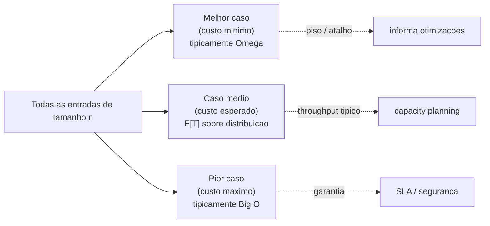
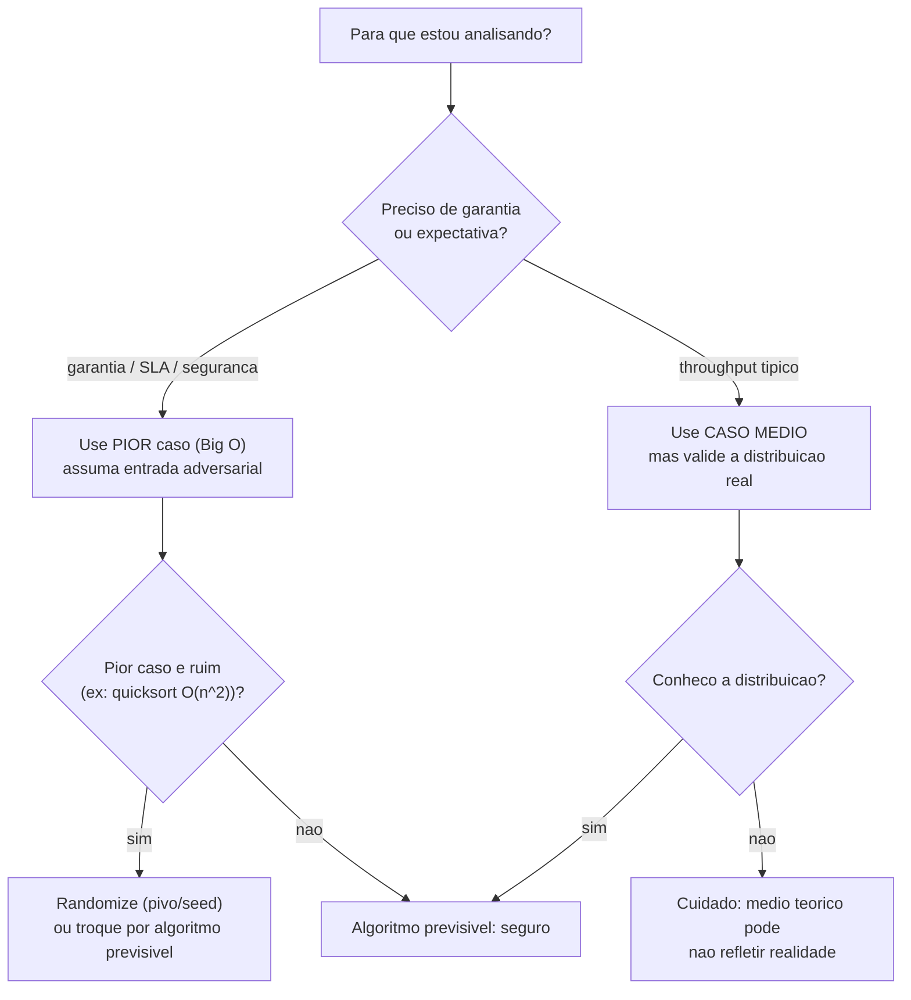

# Pior Caso, Melhor Caso e Caso Médio

> **Bloco:** Complexidade e análise algorítmica · **Nível:** Intermediário/Avançado · **Tempo de leitura:** ~28 min

## TL;DR

O custo de um algoritmo **não é um número único** — ele varia conforme *qual* entrada de tamanho `n` você lhe der. Três cenários organizam essa variação: **melhor caso** (best case) — a entrada que faz o algoritmo terminar mais rápido; **pior caso** (worst case) — a entrada que o faz trabalhar mais; e **caso médio** (average case) — o custo esperado sobre uma distribuição de entradas (uma média ponderada pela probabilidade de cada entrada). O **pior caso é o que mais importa na prática** porque é uma **garantia** (o sistema nunca passará disso) e porque o pior caso costuma aparecer justamente sob ataque ou sobrecarga. As notações assintóticas se aplicam *dentro* de cada caso: tipicamente usa-se **Big O para o pior caso** e **Big Omega para o melhor caso**; quando os três coincidem (ex.: merge sort, sempre Θ(n log n)), o algoritmo é previsível. O exemplo canônico é o **quicksort**: melhor e médio Θ(n log n), mas pior caso Θ(n²) — e é por isso que pivôs ingênuos são perigosos. A confusão clássica de entrevista é tratar **caso médio** (média probabilística sobre entradas) como sinônimo de **complexidade amortizada** (média sobre uma sequência de operações) — são coisas diferentes (ver `03-complexidade-amortizada.md`).

## O problema que resolve

Quando dizemos "esse algoritmo é O(n)", estamos escondendo uma pergunta: **O(n) para qual entrada?** A maioria dos algoritmos não tem um custo fixo para todo `n` — o custo depende não só do *tamanho* da entrada, mas da *forma* dela. Considere uma busca linear num array de 1 milhão de itens. Se o alvo é o primeiro elemento, o algoritmo termina na primeira comparação. Se é o último (ou não existe), faz 1 milhão de comparações. **Mesmo `n`, custos radicalmente diferentes.**

Isso cria um problema de comunicação e de garantia. Se um engenheiro reporta "a busca é rápida, testei e respondeu em 1 microssegundo", ele pode ter testado justamente o melhor caso (alvo no início), enquanto em produção o caso comum é o alvo no fim ou ausente — e o sistema lentifica sob carga real. Reportar um único número sem dizer *qual cenário* é enganoso.

A análise por casos resolve isso ao reconhecer que o custo é uma **função da entrada, não só do tamanho**, e ao separar três perguntas distintas:

- **"Qual o melhor que pode acontecer?"** (melhor caso) — útil para entender o piso, mas raramente é o que importa para dimensionamento (você não projeta para o cenário mais favorável).
- **"Qual o pior que pode acontecer?"** (pior caso) — a **garantia**. É o que importa para SLAs, capacity planning, e segurança (um atacante vai *provocar* o pior caso).
- **"Quanto custa tipicamente, em média?"** (caso médio) — o que importa para throughput esperado e custo operacional agregado, *desde que* você conheça a distribuição real das entradas.

A pergunta central: **"O custo deste algoritmo é estável ou varia com a forma da entrada — e, se varia, qual cenário devo usar para projetar meu sistema?"** A resposta quase sempre privilegia o pior caso para garantias, mas o caso médio informa expectativas, e o melhor caso revela se há um atalho explorável. Entender os três e saber qual usar quando é o que torna a análise de complexidade útil em arquitetura, não só em prova.

## O que é (definição aprofundada)

Os três casos descrevem o **espectro de comportamento** de um algoritmo sobre todas as entradas possíveis de um dado tamanho `n`. Cada caso é, ele próprio, uma função de `n`, e cada um pode ter uma classe assintótica diferente.

### Melhor caso (best case)

O **melhor caso** é o custo do algoritmo sobre a entrada de tamanho `n` que minimiza o trabalho. Formalmente, é o mínimo de `T(entrada)` sobre todas as entradas de tamanho `n`. É frequentemente descrito com **Big Omega (Ω)**, porque representa um piso de comportamento — embora se possa usar Θ se o melhor caso for justo.

Exemplos:
- **Busca linear:** Θ(1) — o alvo é o primeiro elemento.
- **Insertion sort:** Θ(n) — o array já está ordenado; cada elemento só é comparado com o anterior e nada se move. Por isso insertion sort é excelente para dados quase-ordenados.
- **Quicksort:** Θ(n log n) — o pivô sempre divide o array em duas metades iguais.

O melhor caso é o cenário menos útil para projetar sistemas (você não conta com sorte), mas é informativo: revela se o algoritmo tem um "atalho" para entradas favoráveis (como o insertion sort com dados ordenados), o que pode ser explorado quando você *conhece* que suas entradas tendem ao favorável.

### Pior caso (worst case)

O **pior caso** é o custo sobre a entrada de tamanho `n` que maximiza o trabalho — o máximo de `T(entrada)`. É descrito com **Big O**, porque é o teto, a **garantia**: o algoritmo *nunca* será mais lento que isso para entradas de tamanho `n`.

Exemplos:
- **Busca linear:** Θ(n) — alvo no fim ou ausente.
- **Insertion sort:** Θ(n²) — array em ordem inversa; cada elemento precisa percorrer todos os anteriores.
- **Quicksort:** Θ(n²) — o pivô escolhido é sempre o menor (ou maior) elemento, produzindo partições degeneradas de tamanho `n-1` e `0`. Acontece, por exemplo, com pivô = primeiro elemento sobre array já ordenado.
- **Hash table (lookup):** Θ(n) — todas as chaves colidem no mesmo bucket, degenerando para uma lista.

**Por que o pior caso domina a prática:**

1. **É uma garantia.** "Nunca pior que O(n log n)" é uma promessa que se pode honrar num SLA. O caso médio é uma expectativa que pode falhar.
2. **O pior caso aparece sob estresse.** Os cenários que geram o pior caso (dados adversariais, todos batendo o mesmo bucket, entrada já ordenada para um quicksort ingênuo) tendem a ocorrer exatamente quando o sistema está sob carga ou ataque.
3. **Segurança.** Um atacante que conhece seu algoritmo *provocará* deliberadamente o pior caso. O ataque de **Hash-DoS** (Hash Collision Denial of Service) explora isso: o adversário envia chaves que colidem propositadamente no hash, transformando o O(1) médio da hash table em O(n) por operação e derrubando o servidor. É por isso que estruturas críticas usam **hashing randomizado** (seed aleatório) — para que o atacante não consiga prever e forçar colisões.

Quando alguém diz "a complexidade do algoritmo" sem qualificar, **quase sempre quer dizer o pior caso em Big O** — essa é a convenção da indústria, e por boas razões.

### Caso médio (average case)

O **caso médio** é o custo **esperado** sobre uma **distribuição de probabilidade** das entradas. Formalmente, é a esperança `E[T(entrada)] = Σ P(entrada) · T(entrada)`, a média ponderada do custo de cada entrada pela sua probabilidade de ocorrer.

O detalhe crucial, frequentemente ignorado: **o caso médio depende da distribuição assumida**. "Médio" não significa "no meio entre melhor e pior" — significa "esperado *sob uma hipótese sobre como as entradas se distribuem*". A hipótese padrão em análise é a **distribuição uniforme** (todas as entradas igualmente prováveis), mas essa hipótese pode não corresponder à realidade do seu sistema. Se suas entradas têm um viés (ex.: arrays quase sempre quase-ordenados), o caso médio teórico (uniforme) não reflete seu custo real.

Exemplos:
- **Busca linear:** Θ(n) — em média, o alvo está no meio, então ~n/2 comparações, que é Θ(n).
- **Quicksort:** Θ(n log n) — sobre permutações aleatórias uniformes, as partições são "boas o suficiente" na média, e a análise probabilística mostra n log n esperado. É por isso que o quicksort é rápido na prática, apesar do pior caso quadrático.
- **Hash table (lookup):** Θ(1) — com boa função de hash e fator de carga controlado, o número esperado de elementos por bucket é constante.

O caso médio importa para **throughput e custo agregado**: se você processa milhões de operações, o que determina o consumo total de CPU é o custo médio, não o pior caso de uma operação isolada. Mas confiar nele exige conhecer (ou randomizar) a distribuição.

### A relação entre os três casos e as notações

Um ponto que confunde muita gente: as notações O, Ω, Θ são **independentes** dos casos melhor/pior/médio. Você pode aplicar qualquer notação a qualquer caso. As combinações comuns:

- Pior caso descrito com **O** (teto/garantia).
- Melhor caso descrito com **Ω** (piso).
- Quando um caso tem ordem justa, usa-se **Θ** para esse caso.

Quando os **três casos coincidem** na mesma ordem (ex.: merge sort é Θ(n log n) sempre; acesso a array é Θ(1) sempre), o algoritmo é **previsível** — não há variância de comportamento com a forma da entrada, o que é uma propriedade valiosa para sistemas que precisam de latência estável (real-time, SLAs apertados).

### Tabela síntese: casos por algoritmo

| Algoritmo | Melhor caso | Caso médio | Pior caso | Observação |
|---|---|---|---|---|
| **Busca linear** | Θ(1) | Θ(n) | Θ(n) | Alvo no início vs. fim/ausente |
| **Busca binária** | Θ(1) | Θ(log n) | Θ(log n) | Alvo no meio vs. nas pontas |
| **Insertion sort** | Θ(n) | Θ(n²) | Θ(n²) | Ótimo para quase-ordenado |
| **Merge sort** | Θ(n log n) | Θ(n log n) | Θ(n log n) | **Previsível**, sempre igual |
| **Quicksort** | Θ(n log n) | Θ(n log n) | **Θ(n²)** | Pivô ruim degenera; randomização mitiga |
| **Heap sort** | Θ(n log n) | Θ(n log n) | Θ(n log n) | Previsível |
| **Hash table (lookup)** | Θ(1) | Θ(1) | **Θ(n)** | Colisões degeneram; alvo de Hash-DoS |
| **BST não balanceada** | Θ(log n) | Θ(log n) | **Θ(n)** | Inserção ordenada vira lista ligada |
| **BST balanceada (AVL/RB)** | Θ(log n) | Θ(log n) | Θ(log n) | Balanceamento garante o teto |

Note o padrão: as estruturas/algoritmos com pior caso **diferente** dos demais (quicksort, hash table, BST não balanceada) são justamente os que exigem cuidado — randomização, balanceamento, ou conhecimento da distribuição — para serem seguros em produção.

### Glossário rápido

- **Melhor caso (best case):** custo mínimo sobre entradas de tamanho `n`; piso. Tipicamente Ω.
- **Pior caso (worst case):** custo máximo sobre entradas de tamanho `n`; teto e garantia. Tipicamente O.
- **Caso médio (average case):** custo esperado sobre uma distribuição de entradas; média ponderada. `E[T]`.
- **Distribuição uniforme:** hipótese padrão do caso médio (todas as entradas igualmente prováveis).
- **Entrada adversarial:** entrada construída deliberadamente para provocar o pior caso.
- **Hash-DoS:** ataque que força colisões em hash table para degradar O(1) → O(n).
- **Randomização:** introduzir aleatoriedade (pivô, seed de hash) para que o pior caso não dependa da entrada e sim do acaso, tornando-o improvável de ser provocado.
- **Previsível:** algoritmo cujos três casos têm a mesma ordem (merge sort, heap sort).

## Como funciona

A análise por casos segue um raciocínio estruturado:

**Identificar a entrada que dispara cada caso.** Para o pior caso, pergunte: "que forma de entrada faz este algoritmo trabalhar o máximo?". Para insertion sort, é a ordem inversa; para quicksort com pivô = primeiro elemento, é o array já ordenado; para hash table, é todas as chaves colidindo. Construir mentalmente a entrada adversarial é o exercício central — e é também o que um atacante faz.

**Contar o custo para cada caso.** Uma vez identificada a entrada, conte as operações como em qualquer análise assintótica (ver `01-notacao-assintotica-big-o-theta-omega.md`). Pior caso do insertion sort: o i-ésimo elemento faz `i` comparações/trocas, somando `1 + 2 + ... + (n-1) = n(n-1)/2 = Θ(n²)`.

**Para o caso médio, escolher e justificar uma distribuição, depois calcular a esperança.** Esta é a parte mais sutil. Você precisa de uma hipótese sobre as entradas (geralmente uniforme) e então calcular `E[T] = Σ P(entrada)·T(entrada)`. Para a busca linear com alvo uniformemente distribuído entre as `n` posições (mais o caso ausente), o número esperado de comparações é aproximadamente `(n+1)/2 = Θ(n)`. Para o quicksort, a análise é mais elaborada (envolve a probabilidade de cada par de elementos ser comparado), mas chega a `Θ(n log n)` esperado.

### A transformação por randomização

Um truque poderoso liga pior caso e caso médio: a **randomização**. No quicksort determinístico, existe uma entrada específica (dependente da regra de escolha do pivô) que dispara o O(n²) — e um adversário pode construí-la. No **quicksort randomizado**, o pivô é escolhido aleatoriamente a cada partição. Agora o pior caso O(n²) ainda *existe matematicamente*, mas ele **não depende mais da entrada** — depende da sequência de escolhas aleatórias do algoritmo. A probabilidade de azar contínuo (sempre escolher o pior pivô) é astronomicamente baixa. O resultado: o **caso esperado** é Θ(n log n) *para qualquer entrada*, e nenhum adversário consegue provocar o pior caso conhecendo só a entrada. A randomização **converte uma garantia sobre a entrada numa garantia probabilística sobre o algoritmo** — é a mesma ideia por trás do seed aleatório que protege hash tables contra Hash-DoS.

### Caso médio vs. pior caso: qual usar para dimensionar

A regra prática:

- Para **garantias e SLAs** (latência p99, p99.9), use o **pior caso** — é o que protege contra o cenário ruim que *vai* acontecer.
- Para **capacity planning de throughput agregado** (quanta CPU para X req/s), o **caso médio** é mais realista — o custo total é dominado pelo comportamento típico, não pelos outliers.
- Para **segurança**, sempre assuma que o **pior caso será provocado** — projete para ele ou randomize para torná-lo improvável.

A latência de cauda (tail latency) é onde os dois se encontram: o p50 reflete o caso médio, mas o p99/p99.9 reflete os casos próximos do pior. Um algoritmo com caso médio ótimo mas pior caso ruim (quicksort ingênuo, hash table sem randomização) tem **cauda longa** — a maioria das requisições é rápida, mas uma fração sofre o pior caso, e essa fração arruína o p99.

## Diagrama de fluxo

O primeiro diagrama mostra o espectro de custo de um algoritmo sobre as entradas; o segundo, o fluxo de decisão sobre qual caso usar para projetar.

## Exemplo prático / caso real

Considere o serviço de **autenticação de uma fintech brasileira** que valida tokens. Internamente, ele usa uma **hash table** para mapear `token → sessão`, com milhões de sessões ativas no pico.

**O caso médio que justifica a escolha.** A hash table dá lookup Θ(1) no caso médio — independentemente de haver 1 mil ou 10 milhões de sessões, validar um token leva tempo constante. É exatamente o que se quer num hot path executado dezenas de milhares de vezes por segundo. A análise de caso médio aqui é o que torna a arquitetura viável: com uma BST balanceada (Θ(log n)), cada validação custaria ~23 comparações em 10M de sessões; com hash table, ~1.

**O pior caso que quase derrubou o sistema.** Numa madrugada, o serviço sofreu um ataque de **Hash-DoS**. O atacante, conhecendo (ou inferindo) a função de hash, gerou milhares de tokens que **colidiam no mesmo bucket**. Cada lookup, que deveria ser Θ(1), passou a percorrer uma lista gigante de colisões — Θ(n) por operação. Com `n` na casa dos milhares de colisões e dezenas de milhares de lookups por segundo, a CPU saturou e a latência p99 explodiu de 1 ms para vários segundos. **O pior caso teórico (Θ(n)), que parecia improvável, foi deliberadamente provocado.**

A correção foi **randomizar o hashing**: introduzir um seed aleatório por processo (como SipHash, usado por padrão em estruturas de hash de várias linguagens modernas justamente por isso). Com o seed secreto e aleatório, o atacante não consegue prever em qual bucket uma chave cai, então não consegue forçar colisões. O pior caso Θ(n) continua existindo, mas tornou-se **improvável de ser provocado** — a randomização transferiu o risco da entrada (controlável pelo atacante) para o acaso (não controlável).

**O quicksort que degradou em produção.** Em outro sistema, um relatório ordenava transações por valor usando uma implementação de quicksort com **pivô = primeiro elemento**. Funcionava bem em testes (dados embaralhados, Θ(n log n)). Em produção, os dados frequentemente já chegavam **quase ordenados** (saída de uma query com `ORDER BY`), o que é exatamente o pior caso desse pivô: partições degeneradas, Θ(n²). Um relatório de 100 mil transações que deveria levar ~1,7 milhão de operações (n log n) passou a exigir ~10 bilhões (n²) — minutos em vez de milissegundos. A correção: **pivô randomizado** (ou mediana-de-três), que elimina a dependência do pior caso da forma da entrada.

A lição comum aos três episódios: **o pior caso não é hipótese acadêmica — ele aparece em produção, frequentemente provocado pela própria estrutura dos dados ou por um adversário.** Projetar só para o caso médio é projetar para o dia bom.

## Quando usar / Quando evitar

**Use a análise de pior caso** sempre que precisar de **garantias**: SLAs de latência, capacity planning conservador, e qualquer superfície exposta a entradas não confiáveis (onde um atacante provocará o pior caso). É a análise default e a mais defensável.

**Use a análise de caso médio** quando: você conhece (ou pode assumir com confiança) a distribuição real das entradas; o interesse é throughput/custo agregado; e o pior caso, embora pior, não é catastrófico ou é mitigado por randomização. O caso médio é o que explica por que algoritmos como quicksort e hash tables são populares apesar de piores casos ruins.

**Use a análise de melhor caso** raramente para dimensionar (você não projeta para a sorte), mas **use-a para identificar atalhos**: se você sabe que suas entradas tendem ao favorável (ex.: dados quase-ordenados), um algoritmo com bom melhor caso (insertion sort, timsort) pode bater um teoricamente superior.

**Evite** reportar um custo sem qualificar o caso — "é O(1)" sem dizer "médio" ou "amortizado" é uma meia-verdade perigosa. **Evite** confiar no caso médio em superfícies de ataque sem randomização. **Evite** escolher um algoritmo de pior caso ruim (quicksort ingênuo) para dados cuja forma você não controla.

## Anti-padrões e armadilhas comuns

- **Confundir caso médio com complexidade amortizada.** A armadilha de entrevista mais traiçoeira. Caso médio = média *probabilística sobre entradas diferentes*. Amortizado = média *determinística sobre uma sequência de operações na mesma estrutura* (ver `03-complexidade-amortizada.md`). Hash table é O(1) **médio** (depende de boa distribuição de hash); array dinâmico é O(1) **amortizado** (sem probabilidade — é garantido sobre a sequência). Trocá-los revela falta de domínio.
- **Reportar custo sem qualificar o caso.** "Hash table é O(1)" — médio, não pior (pior é O(n)). "Quicksort é O(n log n)" — médio, não pior (pior é O(n²)). Sempre diga qual caso.
- **Assumir que "médio" é "no meio entre melhor e pior".** Médio é esperança sobre uma distribuição, não média aritmética dos extremos. Para insertion sort, melhor é Θ(n), pior Θ(n²), e médio... Θ(n²) — não fica "no meio".
- **Ignorar a distribuição assumida no caso médio.** O caso médio teórico assume distribuição uniforme. Se suas entradas têm viés (quase-ordenadas, com hot keys), o caso médio real difere. Não importe o número do livro sem checar se a hipótese vale para você.
- **Projetar só para o caso médio em superfícies de ataque.** Um atacante *provoca* o pior caso. Hash-DoS, algoritmic complexity attacks e ReDoS (regex com pior caso exponencial) exploram exatamente isso. Em código exposto, assuma o pior caso ou randomize.
- **Usar quicksort com pivô fixo (primeiro/último elemento) sobre dados que podem chegar ordenados.** É o pior caso garantido. Use pivô randomizado ou mediana-de-três; ou use um algoritmo previsível (merge/heap sort) onde o pior caso é inaceitável.
- **Confundir previsibilidade com eficiência.** Merge sort é previsível (sempre Θ(n log n)) mas usa Θ(n) de memória extra; quicksort tem pior caso ruim mas é in-place e tem boa constante. "Previsível" e "melhor na média" são eixos diferentes.
- **Esquecer que latência de cauda reflete o pior caso.** O p50 mostra o caso médio; o p99/p99.9 mostra os casos próximos do pior. Um algoritmo com cauda longa (médio ótimo, pior ruim) arruína o p99 mesmo se o p50 estiver ótimo.

## Relação com outros conceitos

- **Notação assintótica** (`01-notacao-assintotica-big-o-theta-omega.md`): O, Ω e Θ se aplicam *dentro* de cada caso. Big O tipicamente descreve o pior caso; Ω o melhor; Θ quando o caso é justo ou quando os três coincidem.
- **Complexidade amortizada** (`03-complexidade-amortizada.md`): outra noção de "média" — sobre uma sequência de operações, não sobre uma distribuição de entradas. Distinção crítica e fonte de confusão clássica.
- **Análise de recursão e Master Theorem** (`05-analise-de-recursao-arvore-e-master-theorem.md`): a recorrência do quicksort varia por caso — balanceada (médio) vs degenerada (pior) — produzindo classes diferentes.
- **Tabelas hash** (bloco 12/13): exemplo canônico de O(1) médio vs O(n) pior; motivação para hashing randomizado contra Hash-DoS.
- **Árvores de busca** (bloco 12): BST não balanceada degenera para O(n) no pior caso (inserção ordenada); árvores balanceadas (AVL, rubro-negra) garantem O(log n) no pior caso — o balanceamento *é* a defesa contra o pior caso.
- **Sorting** (bloco 13): quicksort (médio n log n, pior n²) vs merge/heap sort (sempre n log n) é a decisão arquitetural clássica entre constante baixa com risco de cauda vs previsibilidade.
- **Resiliência e segurança** (blocos 04/08): Hash-DoS, ReDoS e algorithmic complexity attacks são ataques que provocam o pior caso; rate limiting e randomização são defesas.

## Modelo mental para o arquiteto

Três ideias para carregar:

1. **O custo é função da entrada, não só do tamanho.** O mesmo `n` pode custar Θ(1) ou Θ(n) dependendo da forma da entrada. Sempre pergunte "qual caso?" — e desconfie de quem reporta um custo sem qualificar.
2. **O pior caso é a garantia; projete para ele em superfícies de risco.** SLAs, segurança e capacity planning conservador vivem no pior caso. E o pior caso *aparece* — sob carga, com dados enviesados, ou provocado por um atacante. O caso médio informa expectativa, não garantia.
3. **A randomização converte risco de entrada em risco de acaso.** Pivô randomizado (quicksort) e seed aleatório (hash) não eliminam o pior caso matemático, mas o tornam independente da entrada — e portanto improvável de ser provocado. É a ferramenta-chave para usar algoritmos de bom caso médio mas pior caso ruim com segurança.

## Pontos para fixar (revisão)

- **Três casos:** melhor (mínimo, Ω), pior (máximo, O, garantia), médio (esperado sobre uma distribuição, `E[T]`).
- O **pior caso domina a prática**: é garantia, aparece sob estresse, e é provocado por atacantes.
- O **caso médio depende da distribuição assumida** (geralmente uniforme); "médio" ≠ "no meio entre os extremos".
- Quando os **três casos coincidem** (merge sort, heap sort, BST balanceada), o algoritmo é **previsível** — latência estável.
- **Quicksort:** Θ(n log n) melhor/médio, **Θ(n²) pior** — pivô ingênuo sobre dados ordenados degenera; randomize.
- **Hash table:** Θ(1) médio, **Θ(n) pior** (colisões) — alvo de **Hash-DoS**; defenda com hashing randomizado (seed).
- **Randomização** torna o pior caso independente da entrada → improvável de ser provocado.
- **Caso médio ≠ amortizado:** médio é probabilístico sobre entradas; amortizado é determinístico sobre uma sequência de operações.
- **Latência de cauda (p99) reflete o pior caso**; um algoritmo de cauda longa arruína o p99 mesmo com p50 ótimo.

## Referências

- [Best, worst and average case — Wikipedia](https://en.wikipedia.org/wiki/Best,_worst_and_average_case)
- [Big-O Algorithm Complexity Cheat Sheet (best/average/worst por algoritmo)](https://www.bigocheatsheet.com/)
- [Asymptotic notation (article) — Khan Academy](https://www.khanacademy.org/computing/computer-science/algorithms/asymptotic-notation/a/asymptotic-notation)
- [Introduction to Algorithms (6.006), Spring 2020 — MIT OpenCourseWare](https://ocw.mit.edu/courses/6-006-introduction-to-algorithms-spring-2020/)
- [Quicksort — Wikipedia (análise de melhor/médio/pior caso)](https://en.wikipedia.org/wiki/Quicksort)
- [Hash table — Wikipedia (caso médio O(1) vs pior O(n), colisões)](https://en.wikipedia.org/wiki/Hash_table)
- [VisuAlgo — Sorting (explore melhor e pior caso interativamente)](https://visualgo.net/en/sorting)
