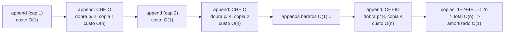
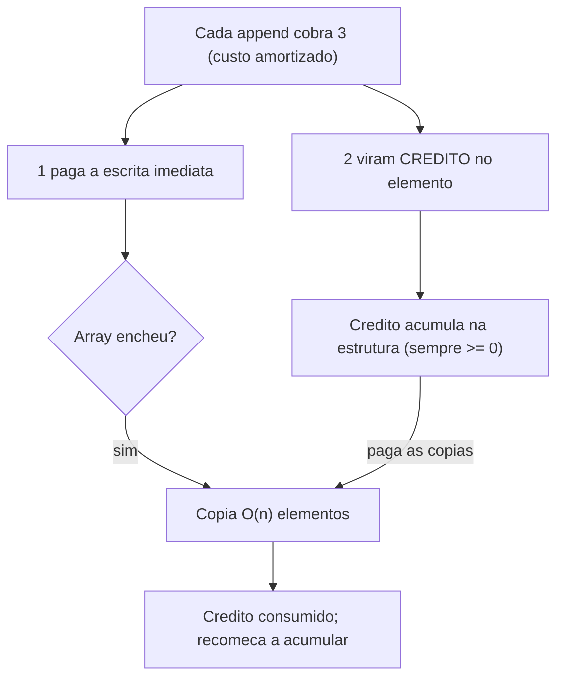

# Complexidade Amortizada: Métodos Agregado, de Crédito (Accounting) e do Potencial

> **Bloco:** Complexidade e análise algorítmica · **Nível:** Intermediário/Avançado · **Tempo de leitura:** ~30 min

## TL;DR

Análise amortizada calcula o **custo médio por operação sobre uma sequência de operações no pior caso**, garantindo que mesmo que *algumas* operações sejam caras, o **custo médio ao longo da sequência seja baixo**. A distinção crucial: é uma média **determinística sobre uma sequência**, não uma média probabilística sobre entradas (isso é caso médio — ver `02-pior-melhor-e-caso-medio.md`). O exemplo canônico é o **array dinâmico (ArrayList, vector, slice)**: a maioria dos `append` é O(1), mas quando o array enche, ele **dobra de capacidade** copiando todos os `n` elementos — uma operação O(n) cara. Apesar desses picos, o custo **amortizado** de cada `append` é **O(1)**, porque as cópias caras são raras o suficiente para serem "diluídas" pelos muitos appends baratos. Três métodos formalizam isso: **agregado** (aggregate) — soma o custo total de `n` operações e divide por `n`; **crédito/contábil** (accounting) — cobra um "preço" fixo de cada operação, guardando o excedente como crédito que paga as operações caras; **potencial** (potential) — define uma função de potencial `Φ` (energia armazenada na estrutura) e mostra que cada operação tem custo amortizado baixo. A armadilha de entrevista é dizer que array dinâmico é O(1) "no pior caso" (errado — um append isolado é O(n)) ou confundir amortizado com caso médio.

## O problema que resolve

Considere a operação `append` num array dinâmico (a estrutura por trás de `ArrayList` em Java, `vector` em C++, `list` em Python, `slice` em Go). Você quer reportar sua complexidade. Olhando uma operação isolada, há um dilema:

- Na **maioria** das vezes, há espaço livre: o append escreve no próximo slot e termina em O(1).
- Mas **ocasionalmente**, o array está cheio: é preciso alocar um array maior, **copiar todos os `n` elementos existentes** e só então inserir — O(n).

Se você reportar o pior caso de uma operação, dirá "append é O(n)" — tecnicamente verdade para *aquela* operação específica, mas **profundamente enganoso** como caracterização da estrutura. Porque essas operações O(n) são **raras**: entre cada redimensionamento, há muitos appends O(1). Se você fizer 1 milhão de appends sequenciais, o custo *total* não é 1 milhão × O(n) — está muito longe disso. Reportar O(n) por append superestima grosseiramente o custo real de usar a estrutura.

Por outro lado, reportar "append é O(1)" sem qualificação é igualmente impreciso — esconde que existem operações caras. E você *não pode* usar análise de caso médio aqui, porque não há nada probabilístico: dado um array em determinado estado, o custo do próximo append é **determinístico** (ou tem espaço, ou não tem). Não há distribuição de entradas para tirar média.

A análise amortizada resolve exatamente essa lacuna. Ela responde à pergunta certa: **"Se eu fizer uma longa sequência de operações nesta estrutura, qual o custo médio por operação — contando os picos caros, mas reconhecendo que eles são raros?"** A resposta para o array dinâmico é **O(1) amortizado**: ao longo de qualquer sequência de `n` appends, o custo total é O(n), logo o custo médio por append é O(1). É uma **garantia sobre a sequência** (determinística, no pior caso de sequência), não uma esperança probabilística.

A pergunta central que a análise amortizada responde: **"Como caracterizar honestamente o custo de uma estrutura cujas operações têm custo irregular — barato quase sempre, caro de vez em quando — de modo que o número reflita o custo real de usá-la em sequência?"** Sem ela, você ou superestima (reportando o pior caso pontual) ou subestima (ignorando os picos). Com ela, você obtém um número justo e defensável: o custo amortizado.

## O que é (definição aprofundada)

**Análise amortizada** é uma técnica para determinar o **custo médio por operação sobre uma sequência de operações no pior caso**, sem recorrer a probabilidade. A garantia que ela fornece é forte: *para qualquer sequência de `n` operações*, o custo total é no máximo `n × (custo amortizado)`. Não importa o quão azarada seja a sequência — a média se mantém.

A intuição financeira esclarece o nome: assim como uma despesa grande (comprar uma máquina) é "amortizada" ao longo de meses no orçamento, um custo computacional grande (copiar todo o array) é "diluído" ao longo das muitas operações baratas que o cercam. O custo amortizado é o "custo por parcela".

Três métodos formalizam a análise amortizada, do mais simples ao mais poderoso.

### Método agregado (aggregate)

O mais direto: **calcule o custo total `T(n)` de uma sequência de `n` operações no pior caso, e o custo amortizado é `T(n)/n`** — o mesmo custo para todas as operações.

Para o array dinâmico que **dobra** quando cheio (começando com capacidade 1): considere `n` appends. A maioria custa 1 (escrever no slot). As cópias acontecem quando o array enche — nas capacidades 1, 2, 4, 8, ..., até `n`. O custo total das cópias é:

`1 + 2 + 4 + 8 + ... + n ≤ 2n` (soma de uma série geométrica que é menor que o dobro do último termo).

Somando o custo das escritas (`n`) e das cópias (`< 2n`): `T(n) < 3n = O(n)`. Portanto o custo amortizado por append é `T(n)/n = O(n)/n = O(1)`.

A chave do truque é a **série geométrica**: porque a capacidade *dobra*, os redimensionamentos ficam exponencialmente mais raros à medida que crescem, e a soma de todas as cópias é apenas **linear** em `n`, não quadrática. Se em vez de dobrar você **somasse uma constante** à capacidade a cada redimensionamento (crescer de 1 em 1, ou de 10 em 10), os redimensionamentos seriam frequentes, o custo total seria O(n²), e o amortizado por append seria O(n) — péssimo. **É por isso que arrays dinâmicos dobram (crescem por fator multiplicativo), nunca somam constante.**

O método agregado é simples mas tem limitação: dá o mesmo custo amortizado para *todas* as operações, mesmo quando elas têm custos amortizados diferentes. Para análises mais finas, usam-se os outros dois métodos.

### Método contábil / de crédito (accounting)

A ideia: **atribua a cada operação um "custo amortizado" (uma cobrança fixa) que pode diferir do custo real.** Quando o custo amortizado cobrado é *maior* que o custo real, a diferença vira **crédito** armazenado na estrutura. Quando uma operação cara aparece, ela usa o crédito acumulado para pagar o excedente. A regra de validade: **o crédito total nunca pode ficar negativo** — você não pode gastar o que não acumulou. Se essa invariante se mantém, o custo amortizado cobrado é um teto válido para o custo real da sequência.

Para o array dinâmico que dobra: cobre **3 unidades** por append (esse é o custo amortizado proposto).

- 1 unidade paga a escrita imediata do elemento.
- 2 unidades viram crédito guardado *no próprio elemento recém-inserido*.

Por que 2 de crédito? Quando o array dobra (digamos, de capacidade `k` para `2k`), é preciso copiar `k` elementos. A questão é: há crédito suficiente para pagar essas `k` cópias? Sim: desde o último redimensionamento, a metade nova do array (os últimos `k/2`... — na verdade, com o esquema de dobra, cada elemento contribui 2 de crédito, e isso cobre a cópia dele próprio mais a de um elemento "antigo" que já gastou seu crédito). O esquema clássico do CLRS mostra que cobrar 3 por inserção mantém o crédito sempre não-negativo, provando custo amortizado O(1). A metáfora: cada elemento "paga adiantado" pela cópia futura que vai sofrer.

O método contábil é intuitivo quando você consegue identificar *quem* paga *o quê* — útil quando diferentes operações têm custos amortizados diferentes (ex.: numa pilha com operação `multipop`, cada `push` cobra 2 para pré-pagar seu eventual `pop`).

### Método do potencial (potential)

O mais geral e poderoso. Define-se uma **função de potencial** `Φ(D)` que mapeia o estado da estrutura `D` para um número real — uma espécie de "energia armazenada" ou "trabalho pré-pago" embutido no estado atual. O custo amortizado de uma operação é definido como:

`custo_amortizado = custo_real + Φ(D_depois) − Φ(D_antes)`

Em palavras: o custo amortizado de uma operação é seu custo real **mais a variação de potencial** que ela causa. Operações baratas que *aumentam* o potencial (acumulam energia) têm custo amortizado um pouco maior que o real (estão "poupando"); operações caras que *consomem* o potencial (liberam energia) têm custo amortizado menor que o real (estão "gastando a poupança"). A condição de validade: `Φ` deve começar em 0 (`Φ(D₀) = 0`) e nunca ficar negativa (`Φ(Dᵢ) ≥ 0`). Sob essas condições, a soma dos custos amortizados é um teto para a soma dos custos reais (os termos telescópicos de `Φ` se cancelam, sobrando `Φ_final − Φ_inicial ≥ 0`).

Para o array dinâmico, uma função de potencial clássica (CLRS) é:

`Φ = 2 · num − tamanho`

onde `num` é o número de elementos e `tamanho` é a capacidade alocada. Imediatamente após um redimensionamento, `num = tamanho/2`, então `Φ = 2·(tamanho/2) − tamanho = 0` (energia zerada). Conforme você faz appends sem redimensionar, `num` cresce e `Φ` aumenta (acumulando energia). Quando o array enche (`num = tamanho`), `Φ = 2·tamanho − tamanho = tamanho` — há energia acumulada exatamente igual ao custo da cópia que vem a seguir. O append que dispara o redimensionamento tem custo real O(n) (a cópia), mas a queda de `Φ` (de `tamanho` para 0) absorve esse custo, deixando o custo amortizado em O(1). A análise mostra que cada append, redimensionando ou não, tem custo amortizado constante (tipicamente 3).

O método do potencial é o preferido em análises sofisticadas (splay trees, Fibonacci heaps, union-find com compressão de caminho) porque a função `Φ` captura, num único número, a "dívida" ou "crédito" embutido em estados complexos.

### Os três métodos comparados

| Método | Ideia central | Quando brilha | Resultado para array dinâmico |
|---|---|---|---|
| **Agregado** | Custo total / `n`; mesmo custo p/ todas | Análise simples, operações uniformes | O(1) por append |
| **Contábil (accounting)** | Cobra preço fixo; excedente vira crédito; crédito ≥ 0 | Custos amortizados diferentes por operação; raciocínio "quem paga" | Cobra 3 por append → O(1) |
| **Potencial** | `Φ` = energia do estado; amortizado = real + ΔΦ | Estados complexos; estruturas avançadas | `Φ = 2·num − tamanho` → O(1) |

Os três sempre dão o **mesmo** resultado para o custo amortizado (eles são lentes diferentes para o mesmo fenômeno); a escolha é sobre conveniência de prova.

### Por que dobrar — e o trade-off do fator de crescimento

A propriedade que torna o array dinâmico O(1) amortizado é o **crescimento multiplicativo** (dobrar). O fator de crescimento exato é um trade-off:

- **Fator 2 (dobrar):** simples, redimensionamentos raros (log n vezes ao crescer até n), mas desperdiça até ~50% de memória logo após um redimensionamento (capacidade `2k` com só `k+1` elementos). Java `ArrayList` cresce ~1,5×; C++ `std::vector` frequentemente 2× (libstdc++) ou 1,5× (MSVC).
- **Fator menor (ex.: 1,5):** menos desperdício de memória, mas redimensionamentos mais frequentes (constante amortizada maior). Há também um argumento sutil de reutilização de memória: com fator < φ (≈1,618, a razão áurea), o bloco liberado por um redimensionamento pode eventualmente ser reaproveitado pelo alocador para o próximo, o que favorece fatores como 1,5.

O ponto invariante: **qualquer fator constante > 1 dá O(1) amortizado**; somar uma constante (fator não-multiplicativo) dá O(n) amortizado. O fator específico afeta a *constante* (memória vs. frequência de cópia), não a *classe*.

### Glossário rápido

- **Custo amortizado:** custo médio por operação sobre uma sequência no pior caso; garantia determinística sobre a sequência.
- **Método agregado:** custo total `T(n)` dividido por `n`; mesmo custo amortizado para todas as operações.
- **Método contábil (accounting):** cobra um custo amortizado fixo; excedente vira crédito (≥ 0) que paga operações caras.
- **Método do potencial:** `Φ(D)` = energia do estado; `amortizado = real + ΔΦ`; exige `Φ ≥ 0` e `Φ(D₀) = 0`.
- **Crédito:** trabalho pré-pago armazenado (método contábil), análogo ao potencial.
- **Redimensionamento (resize):** alocar array maior e copiar elementos quando a capacidade enche.
- **Fator de crescimento:** múltiplo pelo qual a capacidade cresce no resize (2×, 1,5×); precisa ser > 1.
- **Série geométrica:** `1 + 2 + 4 + ... + n < 2n`; razão pela qual dobrar dá custo total linear.

## Como funciona

A receita para uma análise amortizada, em qualquer método:

**Método agregado, passo a passo:**

1. Escolha uma sequência de `n` operações (a pior possível, para garantir o teto).
2. Some o custo real de todas — separando as baratas das caras.
3. Para estruturas que dobram, a soma das operações caras é uma série geométrica → linear.
4. Divida o total por `n` → custo amortizado.

**Método contábil, passo a passo:**

1. Proponha um custo amortizado (uma cobrança) para cada tipo de operação.
2. Mostre que, em qualquer ponto, o crédito acumulado (cobranças − custos reais) é ≥ 0.
3. Se o crédito nunca fica negativo, a cobrança é um teto válido → custo amortizado.

**Método do potencial, passo a passo:**

1. Defina `Φ(D)` ≥ 0 com `Φ(D₀) = 0`, capturando a "energia" do estado.
2. Para cada operação, calcule `amortizado = real + Φ(depois) − Φ(antes)`.
3. Mostre que esse valor é baixo (constante) para toda operação → custo amortizado.

### A intuição unificadora

Os três métodos partilham uma ideia: **operações baratas "poupam" para pagar as caras**. No agregado, isso é implícito na soma. No contábil, é explícito (crédito). No potencial, é abstrato (energia `Φ`). A operação cara (a cópia O(n)) não é gratuita — ela é *pré-paga* pelas O(n) operações baratas que vieram antes desde o último resize. Como há exatamente ~`n` appends baratos entre resizes de tamanho `n`, cada um "deixa" uma fração constante para pagar a cópia futura. O equilíbrio fecha em O(1) por operação.

### Amortizado vs pior caso de uma operação isolada

É vital separar duas grandezas:

- **Pior caso de UMA operação:** O(n) — um append individual pode disparar a cópia.
- **Amortizado por operação sobre a sequência:** O(1) — em média, ao longo de `n` appends, cada um custa constante.

Ambas são verdadeiras simultaneamente. A distinção importa em sistemas com **latência sensível**: um append amortizado O(1) ainda tem **picos de latência O(n)** quando redimensiona. Para a maioria das aplicações (throughput), o amortizado é o que conta. Mas para **sistemas de tempo real** (controle, áudio, garantias hard de latência), um pico O(n) imprevisível pode ser inaceitável — e aí se preferem estruturas com pior caso O(1) *garantido por operação* (não só amortizado), como arrays dinâmicos "incrementais" que espalham a cópia, ou estruturas que pré-alocam.

## Diagrama de fluxo

O primeiro diagrama mostra o crescimento do array dinâmico e onde os custos O(n) acontecem; o segundo, o modelo de crédito do método contábil.





## Exemplo prático / caso real

Considere o serviço de **ingestão de eventos de um sistema de analytics** de uma plataforma brasileira. Eventos chegam em rajadas e são acumulados num buffer em memória (um array dinâmico) antes do flush em lote para o storage. A estrutura faz milhões de `append` por segundo no pico.

**Por que o array dinâmico é a escolha certa.** O custo amortizado O(1) por append é o que viabiliza o throughput. Se cada append fosse genuinamente O(n) (como seria com crescimento por constante, ou com uma lista que realoca a cada inserção), ingerir `n` eventos custaria O(n²) — inviável para milhões de eventos. Com dobra de capacidade, ingerir `n` eventos custa O(n) total: a maioria dos appends é escrita direta, e as raras cópias (acontecem ~log₂(n) vezes) somam, pela série geométrica, apenas O(n). O sistema sustenta o throughput porque o **custo amortizado**, não o pior caso pontual, é o que governa o consumo agregado de CPU.

**O pico de latência que apareceu nas métricas.** Mesmo com amortizado O(1), a equipe notou **spikes periódicos de latência** no p99.9 da ingestão. A causa: quando o buffer crescia e precisava redimensionar (digamos, de 8 milhões para 16 milhões de slots), aquele append específico pagava o O(n) de copiar 8 milhões de elementos — um pico de dezenas de milissegundos no meio de operações de microssegundos. O amortizado O(1) é honesto sobre o *custo agregado*, mas **esconde a variância**: a cauda da latência (p99.9) é dominada por esses redimensionamentos. As correções aplicadas:

- **Pré-alocar capacidade** (`reserve`/`ensureCapacity`) quando o tamanho aproximado é conhecido — elimina os resizes, removendo os picos. Esta é a otimização mais comum: se você sabe que vai inserir ~10M elementos, aloque 10M de uma vez e todos os appends são O(1) reais.
- Para o caso de tamanho desconhecido onde a latência hard importa, considerar uma estrutura que **espalha a cópia** (incremental resizing) ou um buffer em chunks (deque/rope), trocando o pico O(n) por um custo O(1) de pior caso por operação, à custa de constante maior.

**A pegadinha de capacity planning.** Outro time reportou no design doc que "o append é O(n) no pior caso" e dimensionou CPU como se *toda* ingestão fosse quadrática — superdimensionando a infraestrutura em ordens de magnitude. O erro foi confundir o **pior caso de uma operação isolada** (O(n), real, mas raro) com o **custo de uma sequência** (O(n) total, O(1) amortizado por op). O dimensionamento correto usa o amortizado para throughput agregado e o pior caso pontual só para a análise de latência de cauda.

Pseudocódigo do array dinâmico com dobra:

```
append(arr, elemento):
    se arr.num == arr.capacidade:           # array cheio
        nova_cap = arr.capacidade * 2        # DOBRA (crescimento multiplicativo)
        novo = aloca(nova_cap)
        copia(arr.dados -> novo, arr.num)    # custo O(n) -- o pico
        arr.dados = novo
        arr.capacidade = nova_cap
    arr.dados[arr.num] = elemento            # custo O(1) -- o caso comum
    arr.num = arr.num + 1
# Amortizado: O(1) por append; pior caso de UMA operacao: O(n).
```

Estruturas reais que dependem dessa análise: `ArrayList`/`Vector` (Java), `std::vector` (C++), `list` (Python, com over-allocation), `slice` (Go, com `append` que dobra até certo ponto e depois cresce ~1,25×), `Vec` (Rust), `StringBuilder` (concatenação amortizada O(1)). Além do array dinâmico, a análise amortizada também caracteriza: **union-find** com compressão de caminho (quase O(1) amortizado, α(n) inverso de Ackermann), **splay trees** (O(log n) amortizado), **Fibonacci heaps** (decrease-key O(1) amortizado), e **hash tables** com rehashing (O(1) amortizado de inserção, análogo ao array).

## Quando usar / Quando evitar

**Use a análise amortizada** para caracterizar estruturas cujas operações têm **custo irregular mas padrão previsível**: array dinâmico, hash table com rehashing, union-find, splay tree, Fibonacci heap. É a forma honesta de reportar o custo dessas estruturas — nem o pior caso pontual (superestima) nem um O(1) sem qualificação (esconde os picos).

**Use o amortizado para dimensionar throughput** e custo agregado de CPU — é o que governa o consumo total ao longo de muitas operações.

**Não confie só no amortizado quando a latência de cauda importa.** Em sistemas de tempo real, controle, áudio/vídeo de baixa latência, ou qualquer caso com garantia *hard* de latência por operação, os picos O(n) dos redimensionamentos são inaceitáveis. Aí: pré-aloque capacidade, use estruturas de pior caso O(1) por operação, ou espalhe o custo (incremental resizing).

**Não use análise amortizada quando o custo NÃO é irregular** — se toda operação tem o mesmo custo (acesso a array, push em pilha sobre array pré-alocado), a análise de pior caso simples basta; amortizar não acrescenta nada.

## Anti-padrões e armadilhas comuns

- **Confundir amortizado com caso médio.** A armadilha de entrevista número um. **Amortizado** = média *determinística sobre uma sequência de operações* (garantida, sem probabilidade). **Caso médio** = média *probabilística sobre entradas diferentes* (depende de distribuição). Array dinâmico é O(1) **amortizado** (garantido sobre qualquer sequência); hash table é O(1) **médio** (depende de boa distribuição de hash). Ver `02-pior-melhor-e-caso-medio.md`.
- **Dizer que array dinâmico é O(1) "no pior caso".** Errado: um append individual que dispara resize é O(n) no pior caso. O O(1) é **amortizado**. Sempre use a palavra "amortizado".
- **Reportar O(n) por append e superdimensionar.** O oposto: tratar o pior caso pontual (raro) como o custo de toda operação, inflando o capacity planning. Use o amortizado para throughput.
- **Crescer a capacidade por constante em vez de fator.** Adicionar +1 (ou +k fixo) a cada resize faz os redimensionamentos frequentes e o custo total O(n²) → amortizado O(n) por append, péssimo. **Sempre cresça por fator multiplicativo (> 1).** Este é um bug de performance clássico e silencioso.
- **Ignorar a variância em sistemas de latência sensível.** O amortizado O(1) esconde picos O(n). Se você tem SLA de latência por operação (não só throughput), os resizes aparecem no p99.9. Pré-aloque ou use estrutura de pior caso garantido.
- **Esquecer de pré-alocar quando o tamanho é conhecido.** Se você sabe que vai inserir ~N elementos, alocar capacidade N de uma vez elimina todos os resizes e seus picos. Deixar a estrutura crescer organicamente quando o tamanho é conhecido é desperdício evitável.
- **Achar que os três métodos dão resultados diferentes.** Agregado, contábil e potencial são lentes diferentes para o mesmo fenômeno — sempre dão o mesmo custo amortizado. A escolha é só sobre qual prova é mais conveniente.
- **Violar a invariante do método (crédito negativo, Φ negativo).** No contábil, o crédito nunca pode ficar negativo; no potencial, `Φ ≥ 0` e `Φ(D₀) = 0`. Uma prova que viola isso não é válida.
- **Esquecer o shrink.** Algumas estruturas encolhem quando ficam muito vazias. Encolher na metade quando o array fica meio vazio causa **thrashing** (resize repetido na fronteira). A solução clássica: só encolher quando cai a 1/4 da capacidade (histerese), preservando o O(1) amortizado.

## Relação com outros conceitos

- **Pior, melhor e caso médio** (`02-pior-melhor-e-caso-medio.md`): amortizado é uma *quarta* noção de custo, frequentemente confundida com caso médio; a distinção (sequência determinística vs distribuição probabilística) é o ponto crítico.
- **Notação assintótica** (`01-notacao-assintotica-big-o-theta-omega.md`): o custo amortizado é expresso na mesma notação (O(1) amortizado, O(log n) amortizado).
- **Time vs space tradeoffs** (`04-time-vs-space-complexity-tradeoffs.md`): o fator de crescimento do array é um trade-off direto entre tempo (frequência de cópia) e espaço (memória desperdiçada).
- **Estruturas de dados dinâmicas** (bloco 12): array dinâmico (ArrayList/vector/slice), hash table com rehashing, union-find, splay tree, Fibonacci heap — todas caracterizadas por análise amortizada.
- **Tabelas hash** (bloco 12/13): inserção é O(1) amortizado (por causa do rehashing periódico, análogo ao resize do array) E O(1) médio (por causa da distribuição de hash) — um exemplo onde *ambas* as noções se aplicam por motivos diferentes.
- **Algoritmos em grafos** (bloco 13): Kruskal/conectividade usam union-find, cujo custo quase-constante por operação é resultado de análise amortizada.
- **Latência de cauda e observabilidade** (blocos 07/09): os picos O(n) dos resizes aparecem no p99.9; conhecer isso explica spikes de latência aparentemente inexplicáveis.

## Modelo mental para o arquiteto

Três ideias para carregar:

1. **Amortizado é média sobre uma sequência, garantida e determinística — não probabilística.** É a diferença com caso médio. Array dinâmico é O(1) amortizado *para qualquer sequência*; nenhuma sorte é assumida. Confundir os dois é o erro de entrevista mais comum sobre o tema.
2. **Dobrar é o que torna append O(1) amortizado.** O crescimento multiplicativo torna os resizes exponencialmente raros, e a série geométrica das cópias soma apenas linear. Crescer por constante quebra tudo (O(n²) total). Esse é o insight de design por trás de toda estrutura dinâmica.
3. **O amortizado governa o throughput, mas esconde a variância.** O custo agregado é O(1) por operação, mas cada operação pode pontualmente custar O(n) (o resize). Para throughput, use o amortizado; para latência de cauda hard, conheça os picos e pré-aloque ou use estrutura de pior caso garantido.

## Pontos para fixar (revisão)

- **Amortizado** = custo médio por operação sobre uma **sequência no pior caso**; garantia determinística, **não** probabilística.
- **Array dinâmico:** append é **O(1) amortizado** (mas O(n) no pior caso de uma operação isolada — o resize).
- **Dobrar a capacidade** torna os resizes raros; pela **série geométrica** (`1+2+4+...< 2n`), o total de cópias é O(n) → amortizado O(1). Crescer por constante daria O(n²).
- **Três métodos:** **agregado** (`T(n)/n`), **contábil** (cobra preço fixo; crédito ≥ 0), **potencial** (`amortizado = real + ΔΦ`, com `Φ ≥ 0`). Todos dão o mesmo resultado.
- Função de potencial clássica do array: **`Φ = 2·num − tamanho`** (zero após resize, igual ao custo da cópia quando cheio).
- **Amortizado ≠ caso médio:** amortizado é sobre sequência (determinístico); médio é sobre distribuição de entradas (probabilístico).
- O amortizado **governa throughput** mas **esconde picos** O(n) — para latência hard, pré-aloque (`reserve`) ou use pior caso garantido.
- Outras estruturas amortizadas: hash table (rehashing), union-find (compressão de caminho), splay tree, Fibonacci heap.

## Referências

- [Amortized analysis — Wikipedia](https://en.wikipedia.org/wiki/Amortized_analysis)
- [Dynamic array — Wikipedia (crescimento geométrico, fator, amortizado O(1))](https://en.wikipedia.org/wiki/Dynamic_array)
- [Lecture 11: Amortized Analysis (CLRS Cap. 17) — MIT OpenCourseWare 6.046J](https://ocw.mit.edu/courses/6-046j-design-and-analysis-of-algorithms-spring-2012/83b82d45beb3776da72b7f3e1b3f42df_MIT6_046JS12_lec11.pdf)
- [Lecture 21: Amortized analysis and dynamic tables — Cornell CS3110](https://www.cs.cornell.edu/courses/cs3110/2009sp/lectures/lec21.html)
- [Amortized Analysis (agregado, contábil, potencial) — CMU 15-451](https://www.cs.cmu.edu/~15451-f23/lectures/lecture05-amortized.pdf)
- [Introduction to Algorithms (6.006), Spring 2020 — MIT OpenCourseWare](https://ocw.mit.edu/courses/6-006-introduction-to-algorithms-spring-2020/)
- [Big-O Algorithm Complexity Cheat Sheet](https://www.bigocheatsheet.com/)
