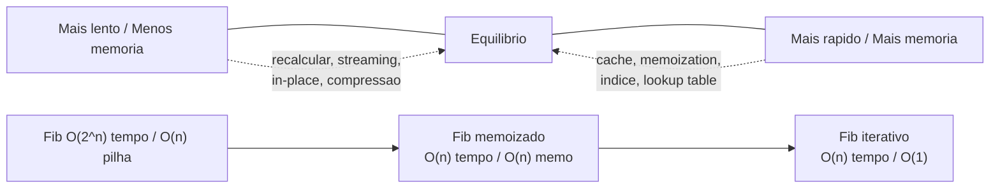
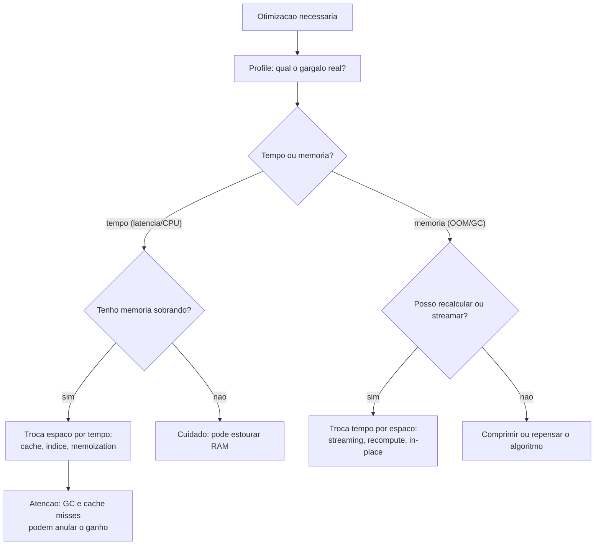

# Complexidade de Tempo vs. Espaço e os Trade-offs

> **Bloco:** Complexidade e análise algorítmica · **Nível:** Intermediário/Avançado · **Tempo de leitura:** ~30 min

## TL;DR

Todo algoritmo consome dois recursos que crescem com a entrada: **tempo** (operações executadas) e **espaço** (memória usada). A **complexidade de espaço** mede como o uso de memória cresce com `n`, na mesma notação assintótica do tempo (O, Ω, Θ). O ponto arquitetural central é que **tempo e espaço são frequentemente intercambiáveis**: você pode **gastar memória para ganhar velocidade** (caching, memoization, hash tables, lookup tables, índices, pré-computação) ou **gastar tempo para economizar memória** (recalcular em vez de armazenar, processar em streaming, compressão, algoritmos in-place). Esse é o **space-time tradeoff**, um dos princípios mais recorrentes em engenharia. Exemplos: memoization transforma o Fibonacci de O(2ⁿ) tempo / O(n) pilha para O(n) tempo / O(n) memória; um índice de banco de dados gasta espaço em disco para transformar buscas O(n) em O(log n); merge sort usa O(n) de memória extra para garantir O(n log n) previsível, enquanto quicksort é in-place (O(log n) de pilha) mas com pior caso O(n²). Há também a distinção entre **espaço auxiliar** (memória extra além da entrada) e **espaço total** (incluindo a entrada). A armadilha clássica é otimizar tempo cegamente ignorando que a memória estourou (OOM, pressão de GC, cache misses) — em sistemas reais, **memória é frequentemente o gargalo antes da CPU**.

## O problema que resolve

Quando você analisa um algoritmo, é natural focar no tempo — quantas operações ele faz. Mas tempo não é o único recurso finito. Cada algoritmo também consome **memória**: as estruturas de dados que ele aloca, a pilha de chamadas recursivas, os buffers, os caches. E memória, como tempo, **cresce com a entrada** — e tem um limite rígido. Um algoritmo O(n log n) em tempo que use O(n²) em espaço pode ser rápido o suficiente, mas **estourar a RAM** (Out Of Memory) muito antes de o tempo virar problema.

Aqui está a tensão: as duas dimensões frequentemente **se opõem**. Para deixar algo mais rápido, a técnica mais comum é **lembrar resultados** em vez de recalculá-los — o que custa memória. Para economizar memória, a técnica mais comum é **recalcular** em vez de armazenar — o que custa tempo. Você raramente otimiza as duas ao mesmo tempo; quase sempre **troca uma pela outra**. Decidir qual sacrificar é uma decisão de engenharia que depende de qual recurso é o gargalo no seu contexto.

Considere três cenários concretos:

- **Você tem RAM sobrando e o gargalo é latência.** Gaste memória: cache agressivo, índices, lookup tables, pré-computação. Trocar espaço por tempo.
- **Você processa um dataset que não cabe na memória** (terabytes de logs). Gaste tempo: streaming, processar em chunks, recalcular. Trocar tempo por espaço — você *não tem* a opção de carregar tudo.
- **Você roda num dispositivo embarcado / função serverless com memória apertada.** Memória é o recurso escasso e caro; algoritmos in-place e estruturas compactas valem mais que microssegundos de CPU.

A pergunta central que este tema responde: **"Dado que tempo e espaço são intercambiáveis, qual deles é o meu gargalo real — e como troco o recurso abundante pelo escasso?"** Responder isso bem é o que separa uma otimização que ajuda de uma que apenas move o problema (ou cria um novo: você acelerou a CPU e estourou a RAM). É um tema central porque, em sistemas reais, **a memória frequentemente esgota antes da CPU** — pressão de GC, cache misses, OOM kills — e otimizar só tempo ignorando espaço é uma das fontes mais comuns de incidentes de produção.

## O que é (definição aprofundada)

### Complexidade de espaço

**Complexidade de espaço** é a medida de como a quantidade de memória usada por um algoritmo cresce em função do tamanho da entrada `n`, expressa em notação assintótica (O, Ω, Θ) — exatamente como a complexidade de tempo, mas contando *memória* em vez de *operações*.

O que conta como "memória usada"? Aqui surge uma distinção importante:

- **Espaço total:** toda a memória, incluindo a própria entrada. Um algoritmo que recebe um array de `n` elementos já usa O(n) de espaço total só para guardar a entrada.
- **Espaço auxiliar (auxiliary space):** a memória **extra** que o algoritmo aloca *além* da entrada — estruturas temporárias, buffers, a pilha de recursão. Quando alguém diz "este algoritmo usa O(1) de espaço", quase sempre se refere ao **espaço auxiliar** O(1) (não conta a entrada). Um algoritmo **in-place** é aquele com espaço auxiliar O(1) (ou O(log n) para a pilha, em algumas definições) — ele opera sobre a entrada sem alocar memória proporcional a `n`.

Esta distinção é fonte de confusão: dizer "ordenação in-place usa O(1) de espaço" significa O(1) **auxiliar** — a entrada de `n` elementos obviamente ocupa O(n), mas o algoritmo não aloca *nada extra* proporcional a `n` (só algumas variáveis).

### O que contribui para a complexidade de espaço

1. **Estruturas de dados auxiliares:** um hash set para detectar duplicatas (O(n)), uma matriz de DP (O(n²)), uma cópia do array (O(n)).
2. **A pilha de recursão (call stack):** cada chamada recursiva empilha um frame. Uma recursão de profundidade `d` usa O(d) de espaço de pilha. O Fibonacci recursivo tem profundidade O(n) → O(n) de pilha; merge sort tem profundidade O(log n) → O(log n) de pilha (além do buffer de merge). Recursão profunda demais causa **stack overflow** — um limite de espaço, não de tempo.
3. **Buffers de I/O e acumuladores.**

### Complexidade de espaço por estrutura/algoritmo (espaço auxiliar)

| Algoritmo / Estrutura | Espaço auxiliar | Observação |
|---|---|---|
| Busca binária (iterativa) | O(1) | Só algumas variáveis |
| Busca binária (recursiva) | O(log n) | Pilha de recursão |
| Insertion / selection / bubble sort | O(1) | In-place |
| **Quicksort** | O(log n) | In-place + pilha (pior caso O(n) de pilha) |
| **Merge sort** | **O(n)** | Buffer de merge — não é in-place |
| Heap sort | O(1) | In-place |
| Hash table | O(n) | Armazena os elementos |
| Fibonacci recursivo ingênuo | O(n) | Pilha (profundidade n) |
| Fibonacci com memoization | O(n) | Tabela de memo |
| Fibonacci iterativo (2 variáveis) | O(1) | Só guarda os dois últimos |
| DP tabular 2D | O(n·m) | Matriz; frequentemente reduzível a O(min(n,m)) |

### O space-time tradeoff: as duas direções

O princípio: **muitos problemas admitem soluções num espectro entre "mais rápido, mais memória" e "mais lento, menos memória"**. As técnicas:

**Trocar espaço por tempo (gastar memória para ganhar velocidade):**

- **Memoization / caching:** guardar resultados de computações caras para reutilizá-los. Transforma recomputação repetida em lookup O(1). É a base da programação dinâmica e de caches de aplicação.
- **Lookup tables / pré-computação:** computar uma tabela uma vez e consultá-la depois (ex.: tabela de senos pré-calculada, CRC tables, contagem de bits). Troca cálculo por leitura.
- **Hash tables / índices:** O(1) ou O(log n) de busca à custa de O(n) de espaço armazenando a estrutura. Um índice de banco de dados é o exemplo arquetípico: gasta espaço em disco para transformar `O(n)` full scan em `O(log n)` busca por B-tree.
- **Desnormalização e materialização:** em bancos, duplicar dados (materialized views) para evitar joins caros em tempo de query.

**Trocar tempo por espaço (gastar tempo para economizar memória):**

- **Recalcular em vez de armazenar:** se um valor é barato de recomputar e caro de guardar, recompute-o.
- **Streaming / processamento incremental:** processar dados em fluxo, mantendo só uma janela pequena na memória, em vez de carregar tudo. Permite processar datasets maiores que a RAM, à custa de não poder "voltar".
- **Compressão:** armazenar dados comprimidos (menos espaço) e descomprimir ao usar (mais tempo de CPU).
- **Algoritmos in-place:** ordenar/transformar sobre a própria entrada sem cópia auxiliar (heap sort, quicksort) — economiza O(n) de espaço à custa de, às vezes, pior caso de tempo ou complexidade de implementação.

### O exemplo canônico: Fibonacci

O Fibonacci ilustra os três pontos do espectro num único problema:

1. **Recursivo ingênuo:** `fib(n) = fib(n-1) + fib(n-2)`. Tempo **O(2ⁿ)** (recalcula os mesmos subproblemas exponencialmente), espaço **O(n)** (profundidade da pilha). Catastrófico em tempo.
2. **Com memoization (top-down DP):** guarda cada `fib(k)` calculado numa tabela. Cada subproblema é calculado **uma vez**. Tempo **O(n)**, espaço **O(n)** (tabela + pilha). Trocou-se O(n) de memória por uma redução de O(2ⁿ) para O(n) em tempo — um negócio espetacular.
3. **Iterativo com duas variáveis:** percebe-se que só os dois últimos valores importam. Tempo **O(n)**, espaço **O(1)**. Reduziu o espaço de volta a constante sem perder o tempo linear.

A progressão (1)→(2) é trocar espaço por tempo (memoization). A progressão (2)→(3) é uma otimização de espaço que reconhece que a tabela inteira é desnecessária — só a janela ativa importa. O Fibonacci é didático porque mostra que o tradeoff não é sempre "um pelo outro": às vezes uma visão melhor do problema melhora *ambos* (de O(2ⁿ)/O(n) para O(n)/O(1)).

### Glossário rápido

- **Complexidade de espaço:** crescimento do uso de memória em função de `n` (notação O/Ω/Θ).
- **Espaço total:** toda a memória, incluindo a entrada.
- **Espaço auxiliar:** memória extra além da entrada; o que normalmente se reporta.
- **In-place:** algoritmo com espaço auxiliar O(1) (ou O(log n) de pilha); opera sobre a entrada sem cópia proporcional a `n`.
- **Space-time tradeoff:** intercâmbio entre tempo e espaço; otimizar um frequentemente piora o outro.
- **Memoization:** cachear resultados de subproblemas para evitar recomputação (troca espaço por tempo).
- **Lookup table / pré-computação:** computar uma tabela uma vez e consultá-la depois.
- **Streaming:** processar dados em fluxo, mantendo memória pequena (troca tempo por espaço).
- **Call stack / pilha de recursão:** memória usada por chamadas recursivas; profundidade `d` → O(d).
- **OOM (Out Of Memory):** falha por esgotamento de memória — o limite rígido do eixo espaço.

## Como funciona

A análise de espaço segue a mesma mecânica da análise de tempo, mas contando memória:

**Conte a memória extra alocada em função de `n`.** Um array auxiliar de tamanho `n` → O(n). Uma matriz `n × n` → O(n²). Um número fixo de variáveis → O(1). Some o maior contribuinte (domina, como nos termos de tempo).

**Não esqueça a pilha de recursão.** É o erro mais comum em análise de espaço. Uma função recursiva que parece "não alocar nada" ainda usa O(profundidade) de espaço de pilha. Profundidade da recursão = altura da árvore de chamadas. Recursão linear (Fibonacci ingênuo, percorrer lista) → O(n); recursão "dividir e conquistar" balanceada (merge sort, busca binária) → O(log n).

**Separe espaço total de auxiliar e seja explícito sobre qual reporta.** "Merge sort é O(n) de espaço" refere-se ao auxiliar (o buffer); a entrada já é O(n) de qualquer forma.

### O processo de decisão do tradeoff

Para decidir qual recurso trocar, o raciocínio é:

1. **Identifique o gargalo real.** Profile. É CPU (tempo) ou memória (espaço/GC/cache)? Não otimize às cegas — você pode estar acelerando o que não é o problema.
2. **Veja qual recurso é abundante.** Servidor com 256 GB de RAM e latência crítica? Gaste memória (cache, índice). Função serverless com 128 MB e CPU folgada? Gaste tempo (streaming, recompute).
3. **Considere o custo de cada recurso no seu contexto.** Na nuvem, memória e CPU têm preços; às vezes mais CPU é mais barato que mais RAM, ou vice-versa. O tradeoff tem uma dimensão econômica direta.
4. **Cuidado com efeitos de segunda ordem.** Mais memória → mais pressão de GC (em linguagens gerenciadas) → mais pausas → pior latência. Mais memória → pior localidade de cache → mais cache misses → o "ganho" de tempo evapora. Otimizar tempo via memória pode *piorar* o tempo se quebrar a hierarquia de cache.

### A hierarquia de memória complica o tradeoff

O modelo simples "espaço vs tempo" assume que toda memória custa igual acessar — mas não custa. A **hierarquia de memória** (registradores → L1/L2/L3 cache → RAM → disco/SSD → rede) tem latências que variam por ordens de magnitude (L1 ~1ns, RAM ~100ns, SSD ~100µs, disco ~10ms). Uma estrutura compacta que cabe no cache L2 pode ser **dramaticamente mais rápida** que uma estrutura "maior mas O(1)" que vive na RAM e causa cache misses. É por isso que, na prática, um array contíguo (boa localidade) frequentemente bate uma lista ligada (mesma complexidade de tempo, péssima localidade) — a constante escondida da hierarquia de memória domina. O tradeoff espaço-tempo real, em hardware moderno, é frequentemente "espaço *compacto e local*" vs "espaço *grande e disperso*", não só "muito espaço vs pouco".

## Diagrama de fluxo

O primeiro diagrama mostra o espectro do tradeoff; o segundo, o fluxo de decisão sobre qual recurso trocar.





## Exemplo prático / caso real

Considere o sistema de **busca de produtos de um marketplace brasileiro** com 50 milhões de SKUs, e três decisões de tradeoff que a equipe enfrentou.

**1. Índice: gastar espaço em disco para acelerar busca.** Sem índice, encontrar produtos por categoria exige um **full table scan** — O(n) lendo os 50 milhões de registros, lento e custoso em I/O. A solução clássica: criar um **índice B-tree** sobre a coluna de categoria. O índice transforma a busca em O(log n) — ~26 acessos em vez de 50 milhões. O custo: o índice **ocupa espaço em disco** (frequentemente uma fração significativa da própria tabela) e **torna escritas mais lentas** (toda inserção/atualização precisa manter o índice). Este é o space-time tradeoff puro: gasta-se espaço (índice) e tempo de escrita para ganhar tempo de leitura. A decisão depende da razão leitura/escrita — para um catálogo (muitas leituras, poucas escritas), índices valem muito; para uma tabela de log de alta escrita, índices demais degradam a ingestão.

**2. Cache: gastar RAM para evitar recomputar.** A página de um produto agrega preço, estoque, avaliações e recomendações — caro de montar (várias queries e chamadas). Em vez de remontar a cada acesso (tempo alto, repetido), o sistema **cacheia** a página renderizada em Redis (gasta RAM/memória do cache). Acessos subsequentes são O(1) de lookup em vez de O(várias queries). O tradeoff: memória do cache + complexidade de invalidação (manter o cache coerente com os dados) em troca de latência drasticamente menor e menos carga no banco. O risco de segunda ordem que apareceu: o cache cresceu tanto que a pressão de memória no Redis começou a causar evicções e a degradar o hit rate — lembrando que "gastar memória" tem um teto, e além dele o ganho reverte.

**3. Streaming: gastar tempo para não estourar a memória.** Um job noturno precisava reprocessar **todos os 50 milhões de produtos** para recalcular um score de relevância. A primeira versão carregava todos na memória de uma vez — e estourava (OOM) num pod com limite de memória do Kubernetes. A correção foi **processar em streaming**: ler os produtos em lotes (chunks de 10 mil), processar, escrever o resultado, e descartar o lote antes de carregar o próximo. Espaço caiu de O(n) (tudo na RAM) para O(tamanho do lote) = O(1) em relação a `n`. O custo: o job ficou um pouco mais lento (overhead de I/O por lote) e **não pode olhar dados fora da janela atual** (se o cálculo precisasse de visão global, streaming não serviria sem ajustes). Mas trocou um job que *não rodava* (OOM) por um que roda — o melhor tipo de tradeoff.

**A pegadinha do Fibonacci na entrevista.** Num processo seletivo, um candidato escreveu o Fibonacci recursivo ingênuo (O(2ⁿ)) e, ao ser questionado sobre otimização, adicionou memoization — corretamente reduzindo para O(n) tempo. O entrevistador então perguntou: "e se a memória for o gargalo?". A resposta esperada: a versão iterativa com duas variáveis, O(n) tempo / **O(1) espaço**, porque só os dois últimos valores importam. Reconhecer que a tabela de memoization inteira é desnecessária — que basta uma janela — é exatamente o raciocínio de tradeoff de espaço que a pergunta testa.

Pseudocódigo das três versões do Fibonacci:

```
# (1) Recursivo: O(2^n) tempo, O(n) pilha -- recalcula tudo
fib(n):
    se n <= 1: retorna n
    retorna fib(n-1) + fib(n-2)

# (2) Memoizado: O(n) tempo, O(n) memoria -- troca espaco por tempo
fib_memo(n, cache={}):
    se n <= 1: retorna n
    se n em cache: retorna cache[n]       # lookup O(1) em vez de recalcular
    cache[n] = fib_memo(n-1) + fib_memo(n-2)
    retorna cache[n]

# (3) Iterativo: O(n) tempo, O(1) espaco -- so a janela importa
fib_iter(n):
    a, b = 0, 1
    repete n vezes:
        a, b = b, a + b                    # guarda so os dois ultimos
    retorna a
```

## Quando usar / Quando evitar

**Troque espaço por tempo (cache, índice, memoization, lookup table)** quando: a latência é o gargalo; há memória disponível; os dados são acessados repetidamente (cache compensa); ou há subproblemas sobrepostos (memoization/DP). É a otimização default quando RAM é abundante e velocidade importa.

**Troque tempo por espaço (streaming, recompute, in-place, compressão)** quando: a memória é o recurso escasso (embarcado, serverless, datasets maiores que a RAM); o valor é barato de recomputar; ou você processa um fluxo que não cabe na memória. Streaming é a única opção quando o dataset excede a RAM disponível.

**Prefira algoritmos in-place** (heap sort, quicksort) quando memória é apertada e você pode tolerar suas características (quicksort: pior caso O(n²); heap sort: má localidade de cache). **Prefira merge sort** (O(n) auxiliar) quando precisa de estabilidade e previsibilidade e tem memória de sobra.

**Evite** otimizar tempo cegamente sem checar o impacto na memória — acelerar a CPU e estourar a RAM (OOM) ou disparar GC é trocar um problema por outro pior. **Evite** assumir que "mais memória = mais rápido" sem considerar a hierarquia de cache — estruturas grandes e dispersas podem ser mais lentas que compactas. **Evite** cachear sem estratégia de invalidação/eviction — cache que cresce sem limite vira o novo gargalo de memória.

## Anti-padrões e armadilhas comuns

- **Esquecer a pilha de recursão na análise de espaço.** O erro mais comum. Uma função recursiva "que não aloca nada" usa O(profundidade) de pilha. Fibonacci ingênuo é O(n) de espaço *por causa da pilha*, não O(1). Recursão profunda demais causa **stack overflow** — um limite de espaço.
- **Confundir espaço total com auxiliar.** "Ordenação in-place usa O(1) de espaço" — auxiliar O(1); a entrada de `n` elementos ainda ocupa O(n). Sempre explicite qual está reportando.
- **Otimizar tempo ignorando memória (e estourar).** Carregar tudo na RAM para "ir mais rápido" e tomar OOM. Em sistemas reais, **memória frequentemente esgota antes da CPU**. Profile os dois eixos.
- **Cache sem eviction/invalidação.** Cachear para ganhar tempo, mas o cache cresce sem limite e vira o gargalo de memória (ou serve dados stale). Todo cache precisa de política de eviction (LRU, TTL) e invalidação.
- **Assumir "mais memória = mais rápido" ignorando a hierarquia de cache.** Uma estrutura grande e dispersa (lista ligada, hash com má localidade) pode ser mais lenta que uma compacta (array contíguo) de mesma complexidade, por causa de cache misses. A constante da hierarquia de memória domina na prática.
- **Memoization que vaza memória.** Cachear resultados indefinidamente num processo de longa duração faz o cache crescer sem limite. Use cache com tamanho limitado (LRU) se o domínio de chaves é grande.
- **Ignorar a pressão de GC.** Em linguagens gerenciadas (Java, Go, C#), alocar muita memória de curta duração para "ganhar tempo" aumenta a frequência de GC, cujas pausas pioram a latência — anulando o ganho. Mais alocação ≠ mais rápido.
- **DP tabular com matriz completa quando a janela basta.** Muitos problemas de DP usam uma matriz O(n·m) mas só precisam da linha/coluna anterior — reduzindo para O(min(n,m)) ou O(1) de espaço. Alocar a matriz inteira quando uma janela serve é desperdício (e às vezes a diferença entre rodar e OOM).
- **Não considerar o custo econômico.** Na nuvem, CPU e memória têm preços distintos. O tradeoff "ótimo" tecnicamente pode ser subótimo financeiramente — às vezes recalcular (CPU barata) bate cachear (RAM cara), ou vice-versa.

## Relação com outros conceitos

- **Notação assintótica** (`01-notacao-assintotica-big-o-theta-omega.md`): a complexidade de espaço usa a mesma notação O/Ω/Θ aplicada a memória em vez de tempo.
- **Complexidade amortizada** (`03-complexidade-amortizada.md`): o fator de crescimento do array dinâmico é um tradeoff espaço-tempo (memória desperdiçada vs frequência de cópia).
- **Análise de recursão** (`05-analise-de-recursao-arvore-e-master-theorem.md`): a profundidade da recursão determina o espaço de pilha; a recorrência de espaço é analisada como a de tempo.
- **Programação dinâmica** (bloco 13): memoization (top-down) e tabulação (bottom-up) são o exemplo central de trocar espaço por tempo; otimização de espaço (janela rolante) reduz a memória da DP.
- **Estruturas de dados** (bloco 12): hash tables, índices e árvores gastam espaço para acelerar busca; arrays (compactos, boa localidade) vs listas ligadas (dispersas) ilustram o efeito da hierarquia de cache.
- **Sorting** (bloco 13): merge sort (O(n) auxiliar, previsível) vs quicksort/heap sort (in-place) é uma decisão de tradeoff de espaço.
- **Caching e performance** (bloco 07): caches de aplicação (Redis, CDN), materialized views e índices são o space-time tradeoff em escala arquitetural.
- **Banco de dados** (bloco 15): índices, desnormalização e materialização gastam espaço (e tempo de escrita) para acelerar leituras.

## Modelo mental para o arquiteto

Três ideias para carregar:

1. **Tempo e espaço são dois eixos, e geralmente você troca um pelo outro.** Acelerar quase sempre custa memória (cache, índice, memoization); economizar memória quase sempre custa tempo (recompute, streaming). Raramente otimiza os dois — exceto quando uma visão melhor do problema melhora ambos (Fibonacci de O(2ⁿ)/O(n) para O(n)/O(1)).
2. **Identifique o gargalo real antes de trocar.** Profile os dois eixos. Em sistemas reais, a memória frequentemente esgota antes da CPU (OOM, GC, cache misses). Otimizar o eixo errado é desperdício; pior, otimizar tempo às custas de memória pode causar o incidente que você queria evitar.
3. **A hierarquia de memória reescreve o tradeoff.** "Mais memória = mais rápido" só vale se a memória extra não quebrar a localidade de cache. Estruturas compactas e contíguas frequentemente batem estruturas grandes e dispersas de mesma complexidade. O tradeoff real é espaço *compacto e local* vs *grande e disperso*.

## Pontos para fixar (revisão)

- **Complexidade de espaço** mede o crescimento da memória com `n`, na mesma notação O/Ω/Θ do tempo.
- **Espaço auxiliar** (memória extra além da entrada) é o que normalmente se reporta; **in-place** = auxiliar O(1) (ou O(log n) de pilha).
- A **pilha de recursão** conta no espaço: profundidade `d` → O(d); esquecer isso é o erro mais comum (e causa stack overflow).
- **Space-time tradeoff:** gastar memória acelera (cache, índice, memoization, lookup table); gastar tempo economiza memória (streaming, recompute, in-place, compressão).
- **Fibonacci:** ingênuo O(2ⁿ)/O(n) → memoizado O(n)/O(n) → iterativo O(n)/**O(1)** (só a janela importa).
- **Merge sort** usa O(n) auxiliar (previsível); **quicksort/heap sort** são in-place.
- **Índice de BD** = space-time tradeoff arquetípico: gasta espaço e tempo de escrita para tornar leitura O(n) → O(log n).
- Em sistemas reais, **memória frequentemente esgota antes da CPU** (OOM, GC, cache misses) — sempre profile os dois eixos.
- A **hierarquia de memória** domina constantes: estrutura compacta e local frequentemente bate grande e dispersa de mesma complexidade.

## Referências

- [Space–time tradeoff — Wikipedia](https://en.wikipedia.org/wiki/Space%E2%80%93time_tradeoff)
- [Space complexity — Wikipedia](https://en.wikipedia.org/wiki/Space_complexity)
- [Big-O Algorithm Complexity Cheat Sheet (tempo e espaço por algoritmo)](https://www.bigocheatsheet.com/)
- [Introduction to Algorithms (6.006), Spring 2020 — MIT OpenCourseWare](https://ocw.mit.edu/courses/6-006-introduction-to-algorithms-spring-2020/)
- [Big-O notation (article) — Khan Academy](https://www.khanacademy.org/computing/computer-science/algorithms/asymptotic-notation/a/big-o-notation)
- [Latency Numbers Every Programmer Should Know (hierarquia de memória) — GitHub Gist (Jeff Dean)](https://gist.github.com/jboner/2841832)
- [VisuAlgo — Sorting (compare merge sort O(n) auxiliar vs in-place)](https://visualgo.net/en/sorting)
