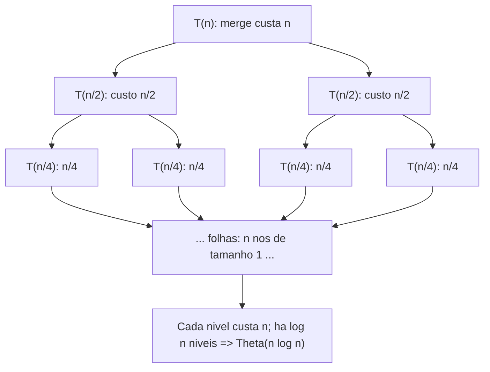
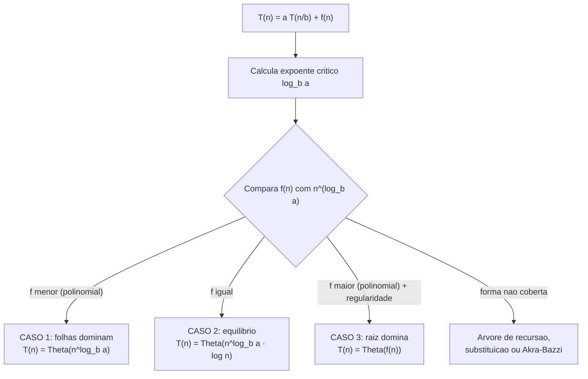

# Análise de Recursão: Árvore de Recursão e Master Theorem

> **Bloco:** Complexidade e análise algorítmica · **Nível:** Intermediário/Avançado · **Tempo de leitura:** ~32 min

## TL;DR

Algoritmos recursivos têm seu custo descrito por uma **recorrência** (recurrence relation): uma equação que expressa `T(n)` (o custo de uma entrada de tamanho `n`) em termos de `T` de entradas menores. Para algoritmos de **dividir e conquistar** (divide and conquer) — que quebram o problema em `a` subproblemas de tamanho `n/b` e gastam `f(n)` para dividir e combinar — a recorrência tem a forma canônica **`T(n) = a·T(n/b) + f(n)`**. Duas ferramentas resolvem essas recorrências. A **árvore de recursão** (recursion tree) é o método visual: desenha-se a árvore de chamadas, soma-se o trabalho por nível, e soma-se os níveis — revelando a estrutura do custo (e dando intuição). O **Master Theorem** (teorema mestre) é o atalho fechado: comparando `f(n)` com `n^(log_b a)` (o custo das folhas), ele entrega a resposta em três casos. **Caso 1**: as folhas dominam → `T(n) = Θ(n^(log_b a))`. **Caso 2**: trabalho equilibrado entre os níveis → `T(n) = Θ(n^(log_b a) · log n)`. **Caso 3**: a raiz domina → `T(n) = Θ(f(n))`. Exemplos: merge sort (`T(n)=2T(n/2)+Θ(n)`) cai no caso 2 → Θ(n log n); busca binária (`T(n)=T(n/2)+Θ(1)`) → Θ(log n). O Master Theorem não cobre tudo (subproblemas de tamanhos diferentes, gaps entre os casos) — aí entram árvore de recursão, substituição, ou Akra–Bazzi.

## O problema que resolve

Analisar a complexidade de um loop é direto: conte as iterações. Mas e um algoritmo que **se chama recursivamente**? Considere o merge sort: ele divide o array em duas metades, ordena cada metade *chamando a si mesmo*, e depois mescla os resultados em tempo linear. Quanto custa isso, no total?

A dificuldade é que o custo de `mergesort(n)` depende do custo de `mergesort(n/2)`, que depende de `mergesort(n/4)`, e assim por diante, até os casos-base. Não há um loop simples para contar — o trabalho está espalhado por uma **árvore de chamadas** que se ramifica. Tentar somar isso "na mão" é confuso e propenso a erro. Você precisa de uma forma sistemática de capturar e resolver essa estrutura recursiva.

A solução tem duas partes. Primeiro, **expressar o custo como uma recorrência** — uma equação que diz "o custo de tamanho `n` é o custo dos subproblemas mais o trabalho de dividir/combinar". Para o merge sort: `T(n) = 2·T(n/2) + Θ(n)` — dois subproblemas de metade do tamanho, mais Θ(n) para mesclar. A recorrência captura *exatamente* a estrutura do algoritmo numa equação.

Segundo, **resolver a recorrência** — transformá-la de uma definição auto-referente numa fórmula fechada (`Θ(n log n)`). É aqui que entram a árvore de recursão (visual, dá intuição) e o Master Theorem (fórmula pronta para o caso comum).

A pergunta central que este tema responde: **"Dado um algoritmo recursivo de dividir e conquistar, qual a sua complexidade — e como derivo isso sem desenhar a árvore inteira toda vez?"** Dominar isso é essencial porque a maioria dos algoritmos eficientes e elegantes (merge sort, quicksort, busca binária, FFT, multiplicação de Strassen, muitos algoritmos de geometria computacional) é recursiva, e suas complexidades famosas (Θ(n log n), Θ(log n)) *vêm* dessa análise. Em entrevistas, "analise a complexidade desta função recursiva" é uma pergunta clássica, e o Master Theorem é a ferramenta que dá a resposta em segundos para o caso padrão.

## O que é (definição aprofundada)

### Recorrência (recurrence relation)

Uma **recorrência** é uma equação que define `T(n)` em termos dos seus próprios valores para entradas menores, mais um caso-base. Ela traduz a estrutura recursiva do algoritmo numa equação matemática. A forma geral de dividir e conquistar:

> `T(n) = a·T(n/b) + f(n)`, com caso-base `T(1) = Θ(1)`

Os parâmetros têm significado concreto no algoritmo:

- **`a`** = número de subproblemas (quantas chamadas recursivas cada nível faz). `a ≥ 1`.
- **`b`** = fator de redução do tamanho (cada subproblema tem tamanho `n/b`). `b > 1`.
- **`f(n)`** = custo do trabalho **fora** da recursão: dividir o problema e combinar as soluções dos subproblemas.

Exemplos de tradução algoritmo → recorrência:

| Algoritmo | `a` | `b` | `f(n)` | Recorrência |
|---|---|---|---|---|
| **Merge sort** | 2 | 2 | Θ(n) (merge) | `T(n) = 2T(n/2) + Θ(n)` |
| **Busca binária** | 1 | 2 | Θ(1) (comparação) | `T(n) = T(n/2) + Θ(1)` |
| **Quicksort (balanceado)** | 2 | 2 | Θ(n) (partição) | `T(n) = 2T(n/2) + Θ(n)` |
| **Multiplicação Strassen** | 7 | 2 | Θ(n²) | `T(n) = 7T(n/2) + Θ(n²)` |
| **Travessia de árvore binária** | 2 | 2 | Θ(1) | `T(n) = 2T(n/2) + Θ(1)` |

### Árvore de recursão (recursion tree)

A **árvore de recursão** é um método **visual e intuitivo** para resolver recorrências. Você expande a recorrência num diagrama de árvore:

- A **raiz** representa a chamada inicial, com custo `f(n)` (o trabalho não-recursivo daquele nível).
- Cada nó com problema de tamanho `m` tem **`a` filhos**, cada um com problema de tamanho `m/b`, e custo `f(m/b)`.
- A árvore continua até as **folhas**, que são os casos-base (tamanho 1).

Para resolver, você:

1. **Soma o custo de cada nível** (todos os nós naquele nível).
2. **Conta o número de níveis** (a altura da árvore = `log_b n`, porque o tamanho cai por fator `b` a cada nível até chegar a 1).
3. **Soma os custos de todos os níveis.**

Para o merge sort (`T(n) = 2T(n/2) + Θ(n)`):

- **Nível 0 (raiz):** 1 nó, custo `n`. Total do nível: `n`.
- **Nível 1:** 2 nós, cada um custo `n/2`. Total: `2 · (n/2) = n`.
- **Nível 2:** 4 nós, cada um custo `n/4`. Total: `4 · (n/4) = n`.
- ...
- **Nível `k`:** `2^k` nós, cada custo `n/2^k`. Total: `n`.

**Cada nível custa `n`**. E há `log₂ n` níveis (até os subproblemas virarem tamanho 1). Logo `T(n) = n · log₂ n = Θ(n log n)`. A árvore *mostra* por que o merge sort é n log n: trabalho linear repetido a cada um dos log n níveis.

O número de **folhas** é `a^(altura) = a^(log_b n) = n^(log_b a)`. Para merge sort, `2^(log₂ n) = n` folhas — cada folha é um elemento individual. Esse `n^(log_b a)` é a grandeza-chave que o Master Theorem usa.

A árvore de recursão é insubstituível para **construir intuição** e para recorrências que o Master Theorem não cobre (tamanhos de subproblema diferentes). Sua desvantagem é ser trabalhosa e propensa a erro se feita sem cuidado — daí o Master Theorem como atalho.

### Master Theorem (teorema mestre)

O **Master Theorem** dá a solução fechada de `T(n) = a·T(n/b) + f(n)` comparando `f(n)` com **`n^(log_b a)`** (o custo total das folhas, a "força" da recursão). A intuição: há uma competição entre o trabalho das **folhas** (que cresce com `a`, o número de subproblemas) e o trabalho da **raiz/níveis altos** (que é `f(n)`). Quem domina determina o resultado.

Seja `c_crit = log_b a` o **expoente crítico**. Os três casos:

**Caso 1 — as folhas dominam.** Se `f(n) = O(n^(c_crit − ε))` para algum `ε > 0` (ou seja, `f(n)` cresce **polinomialmente mais devagar** que `n^(log_b a)`), então o trabalho aumenta a cada nível descendo a árvore, e as folhas dominam:

> `T(n) = Θ(n^(log_b a))`

**Caso 2 — trabalho equilibrado.** Se `f(n) = Θ(n^(c_crit))` (ou seja, `f(n)` cresce **na mesma taxa** que `n^(log_b a)`), então cada nível custa aproximadamente o mesmo, e há `log n` níveis:

> `T(n) = Θ(n^(log_b a) · log n)`

(Forma generalizada: se `f(n) = Θ(n^(c_crit) · log^k n)`, então `T(n) = Θ(n^(c_crit) · log^(k+1) n)`.)

**Caso 3 — a raiz domina.** Se `f(n) = Ω(n^(c_crit + ε))` para algum `ε > 0` (`f(n)` cresce **polinomialmente mais rápido** que `n^(log_b a)`) **e** satisfaz a **condição de regularidade** (`a·f(n/b) ≤ c·f(n)` para algum `c < 1` e `n` grande), então o trabalho diminui descendo a árvore e a raiz domina:

> `T(n) = Θ(f(n))`

### Aplicando o Master Theorem aos exemplos

| Recorrência | `log_b a` | `f(n)` vs `n^(log_b a)` | Caso | Resultado |
|---|---|---|---|---|
| `T(n)=2T(n/2)+Θ(n)` (merge sort) | `log₂2 = 1` | `n` vs `n¹` → iguais | **2** | `Θ(n log n)` |
| `T(n)=T(n/2)+Θ(1)` (busca binária) | `log₂1 = 0` | `1` vs `n⁰=1` → iguais | **2** | `Θ(log n)` |
| `T(n)=2T(n/2)+Θ(1)` (travessia árvore) | `log₂2 = 1` | `1` vs `n¹` → folhas maiores | **1** | `Θ(n)` |
| `T(n)=7T(n/2)+Θ(n²)` (Strassen) | `log₂7 ≈ 2.807` | `n²` vs `n^2.807` → folhas maiores | **1** | `Θ(n^2.807)` |
| `T(n)=2T(n/2)+Θ(n²)` | `log₂2 = 1` | `n²` vs `n¹` → raiz maior | **3** | `Θ(n²)` |
| `T(n)=4T(n/2)+Θ(n)` | `log₂4 = 2` | `n` vs `n²` → folhas maiores | **1** | `Θ(n²)` |

Repare na mecânica: calcule `log_b a`, compare com o expoente de `f(n)`, e o caso decorre. Merge sort e busca binária são ambos caso 2 (equilíbrio), o que explica por que ambos têm um fator `log n` no resultado.

### Quando o Master Theorem NÃO se aplica

O Master Theorem é poderoso mas não universal. Ele **não resolve**:

- **Subproblemas de tamanhos diferentes:** `T(n) = T(n/3) + T(2n/3) + Θ(n)` (não tem um único `b`). Use árvore de recursão ou **Akra–Bazzi** (generalização do Master Theorem para essas formas).
- **`a` ou `b` não constantes**, ou `a < 1`.
- **Gaps entre os casos:** se `f(n)` cresce mais devagar que `n^(log_b a)` mas **não polinomialmente** (ex.: por um fator `log n` só), nenhum dos três casos clássicos se aplica diretamente (há uma extensão para o caso 2, mas o gap entre caso 1 e 2, ou 2 e 3, pode escapar).
- **Recorrências de subtração** como `T(n) = T(n-1) + Θ(n)` (não é divisão por `b`). Essa, por exemplo, resolve por árvore/substituição para `Θ(n²)` — é a recorrência do quicksort no pior caso.

Para esses, use **árvore de recursão**, o **método de substituição** (chutar a resposta e provar por indução), ou **Akra–Bazzi**.

### Glossário rápido

- **Recorrência:** equação que define `T(n)` em termos de `T` de entradas menores.
- **Dividir e conquistar:** estratégia de quebrar em `a` subproblemas de tamanho `n/b`, resolver e combinar.
- **`a`:** número de subproblemas (ramificação da árvore).
- **`b`:** fator de redução do tamanho do subproblema.
- **`f(n)`:** custo de dividir e combinar (trabalho não-recursivo por nível).
- **Árvore de recursão:** método visual; soma trabalho por nível × número de níveis.
- **`n^(log_b a)`:** custo total das folhas; a grandeza com que `f(n)` é comparada.
- **Expoente crítico:** `log_b a`.
- **Master Theorem:** solução fechada de `T(n)=aT(n/b)+f(n)` em três casos.
- **Condição de regularidade:** `a·f(n/b) ≤ c·f(n)`, `c < 1`; exigida no caso 3.
- **Método de substituição:** chutar a solução e provar por indução.
- **Akra–Bazzi:** generalização do Master Theorem para subproblemas de tamanhos diferentes.

## Como funciona

A receita prática para analisar um algoritmo recursivo:

**Passo 1 — escrever a recorrência.** Identifique `a` (quantas chamadas recursivas), `b` (por quanto o tamanho é dividido) e `f(n)` (o trabalho fora das chamadas). Olhe o código: o número de chamadas recursivas é `a`; o argumento dessas chamadas (`n/2`, `n/3`) dá `b`; e todo o resto (loops, particionamento, merge) é `f(n)`.

**Passo 2 — tentar o Master Theorem.** Se a forma é `a·T(n/b) + f(n)` com `a, b` constantes e `f(n)` polinomial:

1. Calcule `c_crit = log_b a`.
2. Compare `f(n)` com `n^(c_crit)`:
   - `f` polinomialmente menor → **caso 1** → `Θ(n^(c_crit))`.
   - `f` da mesma ordem → **caso 2** → `Θ(n^(c_crit) log n)`.
   - `f` polinomialmente maior (e regularidade) → **caso 3** → `Θ(f(n))`.

**Passo 3 — se o Master Theorem não se aplica, usar árvore de recursão ou substituição.** Para subproblemas de tamanhos diferentes ou recorrências de subtração, desenhe a árvore (some por nível × níveis) ou chute a resposta e prove por indução.

### A intuição central: folhas vs raiz

O insight que unifica os três casos: a árvore de recursão tem trabalho concentrado em algum lugar.

- Se o trabalho **cresce descendo** a árvore (cada nível custa mais que o anterior), as **folhas dominam** → caso 1, resultado `n^(log_b a)`. Acontece quando há muitos subproblemas (`a` grande) e `f` pequeno.
- Se o trabalho é **constante por nível** (cada nível custa o mesmo), o resultado é `(custo por nível) × (número de níveis)` = `n^(log_b a) × log n` → caso 2. É o equilíbrio do merge sort.
- Se o trabalho **diminui descendo** (a raiz é o nível mais caro), a **raiz domina** → caso 3, resultado `f(n)`. Acontece quando `f` é grande e a recursão é "fraca".

Conhecer essa intuição permite *prever* o caso antes de calcular: "merge sort tem trabalho linear repetido em cada um dos log n níveis → n log n" sem nem invocar a fórmula.

### Por que a altura é log_b n

Cada nível reduz o tamanho do subproblema por fator `b`. Partindo de `n` e dividindo por `b` repetidamente até chegar a 1: `n → n/b → n/b² → ... → 1`. O número de divisões necessárias é `log_b n`. Por isso a árvore tem `log_b n` níveis — e por isso recorrências de dividir e conquistar quase sempre têm um `log n` em algum lugar (é a altura da árvore). A base `b` do log não importa na notação (muda só por constante).

## Diagrama de fluxo

O primeiro diagrama é a árvore de recursão do merge sort (mostrando que cada nível custa `n`); o segundo é o fluxo de decisão do Master Theorem.





## Exemplo prático / caso real

Considere o time de **dados de uma plataforma de pagamentos brasileira** que precisa ordenar e buscar em grandes volumes de transações, e usa a análise de recorrências para escolher e justificar algoritmos.

**Merge sort: por que é Θ(n log n) e por que isso importa.** O relatório diário precisa ordenar ~100 milhões de transações por valor. A equipe escolheu merge sort (estável e previsível). A recorrência é `T(n) = 2T(n/2) + Θ(n)`: divide em duas metades (2 subproblemas), cada uma de tamanho `n/2`, e mescla em tempo linear. Pelo Master Theorem, `log₂2 = 1`, `f(n) = n = n¹` → caso 2 → **Θ(n log n)**. Concretamente: `100M × log₂(100M) ≈ 100M × 27 ≈ 2,7 bilhões` de operações. Comparado a um insertion sort O(n²) — `100M² = 10¹⁶` operações, completamente inviável (anos de processamento) — a diferença entre n log n e n² é o que torna o relatório possível. A árvore de recursão *mostra* o porquê: trabalho linear (a mesclagem) repetido em cada um dos 27 níveis.

**Busca binária: por que é Θ(log n).** Para localizar uma transação por ID num array ordenado de 100 milhões, a busca binária tem recorrência `T(n) = T(n/2) + Θ(1)`: uma chamada recursiva (descarta metade), sobre metade do tamanho, com trabalho constante (uma comparação). Master Theorem: `log₂1 = 0`, `f(n) = 1 = n⁰` → caso 2 → **Θ(log n)** = `log₂(100M) ≈ 27` comparações. A árvore aqui é degenerada (um filho por nó), com 27 níveis de trabalho constante → 27 operações. É a justificativa formal de por que índices de banco (B-trees) dão busca logarítmica.

**A recorrência que revelou um bug de performance.** Um engenheiro escreveu uma função recursiva para processar uma árvore de categorias que, a cada nó, **reprocessava toda a subárvore** em vez de só o nó. A recorrência virou algo como `T(n) = 2T(n/2) + Θ(n)` na intenção, mas o código real fazia `T(n) = 2T(n/2) + Θ(n²)` (o trabalho por nó era quadrático, não linear). Pelo Master Theorem, `log₂2 = 1`, `f(n) = n²` é polinomialmente maior que `n¹` → caso 3 → **Θ(n²)** em vez do Θ(n log n) esperado. A análise de recorrência *quantificou* a regressão (de n log n para n²) e apontou exatamente onde estava: no `f(n)` quadrático. A correção tornou o trabalho por nó linear, devolvendo o Θ(n log n).

**Strassen: quando otimizar o `a` vale a pena.** A multiplicação de matrizes ingênua é Θ(n³). O algoritmo de Strassen reduz o número de multiplicações recursivas de 8 para **7**: `T(n) = 7T(n/2) + Θ(n²)`. Master Theorem: `log₂7 ≈ 2,807`, comparado a `f(n) = n²` → folhas dominam (caso 1) → **Θ(n^2,807)**, assintoticamente melhor que n³. O exemplo mostra como reduzir `a` (o número de subproblemas) muda a classe de complexidade — embora, na prática, a constante grande de Strassen só compense para matrizes enormes (mais um caso de a teoria informar e a medição decidir).

Pseudocódigo do merge sort, anotado com a recorrência:

```
mergesort(arr):                          # T(n)
    se tamanho(arr) <= 1:                # caso-base T(1) = Theta(1)
        retorna arr
    meio = tamanho(arr) / 2
    esq = mergesort(arr[0:meio])         # T(n/2)  <- subproblema 1 (a=2)
    dir = mergesort(arr[meio:])          # T(n/2)  <- subproblema 2
    retorna merge(esq, dir)              # Theta(n) <- f(n): combinar
# Recorrencia: T(n) = 2 T(n/2) + Theta(n)  =>  caso 2  =>  Theta(n log n)
```

## Quando usar / Quando evitar

**Use o Master Theorem** quando a recorrência tem a forma canônica `a·T(n/b) + f(n)` com `a ≥ 1`, `b > 1` constantes e `f(n)` polinomial (ou polinomial × log^k). É o atalho para a vasta maioria dos algoritmos de dividir e conquistar — merge sort, busca binária, multiplicação rápida, FFT, muitos algoritmos de geometria. Em entrevista, é a forma mais rápida de cravar a complexidade de uma função recursiva padrão.

**Use a árvore de recursão** quando: você quer **intuição** (entender *por que* o resultado é aquele, não só *qual*); o Master Theorem não se aplica (subproblemas de tamanhos diferentes, recorrências de subtração); ou você precisa verificar/derivar manualmente. É o método mais geral e didático, ao custo de ser mais trabalhoso.

**Use o método de substituição** quando você já tem um palpite da resposta e quer prová-lo rigorosamente por indução (comum em provas formais).

**Use Akra–Bazzi** para recorrências com subproblemas de tamanhos diferentes (`T(n) = T(n/3) + T(2n/3) + n`) que o Master Theorem não cobre.

**Evite** aplicar o Master Theorem fora de sua forma (subtração em vez de divisão, `b` variável, gap não-polinomial entre `f` e `n^(log_b a)`) — ele dá resultado errado ou simplesmente não se aplica. **Evite** desenhar a árvore inteira para uma recorrência padrão quando o Master Theorem responde em segundos — reserve a árvore para os casos que precisam dela.

## Anti-padrões e armadilhas comuns

- **Aplicar o Master Theorem a recorrências de subtração.** `T(n) = T(n-1) + Θ(n)` **não** é da forma `aT(n/b)+f(n)` (não há divisão por `b`). Tentar usar o Master Theorem aqui é erro; resolva por árvore/substituição (essa dá Θ(n²) — pior caso do quicksort).
- **Esquecer a condição de regularidade no caso 3.** O caso 3 exige `a·f(n/b) ≤ c·f(n)` com `c < 1`. Funções "bem comportadas" (polinômios) satisfazem, mas é parte da hipótese — omiti-la torna a aplicação incorreta.
- **Ignorar o gap entre os casos.** Se `f(n)` é menor que `n^(log_b a)` mas **não polinomialmente** (só por um fator `log n`), nenhum caso clássico se aplica. Há extensões, mas assumir cegamente o caso 1 ou 2 erra. Reconheça quando o Master Theorem é silencioso.
- **Confundir `a` com `b`.** `a` é quantos subproblemas; `b` é por quanto o tamanho diminui. Para merge sort ambos são 2, o que mascara o erro — mas para busca binária `a=1, b=2` (uma chamada, metade do tamanho); trocá-los dá resposta errada.
- **Contar `f(n)` errado.** `f(n)` é o trabalho **fora** da recursão (dividir + combinar). Incluir o trabalho dos subproblemas em `f(n)` é dupla contagem; esquecer o merge (achar que `f(n)=O(1)` no merge sort) muda o caso e a resposta.
- **Achar que toda recursão dividir-e-conquistar é Θ(n log n).** Só o caso 2 dá n log n. Caso 1 dá `n^(log_b a)` (pode ser linear, quadrático...); caso 3 dá `f(n)`. Merge sort é n log n; travessia de árvore (`2T(n/2)+Θ(1)`) é Θ(n), não n log n.
- **Esquecer o espaço de pilha da recursão.** A análise de recorrência foca no tempo, mas a recursão também consome O(profundidade) de memória de pilha (ver `04-time-vs-space-complexity-tradeoffs.md`). Profundidade = altura da árvore = `log_b n` para dividir-e-conquistar balanceado; O(n) para recursão linear.
- **Confundir o pior caso com o caso balanceado.** A recorrência do quicksort é `2T(n/2)+Θ(n)` (Θ(n log n)) **só quando o pivô divide ao meio**. No pior caso (pivô péssimo), vira `T(n-1)+Θ(n)` = Θ(n²) — uma recorrência de subtração diferente. A forma da recorrência *depende do caso* (ver `02-pior-melhor-e-caso-medio.md`).
- **Memorizar os casos sem a intuição folhas-vs-raiz.** Decorar "caso 1, 2, 3" sem entender que é uma competição entre o trabalho das folhas (`n^(log_b a)`) e da raiz (`f(n)`) leva a erros quando a forma varia. A intuição da árvore é o que torna o teorema robusto.

## Relação com outros conceitos

- **Notação assintótica** (`01-notacao-assintotica-big-o-theta-omega.md`): o resultado da recorrência é expresso em Θ; o Master Theorem compara ordens de crescimento de `f(n)` e `n^(log_b a)`.
- **Pior, melhor e caso médio** (`02-pior-melhor-e-caso-medio.md`): a forma da recorrência depende do caso — quicksort é `2T(n/2)+Θ(n)` (médio/melhor, n log n) mas `T(n-1)+Θ(n)` (pior, n²).
- **Time vs space tradeoffs** (`04-time-vs-space-complexity-tradeoffs.md`): a altura da árvore (`log_b n`) é a profundidade da recursão e o espaço de pilha; recursão linear (O(n) de pilha) vs balanceada (O(log n)).
- **Sorting** (bloco 13): merge sort (`2T(n/2)+Θ(n)` → n log n) e quicksort (médio n log n, pior n²) são os exemplos canônicos de análise de recorrência; o limite inferior Ω(n log n) por comparação contextualiza por que n log n é ótimo.
- **Busca binária** (bloco 13): `T(n)=T(n/2)+Θ(1)` → Θ(log n); a justificativa formal da busca logarítmica.
- **Árvores e estruturas hierárquicas** (bloco 12): travessias e operações em árvores balanceadas têm recorrências de dividir e conquistar; a altura `log n` da árvore balanceada é a mesma `log_b n` da recursão.
- **Programação dinâmica** (bloco 13): DP frequentemente "desenrola" recursões com subproblemas sobrepostos (memoization), trocando a árvore exponencial de recursão ingênua por uma tabela polinomial.

## Modelo mental para o arquiteto

Três ideias para carregar:

1. **Toda recursão de dividir e conquistar vira uma recorrência `aT(n/b)+f(n)`.** Identifique `a` (quantos subproblemas), `b` (redução do tamanho) e `f(n)` (dividir + combinar) lendo o código. A recorrência é a tradução exata da estrutura recursiva numa equação resolvível.
2. **O Master Theorem é uma competição entre folhas e raiz.** Compare `f(n)` com `n^(log_b a)` (custo das folhas): folhas dominam (caso 1, `n^(log_b a)`), empate (caso 2, com `log n` extra), raiz domina (caso 3, `f(n)`). A intuição folhas-vs-raiz é mais robusta que decorar os três casos.
3. **A árvore de recursão dá intuição; o teorema dá velocidade; nem tudo se encaixa.** Use o Master Theorem para o caso padrão (segundos), a árvore para entender o porquê e para formas não cobertas, e Akra–Bazzi/substituição para subproblemas desiguais ou recorrências de subtração. Saber qual ferramenta usar é o domínio.

## Pontos para fixar (revisão)

- Algoritmos recursivos têm o custo descrito por uma **recorrência**; dividir e conquistar tem a forma **`T(n) = aT(n/b) + f(n)`** (`a` subproblemas, tamanho `n/b`, `f(n)` para dividir/combinar).
- **Árvore de recursão:** soma o trabalho por nível × número de níveis (`log_b n`); o número de folhas é `n^(log_b a)`. Dá intuição.
- **Master Theorem** compara `f(n)` com `n^(log_b a)` (expoente crítico `log_b a`):
  - **Caso 1** (`f` menor): folhas dominam → `Θ(n^(log_b a))`.
  - **Caso 2** (`f` igual): equilíbrio → `Θ(n^(log_b a) · log n)`.
  - **Caso 3** (`f` maior + regularidade): raiz domina → `Θ(f(n))`.
- **Merge sort** `2T(n/2)+Θ(n)` → caso 2 → **Θ(n log n)**; **busca binária** `T(n/2)+Θ(1)` → caso 2 → **Θ(log n)**.
- A intuição central é **folhas vs raiz**: quem concentra o trabalho na árvore determina o caso.
- O Master Theorem **não cobre** subproblemas de tamanhos diferentes (use Akra–Bazzi), recorrências de subtração (`T(n-1)+...`, use árvore/substituição), nem gaps não-polinomiais.
- A forma da recorrência **depende do caso**: quicksort é `2T(n/2)+Θ(n)` (médio) vs `T(n-1)+Θ(n)` (pior, Θ(n²)).
- Nem toda recursão dividir-e-conquistar é n log n — só o caso 2; travessia de árvore (`2T(n/2)+Θ(1)`) é Θ(n).

## Referências

- [Master theorem (analysis of algorithms) — Wikipedia](https://en.wikipedia.org/wiki/Master_theorem_(analysis_of_algorithms))
- [Recitation 18: Recursion Trees and the Master Method — Cornell CS3110](https://www.cs.cornell.edu/courses/cs3110/2012fa/recitations/rec18.html)
- [Lecture 20: Recursion Trees and the Master Method — Cornell CS3110](https://www.cs.cornell.edu/courses/cs3110/2012sp/lectures/lec20-master/lec20.html)
- [Master Theorem and Summary of Common Recurrences — Oregon State University](https://web.engr.oregonstate.edu/~huanlian/algorithms_course/1-datastructures/master.html)
- [Introduction to Algorithms (6.006), Spring 2020 — MIT OpenCourseWare](https://ocw.mit.edu/courses/6-006-introduction-to-algorithms-spring-2020/)
- [Introduction to Algorithms (CLRS), MIT Press — capítulos 2 e 4 (Recurrences, Master Theorem)](https://mitpress.mit.edu/9780262046305/introduction-to-algorithms/)
- [VisuAlgo — Visualizing Data Structures and Algorithms](https://visualgo.net/en)
