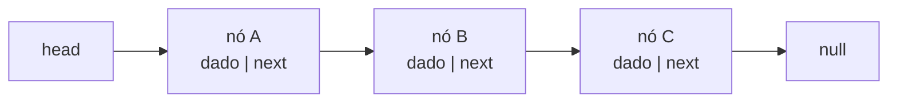
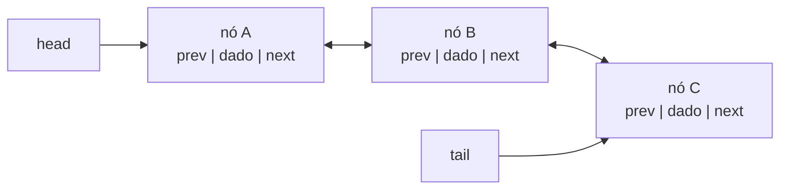
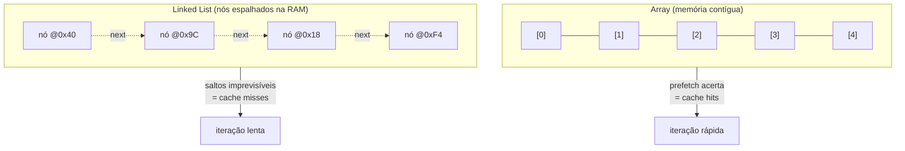

# Arrays (Dinâmicos) e Linked Lists: Acesso, Inserção e Cache Locality

> **Bloco:** Estruturas de dados · **Nível:** Intermediário/Avançado · **Tempo de leitura:** ~26 min

## TL;DR

**Array** e **linked list** são as duas formas fundamentais de representar uma **sequência** de elementos, e a escolha entre elas é a decisão de estrutura de dados mais recorrente que existe. Um **array** armazena elementos em **memória contígua**: o endereço do elemento `i` é `base + i × tamanho`, então o **acesso por índice é O(1)** — a CPU calcula o endereço com uma multiplicação e uma soma. O preço é a **inserção/remoção no meio**, que custa **O(n)** porque exige deslocar todos os elementos seguintes. O **array dinâmico** (`ArrayList`, `std::vector`, `list` do Python, slice do Go) adiciona a capacidade de crescer: quando enche, aloca um novo buffer (tipicamente **2× ou 1.5×** o tamanho), copia tudo e segue — o que dá **append amortizado O(1)** (a cópia ocasional, diluída por muitos appends baratos, sai de graça em média). A **linked list** armazena cada elemento num **nó** espalhado pela memória, com um **ponteiro** para o próximo (e, na duplamente encadeada, para o anterior); inserir/remover dado o nó é **O(1)** (só religa ponteiros), mas o **acesso por índice é O(n)** (precisa caminhar nó a nó) e cada nó custa memória extra (o ponteiro) e um **cache miss** a cada salto. O fator decisivo na prática moderna não é a complexidade assintótica isolada, mas a **cache locality**: a memória contígua do array casa com como o hardware prefetcha dados, então arrays vencem linked lists em quase todos os cenários de iteração/busca, mesmo quando a teoria sugeriria empate. Variantes da linked list (**simplesmente encadeada**, **duplamente encadeada**, **circular**) trocam memória por capacidade de navegação. A regra prática: **prefira array dinâmico por padrão**; use linked list quando há muitas inserções/remoções em pontos já referenciados (ex.: LRU cache, filas intrusivas) e o acesso aleatório não importa.

## O problema que resolve

A pergunta de fundo é: **"como armazenar uma coleção ordenada de N elementos de forma que eu consiga acessá-los, percorrê-los e modificá-los eficientemente?"**. Toda linguagem precisa de uma resposta, e as duas respostas canônicas — contiguidade (array) e encadeamento (linked list) — fazem **trade-offs opostos**, o que as torna o exemplo didático perfeito de que **não existe estrutura de dados universalmente melhor**, só a melhor para um padrão de acesso.

Considere três operações que qualquer coleção precisa suportar e veja como as duas estruturas divergem radicalmente:

1. **Pegar o elemento na posição `i` (acesso aleatório).** No array, é uma conta aritmética: `endereço = base + i × tamanho_do_elemento`. **O(1)**, instantâneo, e o hardware faz isso o dia inteiro. Na linked list, não há fórmula — você começa na cabeça e segue ponteiros `i` vezes. **O(n)**.
2. **Inserir um elemento no meio (posição `i`).** No array, todos os elementos de `i` em diante precisam **escorregar uma casa para a direita** para abrir espaço — **O(n)** cópias. Na linked list, se você **já tem o ponteiro para o nó anterior**, basta criar o nó novo e religar dois ponteiros — **O(1)**. (A pegadinha: "já tem o ponteiro" — se você precisa *encontrar* a posição `i` primeiro, gasta O(n) na busca, e o ganho some.)
3. **Crescer indefinidamente.** O array tem tamanho fixo no momento da alocação; crescer exige realocar e copiar. A linked list cresce nó a nó, sem realocação — você só precisa de memória disponível em algum lugar.

O array dinâmico foi inventado precisamente para resolver o problema 3 sem abrir mão do problema 1: ele mantém a contiguidade (e o acesso O(1)), mas gerencia o crescimento por trás dos panos com a estratégia de **dobrar a capacidade**. Isso o tornou a estrutura de coleção *default* de praticamente todas as linguagens modernas — `ArrayList` em Java, `vector` em C++, `list` em Python, slice em Go, `Vec` em Rust, `Array` em JavaScript. A linked list, por sua vez, perdeu espaço como estrutura de propósito geral exatamente porque a vantagem teórica do problema 2 raramente compensa a desvantagem do problema 1 e, sobretudo, o custo de **cache locality** que a teoria assintótica não captura.

Há ainda um problema subjacente que o array dinâmico precisa equacionar: o **custo amortizado**. Se cada `append` que estoura a capacidade tem que copiar todos os N elementos, não seria O(n) por append? A resposta é não — *se* a capacidade cresce **geometricamente** (multiplicativamente, ex.: ×2), e não aritmeticamente (ex.: +1 ou +10). Com crescimento geométrico, as cópias caras são raras e cada vez mais espaçadas, de modo que o **custo total de N appends é O(N)** e o custo *por append* é **O(1) amortizado**. Esse é um dos resultados mais importantes da análise amortizada e uma pergunta clássica de entrevista.

## O que é (definição aprofundada)

### Array (estático)

Um **array** é um bloco de **memória contígua** que armazena N elementos do **mesmo tipo** (logo, do mesmo tamanho fixo). A propriedade fundamental é o **acesso aleatório em O(1)**: como os elementos são adjacentes e de tamanho uniforme, o endereço de qualquer elemento `i` é calculável diretamente — `base + i × tamanho`. Não há busca, não há ponteiros a seguir: a CPU faz aritmética de endereço. Essa contiguidade é também o que dá ao array sua maior virtude oculta: a **cache locality** (detalhada adiante).

O preço é a **rigidez**: o tamanho é fixado na alocação. Inserir no meio exige deslocar O(n) elementos; crescer exige uma nova alocação.

### Array dinâmico (dynamic array / growable array)

O **array dinâmico** envolve um array estático e adiciona gerenciamento automático de capacidade. Ele mantém dois números: o **tamanho** (`size`, quantos elementos de fato existem) e a **capacidade** (`capacity`, quantos cabem no buffer atual). Enquanto `size < capacity`, o `append` apenas escreve na próxima posição livre — **O(1)**. Quando `size == capacity`, ocorre o **resize**: aloca um novo buffer maior (tipicamente **2×** em Python/Java/C++ MSVC, **1.5×** em alguns como C++ GCC libstdc++), **copia** todos os elementos para ele, libera o antigo, e então faz o append. Esse resize é **O(n)**, mas acontece tão raramente (a cada duplicação) que o **custo amortizado do append é O(1)**.

A escolha do **fator de crescimento** é um trade-off sutil: fatores maiores (×2) fazem menos realocações mas desperdiçam mais memória (até ~50% de espaço ocioso no pior caso) e dificultam reusar buracos liberados; fatores menores (×1.5) economizam memória mas realocam mais. O importante é que seja **multiplicativo**, não aditivo.

Exemplos por linguagem: `ArrayList` (Java), `std::vector` (C++), `list` (Python, internamente um array de ponteiros), slice (Go, com `len` e `cap`), `Vec` (Rust), `Array` (JavaScript/V8, com otimizações para arrays "packed").

### Linked List simplesmente encadeada (singly linked list)

Uma **linked list simplesmente encadeada** é uma sequência de **nós**, onde cada nó contém o **dado** e um **ponteiro `next`** para o próximo nó. A lista mantém uma referência à **cabeça** (`head`); o último nó aponta `next` para `null`. Os nós são alocados individualmente e ficam **espalhados pela memória** (não contíguos).

Características:

- **Acesso por índice:** O(n) — precisa caminhar da cabeça seguindo `next`.
- **Inserir/remover na cabeça:** O(1) — só ajusta `head`.
- **Inserir/remover *após* um nó dado:** O(1) — religa dois `next`.
- **Remover um nó dado (sem ter o anterior):** O(n) na simplesmente encadeada, porque você não consegue voltar para achar o predecessor (não há ponteiro `prev`).
- **Overhead de memória:** um ponteiro por nó (8 bytes em 64-bit) + overhead de alocação.

### Linked List duplamente encadeada (doubly linked list)

Cada nó tem **dois ponteiros**: `next` (próximo) e `prev` (anterior). A lista costuma manter `head` e `tail`. Isso permite **navegação nos dois sentidos** e, crucialmente, **remover um nó dado em O(1)** (você tem o `prev` pelo próprio nó) e **inserir/remover no fim em O(1)** (via `tail`). É a variante usada na prática quando se precisa de linked list de verdade — por exemplo, no **LRU cache** (onde se move um nó para a frente em O(1)) e em implementações de `Deque`. O custo é **dois ponteiros por nó** (mais memória) e a disciplina de manter ambos consistentes.

### Linked List circular (circular linked list)

Variante onde o último nó aponta de volta para a cabeça (em vez de `null`), formando um **ciclo**. Pode ser simples ou duplamente encadeada (nesta, `head.prev = tail` e `tail.next = head`). Útil para estruturas **cíclicas por natureza**: round-robin de tarefas/escalonadores, buffers circulares lógicos, o jogo de Josephus, e listas onde "o próximo do último é o primeiro" é semanticamente desejável. Muitas implementações de lista duplamente encadeada usam um **nó sentinela** (dummy) que torna a lista circular internamente, eliminando os casos especiais de lista vazia e de cabeça/cauda (todo nó sempre tem `prev` e `next` válidos) — um truque clássico que simplifica o código.

### Tabela de complexidades

| Operação | Array (dinâmico) | Singly Linked List | Doubly Linked List |
|---|---|---|---|
| Acesso por índice `[i]` | **O(1)** | O(n) | O(n) |
| Busca por valor | O(n) | O(n) | O(n) |
| Inserir no início | O(n) | **O(1)** | **O(1)** |
| Inserir no fim (append) | **O(1) amortizado** | O(n)* / O(1)** | **O(1)** (via tail) |
| Inserir no meio (posição conhecida) | O(n) | O(1) dado o nó anterior | O(1) dado o nó |
| Remover do início | O(n) | **O(1)** | **O(1)** |
| Remover do fim | O(1) | O(n) | **O(1)** (via tail) |
| Remover nó dado (sem índice) | O(n) | O(n) (acha o prev) | **O(1)** |
| Memória por elemento | só o dado (+ folga do buffer) | dado + 1 ponteiro | dado + 2 ponteiros |
| Cache locality | **excelente** | ruim | ruim |

\* O(n) se não houver ponteiro para o fim. \*\* O(1) se a lista mantém um ponteiro `tail`.

Repare na **assimetria reveladora**: o array é O(1) onde a linked list é O(n) (acesso) e vice-versa (inserção no início). Essa oposição quase perfeita é o que torna a escolha dependente exclusivamente do **padrão de acesso** da aplicação.

## Como funciona

**Cálculo de endereço no array.** Para `int32` (4 bytes) num array começando no endereço `0x1000`, o elemento `[3]` está em `0x1000 + 3 × 4 = 0x100C`. Uma instrução de CPU. É por isso que o acesso é O(1) e por que arrays exigem elementos de tamanho uniforme.

**Resize do array dinâmico (append amortizado O(1)).** Suponha capacidade inicial 1 e crescimento ×2. Os appends que disparam resize ocorrem nos tamanhos 1, 2, 4, 8, ..., e copiam respectivamente 1, 2, 4, 8, ... elementos. Para chegar a N elementos, o total de cópias é `1 + 2 + 4 + ... + N ≈ 2N` — uma **série geométrica que soma menos que 2N**. Logo, N appends custam O(N) no total, ou **O(1) por append amortizado**. Esse argumento (método agregado / método do potencial) é a justificativa formal e cai em entrevista.

**Por que cache locality decide a briga.** A CPU não lê a RAM byte a byte; lê **linhas de cache** de ~64 bytes de uma vez, e o **prefetcher** adivinha que, se você acessou o endereço X, provavelmente vai querer X+64 em seguida. Num array, iterar `a[0], a[1], a[2], ...` percorre memória contígua: o primeiro acesso traz uma linha inteira (vários elementos) para o cache L1, e o prefetcher já vai buscando a próxima — os acessos seguintes são **cache hits** baratíssimos. Numa linked list, cada nó está num lugar arbitrário da memória: seguir `next` é um salto imprevisível que o prefetcher não acerta, causando um **cache miss** (dezenas a centenas de ciclos parados esperando a RAM) **a cada elemento**. Resultado prático medido inúmeras vezes: **iterar/buscar num array é ordens de magnitude mais rápido que numa linked list do mesmo tamanho**, mesmo ambos sendo O(n) na teoria. A constante escondida no O() é gigantesca para a linked list. Foi isso que tornou a linked list uma escolha de nicho na prática moderna — a famosa fala de Bjarne Stroustrup ("evite linked lists") é sobre exatamente este ponto.

**Religando ponteiros (inserção O(1) na linked list).** Para inserir `novo` após `n` numa lista simplesmente encadeada: `novo.next = n.next; n.next = novo`. Dois assignments, independente do tamanho da lista — **O(1)**. Na duplamente encadeada, remover o nó `n`: `n.prev.next = n.next; n.next.prev = n.prev` — também O(1), e sem precisar buscar o anterior.

## Diagrama de fluxo

O primeiro diagrama mostra a estrutura de nós de uma linked list simplesmente encadeada; o segundo, a duplamente encadeada com cabeça e cauda; o terceiro contrasta o layout de memória contígua do array com o espalhamento dos nós da linked list (a raiz da diferença de cache locality).







## Exemplo prático / caso real

**Caso 1 — Carrinho de compras de e-commerce (array dinâmico).** Imagine o carrinho de um marketplace brasileiro. Os itens são adicionados ao fim (append), o usuário percorre a lista para revisar, e o total é recalculado iterando sobre todos. O padrão de acesso é: **muitos appends, muita iteração, pouquíssima inserção no meio**. É o cenário ideal do **array dinâmico**: append O(1) amortizado, iteração com cache locality perfeita para somar preços. Usar uma linked list aqui seria um erro clássico de quem decora "linked list insere em O(1)" sem analisar o padrão real — a inserção no meio quase nunca ocorre, e a iteração (que ocorre o tempo todo) seria muito mais lenta.

**Caso 2 — LRU cache (doubly linked list + hash map).** Um cache LRU (Least Recently Used) precisa, a cada acesso, **mover o item acessado para a "frente"** (mais recente) e, quando lota, **remover o do fim** (menos recente). Aqui a doubly linked list brilha: dado o nó (obtido via um hash map `chave → nó`), movê-lo para a frente e remover da posição atual são **O(1)** — não há deslocamento como num array. O **hash map** resolve o acesso O(1) por chave (suprindo a fraqueza da lista), e a **doubly linked list** mantém a ordem de recência com remoção O(1) de qualquer nó. Essa combinação é a implementação canônica do LRU (e a base do `LinkedHashMap` do Java com `accessOrder=true`). É o exemplo perfeito de quando a linked list é a escolha *certa*: muitas remoções/movimentos de nós já referenciados, zero necessidade de acesso por índice.

**Caso 3 — Onde o array dinâmico esconde uma armadilha de latência.** No caso 1, há um detalhe operacional importante para um arquiteto: o `append` é O(1) *amortizado*, mas o append individual que dispara o **resize** é O(n) — uma **pausa de latência** proporcional ao tamanho. Em sistemas de baixa latência (trading, jogos, processamento de stream), esse "soluço" periódico pode violar SLAs de p99. A mitigação é **pré-dimensionar** a capacidade quando o tamanho é conhecido ou estimável (`new ArrayList<>(capacidadeEsperada)`, `vec.reserve(n)`, `make([]T, 0, n)`), eliminando os resizes. Conhecer a diferença entre custo amortizado e custo de pior caso (e seu impacto em percentis) separa o engenheiro sênior do júnior.

Pseudocódigo do append amortizado:

```
function append(arr, x):
    if arr.size == arr.capacity:
        novaCapacidade = max(1, arr.capacity * 2)   // crescimento geométrico
        novoBuffer = aloca(novaCapacidade)
        copia(arr.buffer -> novoBuffer, arr.size)     // O(n), mas raro
        arr.buffer = novoBuffer
        arr.capacity = novaCapacidade
    arr.buffer[arr.size] = x                          // O(1)
    arr.size += 1
```

## Quando usar / Quando evitar

**Array dinâmico — use quando:**

- O acesso por índice / acesso aleatório importa (é O(1)).
- Há muita iteração/busca sequencial (cache locality vence).
- Os appends dominam e inserções/remoções no meio são raras.
- Você quer a estrutura *default* — na dúvida, comece aqui. É a escolha certa na vasta maioria dos casos.

**Array dinâmico — evite/cuidado quando:**

- Há muitas inserções/remoções **no início ou no meio** de uma lista grande (O(n) cada).
- Latência de pior caso é crítica e os resizes (O(n)) causam soluços — então pré-dimensione.

**Linked list — use quando:**

- Há muitas inserções/remoções em pontos **já referenciados por um ponteiro/iterador** (O(1)), e o acesso por índice **não** é necessário. Ex.: LRU cache, filas/pilhas intrusivas, listas de adjacência, free lists de alocadores.
- Você precisa de **splice** (mover sublistas entre listas religando ponteiros, O(1)) sem copiar.
- A estrutura é naturalmente cíclica (circular): round-robin, escalonadores.

**Linked list — evite quando:**

- Você precisa de acesso aleatório/por índice (O(n)).
- O padrão dominante é iterar/buscar (cache misses matam o desempenho).
- A memória é apertada (o overhead de 1-2 ponteiros por nó é significativo para elementos pequenos).
- Em resumo: **na dúvida, não use linked list como coleção de propósito geral** — o array dinâmico quase sempre ganha na prática.

## Anti-padrões e armadilhas comuns

- **Escolher linked list "porque insere em O(1)" sem ter o ponteiro do local.** O O(1) só vale se você **já tem** o nó/anterior. Se precisa *encontrar* a posição primeiro, gasta O(n) na busca — e aí o array (com cache locality) provavelmente seria mais rápido de qualquer forma. Pegadinha de entrevista clássica.
- **Ignorar cache locality na análise.** Dizer "ambos são O(n) para busca, então tanto faz" está teoricamente correto e praticamente errado: o array é muito mais rápido pela contiguidade. Mencionar cache locality numa entrevista demonstra maturidade.
- **Achar que append do array dinâmico é O(1) no pior caso.** É O(1) **amortizado**; o append que dispara resize é O(n). Confundir amortizado com pior caso é erro frequente.
- **Crescer o array dinâmico aditivamente (+constante) em vez de geometricamente (×fator).** Crescimento aditivo torna o append O(n) amortizado (degrada N appends para O(n²) total) — a quebra clássica da análise amortizada.
- **Remover de um array dentro de um loop crescente esquecendo que cada remoção é O(n).** Remover N elementos um a um de um array com `remove(i)` é O(n²). Use filtro/compactação em uma passada (O(n)) ou marque-e-varra.
- **Esquecer de atualizar `tail`/`prev` na doubly linked list.** Inconsistência de ponteiros (um sentido aponta certo, o outro não) gera bugs sutis e corrompe a travessia reversa. Daí o uso de **nó sentinela** para eliminar casos especiais.
- **Loop infinito em lista circular.** Iterar uma lista circular com `while (node != null)` nunca termina (não há `null`); a condição de parada precisa ser "voltei à cabeça/sentinela".
- **`O(1)` da inserção no início do array.** Não existe — inserir no índice 0 de um array desloca *tudo*, é O(n). Quem precisa de push/pop nas duas pontas deve usar `Deque`/`ArrayDeque` (ring buffer), não inserir no início de um `ArrayList`.

## Relação com outros conceitos

- **Complexidade algorítmica / análise amortizada:** o array dinâmico é o exemplo canônico de **custo amortizado O(1)** (vs. pior caso O(n)); arrays e listas materializam a diferença entre O(1) e O(n) e por que a constante escondida (cache) importa. Veja [Complexidade Algorítmica](../11-complexidade-algoritmica/01-notacao-assintotica-big-o.md).
- **Stacks, Queues e Deque:** pilhas e filas são *quase sempre* implementadas sobre array dinâmico (ring buffer) ou linked list — a escolha do substrato herda exatamente os trade-offs deste documento. Veja [Stacks, Queues, Deque e Priority Queue](02-stacks-queues-deque-priority-queue.md).
- **Hash Tables:** o **separate chaining** usa linked lists nos buckets para resolver colisões; entender por que cadeias longas degradam (e custam cache misses) conecta diretamente. Veja [Hash Tables](03-hash-tables.md).
- **Árvores e Heaps:** o **heap binário** é uma árvore *implementada sobre um array* (ganhando cache locality), enquanto BSTs usam nós encadeados (sofrendo o custo de ponteiros). Veja [Heaps](06-heaps.md).
- **Índices de banco (B+Tree) e cache locality:** B-Trees existem justamente porque a contiguidade (ler um nó grande de uma vez do disco/página) bate o encadeamento esparso quando o gargalo é I/O — o mesmo princípio de localidade, num nível de memória diferente. Veja [B-Tree e B+Tree](05-b-tree-e-b-plus-tree.md).
- **Algoritmos de ordenação/busca:** busca binária exige array (acesso O(1) por índice); muitos algoritmos pressupõem o substrato array por causa do acesso aleatório.

## Referências

- [Big-O Algorithm Complexity Cheat Sheet — Common Data Structures](https://www.bigocheatsheet.com/)
- [Array — VisuAlgo](https://visualgo.net/en/array)
- [Linked List (Single, Doubly), Stack, Queue, Deque — VisuAlgo](https://visualgo.net/en/list)
- [Dynamic Array Data Structure — GeeksforGeeks](https://www.geeksforgeeks.org/dsa/dynamic-array/)
- [Linked List Data Structure — GeeksforGeeks](https://www.geeksforgeeks.org/dsa/linked-list-data-structure/)
- [Doubly Linked List — GeeksforGeeks](https://www.geeksforgeeks.org/dsa/doubly-linked-list/)
- [Circular Linked List — GeeksforGeeks](https://www.geeksforgeeks.org/dsa/circular-linked-list/)
- [Amortized Analysis — GeeksforGeeks](https://www.geeksforgeeks.org/dsa/introduction-to-amortized-analysis/)
- [std::vector — cppreference (growth & reserve)](https://en.cppreference.com/w/cpp/container/vector)
