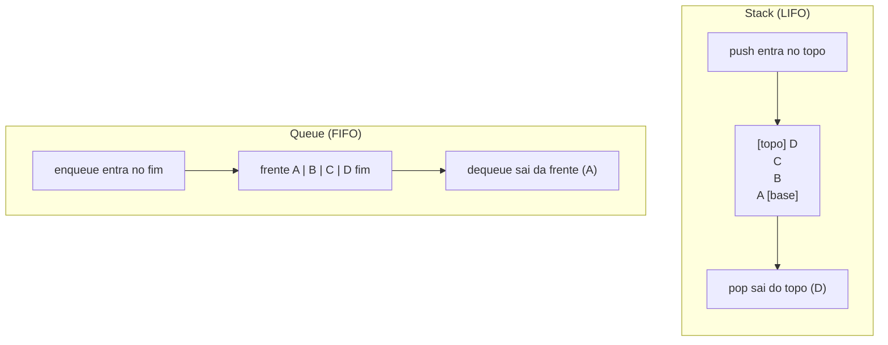
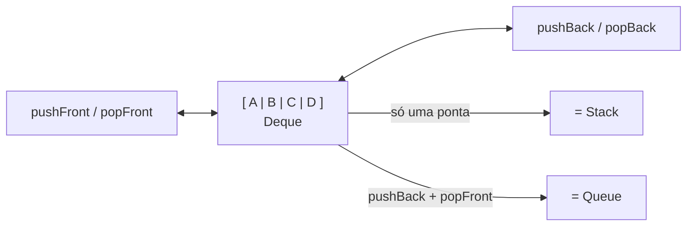
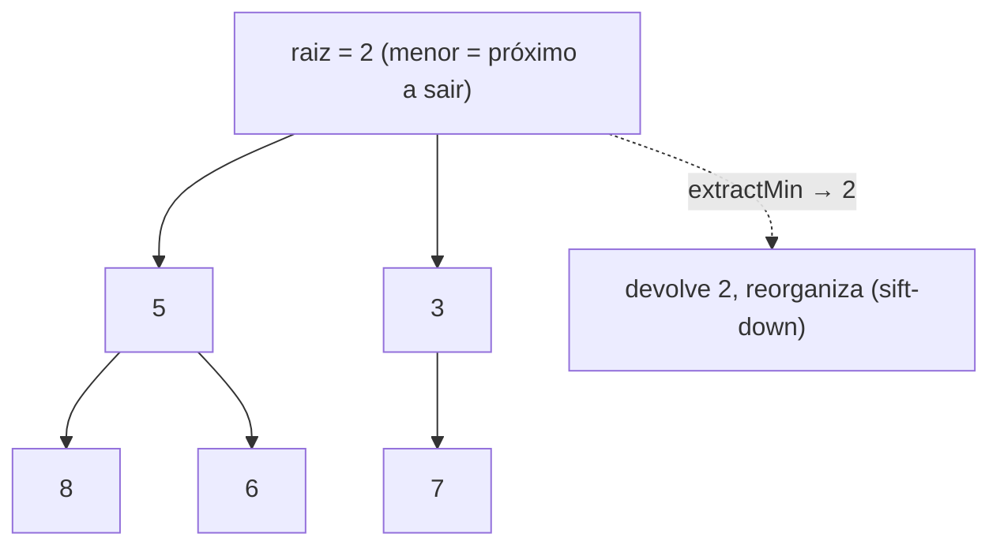

# Stacks, Queues, Deque e Priority Queue: As Quatro Disciplinas de Acesso

> **Bloco:** Estruturas de dados · **Nível:** Intermediário/Avançado · **Tempo de leitura:** ~24 min

## TL;DR

Stack, Queue, Deque e Priority Queue são **estruturas de dados abstratas (ADTs)** que não se definem por *como* armazenam os dados, mas por *qual disciplina de acesso* impõem — ou seja, **quem sai primeiro**. A **Stack (pilha)** é **LIFO** (Last In, First Out): o último que entra é o primeiro que sai, como uma pilha de pratos; operações `push`/`pop`/`peek`, todas **O(1)**. A **Queue (fila)** é **FIFO** (First In, First Out): o primeiro que entra é o primeiro que sai, como uma fila de banco; `enqueue`/`dequeue`, **O(1)**. A **Deque** (double-ended queue, "deck") generaliza ambas: permite inserir e remover nas **duas pontas** em O(1), então pode funcionar como pilha *ou* fila. A **Priority Queue** quebra a ordem temporal: quem sai primeiro não é o mais antigo nem o mais recente, mas o de **maior (ou menor) prioridade** — independente de quando entrou; é tipicamente implementada com um **heap binário**, dando `insert` e `extract-min/max` em **O(log n)**. O ponto que separa o júnior do sênior é entender que essas são **interfaces**, não implementações: uma stack pode viver sobre array dinâmico ou linked list; uma queue eficiente usa **ring buffer** (array circular) ou doubly linked list, *nunca* `dequeue` no início de um array comum (seria O(n)); e a priority queue **não é uma fila ordenada** — ela mantém só o extremo acessível em O(1), não a coleção inteira ordenada. Essas quatro ADTs são onipresentes em sistemas: stacks em call stacks e desfazer/refazer e parsing; queues em filas de mensagens, schedulers e BFS; deques em janelas deslizantes e work-stealing; priority queues em Dijkstra, schedulers por prioridade e rate limiters.

## O problema que resolve

Diferente de array e linked list, que respondem "como armazenar uma sequência", estas quatro estruturas respondem a uma pergunta mais sutil: **"em que ordem os elementos devem ser retirados?"**. A genialidade de transformar uma *política de retirada* numa estrutura de dados é que ela **codifica uma intenção** e **restringe** a interface — e restrição é uma virtude: ao expor só `push`/`pop`, uma stack torna impossível o acesso aleatório, o que **comunica claramente** o algoritmo (é um problema de aninhamento/reversão) e elimina classes inteiras de bugs.

Cada disciplina resolve uma família de problemas:

- **LIFO (Stack):** problemas com **aninhamento** ou **reversão** natural. Quando você abre um parêntese, ele tem que fechar *antes* dos abertos depois dele — ordem inversa, LIFO. Quando uma função chama outra, a chamada mais recente retorna primeiro — daí a **call stack**. Desfazer (undo): a última ação é a primeira a desfazer. Navegação "voltar" no browser.
- **FIFO (Queue):** problemas com **ordem de chegada / justiça temporal**. Tarefas processadas na ordem em que chegaram (filas de impressão, filas de mensagens, schedulers FIFO), travessia em largura de grafos (BFS visita por "camadas"), buffers entre produtor e consumidor.
- **Acesso nas duas pontas (Deque):** quando você precisa de flexibilidade — adicionar/remover de qualquer ponta. Algoritmos de **janela deslizante** (sliding window maximum), **work-stealing** em schedulers paralelos (a thread pega trabalho de uma ponta da sua própria deque e "rouba" da outra ponta da deque alheia), histórico que cresce e é podado nas duas pontas.
- **Ordem por prioridade (Priority Queue):** quando a ordem de saída deve refletir **importância**, não tempo. O paciente mais grave é atendido antes (triagem hospitalar), a aresta mais curta é explorada antes (Dijkstra/Prim), o evento agendado para mais cedo dispara antes (event-driven simulation, schedulers de timers), o job de maior prioridade roda antes (OS schedulers).

A questão de implementação que essas ADTs forçam é importante para um arquiteto: **a ADT define o contrato; a estrutura subjacente define a performance**. Uma queue ingênua implementada removendo do início de um array é **O(n) por dequeue** (desloca tudo) — um anti-padrão. A queue correta usa **ring buffer** (array circular com índices `head`/`tail` que dão a volta) ou **doubly linked list**, ambas O(1). Saber escolher o substrato é o que diferencia conhecer o conceito de saber usá-lo em produção.

## O que é (definição aprofundada)

### Stack (pilha) — LIFO

Uma **stack** é uma coleção onde inserção e remoção ocorrem **só num extremo** (o "topo"). Operações:

- **`push(x)`** — empilha `x` no topo. O(1).
- **`pop()`** — desempilha e retorna o elemento do topo. O(1).
- **`peek()`/`top()`** — olha o topo sem remover. O(1).
- **`isEmpty()`** — vazia? O(1).

LIFO: o último a entrar é o primeiro a sair. **Implementação:** array dinâmico (push = append, pop = remove do fim, ambos O(1) amortizado) ou linked list (push/pop na cabeça). A versão sobre array é geralmente preferida por cache locality. Exemplos de uso: **call stack** (registros de ativação de funções, daí "stack overflow"), avaliação de expressões e parsing (verificar balanceamento de parênteses, notação polonesa reversa), **undo/redo**, DFS iterativo, "voltar" no navegador.

### Queue (fila) — FIFO

Uma **queue** é uma coleção onde a inserção ocorre num extremo (o "fim"/rear) e a remoção no outro (a "frente"/front). Operações:

- **`enqueue(x)`** — insere `x` no fim. O(1).
- **`dequeue()`** — remove e retorna o elemento da frente. O(1).
- **`peek()/front()`** — olha a frente. O(1).

FIFO: o primeiro a entrar é o primeiro a sair. **Implementação correta:** **ring buffer** (array circular) — mantém `head` e `tail` que "dão a volta" no array via aritmética modular, ambos O(1) sem deslocar nada; quando enche, realoca como um array dinâmico. Ou **doubly linked list** (enqueue na cauda, dequeue na cabeça, O(1)). Exemplos: filas de mensagens/jobs, buffer produtor-consumidor, **BFS** em grafos, escalonamento round-robin, request queues.

### Deque (double-ended queue)

Uma **deque** (pronuncia-se "deck") permite inserção e remoção em **ambas as pontas** em O(1):

- **`pushFront(x)` / `pushBack(x)`** — insere na frente / no fim. O(1).
- **`popFront()` / `popBack()`** — remove da frente / do fim. O(1).

É a **generalização** de stack e queue: use só uma ponta → stack; use `pushBack` + `popFront` → queue. **Implementação:** doubly linked list ou **array circular crescível** (o `ArrayDeque` do Java é um ring buffer e é, na prática, a forma recomendada de implementar tanto pilha quanto fila no Java moderno — mais rápido que `Stack` e `LinkedList`). Exemplos: janela deslizante (manter máximos/mínimos de uma janela em O(n) total via deque monotônica), **work-stealing schedulers** (ForkJoinPool, Go runtime), histórico com poda nas duas pontas, palíndromos.

### Priority Queue (fila de prioridade)

Uma **priority queue** é uma coleção onde cada elemento tem uma **prioridade**, e a remoção sempre retorna o elemento de **maior prioridade** (max-PQ) ou **menor** (min-PQ) — **independente da ordem de inserção**. Operações:

- **`insert(x, prioridade)`** — insere. O(log n) com heap.
- **`extractMin()` / `extractMax()`** — remove e retorna o de maior prioridade. O(log n) com heap.
- **`peek()`** — olha o de maior prioridade sem remover. O(1).

**Implementação canônica: heap binário** (uma árvore quase-completa armazenada num array — veja o documento de Heaps), que dá insert e extract em O(log n) e peek em O(1). Outras opções com trade-offs diferentes: árvore balanceada (O(log n) também, mas mantém *toda* a coleção ordenada, útil se você precisa de mais que o extremo), Fibonacci heap (decrease-key amortizado O(1), relevante teoricamente para Dijkstra/Prim). **Atenção conceitual:** a priority queue **não ordena a coleção inteira** — ela só garante acesso O(1) ao extremo e O(log n) para inserir/extrair. Iterar uma PQ **não** dá os elementos em ordem de prioridade. Exemplos: **Dijkstra/Prim** (próxima aresta/vértice mais barato), event-driven simulation (próximo evento por tempo), schedulers do SO por prioridade, top-K (manter um min-heap de tamanho K), compressão de Huffman, rate limiting/timer wheels.

### Tabela de complexidades

| Operação | Stack | Queue | Deque | Priority Queue (heap) |
|---|---|---|---|---|
| Inserir | push: **O(1)** | enqueue: **O(1)** | push front/back: **O(1)** | insert: **O(log n)** |
| Remover | pop: **O(1)** | dequeue: **O(1)** | pop front/back: **O(1)** | extract: **O(log n)** |
| Espiar extremo (`peek`) | **O(1)** | **O(1)** | **O(1)** (ambas pontas) | **O(1)** |
| Buscar elemento arbitrário | O(n) | O(n) | O(n) | O(n) |
| Acesso por índice | não suportado | não suportado | não suportado | não suportado |
| Disciplina | LIFO | FIFO | ambas pontas | por prioridade |

(Em queue/deque, os O(1) de inserção são amortizados se sobre array crescível, exatos se sobre linked list.)

## Como funciona

**Stack sobre array.** Um ponteiro `top` indica o índice do topo. `push`: `arr[++top] = x` (com resize se necessário). `pop`: `return arr[top--]`. Tudo O(1) amortizado, com excelente cache locality. A linked list (push/pop na cabeça) é alternativa, sem resize mas com cache misses.

**Queue sobre ring buffer (array circular).** Aqui está o truque que muita gente erra. Manter `head` (índice da frente) e `tail` (índice do fim) num array de capacidade `C`. `enqueue`: `arr[tail] = x; tail = (tail + 1) % C`. `dequeue`: `x = arr[head]; head = (head + 1) % C`. Os índices "dão a volta" via módulo, reusando o espaço liberado por dequeues sem nunca deslocar elementos — **O(1) real**. Quando lota (`tail` alcançaria `head`), realoca um buffer maior e copia (amortizado O(1)). Isso é o que torna a queue eficiente; a versão ingênua (array comum, `dequeue` = `remove(0)`) desloca todos os N elementos a cada dequeue = **O(n)**, anti-padrão clássico.

**Deque.** Mesma ideia do ring buffer, mas operando nas duas pontas: `pushFront` decrementa `head` (com wraparound), `pushBack` incrementa `tail`. Doubly linked list é a alternativa direta (inserir/remover em qualquer cabeça/cauda é O(1) com `head`/`tail`).

**Priority Queue via heap binário.** O heap é uma árvore binária quase-completa onde cada pai tem prioridade ≥ (max-heap) ou ≤ (min-heap) seus filhos, **armazenada num array** (filho esquerdo de `i` em `2i+1`, direito em `2i+2`, pai em `(i-1)/2`). `insert`: coloca no fim e **sobe** (sift-up) trocando com o pai enquanto violar a ordem — O(log n) (altura da árvore). `extractMin`: retorna a raiz, move o último elemento para a raiz e o faz **descer** (sift-down) trocando com o menor filho enquanto violar — O(log n). O `peek` é a raiz, O(1). Os detalhes estão no documento de Heaps; o essencial aqui é: **a priority queue é a ADT, o heap é a implementação que dá O(log n)**.

## Diagrama de fluxo

O primeiro diagrama mostra LIFO (stack) vs FIFO (queue) — de onde entra e de onde sai; o segundo mostra a deque generalizando as duas; o terceiro mostra a priority queue como um heap (min-heap) onde a raiz é o próximo a sair.







## Exemplo prático / caso real

**Caso 1 — Processamento de pedidos num e-commerce (Queue / FIFO).** Numa plataforma de e-commerce brasileira, pedidos confirmados entram numa **fila de processamento** (validação de pagamento, baixa de estoque, emissão de nota). A justiça temporal importa: quem comprou primeiro deve ser processado primeiro (FIFO). Em produção, isso é um **message broker** (RabbitMQ, SQS, Kafka), que é a materialização distribuída e durável da ADT Queue — com a mesma semântica FIFO (por partição), mas com persistência, retry e múltiplos consumidores. Reconhecer que "fila de mensagens" *é* a estrutura Queue elevada a um serviço distribuído conecta a teoria de estruturas de dados com a arquitetura de mensageria.

**Caso 2 — Roteamento e cálculo de frete (Priority Queue / Dijkstra).** Para calcular a rota de menor custo de entrega entre o centro de distribuição e o endereço do cliente, usa-se **Dijkstra**, cujo coração é uma **min-priority queue**: a cada passo, extraímos o vértice **mais próximo ainda não finalizado** (extractMin em O(log n)) e relaxamos suas arestas. Sem a priority queue, encontrar o mínimo a cada passo seria O(n) (busca linear), degradando o algoritmo. A PQ (heap) é o que torna Dijkstra eficiente — exemplo perfeito de uma estrutura de dados sendo o gargalo (ou a salvação) de um algoritmo inteiro.

**Caso 3 — Top-K produtos mais vendidos (Priority Queue de tamanho fixo).** Para exibir os "10 produtos mais vendidos" a partir de um stream de milhões de vendas sem ordenar tudo (O(n log n)), mantém-se um **min-heap de tamanho 10**: para cada produto, se sua contagem for maior que o menor do heap (a raiz), substitui-se a raiz e faz-se sift-down. O resultado é **O(n log K)** com **O(K)** de memória, em vez de ordenar tudo. Esse padrão "min-heap de tamanho K para top-K máximos" (e seu espelho, max-heap para top-K mínimos) é um dos truques de entrevista mais cobrados e tem uso real em rankings, leaderboards e analytics.

**Caso 4 — Undo/redo num editor (duas Stacks).** Um editor mantém uma stack de **undo** e uma de **redo**. Cada ação empilha em undo; `Ctrl+Z` faz pop de undo e push em redo; uma nova ação limpa o redo. LIFO captura exatamente a semântica "desfazer a última ação primeiro" — push/pop O(1).

Pseudocódigo do top-K com min-heap:

```
function topK(stream, K):
    heap = minHeap()                      // raiz = menor dos K atuais
    for item in stream:
        if heap.size < K:
            heap.insert(item)             // O(log K)
        else if item > heap.peek():       // maior que o menor dos top-K?
            heap.extractMin()             // descarta o menor
            heap.insert(item)             // O(log K)
    return heap.toList()                  // os K maiores (não ordenados)
```

## Quando usar / Quando evitar

**Stack — use quando:** o problema tem **aninhamento/reversão** natural (parsing, balanceamento, call stack, undo, DFS iterativo, "voltar"). **Evite quando:** você precisa acessar elementos do meio ou processar em ordem de chegada (use queue) — a restrição LIFO seria artificial.

**Queue — use quando:** há **ordem de chegada / justiça temporal** (jobs, mensagens, BFS, round-robin, buffer produtor-consumidor). **Evite/cuidado:** nunca implemente removendo do início de um array comum (O(n)); use ring buffer ou linked list. Se a ordem deve refletir prioridade e não tempo, use priority queue.

**Deque — use quando:** precisa de inserção/remoção nas **duas pontas** (janela deslizante, work-stealing, histórico podado nas duas pontas), ou quando quer uma estrutura única que sirva de pilha *e* fila (no Java, `ArrayDeque` é a recomendação para ambas). **Evite quando:** só uma ponta basta (use a abstração mais restrita — comunica melhor a intenção).

**Priority Queue — use quando:** a saída deve seguir **prioridade**, não tempo (Dijkstra/Prim, schedulers por prioridade, event simulation, top-K, Huffman, timers). **Evite quando:** você precisa da coleção **inteira ordenada** ou de acesso por índice (a PQ só dá o extremo; use árvore balanceada ou ordenação); ou quando há poucos elementos e uma busca linear O(n) é mais simples e cabe em cache.

## Anti-padrões e armadilhas comuns

- **Queue removendo do início de um array (`list.remove(0)` / `pop(0)`).** Desloca todos os elementos — **O(n) por dequeue**, O(n²) no total. Use ring buffer / `ArrayDeque` / `collections.deque`. Erro de produção e de entrevista.
- **Usar `java.util.Stack` ou `LinkedList` como pilha/fila no Java.** `Stack` é legado (sincronizado, herda de `Vector`); `LinkedList` tem péssima cache locality. A recomendação moderna é **`ArrayDeque`** para ambas. Demonstrar isso numa entrevista de Java é um diferencial.
- **Achar que priority queue mantém tudo ordenado.** Ela só garante o **extremo** em O(1) e insert/extract em O(log n). **Iterar** uma PQ não dá ordem de prioridade. Confundir PQ com "lista ordenada" é erro conceitual frequente.
- **Esquecer que peek/pop em estrutura vazia precisa de tratamento.** `pop` de stack vazia, `dequeue` de fila vazia: defina o contrato (exceção, sentinela, `Optional`). Fonte comum de NPE/crash.
- **Stack overflow por recursão profunda.** A call stack *é* uma stack de tamanho limitado; recursão sem caso base ou profunda demais estoura. Converter para iteração com uma stack explícita (DFS iterativo) é a solução — e a conexão "recursão = stack" é cobrada.
- **Construir uma PQ inserindo N elementos um a um (N log N) quando dava para heapify em O(n).** Se você já tem os N elementos, **heapify** os transforma em heap em **O(n)** (não O(n log n)). Detalhe de otimização importante.
- **Confundir prioridade com ordem FIFO em empates.** Heaps binários **não são estáveis**: elementos de mesma prioridade podem sair em qualquer ordem. Se empates precisam respeitar ordem de chegada, inclua um contador de inserção como critério de desempate na chave.
- **Wraparound errado no ring buffer.** Esquecer o `% capacidade` nos índices, ou confundir "cheio" com "vazio" (ambos têm `head == tail`) — daí a técnica de guardar um contador de tamanho ou deixar uma posição vazia. Bug clássico de implementação.

## Relação com outros conceitos

- **Arrays e Linked Lists:** são o substrato dessas ADTs — stack/queue/deque sobre array dinâmico (cache locality) ou linked list; entender os trade-offs de [Arrays e Linked Lists](01-arrays-e-linked-lists.md) é pré-requisito para escolher a implementação certa.
- **Heaps:** a priority queue é implementada com heap binário; insert/extract O(log n) e heapify O(n) vêm de lá. Veja [Heaps](06-heaps.md).
- **Algoritmos de grafos:** BFS usa Queue, DFS usa Stack (ou recursão), Dijkstra/Prim usam Priority Queue — a escolha da ADT define o algoritmo. Veja [Algoritmos Essenciais](../13-algoritmos-essenciais/01-bfs-dfs-grafos.md).
- **Complexidade algorítmica:** O(1) das operações de stack/queue vs O(log n) da PQ; análise amortizada do ring buffer crescível. Veja [Complexidade Algorítmica](../11-complexidade-algoritmica/01-notacao-assintotica-big-o.md).
- **Mensageria (queue/topic/partition):** message brokers são a versão distribuída e durável da ADT Queue (FIFO por partição), com retry, persistência e consumer groups. Veja [Pub/Sub, Queue, Topic, Partition](../06-mensageria-e-streaming/02-pubsub-queue-topic-partition-consumer-groups.md).
- **Backpressure:** filas limitadas (bounded queues) são o mecanismo central de backpressure entre produtor e consumidor; o tamanho da fila e a política de cheia (bloquear, descartar) são decisões de resiliência. Veja [Backpressure](../06-mensageria-e-streaming/03-backpressure.md).
- **Rate limiting / schedulers:** priority queues e timer wheels implementam agendamento por prioridade/tempo, base de schedulers e rate limiters.

## Referências

- [Big-O Algorithm Complexity Cheat Sheet — Common Data Structures](https://www.bigocheatsheet.com/)
- [Linked List, Stack, Queue, Deque — VisuAlgo](https://visualgo.net/en/list)
- [Stack Data Structure — GeeksforGeeks](https://www.geeksforgeeks.org/dsa/stack-data-structure/)
- [Queue Data Structure — GeeksforGeeks](https://www.geeksforgeeks.org/dsa/queue-data-structure/)
- [Deque Data Structure — GeeksforGeeks](https://www.geeksforgeeks.org/dsa/deque-set-1-introduction-applications/)
- [Priority Queue using Binary Heap — GeeksforGeeks](https://www.geeksforgeeks.org/dsa/priority-queue-using-binary-heap/)
- [Difference Between Stack and Queue Data Structures — GeeksforGeeks](https://www.geeksforgeeks.org/dsa/difference-between-stack-and-queue-data-structures/)
- [ArrayDeque (Java Platform SE) — Oracle Docs](https://docs.oracle.com/javase/8/docs/api/java/util/ArrayDeque.html)
- [Three data structures: queue, stack, and deque (Cornell, David Gries)](https://www.cs.cornell.edu/courses/JavaAndDS/files/queueStack.pdf)
