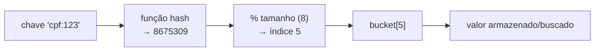
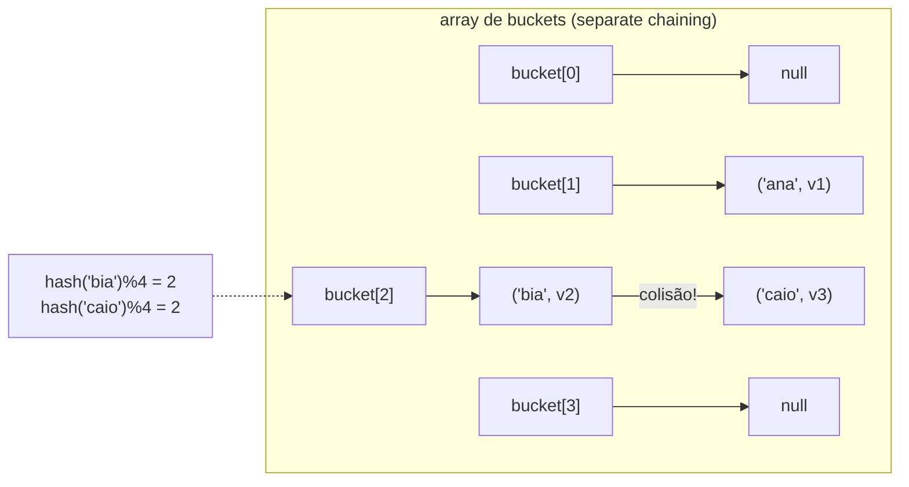
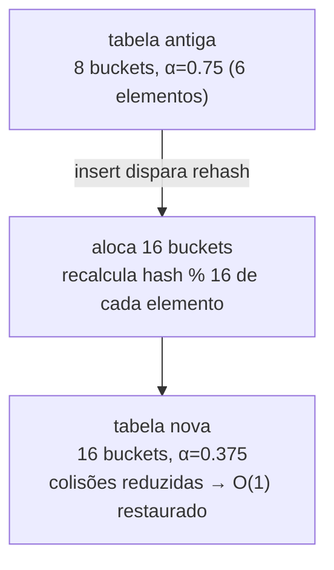

# Hash Tables: Função Hash, Colisões, Load Factor e Rehashing

> **Bloco:** Estruturas de dados · **Nível:** Intermediário/Avançado · **Tempo de leitura:** ~28 min

## TL;DR

A **hash table** (tabela de espalhamento, ou hash map) é a estrutura que dá **busca, inserção e remoção em O(1) no caso médio** — o santo graal das coleções associativas chave→valor. O mecanismo: uma **função hash** transforma a chave num inteiro, que é reduzido (tipicamente por módulo) a um **índice de um array de buckets**, onde o valor é guardado. Acessar pela chave vira aritmética + um acesso a array, daí o O(1). O preço é que esse O(1) é **probabilístico, não garantido**: duas chaves diferentes podem mapear para o mesmo bucket — uma **colisão** — e a estrutura precisa de uma estratégia para resolvê-las. As duas grandes famílias são **separate chaining** (cada bucket é uma lista/estrutura de itens colididos) e **open addressing** (a colisão procura outro slot livre no próprio array, via linear/quadratic probing ou double hashing). O que mantém o O(1) vivo é o **load factor** (α = nº de elementos / nº de buckets): quando ele cresce demais, as colisões aumentam e a performance degrada para O(n); por isso a tabela faz **rehashing** — dobra o array e redistribui todos os elementos — ao cruzar um limiar (0.75 no `HashMap` do Java, ~0.66 no Python). O pior caso teórico é **O(n)** (todas as chaves colidindo no mesmo bucket), e proteger-se disso (boa função hash, defesa contra hash flooding, e em alguns casos converter cadeias longas em árvores) é o que separa uma hash table de brinquedo de uma de produção. Hash tables são onipresentes: dicionários de linguagens, caches em memória (Redis, Memcached), índices hash de bancos, deduplicação, e a base de Sets.

## O problema que resolve

A pergunta é: **"como encontrar o valor associado a uma chave o mais rápido possível?"**. As respostas anteriores não bastam. Num array, achar um valor por **chave** (não por índice) exige busca linear O(n), ou O(log n) se ordenado + busca binária — mas manter ordenado custa caro em inserção. Numa árvore balanceada (BST/red-black), busca é O(log n). A hash table quebra a barreira do logaritmo e entrega **O(1) médio** — encontrar uma chave entre um milhão de itens custa essencialmente o mesmo que entre dez.

A ideia central é **trocar comparações por cálculo de endereço**. Numa busca tradicional, você *compara* a chave procurada com chaves armazenadas (O(n) ou O(log n) comparações). Numa hash table, você **calcula diretamente onde a chave deveria estar**: `índice = hash(chave) % tamanho`. Não há busca pela posição — há aritmética que aponta para ela. É a mesma intuição do acesso O(1) por índice de array, generalizada de "índice inteiro sequencial" para "qualquer chave hasheável".

Mas essa mágica esbarra num problema fundamental e inevitável: o **pigeonhole principle** (princípio das gavetas). O espaço de chaves possíveis (todas as strings, todos os objetos) é gigantesco — efetivamente infinito —, mas o array de buckets é finito. Logo, **é impossível** que a função hash seja injetora; necessariamente **chaves diferentes vão colidir** no mesmo bucket. A hash table não pode evitar colisões; ela só pode **gerenciá-las bem**. Toda a engenharia de hash tables gira em torno de duas perguntas:

1. **Como espalhar as chaves uniformemente** pelos buckets (boa função hash) para que colisões sejam *raras*?
2. **O que fazer quando uma colisão ocorre** (estratégia de resolução), para que o custo continue baixo?

Há ainda um terceiro problema, operacional: o array de buckets tem tamanho fixo, mas o número de elementos cresce. Conforme ele enche, o **load factor** sobe, as colisões se multiplicam e o O(1) vira O(n). A solução é o **rehashing**: detectar quando a densidade fica perigosa e **realocar para um array maior**, redistribuindo tudo — análogo ao resize do array dinâmico, mas com o custo extra de **recalcular o bucket de cada elemento** (porque o módulo mudou). Entender esses três problemas — função hash, colisões, e load factor/rehashing — é entender hash tables.

## O que é (definição aprofundada)

### Função hash

A **função hash** mapeia uma chave de tamanho arbitrário para um inteiro de tamanho fixo (o "hash code"), que depois é reduzido ao intervalo de índices do array (geralmente `hash % tamanho`, ou `hash & (tamanho-1)` quando o tamanho é potência de 2). Uma **boa função hash** para uso em hash tables tem três propriedades:

- **Determinística:** a mesma chave sempre produz o mesmo hash (óbvio, mas crucial — se mudar, você não acha mais a chave).
- **Distribuição uniforme:** espalha as chaves o mais uniformemente possível pelos buckets, minimizando colisões. Chaves "parecidas" devem cair em buckets distantes (efeito avalanche).
- **Rápida de calcular:** o hash é computado em toda operação; se for caro, mata o O(1).

Note: a função hash de uma **hash table** (rápida, foco em distribuição) é diferente de uma função hash **criptográfica** (SHA-256, lenta, resistente a colisões adversárias). Em Java, `hashCode()` retorna o hash; o `HashMap` aplica ainda um "spread" (mistura os bits altos) antes do módulo, porque `hashCode` mal-distribuídos (ex.: só variando nos bits altos) causariam colisões em massa com tabelas pequenas.

### Colisões — Separate Chaining

No **separate chaining** (encadeamento separado, ou "closed addressing"), cada bucket aponta para uma **estrutura que guarda todos os itens que colidiram** ali — classicamente uma **linked list**. Inserir: calcula o bucket, adiciona o item à lista daquele bucket. Buscar: calcula o bucket, percorre a lista comparando chaves. Se a função hash distribui bem e α é baixo, as listas têm comprimento ~1 e tudo é O(1). Se degenera (muitas colisões num bucket), a lista fica longa e a busca naquele bucket vira O(n).

- **Vantagens:** simples; a tabela nunca "enche" (sempre cabe mais um na lista); robusta a load factors altos e a funções hash medianas.
- **Desvantagens:** cache locality ruim (as listas são nós espalhados — saltos de ponteiro), e overhead de memória (ponteiros). Cadeias longas degradam para O(n).
- **Otimização de produção:** o `HashMap` do Java (desde o Java 8) **converte a lista de um bucket em uma árvore red-black** quando ela passa de 8 elementos (treeification), limitando o pior caso daquele bucket a **O(log n)** em vez de O(n) — uma defesa importante contra hash flooding.

### Colisões — Open Addressing

No **open addressing** (endereçamento aberto), **todos os elementos vivem no próprio array de buckets** — não há listas externas. Quando o bucket calculado está ocupado, a estrutura **procura (probes) outro slot** seguindo uma sequência determinística, até achar um vazio (na inserção) ou a chave (na busca). Esquemas de probing:

- **Linear probing:** tenta `h, h+1, h+2, ...` (mod tamanho). Simples e com **excelente cache locality** (slots adjacentes), mas sofre de **primary clustering** — blocos contíguos de slots ocupados crescem e se fundem, alongando os probes.
- **Quadratic probing:** tenta `h, h+1², h+2², h+3², ...`. Reduz o primary clustering, mas tem **secondary clustering** (chaves com o mesmo hash inicial seguem a mesma sequência).
- **Double hashing:** o passo do probe é dado por uma **segunda função hash** (`h, h+1·h2, h+2·h2, ...`), espalhando as sequências e minimizando clustering — o melhor dos três em qualidade de distribuição, ao custo de calcular dois hashes.

- **Vantagens:** **cache locality excelente** (tudo no mesmo array contíguo), sem overhead de ponteiros — frequentemente mais rápido que chaining na prática moderna por causa do cache.
- **Desvantagens:** a tabela **pode encher** (α deve ficar bem abaixo de 1, tipicamente < 0.7); **remoção é complicada** (não dá para só esvaziar um slot — quebraria as sequências de probe; usa-se um marcador "tombstone"); degrada feio quando α se aproxima de 1.

### Load Factor (fator de carga)

O **load factor** α = (número de elementos) / (número de buckets) mede a **densidade** da tabela e é o principal preditor de colisões. Em separate chaining, α é o comprimento médio esperado das listas (pode passar de 1). Em open addressing, α deve ficar < 1 (e bem abaixo na prática), pois o número médio de probes explode conforme α → 1 (em linear probing, ~`1/(1-α)`). Limiares típicos: **0.75 no `HashMap` do Java**, **~0.66 (2/3) no `dict` do Python** (que usa open addressing). Load factor baixo = menos colisões, mais memória desperdiçada; alto = menos memória, mais colisões. É o knob central do trade-off tempo×espaço da hash table.

### Rehashing

**Rehashing** é o processo de **aumentar o array de buckets** (tipicamente **dobrando**) e **redistribuir todos os elementos** quando o load factor cruza o limiar. Diferente do resize de um array dinâmico, aqui não basta copiar: como o índice é `hash % tamanho` e o **tamanho mudou**, cada elemento precisa ter seu **bucket recalculado** e ser reinserido na nova posição. Custo: **O(n)** — caro, mas **amortizado O(1)** por operação (acontece raramente, a cada duplicação, exatamente como o array dinâmico). O rehashing é o que mantém α controlado e, portanto, o O(1) médio vivo ao longo do crescimento. Detalhe sutil: o rehashing causa uma **pausa de latência** O(n) (o insert que o dispara é lento), relevante para sistemas de baixa latência — daí pré-dimensionar (`new HashMap<>(capacidadeEsperada)`) quando o tamanho é conhecido.

### Tabela de complexidades

| Operação | Caso médio | Pior caso | Observação |
|---|---|---|---|
| Busca (get) | **O(1)** | O(n) | pior caso = todas as chaves no mesmo bucket |
| Inserção (put) | **O(1)** amortizado | O(n) | O(n) quando dispara rehashing |
| Remoção (delete) | **O(1)** | O(n) | open addressing usa tombstones |
| Iterar todos | O(n + m) | O(n + m) | n elementos + m buckets (sem ordem) |
| Espaço | O(n + m) | O(n + m) | buckets ociosos contam (load factor) |

Pior caso com treeification (Java 8+): a busca num bucket degenerado cai de O(n) para **O(log n)**.

## Como funciona

**Fluxo de um `get(chave)`:**

1. `h = hash(chave)` — calcula o hash code (e, no Java, mistura os bits).
2. `i = h % tamanho` (ou `h & (tamanho-1)`) — reduz ao índice do bucket.
3. Vai ao bucket `i`. **Chaining:** percorre a lista comparando chaves com `equals` até achar (ou esgotar). **Open addressing:** examina o slot; se a chave bate, retorna; se está ocupado por outra chave, faz probe para o próximo da sequência; se acha vazio, a chave não existe.

O passo 3 é onde colisões cobram seu preço: com boa distribuição e α baixo, é ~1 comparação (O(1)); com degeneração, vira O(n) (ou O(log n) com treeification).

**Por que `equals` e `hashCode` precisam ser consistentes (Java).** Dois objetos iguais (`equals` true) **devem** ter o mesmo `hashCode`. Se não tiverem, eles podem cair em buckets diferentes e a hash table "perde" a chave — você guarda com um objeto e não acha com outro igual. É o contrato `equals/hashCode`, e violá-lo é um dos bugs mais traiçoeiros em Java (e a razão de usar objetos **imutáveis** como chave — se o hash muda depois de inserido, a chave fica inacessível).

**Mecânica do rehashing:** ao cruzar α limiar, aloca `novoArray` de tamanho `2×`, percorre o array antigo e, para cada elemento, recalcula `hash % novoTamanho` e o insere no novo array; descarta o antigo. Com tamanho potência de 2, há uma otimização: o novo bucket de um elemento é ou o mesmo índice ou `índice + tamanhoAntigo`, decidido por um único bit do hash — o que o `HashMap` do Java explora para rehash rápido.

**Defesa contra hash flooding (DoS).** Se um atacante conhece a função hash, pode forjar milhares de chaves que colidem no mesmo bucket, degradando a tabela para O(n) e derrubando o serviço (hash flooding / algorithmic complexity attack). Defesas: **hash com semente aleatória** (SipHash, usado por padrão em Rust, Python 3, Perl), e **treeification** (Java) que limita o dano a O(log n). Um arquiteto deve saber que hash tables têm essa superfície de ataque.

## Diagrama de fluxo

O primeiro diagrama mostra o fluxo função hash → módulo → bucket; o segundo mostra separate chaining (listas nos buckets) com uma colisão; o terceiro mostra o rehashing (dobrar e redistribuir).







## Exemplo prático / caso real

**Caso 1 — Cache de sessão em memória (Redis / hash table).** Numa plataforma de e-commerce brasileira, cada usuário logado tem uma sessão (`session:token → dados`). O Redis, no fundo, é uma **hash table gigante distribuída**: `GET session:abc123` calcula o hash da chave, vai ao bucket e retorna em O(1) — milhões de sessões, tempo de acesso constante. É o exemplo de como a estrutura "hash table" vira a base de um sistema de cache inteiro. O `MAXMEMORY` e a política de evicção (LRU/LFU) lidam com o crescimento, e o sharding (consistent hashing) distribui os buckets entre nós — conectando hash table com [Cache Patterns](../05-dados-e-persistencia/08-cache-patterns.md) e sharding.

**Caso 2 — Deduplicação de eventos / idempotência.** Para garantir que um pagamento não seja processado duas vezes (idempotência), o sistema guarda as chaves de idempotência já vistas num **Set** (que é uma hash table só com chaves). Verificar "já processei este evento?" é um `contains` O(1). Para milhões de eventos/dia, só uma hash table dá essa verificação em tempo constante — uma BST seria O(log n), e busca linear, inviável. (Quando a memória aperta, troca-se exatidão por um **Bloom filter**, uma hash table probabilística que admite falsos positivos.)

**Caso 3 — Índice de produtos por SKU.** Para resolver `SKU → produto` num catálogo, uma hash table em memória (ou um **índice hash** no banco, como o `USING HASH` do PostgreSQL para igualdade exata) dá lookup O(1). Detalhe arquitetural: índice hash serve **só igualdade** (`=`), não range (`<`, `BETWEEN`, `ORDER BY`) — para isso, B-Tree. Saber quando usar índice hash vs B-Tree é decisão de design de banco (veja [B-Tree e B+Tree](05-b-tree-e-b-plus-tree.md)).

**Caso 4 — A armadilha do load factor em produção.** Um serviço carregava 10 milhões de registros num `HashMap` criado com o tamanho default (16). Resultado: **dezenas de rehashings** durante o carregamento (cada um O(n)), cada um uma pausa de latência crescente, somando minutos de overhead e picos de GC. A correção: `new HashMap<>(13_400_000)` (≈ 10M / 0.75, pré-dimensionado), eliminando todos os rehashings. Conhecer load factor e rehashing transforma um carregamento lento e cheio de soluços num carregamento liso — exatamente o tipo de otimização que um sênior identifica.

Pseudocódigo de `put` com rehashing:

```
function put(table, chave, valor):
    if (table.size + 1) / table.numBuckets > table.maxLoadFactor:
        rehash(table, table.numBuckets * 2)        // O(n), raro
    i = hash(chave) % table.numBuckets
    insereNoBucket(table.buckets[i], chave, valor)  // chaining ou probing
    table.size += 1

function rehash(table, novoTamanho):
    novos = arrayDeBuckets(novoTamanho)
    for (chave, valor) in todosOsElementos(table):
        j = hash(chave) % novoTamanho               // recalcula!
        insereNoBucket(novos[j], chave, valor)
    table.buckets = novos
    table.numBuckets = novoTamanho
```

## Quando usar / Quando evitar

**Use hash table quando:**

- Você precisa de **lookup/inserção/remoção por chave em O(1) médio** — o caso de uso dominante de mapas e sets.
- A operação é **igualdade exata** ("dá-me o valor desta chave").
- Não importa a **ordem** dos elementos.
- Implementar cache em memória, deduplicação, contagem de frequências, índices de igualdade, junção (hash join).

**Evite/use outra coisa quando:**

- Você precisa de **ordem** (iterar em ordem de chave), **range queries** (`entre X e Y`), **min/max**, ou **predecessor/sucessor** — hash tables não suportam; use **árvore balanceada** (red-black / B-Tree) ou skip list. Esse é o trade-off fundamental: hash table = O(1) mas sem ordem; árvore = O(log n) mas ordenada.
- O **pior caso O(n)** é inaceitável e há risco adversarial (hash flooding) — então exija função hash com semente aleatória e/ou estrutura com pior caso garantido (árvore).
- O conjunto é **pequeno e fixo** — um array linear pode ser mais rápido (cabe no cache, sem overhead de hash).
- Você precisa de **persistência ordenada em disco** — B+Tree é o substrato de índices de banco, não hash table (exceto índices hash para igualdade).

## Anti-padrões e armadilhas comuns

- **Violar o contrato `equals`/`hashCode` (Java).** Sobrescrever `equals` mas não `hashCode` (ou vice-versa) faz a hash table "perder" chaves — objetos iguais em buckets diferentes. Bug clássico e traiçoeiro. Use objetos **imutáveis** como chave.
- **Mutar uma chave depois de inseri-la.** Se o hash da chave muda após a inserção (ex.: alterar um campo usado no `hashCode`), o elemento fica num bucket "errado" e se torna **inacessível**. Chaves devem ser imutáveis.
- **Confundir "O(1)" com "sempre rápido".** O O(1) é **médio e amortizado**; o pior caso é O(n), e o insert que dispara rehashing é O(n). Em sistemas de latência crítica (p99), os soluços de rehashing importam — pré-dimensione.
- **Não pré-dimensionar ao carregar muitos dados.** Carregar N elementos numa tabela default dispara múltiplos rehashings O(n). Pré-dimensionar (capacidade ≈ N / load factor) elimina-os.
- **Assumir ordem de iteração.** A ordem de iteração de uma hash table é **arbitrária** (e pode mudar entre versões ou após rehash). Código que depende dela é frágil. Para ordem de inserção use `LinkedHashMap`; para ordem de chave, `TreeMap`.
- **Ignorar hash flooding.** Em serviços que recebem chaves de input não-confiável (parâmetros HTTP, JSON), um atacante pode forjar colisões e degradar para O(n) — DoS. Use hash com semente (SipHash) ou estruturas com pior caso O(log n).
- **Usar hash table para range/ordenação.** Tentar fazer "todos os pedidos entre duas datas" ou "top N" com hash table não funciona — não há ordem. Use árvore/índice ordenado.
- **Open addressing com remoção ingênua.** Esvaziar um slot em open addressing quebra as sequências de probe (chaves "depois" ficam inacessíveis). Use **tombstones** (marcador de removido) e rehash periódico para limpá-los.
- **Função hash ruim (ex.: `hashCode` constante ou só os bits baixos).** Concentra tudo em poucos buckets, degradando para O(n). Uma boa distribuição é metade do trabalho.

## Relação com outros conceitos

- **Arrays e Linked Lists:** a hash table é construída sobre um **array** (os buckets) e, em separate chaining, **linked lists** (as cadeias) — herda a cache locality do array e o overhead de ponteiros da lista. Veja [Arrays e Linked Lists](01-arrays-e-linked-lists.md).
- **Árvores balanceadas:** são a **alternativa ordenada** à hash table (O(log n) com ordem vs O(1) sem ordem); e o `HashMap` do Java usa **red-black trees** para treeification de buckets degenerados. Veja [Árvores de Busca: BST, AVL, Red-Black](04-arvores-de-busca-bst-avl-red-black.md).
- **Complexidade algorítmica / análise amortizada:** o O(1) médio, o pior caso O(n) e o rehashing amortizado O(1) são exemplos centrais de por que distinguir caso médio, pior caso e amortizado importa. Veja [Complexidade Algorítmica](../11-complexidade-algoritmica/01-notacao-assintotica-big-o.md).
- **Consistent hashing & sharding:** distribuir chaves entre nós de um cache/banco distribuído é "hash table no nível de cluster"; consistent hashing minimiza o "rehashing" (remapeamento) quando nós entram/saem. Veja [Leader Election, Sharding, Consistent Hashing](../04-sistemas-distribuidos/11-leader-election-sharding-consistent-hashing.md).
- **Cache patterns:** caches em memória (Redis, Memcached, cache local) são hash tables com política de evicção; o LRU combina hash table + doubly linked list. Veja [Cache Patterns](../05-dados-e-persistencia/08-cache-patterns.md).
- **Índices de banco:** índices hash servem igualdade O(1); B-Tree serve range/ordem. A escolha é decisão de design de schema. Veja [B-Tree e B+Tree](05-b-tree-e-b-plus-tree.md).
- **Algoritmos:** hash join, deduplicação, contagem de frequência e detecção de duplicatas usam hash tables como ferramenta central. Veja [Algoritmos Essenciais](../13-algoritmos-essenciais/01-bfs-dfs-grafos.md).

## Referências

- [Hash Table Data Structure — GeeksforGeeks](https://www.geeksforgeeks.org/dsa/hash-table-data-structure/)
- [Separate Chaining Collision Handling Technique in Hashing — GeeksforGeeks](https://www.geeksforgeeks.org/dsa/separate-chaining-collision-handling-technique-in-hashing/)
- [Open Addressing Collision Handling technique in Hashing — GeeksforGeeks](https://www.geeksforgeeks.org/dsa/open-addressing-collision-handling-technique-in-hashing/)
- [Load Factor and Rehashing — GeeksforGeeks](https://www.geeksforgeeks.org/dsa/load-factor-and-rehashing/)
- [Hash Table (Chaining, Linear/Quadratic Probing, Double Hashing) — VisuAlgo](https://visualgo.net/en/hashtable)
- [Big-O Algorithm Complexity Cheat Sheet — Common Data Structures](https://www.bigocheatsheet.com/)
- [Hash table — Wikipedia](https://en.wikipedia.org/wiki/Hash_table)
- [HashMap (Java Platform SE) — Oracle Docs](https://docs.oracle.com/javase/8/docs/api/java/util/HashMap.html)
