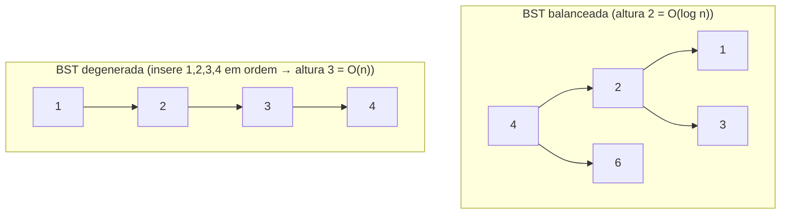
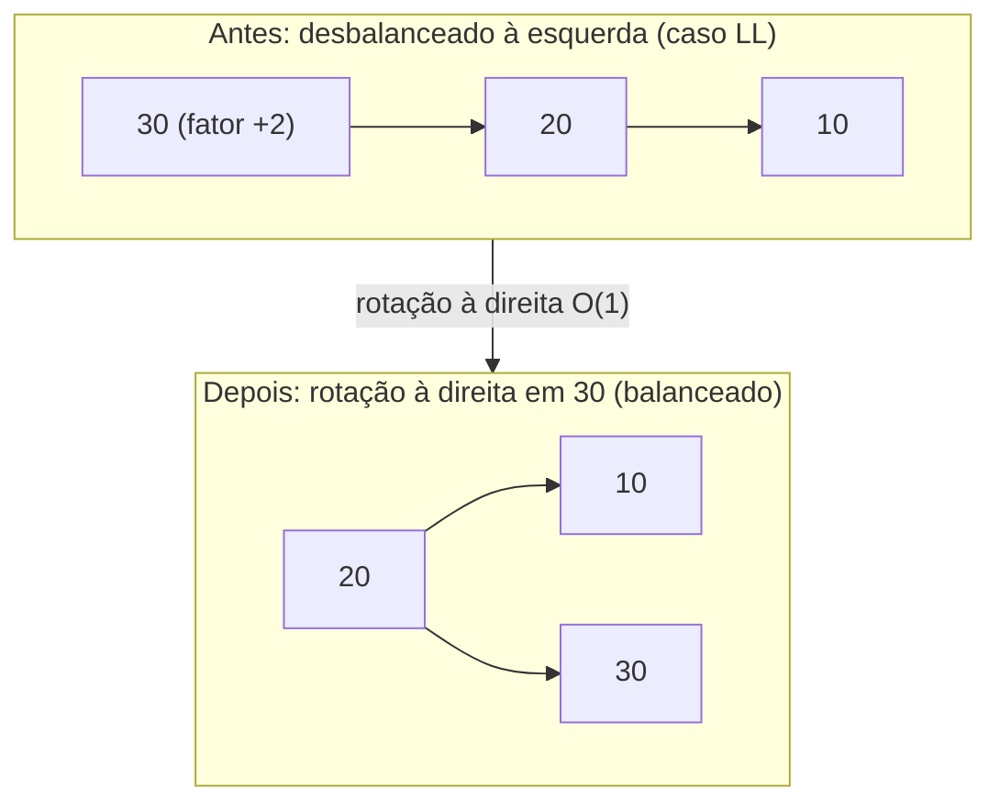
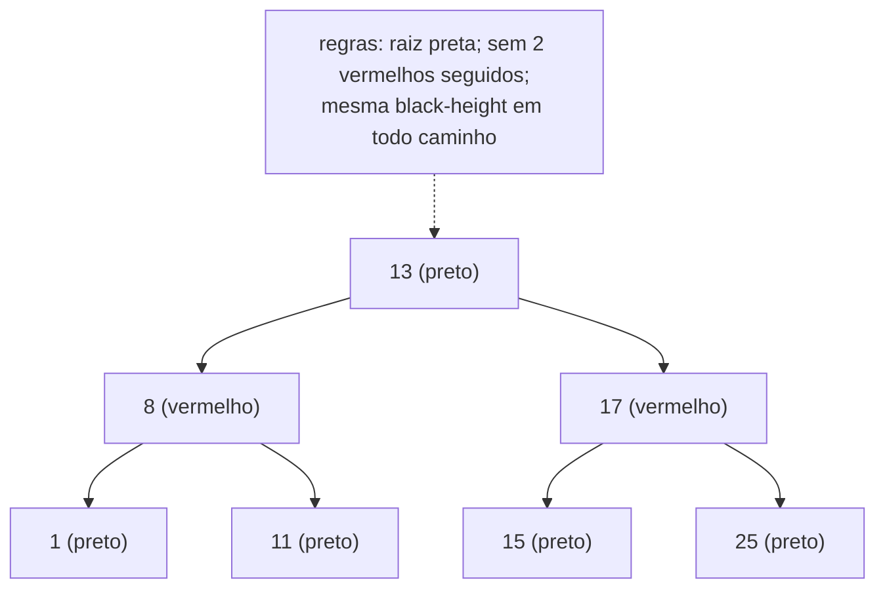

# Árvores de Busca: BST, AVL e Red-Black (Balanceamento e Rotações)

> **Bloco:** Estruturas de dados · **Nível:** Intermediário/Avançado · **Tempo de leitura:** ~30 min

## TL;DR

As **árvores de busca binária** são a resposta para quando você precisa de operações rápidas **mantendo a ordem** — algo que a hash table (O(1) mas sem ordem) não dá. A **BST (Binary Search Tree)** é a ideia base: cada nó tem no máximo dois filhos, e vale o **invariante de ordem** — tudo na subárvore esquerda é **menor** que o nó, tudo na direita é **maior**. Isso permite busca, inserção e remoção em **O(altura)**, e a travessia **in-order** devolve os elementos **ordenados**. O problema fatal da BST simples: se as chaves chegam em ordem (1, 2, 3, 4...), ela **degenera numa linked list** e a altura vira O(n) — perdendo toda a vantagem. As **árvores auto-balanceadas** corrigem isso garantindo altura **O(log n)** via reorganizações locais chamadas **rotações**. A **AVL** mantém balanceamento **estrito** (a diferença de altura entre subármãos de cada nó é no máximo 1), o que a deixa mais "achatada" e com **buscas mais rápidas**, ao custo de **mais rotações** em inserções/remoções. A **Red-Black** mantém balanceamento **mais frouxo** (via 5 regras de coloração que garantem que nenhum caminho é mais que 2× outro), o que dá **menos rotações** (no máximo 2 por inserção, 3 por remoção) — melhor para cargas com muita escrita. A regra prática: **AVL quando lê-se muito mais do que se escreve; Red-Black quando há muita escrita** — e por isso Red-Black é a estrutura padrão de `TreeMap`/`TreeSet` (Java), `std::map`/`std::set` (C++) e de muitos schedulers de kernel. Tudo se resume a **rotações**: pequenas religações de 3 nós, em O(1), que rebaixam a altura e mantêm o invariante.

## O problema que resolve

A hash table resolve lookup por chave em O(1), mas paga um preço: **abre mão da ordem**. Há uma classe enorme de operações que *precisam* de ordem e que a hash table não consegue fazer melhor que O(n):

- **Range queries:** "todos os pedidos entre R$ 100 e R$ 500", "todos os eventos entre duas datas".
- **Min / max:** "o produto mais barato", "a maior pontuação".
- **Predecessor / sucessor:** "o próximo horário disponível depois das 14h".
- **Iteração ordenada:** percorrer todos em ordem crescente.
- **k-ésimo menor:** "a mediana", "o 10º colocado".

A pergunta que as árvores de busca respondem é: **"como ter operações rápidas (sublineares) que também preservam a ordem das chaves?"**. A resposta é organizar os dados numa **árvore** onde a posição de cada elemento codifica sua ordem relativa, de forma que **a cada comparação você descarta metade do que resta** — exatamente a intuição da busca binária, mas numa estrutura dinâmica que aceita inserções e remoções.

O mecanismo é o **invariante de ordem da BST**: para todo nó, esquerda < nó < direita. Procurar uma chave vira descer a árvore comparando: maior, vai pra direita; menor, vai pra esquerda. Cada passo desce um nível e elimina uma subárvore inteira. Se a árvore tem altura `h`, a busca é **O(h)**. Numa árvore **balanceada** (folhas todas mais ou menos no mesmo nível), `h ≈ log₂(n)` — então O(log n). Mil elementos → ~10 comparações; um milhão → ~20.

Aqui mora o problema central que motiva AVL e Red-Black: **a BST não garante que se mantenha balanceada**. A altura depende da **ordem de inserção**. Se você insere chaves já ordenadas (1, 2, 3, 4, 5...), cada nova chave é sempre maior que todas, então sempre vai para a direita — a árvore vira uma **linha reta**, uma linked list disfarçada, com altura `n` e busca **O(n)**. O melhor caso (O(log n)) e o pior caso (O(n)) diferem catastroficamente, e o pior caso é disparado por um padrão de input *comum* (dados ordenados). É inaceitável para uma estrutura de produção.

As árvores **auto-balanceadas** resolvem isso: elas detectam quando uma inserção/remoção desbalanceou a árvore e **corrigem automaticamente** com **rotações** — operações O(1) que reorganizam uns poucos nós para rebaixar a altura, mantendo o invariante de ordem. O resultado é altura **garantidamente O(log n)** em todos os casos. AVL e Red-Black são duas filosofias de "quão balanceado manter" — estrita (AVL) vs frouxa (Red-Black) — com trade-offs opostos entre velocidade de leitura e custo de escrita.

## O que é (definição aprofundada)

### BST (Binary Search Tree)

Uma **BST** é uma árvore binária onde cada nó guarda uma chave e satisfaz o **invariante de ordem**: todas as chaves da subárvore **esquerda** são **menores** que a do nó, e todas as da **direita** são **maiores** (assumindo chaves únicas). Operações:

- **Busca:** começa na raiz, compara; menor → esquerda, maior → direita; repete até achar ou bater em `null`. O(h).
- **Inserção:** busca a posição como acima; insere como folha onde a busca terminou. O(h).
- **Remoção:** três casos — (1) folha: remove direto; (2) um filho: substitui pelo filho; (3) dois filhos: substitui pelo **sucessor in-order** (menor da subárvore direita) e remove esse sucessor. O(h).
- **Travessia in-order** (esquerda, nó, direita): visita as chaves em **ordem crescente**. O(n).

O problema: `h` varia de `log n` (balanceada) a `n` (degenerada). **Sem auto-balanceamento, a BST é uma estrutura de estudo, não de produção.**

### Rotações (a ferramenta de balanceamento)

Uma **rotação** é uma reorganização **local** de três nós que **muda a altura** da subárvore **sem violar o invariante de ordem**. É a operação atômica de todo balanceamento. Há duas, espelhadas:

- **Rotação à direita (right rotation):** o filho esquerdo "sobe" e vira pai; o antigo pai "desce" para a direita. Usada quando a subárvore esquerda está pesada demais.
- **Rotação à esquerda (left rotation):** o filho direito sobe; o antigo pai desce para a esquerda. Usada quando a direita está pesada.

O ponto sutil e elegante: a rotação **preserva a ordem**. Numa rotação à direita de `Q` (com filho esquerdo `P`), `P` sobe, `Q` vira filho direito de `P`, e a subárvore que era filha direita de `P` (a "do meio", entre P e Q) passa a ser filha esquerda de `Q`. Como essa subárvore do meio tem valores entre P e Q, ela continua à direita de P e à esquerda de Q — invariante intacto. Toda rotação é **O(1)** (religa um número fixo de ponteiros). AVL e Red-Black diferem apenas em **quando** e **quantas** rotações disparam.

### AVL Tree

A **AVL** (Adelson-Velsky e Landis, 1962 — a primeira árvore auto-balanceada) impõe um invariante de balanceamento **estrito**: para **todo nó**, a diferença de altura entre sua subárvore esquerda e direita (o **balance factor**) é no máximo **1** (∈ {-1, 0, +1}). Cada nó guarda sua altura (ou o fator). Após cada inserção/remoção, sobe-se da folha até a raiz recalculando o fator; ao encontrar um nó desbalanceado (fator ±2), aplica-se uma rotação para corrigir. Há **quatro casos** de desbalanceamento, resolvidos por uma ou duas rotações:

- **LL (left-left):** pesado à esquerda, inserção na esquerda da esquerda → **rotação simples à direita**.
- **RR (right-right):** espelho → **rotação simples à esquerda**.
- **LR (left-right):** pesado à esquerda, inserção na direita da esquerda → **rotação dupla** (esquerda no filho, depois direita no nó).
- **RL (right-left):** espelho → **rotação dupla** (direita, depois esquerda).

Consequência: a AVL é **rigorosamente balanceada** (altura ≤ ~1.44 log n), logo **buscas muito rápidas**. O custo: o balanceamento estrito exige potencialmente **mais rotações** em inserções/remoções (e elas podem propagar até a raiz). **AVL favorece leitura.**

### Red-Black Tree

A **Red-Black** mantém balanceamento **aproximado** via coloração dos nós (vermelho/preto) seguindo **cinco regras**:

1. Todo nó é vermelho ou preto.
2. A raiz é preta.
3. Toda folha (nó nulo / NIL) é preta.
4. Um nó vermelho não pode ter filho vermelho (sem dois vermelhos seguidos).
5. **Todo caminho da raiz a qualquer folha tem o mesmo número de nós pretos** (a "black-height").

Essas regras garantem que **o caminho mais longo da raiz a uma folha é no máximo o dobro do mais curto** — balanceamento frouxo, mas suficiente para altura **O(log n)** (≤ 2 log(n+1)). O balanceamento usa **duas ferramentas**: **recoloração** (tentada primeiro, barata) e **rotação** (quando recolorir não basta). A vantagem decisiva: **no máximo 2 rotações por inserção e 3 por remoção**, independente do tamanho — muito menos reorganização que a AVL. O custo: como é menos balanceada, as **buscas são levemente mais lentas** que na AVL (caminhos podem ser até 2× mais longos). **Red-Black favorece escrita** e é a escolha padrão de bibliotecas de propósito geral.

### Tabela de complexidades e comparação

| Operação | BST (média) | BST (pior) | AVL | Red-Black |
|---|---|---|---|---|
| Busca | O(log n) | **O(n)** | **O(log n)** | **O(log n)** |
| Inserção | O(log n) | O(n) | **O(log n)** | **O(log n)** |
| Remoção | O(log n) | O(n) | **O(log n)** | **O(log n)** |
| Min / Max | O(log n) | O(n) | O(log n) | O(log n) |
| Predecessor/Sucessor | O(log n) | O(n) | O(log n) | O(log n) |
| Travessia in-order (ordenada) | O(n) | O(n) | O(n) | O(n) |
| Rotações por inserção | — | — | até O(log n) | **≤ 2** |
| Rotações por remoção | — | — | até O(log n) | **≤ 3** |
| Rigor do balanceamento | — | — | **estrito** (altura menor) | frouxo (altura maior) |

| Critério | AVL | Red-Black |
|---|---|---|
| Altura | menor (≤ ~1.44 log n) | maior (≤ 2 log n) |
| Busca | **mais rápida** | levemente mais lenta |
| Inserção/remoção | mais rotações | **menos rotações** |
| Memória por nó | altura/fator (int ou bits) | 1 bit de cor |
| Melhor para | **leitura intensiva** | **escrita intensiva** |
| Uso real | bancos de dados read-heavy, índices em memória | TreeMap/TreeSet (Java), std::map/set (C++), CFS do kernel Linux |

## Como funciona

**Busca/inserção na BST.** Idêntica à busca binária, mas navegando ponteiros. Comparar com a raiz, descer para o lado certo, repetir. Inserir é buscar até `null` e colocar a folha ali. O número de passos = profundidade = O(h).

**Balanceamento AVL passo a passo (inserção).** Insere como BST normal. Depois, **sobe da folha inserida até a raiz**, e em cada ancestral recalcula a altura e o balance factor. No primeiro nó com fator ±2, identifica o caso (LL/RR/LR/RL olhando para onde a inserção ocorreu) e aplica a(s) rotação(ões) correspondente(s). Como a rotação restaura a altura original daquela subárvore, em inserção **uma única correção** (simples ou dupla) basta e o resto da subida só recalcula alturas.

**Balanceamento Red-Black passo a passo (inserção).** Insere o novo nó **vermelho** (para não violar a regra da black-height de cara). Se o pai é preto, terminou. Se o pai é vermelho (viola a regra 4: dois vermelhos seguidos), conserta olhando o **tio**: se o tio é **vermelho**, **recolore** (pai e tio ficam pretos, avô fica vermelho) e sobe o problema para o avô — sem rotação; se o tio é **preto**, faz **rotação** (1 ou 2) e recoloração local, e termina. É por isso que Red-Black faz poucas rotações: a maioria dos conflitos resolve recolorindo.

**Por que rotações preservam a ordem (intuição visual).** Pense numa rotação à direita: o nó pesado `Q` tem filho esquerdo `P`. Rotacionar faz `P` virar a nova raiz da subárvore, `Q` virar filho direito de `P`, e a antiga subárvore direita de `P` (valores entre P e Q) virar filho esquerdo de `Q`. Lendo in-order antes e depois, a sequência de chaves é **idêntica** — só a "forma" (altura) mudou. Essa invariância é o que torna rotação a ferramenta universal de balanceamento.

## Diagrama de fluxo

O primeiro diagrama mostra uma BST degenerando numa "linked list" (o problema); o segundo mostra uma rotação à direita corrigindo o desbalanceamento (LL); o terceiro mostra uma red-black tree com a coloração.







## Exemplo prático / caso real

**Caso 1 — `TreeMap`/`TreeSet` ordenado para faixas de preço.** Numa plataforma de e-commerce, para responder "produtos entre R$ 100 e R$ 300 ordenados por preço", um `TreeMap<Preco, Produto>` (Red-Black por baixo) faz `subMap(100, 300)` em O(log n) para achar o início e depois itera em ordem — algo **impossível com hash table**. A escolha de Red-Black pela biblioteca não é acidente: mapas ordenados sofrem inserções e remoções frequentes, e Red-Black minimiza rotações por escrita. Saber *por que* a JDK escolheu Red-Black (e não AVL) para o `TreeMap` é uma pergunta de entrevista que demonstra profundidade.

**Caso 2 — Scheduler do kernel Linux (CFS, Red-Black).** O Completely Fair Scheduler do Linux mantém as tarefas executáveis numa **red-black tree** indexada pelo "virtual runtime" — a tarefa que rodou menos (o menor, à esquerda) é a próxima a executar. Inserções e remoções acontecem constantemente (tarefas acordam, dormem, rodam), então o baixo custo de escrita da Red-Black é ideal. É um caso real de estrutura de dados no coração de um sistema operacional, escolhida exatamente pelo seu perfil de balanceamento.

**Caso 3 — Índice em memória read-heavy (AVL).** Para um índice em memória que é **construído uma vez e consultado milhões de vezes** (ex.: tabela de roteamento, dicionário de configuração que muda raramente), a **AVL** é preferível: o balanceamento estrito dá buscas mais rápidas (árvore mais achatada), e o custo maior de rotação na escrita não importa porque quase não há escrita. Esse é o lado oposto do trade-off do caso 2 — a mesma família de estruturas, escolha diferente pelo padrão de acesso.

**Caso 4 — Por que bancos NÃO usam BST/AVL/Red-Black em disco.** Detalhe arquitetural crucial: índices de banco em **disco** não usam essas árvores binárias, e sim **B-Tree/B+Tree**. Motivo: árvores binárias têm fan-out 2 (cada nó, 2 filhos), então a altura é log₂(n) — para 1 bilhão de chaves, ~30 níveis = ~30 acessos a disco, inaceitável. B-Trees têm fan-out de **centenas** (cada nó é uma página de disco cheia de chaves), reduzindo a altura para 3-4 níveis. AVL/Red-Black dominam **em memória**; B-Tree domina **em disco**. Veja [B-Tree e B+Tree](05-b-tree-e-b-plus-tree.md).

Pseudocódigo da rotação à direita (núcleo do balanceamento):

```
function rotacionaDireita(Q):          // Q é a raiz pesada à esquerda
    P = Q.esquerda
    Q.esquerda = P.direita             // subárvore "do meio" passa p/ esquerda de Q
    P.direita = Q                      // Q desce para a direita de P
    atualizaAltura(Q); atualizaAltura(P)
    return P                           // P é a nova raiz da subárvore
```

## Quando usar / Quando evitar

**Use árvore de busca balanceada (AVL/Red-Black) quando:**

- Você precisa de operações O(log n) **mantendo a ordem**: range queries, min/max, predecessor/sucessor, iteração ordenada, k-ésimo menor.
- Mapas/sets **ordenados** (`TreeMap`, `std::map`).
- O pior caso precisa ser **garantido** O(log n) (diferente da hash table, cujo pior caso é O(n)).

**Escolha AVL quando:** **leitura domina** escrita (índices read-heavy, dicionários quase-estáticos) — balanceamento estrito = buscas mais rápidas.

**Escolha Red-Black quando:** há **muita escrita** (inserção/remoção frequente) — menos rotações por operação; é o default sensato e o que as bibliotecas usam.

**Evite árvores de busca (binárias) quando:**

- Você só precisa de lookup por chave **sem ordem** — **hash table** dá O(1), mais rápido.
- Os dados vivem **em disco** e o gargalo é I/O — use **B-Tree/B+Tree** (fan-out alto, menos acessos a disco).
- Você usaria uma **BST simples** (não-balanceada) com input potencialmente ordenado — ela degenera para O(n); nunca use BST sem balanceamento em produção.

## Anti-padrões e armadilhas comuns

- **Usar BST não-balanceada em produção.** Input ordenado (ou quase) a degenera numa linked list O(n). Sempre use uma variante auto-balanceada (ou randomizada, como treap/skip list).
- **Confundir "árvore binária" com "BST".** Árvore binária é só "≤ 2 filhos por nó"; BST adiciona o **invariante de ordem**. Heaps são árvores binárias mas **não** são BSTs (heap só ordena pai-filho, não esquerda-direita). Pegadinha comum.
- **Achar que AVL é sempre melhor que Red-Black (ou vice-versa).** Ambas são O(log n); a escolha depende do perfil leitura×escrita. Responder "depende, AVL para read-heavy, Red-Black para write-heavy" é o esperado de um sênior.
- **Esquecer o invariante na remoção com dois filhos.** Remover um nó com dois filhos exige substituí-lo pelo **sucessor in-order** (ou predecessor), não por um filho qualquer — senão quebra a ordem. Erro clássico de implementação.
- **Achar que rotação é cara.** Rotação é **O(1)** (religa poucos ponteiros). O custo de balanceamento está no *número* de rotações/recolorações ao subir a árvore, não em cada rotação.
- **Usar árvore binária para índice em disco.** Fan-out 2 → ~log₂(n) acessos a disco, ordens de magnitude pior que B-Tree (fan-out de centenas). Confundir o domínio (memória vs disco) é erro de arquitetura.
- **Esperar O(1) como na hash table.** Árvores são O(log n), não O(1). Se você não precisa de ordem e quer O(1), a árvore é a escolha errada — use hash table.
- **Ignorar a constante e a cache locality.** Árvores binárias têm nós espalhados (cache misses por nível). Para dados em memória que cabem, às vezes um array ordenado + busca binária (contíguo, cache-friendly) bate uma árvore — embora insira em O(n).

## Relação com outros conceitos

- **Hash Tables:** a **alternativa não-ordenada** — O(1) sem ordem vs O(log n) com ordem. E o `HashMap` do Java usa **red-black trees** internamente para "treeificar" buckets degenerados. Veja [Hash Tables](03-hash-tables.md).
- **B-Tree e B+Tree:** a generalização das árvores de busca para **alto fan-out**, projetada para disco — onde AVL/Red-Black não servem. A relação memória (binária) vs disco (B-Tree) é central. Veja [B-Tree e B+Tree](05-b-tree-e-b-plus-tree.md).
- **Heaps:** também são árvores binárias, mas com um invariante diferente (ordem só pai-filho), servindo priority queues, não busca ordenada. Veja [Heaps](06-heaps.md).
- **Complexidade algorítmica:** O(log n) vs O(n) (BST degenerada); a diferença entre pior caso médio e garantido. Veja [Complexidade Algorítmica](../11-complexidade-algoritmica/01-notacao-assintotica-big-o.md).
- **Arrays e Linked Lists:** a BST degenerada *é* uma linked list; e árvores sofrem a mesma penalidade de cache locality (nós encadeados) discutida em [Arrays e Linked Lists](01-arrays-e-linked-lists.md).
- **Índices de banco:** índices ordenados (range, ORDER BY) usam estruturas em árvore (B-Tree em disco; o conceito de "balanceada para O(log n)" vem daqui). Veja [Read Replicas, Sharding, Particionamento](../05-dados-e-persistencia/03-read-replicas-sharding-particionamento.md).
- **Algoritmos:** travessias (in/pre/post-order), busca binária e a recursão sobre estruturas hierárquicas. Veja [Algoritmos Essenciais](../13-algoritmos-essenciais/01-bfs-dfs-grafos.md).

## Referências

- [Introduction to Binary Search Tree — GeeksforGeeks](https://www.geeksforgeeks.org/dsa/introduction-to-binary-search-tree/)
- [Self-Balancing Binary Search Trees — GeeksforGeeks](https://www.geeksforgeeks.org/dsa/self-balancing-binary-search-trees/)
- [AVL Tree Data Structure — GeeksforGeeks](https://www.geeksforgeeks.org/dsa/introduction-to-avl-tree/)
- [Introduction to Red-Black Tree — GeeksforGeeks](https://www.geeksforgeeks.org/dsa/introduction-to-red-black-tree/)
- [Red Black Tree vs AVL Tree — GeeksforGeeks](https://www.geeksforgeeks.org/dsa/red-black-tree-vs-avl-tree/)
- [Binary Search Tree, AVL, Red-Black — VisuAlgo](https://visualgo.net/en/bst)
- [Big-O Algorithm Complexity Cheat Sheet — Common Data Structures](https://www.bigocheatsheet.com/)
- [Red–black tree — Wikipedia](https://en.wikipedia.org/wiki/Red%E2%80%93black_tree)
