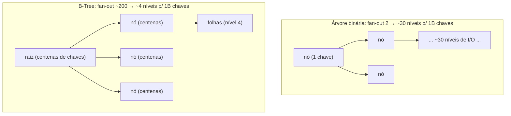
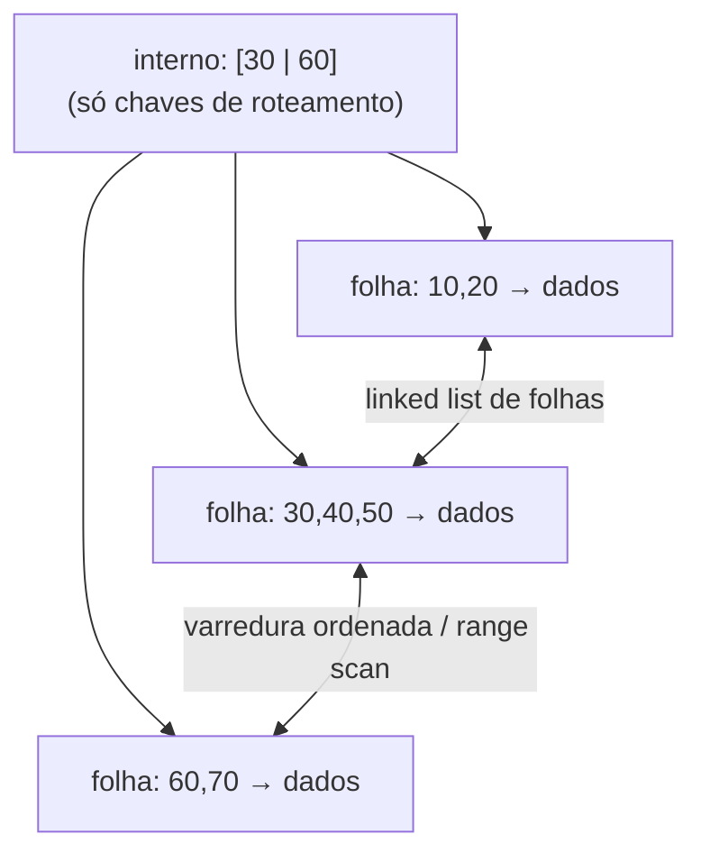
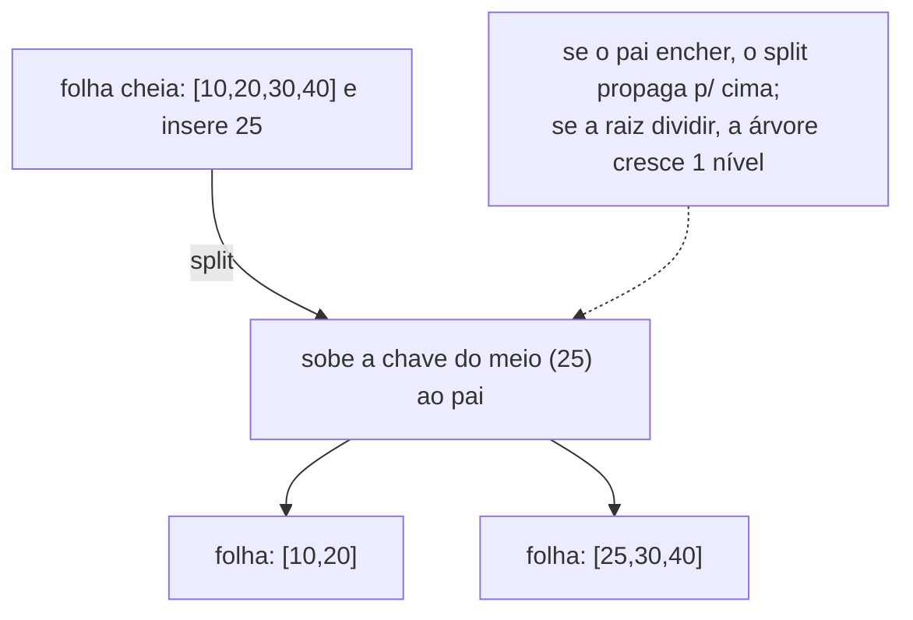

# B-Tree e B+Tree: As Árvores dos Índices de Banco e Sistemas de Arquivos

> **Bloco:** Estruturas de dados · **Nível:** Intermediário/Avançado · **Tempo de leitura:** ~30 min

## TL;DR

A **B-Tree** e sua variante **B+Tree** são as estruturas de dados que fazem os bancos de dados e sistemas de arquivos funcionarem — praticamente todo índice de banco relacional (PostgreSQL, MySQL/InnoDB, Oracle, SQL Server) e todo sistema de arquivos moderno (NTFS, ext4, Btrfs) usa uma delas. Elas existem para resolver um problema que AVL/Red-Black **não** resolvem: dados grandes demais para a memória, que vivem em **disco** (ou SSD), onde o gargalo não é comparação de CPU, mas **número de acessos a disco** (I/O), cada um milhares de vezes mais lento que um acesso à RAM. A ideia central é trocar o fan-out 2 das árvores binárias (que daria ~30 níveis para 1 bilhão de chaves, logo ~30 I/Os) por um **fan-out altíssimo** — cada nó é uma **página de disco** (tipicamente 4-16 KB) que cabe **centenas de chaves e ponteiros** — derrubando a altura para **3-4 níveis**, ou seja, **3-4 acessos a disco** para encontrar qualquer registro entre bilhões. São árvores **balanceadas por construção** (todas as folhas no mesmo nível) e crescem **de baixo para cima** via **splits** (quando um nó enche) e encolhem via **merges**, mantendo cada nó pelo menos meio cheio. A **diferença crucial entre B-Tree e B+Tree**: na B-Tree os dados/valores ficam em **todos os nós**; na **B+Tree os dados ficam só nas folhas**, e os nós internos guardam apenas chaves de roteamento — além disso, as **folhas são encadeadas numa linked list**, o que torna **range scans e ORDER BY extremamente eficientes** (achar o início em O(log n) e depois varrer as folhas sequencialmente). Por isso **a B+Tree é a escolha esmagadora de bancos de dados**: índice = árvore de busca para o ponto de entrada + linked list de folhas para varredura ordenada — exatamente o que o `use-the-index-luke` resume como "índice = doubly linked list + search tree".

## O problema que resolve

AVL e Red-Black são ótimas — **em memória**. O problema é que muitos dados não cabem em memória: a tabela de pedidos de um e-commerce tem bilhões de linhas, o índice mora em **disco**. E em disco, a economia muda completamente de natureza.

O custo dominante deixa de ser "quantas comparações a CPU faz" (nanossegundos) e passa a ser **"quantas vezes preciso ir ao disco"**. Um acesso a disco mecânico (HDD) leva ~10 ms — cerca de **100.000× mais lento** que um acesso à RAM; mesmo um SSD é centenas de vezes mais lento e tem latência de página. Pior: o disco não lê um byte de cada vez, lê **blocos/páginas** inteiros (tipicamente 4-16 KB) de uma vez. Logo, a métrica que importa para uma estrutura em disco é **minimizar o número de páginas lidas** — não o número de comparações.

Agora veja por que uma árvore binária (AVL/Red-Black) é **terrível em disco**. Ela tem fan-out 2: cada nó tem 2 filhos, então a altura é **log₂(n)**. Para 1 bilhão de chaves, isso é ~30 níveis. Como cada nó costuma estar numa página diferente do disco, descer a árvore custa **~30 acessos a disco** — ~300 ms por busca. Inaceitável. Pior ainda: um nó de árvore binária tem só uma chave e dois ponteiros (~24 bytes), mas você é obrigado a ler uma **página inteira de 16 KB** para buscá-lo — **desperdiçando 99,8% do I/O**.

A B-Tree resolve isso virando a lógica de cabeça para baixo: **se eu tenho que ler uma página de 16 KB de qualquer jeito, que essa página esteja cheia de chaves úteis**. Em vez de 1 chave por nó, um nó de B-Tree guarda **centenas de chaves** (quantas couberem na página) e, portanto, **centenas de ponteiros para filhos** — um **fan-out de centenas**. Com fan-out 200, a altura para 1 bilhão de chaves cai para **log₂₀₀(10⁹) ≈ 4 níveis** — apenas **~4 acessos a disco**. A mesma quantidade de dados, de ~30 I/Os para ~4. Essa é a razão de existir da B-Tree: **otimizar para a hierarquia de memória**, onde o custo é o número de páginas/blocos acessados, não o número de comparações.

A pergunta central que B-Tree/B+Tree respondem: **"como buscar, inserir e fazer range queries em dados maiores que a memória, minimizando acessos a disco?"**. E a B+Tree adiciona uma segunda resposta para um segundo problema típico de banco: **"como fazer varreduras ordenadas (range scans, ORDER BY) eficientemente?"** — encadeando as folhas numa lista ligada para que, achado o início, baste seguir os ponteiros sem voltar à raiz.

## O que é (definição aprofundada)

### B-Tree

Uma **B-Tree de ordem `m`** é uma árvore de busca balanceada generalizada onde cada nó pode ter **até `m` filhos** (e até `m-1` chaves), com as propriedades:

- **Todos os nós-folha estão no mesmo nível** — a árvore é **perfeitamente balanceada por construção** (não só "aproximadamente" como AVL/Red-Black).
- **Cada nó (exceto a raiz) está pelo menos meio cheio** — tem entre `⌈m/2⌉-1` e `m-1` chaves. Isso garante uso de espaço ≥ ~50% e limita a altura.
- **Chaves dentro de um nó ficam ordenadas**, e os ponteiros para filhos intercalam as chaves: o filho entre a chave `k_i` e `k_{i+1}` contém todas as chaves nesse intervalo (generalização do invariante da BST).
- **Os dados (valores/ponteiros para registros) ficam em TODOS os nós** — internos e folhas. Achar uma chave pode terminar num nó interno, sem chegar à folha.

Busca: começa na raiz, faz busca (binária) dentro do nó para achar o intervalo certo, desce para o filho correspondente; repete. O(log_m n) níveis = O(log_m n) acessos a disco.

### B+Tree

A **B+Tree** é a variante dominante em bancos, com duas diferenças decisivas em relação à B-Tree:

1. **Dados só nas folhas.** Os nós **internos** guardam **apenas chaves de roteamento** (separadores) e ponteiros para filhos — **nenhum dado/valor**. Todos os valores/registros (ou ponteiros para eles) ficam exclusivamente nas **folhas**. Consequência: como os nós internos não carregam dados, eles cabem **mais chaves por página** → **fan-out ainda maior** → árvore ainda mais baixa. E toda busca percorre exatamente a mesma altura (sempre vai até a folha), tornando a performance uniforme.
2. **Folhas encadeadas (linked list).** As folhas são ligadas entre si numa **lista (frequentemente duplamente) encadeada**, em ordem de chave. Isso transforma **range scans e ORDER BY** numa operação ótima: você desce a árvore uma vez (O(log n)) até a folha do início do range, e depois **varre as folhas sequencialmente** seguindo os ponteiros, sem nunca voltar à raiz — leitura sequencial, cache-friendly, ideal para disco.

É essa combinação que o site *Use The Index, Luke!* resume na frase clássica: **um índice de banco é uma doubly linked list (as folhas) combinada com uma search tree (a parte interna para chegar rápido a uma folha)**. A search tree dá o lookup pontual O(log n); a linked list dá o range scan eficiente.

### B-Tree vs B+Tree (comparação)

| Critério | B-Tree | B+Tree |
|---|---|---|
| Onde ficam os dados | em **todos** os nós (internos + folhas) | **só nas folhas** |
| Nós internos | guardam chaves **e** dados | guardam **só chaves** de roteamento |
| Fan-out | menor (dados ocupam espaço nos internos) | **maior** (internos só com chaves) → árvore mais baixa |
| Busca pontual | pode terminar num nó interno (às vezes mais curta) | sempre vai até a folha (altura uniforme) |
| Range scan / ORDER BY | ineficiente (precisa percorrer a árvore inteira) | **excelente** (folhas encadeadas → varredura sequencial) |
| Chave duplicada nos níveis | não (cada chave aparece uma vez) | sim (chaves de roteamento repetem nas folhas) |
| Uso típico | alguns sistemas de arquivos, índices antigos | **índices de banco** (PostgreSQL, InnoDB), FS modernos |

### Splits e merges (como a árvore se mantém balanceada)

- **Split (na inserção):** quando você insere numa folha que está **cheia**, ela **se divide em duas** e a chave do meio "sobe" para o pai. Se o pai também encher, ele se divide e sobe outra chave — o split pode **propagar até a raiz**; se a raiz se divide, a árvore **cresce um nível**. É assim que a B-Tree cresce: **de baixo para cima**, mantendo todas as folhas no mesmo nível.
- **Merge / redistribuição (na remoção):** quando uma remoção deixa um nó com menos que o mínimo (`⌈m/2⌉-1` chaves), ele **pega emprestado** de um irmão (redistribuição) ou **se funde** com um irmão (merge), o que pode propagar para cima e eventualmente **encolher** a árvore um nível.

Essas operações mantêm os dois invariantes (folhas niveladas e nós ≥ meio cheios) e são todas O(log n) em número de páginas tocadas.

### Tabela de complexidades

| Operação | B-Tree / B+Tree | Em termos de I/O de disco |
|---|---|---|
| Busca pontual | O(log_m n) | **~altura** (3-4 acessos típicos) |
| Inserção | O(log_m n) | ~altura (+ split ocasional) |
| Remoção | O(log_m n) | ~altura (+ merge ocasional) |
| Range scan (k resultados) | O(log_m n + k) | altura + varredura sequencial das folhas (B+Tree) |
| Min / Max | O(log_m n) | descer até a folha mais à esquerda/direita |
| Espaço | O(n) | nós ≥ ~50% cheios (garantido) |

`m` é o fan-out (centenas). A base `m` do logaritmo é o que torna a altura minúscula: log₂₀₀(10⁹) ≈ 4.

## Como funciona

**Por que o fan-out alto domina.** A altura de uma árvore de fan-out `m` com `n` chaves é `log_m(n)`. Comparando para n = 1 bilhão: árvore binária (m=2) → ~30 níveis; B-Tree com m=200 → ~4 níveis. Como cada nível = um acesso a disco, isso é a diferença entre ~30 I/Os e ~4 I/Os por busca. O fan-out é determinado pelo **tamanho da página** dividido pelo **tamanho de (chave + ponteiro)**: numa página de 16 KB com chaves de ~16 bytes + ponteiros de ~8 bytes, cabem centenas de entradas. Por isso bancos alinham o tamanho do nó ao **tamanho da página do disco/SO** (InnoDB usa páginas de **16 KB** por padrão; PostgreSQL, 8 KB).

**Caminho de uma busca.** Raiz (geralmente já em memória/buffer pool) → busca binária *dentro* do nó (em RAM, barata) para achar o ponteiro certo → carrega a próxima página (1 I/O, ou hit no buffer pool) → repete até a folha. Os níveis superiores (raiz, primeiro nível interno) ficam quase sempre **cacheados em memória** (buffer pool/page cache) porque são acessados em toda busca; só os níveis inferiores causam I/O real — daí, na prática, frequentemente **1-2 I/Os** por busca, não 4.

**Range scan na B+Tree (a grande vantagem).** Para `WHERE preco BETWEEN 100 AND 500 ORDER BY preco`: desce a árvore até a folha que contém 100 (O(log n)), e então **segue os ponteiros da linked list de folhas** lendo páginas sequencialmente até passar de 500. Leitura sequencial em disco é **muito mais rápida** que acessos aleatórios, e o `ORDER BY preco` sai **de graça** (as folhas já estão em ordem). É por isso que um índice B+Tree acelera não só `=` mas também `<`, `>`, `BETWEEN`, `ORDER BY`, `GROUP BY` e prefix matching (`LIKE 'abc%'`) — tudo que se beneficia de ordem.

**Clustered vs secondary index (InnoDB).** No InnoDB (MySQL), a tabela **é** uma B+Tree organizada pela primary key (o **clustered index**): as folhas contêm as **linhas inteiras**. Índices secundários são outras B+Trees cujas folhas contêm a chave indexada + a **primary key** (não a linha) — então uma busca por índice secundário faz um lookup na sua árvore e depois um segundo lookup na árvore clustered (o "bookmark lookup"). Entender isso explica por que primary keys longas penalizam todos os índices secundários no InnoDB — detalhe de design de schema que um arquiteto deve conhecer.

## Diagrama de fluxo

O primeiro diagrama contrasta a altura de uma árvore binária com a de uma B-Tree para o mesmo número de chaves; o segundo mostra a estrutura de uma B+Tree (chaves nos internos, dados + linked list nas folhas); o terceiro mostra um split de folha cheia na inserção.







## Exemplo prático / caso real

**Caso 1 — Índice de pedidos no PostgreSQL/MySQL (o caso canônico).** Numa plataforma de e-commerce brasileira, a tabela `pedidos` tem 500 milhões de linhas. A query `SELECT * FROM pedidos WHERE cliente_id = 12345` sem índice faz um **full table scan** — lê as 500M linhas, dezenas de segundos. Com `CREATE INDEX idx_cliente ON pedidos(cliente_id)`, o banco cria uma **B+Tree** sobre `cliente_id`; a mesma query agora desce ~3-4 níveis (alguns dos quais cacheados no buffer pool) e acha os pedidos em **milissegundos**. Por padrão, tanto o `CREATE INDEX` do PostgreSQL quanto os índices do InnoDB **são B-Trees** (B+Trees) — é literalmente a estrutura de dados deste documento rodando em produção sob toda consulta indexada.

**Caso 2 — Range query e ORDER BY (a vantagem da B+Tree).** `SELECT * FROM pedidos WHERE data BETWEEN '2026-01-01' AND '2026-03-31' ORDER BY data` com índice em `data`: o banco desce a B+Tree até a folha de `2026-01-01` (O(log n)) e então **varre a linked list de folhas** sequencialmente até `2026-03-31`. O `ORDER BY data` não custa nada extra — as folhas já estão ordenadas. Se fosse um índice **hash**, isso seria impossível (hash só serve `=`); a B+Tree serve igualdade *e* range *e* ordenação. Reconhecer que "índices aceleram range/ORDER BY porque são B+Trees com folhas encadeadas" é entendimento de arquiteto.

**Caso 3 — Por que o índice errado não é usado.** Um detalhe que diferencia o sênior: índices B+Tree compostos (`(cliente_id, data)`) seguem a **regra do prefixo mais à esquerda** — o índice serve `WHERE cliente_id = X`, `WHERE cliente_id = X AND data > Y`, mas **não** `WHERE data > Y` sozinho (a ordem da árvore é por `cliente_id` primeiro). Entender que a estrutura física (B+Tree ordenada por uma sequência de colunas) determina quais queries o índice acelera vem direto de entender a estrutura de dados — e é a base de tuning de banco que o *use-the-index-luke* ensina.

**Caso 4 — Sistemas de arquivos.** NTFS (Windows), ext4 (HTree para diretórios), Btrfs e ReFS usam B-Trees/B+Trees para indexar metadados e localizar arquivos/blocos rapidamente em volumes enormes. O mesmo princípio (minimizar acessos a disco com fan-out alto) que serve bancos serve sistemas de arquivos — a estrutura é a mesma, o domínio é "achar um arquivo entre milhões" em vez de "achar uma linha entre bilhões".

Pseudocódigo da busca pontual:

```
function busca(no, chave):
    i = buscaBinariaNoNo(no.chaves, chave)   // dentro da página, em RAM
    if no é folha:
        return no.dados[i] se no.chaves[i] == chave senão NAO_ENCONTRADO
    else:
        filho = carregaPagina(no.filhos[i])   // 1 acesso a disco (ou hit no buffer pool)
        return busca(filho, chave)             // recursão: O(log_m n) níveis
```

## Quando usar / Quando evitar

**Use B-Tree/B+Tree quando:**

- Os dados vivem **em disco/SSD** e são grandes demais para a memória — o gargalo é **I/O**, não CPU.
- Você precisa de **busca pontual E range queries E ordenação** numa mesma estrutura (é o sweet spot da B+Tree).
- Construir **índices de banco** (é o default e a escolha certa para a vasta maioria dos índices) ou estruturas de sistema de arquivos.
- O padrão de acesso é **misto** (leituras pontuais + varreduras) e a ordem importa.

**Prefira B+Tree (sobre B-Tree) quando:** há **range scans / ORDER BY / iteração ordenada** — a linked list de folhas é decisiva. É por isso que bancos usam B+Tree, não B-Tree pura.

**Evite/use outra coisa quando:**

- Os dados cabem **em memória** e você só precisa de busca por chave **sem ordem** → **hash table** (O(1)).
- Em memória e precisa de ordem, mas o volume é moderado → **AVL/Red-Black** (mais simples; o fan-out alto da B-Tree é desperdiçado quando não há custo de I/O).
- A carga é **write-heavy extrema** com muita inserção aleatória → considere **LSM-Trees** (Log-Structured Merge, usadas em Cassandra, RocksDB, LevelDB), que otimizam escrita sequencial ao custo de leitura — o principal "rival" da B-Tree em bancos NoSQL/write-intensive.
- Você só precisa de igualdade exata e o banco oferece **índice hash** — para `=` puro pode ser marginalmente mais rápido (mas perde range/ordem).

## Anti-padrões e armadilhas comuns

- **Usar árvore binária (AVL/Red-Black) para dados em disco.** Fan-out 2 → ~log₂(n) acessos a disco, ordens de magnitude pior que B-Tree. Confundir o domínio (memória vs disco) é o erro conceitual central que B-Trees existem para evitar.
- **Confundir B-Tree e B+Tree.** A diferença (dados em todos os nós vs só nas folhas + folhas encadeadas) é exatamente o que torna a B+Tree boa para range scans. Numa entrevista, dizer "bancos usam B+Tree porque as folhas encadeadas dão range scan eficiente" é o que se espera.
- **Achar que índice hash e B-Tree são intercambiáveis.** Hash serve só `=`; B-Tree serve `=`, `<`, `>`, `BETWEEN`, `ORDER BY`, prefix. Escolher hash para uma coluna que sofre range queries é desperdiçar o índice.
- **Violar a regra do prefixo mais à esquerda em índices compostos.** Um índice `(a, b)` não acelera `WHERE b = X` sozinho — a árvore é ordenada por `a` primeiro. Erro de tuning comuníssimo.
- **Criar índices demais (write amplification).** Cada índice é uma B+Tree que precisa ser **atualizada em todo INSERT/UPDATE/DELETE** (com possíveis splits). Índices aceleram leitura mas penalizam escrita e ocupam espaço. Indexar tudo é anti-padrão.
- **Ignorar a fragmentação / page splits.** Inserções aleatórias (ex.: primary key UUID v4) causam splits constantes e fragmentação das páginas, degradando o índice. PKs sequenciais (auto-increment, UUID v7) inserem no fim e evitam splits — daí a discussão "UUID vs auto-increment como PK" no InnoDB.
- **Esquecer que a primary key do InnoDB está em todo índice secundário.** Como índices secundários do InnoDB guardam a PK nas folhas, uma PK larga (ex.: string longa) infla **todos** os índices secundários. Detalhe de design de schema.
- **Subestimar o buffer pool / page cache.** Na prática, os níveis superiores da B-Tree ficam em memória, então a busca raramente custa a altura toda em I/O. Tuning de memória (buffer pool) é tão importante quanto o índice em si.

## Relação com outros conceitos

- **Árvores de busca (BST/AVL/Red-Black):** a B-Tree é a **generalização para alto fan-out** dessas árvores binárias, trocando o domínio de **memória** (binárias) por **disco** (B-Tree). O conceito de "balanceada → O(log n)" vem de lá. Veja [Árvores de Busca: BST, AVL, Red-Black](04-arvores-de-busca-bst-avl-red-black.md).
- **Arrays e cache locality:** o princípio "ler um bloco grande contíguo de uma vez é melhor que muitos acessos esparsos" é a versão em disco da cache locality discutida em [Arrays e Linked Lists](01-arrays-e-linked-lists.md) — a B-Tree é cache/IO-locality aplicada à hierarquia de memória.
- **Hash Tables:** a alternativa para **igualdade exata** (índice hash, O(1)) vs a B+Tree para **range + ordem** (O(log n)). A escolha entre índice hash e B-Tree é decisão de schema. Veja [Hash Tables](03-hash-tables.md).
- **Índices de banco, read replicas e particionamento:** B+Trees são o substrato físico de quase todo índice; entender sua estrutura é a base de tuning de consultas e de decisões de particionamento. Veja [Read Replicas, Sharding, Particionamento](../05-dados-e-persistencia/03-read-replicas-sharding-particionamento.md).
- **OLTP vs OLAP:** B-Trees brilham em OLTP (lookups e ranges pontuais); cargas OLAP analíticas frequentemente preferem armazenamento colunar e outras estruturas. Veja [OLTP vs OLAP, Lambda, Kappa](../05-dados-e-persistencia/07-oltp-vs-olap-lambda-kappa.md).
- **Complexidade algorítmica:** O(log_m n) e por que a base do logaritmo (fan-out) domina o número de I/Os; análise em modelo de I/O em vez de modelo de comparações. Veja [Complexidade Algorítmica](../11-complexidade-algoritmica/01-notacao-assintotica-big-o.md).

## Referências

- [The Balanced Search Tree (B-Tree) in SQL Databases — Use The Index, Luke!](https://use-the-index-luke.com/sql/anatomy/the-tree)
- [The Leaf Nodes of an SQL Index — Use The Index, Luke!](https://use-the-index-luke.com/sql/anatomy/the-leaf-nodes)
- [Introduction of B+ Tree — GeeksforGeeks](https://www.geeksforgeeks.org/dbms/introduction-of-b-tree/)
- [Difference between B tree and B+ tree — GeeksforGeeks](https://www.geeksforgeeks.org/dsa/difference-between-b-tree-and-b-tree/)
- [PostgreSQL Documentation: B-Tree Indexes](https://www.postgresql.org/docs/current/btree.html)
- [MySQL 8.0 Reference Manual: The Physical Structure of an InnoDB Index](https://dev.mysql.com/doc/refman/8.0/en/innodb-physical-structure.html)
- [MySQL 8.0 Reference Manual: Comparison of B-Tree and Hash Indexes](https://dev.mysql.com/doc/refman/8.0/en/index-btree-hash.html)
- [B+ tree — Wikipedia](https://en.wikipedia.org/wiki/B%2B_tree)
