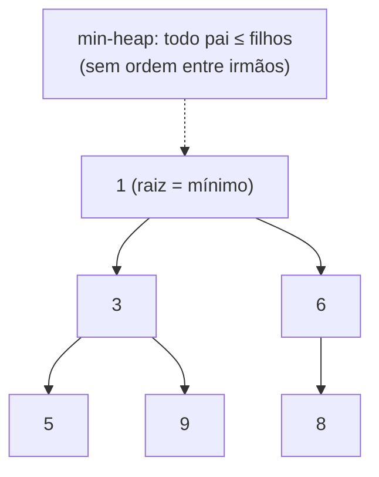
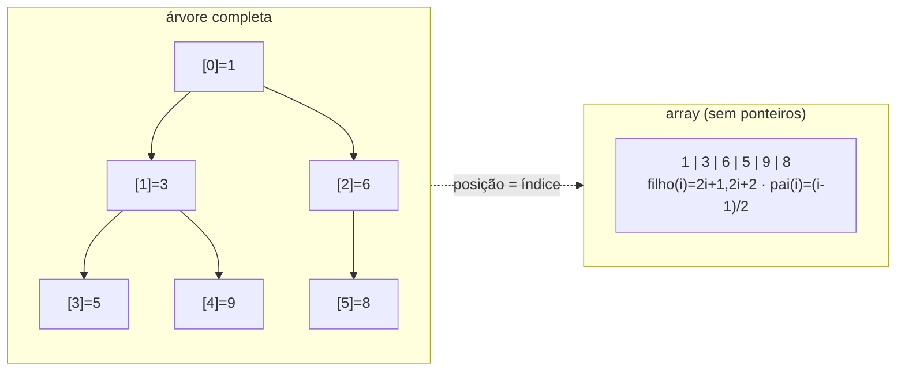
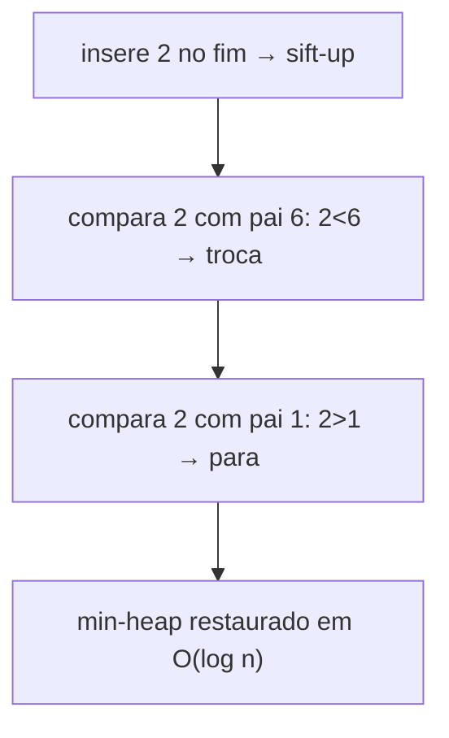

# Heaps (Min-Heap, Max-Heap), Heapify e a Base das Priority Queues

> **Bloco:** Estruturas de dados · **Nível:** Intermediário/Avançado · **Tempo de leitura:** ~26 min

## TL;DR

O **heap** (especificamente o **heap binário**) é a estrutura que dá acesso **O(1) ao menor (ou maior) elemento** de uma coleção, com inserção e remoção em **O(log n)** — e é a implementação canônica da **priority queue**. A genialidade do heap é fazer **menos do que ordenar**: enquanto ordenar uma coleção é O(n log n) e mantém *tudo* em ordem, o heap mantém apenas uma **ordem parcial** — só garante a relação entre **pai e filhos**, o que é suficiente para manter o **extremo (mínimo ou máximo) sempre no topo** e custa muito menos. Estruturalmente, um heap é uma **árvore binária completa** (todos os níveis cheios, exceto possivelmente o último, preenchido da esquerda para a direita) que satisfaz a **propriedade de heap**: num **max-heap**, todo pai é ≥ seus filhos (a raiz é o máximo); num **min-heap**, todo pai é ≤ seus filhos (a raiz é o mínimo). E o detalhe que o torna eficiente e elegante: por ser uma árvore *completa*, ele é armazenado **num array sem ponteiros** — o filho esquerdo do índice `i` está em `2i+1`, o direito em `2i+2`, o pai em `(i-1)/2`. Isso dá **cache locality excelente** (contíguo) e zero overhead de ponteiros. As operações se baseiam em dois movimentos: **sift-up** (sobe um elemento trocando com o pai, usado na inserção) e **sift-down / heapify** (desce um elemento trocando com o menor/maior filho, usado na remoção e na construção). Um resultado contraintuitivo e muito cobrado: **construir um heap a partir de N elementos é O(n)**, não O(n log n). O heap é a base de **priority queues**, do algoritmo **heapsort** (O(n log n), in-place), de **Dijkstra/Prim**, de **top-K** e de schedulers/timers.

## O problema que resolve

Considere uma necessidade recorrente: você tem uma coleção que muda o tempo todo (itens entram e saem), e a única coisa que importa é **acessar repetidamente o extremo** — o menor ou o maior — e removê-lo. Exemplos: o próximo evento a disparar (menor timestamp), a tarefa de maior prioridade, a aresta mais barata em Dijkstra, os K maiores de um stream. A pergunta é: **"como acessar e remover sempre o mínimo (ou máximo) de uma coleção dinâmica, eficientemente?"**.

Veja por que as opções óbvias são ruins:

- **Array/lista não-ordenada:** inserir é O(1), mas **achar o mínimo é O(n)** (varredura). Para uma coleção dinâmica onde você extrai o mínimo repetidamente, isso é caro.
- **Array/lista ordenada:** achar o mínimo é O(1) (é o primeiro), mas **inserir mantendo a ordem é O(n)** (precisa deslocar). Você paga o preço de manter *tudo* ordenado quando só precisa do extremo.
- **Árvore balanceada (AVL/Red-Black):** dá O(log n) para tudo, inclusive min/max — funciona, mas é **excessiva**: mantém a coleção *inteira* ordenada (predecessor, sucessor, range...), o que você não precisa, ao custo de ponteiros, rotações e cache locality ruim.

O heap acerta o ponto exato: ele percebe que **não é preciso ordenar tudo para ter o extremo sempre acessível**. Basta manter uma **ordem parcial** — a propriedade de que cada pai domina seus filhos. Com isso, o **máximo (ou mínimo) está garantidamente na raiz** (acesso O(1)), e inserir/remover só precisam restaurar essa ordem parcial **ao longo de um único caminho da árvore** (altura = log n), não na coleção toda. É fazer o mínimo de trabalho necessário para o objetivo — uma lição de design.

Há um segundo problema que o heap resolve com elegância surpreendente: o **espaço e a cache locality**. Uma árvore binária normal precisa de ponteiros (esquerda, direita, pai) — memória extra e nós espalhados (cache misses). Mas como o heap é uma árvore **completa** (sem buracos, preenchida da esquerda para a direita), ela tem uma correspondência perfeita com um **array compacto**: a posição na árvore *determina* o índice no array por aritmética. Resultado: **zero ponteiros, memória contígua, cache locality excelente**, e ainda permite **heapsort in-place** (ordenar reusando o próprio array). É um dos casamentos mais bonitos entre estrutura lógica (árvore) e layout físico (array) na ciência da computação.

## O que é (definição aprofundada)

### Heap binário, propriedade de heap e árvore completa

Um **heap binário** é uma **árvore binária completa** que satisfaz a **propriedade de heap**. Duas variantes:

- **Max-heap:** para todo nó, o valor do **pai é ≥ os valores dos filhos**. Consequência: a **raiz é o máximo** de toda a coleção.
- **Min-heap:** para todo nó, o valor do **pai é ≤ os valores dos filhos**. Consequência: a **raiz é o mínimo**.

Pontos cruciais para não confundir:

- **A ordem é só vertical (pai-filho), não horizontal.** Num heap, **não há** relação garantida entre irmãos ou entre nós de subárvores diferentes (diferente da BST, onde esquerda < nó < direita). Por isso o heap **não é uma BST** e **não permite busca ordenada** — só o extremo é acessível em O(1). Buscar um elemento arbitrário num heap é O(n).
- **Árvore completa = sem buracos.** Todos os níveis estão cheios, exceto possivelmente o último, que é preenchido da **esquerda para a direita**. Isso garante **altura O(log n)** e é o que permite o armazenamento em array.

### Representação em array (sem ponteiros)

A árvore completa mapeia perfeitamente num array (0-indexado): a raiz em `0`, e para o nó no índice `i`:

- **Filho esquerdo:** `2i + 1`
- **Filho direito:** `2i + 2`
- **Pai:** `(i - 1) / 2` (divisão inteira)

Não há ponteiros: a posição na árvore *é* o índice. Isso dá memória mínima e **cache locality** (navegar pai/filhos é aritmética sobre um array contíguo). É também por isso que o heap binário tende a ser, na prática, mais rápido que estruturas de priority queue baseadas em ponteiros, mesmo com a mesma complexidade assintótica.

### Operações: sift-up, sift-down (heapify), insert, extract

Duas operações fundamentais restauram a propriedade de heap movendo um elemento por um único caminho (O(log n) = altura):

- **Sift-up (bubble-up / percolate-up):** usado na **inserção**. Coloca o novo elemento no fim do array (última posição da árvore completa) e o **faz subir**: enquanto ele violar a propriedade com o pai (ex.: num min-heap, é menor que o pai), troca com o pai. Para quando a propriedade é satisfeita ou alcança a raiz. **O(log n)**.
- **Sift-down (bubble-down / percolate-down / heapify):** usado na **remoção/extração**. Pega um elemento (tipicamente a raiz após extração) e o **faz descer**: enquanto ele violar a propriedade com algum filho, troca com o **filho de maior prioridade** (o menor num min-heap, o maior num max-heap). Para quando satisfaz ou vira folha. **O(log n)**.

Operações de alto nível:

- **`peek()` / `findMin/Max()`:** retorna a raiz (`array[0]`). **O(1)**.
- **`insert(x)`:** adiciona no fim + sift-up. **O(log n)**.
- **`extractMin/Max()`:** salva a raiz, move o **último elemento** para a raiz, reduz o tamanho, e faz **sift-down** na nova raiz. Retorna o salvo. **O(log n)**.
- **`decreaseKey/increaseKey`:** muda a prioridade de um elemento e faz sift-up/down. **O(log n)** (usado em Dijkstra).

### Build-heap (heapify de um array): O(n), não O(n log n)

Resultado clássico e contraintuitivo: dado um array arbitrário de N elementos, transformá-lo num heap (**build-heap** / `heapify`) custa **O(n)**, não O(n log n). O algoritmo: aplica **sift-down de baixo para cima**, começando do **último nó interno** (índice `n/2 - 1`) até a raiz. Por que é O(n) e não O(n log n)? Porque **a maioria dos nós está perto das folhas**, onde o sift-down percorre pouca altura: metade dos nós são folhas (sift-down 0), um quarto sift-down no máximo 1, etc. A soma `Σ (nós no nível h) × h` converge para O(n). Inserir um a um, por outro lado, seria N inserções de O(log n) = **O(n log n)**. Saber que build-heap é O(n) (e por quê) é uma das perguntas de análise amortizada/agregada mais cobradas.

### Tabela de complexidades

| Operação | Complexidade | Observação |
|---|---|---|
| `peek` (min/max) | **O(1)** | é a raiz, `array[0]` |
| `insert` | **O(log n)** | adiciona no fim + sift-up |
| `extractMin/Max` | **O(log n)** | move último p/ raiz + sift-down |
| `decreaseKey/increaseKey` | **O(log n)** | sift-up/down a partir do nó |
| `delete` (nó arbitrário) | O(log n) | se você tem o índice |
| **`build-heap`** (heapify de N) | **O(n)** | sift-down bottom-up (não O(n log n)!) |
| busca de elemento arbitrário | O(n) | heap não é ordenado p/ busca |
| espaço | O(n) | array compacto, **sem ponteiros** |

### Outras variantes (panorama)

O heap binário é o mais comum, mas há variantes com trade-offs: **d-ary heap** (cada nó tem `d` filhos — menos altura, mais comparações por nível; melhor cache em alguns casos), **binomial heap** e **Fibonacci heap** (suportam **merge** eficiente e `decreaseKey` amortizado O(1) — relevante teoricamente para Dijkstra/Prim, raramente usados na prática por constantes altas), **pairing heap** (boa performance prática). Para a maioria dos usos, **heap binário em array** é a escolha certa.

## Como funciona

**Insert (sift-up) passo a passo (min-heap).** Insere `x` na próxima posição livre (fim do array). Compara `x` com o pai em `(i-1)/2`; se `x` é menor (viola min-heap), troca; repete subindo. Como sobe no máximo a altura da árvore, é **O(log n)**.

**ExtractMin (sift-down) passo a passo (min-heap).** A raiz (`array[0]`) é o mínimo — salva. Move o **último** elemento do array para a posição 0 e reduz o tamanho (mantém a árvore completa). Agora a raiz pode violar a propriedade: faz **sift-down** — compara com os dois filhos, troca com o **menor** deles se for menor que a raiz; repete descendo até virar folha ou satisfazer. **O(log n)**. (O truque de mover o *último* elemento para a raiz, em vez de "promover o menor filho recursivamente", é o que mantém a árvore completa.)

**Por que mover o último elemento para a raiz?** Porque a árvore precisa permanecer **completa** (sem buracos). O último elemento é o único que pode ser removido sem criar buraco; movê-lo para a raiz e descê-lo restaura a forma e a propriedade simultaneamente.

**Build-heap O(n) (intuição da soma).** Aplicando sift-down dos nós internos de baixo para cima: os ~n/2 nós-folha não fazem nada; os ~n/4 nós do penúltimo nível descem ≤1; os ~n/8 descem ≤2; ... A soma do trabalho é `Σ_{h} (n / 2^{h+1}) × h = n × Σ h/2^{h+1}`, e essa série converge para uma **constante** — logo **O(n)**. A maior parte do trabalho está concentrada perto das folhas, onde a altura a percorrer é pequena.

**Heapsort (ordenação in-place O(n log n)).** Combina os dois: (1) **build-heap** num max-heap O(n); (2) repetidamente **troca a raiz (máximo) com o último elemento**, reduz o heap em 1, e faz **sift-down** da nova raiz — O(log n) por extração, N vezes = O(n log n). O array fica ordenado crescente, **in-place** (sem memória extra) — uma das vantagens do heapsort sobre o mergesort. (O ponto fraco do heapsort vs quicksort na prática é justamente a **cache locality** dos saltos do sift-down, apesar do array contíguo.)

## Diagrama de fluxo

O primeiro diagrama mostra um min-heap como árvore (raiz = mínimo); o segundo mostra o mapeamento árvore → array (índices `2i+1`, `2i+2`); o terceiro mostra um sift-up durante uma inserção.







## Exemplo prático / caso real

**Caso 1 — Fila de prioridade de pedidos urgentes (priority queue via heap).** Numa plataforma de e-commerce/logística brasileira, pedidos com SLA apertado (entrega expressa) devem ser processados antes dos comuns, independente de quando chegaram. Um **min-heap** ordenado pelo "deadline de processamento" mantém o pedido mais urgente sempre na raiz: `extractMin` (O(log n)) entrega o próximo a processar, `insert` (O(log n)) adiciona novos. É a priority queue do documento de Stacks/Queues materializada por um heap — a estrutura que torna "sempre pegar o mais urgente" eficiente.

**Caso 2 — Top-K produtos mais vendidos (min-heap de tamanho K).** Para os "20 produtos mais vendidos" a partir de um stream de milhões de vendas sem ordenar tudo (O(n log n)), mantém-se um **min-heap de tamanho 20**: a raiz é o 20º colocado atual; para cada produto, se sua contagem > raiz, faz `extractMin` + `insert`. Custo total **O(n log K)** com **O(K)** de memória. O min-heap (e não max-heap) é a escolha correta para top-K *máximos*, porque você quer descartar rapidamente o **menor** dos atuais — uma sutileza que entrevistadores adoram cobrar.

**Caso 3 — Scheduler de eventos / timers (event-driven simulation).** Um sistema que dispara tarefas agendadas (jobs cron, timeouts, simulações) usa um **min-heap por timestamp**: a raiz é o próximo evento a disparar. O loop principal faz `peek` (O(1)) para saber quando acordar e `extractMin` (O(log n)) para processar. É a base de timer wheels, schedulers e simuladores discretos — onde "qual é o próximo evento no tempo?" é a pergunta central.

**Caso 4 — Dijkstra para roteamento de entregas.** Como no documento de priority queues, Dijkstra usa um **min-heap** para extrair sempre o vértice de menor distância ainda não finalizado (O(log n)) e relaxar arestas com `decreaseKey`. O heap é o que torna Dijkstra eficiente; sem ele, achar o mínimo a cada passo seria O(V) (busca linear), degradando o algoritmo de O((V+E) log V) para O(V²). A estrutura de dados é, literalmente, o que define a complexidade do algoritmo.

Pseudocódigo de extractMin (min-heap):

```
function extractMin(heap):
    min = heap.array[0]                    // O(1): a raiz é o mínimo
    ultimo = heap.array[heap.size - 1]
    heap.array[0] = ultimo                 // move o último p/ a raiz
    heap.size -= 1
    siftDown(heap, 0)                      // O(log n): desce restaurando a ordem
    return min

function siftDown(heap, i):
    while true:
        menor = i
        L = 2*i + 1; R = 2*i + 2
        if L < heap.size and heap.array[L] < heap.array[menor]: menor = L
        if R < heap.size and heap.array[R] < heap.array[menor]: menor = R
        if menor == i: break               // satisfaz a propriedade
        troca(heap.array, i, menor)
        i = menor
```

## Quando usar / Quando evitar

**Use heap quando:**

- Você precisa de acesso/remoção **repetida do extremo** (min ou max) de uma coleção **dinâmica** — o caso de uso central da priority queue.
- Implementar **priority queues**, **Dijkstra/Prim**, **top-K**, **schedulers/timers**, **event-driven simulation**, **mediana em stream** (two-heaps), **Huffman**.
- Você quer **ordenação in-place** com pior caso O(n log n) garantido → **heapsort**.
- Memória importa: o heap em array tem **zero overhead de ponteiros** e ótima cache locality.

**Evite/use outra coisa quando:**

- Você precisa **buscar elementos arbitrários** (não o extremo), iterar em ordem, fazer range queries, predecessor/sucessor → o heap **não serve** (busca arbitrária é O(n)); use **árvore balanceada** ou **hash table**.
- Você precisa de **acesso O(1) por chave** sem ordem → **hash table**.
- Você precisa da coleção **inteira ordenada** de uma vez → **ordenação** (e o heapsort é uma opção) ou árvore balanceada.
- Há **pouquíssimos elementos** → uma busca linear pelo mínimo (O(n) com n pequeno) pode ser mais simples e cabe em cache.

## Anti-padrões e armadilhas comuns

- **Confundir heap com BST.** O heap só ordena **pai-filho** (ordem parcial), não esquerda-direita. **Não dá para buscar** um elemento arbitrário em O(log n) num heap (é O(n)) — só o extremo é O(1). Confundir os dois invariantes é erro conceitual frequente.
- **Achar que build-heap é O(n log n).** Construir um heap de N elementos via sift-down bottom-up é **O(n)**; só inserir um a um é O(n log n). Errar isso (ou não saber explicar por quê) é uma falha clássica de entrevista.
- **Usar max-heap quando precisa de min (e vice-versa) no top-K.** Para os K **maiores**, use um **min-heap de tamanho K** (descarta o menor); para os K **menores**, um max-heap. Inverter é o bug mais comum em top-K.
- **Esquecer que o heap não é estável.** Elementos de mesma prioridade saem em ordem arbitrária. Se empates devem respeitar ordem de chegada (FIFO), inclua um contador de inserção como critério de desempate na chave.
- **`decreaseKey` sem saber a posição do elemento.** Para mudar a prioridade de um elemento (ex.: em Dijkstra), você precisa do seu **índice no array** — o que exige um mapa auxiliar `elemento → índice` mantido atualizado nas trocas. Esquecer isso torna `decreaseKey` O(n) (busca linear) e degrada o algoritmo.
- **Quebrar a "completude" da árvore.** Remover um elemento do meio sem mover o último para o buraco (ou inserir sem ser no fim) viola a propriedade de árvore completa e corrompe os índices `2i+1`/`2i+2`. Sempre opere nas pontas + sift.
- **Erro de índice na fórmula pai/filho.** Misturar 0-indexado (`2i+1`,`2i+2`,`(i-1)/2`) com 1-indexado (`2i`,`2i+1`,`i/2`). Ambos funcionam, mas misturá-los gera bugs sutis. Fixe uma convenção.
- **Usar heap para ordenar quando quicksort/mergesort seriam melhores na prática.** Heapsort é O(n log n) garantido e in-place, mas tem **cache locality pior** (saltos do sift-down) que o quicksort — por isso bibliotecas raramente usam heapsort puro (usam introsort: quicksort + heapsort de fallback).

## Relação com outros conceitos

- **Priority Queue:** o heap é a **implementação canônica** da priority queue (insert/extract O(log n), peek O(1)). A ADT é a interface; o heap é o motor. Veja [Stacks, Queues, Deque e Priority Queue](02-stacks-queues-deque-priority-queue.md).
- **Arrays:** o heap é uma **árvore implementada sobre um array** — herda cache locality e zero overhead de ponteiros, o oposto das árvores baseadas em nós. Veja [Arrays e Linked Lists](01-arrays-e-linked-lists.md).
- **Árvores de busca (BST/AVL/Red-Black):** o heap é uma árvore binária com invariante **diferente** (ordem parcial pai-filho, não busca ordenada) — comparar os dois invariantes esclarece ambos. Veja [Árvores de Busca: BST, AVL, Red-Black](04-arvores-de-busca-bst-avl-red-black.md).
- **Algoritmos (Dijkstra, Prim, heapsort, top-K, mediana):** o heap é a estrutura que define a complexidade desses algoritmos; sem ele, muitos degradam. Veja [Algoritmos Essenciais](../13-algoritmos-essenciais/01-bfs-dfs-grafos.md).
- **Complexidade algorítmica / análise agregada:** o build-heap O(n) (vs O(n log n) ingênuo) é um exemplo central de análise agregada/somatório; e O(1) peek vs O(log n) insert ilustram trade-offs. Veja [Complexidade Algorítmica](../11-complexidade-algoritmica/01-notacao-assintotica-big-o.md).
- **Schedulers, timers e rate limiting:** priority queues por timestamp (timer wheels, event loops) são heaps no coração de runtimes e schedulers — conectando com escalonamento e resiliência.

## Referências

- [Binary Heap — GeeksforGeeks](https://www.geeksforgeeks.org/dsa/binary-heap/)
- [Heap Data Structure — GeeksforGeeks](https://www.geeksforgeeks.org/dsa/heap-data-structure/)
- [Priority Queue using Binary Heap — GeeksforGeeks](https://www.geeksforgeeks.org/dsa/priority-queue-using-binary-heap/)
- [Difference between Min Heap and Max Heap — GeeksforGeeks](https://www.geeksforgeeks.org/dsa/difference-between-min-heap-and-max-heap/)
- [Binary Heap (Priority Queue) — VisuAlgo](https://visualgo.net/en/heap)
- [Big-O Algorithm Complexity Cheat Sheet — Common Data Structures](https://www.bigocheatsheet.com/)
- [Heap (data structure) — Wikipedia](https://en.wikipedia.org/wiki/Heap_(data_structure))
- [Binary heap — Wikipedia](https://en.wikipedia.org/wiki/Binary_heap)
