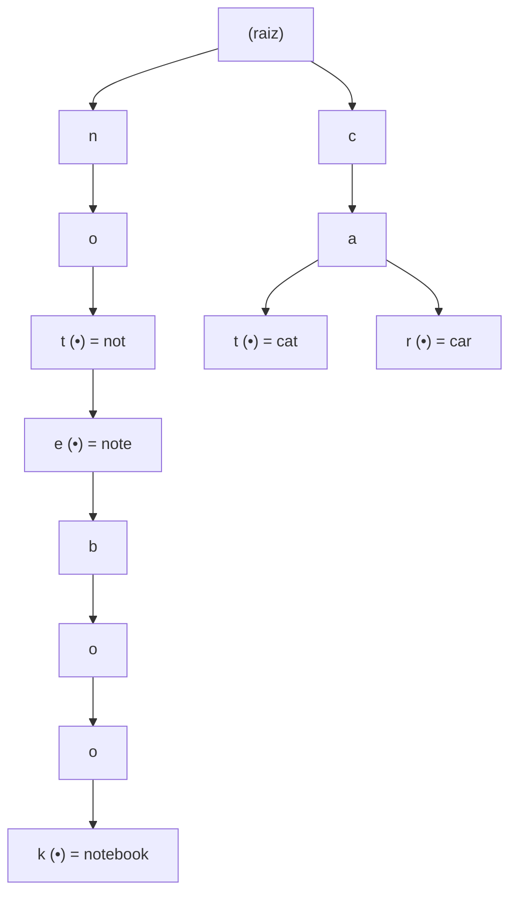
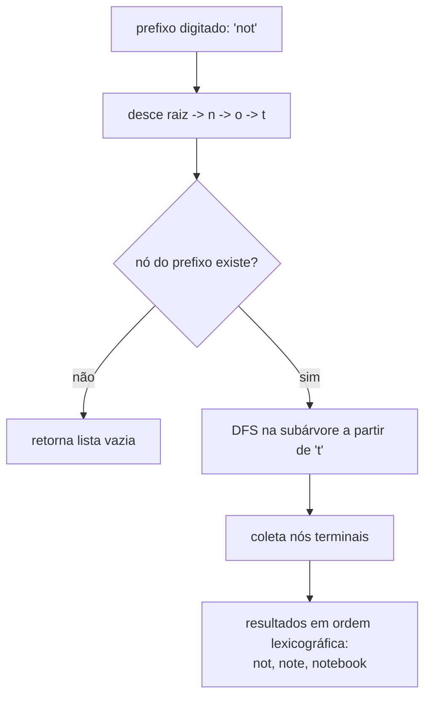

# Tries (Prefix Tree): Autocomplete e Busca por Prefixo

> **Bloco:** Estruturas de dados · **Nível:** Intermediário/Avançado · **Tempo de leitura:** ~22 min

## TL;DR

A **trie** (também chamada **prefix tree** ou **árvore digital**) é uma árvore de busca especializada em armazenar um conjunto de **strings**, onde cada nó representa um **caractere** e o caminho da raiz até um nó forma um **prefixo**. A ideia central é que strings com prefixos em comum **compartilham o mesmo caminho** na árvore (todas as palavras que começam com `ca` passam pelos mesmos dois primeiros nós), o que torna a estrutura naturalmente eficiente para **busca por prefixo** e **autocomplete**. As operações de inserção, busca e remoção custam **O(L)**, onde `L` é o comprimento da string — crucialmente, esse custo **não depende de quantas palavras** já estão armazenadas (`n`), ao contrário de uma árvore balanceada que custa `O(L · log n)` por exigir comparações de string em cada nível. A grande vantagem da trie sobre uma **hash table** não é o lookup exato (a hash é `O(1)` amortizado e geralmente vence aí), mas três capacidades que a hash não tem: enumerar todas as chaves com um dado **prefixo**, percorrer as chaves em **ordem lexicográfica**, e não sofrer **colisões de hash**. O preço é o **consumo de memória**: cada nó tem um array/mapa de filhos (até 26 ponteiros para letras minúsculas, ou 256 para bytes), o que pode desperdiçar espaço em tries esparsas. Variantes como a **trie comprimida (radix tree / Patricia trie)** mesclam cadeias de nós de único filho para reduzir memória, e o **DAWG/FST** (usado pelo Elasticsearch) compartilha também sufixos. Use trie quando a operação dominante é "todas as strings que começam com X" — autocomplete de busca, dicionários de spell-check, roteamento de IP (longest-prefix match), filtros de palavras.

## O problema que resolve

Imagine que você precisa implementar o **autocomplete de uma caixa de busca**: o usuário digita `note` e você precisa devolver, instantaneamente, todas as palavras do dicionário que começam com `note` — `notebook`, `notepad`, `notebook gamer`, `notebook usado` — ordenadas por relevância ou alfabeticamente. Quantas vezes por segundo isso acontece num site de e-commerce grande? Milhares. Cada tecla digitada dispara uma consulta.

A pergunta central é: **"como encontrar, em tempo proporcional ao tamanho do prefixo digitado (e não ao tamanho do dicionário inteiro), todas as palavras que começam com aquele prefixo?"**

Vamos avaliar as alternativas ingênuas:

- **Lista/array de strings + varredura linear:** para cada tecla, percorrer todas as `n` palavras checando se começam com o prefixo. Custo `O(n · L)` por consulta. Com um dicionário de milhões de termos, isso é inviável em tempo de digitação.
- **Hash table (`Set<String>`):** ótima para perguntar "a palavra `notebook` existe?" em `O(L)`. Mas a hash **destrói a estrutura de prefixo**: as chaves ficam espalhadas por buckets em ordem arbitrária. Não há como perguntar "quais chaves começam com `note`?" sem varrer **todas** as chaves. A hash resolve o lookup *exato*, não o lookup *por prefixo*.
- **Árvore balanceada ordenada (`TreeMap`, B-Tree):** mantém as chaves ordenadas, então um prefixo corresponde a um intervalo contíguo (`note` ≤ chave < `notf`), localizável por busca binária. Funciona! Mas cada passo da busca compara **strings inteiras** (`O(L)` por comparação), totalizando `O(L · log n)`, e cada chave é armazenada por completo (sem compartilhar prefixos).

A trie ataca exatamente o ponto cego da hash e o overhead da árvore: ela **organiza as strings pela sua estrutura de prefixos**. Navegar até o nó que representa o prefixo `note` custa apenas `O(4)` (quatro caracteres), independentemente de o dicionário ter mil ou um bilhão de palavras. A partir desse nó, toda a subárvore *é* o conjunto de palavras com aquele prefixo — basta enumerá-la. Esse é o ganho qualitativo: a busca por prefixo vira uma **descida direta** seguida de uma **travessia de subárvore**, ambas com custo desacoplado de `n`.

## O que é (definição aprofundada)

Uma **trie** é uma árvore enraizada onde:

- A **raiz** representa a string vazia (não armazena caractere).
- Cada **aresta** é rotulada por um caractere (na implementação clássica) ou cada **nó** carrega um caractere; o caminho da raiz até um nó deletreia um prefixo.
- Cada nó mantém uma coleção de **filhos** indexada por caractere — tipicamente um array de tamanho fixo (ex.: 26 para `a–z`, 256 para bytes) ou um `HashMap<Char, Node>` quando o alfabeto é grande/esparso.
- Cada nó tem uma flag booleana **`isEndOfWord`** (ou `isTerminal`) que marca se o prefixo acumulado até ali é, ele próprio, uma palavra completa inserida. Isso distingue `note` (palavra) de `note` (mero prefixo de `notebook`) quando ambos coexistem.

O nome "trie" vem de re**trie**val (recuperação); por coincidência soa como "tree", e por isso muitos pronunciam "try" para desambiguar. O ponto conceitual essencial: **a posição de uma chave na trie é determinada inteiramente pela sequência de seus caracteres**, não por um valor de hash nem por comparações relativas. Duas chaves com o mesmo prefixo de `k` caracteres compartilham, obrigatoriamente, os primeiros `k` nós do caminho.

### Variantes importantes

- **Trie padrão (standard / uncompressed):** um nó por caractere. Simples, mas pode ter longas cadeias de nós com um único filho (a palavra `internationalization` cria ~20 nós em fila se for única), desperdiçando memória.
- **Radix tree / Patricia trie (trie comprimida):** mescla cada cadeia de nós de único filho num só nó que armazena a substring inteira. Reduz drasticamente o número de nós em dicionários esparsos. É a base de roteamento IP no kernel Linux e do índice de chaves no `etcd`.
- **DAWG (Directed Acyclic Word Graph) / FST (Finite State Transducer):** compartilha não só prefixos, mas também **sufixos** comuns, transformando a árvore num grafo acíclico. O **Elasticsearch** usa um FST no seu *completion suggester* — é "como uma trie", porém muito mais compacto e mantido em memória para autocomplete relâmpago.
- **Ternary Search Tree (TST):** híbrido entre trie e BST; cada nó tem três filhos (menor/igual/maior). Usa menos memória que a trie de array quando o alfabeto é grande, ao custo de busca um pouco mais lenta.

### O que a trie oferece que a hash não oferece

Vale fixar a distinção que aparece em entrevista: a trie **não substitui** a hash table para lookup exato (a hash costuma ser mais rápida e mais enxuta nesse caso). A trie ganha quando você precisa de pelo menos uma destas três propriedades, que a hash não tem:

1. **Busca por prefixo / enumeração de prefixo** (autocomplete): "todas as chaves começando com X".
2. **Ordem lexicográfica**: percorrer as chaves em ordem alfabética é uma DFS in-order trivial; a hash não preserva ordem nenhuma.
3. **Ausência de colisões e de hashing**: o tempo de pior caso é `O(L)` determinístico, sem o risco de degradação por colisões adversariais que uma hash mal projetada sofre.

## Como funciona

**Inserção de uma palavra `w` (comprimento `L`):** parte da raiz; para cada caractere `c` de `w`, verifica se o nó atual tem um filho rotulado `c`; se não tiver, cria-o; desce para esse filho. Ao consumir o último caractere, marca o nó final como `isEndOfWord = true`. Custo `O(L)`.

**Busca exata de `w`:** mesma descida; se em algum ponto falta o filho do caractere, a palavra não existe. Se chegou ao fim de `w`, ela existe **somente se** o nó final tiver `isEndOfWord = true` (caso contrário `w` é apenas prefixo de outra palavra). Custo `O(L)`.

**Busca por prefixo `p` (`startsWith`):** desce de acordo com `p`; se completou a descida sem falhar, existe pelo menos uma palavra com esse prefixo (basta o nó existir, não precisa ser terminal). Custo `O(L_p)`.

**Autocomplete (todas as palavras com prefixo `p`):** desce até o nó do prefixo `p` (`O(L_p)`); a partir dele, faz uma **DFS/BFS na subárvore** coletando todo caminho que termine num nó `isEndOfWord`. Custo `O(L_p + tamanho da subárvore)` ≈ `O(L_p + k·L_média)` para `k` resultados. Como a DFS in-order visita os filhos em ordem de caractere, os resultados saem em **ordem lexicográfica** de graça.

**Remoção de `w`:** desce até o nó final, desmarca `isEndOfWord`; opcionalmente, sobe removendo nós que ficaram sem filhos e não são terminais (poda). Cuidado para não remover nós que ainda são prefixo de outra palavra.

| Operação | Trie | Hash Table | Árvore balanceada (BST/B-Tree) |
|---|---|---|---|
| Inserir | `O(L)` | `O(L)` amortizado | `O(L · log n)` |
| Buscar exato | `O(L)` | `O(L)` amortizado | `O(L · log n)` |
| Buscar prefixo `startsWith` | `O(L_p)` | **não suportado** (varre tudo: `O(n·L)`) | `O(L_p · log n)` |
| Listar `k` palavras com prefixo | `O(L_p + k·L)` | **não suportado** eficientemente | `O(log n + k·L)` |
| Iterar em ordem lexicográfica | `O(total de nós)` | **não suportado** | `O(n)` (in-order) |
| Memória | alta (ponteiros por nó) | moderada | moderada |

Note que `L` é o comprimento da string e `n` o número de strings: a coluna da trie **não tem `n`** nas operações pontuais — esse desacoplamento é o trunfo. A coluna da hash tem `O(1)` por caractere mas **zera** na linha de prefixo, que é justamente o caso de uso da trie.

### Custo de memória: o calcanhar de Aquiles

Cada nó de uma trie de array com alfabeto de tamanho `Σ` reserva `Σ` ponteiros (a maioria `null` em tries esparsas). Para `a–z`, são 26 ponteiros por nó; para Unicode/bytes, 256. Num dicionário com muitas palavras curtas e diversas, o número de nós explode e a maioria dos slots fica vazia. Por isso a memória da trie costuma ser **maior** que a de uma hash equivalente. Mitigações: usar `HashMap<Char,Node>` por nó (paga overhead de hash, economiza slots vazios), comprimir em **radix tree**, ou compartilhar sufixos com **DAWG/FST**. Em entrevista, mencionar esse trade-off (rápido em prefixo, caro em memória) demonstra maturidade.

## Diagrama de fluxo

O diagrama mostra uma trie contendo as palavras `note`, `notebook`, `not`, `cat` e `car`. Os nós marcados com `(•)` são terminais (`isEndOfWord = true`). Repare como `note`/`notebook`/`not` compartilham o caminho `n→o→t`, e `cat`/`car` compartilham `c→a`.



O segundo diagrama mostra o fluxo de um **autocomplete** para o prefixo `not`: desce pelos nós do prefixo e depois enumera a subárvore.



## Exemplo prático / caso real

**Cenário: autocomplete da busca de um marketplace brasileiro.** A caixa de busca precisa sugerir produtos enquanto o usuário digita. O catálogo tem milhões de termos de busca históricos (`notebook`, `notebook gamer`, `tênis nike`, `tênis adidas`, ...). A cada tecla, o front-end consulta `/suggest?q=note` e espera resposta em poucos milissegundos.

Implementação com trie no serviço de sugestões:

- **Carga inicial:** insere-se cada termo de busca na trie, anexando ao nó terminal um payload (ex.: popularidade/score do termo, para ranquear). Inserção em lote de `n` termos custa `O(Σ L)`.
- **Consulta:** ao receber `q = "note"`, desce-se 4 níveis (`O(4)`, **independente** de o catálogo ter 1 milhão ou 100 milhões de termos), e faz-se uma DFS na subárvore para coletar os top-`k` termos por score. Como `k` é pequeno (mostra-se 10 sugestões), o custo total é dominado por `O(L_p + k)`.
- **Ranqueamento:** uma otimização comum é, em cada nó, pré-computar e cachear os **top-k termos da sua subárvore** (precomputed suggestions). Aí o autocomplete vira uma simples descida até o nó do prefixo + leitura do cache — `O(L_p)` puro, sem DFS em tempo de consulta. É assim que sistemas de larga escala servem autocomplete em sub-milissegundo.

Na prática, em vez de implementar a trie à mão, costuma-se delegar ao **Elasticsearch completion suggester**, que internamente usa um **FST (Finite State Transducer)** — uma generalização compacta da trie que compartilha prefixos *e* sufixos e cabe em memória por segmento de índice. O conceito mental, porém, é exatamente o da trie: matching caractere a caractere a partir do início da string.

Pseudocódigo conciso da inserção e do autocomplete:

```
// node: { children: Map<char, node>, isEnd: bool, topK: [...] }

inserir(raiz, palavra):
    no = raiz
    para c em palavra:
        se c não em no.children:
            no.children[c] = novo_no()
        no = no.children[c]
    no.isEnd = true

autocomplete(raiz, prefixo):
    no = raiz
    para c em prefixo:
        se c não em no.children: retorna []   // nenhum match
        no = no.children[c]
    resultados = []
    dfs(no, prefixo, resultados)              // coleta terminais em ordem
    retorna resultados

dfs(no, acc, out):
    se no.isEnd: out.add(acc)
    para c em ordenado(no.children):          // ordem lexicográfica
        dfs(no.children[c], acc + c, out)
```

**Outros casos reais:** roteamento IP por *longest-prefix match* (radix tree no kernel), spell-checkers e corretores (verificar existência + sugerir por proximidade de prefixo), filtros de palavrões/conteúdo (matching de muitos padrões), e índices de chaves ordenadas em bancos KV como o `etcd` (radix tree).

## Quando usar / Quando evitar

**Use trie quando:**

- A operação dominante é **busca/enumeração por prefixo** (autocomplete, sugestões, "começa com").
- Você precisa iterar chaves em **ordem lexicográfica** com frequência.
- O conjunto de chaves tem **muitos prefixos compartilhados** (URLs, caminhos de arquivo, palavras de um idioma) — o compartilhamento amortiza o custo de memória e pode até economizar espaço via compressão.
- Você quer tempo de operação **independente de `n`** e determinístico (sem colisões de hash).
- Faz *longest-prefix match* (roteamento de IP, dispatch de rotas).

**Evite trie quando:**

- A operação é puramente **lookup exato** sem necessidade de prefixo/ordem — uma **hash table** é mais simples, mais rápida e usa menos memória.
- As chaves são **longas e quase sem prefixos comuns** (ex.: hashes aleatórios, UUIDs) — a trie vira uma coleção de cadeias longas e isoladas, desperdiçando muitos nós; aqui considere radix tree ou simplesmente uma hash.
- O **alfabeto é enorme** (Unicode completo) e você usa array de filhos — o desperdício de ponteiros é proibitivo; troque por `HashMap` por nó ou um TST.
- A **memória é o recurso crítico** e você não precisa de prefixo/ordem — a trie tende a ser mais cara que as alternativas.

## Anti-padrões e armadilhas comuns

- **Esquecer a flag `isEndOfWord`.** Sem ela, é impossível distinguir uma palavra terminada (`note`) de um mero prefixo de outra (`note` dentro de `notebook`). Buscar `note` retornaria "existe" mesmo que só `notebook` tivesse sido inserido. Pegadinha clássica de entrevista.
- **Confundir `search` com `startsWith`.** `search("note")` só é verdadeiro se o nó final for terminal; `startsWith("note")` é verdadeiro se o nó final apenas existir. Trocar os dois é erro comum no problema "Implement Trie" do LeetCode.
- **Achar que trie é sempre melhor que hash.** Para lookup exato, a hash geralmente vence em velocidade e memória. A trie ganha *só* quando há prefixo/ordem em jogo. Afirmar superioridade absoluta da trie sinaliza falta de visão de trade-off.
- **Ignorar o custo de memória.** Implementar trie de array com 256 filhos por nó para um dicionário grande e esparso pode estourar a RAM. Não medir/estimar memória é uma armadilha real em produção.
- **Remoção mal feita.** Ao remover uma palavra, desmarcar o terminal é seguro; mas podar nós sem checar se ainda são prefixo de outras palavras (ou se ainda têm filhos) corrompe a estrutura. Muitos pulam a poda e vazam memória; outros podam demais e quebram chaves vizinhas.
- **DFS de autocomplete sem limite.** Enumerar a subárvore inteira para um prefixo curto e popular (ex.: prefixo `a`) pode retornar milhões de resultados e travar a requisição. Sempre limite a `top-k` (e idealmente pré-compute os top-k por nó).
- **Reimplementar do zero em produção quando há solução pronta.** Para autocomplete em escala, o FST do Elasticsearch (ou um trie/radix de biblioteca) costuma ser preferível a uma trie artesanal não testada — mas saber o conceito é o que permite escolher e tunar a ferramenta.

## Relação com outros conceitos

- **Hash tables:** a trie é a alternativa estrutural à hash quando se precisa de prefixo/ordem; a hash vence em lookup exato. Conhecer ambas e quando usar cada uma é o núcleo da decisão (ver os fundamentos de tabelas hash no bloco de estruturas de dados).
- **Árvores de busca balanceadas (BST/AVL/Red-Black/B-Tree):** também mantêm ordem e suportam range/prefix queries via intervalos, mas comparam strings inteiras (`O(L·log n)`) e não compartilham prefixos. A trie troca `log n` por `L` e ganha o compartilhamento.
- **Cache patterns:** o nó-folha de uma trie de autocomplete frequentemente guarda dados que precisam ser servidos rápido; combina-se com pré-computação de top-k e camadas de cache para latência mínima (ver [Cache patterns](../05-dados-e-persistencia/08-cache-patterns.md)).
- **Consistent hashing / sharding:** quando a trie de autocomplete não cabe num nó, particiona-se o espaço de chaves (ex.: por primeiro caractere) entre shards — conectando com estratégias de sharding (ver [Leader election, sharding e consistent hashing](../04-sistemas-distribuidos/11-leader-election-sharding-consistent-hashing.md)).
- **Graph algorithms:** o DAWG/FST é literalmente um grafo acíclico (DAG); a travessia de autocomplete é uma DFS, ligando a estrutura aos algoritmos de grafo do bloco de algoritmos.
- **Aho-Corasick:** algoritmo de matching de múltiplos padrões construído **sobre** uma trie (com links de falha), usado em filtros de conteúdo e antivírus — extensão natural do conceito.

## Pontos para fixar (revisão)

- Trie = árvore onde **cada nó é um caractere** e **prefixos comuns compartilham caminho**; operações pontuais custam **`O(L)`, independente de `n`**.
- A flag **`isEndOfWord`** é o que distingue palavra completa de prefixo — não esqueça em entrevista.
- A trie **vence a hash** apenas para **busca por prefixo, ordem lexicográfica e ausência de colisões**; para lookup exato, a hash costuma ser melhor.
- **Autocomplete** = descer até o nó do prefixo (`O(L_p)`) + DFS na subárvore coletando terminais; **pré-compute top-k** por nó para servir em sub-milissegundo.
- O grande custo é **memória** (ponteiros por nó); mitigue com **radix tree** (comprime cadeias) ou **DAWG/FST** (compartilha sufixos — é o que o Elasticsearch usa).
- Casos reais: autocomplete de busca, spell-check, **longest-prefix match** em roteamento IP, índices de KV ordenados (etcd).

## Referências

- [Trie (Insert and Search) — GeeksforGeeks](https://www.geeksforgeeks.org/dsa/trie-insert-and-search/)
- [Trie — Wikipedia](https://en.wikipedia.org/wiki/Trie)
- [Tries or Prefix Trees — Baeldung on Computer Science](https://www.baeldung.com/cs/tries-prefix-trees)
- [Trie Data Structure: Complete Guide to Prefix Trees — Codecademy](https://www.codecademy.com/article/trie-data-structure-complete-guide-to-prefix-trees)
- [Implement Trie (Prefix Tree) — LeetCode](https://leetcode.com/problems/implement-trie-prefix-tree/)
- [Elasticsearch: Using Completion Suggester to build AutoComplete — Taranjeet Singh](https://taranjeet.medium.com/elasticsearch-using-completion-suggester-to-build-autocomplete-e9c120cf6d87)
- [A detailed comparison between autocompletion strategies in ElasticSearch — Mourjo Sen](https://medium.com/@mourjo_sen/a-detailed-comparison-between-autocompletion-strategies-in-elasticsearch-66cb9e9c62c4)
- [Suffix Tree — VisuAlgo (visualização de árvores de strings)](https://visualgo.net/en/suffixtree)
