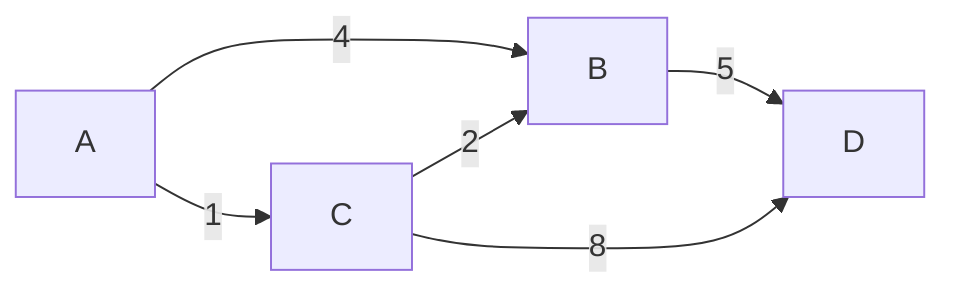
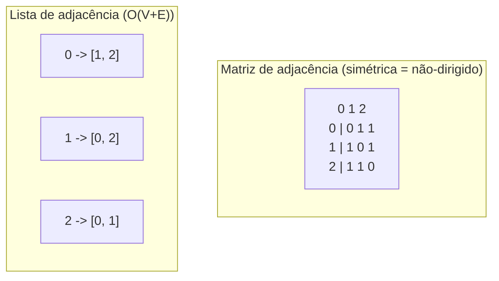
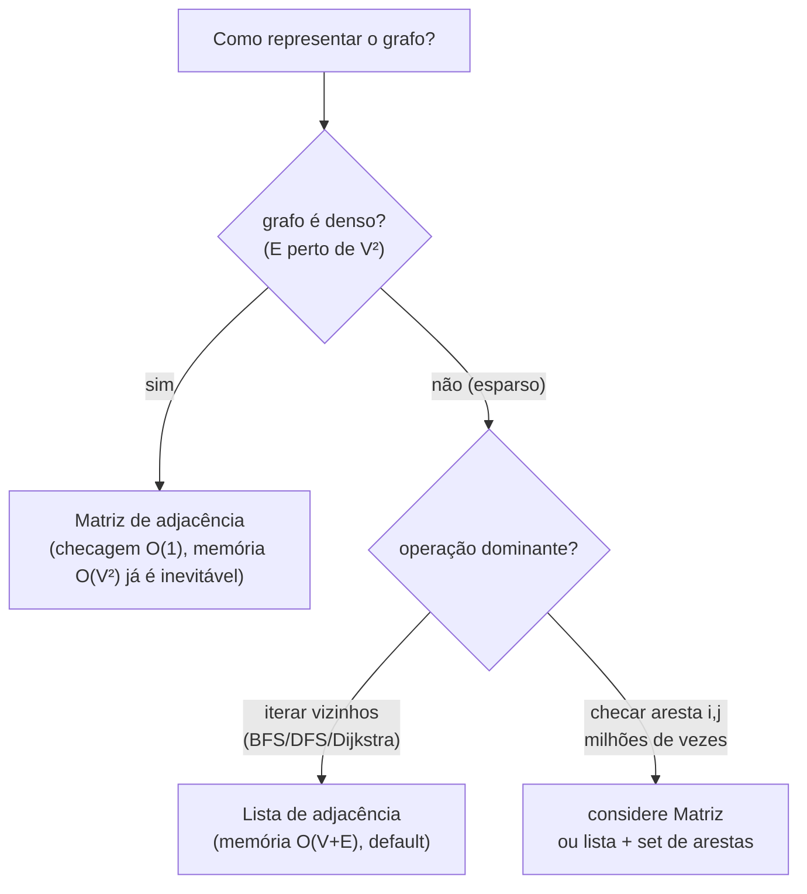

# Grafos: Representação (Matriz vs Lista de Adjacência), Dirigido/Não-Dirigido, Ponderado

> **Bloco:** Estruturas de dados · **Nível:** Intermediário/Avançado · **Tempo de leitura:** ~24 min

## TL;DR

Um **grafo** `G = (V, E)` é um conjunto de **vértices** (nós) `V` conectados por **arestas** (links) `E`. É a estrutura mais geral e expressiva da computação: redes sociais, mapas de rotas, dependências de build, topologias de rede, grafos de conhecimento — tudo é grafo. As duas dimensões que classificam um grafo são: **direção** (dirigido/*directed* — a aresta `A→B` não implica `B→A`, como "segue" no Twitter; ou não-dirigido/*undirected* — a aresta é mútua, como "amizade" no Facebook) e **peso** (ponderado/*weighted* — cada aresta carrega um valor numérico, como distância ou custo; ou não-ponderado). A decisão de engenharia mais importante não é o conceito, mas a **representação em memória**, e há duas canônicas: a **matriz de adjacência** (`V×V`, onde `matriz[i][j]` indica/quantifica a aresta de `i` para `j`) e a **lista de adjacência** (um array de listas, onde cada vértice guarda a lista dos seus vizinhos). A matriz dá **`O(1)` para checar "existe aresta entre i e j?"** e é ideal para grafos **densos** e para algoritmos como Floyd-Warshall, mas custa **`O(V²)` de memória sempre**, mesmo num grafo esparso. A lista usa **`O(V + E)` de memória** (proporcional ao que existe de fato), torna **`O(grau)`** iterar os vizinhos de um vértice — o que casa com BFS/DFS/Dijkstra — mas checar uma aresta específica custa `O(grau)` em vez de `O(1)`. Como a esmagadora maioria dos grafos reais é **esparsa** (`E ≪ V²`), a **lista de adjacência é o default na prática**. Direção e peso são propriedades ortogonais à representação: numa matriz, a simetria codifica não-direção e o valor codifica peso; numa lista, cada entrada de vizinho carrega (opcionalmente) o peso.

## O problema que resolve

Considere o serviço de **rotas de entrega** de um app de logística no Brasil. Você tem 50 mil cruzamentos (vértices) ligados por ruas (arestas), cada rua com uma distância e um tempo médio (pesos), e algumas ruas são de mão única (arestas dirigidas). Você precisa, milhares de vezes por segundo, responder: "qual o caminho mais curto do ponto A ao ponto B?". Antes de rodar qualquer algoritmo de caminho mínimo, você enfrenta uma decisão silenciosa porém decisiva: **como guardar esse grafo na memória?**

A pergunta central é: **"como representar as conexões entre entidades de modo que as operações que meu algoritmo mais executa sejam baratas, sem desperdiçar memória?"** As operações que importam variam por algoritmo:

- BFS/DFS, Dijkstra, topological sort precisam, repetidamente, **"me dê todos os vizinhos do vértice `u`"**.
- Floyd-Warshall (todos-os-pares) e alguns algoritmos de grafo denso precisam, repetidamente, **"existe aresta entre `i` e `j`? qual o peso?"** em tempo constante.
- Adicionar/remover vértices e arestas dinamicamente também tem custos diferentes em cada representação.

Se você escolher a representação errada, paga caro: uma matriz de adjacência para os 50 mil cruzamentos seria uma matriz `50.000 × 50.000` = **2,5 bilhões de células**, a maioria zeros (cada cruzamento conecta a meia dúzia de outros), estourando memória sem necessidade. Já uma lista de adjacência guarda só as ~150 mil arestas reais. Por outro lado, se o seu grafo fosse **denso** (quase todo par conectado, como uma matriz de correlação entre ativos financeiros), a matriz seria mais compacta *e* mais rápida. Escolher a representação é, portanto, casar a estrutura com a **densidade do grafo** e com o **perfil de operações** do algoritmo.

## O que é (definição aprofundada)

### Anatomia: vértices, arestas e suas propriedades

- **Vértice (vertex/node):** uma entidade. Um usuário, uma cidade, uma tarefa, um servidor.
- **Aresta (edge):** uma relação entre dois vértices. Pode ter propriedades.
- **Grau (degree):** número de arestas incidentes num vértice. Em grafos dirigidos, distingue-se **in-degree** (arestas chegando) e **out-degree** (arestas saindo).
- **Caminho (path):** sequência de vértices conectados por arestas. **Ciclo:** caminho que volta ao início.
- **Conexo (connected):** existe caminho entre qualquer par de vértices (em não-dirigidos); **fortemente conexo** (strongly connected) é o análogo respeitando a direção.

### As duas dimensões classificatórias

**Direção (directed vs undirected):**

- **Não-dirigido (undirected):** a aresta `{A, B}` é simétrica — se A está conectado a B, B está conectado a A. Modela relações mútuas: amizade no Facebook, estradas de mão dupla, conexões de rede bidirecionais.
- **Dirigido (directed / digraph):** a aresta `(A → B)` tem sentido — A aponta para B, sem implicar o contrário. Modela relações assimétricas: "segue" no Twitter/Instagram, dependências (`A` depende de `B`), fluxo de dados, ruas de mão única, links de hyperlink na web.

**Peso (weighted vs unweighted):**

- **Não-ponderado:** as arestas só indicam existência de conexão (todas "valem 1"). BFS encontra o menor número de saltos.
- **Ponderado:** cada aresta carrega um valor numérico — distância, custo, latência, capacidade, tempo. Dijkstra/Bellman-Ford encontram o caminho de menor **custo acumulado** (que pode ter mais saltos que o caminho de menos arestas).

As duas dimensões são **independentes e combináveis**: existem grafos dirigidos-ponderados (mapa de ruas com mão única e distâncias), não-dirigidos-ponderados (rede de fibra ótica com latências bidirecionais), dirigidos-não-ponderados (grafo de dependências), e não-dirigidos-não-ponderados (rede de amizades simples).

### Representação 1: Matriz de adjacência

Uma matriz `A` de tamanho `V × V`. A célula `A[i][j]`:

- Em grafo **não-ponderado:** `1` se existe aresta de `i` para `j`, `0` caso contrário.
- Em grafo **ponderado:** o **peso** da aresta de `i` para `j` (e um sentinela — `∞` ou `0` por convenção — quando não há aresta).
- Em grafo **não-dirigido:** a matriz é **simétrica** (`A[i][j] == A[j][i]`), pois a aresta vale nos dois sentidos.
- Em grafo **dirigido:** a matriz **não** é necessariamente simétrica.

A matriz é uma forma direta e visual; consultar/atualizar uma aresta específica é acesso a um índice de array — `O(1)`. O custo é a memória fixa `O(V²)`, independentemente de quantas arestas realmente existem.

### Representação 2: Lista de adjacência

Um array (ou mapa) indexado por vértice, onde `adj[u]` é a **lista dos vizinhos de `u`** (em grafo ponderado, cada item é um par `(vizinho, peso)`).

- Em grafo **não-dirigido:** a aresta `{u, v}` aparece **duas vezes** — `v` na lista de `u` e `u` na lista de `v`.
- Em grafo **dirigido:** a aresta `(u → v)` aparece **uma vez** — só `v` na lista de `u`.

A memória é `O(V + E)`: você só armazena as arestas que existem. Iterar os vizinhos de `u` custa `O(grau(u))`, que é exatamente o que BFS/DFS/Dijkstra fazem o tempo todo. A desvantagem: para checar "existe aresta `u→v`?", você varre a lista de `u`, custando `O(grau(u))` em vez de `O(1)`.

### Representação 3 (menção): Lista de arestas (edge list)

Apenas uma lista de triplas `(u, v, peso)`. Compacta e simples; ideal para algoritmos que **iteram sobre todas as arestas** (Kruskal para MST, Bellman-Ford). Ruim para "vizinhos de `u`" (varre tudo). Usada como formato de entrada e em algoritmos específicos.

## Como funciona

A escolha entre matriz e lista depende de duas variáveis: a **densidade** (`E` perto de `V²` → denso; `E` muito menor que `V²` → esparso) e o **perfil de operações** do algoritmo.

| Critério | Matriz de adjacência | Lista de adjacência |
|---|---|---|
| Memória | `O(V²)` (sempre) | `O(V + E)` |
| Checar aresta `(u, v)` existe/peso | **`O(1)`** | `O(grau(u))` |
| Iterar vizinhos de `u` | `O(V)` (varre a linha toda) | **`O(grau(u))`** |
| Adicionar aresta | `O(1)` | `O(1)` |
| Remover aresta | `O(1)` | `O(grau(u))` |
| Adicionar vértice | `O(V²)` (realoca a matriz) | `O(1)` (amortizado) |
| Iterar todas as arestas | `O(V²)` | `O(V + E)` |
| Melhor para | grafos **densos**; checagem de aresta `O(1)`; Floyd-Warshall | grafos **esparsos**; BFS/DFS/Dijkstra; o caso comum |

Observações cruciais para fixar:

- **Densidade decide.** Para grafos densos (`E ≈ V²`), as duas usam `O(V²)`, então a matriz é preferível (mais simples, checagem `O(1)`). Para grafos esparsos (a maioria dos casos reais — redes sociais, mapas, dependências), a lista economiza memória dramaticamente e torna a travessia eficiente.
- **O perfil do algoritmo decide o resto.** BFS, DFS, Dijkstra, topological sort vivem de "iterar vizinhos" → **lista**. Floyd-Warshall e algoritmos que perguntam "aresta entre i,j?" milhões de vezes → **matriz**.
- **Direção e peso são ortogonais à representação.** Não-direção vira simetria (matriz) ou aresta duplicada (lista). Peso vira o valor da célula (matriz) ou o segundo elemento do par (lista). Você combina livremente.

### Por que a lista de adjacência é o default

Grafos do mundo real são quase sempre **esparsos**: numa rede social com 1 bilhão de usuários, cada um tem talvez algumas centenas de conexões — `E` é da ordem de bilhões, não de `(10⁹)² = 10¹⁸`. Uma matriz seria fisicamente impossível de armazenar. A lista de adjacência guarda apenas as conexões reais e suporta eficientemente as travessias que dominam os algoritmos de grafo. Por isso, salvo grafo comprovadamente denso ou necessidade explícita de checagem de aresta `O(1)`, **a lista de adjacência é a escolha padrão** — é o que bibliotecas como NetworkX, JGraphT e as implementações de competição usam por default.

### Custo de espaço, em números

Para `V = 10.000` vértices e `E = 50.000` arestas (esparso, grau médio 5 numa rede de logística):

- **Matriz:** `10.000² = 100.000.000` células. Mesmo a 1 byte/célula, ~100 MB — quase tudo zeros.
- **Lista:** `~10.000 + 2·50.000 = 110.000` entradas (arestas duplicadas se não-dirigido). Algumas centenas de KB.

A diferença de **três ordens de grandeza** ilustra por que a densidade manda na decisão.

## Diagrama de fluxo

O primeiro diagrama mostra um pequeno grafo **dirigido e ponderado** com 4 vértices (estações) e arestas com tempos de viagem — o tipo de grafo de um problema de caminho mínimo.



O segundo diagrama contrasta as duas representações para um grafo **não-dirigido** simples com vértices 0, 1, 2 (arestas 0-1, 0-2, 1-2). À esquerda, a matriz simétrica; à direita, a lista de adjacência.



O terceiro diagrama resume a árvore de decisão da escolha de representação.



## Exemplo prático / caso real

**Cenário: motor de rotas de um app de mobilidade urbana no Brasil.** O mapa de uma cidade como São Paulo tem centenas de milhares de cruzamentos (vértices) e ruas (arestas). As ruas têm **pesos** (distância, tempo estimado com trânsito) e algumas são de **mão única** (arestas dirigidas). É um grafo **dirigido, ponderado e fortemente esparso** (cada cruzamento conecta a poucos outros).

Decisão de representação: **lista de adjacência**, sem hesitação. A matriz seria `(300.000)² ≈ 9×10¹⁰` células — inviável. A lista guarda só as arestas reais, e o algoritmo de caminho mínimo (Dijkstra com fila de prioridade, ou variantes como A* e Contraction Hierarchies em produção) consome exatamente a operação "vizinhos de `u`" que a lista entrega em `O(grau)`.

```
// Lista de adjacência ponderada dirigida
adj[cruzamento_A] = [ (cruzamento_B, peso=4min), (cruzamento_C, peso=1min) ]
adj[cruzamento_C] = [ (cruzamento_B, peso=2min) ]   // mão única: B não aponta de volta

dijkstra(origem, destino):
    dist[*] = INF; dist[origem] = 0
    fila = priority_queue([(0, origem)])
    enquanto fila não vazia:
        (d, u) = fila.pop_min()
        se u == destino: retorna d
        para (v, peso) em adj[u]:          // O(grau(u)) — barato na lista
            se d + peso < dist[v]:
                dist[v] = d + peso
                fila.push((dist[v], v))
```

**Quando a matriz seria a escolha:** considere um grafo de **correlação entre ativos** num sistema de risco financeiro — milhares de ativos onde **quase todo par** tem uma correlação (peso) definida. É um grafo **denso**. Aqui a matriz `V×V` é tanto a representação natural (você de fato precisa de todos os pares) quanto a mais rápida para "qual a correlação entre o ativo `i` e o `j`?" em `O(1)`. Rodar Floyd-Warshall (todos-os-pares de caminho mínimo) sobre essa matriz também é o uso canônico — o algoritmo é `O(V³)` e foi desenhado para a representação matricial.

**Caso de grafo dirigido não-ponderado:** o **grafo de dependências de um build** (Maven, Bazel, npm) — módulo `A` depende de `B`, que depende de `C`. Lista de adjacência dirigida; um **topological sort** (DFS) determina a ordem de compilação e detecta ciclos (dependência circular = erro de build). Não há pesos; importa só a direção das dependências.

## Quando usar / Quando evitar

**Use matriz de adjacência quando:**

- O grafo é **denso** (`E` próximo de `V²`) — a memória `O(V²)` já é inevitável, e a matriz é mais simples e dá checagem `O(1)`.
- O algoritmo pergunta **"existe/qual o peso da aresta (i,j)?"** intensivamente (Floyd-Warshall, programação dinâmica sobre pares).
- `V` é pequeno e fixo, e você valoriza simplicidade de implementação.

**Evite matriz quando:**

- O grafo é **esparso** e `V` é grande — `O(V²)` desperdiça memória massivamente (o caso comum).
- Você adiciona vértices dinamicamente — realocar a matriz é caro (`O(V²)`).

**Use lista de adjacência quando:**

- O grafo é **esparso** (a maioria dos grafos reais) — memória `O(V + E)`.
- A operação dominante é **iterar vizinhos** — BFS, DFS, Dijkstra, topological sort, detecção de ciclos, componentes conexos.
- O grafo cresce dinamicamente.

**Evite lista quando:**

- Você precisa de checagem de aresta `O(1)` muito frequente *e* não pode manter um `Set` de arestas auxiliar — aí a varredura `O(grau)` pode pesar (mitigação comum: lista + `HashSet<(u,v)>` para o melhor dos dois mundos).

## Anti-padrões e armadilhas comuns

- **Usar matriz para grafo esparso grande.** O erro número um: alocar `O(V²)` para um grafo com `V` grande e poucas arestas estoura memória sem necessidade. Quase sempre, a resposta é lista de adjacência.
- **Esquecer de duplicar a aresta em grafo não-dirigido (lista).** Numa lista de adjacência não-dirigida, a aresta `{u,v}` deve aparecer em `adj[u]` **e** em `adj[v]`. Inserir só num lado transforma silenciosamente o grafo em dirigido e quebra travessias. Pegadinha clássica.
- **Confundir o sentinela "sem aresta" em matriz ponderada.** Em grafo ponderado, "sem aresta" não é `0` (que pode ser um peso válido) — use `∞` para problemas de caminho mínimo, ou um marcador explícito. Usar `0` como ausência corrompe Dijkstra/Floyd-Warshall.
- **Tratar grafo dirigido como não-dirigido (e vice-versa).** Aplicar um algoritmo de não-dirigido (ex.: componentes conexos simples) num grafo dirigido dá resultado errado; para dirigidos use **componentes fortemente conexos** (Tarjan/Kosaraju). Confundir "segue" (dirigido) com "amizade" (não-dirigido) muda toda a modelagem.
- **In-degree vs out-degree em dirigidos.** Esquecer que um vértice tem dois graus (entrada e saída) leva a erros em topological sort (que usa in-degree em Kahn) e em análises de influência.
- **Achar que BFS funciona para caminho mínimo ponderado.** BFS dá o menor **número de arestas**, não o menor **custo** quando há pesos. Para ponderado use Dijkstra (pesos ≥ 0) ou Bellman-Ford (pesos negativos). Erro comum em entrevista.
- **Não considerar a lista + set híbrido.** Quando se precisa tanto de iterar vizinhos quanto de checar aresta `O(1)`, manter uma lista de adjacência *e* um `HashSet` de arestas resolve — mas muitos teimam numa só representação e pagam o custo.
- **Ignorar self-loops e arestas paralelas (multigrafo).** Algumas aplicações têm laços (`u→u`) ou múltiplas arestas entre o mesmo par; nem toda representação/algoritmo lida bem com isso por default — declare explicitamente se o grafo é simples ou multigrafo.

## Relação com outros conceitos

- **Graph algorithms (BFS, DFS, Dijkstra, topological sort, MST, SCC):** a representação é a fundação sobre a qual todo algoritmo de grafo roda; a escolha (matriz vs lista) impacta diretamente a complexidade do algoritmo (Dijkstra é `O((V+E) log V)` com lista + heap, mas `O(V²)` com matriz). Ver o bloco de algoritmos essenciais.
- **Trie / DAWG / FST:** uma trie é um grafo (árvore) especializado em strings, e o FST é um DAG — casos particulares de grafos com representação otimizada (ver [Tries](07-tries.md)).
- **Hash tables:** listas de adjacência frequentemente usam `HashMap` para indexar vértices por identificador arbitrário (não só inteiros 0..V-1), e o "set de arestas" híbrido é um `HashSet` — conectando à estrutura de hash do bloco.
- **Sharding / consistent hashing:** grafos massivos (redes sociais) são particionados entre máquinas (graph partitioning), e o particionamento de vértices por hash conecta com estratégias de sharding (ver [Leader election, sharding e consistent hashing](../04-sistemas-distribuidos/11-leader-election-sharding-consistent-hashing.md)).
- **Bancos de dados de grafo (Neo4j, Amazon Neptune):** materializam grafos como estrutura de primeira classe (geralmente lista de adjacência persistida), expondo travessias como queries — a representação interna é exatamente o que este documento discute.
- **Complexidade algorítmica:** as análises `O(V²)` vs `O(V+E)` são aplicação direta de notação assintótica e do conceito de densidade (ver o bloco de complexidade algorítmica).

## Pontos para fixar (revisão)

- Grafo `= (V, E)`; classifica-se por **direção** (dirigido/não-dirigido) e **peso** (ponderado/não-ponderado) — dimensões **ortogonais** e combináveis.
- **Matriz de adjacência:** `O(V²)` memória sempre; checar aresta `O(1)`; iterar vizinhos `O(V)`. Boa para **grafos densos** e Floyd-Warshall.
- **Lista de adjacência:** `O(V+E)` memória; iterar vizinhos `O(grau)`; checar aresta `O(grau)`. **Default** para grafos esparsos e BFS/DFS/Dijkstra.
- A **densidade** decide a memória; o **perfil de operações** do algoritmo decide o resto. A maioria dos grafos reais é esparsa → lista.
- **Não-direção** = matriz simétrica ou aresta duplicada na lista; **peso** = valor da célula ou par `(vizinho, peso)`.
- BFS = menor nº de arestas; **Dijkstra/Bellman-Ford** = menor custo ponderado. Não confunda.
- Híbrido **lista + HashSet de arestas** dá iteração `O(grau)` e checagem `O(1)` quando ambos importam.

## Referências

- [Representation of Graph — GeeksforGeeks](https://www.geeksforgeeks.org/dsa/graph-and-its-representations/)
- [Comparison between Adjacency List and Adjacency Matrix — GeeksforGeeks](https://www.geeksforgeeks.org/dsa/comparison-between-adjacency-list-and-adjacency-matrix-representation-of-graph/)
- [Adjacency List Representation — GeeksforGeeks](https://www.geeksforgeeks.org/dsa/adjacency-list-meaning-definition-in-dsa/)
- [Adjacency Matrix Representation — GeeksforGeeks](https://www.geeksforgeeks.org/dsa/adjacency-matrix/)
- [Graph Data Structures (Adjacency Matrix, List, Edge List) — VisuAlgo](https://visualgo.net/en/graphds)
- [Single-Source Shortest Paths (Dijkstra, Bellman-Ford, BFS) — VisuAlgo](https://visualgo.net/en/sssp)
- [Graph Representation: Adjacency Matrix and Adjacency List — OpenGenus](https://iq.opengenus.org/graph-representation-adjacency-matrix-adjacency-list/)
- [Directed and Edge-Weighted Graphs — Emory CS171](https://mathcenter.oxford.emory.edu/site/cs171/directedAndEdgeWeightedGraphs/)
