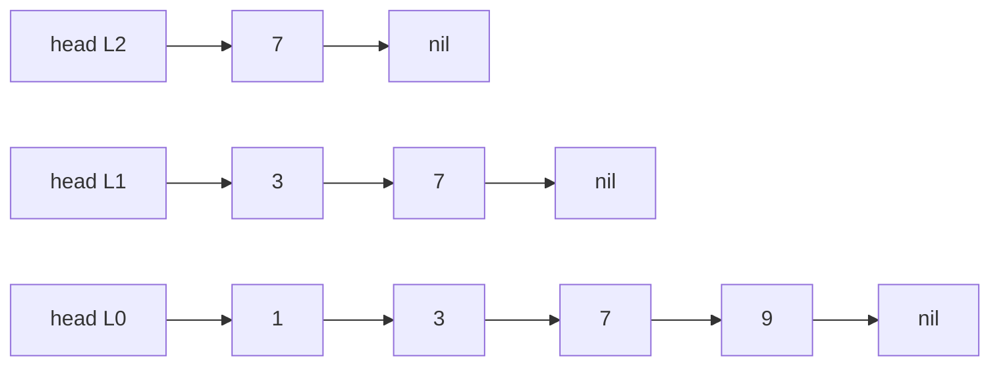
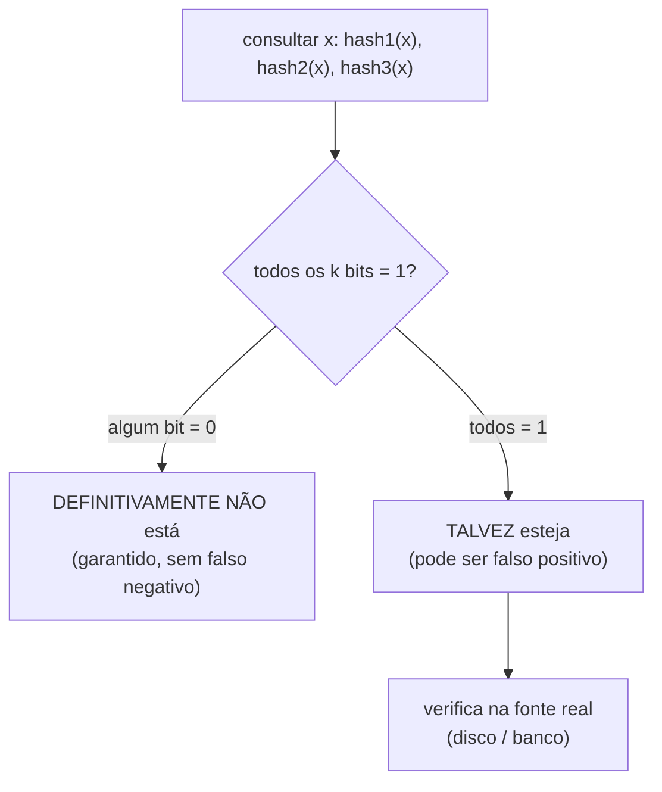
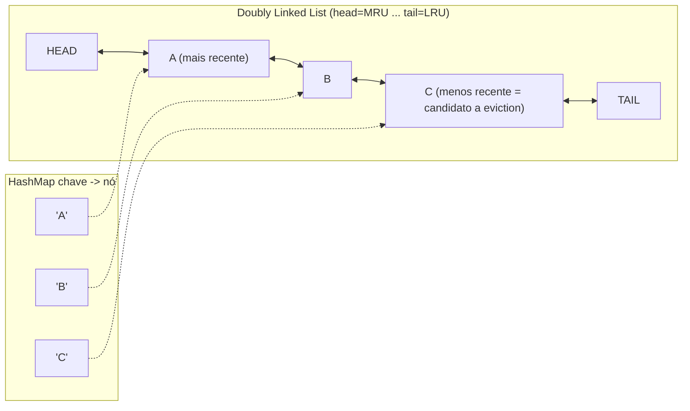

# Skip Lists, Bloom Filters e Caches LRU/LFU

> **Bloco:** Estruturas de dados · **Nível:** Intermediário/Avançado · **Tempo de leitura:** ~30 min

## TL;DR

Três estruturas que aparecem constantemente em sistemas de produção e em entrevistas de arquitetura, unidas por um tema: **trocar uma garantia teórica por simplicidade ou economia, com resultado excelente na prática**. A **Skip List** (William Pugh, 1990) é uma alternativa **probabilística** às árvores balanceadas: uma lista ordenada com vários "níveis" de atalhos (express lanes), onde a altura de cada nó é decidida por um sorteio de moeda; entrega busca/inserção/remoção em **`O(log n)` esperado**, sem rotações nem rebalanceamento — por isso é mais simples de implementar (e de tornar lock-free) que uma red-black tree, motivo de o **Redis** usá-la como estrutura interna dos *sorted sets* (`ZSET`). O **Bloom Filter** (Burton Bloom, 1970) é uma estrutura **probabilística de pertinência**: um array de bits + `k` funções hash que responde "este elemento **pode estar** no conjunto" ou "**definitivamente não está**" usando uma fração mínima da memória do conjunto real. Sua marca registrada é o **falso positivo** (pode dizer "talvez" para algo ausente) mas **nunca falso negativo** (se diz "não", é não) — usado pelo **Cassandra** e por LSM-trees para evitar leituras de disco desnecessárias, e por CDNs/proxies para "cachear na segunda vez". O **cache LRU/LFU** resolve "o que descartar quando o cache enche": **LRU** (Least Recently Used) despeja o item **acessado há mais tempo**, implementado canonicamente com **HashMap + doubly linked list** para dar `get`/`put` em **`O(1)`** — o HashMap dá lookup `O(1)`, a lista duplamente ligada permite mover/remover nós em `O(1)`; **LFU** (Least Frequently Used) despeja o item **menos frequentemente acessado**, melhor para padrões com popularidade estável. O **Redis** oferece ambas as políticas de eviction (`allkeys-lru`, `allkeys-lfu`). Nenhuma das três é "sempre melhor" — cada uma é uma escolha consciente de trade-off.

## O problema que resolve

As três estruturas atacam problemas distintos, mas todas surgem da mesma pressão de engenharia: **fazer mais com menos, abrindo mão de uma garantia que, na prática, não precisamos absoluta.**

**Skip List — "preciso de busca ordenada `O(log n)` sem a dor de implementar e travar uma árvore balanceada."** Árvores balanceadas (AVL, red-black) dão `O(log n)` garantido, mas o preço é a complexidade das **rotações de rebalanceamento** — código intrincado, difícil de acertar e *muito* difícil de tornar concorrente/lock-free (uma rotação toca vários nós ao mesmo tempo). A pergunta de Pugh foi: **"e se eu aceitar `O(log n) esperado` em vez de garantido, em troca de uma estrutura drasticamente mais simples e fácil de paralelizar?"**

**Bloom Filter — "preciso checar pertinência num conjunto gigantesco sem gastar a memória de guardá-lo inteiro, e tolero alguns palpites errados para o lado seguro."** Imagine um banco LSM-tree (Cassandra, RocksDB) com a chave procurada possivelmente espalhada em dezenas de arquivos SSTable em disco. Checar cada arquivo é caro (I/O de disco). A pergunta de Bloom (1970) foi: **"como descartar rapidamente, e quase de graça em memória, a maioria dos arquivos que *com certeza não* contêm a chave, evitando o I/O inútil?"** A resposta tolera dizer "talvez tenha" para alguns arquivos que não têm (falso positivo → uma leitura de disco desperdiçada, mas correta), desde que nunca diga "não tem" para um que tem (falso negativo → perderia o dado, inaceitável).

**Cache LRU/LFU — "minha memória de cache é finita; quando enche, qual item sacrifico para abrir espaço, e como faço isso sem deixar o cache lento?"** A pergunta é dupla: **qual a política de despejo (eviction)** que maximiza o *hit rate*, e **qual a estrutura de dados** que aplica essa política em tempo constante (um cache que demora `O(n)` para decidir o que despejar anula o propósito de ser rápido).

## O que é (definição aprofundada)

### Skip List

Uma **skip list** é uma lista encadeada **ordenada** enriquecida com múltiplos níveis de ponteiros que funcionam como **atalhos** (express lanes). O nível 0 (base) contém todos os elementos em ordem. Cada nível acima contém um **subconjunto** dos nós do nível abaixo, escolhidos por sorteio: ao inserir um nó, joga-se uma moeda repetidamente — com probabilidade `p` (tipicamente `1/2`) ele "promove" para o próximo nível, parando quando der "coroa". Assim, em média, metade dos nós aparece no nível 1, um quarto no nível 2, etc., criando uma hierarquia logarítmica de atalhos.

A **busca** começa no canto superior esquerdo (nível mais alto) e avança horizontalmente enquanto o próximo nó não ultrapassa o alvo; quando ultrapassaria, **desce** um nível e continua. Os níveis altos saltam grandes trechos da lista (como pegar o expresso do metrô e ir descendo para os trens locais conforme se aproxima do destino), reduzindo a busca a `O(log n)` esperado.

O ponto conceitual: o equilíbrio **não é mantido por regras determinísticas e rotações**, mas por **aleatoriedade**. Nenhuma sequência de inserções produz consistentemente o pior caso (análogo ao quicksort com pivô aleatório) — o pior caso `O(n)` é astronomicamente improvável. Em troca dessa garantia apenas probabilística, ganha-se: implementação simples (sem rotações), e facilidade de tornar **lock-free** (inserir um nó toca poucos ponteiros locais, não exige rebalanceamento global). É por isso que o **Redis** implementa os *sorted sets* sobre skip lists e o **LevelDB/RocksDB** as usa em memtables.

### Bloom Filter

Um **Bloom filter** é uma estrutura **probabilística** para teste de pertinência em conjunto, composta de:

- Um **array de `m` bits**, inicialmente todos `0`.
- **`k` funções hash** independentes, cada uma mapeando um elemento para uma posição em `[0, m)`.

**Inserção** de um elemento `x`: calcula `k` hashes de `x` e **liga (`=1`) os `k` bits** correspondentes.

**Consulta** "`x` está no conjunto?": calcula os mesmos `k` hashes; se **todos** os `k` bits estiverem ligados, responde **"talvez sim"** (possibly in set); se **algum** estiver em `0`, responde **"definitivamente não"** (definitely not in set).

A assimetria é a essência:

- **Falso negativo é impossível.** Se `x` foi inserido, seus `k` bits foram ligados e nunca são desligados (Bloom filter clássico não suporta remoção) — então a consulta sempre encontra todos ligados. "Não está" é uma **certeza**.
- **Falso positivo é possível.** Bits ligados por *outros* elementos podem, por coincidência, cobrir todas as `k` posições de um `x` que nunca foi inserido. "Talvez sim" é um **palpite** que pode errar.

A **taxa de falso positivo** `p` depende de `m` (tamanho do array), `n` (elementos inseridos) e `k` (número de hashes): `p ≈ (1 − e^(−kn/m))^k`. Dado `m` e `n`, o `k` ótimo é `k = (m/n)·ln 2`, e o `m` ótimo para uma taxa-alvo `p` é `m = −(n·ln p)/(ln 2)²`. Um resultado famoso: com `k` ótimo, basta **~9,6 bits por elemento para 1% de falso positivo** — *independente do tamanho de cada elemento*. É essa compactação radical (guardar bits em vez de chaves inteiras) que torna o Bloom filter valioso. Variantes: **Counting Bloom filter** (contadores em vez de bits, permite remoção), **Cuckoo filter** e **Quotient filter** (suportam remoção e melhor localidade), **Scalable Bloom filter** (cresce conforme necessário).

### Cache LRU (Least Recently Used)

Política de eviction que, quando o cache atinge a capacidade, **despeja o item que foi acessado há mais tempo** — a aposta é que o que não é usado há tempos provavelmente não será usado em breve (localidade temporal). A estrutura interna canônica que dá **`O(1)` em `get` e `put`** combina duas estruturas:

- **HashMap `chave → nó`:** dá lookup `O(1)` para encontrar o nó de uma chave.
- **Doubly linked list (lista duplamente ligada):** mantém os nós em ordem de uso recente — o **head** é o mais recentemente usado (MRU), a **tail** é o menos recentemente usado (LRU). A ligação dupla (ponteiros `prev` e `next`) é essencial: permite **remover um nó do meio da lista em `O(1)`** (basta religar os vizinhos), o que uma lista simplesmente ligada não faz (precisaria varrer para achar o anterior).

Operações:

- **`get(k)`:** consulta o HashMap (`O(1)`); se achou, **move o nó para o head** (acabou de ser usado) — remoção + reinserção em `O(1)` graças aos ponteiros duplos; retorna o valor.
- **`put(k, v)`:** se a chave existe, atualiza e move para o head; se não existe, cria o nó no head e o registra no HashMap; **se estourou a capacidade, remove o nó da tail** (o LRU) e o apaga do HashMap — tudo `O(1)`.

A sinergia é exata: o HashMap resolve "onde está o nó?" e a lista duplamente ligada resolve "ordem de recência + remoção/movimentação `O(1)`". Nenhuma das duas sozinha entrega ambos.

### Cache LFU (Least Frequently Used)

Política que despeja o item **menos frequentemente acessado** (menor contador de acessos), com critério de desempate (geralmente LRU entre os de mesma frequência). A aposta é diferente da LRU: prioriza itens com **popularidade sustentada** ao longo do tempo, não apenas recência. A estrutura interna para `O(1)` é mais elaborada: tipicamente um HashMap `chave → nó` mais um HashMap `frequência → doubly linked list de nós com aquela frequência`, mantendo a menor frequência rastreada — ao acessar um item, ele migra para a lista da frequência seguinte; ao despejar, remove-se da lista da menor frequência.

**LRU vs LFU — a distinção que cai em entrevista:**

- **LRU** reage rápido a mudanças de padrão (um item recém-acessado sobe na hora), mas pode despejar um item muito popular só porque houve uma rajada de acessos a itens novos (cache pollution / scan).
- **LFU** protege os "campeões de audiência" de longo prazo, mas é **lento para esquecer** itens que foram populares no passado e não são mais (o contador alto persiste) — daí variantes com *aging/decay* (Redis usa um LFU com decaimento probabilístico). LFU também é mais caro de implementar em `O(1)`.

## Como funciona

| Estrutura | Operação principal | Complexidade | Garantia | Memória |
|---|---|---|---|---|
| **Skip List** | busca/inserção/remoção (ordenada) | `O(log n)` **esperado** | probabilística (pior caso `O(n)` improvável) | `O(n)` (esperado `O(n)` ponteiros extras) |
| **Bloom Filter** | inserir / consultar pertinência | `O(k)` (k = nº de hashes) | sem falso negativo; falso positivo `p` ajustável | `O(m)` bits (~9,6 bits/elem p/ 1% FP) |
| **Cache LRU** | `get` / `put` | `O(1)` | exata (HashMap + DLL) | `O(capacidade)` |
| **Cache LFU** | `get` / `put` | `O(1)` (impl. cuidadosa) | exata | `O(capacidade)` |

Observações de funcionamento:

- **Skip list:** a probabilidade `p = 1/2` dá número esperado de níveis `≈ log₂ n` e custo de busca `≈ log n / log(1/p)`. Aumentar `p` reduz a altura média (menos memória) ao custo de buscas um pouco mais longas. A simplicidade (sem rebalanceamento) e a localidade de atualização (poucos ponteiros tocados) são o que a tornam atraente para concorrência.
- **Bloom filter:** o trade-off é triplo entre `m` (espaço), `k` (tempo/CPU por operação) e `p` (taxa de erro). Mais bits → menos falsos positivos. O array **não** armazena os elementos — só "sombras" deles em bits — daí a economia. Não dá para listar o conteúdo nem (no clássico) remover.
- **Cache LRU/LFU:** a chave é que **ambas as operações** (achar o item e atualizar a ordem/contagem) sejam `O(1)`; senão, o overhead de manter a política aniquila o ganho de ser cache. A doubly linked list é o ingrediente que torna a movimentação/remoção de nós arbitrários constante.

## Diagrama de fluxo

O primeiro diagrama mostra os **níveis de uma skip list** com elementos 1, 3, 7, 9: o nível 0 tem todos; níveis acima têm atalhos. A busca por 9 desce os níveis.



O segundo diagrama mostra a **decisão de um Bloom filter** numa consulta: checa os `k` bits e responde "definitivamente não" ou "talvez sim".



O terceiro diagrama mostra a **estrutura interna do LRU**: HashMap apontando para nós de uma doubly linked list ordenada por recência.



## Exemplo prático / caso real

**Skip List no Redis (sorted sets).** O tipo `ZSET` do Redis (rankings, leaderboards, filas com prioridade por score) precisa manter elementos **ordenados por score** e suportar consultas de range (`ZRANGEBYSCORE`) e busca por posição rápida. O Redis implementa o `ZSET` com uma **skip list** (combinada com um hash para mapear membro→score). Por que skip list e não red-black tree? Porque a skip list dá o mesmo `O(log n)`, é muito mais simples de implementar corretamente, e suas operações de range (percorrer o nível base a partir de um ponto) são naturais. Num leaderboard de um jogo brasileiro com milhões de jogadores, inserir um novo score, atualizar a posição de um jogador e listar o top-100 são todas `O(log n)` esperado — sem o pesadelo de rotações.

**Bloom Filter no Cassandra (read path).** No Cassandra, os dados de uma partição podem estar espalhados em vários **SSTables** em disco (resultado dos flushes do LSM-tree). Para uma leitura, em vez de tocar todos os SSTables (I/O caro), o Cassandra mantém **um Bloom filter por SSTable, em memória off-heap**. Ao buscar uma chave de partição, ele consulta o Bloom filter de cada SSTable: os que respondem "definitivamente não" são **descartados sem tocar o disco**; só os que respondem "talvez" são lidos. Como o falso negativo é impossível, nenhum dado é perdido; o falso positivo apenas causa, ocasionalmente, uma leitura de disco que não encontra a chave (o `bloom_filter_fp_chance`, tipicamente 0,01 a 0,1, controla esse trade-off entre memória do filtro e leituras desperdiçadas). Esse padrão "Bloom filter para evitar I/O de disco" é onipresente em LSM-trees (RocksDB, HBase, LevelDB) e em CDNs/caches ("só vale a pena cachear na segunda requisição" — o filtro detecta o primeiro acesso).

**LRU no Redis e em caches de aplicação.** Quando o Redis atinge `maxmemory`, a política `allkeys-lru` despeja a chave menos recentemente usada para abrir espaço. (Detalhe de implementação real: o Redis usa um LRU **aproximado** por amostragem — sorteia `maxmemory-samples` chaves e despeja a pior delas — porque manter a doubly linked list exata para milhões de chaves custaria memória demais; é uma troca consciente de precisão por eficiência.) Em caches *in-process* de aplicação (ex.: Caffeine em Java, `functools.lru_cache` em Python), a implementação clássica **HashMap + doubly linked list** dá `get`/`put` em `O(1)` exato.

Pseudocódigo conciso do LRU `O(1)`:

```
// nó: { chave, valor, prev, next };  map: chave -> nó;  lista DLL com head e tail
get(k):
    se k não em map: retorna MISS
    nó = map[k]
    mover_para_head(nó)        // O(1): religa prev/next dos vizinhos
    retorna nó.valor

put(k, v):
    se k em map:
        map[k].valor = v; mover_para_head(map[k]); retorna
    se tamanho == capacidade:
        lru = tail.prev           // nó menos recente
        remover(lru); map.delete(lru.chave)   // O(1)
    nó = novo_nó(k, v); inserir_no_head(nó); map[k] = nó
```

**LFU quando faz sentido.** Num CDN servindo imagens de um catálogo onde alguns produtos são perenes campeões de venda (alta popularidade estável) e há rajadas de tráfego em produtos novos que somem rápido, **LFU** protege os campeões: uma rajada de acessos a um produto efêmero não despejaria a imagem de um best-seller (que tem contador de frequência alto), como o LRU poderia fazer. O preço é o LFU "demorar a esquecer" produtos que saíram de linha — por isso o Redis `allkeys-lfu` aplica decaimento de frequência ao longo do tempo.

## Quando usar / Quando evitar

**Skip List — use quando:** precisa de uma estrutura **ordenada** com `O(log n)`, valoriza **simplicidade de implementação** e **concorrência lock-free**, ou faz muitas consultas de **range/rank** (leaderboards, sorted sets, memtables). **Evite quando:** precisa de garantia de pior caso `O(log n)` **determinística** (use árvore balanceada) ou quando uma hash table resolve (não precisa de ordem → hash é `O(1)`).

**Bloom Filter — use quando:** precisa de teste de pertinência **rápido e com pouquíssima memória** sobre um conjunto grande, e **tolera falsos positivos** verificáveis (evitar I/O de disco em LSM-trees, deduplicação aproximada, "já vi esta URL?", cache de segunda visita). **Evite quando:** não pode tolerar falso positivo sem ter como verificar depois, precisa **remover** elementos (use Counting/Cuckoo filter) ou precisa **listar/recuperar** o conteúdo (o Bloom filter não armazena os elementos).

**Cache LRU — use quando:** o padrão de acesso tem **localidade temporal** (o recém-usado tende a ser reusado) e você quer uma política simples, barata e responsiva a mudanças. É o **default** da maioria dos caches. **Evite/reconsidere quando:** o padrão é de **varredura** (scan) que polui o cache, despejando itens quentes — aí LRU performa mal.

**Cache LFU — use quando:** a popularidade dos itens é **estável e desigual** (poucos itens concentram a maioria dos acessos por longos períodos) e você quer proteger os campeões de rajadas efêmeras. **Evite quando:** o padrão de acesso **muda com o tempo** (LFU demora a esquecer o passado — prefira LFU com aging ou LRU) ou quando a complexidade de implementação não se justifica.

## Anti-padrões e armadilhas comuns

- **Achar que o Bloom filter pode dar falso negativo.** A pegadinha de entrevista mais comum. Ele **nunca** dá falso negativo (se diz "não está", está garantido); só dá **falso positivo**. Inverter isso revela não ter entendido a estrutura.
- **Ignorar os falsos positivos do Bloom filter no design.** Usar Bloom filter onde um falso positivo causa dano irreversível (e não há verificação posterior na fonte real) é um erro grave. O filtro só é seguro quando o "talvez" é confirmado contra a fonte autoritativa.
- **Tentar remover de um Bloom filter clássico.** Desligar bits para "remover" um elemento corrompe o filtro (esses bits podem pertencer a outros elementos → cria falsos negativos). Para remoção, use **Counting Bloom filter** ou **Cuckoo filter**.
- **Dimensionar mal o Bloom filter.** Subdimensionar `m`/`k` para o `n` esperado dispara a taxa de falso positivo (filtro saturado vira "sempre talvez", inútil). Calcule `m` e `k` a partir de `n` e da taxa-alvo `p`.
- **Achar que a skip list dá `O(log n)` garantido.** É `O(log n)` **esperado** (probabilístico); o pior caso teórico é `O(n)`, embora improbabilíssimo. Em contextos que exigem garantia de pior caso (sistemas de tempo real críticos), prefira árvore balanceada.
- **Usar lista simplesmente ligada no LRU.** Com lista *singly* linked, remover um nó arbitrário (ou o anterior à tail) vira `O(n)` porque não há ponteiro `prev`. A doubly linked list é **obrigatória** para o `O(1)`. Erro clássico no problema "LRU Cache" do LeetCode.
- **Esquecer de atualizar o HashMap ao despejar no LRU.** Remover o nó da lista mas deixar a chave no HashMap (ou vice-versa) cria entradas órfãs e bugs de consistência. Os dois devem ser atualizados atomicamente.
- **Achar que LRU é sempre melhor que LFU (ou o contrário).** Não há vencedor universal: LRU brilha com mudanças de padrão e sofre com scans; LFU protege campeões estáveis e sofre com mudança de popularidade. A escolha depende do **padrão de acesso real** — afirmar superioridade absoluta de uma sinaliza imaturidade.
- **LFU sem aging.** LFU puro nunca "esquece" um item que foi muito acessado no passado e não é mais — ele entope o cache. Produção quase sempre usa LFU com decaimento (como o Redis).
- **Não amostrar/aproximar em escala.** Manter LRU/LFU exato para milhões de chaves pode custar memória/CPU proibitivos; sistemas reais (Redis) usam **aproximação por amostragem**. Insistir na precisão exata onde a aproximação basta é over-engineering.

## Relação com outros conceitos

- **Cache patterns:** LRU/LFU são as políticas de **eviction** que complementam as estratégias de cache (cache-aside, write-through, TTL); a política decide *o que* sai quando o cache enche (ver [Cache patterns](../05-dados-e-persistencia/08-cache-patterns.md)).
- **Hash tables:** o LRU/LFU usa HashMap como núcleo de lookup `O(1)`, e o Bloom filter é uma família de "hashing com erros permitidos" (o título do paper de Bloom é literalmente *Space/time trade-offs in hash coding with allowable errors*) — conectando diretamente à estrutura de hash.
- **Árvores balanceadas (BST/AVL/Red-Black):** a skip list é a **alternativa probabilística** a elas; mesmo `O(log n)`, troca rotações por aleatoriedade. Comparar as duas é decisão de design recorrente (ver o bloco de estruturas de dados).
- **Consistent hashing / sharding:** Bloom filters são usados em sistemas distribuídos para reduzir comunicação entre nós (saber se um nó *pode* ter um dado antes de consultá-lo), e caches distribuídos combinam eviction local com sharding (ver [Leader election, sharding e consistent hashing](../04-sistemas-distribuidos/11-leader-election-sharding-consistent-hashing.md)).
- **LSM-trees e bancos NoSQL:** Bloom filters são parte integral do read path de LSM-trees (Cassandra, RocksDB, HBase), e skip lists são usadas em memtables — conectando às estruturas de armazenamento do bloco de dados e persistência.
- **Complexidade algorítmica:** as três estruturas são estudos de caso de **análise esperada vs pior caso** (skip list), **trade-off espaço-tempo** (Bloom filter) e **complexidade amortizada/constante** (LRU) — aplicação direta do bloco de complexidade.

## Pontos para fixar (revisão)

- **Skip list:** lista ordenada com níveis de atalho decididos por sorteio; `O(log n)` **esperado**, sem rotações → simples e lock-free-friendly. Base dos **sorted sets do Redis**.
- **Bloom filter:** array de bits + `k` hashes; **sem falso negativo, com falso positivo** ajustável; ~9,6 bits/elemento para 1% de FP. Evita **I/O de disco** em LSM-trees (**Cassandra**, RocksDB).
- Bloom filter clássico **não remove** (use Counting/Cuckoo) e **não lista** conteúdo; o "talvez" precisa ser verificado na fonte real.
- **LRU = HashMap + doubly linked list** → `get`/`put` em **`O(1)`**; HashMap acha o nó, a lista dupla move/remove em `O(1)`. Lista *simples* quebra o `O(1)`.
- **LRU** despeja o **menos recentemente** usado (bom com localidade temporal, sofre com scans); **LFU** despeja o **menos frequentemente** usado (protege campeões estáveis, precisa de aging para esquecer o passado).
- Nenhuma das três é "sempre melhor"; cada uma é um **trade-off consciente** (garantia probabilística, espaço-tempo, política de eviction). O **Redis** oferece `allkeys-lru` e `allkeys-lfu` e usa aproximação por amostragem em escala.

## Referências

- [Skip Lists: A Probabilistic Alternative to Balanced Trees — William Pugh (CMU PDF do paper original, CACM 1990)](https://15721.courses.cs.cmu.edu/spring2018/papers/08-oltpindexes1/pugh-skiplists-cacm1990.pdf)
- [Skip list — Wikipedia](https://en.wikipedia.org/wiki/Skip_list)
- [Space/Time Trade-offs in Hash Coding with Allowable Errors — Burton H. Bloom (PDF do paper original, CACM 1970)](https://dl.acm.org/doi/10.1145/362686.362692)
- [Bloom filter — Wikipedia (matemática de falso positivo e k ótimo)](https://en.wikipedia.org/wiki/Bloom_filter)
- [Bloom Filters — Apache Cassandra Documentation (uso no read path / SSTables)](https://cassandra.apache.org/doc/latest/cassandra/managing/operating/bloom_filters.html)
- [Back-to-Basics Weekend Reading: Bloom Filters — Werner Vogels / All Things Distributed](https://www.allthingsdistributed.com/2017/02/bloom-filters.html)
- [LRU Cache Implementation using Doubly Linked List — GeeksforGeeks](https://www.geeksforgeeks.org/dsa/lru-cache-implementation-using-double-linked-lists/)
- [LRU Cache — LeetCode (problema clássico HashMap + DLL)](https://leetcode.com/problems/lru-cache/)
- [Key eviction (maxmemory-policy: allkeys-lru / allkeys-lfu) — Redis Docs](https://redis.io/docs/latest/develop/reference/eviction/)
