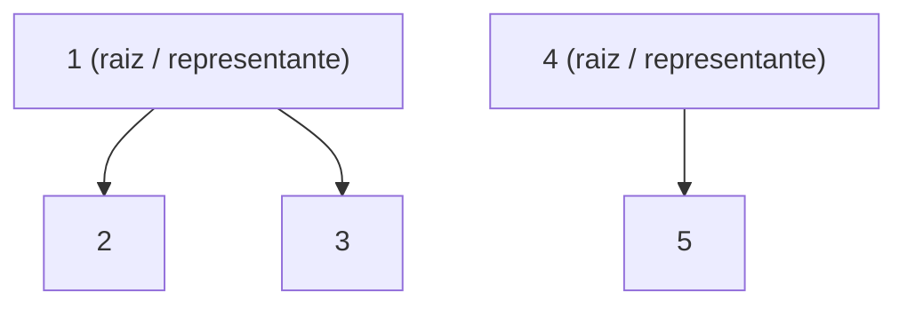
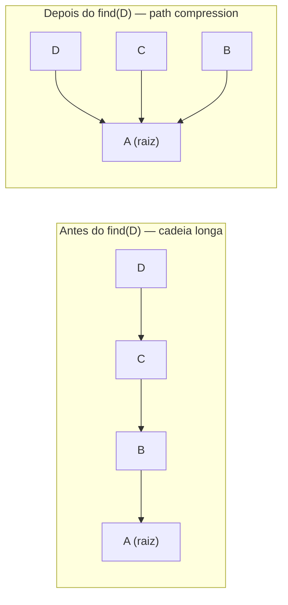
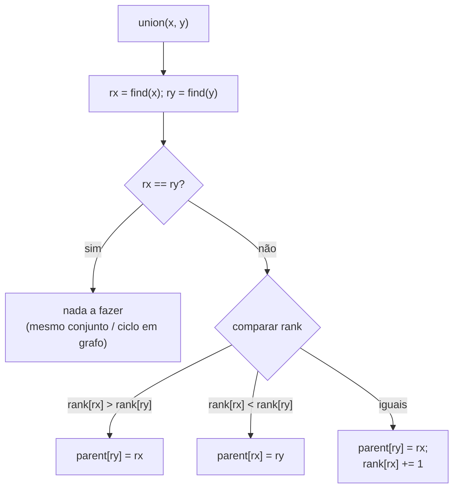

# Union-Find (Disjoint Set) com Union by Rank e Path Compression

> **Bloco:** Estruturas de dados · **Nível:** Intermediário/Avançado · **Tempo de leitura:** ~22 min

## TL;DR

O **Union-Find** (também chamado **Disjoint Set Union**, **DSU**) é uma estrutura de dados que mantém uma coleção de **conjuntos disjuntos** (sem elementos em comum) e suporta, de forma extremamente eficiente, duas operações: **`union(a, b)`** (mesclar os conjuntos que contêm `a` e `b`) e **`find(a)`** (descobrir qual o **representante** — o "líder" — do conjunto de `a`, permitindo testar se dois elementos estão no mesmo conjunto). A representação interna é uma **floresta de árvores**: cada conjunto é uma árvore cujos nós apontam para o pai, e a raiz é o representante. Sem otimizações, as árvores degeneram em listas e as operações ficam `O(n)`. Duas otimizações clássicas resolvem isso: **union by rank** (ou by size) — ao unir, anexa-se sempre a árvore **mais baixa sob a mais alta**, mantendo as árvores rasas; e **path compression** — durante o `find`, **reaponta-se cada nó visitado diretamente para a raiz**, achatando o caminho para futuras consultas. Combinadas, essas duas otimizações tornam cada operação **`O(α(n))` amortizado**, onde `α` é a **inversa da função de Ackermann** — uma função que cresce tão absurdamente devagar que `α(n) ≤ 4` para qualquer `n` concebível no universo. Na prática, **constante**. O DSU é o coração de algoritmos como **Kruskal** (árvore geradora mínima), detecção de **ciclos** em grafos não-dirigidos, **componentes conexos** dinâmicos, e aparece em problemas de "agrupamento incremental": amigos em redes sociais, pixels conectados em processamento de imagem, células num jogo, contas duplicadas para deduplicação.

## O problema que resolve

Imagine uma rede social onde você precisa responder, milhões de vezes, à pergunta: **"o usuário A e o usuário B pertencem ao mesmo grupo conectado de amigos?"** — e, ao mesmo tempo, novas amizades vão sendo criadas dinamicamente, **mesclando grupos**. Quando A (do grupo X) vira amigo de B (do grupo Y), os grupos X e Y fundem-se num só. Você precisa de duas operações rápidas: **mesclar dois grupos** e **testar se dois elementos estão no mesmo grupo**.

A pergunta central é: **"como manter uma partição de elementos em grupos disjuntos, suportando fusões incrementais e consultas de pertencimento ao mesmo grupo, de forma quase instantânea?"**

As abordagens ingênuas mostram por que precisamos de uma estrutura dedicada:

- **Rotular cada elemento com um ID de grupo (array `grupo[i]`):** o `find` (ler o ID) é `O(1)`, ótimo. Mas o `union` é desastroso: para mesclar o grupo X no grupo Y, você precisa **varrer todos os elementos** e reescrever os que tinham ID X para Y — `O(n)` por união. Com muitas uniões, isso é proibitivo.
- **Lista de membros por grupo:** o `union` pode anexar uma lista à outra, mas testar "mesmo grupo?" exige buscar em qual lista cada elemento está — caro sem índice auxiliar.
- **Componentes conexos via BFS/DFS a cada consulta:** recalcular os componentes do grafo do zero a cada pergunta é `O(V + E)` por consulta — inviável para consultas frequentes num grafo que muda.

O Union-Find ataca exatamente esse perfil: **muitas uniões e muitas consultas intercaladas, em qualquer ordem, sobre uma partição que só cresce em fusões** (os conjuntos nunca se dividem). Ele troca a representação por **ponteiros para o pai** numa floresta, de modo que tanto `union` quanto `find` mexam em pouquíssimos nós — e, com as otimizações, tendam ao tempo constante amortizado. É a estrutura certa para "agrupamento incremental" e para qualquer algoritmo que precise saber, dinamicamente, se duas coisas já estão conectadas.

## O que é (definição aprofundada)

O Union-Find mantém uma **partição** de `n` elementos em conjuntos **disjuntos** (cada elemento pertence a exatamente um conjunto). A representação é uma **floresta**: cada conjunto é uma árvore, cada nó tem um ponteiro `parent`, e a **raiz** (o nó que aponta para si mesmo) é o **representante** canônico do conjunto. Dois elementos estão no mesmo conjunto se, e somente se, seus `find` retornam a mesma raiz.

As três operações:

- **`makeSet(x)`:** cria um conjunto unitário — `parent[x] = x` (cada elemento começa sendo sua própria raiz).
- **`find(x)`:** sobe pela cadeia de pais a partir de `x` até chegar à raiz (o nó que aponta para si mesmo) e a retorna. É o "qual o representante do conjunto de `x`?".
- **`union(x, y)`:** acha as raízes de `x` e `y` (via `find`); se forem diferentes (conjuntos distintos), faz uma raiz apontar para a outra, fundindo as duas árvores. Se forem iguais, já estão no mesmo conjunto (nada a fazer — e, num grafo, isso indica um **ciclo**).

### Por que precisa de otimizações

Na versão ingênua (quick-union sem cuidado), a ordem das uniões pode produzir uma árvore **degenerada** em forma de lista encadeada: `1→2→3→...→n`. Aí o `find` do elemento mais profundo percorre `O(n)` nós, e tudo fica lento. As duas otimizações abaixo garantem que as árvores permaneçam **rasas**.

### Otimização 1: Union by Rank (ou by Size)

Ao unir dois conjuntos, **qual raiz vira filha de qual?** A escolha ingênua (sempre a primeira vira filha da segunda) pode crescer a altura. **Union by rank** anexa sempre a árvore de **menor rank sob a de maior rank**, mantendo a árvore mais rasa possível.

- **Rank** é uma estimativa (limite superior) da **altura** da árvore. Inicialmente 0. Ao unir duas raízes de ranks diferentes, a de menor rank passa a apontar para a de maior rank (o rank do vencedor **não muda**). Se os ranks são iguais, escolhe-se uma como nova raiz e **incrementa-se seu rank** em 1.
- **Union by size** é a variante equivalente: anexa-se a árvore com **menos nós** sob a de mais nós (rastreando o tamanho de cada árvore). Mesma garantia assintótica; mais intuitiva.

A garantia: **anexar o menor ao maior impede que a altura cresça desnecessariamente**. Sozinha, a union by rank já limita a altura a `O(log n)`.

### Otimização 2: Path Compression

A grande sacada do `find`. Quando você sobe de `x` até a raiz `r`, você visitou uma cadeia de nós. **Todos esses nós pertencem ao mesmo conjunto de `r`** — então, no caminho de volta, **reaponta cada um deles diretamente para `r`**. Isso "achata" a árvore: a próxima vez que qualquer desses nós (ou seus descendentes) fizer `find`, chegará à raiz em um ou dois saltos.

```
// path compression recursiva (full compression)
find(x):
    se parent[x] != x:
        parent[x] = find(parent[x])   // reaponta x direto para a raiz
    retorna parent[x]
```

O `find` não é apenas uma consulta — ele **otimiza a estrutura** enquanto a percorre (uma estrutura **self-adjusting**). Cada consulta paga um pouco para acelerar todas as futuras.

### O efeito combinado: inversa de Ackermann

Isoladamente, union by rank dá `O(log n)` e path compression também ajuda; **juntas**, o resultado é surpreendente: cada operação custa **`O(α(n))` amortizado**, onde `α` é a **inversa da função de Ackermann**. A função de Ackermann cresce de forma indescritivelmente rápida; sua inversa, portanto, cresce de forma indescritivelmente *lenta* — `α(n) ≤ 4` para qualquer `n` até números maiores que o número de átomos do universo. Por isso, na prática, cada `union`/`find` é **efetivamente constante**. Esse é o resultado de Tarjan, um dos limites mais elegantes da teoria de algoritmos.

## Como funciona

| Variante | `find` | `union` | Garantia |
|---|---|---|---|
| Quick-find (array de IDs) | `O(1)` | `O(n)` | ruim para muitas uniões |
| Quick-union ingênuo | `O(n)` pior caso | `O(n)` pior caso | árvore pode degenerar |
| + Union by rank/size | `O(log n)` | `O(log n)` | árvore limitada a altura `O(log n)` |
| + Path compression | quase `O(1)` | quase `O(1)` | self-adjusting |
| **By rank + path compression** | **`O(α(n))` amortizado** | **`O(α(n))` amortizado** | **efetivamente constante** |

Espaço: `O(n)` — dois arrays de tamanho `n` (`parent[]` e `rank[]`).

Mecânica do `union` com by rank + path compression:

```
union(x, y):
    rx = find(x); ry = find(y)        // find aplica path compression
    se rx == ry: retorna             // já no mesmo conjunto (em grafo: ciclo)
    se rank[rx] < rank[ry]: troca(rx, ry)   // garante rx = maior rank
    parent[ry] = rx                  // anexa menor sob maior
    se rank[rx] == rank[ry]: rank[rx] += 1
```

Pontos a internalizar:

- **A análise é amortizada.** Uma operação individual pode, ocasionalmente, percorrer um caminho mais longo (antes da compressão); mas o **custo total** de qualquer sequência de `m` operações é `O(m · α(n))`. A path compression "paga adiantado" o achatamento.
- **Os conjuntos só se fundem, nunca se dividem.** O DSU básico não suporta `split`/`unmerge` eficientemente — essa restrição é o que permite as garantias. Para desfazer uniões, há variantes (DSU com rollback / persistente), mais caras.
- **Rank ≠ altura exata após compressão.** A path compression achata a árvore mas, por eficiência, não se atualiza o rank durante a compressão; o rank vira um *limite superior* da altura, e ainda assim a análise vale.

## Diagrama de fluxo

O primeiro diagrama mostra a **floresta de conjuntos disjuntos**: dois conjuntos, cada um uma árvore com sua raiz/representante. `{1,2,3}` com raiz 1, e `{4,5}` com raiz 4.



O segundo diagrama mostra o efeito da **path compression** durante um `find(D)` numa árvore degenerada `A←B←C←D`: depois do find, todos apontam direto para a raiz `A`.



O terceiro diagrama mostra a decisão do **union by rank**: anexar a árvore de menor rank sob a de maior.



## Exemplo prático / caso real

**Cenário: detecção de comunidades / grupos conectados numa rede social brasileira.** À medida que usuários adicionam amigos, você precisa manter os "grupos conectados" (componentes conexos do grafo de amizades) e responder rápido a "A e B estão conectados (direta ou transitivamente)?". Cada novo vínculo de amizade é um `union`; cada consulta de conectividade é "`find(A) == find(B)?`". Com by rank + path compression, milhões de uniões e consultas rodam em tempo praticamente constante por operação — algo impossível de recalcular com BFS/DFS a cada pergunta.

**Cenário canônico: algoritmo de Kruskal para árvore geradora mínima (MST).** Numa rede de fibra ótica conectando cidades, você quer o conjunto de cabos de **custo total mínimo** que conecta todas as cidades sem ciclos. Kruskal funciona assim:

```
kruskal(grafo):
    ordena todas as arestas por peso crescente       // O(E log E)
    dsu = UnionFind(V)
    mst = []
    para (u, v, peso) em arestas_ordenadas:
        se dsu.find(u) != dsu.find(v):                // não forma ciclo?
            dsu.union(u, v)                           // une os componentes
            mst.add((u, v, peso))
    retorna mst
```

O Union-Find é o que torna Kruskal eficiente: para cada aresta candidata, ele responde em tempo quase constante **"adicionar esta aresta criaria um ciclo?"** — se `u` e `v` já estão no mesmo conjunto (mesmo `find`), a aresta fecharia um ciclo e é descartada; senão, une-se os conjuntos e a aresta entra na MST. A complexidade total fica `O(E log E)` dominada pela ordenação das arestas (a parte de DSU é praticamente `O(E·α(V))` ≈ linear). Sem o DSU, detectar ciclos a cada aresta seria caríssimo.

**Outros casos reais:**

- **Detecção de ciclo em grafo não-dirigido:** processar as arestas com `union`; se um `union` encontra dois vértices já no mesmo conjunto, há um ciclo.
- **Processamento de imagem (connected component labeling):** agrupar pixels adjacentes da mesma cor em regiões; cada par de pixels vizinhos compatíveis é um `union`.
- **Deduplicação de entidades / "merge accounts":** ao descobrir que duas contas (por e-mail, telefone, device) são a mesma pessoa, faz-se `union`; o representante é o ID canônico da pessoa.
- **"Number of Islands" / "Friend Circles" / "Accounts Merge"** — família de problemas de entrevista resolvida elegantemente com DSU.
- **Percolação e simulações de conectividade** (o exemplo clássico do curso de Princeton/Sedgewick).

## Quando usar / Quando evitar

**Use Union-Find quando:**

- O problema é de **conectividade dinâmica / agrupamento incremental**: muitas operações de mesclar conjuntos e testar "mesmo grupo?" intercaladas.
- Você precisa detectar **ciclos** em grafo não-dirigido ou manter **componentes conexos** que só crescem por fusão.
- Implementa **Kruskal** (MST) ou clustering baseado em conectividade.
- As consultas e uniões vêm em **qualquer ordem** (online), e você não pode dar-se ao luxo de recomputar do zero.

**Evite / reconsidere quando:**

- Você precisa **dividir** conjuntos (split / desfazer uniões) com frequência — o DSU básico não suporta; precisa de variantes caras (DSU com rollback, link-cut trees para conectividade totalmente dinâmica com remoção de arestas).
- Você precisa de informação que o DSU não guarda: **listar os membros** de um conjunto, **o caminho** entre dois elementos, ou **distâncias** — o DSU só responde "mesmo conjunto?" e "qual o representante?". Para caminhos/distâncias, use BFS/DFS/Dijkstra.
- O grafo é **estático** e você só precisa dos componentes uma vez — um único BFS/DFS resolve sem a estrutura.

## Anti-padrões e armadilhas comuns

- **Esquecer uma das duas otimizações.** Implementar só path compression (sem rank) ou só rank (sem compression) dá `O(log n)`, não `O(α(n))`. As duas **juntas** é que dão o tempo efetivamente constante. Em entrevista, citar ambas demonstra domínio.
- **Anexar a árvore alta sob a baixa.** Inverter o union by rank (anexar a maior sob a menor) **aumenta** a altura e anula o benefício. A regra é sempre: **menor sob maior**.
- **Confundir rank com altura exata.** Após path compression, o rank superestima a altura real — e tudo bem, ele continua servindo como critério de união. Tentar "corrigir" o rank durante a compressão é desnecessário e atrapalha.
- **Comparar elementos em vez de raízes no `union`.** `union(x, y)` deve operar sobre `find(x)` e `find(y)` (as **raízes**), não sobre `x` e `y` diretamente; reapontar `x` para `y` sem achar as raízes corrompe a floresta.
- **Achar que dá para dividir conjuntos.** O DSU é uma estrutura de **fusão monotônica**; ele não "des-une" nem divide barato. Precisar de split é sinal de que a estrutura escolhida está errada (ou precisa de uma variante avançada).
- **Recursão de `find` estourando a pilha.** A path compression recursiva é elegante, mas em árvores muito profundas (antes da compressão, ou com entradas adversariais) pode estourar a pilha em algumas linguagens; use a versão iterativa em dois passos quando `n` é enorme.
- **Usar DSU para conectividade que exige remoção de arestas.** DSU lida bem com adição de conexões (online incremental), mas **não** com remoção de arestas dinâmica — para conectividade totalmente dinâmica (add *e* remove), são necessárias estruturas mais complexas (link-cut trees, Euler tour trees).
- **Citar `O(1)` sem qualificar.** Tecnicamente é `O(α(n))` **amortizado**, não `O(1)` no pior caso de uma operação isolada. Dizer "constante" é aceitável na prática, mas saber a nuance (amortizado, inversa de Ackermann) é o que diferencia em entrevista de arquiteto.

## Relação com outros conceitos

- **Graph algorithms (Kruskal, componentes conexos, detecção de ciclo):** o DSU é o motor de conectividade incremental que torna Kruskal e a detecção de ciclos eficientes; é indissociável desses algoritmos (ver o bloco de algoritmos essenciais).
- **Representação de grafos:** o DSU opera sobre os vértices/arestas de um grafo; entender lista vs matriz de adjacência contextualiza de onde vêm as arestas processadas (ver [Grafos: representação](08-graphs-representacao.md)).
- **Complexidade amortizada e análise:** o `O(α(n))` é um dos exemplos mais célebres de **análise amortizada** e de função de crescimento ultra-lento — aplicação direta do bloco de complexidade algorítmica.
- **Hash tables:** quando os elementos não são inteiros `0..n-1` (ex.: e-mails, UUIDs), usa-se um `HashMap` para mapear o identificador a um índice inteiro do DSU — conectando à estrutura de hash.
- **Sharding / particionamento:** o conceito de "representante canônico de um grupo" ecoa o de chave canônica em deduplicação e particionamento de entidades (ver [Leader election, sharding e consistent hashing](../04-sistemas-distribuidos/11-leader-election-sharding-consistent-hashing.md)).
- **Cache patterns:** em pipelines de deduplicação que alimentam caches, o DSU resolve "qual a entidade canônica" antes de cachear — tangenciando os padrões de cache (ver [Cache patterns](../05-dados-e-persistencia/08-cache-patterns.md)).

## Pontos para fixar (revisão)

- Union-Find / DSU mantém **conjuntos disjuntos** como **floresta de árvores**; a **raiz é o representante**; suporta `union` (fundir) e `find` (achar representante / testar "mesmo conjunto?").
- **Union by rank/size:** anexa sempre a árvore **menor/mais baixa sob a maior/mais alta** → árvores rasas (`O(log n)` sozinho).
- **Path compression:** no `find`, reaponta cada nó visitado **direto para a raiz** → achata a estrutura (self-adjusting).
- **As duas juntas** dão **`O(α(n))` amortizado** — inversa de Ackermann, `≤ 4` na prática → **efetivamente constante**.
- Motor de **Kruskal** (MST), **detecção de ciclo**, **componentes conexos dinâmicos**, **deduplicação/merge de entidades**, connected-component labeling.
- **Limitações:** só **funde** conjuntos (não divide/remove arestas facilmente); não lista membros nem dá caminhos/distâncias — para isso, use BFS/DFS/Dijkstra.
- Em entrevista: cite **as duas otimizações**, opere sobre **raízes** no union, e qualifique o tempo como **`O(α(n))` amortizado**.

## Referências

- [Disjoint Set Union — cp-algorithms.com (union by rank, by size, path compression, análise)](https://cp-algorithms.com/data_structures/disjoint_set_union.html)
- [Union By Rank and Path Compression in Union-Find — GeeksforGeeks](https://www.geeksforgeeks.org/dsa/union-by-rank-and-path-compression-in-union-find-algorithm/)
- [Disjoint-set data structure — Wikipedia (inversa de Ackermann, Tarjan)](https://en.wikipedia.org/wiki/Disjoint-set_data_structure)
- [Union-Find — Carnegie Mellon University, 15-451 (PDF de aula)](https://www.cs.cmu.edu/~15451-f23/lectures/lecture06-unionfind.pdf)
- [The Union-Find Problem & Kruskal's MST — UMass CS611 (PDF)](https://people.cs.umass.edu/~barring/cs611/lecture/7.pdf)
- [Disjoint-Set, Union By Rank & Path Compression — AlgoTree](https://www.algotree.org/algorithms/disjoint_set/)
- [Mastering Algorithms — Union-Find (aplicações, Kruskal)](https://algo-master.com/union_find)
