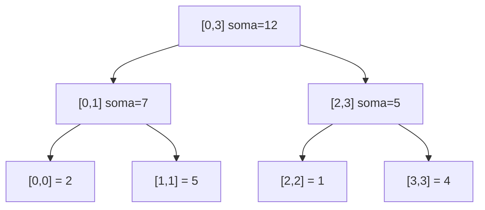
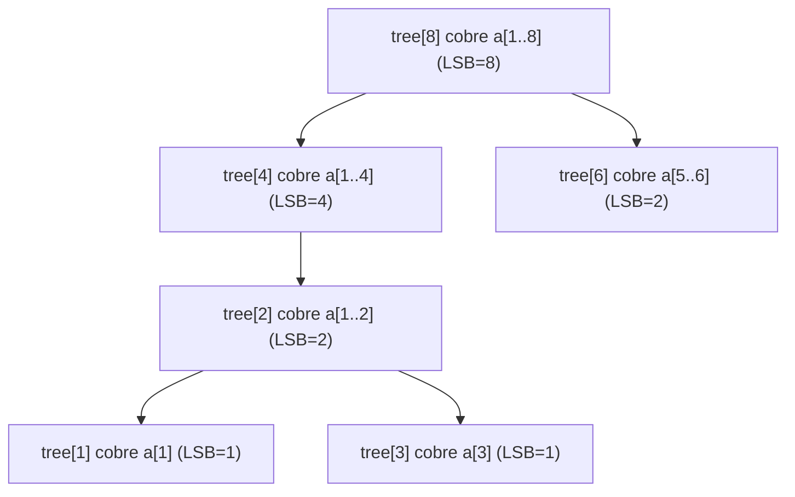
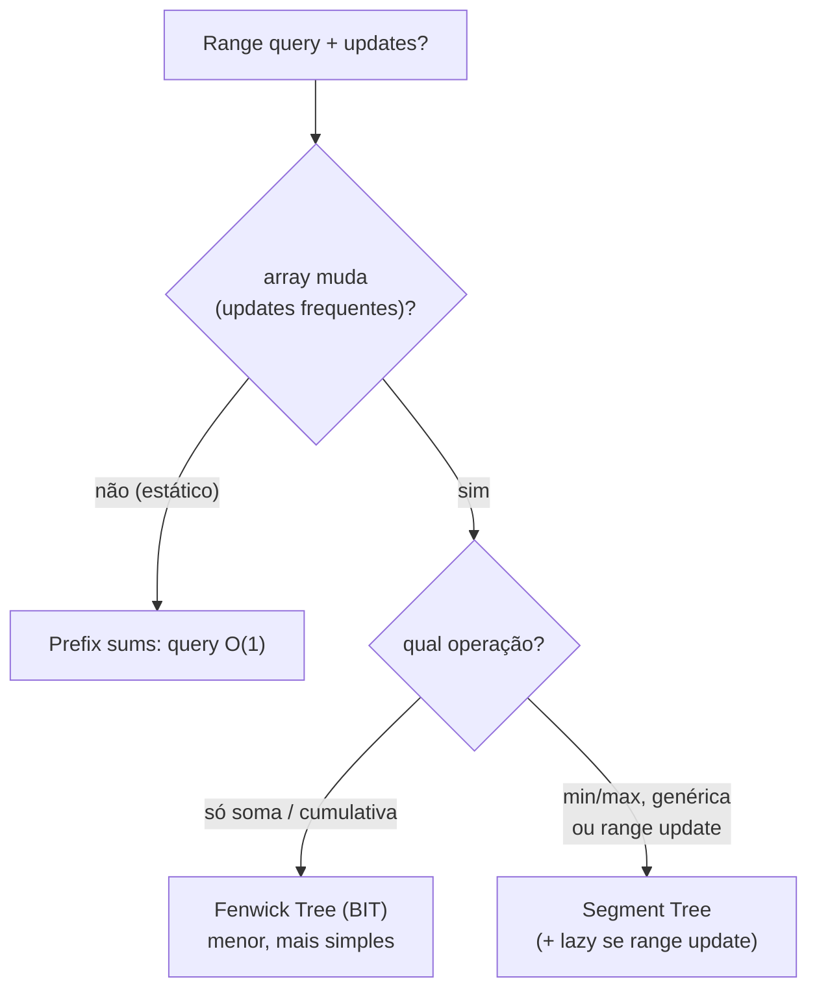

# Segment Tree e Fenwick Tree (BIT) para Range Queries

> **Bloco:** Estruturas de dados · **Nível:** Intermediário/Avançado · **Tempo de leitura:** ~26 min

## TL;DR

Ambas resolvem o mesmo problema central: **range queries sobre um array que muda** — "qual a soma (ou mínimo, máximo, GCD...) do intervalo `[L, R]`?" combinada com "atualize o valor da posição `i`", e você precisa que **as duas operações sejam rápidas ao mesmo tempo**. A solução ingênua é um dilema: um array simples dá update `O(1)` mas query `O(n)` (varre o intervalo); um array de prefix sums dá query `O(1)` mas update `O(n)` (recalcula todos os prefixos). Quando há **muitos updates intercalados com muitas queries**, ambas as ingênuas são `O(n)` em algum lado — inviável. A **Segment Tree** (árvore de segmentos) resolve isso com uma **árvore binária onde cada nó cobre um intervalo** e guarda o agregado desse intervalo; query e update ficam ambos **`O(log n)`**. É a mais **geral e poderosa**: funciona para qualquer operação **associativa** (soma, min, max, GCD, ...), suporta **range updates** com **lazy propagation**, e é a escolha quando se precisa de min/max ou updates em intervalo. A **Fenwick Tree** (ou **Binary Indexed Tree / BIT**, de Peter Fenwick, 1994) é uma estrutura mais **enxuta e elegante** especializada em **prefix sums**: usa um único array onde cada índice é responsável por um intervalo definido pelo seu **bit menos significativo** (LSB), entregando update e prefix-query em `O(log n)` com código curtíssimo (poucas linhas, manipulação de bits `i += i & -i`) e **constante menor / menos memória** que a segment tree. Range query `[L, R]` na Fenwick = `prefix(R) − prefix(L−1)`. Regra prática: **se é só soma/prefix-sum, use Fenwick** (menor, mais rápida); **se precisa de min/max, operações genéricas ou range updates, use Segment Tree** (mais geral).

## O problema que resolve

Considere um painel de **analytics de vendas em tempo real** de um e-commerce na Black Friday. Você tem um array onde cada posição `i` é o total de vendas de um produto (ou de um minuto, ou de uma região). Duas coisas acontecem o tempo todo, intercaladas e em alto volume:

1. **Updates:** uma venda nova chega e atualiza a posição de um produto.
2. **Queries de intervalo:** o dashboard pergunta "qual a soma de vendas dos produtos de `L` a `R`?" ou "qual o **pico** (máximo) de vendas no intervalo de minutos `[L, R]`?".

A pergunta central é: **"como responder a consultas de agregação sobre intervalos de um array que está sendo constantemente modificado, sem que nem a consulta nem a modificação custe `O(n)`?"**

Vamos ver por que as soluções simples falham quando há **muitos updates E muitas queries**:

- **Array simples + somar o intervalo na hora:** update da posição `i` é `O(1)` (escreve direto). Mas a query `[L, R]` percorre todos os elementos do intervalo — `O(n)` no pior caso. Com milhares de queries por segundo sobre intervalos grandes, derrete.
- **Array de prefix sums (`pre[i] = a[0]+...+a[i]`):** query `[L, R] = pre[R] − pre[L−1]` em `O(1)`, lindo. Mas um update da posição `i` exige **recalcular todos os prefixos de `i` em diante** — `O(n)`. Inviável quando os dados mudam o tempo todo.

O dilema é claro: as duas abordagens ingênuas são **assimétricas** — uma é rápida no update e lenta na query, a outra o oposto. O cenário real (analytics ao vivo, jogos, sistemas de competição) tem **ambos** em alta frequência, então precisamos de uma estrutura que torne **as duas operações `O(log n)`** simultaneamente. É exatamente o nicho da Segment Tree e da Fenwick Tree. Elas não são para arrays estáticos (aí prefix sums basta) nem para só-updates-sem-query — são para o **regime dinâmico misto**, onde o equilíbrio entre as duas operações é o que importa.

## O que é (definição aprofundada)

### Segment Tree (árvore de segmentos)

Uma **Segment Tree** é uma árvore binária construída sobre um array de tamanho `n`, onde:

- A **raiz** representa o intervalo inteiro `[0, n−1]` e guarda o agregado de todo o array.
- Cada **nó interno** representa um intervalo `[lo, hi]` e guarda o agregado desse intervalo; seus dois filhos cobrem as duas metades `[lo, mid]` e `[mid+1, hi]`.
- As **folhas** representam elementos individuais `[i, i]`.

O agregado de um nó é a combinação (via uma operação **associativa** — soma, min, max, GCD, OR, ...) dos agregados dos filhos. A árvore tem altura `O(log n)` e usa `O(n)` (tipicamente armazenada num array de tamanho `~4n` para a versão array-based, ou com nós dinâmicos).

- **Query `[L, R]`:** desce-se recursivamente; nós cujo intervalo está **totalmente contido** em `[L, R]` contribuem seu agregado pronto (não precisa descer mais); nós **parcialmente** sobrepostos são decompostos nos filhos; nós **disjuntos** são ignorados. Qualquer intervalo `[L, R]` se decompõe em `O(log n)` nós da árvore — por isso a query é `O(log n)`.
- **Update (ponto):** atualiza a folha correspondente e **recombina** os agregados subindo até a raiz — `O(log n)` nós no caminho.
- **Range update + Lazy Propagation:** para atualizar um **intervalo inteiro** (ex.: "some 5 a todos de `[L, R]`") em `O(log n)`, usa-se *lazy propagation*: em vez de atualizar cada folha do intervalo (que seria `O(n)`), marca-se o nó que cobre o intervalo com uma **pendência (lazy)** e só se "empurra" essa pendência para os filhos **quando (e se) eles forem visitados** depois. Isso preserva o `O(log n)` mesmo para updates de intervalo.

A força da Segment Tree é a **generalidade**: qualquer operação associativa serve, e ela suporta tanto point quanto range updates. É a estrutura de eleição quando se precisa de **min/max em intervalo** (range minimum query) ou de **range updates**.

### Fenwick Tree (Binary Indexed Tree / BIT)

A **Fenwick Tree** (Peter Fenwick, 1994, *"A new data structure for cumulative frequency tables"*) é uma estrutura especializada em **prefix sums** (somas cumulativas), notável pela elegância: usa **um único array** `tree[1..n]` (1-indexed) e manipulação de bits, sem ponteiros nem árvore explícita.

A ideia engenhosa: **cada índice `i` é responsável por um intervalo de elementos cujo comprimento é o valor do seu bit menos significativo (LSB)** — `LSB(i) = i & (−i)`. Por exemplo, o índice 12 (`1100` em binário) tem LSB = 4, então `tree[12]` guarda a soma de 4 elementos: `a[9..12]`. O índice 8 (`1000`) tem LSB = 8 e cobre `a[1..8]`. Essa decomposição por bits é o que faz tudo funcionar em `O(log n)` com aritmética trivial.

- **`update(i, delta)`** (soma `delta` à posição `i`): atualiza `tree[i]` e sobe somando o LSB — `i += i & (−i)` — tocando `O(log n)` índices.
- **`prefixSum(i)`** (soma de `a[1..i]`): acumula `tree[i]` e desce subtraindo o LSB — `i −= i & (−i)` — tocando `O(log n)` índices.
- **Range query `[L, R]`** = `prefixSum(R) − prefixSum(L−1)`. Como a Fenwick "natural" só responde prefixos `[1, r]`, range vira a diferença de dois prefixos.

O código completo cabe em poucas linhas:

```
update(i, delta):
    enquanto i <= n:
        tree[i] += delta
        i += i & (-i)        // sobe para o próximo responsável

prefixSum(i):
    soma = 0
    enquanto i > 0:
        soma += tree[i]
        i -= i & (-i)        // desce removendo o LSB
    retorna soma

rangeSum(L, R):
    retorna prefixSum(R) - prefixSum(L - 1)
```

A Fenwick é **mais enxuta** que a segment tree: menos memória (um array de `n`, não `4n`), constante menor, código curtíssimo. O preço é a **menor generalidade**: ela brilha para operações **invertíveis/cumulativas** como soma (que permite `prefix(R) − prefix(L−1)`). Para **min/max** (que não têm inversa — não dá para "subtrair" um mínimo de outro), a Fenwick básica não serve; aí a Segment Tree é a resposta.

### O contraste essencial

| Aspecto | Segment Tree | Fenwick Tree (BIT) |
|---|---|---|
| Operações suportadas | qualquer **associativa** (soma, min, max, GCD, ...) | tipicamente **soma / cumulativas invertíveis** |
| Range update (intervalo) | sim, com **lazy propagation** | só com truques (BIT de diferenças); limitado |
| Memória | `~4n` | `n` |
| Constante / código | maior, mais código | **menor, código curtíssimo** |
| Min/Max em intervalo | **sim** | não (sem inversa) |
| Facilidade de implementar | média | **alta** (poucas linhas) |

## Como funciona

| Estratégia | Update (ponto) | Range query | Quando usar |
|---|---|---|---|
| Array simples | `O(1)` | `O(n)` | muitos updates, **raras** queries |
| Prefix sums (estático) | `O(n)` | `O(1)` | array **estático**, só queries |
| **Fenwick Tree (BIT)** | `O(log n)` | `O(log n)` | soma/prefix em array dinâmico; quer simplicidade/memória |
| **Segment Tree** | `O(log n)` | `O(log n)` | min/max, operação genérica, ou **range updates** |
| Segment Tree + lazy | `O(log n)` (range) | `O(log n)` | **range update + range query** dinâmicos |

Construção: ambas em `O(n)` (segment tree com build bottom-up; Fenwick com construção `O(n)` otimizada, ou `O(n log n)` ingênua via `n` updates).

Pontos a internalizar:

- **As duas trocam o dilema `O(1)`/`O(n)` por `O(log n)`/`O(log n)`.** Esse equilíbrio é o ganho central — nenhuma operação fica linear no regime misto.
- **Decomposição logarítmica.** Tanto a query da segment tree (qualquer intervalo = `O(log n)` nós cobrindo-o) quanto a da Fenwick (qualquer prefixo = `O(log n)` "responsáveis" por bits) reduzem o problema a `O(log n)` peças pré-agregadas. É a mesma intuição: pré-computar agregados de blocos de tamanhos potência-de-2 e montar a resposta com poucos blocos.
- **Lazy propagation é o que viabiliza range updates `O(log n)`.** Sem ela, atualizar um intervalo inteiro seria `O(n)` (uma folha por vez). A "preguiça" adia a propagação até ser necessária, mantendo o custo logarítmico.
- **Fenwick é soma-cêntrica por causa da inversibilidade.** A mágica `prefix(R) − prefix(L−1)` exige que a operação tenha **inversa** (subtração para soma). Min/max não têm → use segment tree.

## Diagrama de fluxo

O primeiro diagrama mostra uma **Segment Tree de soma** sobre o array `[2, 5, 1, 4]` (índices 0–3). Cada nó mostra seu intervalo e a soma.



O segundo diagrama mostra a **responsabilidade por LSB numa Fenwick Tree** de 8 elementos: cada índice cobre um bloco cujo tamanho é seu bit menos significativo.



O terceiro diagrama resume a **decisão entre as duas estruturas** (e as ingênuas).



## Exemplo prático / caso real

**Cenário: leaderboard / ranking dinâmico de um jogo brasileiro.** Você tem `n` jogadores e precisa, em tempo real: (a) **atualizar** a pontuação de um jogador (update de ponto, muito frequente) e (b) responder **"quantos pontos somados têm os jogadores nas posições `L` a `R`?"** ou **"qual a soma de pontos de todos os jogadores até o ranking `k`?"** (prefix). Como é **só soma** num array dinâmico, a **Fenwick Tree** é a escolha ideal: código curto, pouca memória, update e query em `O(log n)`. Um caso clássico relacionado é **contar inversões** ou **quantos elementos menores à esquerda** — resolvido elegantemente com Fenwick sobre os valores.

**Cenário: analytics de pico (máximo) em janelas de tempo.** O dashboard pergunta "qual o **maior** volume de tráfego no intervalo de minutos `[L, R]`?" enquanto novos valores chegam. Como a operação é **máximo** (sem inversa — não existe `max(R) − max(L−1)`), a Fenwick básica **não serve**; a **Segment Tree** de máximo resolve: cada nó guarda o máximo do seu intervalo, query `[L, R]` combina os `O(log n)` nós cobrindo o intervalo, update de ponto recombina subindo. `O(log n)` para ambos.

**Cenário: range update com lazy propagation — reajuste em massa.** Suponha "aplicar +10% de bônus a todos os jogadores das posições `[L, R]`" (range update) e depois consultar somas de intervalos. Atualizar folha por folha seria `O(n)` por reajuste. Com **Segment Tree + lazy propagation**, marca-se o nó que cobre `[L, R]` com a pendência e propaga-se só quando necessário — range update e range query ambos em `O(log n)`. Esse é o cenário em que a Segment Tree é insubstituível.

Pseudocódigo conciso da query de Segment Tree de soma:

```
// nó cobre [lo, hi]; query pede [L, R]
query(no, lo, hi, L, R):
    se R < lo ou hi < L: retorna 0          // disjunto: ignora
    se L <= lo e hi <= R: retorna tree[no]  // totalmente contido: pronto
    mid = (lo + hi) / 2                      // parcial: desce nos dois filhos
    retorna query(2*no,   lo,    mid, L, R)
         +  query(2*no+1, mid+1, hi,  L, R)
```

**Onde aparecem em produção e competição:** Fenwick/Segment Tree são protagonistas de **programação competitiva** (Codeforces, ICPC) para problemas de range. Em sistemas reais, a ideia subjacente (agregados hierárquicos sobre intervalos) ecoa em **índices de séries temporais**, **agregação OLAP**, **rastreamento de cumulativos** em bancos, e estruturas de **interval/range** em engines de busca. A lição arquitetural transcende a implementação literal: quando você vê "range queries + updates frequentes", pensar em árvore de agregados `O(log n)` é o reflexo certo.

## Quando usar / Quando evitar

**Use Fenwick Tree (BIT) quando:**

- A operação é **soma / contagem cumulativa** (ou outra com inversa) num array **dinâmico**.
- Você quer **simplicidade, pouca memória e constante baixa** — é a estrutura mais enxuta para prefix sums dinâmicos.
- Precisa de prefix sums com updates de ponto frequentes (rankings, contagem de inversões, frequências cumulativas).

**Evite Fenwick quando:**

- Precisa de **min/max** ou de qualquer operação **sem inversa** (não dá para fazer `prefix(R) − prefix(L−1)`).
- Precisa de **range updates** arbitrários sofisticados — a Segment Tree com lazy é mais natural (a Fenwick faz range update só com truques de difference array, limitados).

**Use Segment Tree quando:**

- A operação é **genérica/associativa** (min, max, GCD, soma com lazy, ...) — máxima flexibilidade.
- Precisa de **range updates** (atualizar um intervalo inteiro) com **lazy propagation** em `O(log n)`.
- Precisa de **range minimum/maximum query** (RMQ) dinâmico.

**Evite Segment Tree (use alternativa) quando:**

- O array é **estático** e você só faz queries — **prefix sums** (`O(1)` query) ou **sparse table** (RMQ estático em `O(1)`) são mais simples e rápidos.
- A operação é só soma e você quer o mínimo de código/memória — a **Fenwick** é preferível (mesma complexidade, menos overhead).
- Você tem **só updates e raras queries** — array simples basta.

## Anti-padrões e armadilhas comuns

- **Usar prefix sums num array que muda muito.** Prefix sums dão query `O(1)` mas update `O(n)`; aplicá-los a dados que mudam o tempo todo transforma cada update num recálculo linear. Sinal de que você precisa de Fenwick/Segment Tree.
- **Tentar fazer min/max com Fenwick básica.** Min e max **não têm inversa**, então `prefix(R) − prefix(L−1)` não existe para eles. Forçar Fenwick para RMQ é erro conceitual — use Segment Tree. (Há variantes de BIT para max com restrições, mas não a fórmula de diferença geral.)
- **Esquecer a lazy propagation em range updates.** Atualizar um intervalo folha por folha na Segment Tree é `O(n)` por update — perde todo o propósito. Range update exige **lazy propagation** para manter `O(log n)`. Implementar range update sem lazy é a pegadinha mais comum.
- **Erros de indexação (0-indexed vs 1-indexed).** A Fenwick é naturalmente **1-indexed** (o truque do LSB depende disso); misturar com array 0-indexed gera bugs sutis de off-by-one, especialmente no `prefixSum(L−1)`.
- **`prefixSum(L−1)` com `L = 0`.** Em range `[L, R]`, calcular `prefix(L−1)` quando `L` é o início exige tratar `prefix(−1) = 0`; esquecer esse caso de borda corrompe a primeira posição.
- **Dimensionar a segment tree array com `2n` em vez de `4n`.** A versão array-based precisa de até `4n` posições para acomodar a árvore em todos os casos de `n` não-potência-de-2; usar `2n` causa acesso fora dos limites.
- **Achar que Segment Tree é sempre melhor que Fenwick (ou vice-versa).** Não há vencedor universal: para **só soma**, a Fenwick é mais enxuta e rápida; para **min/max ou range update**, a Segment Tree é necessária. Escolher pela operação, não por preferência.
- **Operação não-associativa.** A árvore de segmentos pressupõe que a operação seja **associativa** (para combinar agregados de sub-intervalos). Usá-la com uma operação não-associativa produz resultados errados — verifique a propriedade antes.
- **Recursão profunda / overhead em hot path.** A Segment Tree recursiva tem constante maior; em loops muito quentes, a versão iterativa (ou a Fenwick, quando aplicável) pode ser significativamente mais rápida apesar da mesma complexidade assintótica.

## Relação com outros conceitos

- **Complexidade algorítmica:** ambas são o estudo de caso perfeito do trade-off entre operações — trocar `O(1)/O(n)` por `O(log n)/O(log n)` é a essência da escolha de estrutura sob um perfil de carga (ver o bloco de complexidade algorítmica).
- **Árvores (binárias, balanceadas):** a Segment Tree é uma árvore binária de agregados; entender a estrutura de árvore e altura `O(log n)` é pré-requisito (ver o bloco de estruturas de dados).
- **Graph algorithms:** RMQ (range minimum query) com Segment Tree/sparse table é base do **LCA** (lowest common ancestor) via Euler tour, conectando a algoritmos de árvore/grafo (ver o bloco de algoritmos essenciais).
- **Bancos de dados e OLAP:** a ideia de **agregados pré-computados sobre intervalos** ecoa em índices de séries temporais, materialized views agregadas e cubos OLAP — a mesma intuição de "somar blocos pré-agregados" aplicada a dados (ver o bloco de dados e persistência).
- **Cache patterns:** agregados de range frequentemente consultados podem ser cacheados; a árvore de agregados é, em si, uma forma de "cache hierárquico" de somas parciais (ver [Cache patterns](../05-dados-e-persistencia/08-cache-patterns.md)).
- **Manipulação de bits:** a Fenwick é uma aplicação elegante de bit tricks (`i & −i` para o LSB); domina-la reforça o raciocínio sobre representação binária.

## Pontos para fixar (revisão)

- O problema é **range query + updates frequentes**: array simples dá `O(1)`/`O(n)`, prefix sums dá `O(n)`/`O(1)` — ambos ruins no **regime misto**. As duas estruturas trocam por **`O(log n)`/`O(log n)`**.
- **Segment Tree:** árvore de agregados por intervalo; **geral** (qualquer operação associativa: soma, min, max, GCD); suporta **range update** com **lazy propagation**; memória `~4n`.
- **Fenwick Tree (BIT):** especializada em **prefix sums**; um array, bit trick `i & −i` (LSB define o bloco de responsabilidade); **enxuta, pouca memória, código curto**; range `[L,R] = prefix(R) − prefix(L−1)`.
- **Regra de escolha:** só **soma/cumulativa** → **Fenwick** (menor/mais rápida); **min/max, genérica ou range update** → **Segment Tree** (mais geral).
- **Lazy propagation** é o que mantém range updates em `O(log n)` na Segment Tree — esquecê-la torna o range update `O(n)`.
- Fenwick não faz **min/max** (sem inversa para `prefix(R) − prefix(L−1)`); é **1-indexed**; cuidado com `prefix(L−1)` e dimensionar segment tree array com **`4n`**.
- Array **estático** → prefix sums (`O(1)`) ou sparse table (RMQ `O(1)`); não use as árvores onde a estática basta.

## Referências

- [Segment Tree — cp-algorithms.com (construção, query, lazy propagation)](https://cp-algorithms.com/data_structures/segment_tree.html)
- [Fenwick Tree — cp-algorithms.com (BIT, LSB, range queries)](https://cp-algorithms.com/data_structures/fenwick.html)
- [Binary Indexed Tree or Fenwick Tree — GeeksforGeeks](https://www.geeksforgeeks.org/dsa/binary-indexed-tree-or-fenwick-tree-2/)
- [Lazy Propagation in Segment Tree — GeeksforGeeks](https://www.geeksforgeeks.org/dsa/lazy-propagation-in-segment-tree/)
- [Fenwick tree — Wikipedia (paper de Peter Fenwick, 1994)](https://en.wikipedia.org/wiki/Fenwick_tree)
- [Understanding Fenwick Trees / Binary Indexed Trees — Codeforces](https://codeforces.com/blog/entry/57292)
- [Range Operations: Lazy Propagation — TopCoder](https://www.topcoder.com/thrive/articles/range-operations-lazy-propagation)
