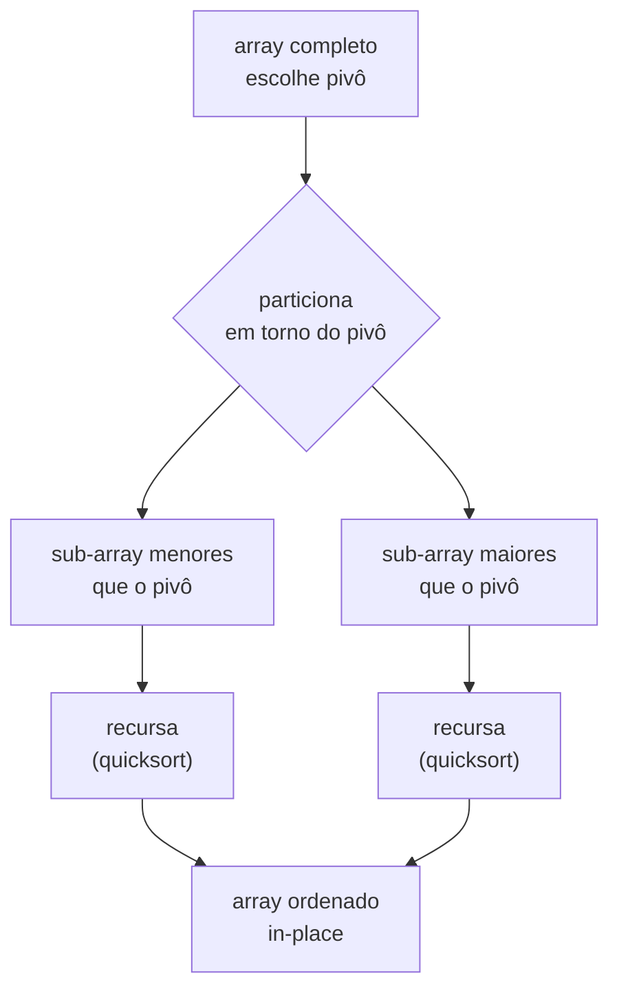
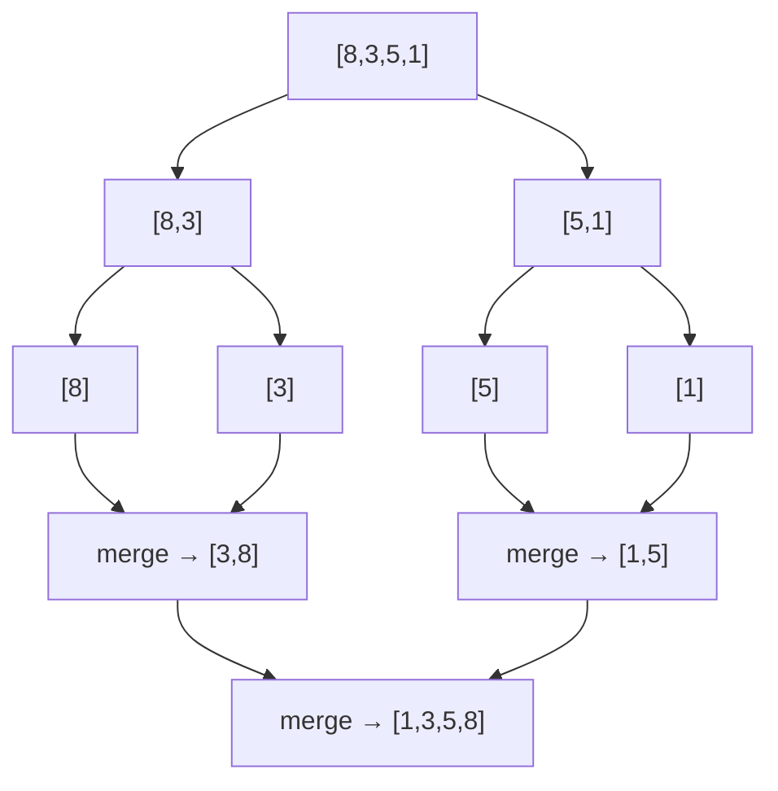
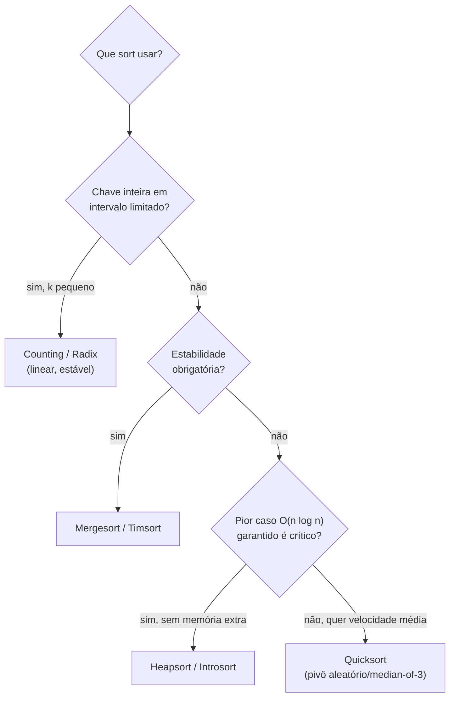

# Sorting: Quicksort, Mergesort, Heapsort, Radix Sort e Counting Sort

> **Bloco:** Algoritmos essenciais · **Nível:** Intermediário/Avançado · **Tempo de leitura:** ~30 min

## TL;DR

Ordenar é o problema mais bem estudado da computação, e a escolha do algoritmo certo é uma decisão de engenharia ancorada em três eixos: **estável vs instável** (preserva a ordem relativa de elementos com chave igual?), **in-place vs out-of-place** (usa O(1)/O(log n) de memória extra ou O(n)?) e **comparativo vs não-comparativo** (decide por `<`/`>` ou explora a estrutura da chave?). Os algoritmos comparativos têm um piso teórico de **Ω(n log n)** comparações — nenhum algoritmo baseado só em comparações pode ser assintoticamente mais rápido. **Quicksort** é O(n log n) na média, in-place, instável, com excelente localidade de cache (o mais rápido na prática para arrays em memória), mas degrada para **O(n²) no pior caso** se o pivô for mal escolhido. **Mergesort** é O(n log n) garantido em qualquer caso, **estável**, mas usa O(n) de memória extra — ideal para listas ligadas, dados em disco (external sort) e quando estabilidade é obrigatória. **Heapsort** é O(n log n) garantido e in-place, mas instável e com péssima localidade de cache (saltos pelo array) — sua função real é ser o "freio de segurança" contra o pior caso do quicksort. **Counting sort** e **radix sort** são **não-comparativos** e quebram a barreira Ω(n log n), rodando em **O(n + k)** e **O(d·(n + k))** respectivamente — mas só funcionam para chaves inteiras (ou mapeáveis a inteiros) num intervalo limitado. Na prática, ninguém implementa esses algoritmos puros em produção: linguagens usam **híbridos** — Python usa **Timsort** (mergesort + insertion sort, estável, explora runs ordenadas), C++ `std::sort` usa **introsort** (quicksort que cai para heapsort no pior caso, garantindo O(n log n)).

## O problema que resolve

Ordenação é raramente um fim em si — é o **pré-processamento que destrava outros algoritmos**. Busca binária exige array ordenado. Detectar duplicatas, encontrar a mediana, agrupar registros por chave, mesclar streams, computar a interseção de dois conjuntos: tudo fica trivial ou eficiente *depois* de ordenar. Por isso ordenar é onipresente e por isso vale entender as garantias de cada algoritmo, não só decorar que "todos são n log n".

O problema concreto é: dado um array (ou lista) de `n` elementos e uma relação de ordem total entre eles, produzir uma permutação em ordem não-decrescente. Parece simples, mas a forma como você ordena tem consequências de produção:

- **Custo de memória.** Ordenar 100 milhões de registros num serviço com pouca RAM: um mergesort ingênuo dobra o uso de memória (O(n) extra) e pode estourar; um quicksort in-place não. Ordenar dados maiores que a RAM exige *external sort* (variante de mergesort que mescla blocos em disco).
- **Estabilidade.** Ordenar uma tabela de pedidos por `valor` e depois por `data` só produz o resultado "ordenado por data, e dentro de cada data por valor" se o segundo sort for **estável** (preservar a ordenação anterior entre empates). Sorts instáveis embaralham os empates e quebram ordenações multi-chave.
- **Pior caso adversarial.** Um quicksort com pivô ingênuo (sempre o primeiro elemento) é O(n²) em arrays já ordenados — e um atacante que controla a entrada pode forçar exatamente esse pior caso (**algorithmic complexity attack**, um vetor real de DoS). Garantir O(n log n) no pior caso não é luxo acadêmico, é segurança.
- **Estrutura da chave.** Ordenar 50 milhões de CEPs (inteiros de 8 dígitos) por comparação é O(n log n); por radix sort é O(n) efetivo. Quando a chave tem estrutura explorável, descartar comparação é uma vantagem de ordem de grandeza.

A pergunta de engenharia, então, não é "qual o sort mais rápido?", mas **"dadas as restrições deste cenário — memória, estabilidade, garantia de pior caso, natureza da chave — qual algoritmo é a escolha certa?"**. Esta é exatamente a pergunta de entrevista de arquitetura.

## O que é (definição aprofundada)

### As três dimensões classificatórias

Antes dos algoritmos, fixe o vocabulário que organiza todo o assunto:

- **Estável (stable):** preserva a ordem relativa de elementos com chaves iguais. Se `a` vem antes de `b` na entrada e ambos têm a mesma chave, `a` continua antes de `b` na saída. Essencial para ordenações por múltiplas chaves feitas em passes sucessivos. Mergesort, counting sort e radix sort são estáveis; quicksort e heapsort não são (sem esforço extra).
- **In-place:** usa memória auxiliar O(1) ou O(log n) (esta última para a pilha de recursão), ordenando dentro do próprio array. Quicksort (O(log n) de pilha) e heapsort (O(1)) são in-place; mergesort clássico não é (O(n) extra).
- **Comparativo vs não-comparativo:** um sort **comparativo** só acessa os elementos via comparações (`a < b`). Provou-se que qualquer sort comparativo faz **Ω(n log n)** comparações no pior caso — é um limite inferior da teoria da informação (uma árvore de decisão binária com `n!` folhas tem altura ≥ log₂(n!) ≈ n log n). Um sort **não-comparativo** (counting, radix, bucket) explora a *estrutura* da chave (dígitos, faixa de valores) e por isso pode rodar em tempo linear, escapando da barreira.

### Quicksort

**Quicksort** (Tony Hoare, 1961) é divide-and-conquer por **partição**: escolhe um **pivô**, reorganiza o array de modo que todos os elementos menores que o pivô fiquem à esquerda e os maiores à direita (o pivô vai para sua posição final), e então ordena recursivamente as duas metades. A genialidade é que a partição é **in-place** e tem ótima localidade de referência (varre o array linearmente), o que o torna o sort comparativo mais rápido na prática para dados em memória.

- **Tempo:** **O(n log n) na média**, **O(n²) no pior caso** (pivô sempre o mínimo/máximo, ex.: array já ordenado com pivô = primeiro elemento — partições degeneram em tamanho `n-1` e `0`).
- **Espaço:** O(log n) na média (pilha de recursão); O(n) no pior caso de recursão não otimizada.
- **Estável?** Não. **In-place?** Sim.

A defesa contra o pior caso é a **escolha do pivô**: *median-of-three* (mediana entre primeiro, meio e último), pivô aleatório (torna O(n²) astronomicamente improvável e resiste a ataques adversariais), ou *median-of-medians* (garante O(n log n) determinístico, mas com constante alta — raramente usado). Esquemas de partição clássicos: **Lomuto** (simples, um ponteiro) e **Hoare** (dois ponteiros convergindo, menos swaps, mais eficiente).

### Mergesort

**Mergesort** (von Neumann, 1945) é divide-and-conquer por **fusão**: divide o array em duas metades, ordena cada uma recursivamente e **mescla (merge)** as duas metades ordenadas num array resultante. O merge percorre as duas metades com dois ponteiros, sempre pegando o menor da frente — daí ser naturalmente **estável** (em empate, escolhe o da metade esquerda, preservando a ordem original).

- **Tempo:** **O(n log n) em todos os casos** (melhor, médio e pior) — sem pior caso degenerado.
- **Espaço:** **O(n)** extra (o buffer de merge) na versão array. Em listas ligadas, o merge pode ser feito apenas re-ligando ponteiros: O(1) extra.
- **Estável?** Sim. **In-place?** Não (versão clássica em array).

A garantia O(n log n) incondicional e a estabilidade fazem do mergesort a base de muitos sorts de produção e de **external sort** (ordenar dados maiores que a RAM: ordena blocos que cabem na memória, grava em disco, e faz um *k-way merge* dos blocos).

### Heapsort

**Heapsort** usa a estrutura **heap binário** (árvore binária quase-completa em que todo pai ≥ filhos — *max-heap*). Constrói um max-heap a partir do array em O(n), depois repetidamente extrai o máximo (a raiz), coloca-o no fim do array e reorganiza o heap (`sift-down`), reduzindo o heap em um a cada passo.

- **Tempo:** **O(n log n) em todos os casos** (build O(n), n extrações de O(log n)).
- **Espaço:** **O(1)** extra — totalmente in-place.
- **Estável?** Não. **In-place?** Sim.

Heapsort tem a melhor garantia teórica combinada (O(n log n) *e* in-place), mas na prática é **mais lento que quicksort** porque o `sift-down` salta pelo array (acessando posições `2i+1`, `2i+2`), destruindo a localidade de cache. Seu papel real moderno é ser o **fallback de segurança** do introsort: quando o quicksort recursa fundo demais (sinal de pior caso O(n²)), troca-se para heapsort para garantir o limite O(n log n).

### Counting Sort

**Counting sort** é **não-comparativo**: para chaves inteiras num intervalo `[0, k]`, conta quantas vezes cada valor aparece, calcula somas de prefixo (posições finais de cada valor) e posiciona cada elemento diretamente. Não compara elementos entre si — usa o valor da chave como índice de um array de contagem.

- **Tempo:** **O(n + k)** (n para contar/posicionar, k para varrer o array de contagem).
- **Espaço:** **O(n + k)** (array de contagem + saída).
- **Estável?** Sim (a versão clássica, percorrendo de trás para frente). **In-place?** Não.

É **lineares** quando `k = O(n)`, batendo qualquer sort comparativo. Mas degenera quando `k >> n` (ex.: ordenar 1000 números no intervalo [0, 10⁹] alocaria um array de 1 bilhão de posições — inviável). É a sub-rotina estável que o radix sort usa internamente.

### Radix Sort

**Radix sort** ordena chaves de múltiplos "dígitos" (ou bytes, ou grupos de bits) processando **um dígito por vez**, geralmente do **menos significativo para o mais significativo (LSD)**, usando um sort estável (counting sort) em cada passe. Por que funciona: como o sort de cada dígito é estável, ao terminar o dígito mais significativo a ordenação de todos os dígitos menos significativos já está "preservada" como critério de desempate.

- **Tempo:** **O(d · (n + k))**, onde `d` = número de dígitos e `k` = base (raiz; ex.: 10 para decimal, 256 para bytes). Para chaves de tamanho fixo, `d` é constante → **O(n)** efetivo.
- **Espaço:** O(n + k).
- **Estável?** Sim. **In-place?** Não.

Brilha em chaves inteiras/strings de tamanho limitado e grande volume (ordenar bilhões de IDs, CEPs, timestamps). A estabilidade do counting sort interno é **condição necessária** — usar um sort instável por dígito quebra o radix sort.

### Tabela comparativa

| Algoritmo | Tempo (melhor) | Tempo (médio) | Tempo (pior) | Espaço extra | Estável? | In-place? | Comparativo? |
|---|---|---|---|---|---|---|---|
| **Quicksort** | O(n log n) | O(n log n) | **O(n²)** | O(log n) | Não | Sim | Sim |
| **Mergesort** | O(n log n) | O(n log n) | O(n log n) | **O(n)** | **Sim** | Não | Sim |
| **Heapsort** | O(n log n) | O(n log n) | O(n log n) | O(1) | Não | **Sim** | Sim |
| **Counting sort** | O(n + k) | O(n + k) | O(n + k) | O(n + k) | **Sim** | Não | **Não** |
| **Radix sort (LSD)** | O(d·(n+k)) | O(d·(n+k)) | O(d·(n+k)) | O(n + k) | **Sim** | Não | **Não** |
| **Insertion sort** | O(n) | O(n²) | O(n²) | O(1) | **Sim** | **Sim** | Sim |
| **Timsort** (híbrido) | O(n) | O(n log n) | O(n log n) | O(n) | **Sim** | Não | Sim |

Insertion sort entra na tabela porque é o "tijolo" dos híbridos: em arrays pequenos (≈ ≤ 16 elementos) ou quase-ordenados, sua simplicidade e ausência de overhead o tornam mais rápido que os O(n log n), e é O(n) em dados já ordenados — por isso Timsort e introsort caem para insertion sort nos sub-arrays pequenos.

### Glossário rápido

- **Pivô (pivot):** elemento escolhido no quicksort para particionar o array.
- **Partição:** reorganização que separa menores e maiores que o pivô.
- **Merge:** fusão de duas sequências ordenadas em uma.
- **Sift-down / heapify:** reorganização que restaura a propriedade de heap.
- **Run:** subsequência já ordenada na entrada (Timsort as detecta e aproveita).
- **LSD / MSD:** Least/Most Significant Digit — direção de processamento do radix sort.
- **k:** amplitude do intervalo de chaves (counting/radix).
- **d:** número de dígitos das chaves (radix).
- **External sort:** ordenação de dados maiores que a RAM, mesclando blocos em disco.

## Como funciona

**Quicksort (partição de Lomuto, conceitual):** escolhe o pivô (digamos, o último elemento), varre o array com um ponteiro `i` que marca a fronteira dos "menores que o pivô"; sempre que encontra um elemento menor, faz swap para dentro da região dos menores. Ao final, troca o pivô para a fronteira e recursa nas duas metades. Cada nível de recursão toca todos os `n` elementos uma vez (O(n) por nível); com partições balanceadas, há O(log n) níveis → O(n log n). Com partições degeneradas (pivô sempre extremo), há O(n) níveis → O(n²).

```
quicksort(A, lo, hi):
  se lo < hi:
    p = particiona(A, lo, hi)      // pivô em sua posição final
    quicksort(A, lo, p-1)
    quicksort(A, p+1, hi)
```

**Mergesort:** divide até sub-arrays de tamanho 1 (trivialmente ordenados), depois mescla de baixo para cima. A árvore de recursão tem altura log n; cada nível faz O(n) trabalho de merge → O(n log n) determinístico.

```
mergesort(A):
  se tamanho(A) <= 1: retorna A
  meio = tamanho(A)/2
  esq = mergesort(A[0..meio])
  dir = mergesort(A[meio..])
  retorna merge(esq, dir)          // dois ponteiros; em empate pega esq → estável
```

**Heapsort:** `build_max_heap` em O(n) (heapify de baixo para cima), depois `n-1` extrações; cada extração troca raiz com o último, encurta o heap e faz `sift_down` da nova raiz em O(log n).

```
heapsort(A):
  build_max_heap(A)                // O(n)
  para fim de n-1 até 1:
    swap(A[0], A[fim])             // maior vai para a posição final
    sift_down(A, 0, fim)          // O(log n)
```

**Counting sort:** conta ocorrências, faz somas de prefixo (posição final acumulada), e posiciona cada elemento percorrendo a entrada **de trás para frente** (para estabilidade).

```
counting_sort(A, k):
  count[0..k] = 0
  para x em A: count[x]++           // contagem
  para i de 1 até k: count[i] += count[i-1]   // somas de prefixo
  para x em A (de trás p/ frente):  // estabilidade
    out[--count[x]] = x
  retorna out
```

**Radix sort (LSD):** aplica counting sort estável dígito a dígito, do menos para o mais significativo.

```
radix_sort(A, d):
  para cada dígito i de 0 (LSD) até d-1 (MSD):
    A = counting_sort_por_digito(A, i)   // estável!
  retorna A
```

### Por que a barreira Ω(n log n)

Vale internalizar o argumento: um sort comparativo só obtém informação por comparações binárias. Para ordenar `n` elementos, o algoritmo precisa distinguir entre `n!` permutações possíveis. Cada comparação dá 1 bit de informação. Uma árvore de decisão que distingue `n!` casos tem ≥ `log₂(n!)` níveis, e por Stirling `log₂(n!) = Θ(n log n)`. Logo **nenhum sort comparativo pode fazer menos que Ω(n log n) comparações no pior caso**. Counting/radix escapam porque *não* comparam — usam a chave como índice, obtendo mais que 1 bit por operação.

## Diagrama de fluxo

O primeiro diagrama mostra a partição recursiva do quicksort; o segundo, a árvore de recursão do mergesort com a fase de merge; o terceiro, a árvore de decisão que justifica a escolha do algoritmo.







## Exemplo prático / caso real

O caso mais instrutivo é **por que as linguagens não usam nenhum desses algoritmos puros** — usam híbridos cuidadosamente projetados, e entender o porquê consolida todo o trade-off.

**Python e o Timsort.** Quando você chama `list.sort()` ou `sorted()` em Python, não roda quicksort nem mergesort puro — roda **Timsort**, criado por Tim Peters em 2002. Timsort combina **mergesort** (para a garantia O(n log n) e a estabilidade) com **insertion sort** (para sub-arrays pequenos, onde é mais rápido). A grande sacada é explorar **runs** — subsequências já ordenadas que aparecem em dados do mundo real (logs por timestamp, listas parcialmente ordenadas após inserções). Timsort detecta runs naturais, as estende com insertion sort e as mescla com uma política de merge balanceada. Em dados já ordenados ou quase, chega a **O(n)**. Java usa Timsort para arrays de objetos (onde estabilidade importa) desde o JDK 7. Python 3.11 substituiu a política de merge por **Powersort**, uma variante com política de merge mais robusta, mas o núcleo Timsort permanece. A lição de arquitetura: estabilidade + garantia de pior caso + aproveitar estrutura da entrada justificam o O(n) de memória extra.

**C++ e o introsort.** `std::sort` da STL **não** garante estabilidade (para isso há `std::stable_sort`, tipicamente mergesort), e usa **introsort** (introspective sort, David Musser, 1997): começa como **quicksort** (rápido na média, in-place, ótima cache), mas **monitora a profundidade de recursão**; se ela exceder `2·log₂(n)` (sinal de que o quicksort está degenerando para O(n²)), **troca para heapsort** no sub-array problemático, garantindo o limite O(n log n) no pior caso. Para sub-arrays pequenos, cai para **insertion sort**. Esse é o casamento perfeito: velocidade média do quicksort + garantia de pior caso do heapsort + eficiência do insertion sort no pequeno. É exatamente por isso que heapsort "lento" continua valioso — não como sort principal, mas como freio de emergência.

**Cenário pt-BR: ordenar pedidos de e-commerce na Black Friday.** Imagine um relatório que precisa listar os pedidos do dia ordenados por **região** e, dentro de cada região, por **horário do pedido** (mais recente primeiro). A forma idiomática é fazer dois passes de sort *estáveis*: primeiro ordena por horário, depois por região. Só funciona se o segundo sort for **estável** (preservar a ordem por horário dentro de cada região). Usar `std::sort` (instável) aqui produziria pedidos embaralhados dentro de cada região — bug sutil que passa em testes pequenos e quebra em produção. A escolha correta: `sorted(..., key=...)` em Python (Timsort, estável) ou `stable_sort` em C++.

**Cenário de radix sort: ordenar 200 milhões de CPFs.** Um sistema de conciliação precisa ordenar 200 milhões de CPFs (11 dígitos) para deduplicar e cruzar com outra base. Quicksort/mergesort seriam O(n log n) ≈ 200M × 28 ≈ 5,6 bilhões de comparações. Como a chave é inteira de tamanho fixo, **radix sort** (base 256, 5 bytes) faz 5 passes lineares ≈ O(5n) ≈ 1 bilhão de operações de bucketing, sem comparações — vantagem de ordem de grandeza, e estável. O custo é a memória dos buckets e a perda de localidade. Quando o volume é gigante e a chave é inteira limitada, radix vence.

## Quando usar / Quando evitar

**Quicksort:** escolha padrão para **ordenar arrays primitivos em memória** quando estabilidade não importa e você quer a maior velocidade média. **Sempre** com pivô aleatório ou median-of-three (nunca pivô fixo) para resistir ao pior caso O(n²) e a ataques adversariais. **Evite** quando precisa de garantia de pior caso sem o fallback (use introsort) ou de estabilidade.

**Mergesort:** escolha quando **estabilidade é obrigatória**, quando ordena **listas ligadas** (merge sem memória extra) ou **dados em disco/maiores que a RAM** (external sort), ou quando precisa de **O(n log n) garantido** e pode pagar O(n) de memória. **Evite** em ambientes com memória crítica e arrays primitivos (o O(n) extra dói; prefira quicksort/heapsort).

**Heapsort:** escolha quando precisa de **O(n log n) garantido E in-place** (memória O(1)), por exemplo sistemas embarcados com RAM apertada, ou como **fallback anti-pior-caso** (introsort). **Evite** como sort principal de alto desempenho — a péssima localidade de cache o torna mais lento que quicksort na prática.

**Counting sort:** escolha para **chaves inteiras num intervalo pequeno** (`k = O(n)`), ex.: notas de 0 a 100, idades, dígitos. Lineares e estável. **Evite** quando `k >> n` (desperdiça memória) ou chaves não-inteiras.

**Radix sort:** escolha para **grande volume de chaves inteiras/strings de tamanho fixo limitado** (IDs, CEPs, CPFs, timestamps), onde a vantagem linear compensa. **Evite** para chaves de tamanho muito variável, poucos elementos (overhead não compensa), ou quando comparação é barata e o volume é modesto.

## Anti-padrões e armadilhas comuns

- **Quicksort com pivô fixo (primeiro/último elemento).** É a pegadinha de entrevista clássica: em array **já ordenado** ou ordenado-reverso, esse pivô degenera as partições e produz **O(n²)**. Pior, é um vetor de DoS (algorithmic complexity attack): entrada adversarial força o pior caso. **Sempre** pivô aleatório ou median-of-three.
- **Afirmar que "quicksort é O(n log n)" sem qualificar.** Em entrevista, dizer só "n log n" sem mencionar o pior caso O(n²) e como evitá-lo (pivô, introsort) sinaliza compreensão rasa.
- **Assumir que todo sort é estável.** `std::sort` (C++), `Arrays.sort` para primitivos (Java, usa dual-pivot quicksort) e quicksort/heapsort **não** são estáveis. Ordenações multi-chave em passes silenciosamente quebram. Confirme a estabilidade antes de encadear sorts.
- **Counting sort com `k` enorme.** Tentar counting sort em `[0, 10⁹]` aloca um bilhão de slots — estoura memória. Counting só serve para `k` pequeno; para chaves grandes, radix.
- **Radix sort com sub-rotina instável.** O radix LSD *depende* da estabilidade do counting sort interno. Trocar por um sort instável por dígito quebra a corretude silenciosamente.
- **Recursão de quicksort/mergesort estourando a pilha.** Sem otimização de cauda na metade maior (ou conversão para loop), arrays grandes podem causar stack overflow. Implementações de produção recursam na metade menor e iteram na maior, limitando a pilha a O(log n).
- **Ordenar quando não precisa.** Para "os k maiores" use um heap (O(n log k)); para a mediana use quickselect (O(n) médio). Ordenar tudo (O(n log n)) só para pegar um pedaço é desperdício — clássico over-engineering.
- **Ignorar localidade de cache em microbenchmarks.** Concluir que "heapsort é tão bom quanto quicksort porque ambos são O(n log n)" ignora que as constantes e a cache fazem quicksort 2-3× mais rápido na prática. Complexidade assintótica não conta toda a história.
- **Esquecer `n` pequeno.** Para arrays minúsculos, insertion sort bate todos os O(n log n) pelo baixo overhead. Por isso os híbridos caem para ele — não o ignore por ser "quadrático".

## Relação com outros conceitos

- **Complexidade algorítmica e Master Theorem:** quicksort e mergesort são recorrências `T(n) = 2T(n/2) + O(n)`, resolvidas pelo Master Theorem (caso 2) em Θ(n log n); o pior caso do quicksort é `T(n) = T(n-1) + O(n)` = O(n²). A barreira Ω(n log n) dos sorts comparativos é um limite inferior fundamental — ver Divide and Conquer e Complexidade.
- **Estruturas de dados (heaps):** heapsort é uma aplicação direta do **heap binário** (priority queue); entender heapify e sift-down é pré-requisito. Ver o estudo de heaps/filas de prioridade.
- **Busca binária:** o output ordenado de qualquer sort é o input da busca binária — sort + busca binária é o combo "pré-processa uma vez, consulta muitas".
- **Divide and Conquer:** quicksort e mergesort são os exemplos canônicos do paradigma (dividir, conquistar, combinar) — ver o estudo dedicado.
- **System Design / segurança:** o pior caso O(n²) do quicksort com pivô previsível é um vetor real de DoS (algorithmic complexity attack); por isso linguagens usam pivô aleatório/introsort. Conecta com resiliência e rate limiting.
- **External sort e Big Data:** mergesort é a base de ordenação em MapReduce/Spark (shuffle-sort) e de bancos de dados (ORDER BY em datasets grandes usa external merge sort em disco).

## Pontos para fixar (revisão)

- Sorts **comparativos** têm piso **Ω(n log n)**; **não-comparativos** (counting, radix) escapam usando a chave como índice.
- **Quicksort:** O(n log n) médio, O(n²) pior, in-place, instável, melhor cache — *sempre com pivô aleatório/median-of-three*.
- **Mergesort:** O(n log n) garantido, **estável**, O(n) extra — listas ligadas, external sort, estabilidade obrigatória.
- **Heapsort:** O(n log n) garantido, in-place, instável, cache ruim — fallback anti-pior-caso (introsort).
- **Counting sort:** O(n + k), estável, só para `k` pequeno; **radix sort:** O(d·(n+k)), estável, usa counting estável por dígito.
- Linguagens usam **híbridos**: Python/Java → **Timsort** (mergesort+insertion, estável, runs); C++ `std::sort` → **introsort** (quicksort→heapsort no pior caso).
- Estabilidade quebra ordenações multi-chave silenciosamente — confirme antes de encadear sorts.
- Para "os k maiores"/mediana, use heap/quickselect, não ordene tudo.

## Referências

- [Sorting (Bubble, Selection, Insertion, Merge, Quick, Counting, Radix) — VisuAlgo](https://visualgo.net/en/sorting)
- [Quick Sort vs Merge Sort — GeeksforGeeks](https://www.geeksforgeeks.org/dsa/quick-sort-vs-merge-sort/)
- [Radix Sort — GeeksforGeeks](https://www.geeksforgeeks.org/dsa/radix-sort/)
- [TimSort — GeeksforGeeks](https://www.geeksforgeeks.org/dsa/timsort/)
- [Timsort — Wikipedia](https://en.wikipedia.org/wiki/Timsort)
- [Counting sort — Wikipedia](https://en.wikipedia.org/wiki/Counting_sort)
- [Radix sort — Wikipedia](https://en.wikipedia.org/wiki/Radix_sort)
- [Stable Sorting Algorithms — Baeldung on Computer Science](https://www.baeldung.com/cs/stable-sorting-algorithms)
- [Radix Sort — Baeldung on Computer Science](https://www.baeldung.com/cs/radix-sort)
- [13.15. An Empirical Comparison of Sorting Algorithms — OpenDSA](https://opendsa-server.cs.vt.edu/ODSA/Books/Everything/html/SortingEmpirical.html)
