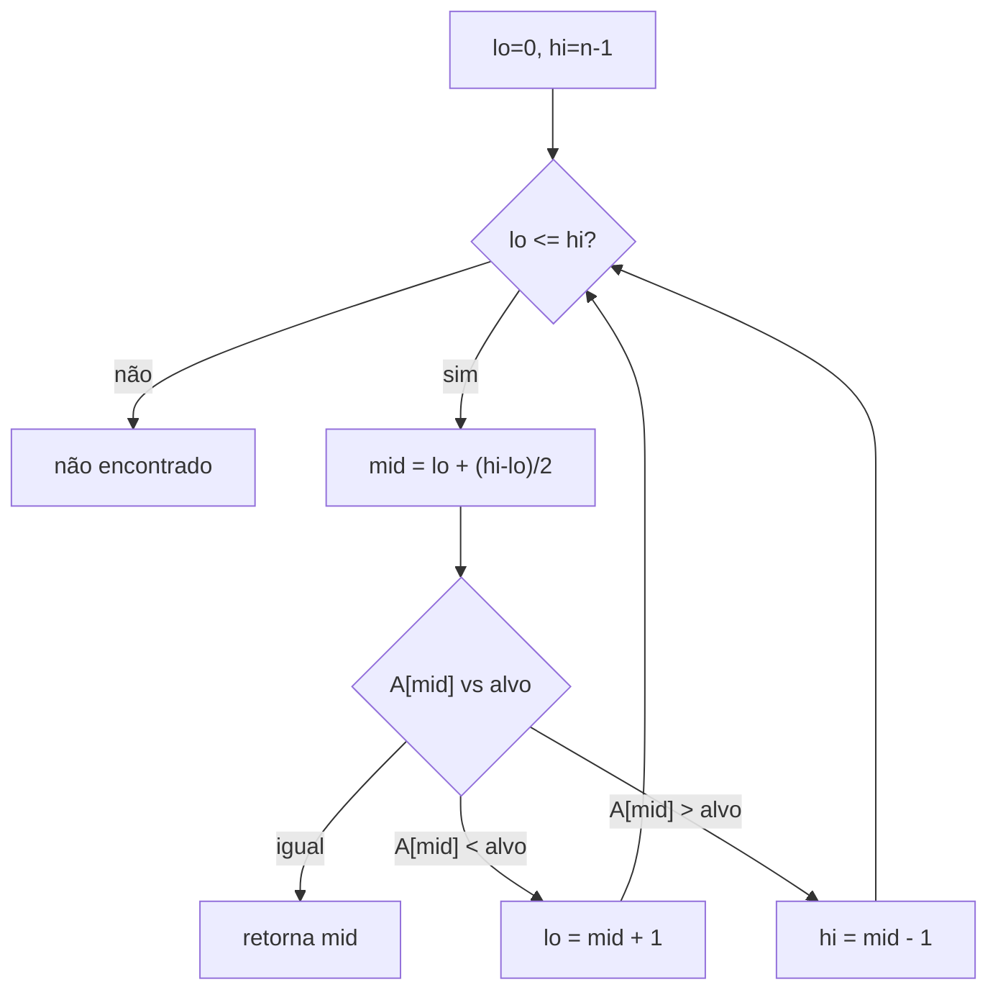
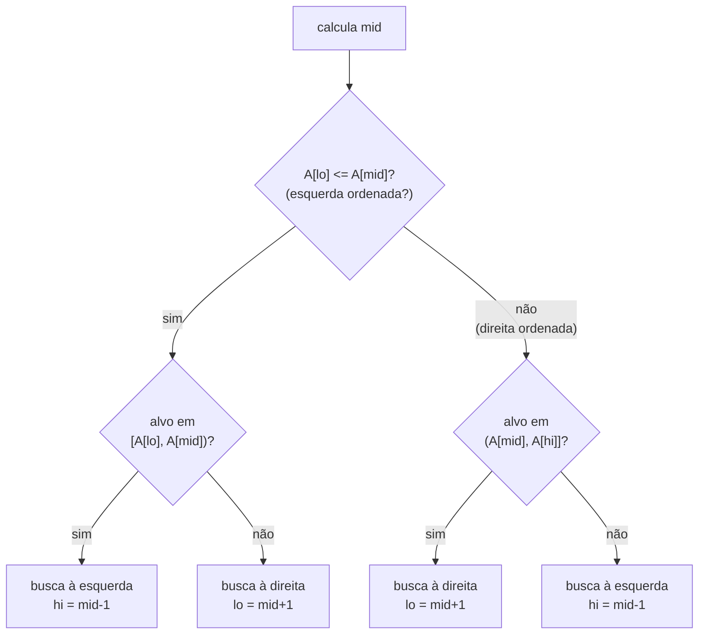
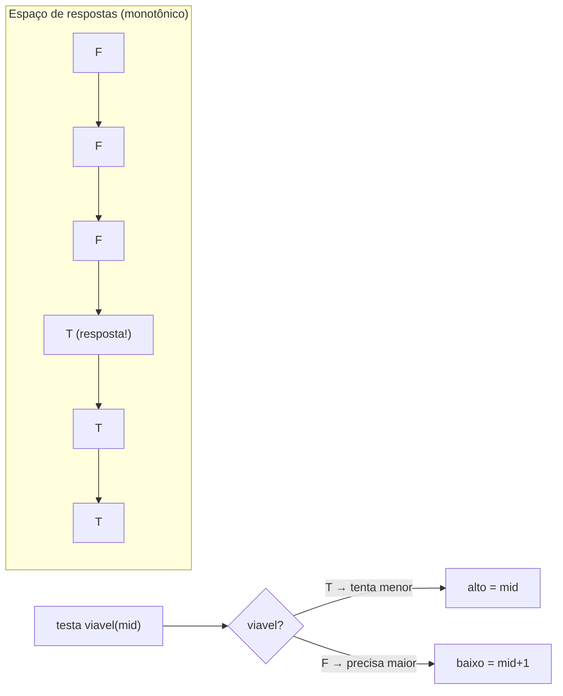

# Searching: Busca Binária e Variações (Rotated Array, First/Last Occurrence, Binary Search on Answer)

> **Bloco:** Algoritmos essenciais · **Nível:** Intermediário/Avançado · **Tempo de leitura:** ~28 min

## TL;DR

Busca binária é o algoritmo que reduz uma busca de **O(n) para O(log n)** explorando uma propriedade essencial: **monotonicidade**. A versão "de livro" — achar um valor exato num array ordenado — é a ponta do iceberg; o que cai em entrevista de arquiteto e em código de produção são as **variações**, todas variações do mesmo esqueleto `lo/hi/mid`. A primeira família busca **fronteiras**, não valores exatos: **lower_bound** (primeiro elemento ≥ x) e **upper_bound** (primeiro > x) resolvem "first/last occurrence" (primeira e última posição de um valor com duplicatas) e "quantos elementos são < x" sem casos especiais. A segunda família, **search in rotated sorted array**, busca num array ordenado que foi "girado" num pivô desconhecido — a cada passo, uma das metades está garantidamente ordenada, e você decide para qual lado ir. A família mais poderosa e contra-intuitiva é **binary search on the answer (busca binária na resposta)**: quando o *espaço de respostas* é monotônico (se a resposta `x` funciona, toda resposta maior também funciona — uma função de viabilidade booleana monotônica), você binariza sobre o intervalo de respostas possíveis em vez de sobre um array, transformando "encontre o menor/maior valor que satisfaz a condição" num problema log-linear. Exemplos canônicos: *Koko comendo bananas* (menor velocidade que cabe no prazo), capacidade mínima de navio, alocação de páginas. A armadilha universal de todas as variações é o **off-by-one**: a definição do intervalo (`[lo, hi]` fechado vs `[lo, hi)` semi-aberto), a condição do loop (`<` vs `<=`) e a atualização dos ponteiros (`mid` vs `mid ± 1`) precisam ser **mutuamente consistentes**, ou o código entra em loop infinito ou pula a resposta. A disciplina mental que evita isso: pensar em termos do **invariante** ("o que sei sobre `[lo, hi]` em todo momento") em vez de tentar "sentir" os índices.

## O problema que resolve

Buscar um elemento numa coleção é a operação mais fundamental da computação depois de ler/escrever. Numa coleção **não-ordenada** de `n` elementos, não há atalho: a busca linear precisa, no pior caso, olhar todos os `n` elementos — O(n). Mas se a coleção tem **estrutura explorável** — especificamente, se está **ordenada** ou se a propriedade buscada é **monotônica** —, você pode descartar metade do espaço de busca a cada comparação, chegando a **O(log n)**. Para 1 bilhão de elementos, isso é a diferença entre ~1 bilhão de passos e ~30 passos.

O ganho parece óbvio para o caso ingênuo (achar `x` num array ordenado), mas o problema real, e a razão de busca binária ser tema de arquiteto, é mais amplo:

- **Buscar fronteiras, não valores.** Raramente você quer só "o `x` existe?". Quer "qual a **primeira** posição onde aparece `x`?" (para deduplicar), "**quantos** elementos são menores que `x`?" (para percentis, ranking), "qual o **menor** elemento ≥ `x`?" (para encontrar o próximo timestamp, o próximo nível de preço). Essas são consultas de fronteira, e fazê-las com busca binária ingênua + varredura linear destrói o O(log n).
- **Buscar em estrutura parcialmente ordenada.** Arrays rotacionados (ex.: um log circular, um array ordenado cujo início "deu a volta") ainda têm estrutura suficiente para busca binária — mas exigem raciocínio sobre qual metade está ordenada.
- **Buscar a resposta de um problema de otimização.** Este é o salto conceitual. Muitos problemas têm a forma "encontre o **menor** valor `x` tal que `condição(x)` é verdadeira", onde `condição` é **monotônica** (falsa até certo ponto, verdadeira a partir dele). Em vez de testar todos os candidatos linearmente, você binariza sobre o **intervalo de respostas**, testando a viabilidade de cada candidato. Isso transforma busca exaustiva O(N · custo) em O(log(intervalo) · custo).

A pergunta central que organiza tudo: **"existe uma propriedade monotônica que me permite descartar metade do espaço de busca a cada passo?"**. Se sim — array ordenado, predicado booleano monotônico, função monotônica — a busca binária se aplica. O espaço "buscado" pode ser um array de dados ou um **intervalo abstrato de respostas candidatas**. Reconhecer a monotonicidade escondida num problema de otimização é a habilidade que separa o engenheiro júnior do sênior em entrevistas.

## O que é (definição aprofundada)

### Busca binária canônica

**Busca binária** opera sobre uma sequência **ordenada**. Mantém um intervalo de busca `[lo, hi]` e, a cada passo, examina o elemento do meio `mid`:

- se `A[mid] == alvo`: encontrou;
- se `A[mid] < alvo`: o alvo só pode estar à direita → `lo = mid + 1`;
- se `A[mid] > alvo`: o alvo só pode estar à esquerda → `hi = mid - 1`.

A cada passo o intervalo cai pela metade → **O(log n)** comparações. Espaço **O(1)** (versão iterativa) ou O(log n) (recursiva, pela pilha).

- **Tempo:** O(log n). **Espaço:** O(1) iterativa.
- **Pré-requisito absoluto:** a sequência deve estar **ordenada** (ou exibir a monotonicidade que justifica o descarte de metade).

A sutileza mortal é o cálculo de `mid`. `mid = (lo + hi) / 2` pode causar **overflow de inteiro** quando `lo + hi` excede o máximo do tipo — um bug famoso que existiu por anos no `binarySearch` da biblioteca padrão do Java e no JDK. A forma correta é **`mid = lo + (hi - lo) / 2`**, que nunca estoura.

### Lower bound e upper bound (fronteiras)

A generalização poderosa não busca um valor exato, mas uma **fronteira** num array ordenado (possivelmente com duplicatas):

- **lower_bound(x):** posição do **primeiro** elemento **≥ x**. Se `x` existe, é a sua **primeira ocorrência**; se não, é onde `x` seria inserido.
- **upper_bound(x):** posição do **primeiro** elemento **> x**. A **última ocorrência** de `x` é `upper_bound(x) - 1`.

Com esses dois, você resolve diretamente:

- **First/last occurrence:** `first = lower_bound(x)`, `last = upper_bound(x) - 1`.
- **Contagem de `x`:** `upper_bound(x) - lower_bound(x)`.
- **Quantos elementos < x:** `lower_bound(x)`.
- **Próximo elemento ≥ x / > x:** as próprias fronteiras.

A elegância: ambas são busca binária com uma condição de predicado, sem casos especiais para "achou/não achou". Você binariza o predicado "`A[mid] >= x`" (para lower_bound) e converge para a fronteira onde ele vira verdadeiro. C++ tem `std::lower_bound`/`std::upper_bound` nativos; em outras linguagens, implementa-se com o mesmo esqueleto.

### Search in rotated sorted array

Um **array ordenado rotacionado** é um array que estava ordenado e foi "girado" num pivô desconhecido: `[4,5,6,7,0,1,2]` (originalmente `[0..7]`, girado em 4 posições). Buscar `x` aqui em O(log n) parece impossível (não é globalmente monotônico), mas há um invariante salvador: **a cada passo, ao olhar `mid`, pelo menos uma das metades `[lo, mid]` ou `[mid, hi]` está totalmente ordenada**. O algoritmo:

1. compute `mid`;
2. determine qual metade está ordenada (compare `A[lo]` com `A[mid]`: se `A[lo] <= A[mid]`, a metade esquerda está ordenada);
3. verifique se o alvo cai no intervalo da metade ordenada (onde você consegue decidir com segurança); se sim, busque nela; senão, busque na outra.

Continua **O(log n)**. A versão com **duplicatas** (`Search in Rotated Sorted Array II`) tem um caso degenerado (`A[lo] == A[mid] == A[hi]`, ex.: `[1,1,1,0,1]`) onde não dá para saber qual metade está ordenada — aí encolhe `lo`/`hi` em um e o pior caso vira O(n). Problemas correlatos: **encontrar o mínimo** num array rotacionado (achar o pivô), e **encontrar o pivô** de rotação.

### Binary search on the answer (busca binária na resposta)

Aqui está o pulo conceitual. Considere problemas da forma: **"encontre o menor (ou maior) valor `x` num intervalo `[baixo, alto]` tal que `viável(x)` é verdadeiro"**, onde `viável` é uma **função booleana monotônica**: existe um ponto de corte tal que `viável` é falso de um lado e verdadeiro do outro (ex.: `F F F F T T T T`). Você não tem um array — tem um **intervalo de respostas candidatas** e uma **função de viabilidade** que você sabe calcular.

A monotonicidade da viabilidade é o que habilita a busca binária: se a resposta `x` é viável, e o problema é "achar o menor viável", então testar `mid`: se `viável(mid)`, a resposta está em `[baixo, mid]` (pode ser o próprio `mid`); senão, em `[mid+1, alto]`. Cada teste descarta metade do intervalo de respostas. Complexidade: **O(log(alto - baixo) · C)**, onde `C` é o custo de avaliar `viável` uma vez.

- **Tempo:** O(log(R) · C), `R` = tamanho do intervalo de respostas.
- **Chave de reconhecimento:** o problema pede o "mínimo/máximo valor que satisfaz uma condição" e a condição é **monotônica** no valor.

Exemplos canônicos:

- **Koko comendo bananas (LeetCode 875):** dadas pilhas de bananas e `h` horas, achar a **menor velocidade** `k` (bananas/hora) com que Koko termina em `h` horas. `viável(k)` = "consegue comer tudo em `h` horas na velocidade `k`" é monotônica (velocidade maior só ajuda). Binariza `k` em `[1, max(pilha)]`. O(n log(max)).
- **Capacity to ship packages within D days:** menor capacidade de navio para entregar tudo em `D` dias.
- **Split array largest sum / book allocation:** minimizar o máximo de uma partição.
- **Achar a raiz quadrada inteira, valores reais com precisão ε** (busca binária contínua).

### Glossário rápido

- **Monotonicidade:** propriedade de mudar de estado uma única vez (ordenado, ou predicado F...FT...T) que habilita o descarte de metade.
- **lower_bound:** primeiro índice com elemento ≥ x.
- **upper_bound:** primeiro índice com elemento > x.
- **Invariante de loop:** a propriedade verdadeira sobre `[lo, hi]` em todo passo (a chave para acertar os índices).
- **Predicado de viabilidade:** função booleana monotônica `viável(x)` na busca binária na resposta.
- **Espaço de respostas (search space on answer):** o intervalo `[baixo, alto]` de candidatos, não um array de dados.
- **Off-by-one:** erro de fronteira por inconsistência entre tipo de intervalo, condição do loop e atualização de ponteiros.

## Como funciona

**Busca binária canônica (intervalo fechado `[lo, hi]`):**

```
busca(A, alvo):
  lo = 0; hi = n - 1                  // intervalo fechado [lo, hi]
  enquanto lo <= hi:                  // <= porque o intervalo é fechado
    mid = lo + (hi - lo) / 2          // evita overflow
    se A[mid] == alvo: retorna mid
    senão se A[mid] < alvo: lo = mid + 1
    senão: hi = mid - 1
  retorna NÃO_ENCONTRADO
```

A consistência é tudo: intervalo **fechado** `[lo, hi]` ⟹ condição `lo <= hi` ⟹ atualizações `mid ± 1` (porque `mid` já foi examinado). Se você usar intervalo semi-aberto `[lo, hi)`, então `hi = n`, condição `lo < hi`, e `hi = mid` (não `mid - 1`). Misturar as duas convenções é a fonte número um de bugs.

**Lower bound (primeira posição com `A[mid] >= x`):**

```
lower_bound(A, x):
  lo = 0; hi = n                      // semi-aberto: resposta pode ser n (não existe)
  enquanto lo < hi:
    mid = lo + (hi - lo) / 2
    se A[mid] < x: lo = mid + 1       // mid certamente NÃO é resposta
    senão: hi = mid                   // mid PODE ser resposta, mantém em [lo, hi)
  retorna lo                          // lo == hi == primeira posição com A[.] >= x
```

A invariante: tudo em `[0, lo)` é `< x`, tudo em `[hi, n)` é `>= x`; o loop estreita até `lo == hi`. `upper_bound` é idêntico trocando a condição para `A[mid] <= x`.

**Rotated sorted array:**

```
busca_rotacionada(A, alvo):
  lo = 0; hi = n - 1
  enquanto lo <= hi:
    mid = lo + (hi - lo) / 2
    se A[mid] == alvo: retorna mid
    se A[lo] <= A[mid]:               // metade esquerda ordenada
      se A[lo] <= alvo < A[mid]: hi = mid - 1   // alvo na esquerda
      senão: lo = mid + 1
    senão:                            // metade direita ordenada
      se A[mid] < alvo <= A[hi]: lo = mid + 1   // alvo na direita
      senão: hi = mid - 1
  retorna NÃO_ENCONTRADO
```

**Binary search on the answer (menor `x` viável):**

```
menor_viavel(baixo, alto):
  enquanto baixo < alto:
    mid = baixo + (alto - baixo) / 2
    se viavel(mid): alto = mid        // mid serve; tenta menor
    senão: baixo = mid + 1            // mid não serve; precisa maior
  retorna baixo
// 'viavel' deve ser monotônica: F F F T T T
```

### O método do invariante (a cura do off-by-one)

A forma confiável de escrever qualquer busca binária sem cair em loop infinito ou pular a resposta não é "lembrar a fórmula", é **definir o invariante e derivar tudo dele**:

1. **Escolha a convenção do intervalo** e fixe-a: fechado `[lo, hi]` ou semi-aberto `[lo, hi)`. Não misture no mesmo código.
2. **Declare o invariante:** o que você sabe sobre os elementos fora de `[lo, hi]` em todo passo (ex.: "tudo à esquerda de `lo` falha o predicado, tudo à direita de `hi` passa").
3. **Derive a condição do loop** do intervalo: fechado → `lo <= hi`; semi-aberto → `lo < hi`.
4. **Derive a atualização:** se `mid` já foi *decidido* (não pode ser resposta), mova `mid ± 1`; se `mid` ainda *pode ser* resposta, mantenha-o (`hi = mid`).
5. **Garanta progresso:** o intervalo deve encolher a cada iteração, senão loop infinito. Com `lo < hi` e `mid = lo + (hi-lo)/2` (arredonda para baixo), `alto = mid` faz progresso porque `mid < hi`; mas `baixo = mid` *não* faria progresso quando `lo == mid` — por isso `baixo = mid + 1`.

Esse raciocínio é o que `cp-algorithms` formaliza ao tratar lower/upper bound como buscas de fronteira, e é o que evita o loop infinito clássico de quem escreve `lo = mid` num ramo sem garantir o encolhimento.

## Diagrama de fluxo

O primeiro diagrama mostra o fluxo de decisão da busca binária canônica; o segundo, a decisão "qual metade está ordenada" no array rotacionado; o terceiro, o padrão monotônico da busca binária na resposta.







## Exemplo prático / caso real

**Caso 1 — paginação e ranking num catálogo (lower/upper bound).** Um marketplace brasileiro armazena os preços dos produtos de uma categoria num array ordenado em memória (atualizado periodicamente) para responder rápido a filtros. Um usuário filtra "produtos entre R$ 50 e R$ 200". Em vez de varrer o catálogo (O(n) por consulta, inviável sob carga), o serviço faz `i = lower_bound(50)` e `j = upper_bound(200)`; os produtos no intervalo `[i, j)` são exatamente os filtrados, e `j - i` é a contagem para a paginação — tudo em O(log n). A mesma técnica responde "qual a posição (ranking) deste preço na distribuição?" com `lower_bound`. É o padrão que motores de busca e bancos colunar usam internamente.

**Caso 2 — busca num log rotacionado (rotated array).** Um buffer circular de eventos (ring buffer) por timestamp acaba sendo um array ordenado "girado" no ponto onde o buffer deu a volta: `[t5, t6, t7, t0, t1, t2, t3, t4]`. Para localizar o evento de um timestamp específico em O(log n) sem reordenar o buffer, aplica-se a busca binária em array rotacionado, decidindo a cada passo qual metade está cronologicamente ordenada. Reordenar o buffer a cada consulta seria O(n log n) — a busca rotacionada preserva o O(log n).

**Caso 3 — dimensionar capacidade com binary search on the answer.** Este é o caso que mais impressiona em entrevista de arquitetura. Imagine planejar a **vazão de um worker** que processa lotes de mensagens de uma fila durante uma janela de manutenção de `H` horas. Cada "pilha" é um backlog que precisa ser drenado, e a "velocidade" é quantas mensagens/hora o worker processa (custa $ proporcional). Pergunta: **qual a menor velocidade que drena tudo dentro de `H` horas?** (minimizar custo respeitando o SLA). Modelando como *Koko comendo bananas*: `viável(v)` = "na velocidade `v`, o tempo total para drenar todos os backlogs ≤ H" é **monotônica** (mais velocidade nunca piora). Binariza `v` em `[1, maior_backlog]`; cada teste soma `ceil(backlog_i / v)` para todos os backlogs e compara com `H`. Complexidade O(n log(maior_backlog)), contra um O(maior_backlog · n) de testar cada velocidade. O insight de arquiteto: muitos problemas de **dimensionamento/alocação** ("menor capacidade", "menor número de máquinas", "menor latência alvo viável") escondem essa estrutura monotônica e cedem à busca binária na resposta.

Pseudocódigo do caso 3 (estilo Koko):

```
viavel(v):                            // v = mensagens/hora
  horas = 0
  para cada backlog b: horas += ceil(b / v)
  retorna horas <= H

menor_velocidade():
  baixo = 1; alto = max(backlogs)
  enquanto baixo < alto:
    v = baixo + (alto - baixo)/2
    se viavel(v): alto = v
    senão: baixo = v + 1
  retorna baixo
```

## Quando usar / Quando evitar

**Busca binária canônica:** use sempre que os dados estão **ordenados** e você precisa de lookups repetidos — o sort O(n log n) inicial se amortiza em muitas consultas O(log n). **Evite** se a coleção muda a cada consulta (manter ordenado a cada inserção pode custar mais que buscar linearmente; aí prefira hash table O(1) ou árvore balanceada) ou se há poucos elementos (busca linear tem menos overhead e melhor cache).

**Lower/upper bound:** use para **consultas de fronteira/ranking/contagem** em dados ordenados (percentis, "próximo maior", contagem por faixa, first/last occurrence). É a forma idiomática e sem casos especiais. **Evite** reimplementar manualmente se a linguagem oferece nativo (`std::lower_bound`, `bisect` em Python).

**Rotated array search:** use quando o array é ordenado-mas-rotacionado e você não pode/quer reordenar (ring buffers, dados cíclicos). **Evite** quando há muitas duplicatas (degenera para O(n) no pior caso) ou quando reordenar uma vez e fazer muitas buscas canônicas é mais simples.

**Binary search on the answer:** use quando o problema pede "**menor/maior valor que satisfaz** uma condição **monotônica**" e avaliar a condição para um candidato é eficiente. Domina problemas de minimização de máximo / dimensionamento / alocação. **Evite** se a viabilidade **não é monotônica** (a busca binária dá resposta errada silenciosamente — pré-requisito inviolável) ou se o intervalo de respostas é minúsculo (varredura linear basta).

## Anti-padrões e armadilhas comuns

- **Overflow no cálculo de `mid`.** `mid = (lo + hi) / 2` estoura quando `lo + hi` excede o máximo do inteiro — o bug histórico do `Arrays.binarySearch` do Java. **Sempre** `mid = lo + (hi - lo) / 2`.
- **Off-by-one por convenções misturadas.** Usar intervalo fechado `[lo, hi]` mas condição `lo < hi`, ou atualizar `hi = mid` num intervalo fechado. Escolha **uma** convenção e derive condição e atualizações dela de forma consistente.
- **Loop infinito por falta de progresso.** `lo = mid` (em vez de `mid + 1`) num ramo onde `mid == lo` nunca encolhe o intervalo → loop infinito. Garanta que cada iteração estreita `[lo, hi]`.
- **Aplicar busca binária em dados não-ordenados.** O pré-requisito é monotonicidade. Buscar binariamente um array não-ordenado retorna lixo — e às vezes "funciona" em testes pequenos, escondendo o bug.
- **First/last occurrence com varredura linear após achar.** Achar uma ocorrência com busca binária e depois varrer linearmente para esquerda/direita até a fronteira é O(n) no pior caso (array todo de duplicatas) — anula o O(log n). Use lower/upper bound.
- **Binary search on the answer sem verificar monotonicidade.** Aplicar a técnica a uma viabilidade não-monotônica dá resposta errada **sem erro visível**. Prove (ou argumente) a monotonicidade antes — é a pegadinha mais perigosa porque o código "roda".
- **Intervalo de respostas mal definido.** Em binary search on the answer, errar os limites (`baixo`/`alto`) — começar `baixo = 0` quando a velocidade mínima é 1, ou `alto` curto demais que exclui a resposta — produz resposta errada. O intervalo deve cobrir *todas* as respostas possíveis.
- **Rotated array com duplicatas tratado como sem duplicatas.** O caso `A[lo] == A[mid] == A[hi]` impede decidir qual metade está ordenada; ignorá-lo dá resposta errada. Trate encolhendo as bordas (aceitando O(n) no pior caso).
- **Recursão profunda desnecessária.** A versão recursiva consome O(log n) de pilha; a iterativa é O(1) e em hot paths evita overhead de chamada. Prefira iterativa em código de produção.
- **Confiar que `floor((lo+hi)/2)` sempre serve.** Para buscar o **maior** viável (não o menor), o arredondamento precisa ser **para cima** (`mid = lo + (hi - lo + 1)/2`), senão loop infinito quando `hi - lo == 1`. A direção da busca dita o arredondamento.

## Relação com outros conceitos

- **Sorting:** busca binária exige dados ordenados — sort (O(n log n)) + busca binária (O(log n)) é o combo "pré-processa uma vez, consulta muitas". Ver o estudo de sorting.
- **Complexidade algorítmica:** O(log n) é a assinatura do "descarte de metade a cada passo"; a recorrência `T(n) = T(n/2) + O(1)` resolve em O(log n) pelo Master Theorem (caso de `f(n)` constante).
- **Divide and Conquer:** busca binária é o D&C mais simples — divide em duas metades, mas **conquista só uma** (não combina), o que a torna O(log n) em vez de O(n log n). Ver o estudo de Divide and Conquer.
- **Estruturas de dados (BST, árvores balanceadas):** árvores de busca binária balanceadas (AVL, Red-Black, B-Tree) são a generalização "viva" da busca binária para coleções dinâmicas (inserção/remoção O(log n) + busca O(log n)); índices de banco de dados são B-Trees.
- **Two pointers:** busca binária e two pointers são as duas técnicas-base de redução de espaço de busca em arrays ordenados; muitos problemas admitem ambas (ex.: two-sum em array ordenado).
- **System Design (rate limiting / autoscaling):** "binary search on the answer" é o motor conceitual de dimensionamento — achar a menor capacidade/velocidade que respeita um SLA é exatamente o padrão Koko, conectando com planejamento de capacidade.

## Pontos para fixar (revisão)

- Busca binária é O(log n) e exige **monotonicidade** (array ordenado ou predicado F...FT...T) — o pré-requisito inviolável.
- `mid = lo + (hi - lo)/2` **sempre** (evita overflow); nunca `(lo + hi)/2`.
- **lower_bound** (primeiro ≥ x) e **upper_bound** (primeiro > x) resolvem first/last occurrence, contagem e ranking **sem casos especiais** — não varra linearmente após achar.
- **Rotated array:** a cada passo uma metade está ordenada; decida onde o alvo cai. Com duplicatas, pior caso O(n).
- **Binary search on the answer:** binarize o *intervalo de respostas* quando a **viabilidade é monotônica** (Koko, capacidade de navio, alocação) — O(log(intervalo) · custo).
- A cura do off-by-one é o **método do invariante**: fixe a convenção do intervalo, derive condição do loop e atualizações dela, garanta progresso.
- A armadilha mais perigosa em binary search on the answer é aplicar sem provar a monotonicidade — o código "roda" e responde errado.

## Referências

- [Binary Search — Algorithms for Competitive Programming (cp-algorithms)](https://cp-algorithms.com/num_methods/binary_search.html)
- [Find First and Last Position of Element in Sorted Array — AlgoMaster.io](https://algomaster.io/learn/dsa/find-first-and-last-position-of-element-in-sorted-array)
- [First and Last Occurrences in Sorted Array — GeeksforGeeks](https://www.geeksforgeeks.org/dsa/find-first-and-last-positions-of-an-element-in-a-sorted-array/)
- [Koko Eating Bananas — LeetCode](https://leetcode.com/problems/koko-eating-bananas/)
- [Koko Eating Bananas — GeeksforGeeks](https://www.geeksforgeeks.org/dsa/koko-eating-bananas/)
- [Koko Eating Bananas (Binary Search on Answer) — AlgoMaster.io](https://algomaster.io/learn/dsa/koko-eating-bananas)
- [Why quicksort is better than mergesort? (sobre garantias e estrutura) — GeeksforGeeks](https://www.geeksforgeeks.org/dsa/quicksort-better-mergesort/)
- [Binary Heap (Priority Queue) — VisuAlgo (estruturas ordenadas relacionadas)](https://visualgo.net/en/heap)
