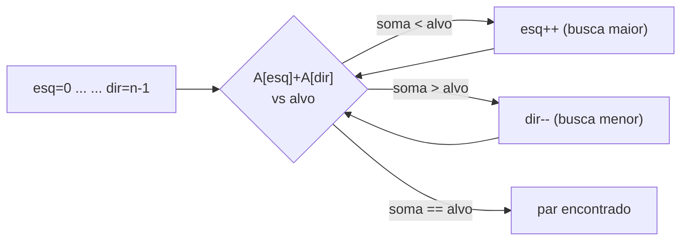
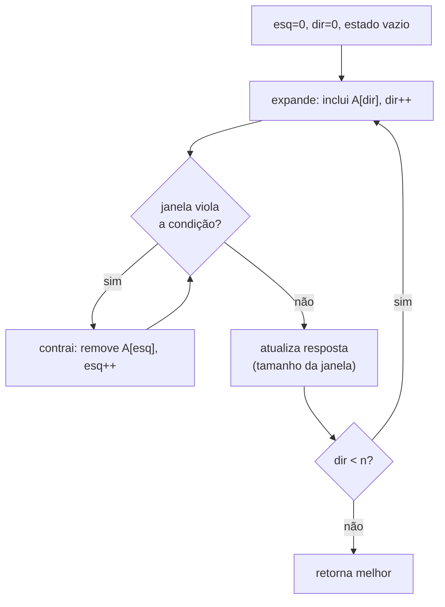
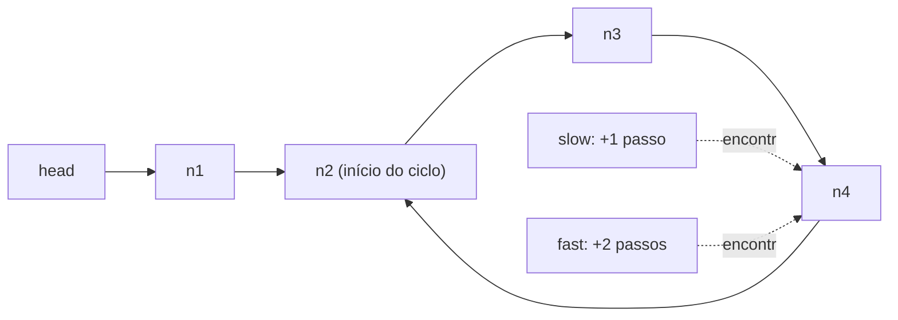

# Two Pointers, Sliding Window e Fast & Slow Pointers (Detecção de Ciclo de Floyd)

> **Bloco:** Algoritmos essenciais · **Nível:** Intermediário/Avançado · **Tempo de leitura:** ~28 min

## TL;DR

Três técnicas-irmãs eliminam loops aninhados, transformando soluções O(n²) em **O(n)** ao manter ponteiros que se movem de forma coordenada e **nunca retrocedem** — a observação central que justifica a linearidade. **Two Pointers** usa dois índices que percorrem uma estrutura (geralmente ordenada) em direções opostas (convergindo das pontas, como no two-sum em array ordenado) ou na mesma direção em velocidades diferentes; a cada passo descarta candidatos com base na ordem, evitando reexaminar pares. **Sliding Window** é um caso especializado de two pointers na mesma direção: mantém uma "janela" `[esquerda, direita]` sobre uma sequência e expande a direita para *incluir* elementos, contraindo a esquerda quando a janela viola uma condição — cada elemento entra e sai da janela no máximo uma vez, daí O(n); resolve "maior/menor subarray/substring que satisfaz X" sem reprocessar. **Fast & Slow Pointers** (ponteiro lento avança 1 passo, rápido avança 2) detecta **ciclos** numa sequência: se há ciclo, o rápido inevitavelmente alcança o lento por dentro do loop — é o **algoritmo de Floyd (tartaruga e lebre)**, que detecta ciclo em **O(n) tempo e O(1) espaço** (sem hash set auxiliar) e, com um segundo passo elegante, encontra o **nó de início do ciclo**. As mesmas técnicas aparecem em produção: sliding window é o motor de **rate limiters** (sliding window log/counter), de médias móveis em métricas e de detecção de anomalias em janelas de tempo; fast & slow detecta loops em grafos de dependência e listas ligadas. A armadilha recorrente é mover os ponteiros sem preservar o **invariante da janela/ordem** — contrair tarde demais, expandir sem atualizar o estado, ou aplicar two pointers a dados não-ordenados.

## O problema que resolve

A força bruta para muitos problemas de array/string/lista é **O(n²)** — para cada elemento, examina todos os outros: encontrar um par que soma `k`, o maior subarray sem repetição, o menor subarray com soma ≥ `s`. Esses loops aninhados não escalam: 1 milhão de elementos viram 1 trilhão de operações. As três técnicas atacam exatamente essa classe, explorando uma propriedade que torna o segundo loop **desnecessário**:

- **Quando há ordem (two pointers):** num array **ordenado**, se a soma de dois elementos é grande demais, o ponteiro do extremo maior pode recuar *sem nunca precisar voltar*; se é pequena demais, o do extremo menor avança. Cada ponteiro percorre o array uma vez → O(n) em vez de O(n²). A ordem é o que permite descartar candidatos em bloco.
- **Quando a condição é monotônica na janela (sliding window):** se um subarray `[i, j]` satisfaz "soma ≤ S", então qualquer subarray menor contido nele também satisfaz; se viola, expandir só piora. Essa monotonicidade permite **mover a fronteira esquerda para frente sem nunca recuá-la** — cada elemento entra e sai da janela uma vez → O(n).
- **Quando você precisa detectar repetição sem memória extra (fast & slow):** detectar se uma sequência tem ciclo é trivial com um hash set (guarde os visitados — O(n) espaço). Mas em ambientes com memória apertada, ou quando a "sequência" é uma lista ligada gigante, o fast & slow detecta o ciclo em **O(1) espaço**, usando apenas o fato geométrico de que um ponteiro 2× mais rápido fecha a distância dentro de um loop.

A pergunta unificadora: **"existe uma estrutura (ordem, monotonicidade da janela, ou geometria do ciclo) que me permite coordenar dois ponteiros de modo que cada elemento seja visitado um número constante de vezes, eliminando o loop interno?"**. Reconhecer qual das três se aplica — e por quê — é a habilidade. Confundir os casos (aplicar sliding window onde a condição não é monotônica, ou two pointers em dados não-ordenados) leva a soluções erradas que parecem certas em testes pequenos.

## O que é (definição aprofundada)

### Two Pointers

**Two Pointers** mantém dois índices na estrutura e os move segundo uma regra que garante cobertura total sem redundância. Há dois sabores principais:

- **Ponteiros convergentes (das extremidades para o centro):** `esq = 0`, `dir = n-1`, movendo-se um em direção ao outro. Padrão clássico: **two-sum em array ordenado** — se `A[esq] + A[dir] > alvo`, decrementa `dir` (o maior é grande demais); se `< alvo`, incrementa `esq`; se `==`, achou. Como o array é ordenado, essa regra nunca pula um par válido. Também resolve: verificar palíndromo, *container with most water*, *3-sum* (fixa um e faz two-pointer no resto), inverter array in-place.
- **Ponteiros na mesma direção (rápido/lento sobre array):** ambos avançam da esquerda, em velocidades ou condições diferentes. Padrão clássico: **remover duplicatas in-place** (lento marca a posição de escrita, rápido varre lendo), **mover zeros para o fim**, **particionar** (Dutch national flag).

- **Tempo:** O(n) (cada ponteiro percorre a estrutura uma vez). **Espaço:** O(1).
- **Pré-requisito frequente:** dados **ordenados** (para o sabor convergente) — sem ordem, a regra de descarte não vale.

### Sliding Window

**Sliding Window** é a especialização de two pointers na mesma direção para problemas de **subarray/substring contíguo**. Mantém uma janela `[esq, dir]` e um **estado da janela** (soma, contagem de caracteres, frequências). Há duas variantes:

- **Janela de tamanho fixo `k`:** desliza uma janela de tamanho constante; ao avançar `dir`, adiciona o novo elemento ao estado e remove `A[esq]`, avançando `esq`. Resolve "máxima soma de subarray de tamanho `k`", **média móvel**, "máximo em cada janela de `k`" (com deque).
- **Janela de tamanho variável:** expande `dir` incluindo elementos; quando a janela **viola** a condição, contrai `esq` até voltar a ser válida (ou vice-versa, dependendo se busca o maior válido ou o menor que satisfaz). Resolve "**maior** substring sem caracteres repetidos", "**menor** subarray com soma ≥ S", "maior substring com no máximo K distintos".

O insight da linearidade: embora pareça haver loops aninhados (expandir `dir` num for, contrair `esq` num while interno), **cada elemento é adicionado à janela uma vez (por `dir`) e removido no máximo uma vez (por `esq`)**. `esq` e `dir` só avançam, nunca recuam — total de 2n movimentos → **O(n)**.

- **Tempo:** O(n). **Espaço:** O(1) a O(k) (estado da janela, ex.: hash de frequências).
- **Pré-requisito:** a condição da janela deve ser **monotônica** em relação ao tamanho (expandir só piora a violação, contrair só ajuda) — senão contrair `esq` não restaura a validade e a técnica falha.

### Fast & Slow Pointers e o Algoritmo de Floyd

**Fast & Slow Pointers** (também *tortoise and hare*, tartaruga e lebre) usa dois ponteiros que avançam na mesma sequência em velocidades diferentes: **lento (slow) 1 passo, rápido (fast) 2 passos** por iteração. Aplicações:

- **Detecção de ciclo (Floyd's Cycle Detection):** se a sequência (lista ligada, ou função iterada `x → f(x)`) tem um **ciclo**, o ponteiro rápido eventualmente entra no ciclo e, dando passos 2× maiores, "dá voltas" e alcança o lento por dentro — **eles se encontram**. Se *não* há ciclo, o rápido chega ao fim (`null`) primeiro. Prova geométrica: dentro do ciclo, a distância entre fast e slow diminui em 1 a cada iteração, então a colisão é garantida.
- **Encontrar o início do ciclo:** após a colisão, há um fato matemático elegante (decorrente das distâncias percorridas: o rápido andou exatamente o dobro do lento): reposicione **um** ponteiro no início da sequência e avance **ambos 1 passo por vez**; eles se reencontram **exatamente no nó de início do ciclo**.
- **Encontrar o meio da lista:** quando o rápido chega ao fim, o lento está no meio (rápido andou 2×, então lento andou metade) — usado em mergesort de listas ligadas e em "lista é palíndromo?".
- **Detectar número feliz, encontrar duplicata (LeetCode 287):** o problema "encontre a duplicata num array de `n+1` inteiros em `[1, n]`" se modela como detecção de ciclo numa função iterada — Floyd resolve em O(n) tempo, O(1) espaço.

- **Tempo:** O(n). **Espaço:** **O(1)** — a grande vantagem sobre a abordagem com hash set (O(n) espaço).

### Glossário rápido

- **Two pointers convergentes:** ponteiros das extremidades movendo-se ao centro (exige ordem).
- **Two pointers same-direction:** ambos avançam da esquerda, em ritmos/condições distintas.
- **Janela (window):** intervalo contíguo `[esq, dir]` mantido pelo sliding window.
- **Estado da janela:** agregado mantido incrementalmente (soma, frequências) ao expandir/contrair.
- **Monotonicidade da janela:** propriedade de que expandir piora e contrair ajuda a condição — pré-requisito do sliding window variável.
- **Tortoise and hare:** apelido do fast & slow (tartaruga 1 passo, lebre 2).
- **Ciclo:** repetição numa sequência (lista ligada que aponta para trás, ou `f` iterada que revisita um valor).
- **Ponto de encontro (meeting point):** onde fast e slow colidem dentro do ciclo.

## Como funciona

**Two pointers convergente (two-sum ordenado):**

```
two_sum_ordenado(A, alvo):
  esq = 0; dir = n-1
  enquanto esq < dir:
    s = A[esq] + A[dir]
    se s == alvo: retorna (esq, dir)
    senão se s < alvo: esq++      // precisa de soma maior
    senão: dir--                  // precisa de soma menor
  retorna NÃO_ENCONTRADO
```

A ordem garante que mover o ponteiro certo nunca descarta um par válido. Cada ponteiro anda no máximo `n` posições → O(n).

**Sliding window variável (menor subarray com soma ≥ S):**

```
menor_subarray_soma(A, S):
  esq = 0; soma = 0; melhor = INFINITO
  para dir de 0 até n-1:
    soma += A[dir]                // expande a direita
    enquanto soma >= S:           // janela válida → tenta encolher
      melhor = min(melhor, dir - esq + 1)
      soma -= A[esq]; esq++       // contrai a esquerda
  retorna melhor
```

Cada elemento é somado uma vez (em `dir`) e subtraído no máximo uma vez (em `esq`); `esq` nunca recua → **O(n)** apesar do while aninhado.

**Sliding window de tamanho fixo (máxima soma de janela k):**

```
max_soma_janela(A, k):
  soma = soma dos primeiros k elementos
  melhor = soma
  para dir de k até n-1:
    soma += A[dir] - A[dir-k]     // adiciona novo, remove o que saiu
    melhor = max(melhor, soma)
  retorna melhor
```

**Floyd — detecção e início do ciclo:**

```
detecta_ciclo(head):
  lento = rapido = head
  enquanto rapido != null e rapido.next != null:
    lento = lento.next            // 1 passo
    rapido = rapido.next.next     // 2 passos
    se lento == rapido:           // colisão → há ciclo
      // fase 2: achar o início
      ptr = head
      enquanto ptr != lento:
        ptr = ptr.next
        lento = lento.next
      retorna ptr                 // nó de início do ciclo
  retorna null                    // rapido chegou ao fim → sem ciclo
```

### Por que Floyd encontra o início (intuição da matemática)

Seja `μ` a distância do início da sequência até a entrada do ciclo, e `λ` o comprimento do ciclo. Quando lento e rápido colidem, o lento andou `d` passos e o rápido `2d`. A diferença `2d - d = d` é múltiplo de `λ` (o rápido deu voltas inteiras a mais). Disso decorre que o ponto de encontro está a uma distância de `μ` (módulo `λ`) da entrada — então mover um ponteiro do início e outro do encontro, **1 passo cada**, faz ambos chegarem à entrada do ciclo ao mesmo tempo. É esse encaixe aritmético que torna o O(1) espaço possível sem registrar nós visitados.

## Diagrama de fluxo

O primeiro diagrama mostra a convergência do two pointers; o segundo, a expansão/contração do sliding window; o terceiro, a tartaruga e lebre se encontrando dentro de um ciclo.







## Exemplo prático / caso real

**Caso 1 — Sliding window como motor de rate limiter.** O exemplo mais direto de produção. Um **rate limiter de sliding window** decide se uma requisição é aceita contando quantas chegaram nos últimos `T` segundos. Na variante **sliding window log**, mantém-se a lista de timestamps das requisições; ao chegar uma nova no instante `agora`, descartam-se (contraem-se) todos os timestamps `< agora - T` (saíram da janela) e conta-se quantos restam; se `< limite`, aceita e registra. Isso é **exatamente** o padrão sliding window: a "janela" é o intervalo de tempo `[agora - T, agora]`, `dir` é a chegada de novas requisições e `esq` avança expirando as antigas — cada timestamp entra uma vez e sai uma vez. A variante **sliding window counter** aproxima isso com contadores por sub-janela para economizar memória. Entender que rate limiting de janela deslizante *é* o algoritmo sliding window conecta diretamente System Design com algoritmos — uma pergunta de entrevista comum é justamente "implemente um rate limiter de janela deslizante", e a resposta é o esqueleto expand/contract acima.

**Caso 2 — médias móveis e detecção de anomalia em métricas.** Um sistema de observabilidade calcula a **média móvel** da latência (p. ex., janela de 60 segundos) para suavizar ruído e detectar picos. Recalcular a média do zero a cada segundo é O(janela); com **sliding window de tamanho fixo**, mantém-se a soma incrementalmente (`soma += novo - que_saiu`), tornando cada atualização O(1). Detectar anomalias ("a latência média da última janela está 3× acima da janela anterior?") usa o mesmo mecanismo. Esse padrão aparece em qualquer pipeline de séries temporais (Prometheus rate/avg_over_time, alertas baseados em janela).

**Caso 3 — Floyd detectando ciclos em grafos de dependência.** Um build system (ou um resolvedor de dependências de pacotes, ou um orquestrador de workflows como Airflow) precisa garantir que o grafo de dependências é **acíclico** (DAG) — um ciclo `A depende de B depende de C depende de A` trava o build. A detecção de ciclo de Floyd (e sua generalização para grafos via DFS com cores) é o algoritmo subjacente. Em listas ligadas concretas — por exemplo, validar que uma estrutura de dados serializada não tem referências circulares antes de processá-la recursivamente (evitando stack overflow) — Floyd é a escolha O(1) espaço. Em fintech, detectar **loops em cadeias de transações/transferências** (que indicariam fraude ou erro de modelagem) usa a mesma ideia.

**Caso 4 — two pointers em deduplicação/merge.** Mesclar duas listas ordenadas de eventos (ex.: dois streams de logs já ordenados por timestamp) usa dois ponteiros avançando em paralelo, sempre consumindo o menor da frente — é o `merge` do mergesort, um two pointers same-direction sobre duas sequências. Deduplicar um array ordenado in-place (ponteiro de escrita lento, ponteiro de leitura rápido) economiza memória ao não alocar um array novo.

Pseudocódigo do rate limiter sliding window log:

```
permite(req, agora, T, limite):
  // remove timestamps fora da janela [agora-T, agora]  → contrai 'esq'
  enquanto fila não vazia e fila.frente < agora - T:
    fila.remove_frente()
  se tamanho(fila) < limite:
    fila.adiciona(agora)          // expande 'dir'
    retorna ACEITA
  retorna REJEITA
```

## Quando usar / Quando evitar

**Two Pointers:** use para problemas de **par/triplo/partição em array ordenado** (two-sum, 3-sum, container with water, palíndromo, Dutch flag) e para operações in-place same-direction (remover duplicatas, mover zeros, merge de listas ordenadas). **Evite** quando os dados **não estão ordenados** e a ordem importa para a regra (ordene antes — O(n log n) — ou use hash table O(n) para two-sum não-ordenado).

**Sliding Window:** use para "**maior/menor/contagem de subarray ou substring contíguo** que satisfaz uma condição **monotônica**" (maior substring sem repetição, menor subarray com soma ≥ S, janelas de tamanho fixo, médias móveis, rate limiting). **Evite** quando a condição **não é monotônica** na janela (contrair não restaura validade — a técnica dá resposta errada) ou quando os elementos não são contíguos (subsequência, não subarray — isso é tipicamente DP).

**Fast & Slow Pointers:** use para **detecção de ciclo** com **O(1) espaço** (listas ligadas, funções iteradas, encontrar duplicata em array de `[1,n]`), encontrar o **meio** de uma lista, e início do ciclo. **Evite** quando a memória O(n) de um hash set é aceitável e a clareza importa mais (hash set é mais legível), ou quando a estrutura permite acesso aleatório e há soluções mais simples.

## Anti-padrões e armadilhas comuns

- **Two pointers em array não-ordenado.** O sabor convergente *depende* da ordem para descartar candidatos. Aplicá-lo a dados não-ordenados dá resposta errada. Ordene primeiro ou use hash table.
- **Sliding window com condição não-monotônica.** Se contrair a janela não restaura a validade (ex.: condição que depende de elementos *fora* da janela, ou que não é monótona no tamanho), o while de contração não converge corretamente. Verifique a monotonicidade antes — pegadinha clássica.
- **Esquecer de atualizar o estado da janela ao contrair.** Expandir `dir` e adicionar ao estado, mas contrair `esq` *sem* remover `A[esq]` do estado (soma, frequência), corrompe o estado silenciosamente. Cada movimento de ponteiro deve atualizar o estado consistentemente.
- **Atualizar a resposta no momento errado.** Em "maior janela válida", atualize a resposta *enquanto válida*; em "menor janela que satisfaz", atualize *dentro do while de contração*. Atualizar no ponto errado dá off-by-one ou resposta errada.
- **Fast & slow: condição de parada errada.** `enquanto rapido != null e rapido.next != null` — esquecer o `rapido.next != null` causa null-pointer ao acessar `rapido.next.next`. A ordem das checagens importa (short-circuit).
- **Confundir "tem ciclo" com "achar o início".** Detectar o ciclo (fase 1) e encontrar onde ele começa (fase 2) são passos distintos; pular a fase 2 e retornar o ponto de encontro como início é um erro comum — o encontro não é a entrada do ciclo.
- **Usar hash set quando O(1) espaço era exigido.** Em entrevista, resolver detecção de ciclo com hash set quando pediram O(1) espaço perde o ponto — o valor de Floyd é justamente a memória constante.
- **Recuar os ponteiros.** A linearidade vem de `esq` e `dir` *só avançarem*. Qualquer lógica que faça um ponteiro recuar quebra a garantia O(n) e frequentemente a corretude.
- **Sliding window onde o problema pede subsequência.** Janela deslizante só serve para subarrays/substrings **contíguos**. Maior subsequência (não-contígua) com alguma propriedade é tipicamente DP, não sliding window — confundir leva a solução incorreta.
- **Rate limiter sliding window log sem limpar a janela.** Em produção, esquecer de expirar (contrair) timestamps antigos faz a fila crescer sem limite (vazamento de memória) e a contagem ficar errada. A contração da esquerda é parte essencial.

## Relação com outros conceitos

- **Busca binária:** two pointers e busca binária são as duas técnicas-base de redução de espaço de busca em arrays ordenados; vários problemas admitem ambas (two-sum ordenado: two pointers O(n) ou busca binária O(n log n)). Ver o estudo de searching.
- **Sorting:** o sabor convergente do two pointers exige ordem — sort + two pointers é um combo comum (3-sum: ordene, depois two pointers). O `merge` do mergesort é um two pointers. Ver sorting.
- **Estruturas de dados (deque, hash):** sliding window de máximo usa **deque monotônica**; janelas com contagem de distintos usam **hash map** como estado. Listas ligadas são o terreno do fast & slow.
- **Dynamic Programming:** sliding window resolve problemas de subarray contíguo que seriam DP ingênua O(n²); é frequentemente uma otimização de uma recorrência DP. Para subsequências (não-contíguas), volta-se a DP. Ver o estudo de DP.
- **System Design — rate limiting:** sliding window log/counter são a aplicação direta do algoritmo sliding window em rate limiters; conecta com resiliência e proteção de APIs. Médias móveis em janela conectam com observabilidade.
- **Grafos / DAG:** detecção de ciclo de Floyd generaliza para detecção de ciclos em grafos de dependência (build systems, schedulers, resolvedores de pacotes), onde garantir aciclicidade (DAG) é pré-requisito.

## Pontos para fixar (revisão)

- As três técnicas transformam O(n²) em **O(n)** porque os ponteiros **só avançam, nunca recuam** — cada elemento é tocado um número constante de vezes.
- **Two pointers convergente** exige **ordem**; a regra de mover o ponteiro certo nunca descarta um candidato válido.
- **Sliding window** exige **monotonicidade da janela**; expand `dir` / contract `esq`, atualizando o estado a cada movimento — cada elemento entra e sai uma vez.
- **Fast & slow (Floyd)** detecta ciclo em **O(n) tempo, O(1) espaço**; a fase 2 (reposiciona um ponteiro no início, ambos 1 passo) acha o **início do ciclo**.
- Sliding window é o algoritmo por trás de **rate limiters de janela deslizante** e de **médias móveis** em métricas — ponte direta com System Design e observabilidade.
- Pegadinhas: two pointers em dados não-ordenados, sliding window com condição não-monotônica, esquecer de atualizar o estado ao contrair, e null-check do fast pointer.
- Sliding window só vale para **subarrays/substrings contíguos**; subsequências não-contíguas são DP.

## Referências

- [Linked List Cycle Detection (Fast & Slow) — NeetCode](https://neetcode.io/problems/linked-list-cycle-detection/question)
- [Linked List Cycle — Solution & Explanation — NeetCode](https://neetcode.io/solutions/linked-list-cycle)
- [Floyd's Cycle Finding Algorithm — GeeksforGeeks](https://www.geeksforgeeks.org/dsa/floyds-cycle-finding-algorithm/)
- [How does Floyd's slow and fast pointers approach work? — GeeksforGeeks](https://www.geeksforgeeks.org/dsa/how-does-floyds-slow-and-fast-pointers-approach-work/)
- [142. Linked List Cycle II — In-Depth Explanation (início do ciclo) — algo.monster](https://algo.monster/liteproblems/142)
- [Coding Interview: Two Pointers and Sliding Window Patterns — Tech Interview](https://www.techinterview.org/post/3233474160/coding-interview-two-pointers-sliding-window-patterns-array-string-problems-fast-slow-pointer-variable-window/)
- [Linked List / Stack / Queue (estruturas para fast & slow) — VisuAlgo](https://visualgo.net/en/list)
