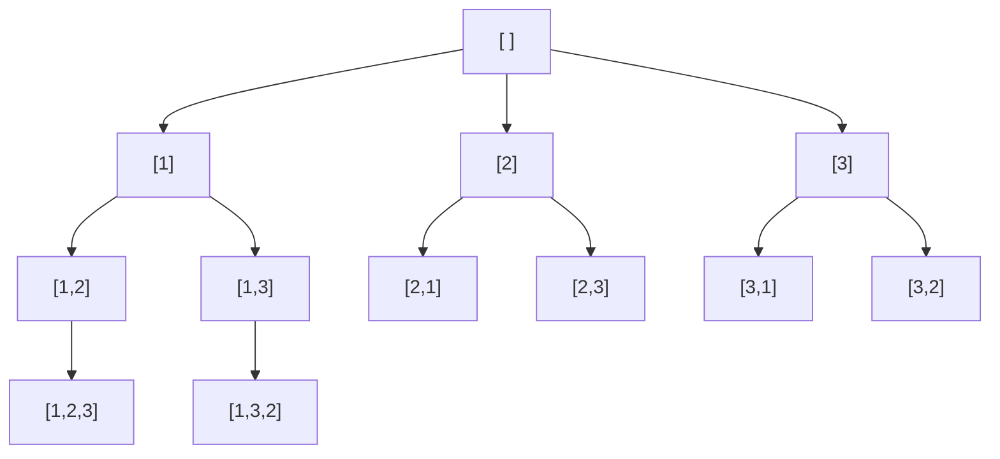
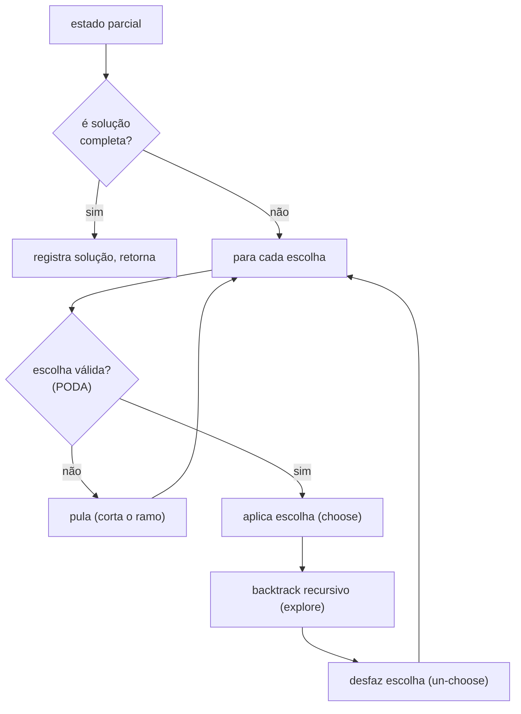
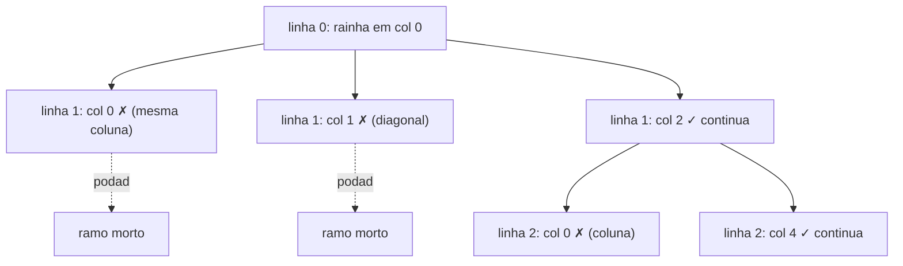

# Recursão e Backtracking: N-Queens, Permutações, Combinações e Sudoku

> **Bloco:** Algoritmos essenciais · **Nível:** Intermediário/Avançado · **Tempo de leitura:** ~29 min

## TL;DR

**Recursão** é uma função que se chama com uma instância menor do mesmo problema, descansando sobre dois pilares: o **caso base** (a instância trivial que para a recursão) e o **passo recursivo** (reduzir o problema em direção ao caso base). Sem caso base correto, há recursão infinita e **stack overflow**. **Backtracking** é uma estratégia de busca exaustiva sistemática construída sobre recursão: **constrói candidatos a solução incrementalmente** (uma escolha por vez), e quando uma escolha leva a um beco sem saída — viola uma restrição —, **desfaz a escolha (backtrack) e tenta outra**. O esqueleto universal é: *escolher → recursar → desfazer* (choose, explore, un-choose), percorrendo uma **árvore de decisão** onde cada nó é um estado parcial e cada aresta é uma escolha. O que separa backtracking de força bruta cega é a **poda (pruning)**: abandonar ramos inteiros assim que se torna provável (ou certo) que não levam a solução — em N-Queens, abandonar uma coluna assim que ela conflita com uma rainha já posta, em vez de completar o tabuleiro para descobrir que é inválido. Os problemas canônicos exercitam padrões distintos: **permutações** (ordem importa, sem repetição — escolha-se quem ainda não foi usado), **combinações/subconjuntos** (ordem não importa — avança-se um índice para nunca olhar para trás), **N-Queens** (posicionar com restrições de linha/coluna/diagonal, poda agressiva), e **Sudoku** (preencher célula a célula respeitando linha/coluna/bloco, backtrack ao chegar num impasse). A complexidade é tipicamente **exponencial ou fatorial** (O(n!), O(2ⁿ), O(b^d)), porque o espaço de soluções é exponencial — backtracking não muda a classe, mas a **poda reduz drasticamente a constante**, tornando viável o que a força bruta torna impraticável. A armadilha número um de entrevista é **recursão sem poda** (explorar candidatos inválidos até o fim) e **esquecer de desfazer o estado** (mutação compartilhada que vaza entre ramos).

## O problema que resolve

Há uma classe enorme de problemas — **combinatórios e de satisfação de restrições** — em que a resposta é "encontre todas (ou alguma, ou a melhor) configuração que satisfaz um conjunto de regras", e o espaço de configurações possíveis é **exponencial**. Não há fórmula fechada nem algoritmo polinomial conhecido para muitos deles; é preciso **explorar o espaço de possibilidades**. Exemplos: gerar todas as permutações de uma lista, todos os subconjuntos, posicionar N rainhas que não se atacam, resolver um Sudoku, colorir um grafo com K cores, encontrar caminhos num labirinto, particionar um conjunto.

A força bruta ingênua para esses problemas é: **gere todas as configurações completas e teste cada uma**. Para Sudoku, isso seria gerar todos os 9^(células vazias) preenchimentos e verificar quais são válidos — astronômico e completamente inviável. O problema dessa abordagem é que ela **desperdiça trabalho monumentalmente**: completa configurações inteiras antes de descobrir que uma escolha feita no segundo passo já as invalidou todas.

Backtracking resolve isso com duas ideias:

- **Construção incremental.** Em vez de gerar configurações completas, construa-as **uma escolha por vez**, e verifique a validade *a cada escolha*. Assim que uma escolha parcial viola uma restrição, você sabe **imediatamente** — antes de gastar esforço completando-a.
- **Poda de ramos inválidos (pruning).** Ao detectar que um estado parcial não pode levar a nenhuma solução válida, **abandone o ramo inteiro** da árvore de decisão. Isso elimina, de uma só vez, *todas* as configurações completas que teriam aquele prefixo inválido — frequentemente uma fração gigantesca do espaço.

A pergunta central: **"como explorar sistematicamente um espaço exponencial de configurações, construindo-as incrementalmente e abandonando ramos sem futuro o mais cedo possível, sem esquecer de nenhuma possibilidade válida nem repetir trabalho?"**. A resposta é o backtracking. E a recursão é o veículo natural para expressá-lo, porque a árvore de decisão é intrinsecamente recursiva: explorar um nó é explorar recursivamente seus filhos, e voltar (backtrack) é simplesmente retornar da chamada recursiva.

## O que é (definição aprofundada)

### Recursão: anatomia

Uma função **recursiva** resolve um problema reduzindo-o a instâncias menores de si mesmo. Tem dois componentes obrigatórios:

- **Caso(s) base:** a(s) instância(s) tão pequena(s) que a resposta é direta, sem mais recursão. É a condição de parada. Faltar um caso base (ou ter um inalcançável) causa **recursão infinita → stack overflow**.
- **Passo recursivo:** expressa a solução do problema em termos de uma ou mais chamadas a instâncias *menores*, garantindo **progresso** em direção ao caso base.

Cada chamada recursiva empilha um **stack frame** (parâmetros, variáveis locais, endereço de retorno). A **profundidade máxima da recursão** determina o uso de pilha — O(profundidade) de espaço. Linguagens com **tail-call optimization** (TCO) podem transformar recursão em cauda em iteração (O(1) pilha), mas muitas (Python, Java, JavaScript em geral) **não** otimizam, então recursão profunda demais estoura a pilha. Toda recursão pode ser convertida em iteração com uma pilha explícita.

A recursão brilha quando a estrutura do problema é **auto-similar**: árvores (percorrer = percorrer recursivamente as subárvores), divide-and-conquer (mergesort, quicksort), e — o foco aqui — exploração de árvores de decisão (backtracking).

### Backtracking: o esqueleto universal

**Backtracking** é busca em profundidade (DFS) sobre a **árvore de decisão** do problema, com retrocesso. O esqueleto que serve para *quase todos* os problemas é:

```
backtrack(estado_parcial):
  se estado_parcial é solução completa:
    registra/conta a solução
    retorna
  para cada escolha possível a partir do estado:
    se a escolha é válida (passa nas restrições):   // PODA
      aplica a escolha (modifica o estado)           // CHOOSE
      backtrack(estado com a escolha)                // EXPLORE
      desfaz a escolha (restaura o estado)           // UN-CHOOSE / BACKTRACK
```

Três peças definem qualquer instância: **(1) o que é uma solução completa** (condição do caso base), **(2) quais escolhas são possíveis em cada estado** (e como gerá-las sem repetição/omissão), e **(3) quais restrições podam escolhas inválidas** (a poda). A linha "desfaz a escolha" é o que dá nome à técnica e a fonte número um de bugs quando esquecida: se o estado é mutável e compartilhado entre ramos, *não* desfazer faz o lixo de um ramo vazar para o próximo.

- **Complexidade:** depende do problema, mas é tipicamente **exponencial (O(2ⁿ), O(b^d)) ou fatorial (O(n!))**, porque o número de folhas da árvore de decisão é exponencial. A poda **não muda a classe assintótica do pior caso**, mas reduz dramaticamente o número de nós visitados na prática (frequentemente de fatorial inviável para "roda em milissegundos").

### Permutações

**Permutações** de `n` elementos: todas as ordenações (a ordem importa, sem repetição). Há **n!** delas. Padrão de backtracking: a cada nível, escolha um elemento **ainda não usado**; um array `usado[]` (ou remover/recolocar do conjunto disponível) marca quem já está na permutação parcial.

```
permuta(parcial, usado):
  se tamanho(parcial) == n:
    registra(parcial); retorna
  para cada i de 0 a n-1:
    se não usado[i]:
      usado[i] = true; parcial.push(A[i])     // choose
      permuta(parcial, usado)                  // explore
      parcial.pop(); usado[i] = false          // un-choose
```

Complexidade O(n · n!) (n! folhas, O(n) para copiar cada). Variante com **duplicatas**: ordene e pule escolhas iguais à anterior no mesmo nível para evitar permutações repetidas.

### Combinações e Subconjuntos

**Combinações** (escolher `k` de `n`, ordem não importa) e **subconjuntos** (todos os 2ⁿ subconjuntos). A chave para *não* gerar a mesma combinação em ordens diferentes é avançar um **índice de início (start)**: a cada escolha, só considere elementos **a partir** do índice atual, nunca olhando para trás. Isso impõe uma ordem canônica e elimina duplicatas estruturalmente.

```
combina(start, parcial):
  registra(parcial)                  // todo subconjunto é válido (para subsets)
  para i de start a n-1:
    parcial.push(A[i])               // choose
    combina(i + 1, parcial)          // explore — i+1 evita olhar para trás
    parcial.pop()                    // un-choose
```

Subconjuntos: O(2ⁿ) (cada elemento entra ou não). Combinações de `k`: poda quando `tamanho(parcial) == k`.

### N-Queens

**N-Queens:** posicionar `N` rainhas num tabuleiro `N×N` de modo que nenhuma ataque outra (nenhuma compartilha linha, coluna ou diagonal). Padrão: posicione **uma rainha por linha** (já elimina conflitos de linha por construção), escolhendo a coluna; para cada coluna candidata, **pode** se ela já está ocupada ou está numa diagonal de uma rainha anterior. As duas diagonais se identificam por `linha + coluna` (diagonal ↘ constante) e `linha - coluna` (diagonal ↙ constante) — manter conjuntos de colunas e diagonais ocupadas torna a checagem de validade O(1).

```
resolve(linha, cols, diag1, diag2):
  se linha == N: registra(tabuleiro); retorna
  para col de 0 a N-1:
    se col não em cols e (linha+col) não em diag1 e (linha-col) não em diag2:   // PODA
      marca col, diag1, diag2
      resolve(linha+1, ...)
      desmarca col, diag1, diag2
```

A poda é o coração: sem ela, seriam N^N tentativas; com ela, o espaço cai a uma fração viável. N-Queens é o exemplo didático máximo de **poda agressiva**.

### Sudoku

**Sudoku solver:** preencher uma grade 9×9 de modo que cada linha, coluna e bloco 3×3 contenha 1-9 sem repetição. Padrão: encontre a próxima célula vazia; para cada dígito 1-9, **verifique** se ele é válido naquela linha/coluna/bloco (poda); se sim, coloque-o e recursе para a próxima célula vazia; se a recursão falha (nenhum dígito completa a grade), **desfaça** (limpe a célula) e tente o próximo dígito. Se nenhum dígito serve, retorna falso (backtrack para a célula anterior).

```
resolve_sudoku(grade):
  célula = próxima vazia em grade
  se não há vazia: retorna true     // resolvido
  para d de 1 a 9:
    se válido(grade, célula, d):     // checa linha/coluna/bloco — PODA
      grade[célula] = d
      se resolve_sudoku(grade): retorna true   // explore
      grade[célula] = vazio          // un-choose (backtrack)
  retorna false                      // nenhum dígito serviu
```

### Glossário rápido

- **Caso base:** condição de parada da recursão (resposta direta).
- **Passo recursivo:** redução do problema a instância menor.
- **Stack frame:** registro de uma chamada na pilha (parâmetros, locais).
- **Árvore de decisão:** árvore onde nós são estados parciais e arestas são escolhas.
- **Poda (pruning):** abandonar um ramo assim que ele não pode levar a solução.
- **Choose / explore / un-choose:** as três fases do esqueleto de backtracking.
- **Índice de start:** técnica para combinações que evita duplicatas (não olhar para trás).
- **Branching factor (b):** número de escolhas por nó; profundidade (d): níveis da árvore.

## Como funciona

O fluxo de qualquer backtracking é um **DFS** sobre a árvore de decisão:

1. **No nó atual** (estado parcial), verifique se é uma solução completa → registre e volte.
2. **Gere as escolhas** possíveis (filhos do nó na árvore).
3. **Para cada escolha**, aplique a **poda**: se a escolha leva a um estado inválido (ou que provavelmente não tem solução), **pule-a** — abandona-se aquele ramo inteiro.
4. Se a escolha passa na poda, **aplique-a** (modifique o estado), **recursе** (desça na árvore), e ao voltar, **desfaça** (restaure o estado para tentar a próxima escolha).

A **profundidade** da recursão é o número de decisões até uma solução completa (ex.: N para N-Queens, número de células vazias para Sudoku). O uso de pilha é O(profundidade). A **poda** opera "cortando galhos" da árvore: cada ramo cortado elimina todas as folhas (configurações completas) que estavam abaixo dele.

### O papel decisivo da poda

Vale dimensionar o efeito da poda, porque é o que torna backtracking viável. Em N-Queens com N=8, o espaço bruto (uma rainha por linha, qualquer coluna) é 8⁸ = ~16,7 milhões de configurações; testar cada uma completa é lento. Com poda (rejeitar uma coluna assim que conflita com uma rainha já posta), o backtracking visita apenas ~15 mil nós e encontra todas as 92 soluções em milissegundos. A poda não mudou a classe de complexidade do *pior caso* teórico, mas transformou um problema "lento" num "instantâneo" porque a esmagadora maioria dos ramos é cortada cedo. Quanto **mais cedo** e **mais agressiva** a poda, mais galhos morrem perto da raiz (onde cada galho representa mais folhas). Daí a regra: **verifique as restrições assim que possível**, não no fim.

### Ordenação de escolhas e heurísticas

Em problemas difíceis (Sudoku difícil, satisfação de restrições), a **ordem em que você tenta as escolhas** importa para a velocidade. A heurística **MRV (Minimum Remaining Values)** — sempre preencher a célula com **menos candidatos válidos** primeiro — poda mais cedo porque falha mais rápido nos ramos ruins. É a diferença entre um Sudoku solver que resolve grades "diabólicas" instantaneamente e um que trava. Backtracking + heurísticas de ordenação é a base dos *constraint satisfaction solvers* profissionais.

## Diagrama de fluxo

O primeiro diagrama mostra a árvore de decisão de permutações de `[1,2,3]`; o segundo, o ciclo choose/explore/un-choose; o terceiro, a poda no N-Queens.







## Exemplo prático / caso real

**Caso 1 — geração de configurações/combinações em sistemas reais.** Combinações e subconjuntos aparecem além do quadro-branco. Um sistema de **precificação de planos** que precisa avaliar todos os pacotes possíveis de add-ons (subconjuntos de features) usa geração de subconjuntos (2ⁿ). Um motor de **regras de desconto** que testa combinações de cupons aplicáveis, ou um sistema de **A/B testing** que gera combinações de variantes de feature flags, percorre o mesmo espaço combinatório. O ponto de arquitetura: **2ⁿ explode rápido** — para 30 features, são 1 bilhão de subconjuntos. Reconhecer que um requisito "avalie todas as combinações" é exponencial é crucial para *recusar* a abordagem ingênua e buscar poda, amostragem ou reformulação (programação inteira, heurísticas).

**Caso 2 — Sudoku solver e constraint satisfaction.** O Sudoku solver é o representante didático de uma classe industrial: **problemas de satisfação de restrições (CSP)**. Alocação de salas/horários (timetabling) numa universidade, escalonamento de turnos respeitando regras trabalhistas, configuração de produtos com dependências (um carro com opções incompatíveis), roteamento de veículos com janelas de tempo — todos são CSPs resolvidos por backtracking + poda + heurísticas (MRV, forward checking). Os *solvers* profissionais (OR-Tools do Google, SAT solvers) são backtracking sofisticado. Entender o esqueleto choose/explore/un-choose e a poda é entender o núcleo dessas ferramentas.

**Caso 3 — N-Queens como benchmark de poda.** N-Queens raramente aparece em produção, mas é o **exemplo canônico de entrevista** porque isola perfeitamente o conceito de poda: a versão sem poda (testar tabuleiros completos) é inviável já para N=12, enquanto a versão com poda (rejeitar colunas/diagonais conflitantes a cada linha) resolve N=20+ rapidamente. Em entrevista, a pergunta real por trás do N-Queens é "você sabe podar cedo e desfazer o estado corretamente?". O entrevistador observa se o candidato (a) posiciona uma rainha por linha (poda estrutural de conflitos de linha), (b) checa coluna/diagonais antes de recursar (poda), e (c) desfaz a marcação ao voltar (estado limpo entre ramos).

**Caso 4 — labirintos, parsing e árvores de jogo.** Encontrar um caminho num labirinto (DFS com backtrack ao bater em parede), gerar/validar expressões em parsers recursivos, e a busca em árvores de jogo (minimax explora a árvore de jogadas, com poda alfa-beta sendo uma poda de backtracking) são variações do mesmo padrão.

Exemplo de poda mal feita vs bem feita (pseudo, Sudoku):

```
// RUIM: preenche tudo, valida no fim — força bruta disfarçada
preenche_tudo_depois_valida(grade)   // 9^vazias configurações → inviável

// BOM: valida a cada célula (poda cedo), MRV opcional para podar mais cedo
resolve(grade):
  cel = célula vazia com MENOS candidatos válidos   // heurística MRV
  para d em candidatos_válidos(cel):                // já podado
    grade[cel] = d
    se resolve(grade): retorna true
    grade[cel] = vazio                              // desfaz
  retorna false
```

## Quando usar / Quando evitar

**Recursão:** use quando o problema é **auto-similar** (árvores, divide-and-conquer, exploração de espaços) e a expressão recursiva é mais clara que a iterativa. **Evite/cuidado** quando a profundidade pode ser grande em linguagens sem TCO (risco de stack overflow — converta para iteração com pilha explícita) ou quando há sobreposição massiva de subproblemas sem memoização (recursão ingênua de Fibonacci é O(2ⁿ) — use DP).

**Backtracking:** use para **problemas combinatórios e de satisfação de restrições** onde você precisa enumerar/encontrar configurações válidas num espaço exponencial e há **restrições que permitem poda** (permutações, combinações, N-Queens, Sudoku, coloração de grafo, labirintos, particionamento). **Evite** quando: existe algoritmo polinomial específico (não use backtracking para ordenar ou buscar); o espaço é tão grande e a poda tão fraca que mesmo podado é inviável (aí: programação dinâmica se há subestrutura ótima, programação inteira/heurísticas/aproximação, ou aceitar solução não-ótima); ou o problema pede *contagem* que tem fórmula fechada (use combinatória, não enumere).

## Anti-padrões e armadilhas comuns

- **Recursão sem caso base (ou inalcançável).** Recursão infinita → stack overflow. Garanta que todo caminho recursivo progride em direção a um caso base alcançável. Pegadinha clássica de entrevista.
- **Backtracking sem poda.** Explorar candidatos inválidos até o fim e só então rejeitá-los é força bruta disfarçada — frequentemente a diferença entre "roda em ms" e "trava". **Valide as restrições o mais cedo possível**, antes de recursar.
- **Esquecer de desfazer o estado (un-choose).** Se o estado é mutável e compartilhado (array, set, grade), não restaurá-lo após a recursão faz o lixo de um ramo vazar para o próximo, produzindo resultados errados sutis. O par choose/un-choose deve ser simétrico.
- **Passar estado mutável sem cuidado.** Registrar a referência da lista parcial (em vez de uma **cópia**) na lista de soluções faz todas as soluções apontarem para a mesma lista, que termina vazia. Copie ao registrar uma solução, ou desfaça corretamente.
- **Gerar combinações com duplicatas por não usar índice de start.** Sem o `start` (só considerar elementos a partir do índice atual), combinações são geradas em todas as ordens → duplicatas e explosão. O índice impõe a ordem canônica.
- **Confundir permutação (ordem importa) com combinação (ordem não importa).** Usar o padrão errado gera o conjunto errado de soluções. Permutação usa `usado[]`; combinação usa índice de `start`.
- **Profundidade de recursão estourando a pilha.** Em problemas com profundidade grande (ex.: backtracking sobre milhares de itens), a pilha estoura em linguagens sem TCO. Considere limite de recursão, iteração com pilha explícita, ou reformulação.
- **Não tratar duplicatas na entrada.** Permutações/combinações de `[1,1,2]` geram duplicatas se não ordenar e pular escolhas iguais à anterior no mesmo nível. A pegadinha "subsets II / permutations II".
- **Backtracking onde DP era a resposta.** Se há sobreposição de subproblemas e subestrutura ótima (ex.: "número de caminhos", "soma de subconjuntos contando"), backtracking exponencial pode ser substituído por DP polinomial. Reconhecer a diferença é maturidade algorítmica.
- **Continuar buscando após encontrar a (única) solução.** Em "encontre *uma* solução" (Sudoku tem solução única), não pare após achá-la desperdiça tempo explorando o resto. Propague um `retorna true` para abortar a busca.

## Relação com outros conceitos

- **Divide and Conquer:** ambos usam recursão, mas D&C divide em subproblemas **independentes** e combina (mergesort), enquanto backtracking explora uma árvore de decisão com **retrocesso**; não há "combinação" de resultados, há tentativa e desfazimento. Ver o estudo de Divide and Conquer.
- **Dynamic Programming:** quando a árvore de recursão de um backtracking tem **subproblemas sobrepostos** e busca otimização (não enumeração), DP (memoização) elimina a repetição, transformando exponencial em polinomial. Backtracking enumera *todas* as soluções; DP computa a *ótima/contagem* eficientemente. Ver o estudo de DP.
- **Grafos (DFS):** backtracking é literalmente DFS sobre a árvore de decisão (implícita); detecção de ciclo, coloração de grafo e busca de caminhos são backtracking sobre grafos.
- **Complexidade algorítmica:** backtracking é tipicamente O(b^d), O(n!) ou O(2ⁿ) — exponencial/fatorial; entender que esses problemas são intrinsecamente caros (muitos são NP-completos/NP-difíceis) calibra expectativas. Ver Complexidade.
- **Estruturas de dados (pilha):** a recursão usa a pilha de chamadas; backtracking iterativo usa pilha explícita. Sets/bitmasks aceleram a checagem de restrições (colunas/diagonais em N-Queens).
- **System Design — CSP/scheduling:** backtracking + heurísticas é o núcleo de timetabling, escalonamento, configuração de produtos e solvers (OR-Tools, SAT) — conecta com problemas de otimização do mundo real.

## Pontos para fixar (revisão)

- Recursão = **caso base** (para) + **passo recursivo** (progride); sem caso base alcançável → stack overflow.
- Backtracking = DFS sobre árvore de decisão com o esqueleto **choose → explore → un-choose**; constrói candidatos incrementalmente e desfaz becos sem saída.
- A **poda** é o que torna backtracking viável: valide restrições **o mais cedo possível** para cortar ramos perto da raiz (cada ramo cortado elimina muitas folhas).
- **Permutações** (ordem importa) usam `usado[]`; **combinações/subconjuntos** (ordem não importa) usam **índice de start** para não olhar para trás.
- **N-Queens** = poda agressiva (uma rainha por linha + checar coluna/diagonais via sets); **Sudoku** = preencher célula a célula com poda por linha/coluna/bloco (+ heurística MRV).
- Complexidade é **exponencial/fatorial** (O(n!), O(2ⁿ), O(b^d)) — a poda reduz a constante, não a classe.
- Armadilhas: recursão sem poda, esquecer de desfazer o estado, registrar referência em vez de cópia, e usar backtracking onde DP resolveria polinomialmente.

## Referências

- [Introduction to Backtracking — GeeksforGeeks](https://www.geeksforgeeks.org/dsa/introduction-to-backtracking-2/)
- [Backtracking Algorithm — GeeksforGeeks](https://www.geeksforgeeks.org/dsa/backtracking-algorithms/)
- [N Queen Problem (Backtracking) — GeeksforGeeks](https://www.geeksforgeeks.org/dsa/n-queen-problem-backtracking-3/)
- [Sudoku Solver (Backtracking) — GeeksforGeeks](https://www.geeksforgeeks.org/dsa/sudoku-backtracking-7/)
- [Backtracking in Action: Sudoku and N-Queens — Labuladong Algo Notes](https://labuladong.online/algo/en/practice-in-action/sudoku-nqueue/)
- [Backtracking Algorithm in Python — GeeksforGeeks](https://www.geeksforgeeks.org/dsa/backtracking-algorithm-in-python/)
- [Top Backtracking Algorithm Interview Questions — GeeksforGeeks](https://www.geeksforgeeks.org/dsa/top-20-backtracking-algorithm-interview-questions/)
