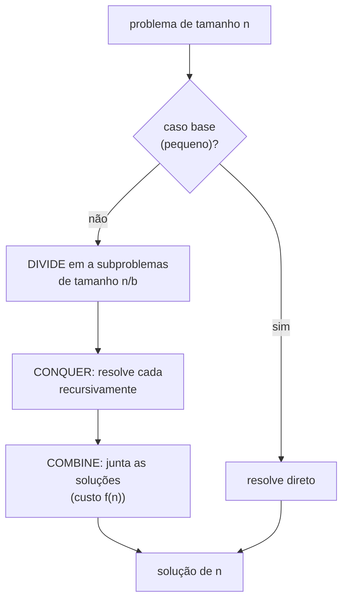
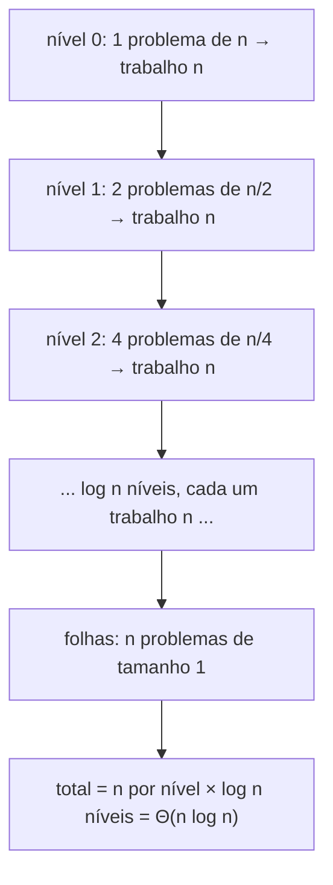
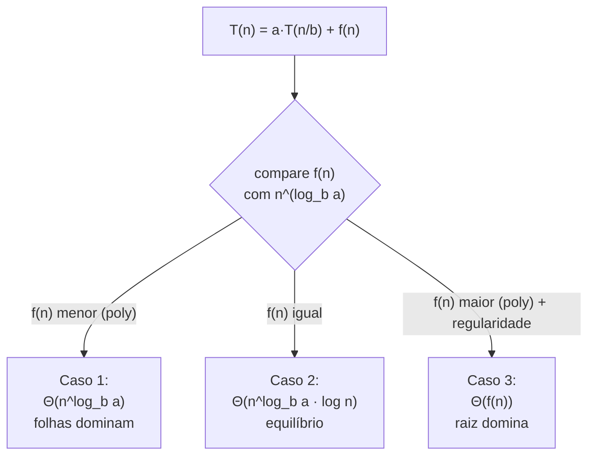

# Divide and Conquer (Paradigma e Relação com o Master Theorem)

> **Bloco:** Algoritmos essenciais · **Nível:** Intermediário/Avançado · **Tempo de leitura:** ~28 min

## TL;DR

**Divide and Conquer (dividir para conquistar)** é um dos paradigmas algorítmicos mais fundamentais: resolve um problema **(1) dividindo-o** em subproblemas menores e **independentes** do mesmo tipo, **(2) conquistando** cada subproblema recursivamente (até um caso base trivial) e **(3) combinando** as soluções dos subproblemas na solução do problema original. As três fases — *divide, conquer, combine* — definem o paradigma. O que torna D&C poderoso é a **independência** dos subproblemas (resolver um não afeta o outro), o que habilita recursão limpa e, crucialmente, **paralelização** (os subproblemas podem rodar em threads/máquinas diferentes). Os exemplos canônicos: **mergesort** e **quicksort** (dividem o array, ordenam metades, combinam por merge/partição), **busca binária** (divide em duas metades mas conquista só uma), **Karatsuba** (multiplicação de inteiros grandes em O(n^1.585) em vez de O(n²)), **Strassen** (multiplicação de matrizes em ~O(n^2.81) em vez de O(n³)), e **FFT** (transformada de Fourier em O(n log n)). A análise da eficiência de D&C é feita pela **recorrência** `T(n) = a·T(n/b) + f(n)`, onde `a` é o número de subproblemas, `n/b` o tamanho de cada um e `f(n)` o custo de dividir + combinar — e o **Master Theorem** é a "receita de bolo" que resolve essa recorrência diretamente, comparando `f(n)` com `n^(log_b a)` em três casos. A relação D&C ↔ Master Theorem é simbiótica: D&C *gera* recorrências dessa forma, e o Master Theorem as *resolve* sem expansão manual. A armadilha de entrevista é confundir D&C com qualquer recursão (backtracking e DP também recursam, mas com subproblemas *dependentes/sobrepostos*), e aplicar o Master Theorem fora de suas hipóteses (subproblemas de tamanhos diferentes, ou recorrências que caem na "lacuna" entre os casos).

## O problema que resolve

Muitos problemas têm uma estrutura **recursiva natural**: a solução do problema inteiro pode ser construída a partir das soluções de versões menores dele mesmo. Quando esses pedaços menores são **independentes** — resolver um não depende e não altera o outro —, surge uma oportunidade poderosa: em vez de atacar o problema grande de frente (frequentemente O(n²) ou pior), você o quebra recursivamente até pedaços triviais e monta a resposta de volta, e o custo total muitas vezes despenca para O(n log n) ou melhor.

O problema concreto que D&C ataca é **transformar algoritmos quadráticos (ou piores) em log-lineares (ou melhores)** explorando essa estrutura recursiva:

- **Ordenar.** A ordenação ingênua (insertion, selection) é O(n²). Dividindo o array, ordenando as metades e mesclando (mergesort), o custo cai para O(n log n) — porque cada um dos log n níveis de recursão faz apenas O(n) de trabalho de merge.
- **Multiplicar números/matrizes grandes.** Multiplicar dois inteiros de `n` dígitos pelo método escolar é O(n²); **Karatsuba** reduz para O(n^1.585) reorganizando o produto em 3 multiplicações recursivas em vez de 4. Multiplicar matrizes `n×n` é O(n³); **Strassen** reduz para ~O(n^2.81) com 7 multiplicações recursivas em vez de 8. Esses ganhos vêm exatamente de reduzir o número `a` de subproblemas na recorrência.
- **Paralelizar trabalho.** Como os subproblemas são **independentes**, eles podem ser resolvidos **simultaneamente** em núcleos/máquinas diferentes. D&C é o esqueleto natural de algoritmos paralelos (fork/join), de MapReduce e de processamento distribuído — você divide o dado, processa pedaços em paralelo e combina (reduce).

A pergunta que organiza tudo: **"o problema pode ser quebrado em subproblemas menores e independentes do mesmo tipo, cujas soluções combinam de volta na solução geral — e o custo de dividir + combinar é baixo o suficiente para que o ganho recursivo compense?"**. Se sim, D&C provavelmente melhora a complexidade. E a **análise** desse ganho — saber se a recorrência resultante dá O(n log n), O(n²) ou O(n^c) — é feita pelo Master Theorem, o que torna os dois conceitos inseparáveis para quem precisa raciocinar sobre eficiência.

## O que é (definição aprofundada)

### As três fases do paradigma

D&C é definido por três passos recursivos:

1. **Divide (dividir):** quebrar o problema em `a` subproblemas, cada um de tamanho ~`n/b`, do **mesmo tipo** do original. A divisão deve produzir subproblemas **independentes** (a chave que distingue D&C de DP).
2. **Conquer (conquistar):** resolver cada subproblema **recursivamente**. Quando o subproblema é pequeno o bastante (caso base — ex.: array de 1 elemento), resolve-se diretamente, sem mais recursão.
3. **Combine (combinar):** juntar as soluções dos subproblemas na solução do problema original. O custo dessa combinação (mais o da divisão) é o `f(n)` da recorrência e frequentemente domina ou não a complexidade total.

O **caso base** é tão essencial quanto em qualquer recursão: sem ele, recursão infinita. O "tamanho do trabalho real" do D&C está distribuído entre a divisão, o caso base e a combinação — e onde esse peso recai (no topo da árvore de recursão, nas folhas, ou uniformemente) determina a complexidade, como o Master Theorem formaliza.

### A recorrência canônica

A eficiência de um algoritmo D&C "balanceado" (subproblemas de tamanho igual) é capturada pela recorrência:

```
T(n) = a · T(n/b) + f(n)
```

- **`a`** = número de subproblemas gerados (≥ 1).
- **`b`** = fator pelo qual o tamanho diminui (cada subproblema tem tamanho `n/b`, `b > 1`).
- **`f(n)`** = custo do trabalho **fora** das chamadas recursivas: dividir + combinar.

Exemplos:

- **Mergesort:** `T(n) = 2·T(n/2) + O(n)` — divide em 2 (`a=2`), metade do tamanho (`b=2`), merge custa O(n) (`f(n)=n`).
- **Busca binária:** `T(n) = 1·T(n/2) + O(1)` — divide em 2 mas conquista **só 1** (`a=1`), `f(n)=O(1)`.
- **Quicksort (médio):** `T(n) = 2·T(n/2) + O(n)` — partição custa O(n); pior caso degenera para `T(n) = T(n-1) + O(n) = O(n²)`.
- **Karatsuba:** `T(n) = 3·T(n/2) + O(n)` — 3 multiplicações recursivas.
- **Strassen:** `T(n) = 7·T(n/2) + O(n²)` — 7 multiplicações recursivas de submatrizes.
- **Multiplicação ingênua de matrizes (recursiva):** `T(n) = 8·T(n/2) + O(n²)` = O(n³).

### O Master Theorem (a receita)

O **Master Theorem** resolve recorrências da forma `T(n) = a·T(n/b) + f(n)` (com `a ≥ 1`, `b > 1`) comparando o crescimento de `f(n)` com o **expoente crítico `n^(log_b a)`** — o trabalho acumulado nas folhas da árvore de recursão. Há três casos:

- **Caso 1 (folhas dominam):** se `f(n) = O(n^(log_b a − ε))` para algum `ε > 0` (ou seja, `f(n)` cresce *mais devagar* que `n^(log_b a)`), então **`T(n) = Θ(n^(log_b a))`**. O custo é dominado pelo trabalho nas folhas. *Ex.: busca binária — `a=1, b=2`, `log_b a = 0`, `n^0 = 1`; `f(n)=O(1)`... cai no caso de fronteira (ver caso 2 com k=0).*
- **Caso 2 (equilíbrio):** se `f(n) = Θ(n^(log_b a))` (cresce *na mesma taxa* que o expoente crítico), então **`T(n) = Θ(n^(log_b a) · log n)`**. O trabalho é uniforme em todos os níveis, e há log n níveis. *Ex.: mergesort — `a=2, b=2`, `log_b a = 1`, `n^1 = n`; `f(n)=Θ(n)` → `T(n) = Θ(n log n)`.*
- **Caso 3 (raiz domina):** se `f(n) = Ω(n^(log_b a + ε))` para algum `ε > 0` (cresce *mais rápido*) **e** vale a condição de regularidade `a·f(n/b) ≤ c·f(n)` para `c < 1`, então **`T(n) = Θ(f(n))`**. O custo é dominado pela divisão/combinação no topo. *Ex.: `T(n) = 2T(n/2) + n²` — `log_b a = 1`, `f(n)=n²` cresce mais rápido → `T(n) = Θ(n²)`.*

Aplicando aos exemplos:

- **Mergesort/Quicksort médio:** caso 2 → **Θ(n log n)**.
- **Busca binária:** `a=1, b=2, log_b a = 0`, `f(n)=Θ(n^0)=Θ(1)` → caso 2 com expoente 0 → **Θ(log n)**.
- **Karatsuba:** `a=3, b=2, log_2 3 ≈ 1.585`, `f(n)=O(n)` cresce mais devagar que `n^1.585` → caso 1 → **Θ(n^1.585)**.
- **Strassen:** `a=7, b=2, log_2 7 ≈ 2.807`, `f(n)=O(n²)` cresce mais devagar que `n^2.807` → caso 1 → **Θ(n^2.807)**.
- **Matriz ingênua:** `a=8, b=2, log_2 8 = 3`, `f(n)=O(n²)` < `n³` → caso 1 → **Θ(n³)**.

A genialidade: o número `a` de subproblemas entra como **expoente** (`log_b a`), então reduzir `a` — de 8 para 7 em Strassen, de 4 para 3 em Karatsuba — muda o expoente da complexidade. É por isso que essas reorganizações algébricas que "economizam uma multiplicação" produzem ganhos assintóticos.

### Limites do Master Theorem

O Master Theorem não é universal. Ele **não se aplica** quando:

- **`f(n)` cai na "lacuna" entre os casos** — cresce mais rápido que `n^(log_b a)` mas não *polinomialmente* mais rápido (ex.: `f(n) = n^(log_b a) · log n`), ou viola a regularidade no caso 3. Recorrências como `T(n) = 2T(n/2) + n log n` precisam da versão estendida (Akra-Bazzi) ou da árvore de recursão.
- **Subproblemas têm tamanhos diferentes** (`T(n) = T(n/3) + T(2n/3) + n`) — exige Akra-Bazzi ou árvore de recursão.
- **`a` ou `b` não são constantes**, ou a recorrência subtrai em vez de dividir (`T(n) = T(n-1) + n`, típica de algoritmos não-balanceados como quicksort no pior caso) — resolve-se diretamente (essa dá O(n²)).

Para esses casos, as ferramentas são: **árvore de recursão** (somar o trabalho nível a nível), **método da substituição** (chutar e provar por indução) e o **teorema de Akra-Bazzi** (generalização que lida com tamanhos desiguais).

### Glossário rápido

- **Divide/Conquer/Combine:** as três fases do paradigma.
- **Subproblemas independentes:** não compartilham estado nem dependem das soluções uns dos outros (distingue D&C de DP).
- **Recorrência:** equação `T(n) = a·T(n/b) + f(n)` que descreve o custo.
- **Expoente crítico:** `n^(log_b a)`, o trabalho acumulado nas folhas da árvore de recursão.
- **Master Theorem:** receita de 3 casos que resolve a recorrência comparando `f(n)` com `n^(log_b a)`.
- **Árvore de recursão:** visualização do trabalho por nível, usada quando o Master Theorem não se aplica.
- **Akra-Bazzi:** generalização do Master Theorem para subproblemas de tamanhos diferentes.

## Como funciona

O esqueleto genérico de qualquer algoritmo D&C:

```
divide_conquer(problema):
  se problema é pequeno (caso base):
    resolve diretamente; retorna
  subproblemas = divide(problema)           // fase DIVIDE
  solucoes = []
  para cada sub em subproblemas:
    solucoes.add(divide_conquer(sub))        // fase CONQUER (recursão)
  retorna combina(solucoes)                  // fase COMBINE
```

A análise segue a **árvore de recursão**: a raiz é o problema de tamanho `n`, com `a` filhos de tamanho `n/b`, cada um com `a` filhos de tamanho `n/b²`, e assim por diante, até as folhas (caso base). Há **log_b n níveis**. Em cada nível `i`, há `a^i` subproblemas, cada um de tamanho `n/b^i`, fazendo `f(n/b^i)` de trabalho. O custo total é a soma do trabalho de todos os níveis:

```
T(n) = soma sobre os níveis i=0..log_b(n) de:  a^i · f(n/b^i)
```

O Master Theorem é, no fundo, a classificação de qual extremo dessa soma domina:

- se o trabalho **cresce de cima para baixo** (folhas dominam) → caso 1 (Θ do nível das folhas, `n^(log_b a)`);
- se é **uniforme em todos os níveis** → caso 2 (trabalho por nível × número de níveis, `n^(log_b a) log n`);
- se **decresce de cima para baixo** (raiz domina) → caso 3 (Θ do trabalho na raiz, `f(n)`).

Essa visualização da árvore é a melhor forma de *entender* (não só decorar) o Master Theorem, e é o que MIT OCW e CLRS usam para derivá-lo.

### D&C vs recursão genérica vs DP vs backtracking

Vale cravar a distinção, porque é pegadinha de entrevista. Todos os quatro usam recursão, mas:

- **Divide and Conquer:** subproblemas **independentes**, sem sobreposição; cada um é resolvido uma vez; há fase de **combinação**. (mergesort, Karatsuba)
- **Dynamic Programming:** subproblemas **sobrepostos** (o mesmo subproblema reaparece muitas vezes); memoiza-se/tabula-se para resolver cada um **uma única vez**. Se você aplicasse D&C ingênuo a um problema com subproblemas sobrepostos (ex.: Fibonacci recursivo), recalcularia exponencialmente. (Fibonacci, mochila, edit distance)
- **Backtracking:** explora uma **árvore de decisão** com retrocesso; não "combina" soluções, **testa e desfaz** escolhas; subproblemas dependentes do caminho de escolhas. (N-Queens, Sudoku)
- **Recursão genérica:** qualquer função que se chama; D&C/DP/backtracking são *padrões* específicos de recursão.

A pergunta-teste: *os subproblemas se sobrepõem?* Não → D&C. Sim, e busco ótimo/contagem → DP. *Exploro escolhas com restrições e desfaço?* → backtracking.

## Diagrama de fluxo

O primeiro diagrama mostra as três fases do paradigma; o segundo, a árvore de recursão do mergesort com o trabalho por nível; o terceiro, a árvore de decisão dos três casos do Master Theorem.







## Exemplo prático / caso real

**Caso 1 — por que mergesort é O(n log n) e a intuição do Master Theorem.** O caso mais didático. Quando você ordena 1 milhão de registros com mergesort, a recorrência é `T(n) = 2T(n/2) + O(n)`: divide em duas metades (custo O(1)), ordena cada uma recursivamente, e mescla (custo O(n)). A árvore de recursão tem log₂(1M) ≈ 20 níveis; em **cada** nível, o total de trabalho de merge é O(n) (os merges de um nível, somados, tocam todos os n elementos uma vez). Logo: O(n) por nível × 20 níveis ≈ 20 milhões de operações — exatamente o caso 2 do Master Theorem (`f(n)=Θ(n)=n^(log_2 2)`). Entender isso pela árvore (não por decoreba) é o que permite a um arquiteto *estimar* a complexidade de qualquer algoritmo recursivo novo que encontre.

**Caso 2 — Karatsuba e Strassen: economizar uma multiplicação muda o expoente.** Estes são os exemplos que demonstram o impacto de reduzir `a`. A multiplicação escolar de dois números de `n` dígitos é O(n²). Karatsuba observou que o produto pode ser computado com **3 multiplicações recursivas** de números pela metade do tamanho (em vez das 4 ingênuas), trocando a quarta por somas/subtrações baratas. Recorrência: `T(n) = 3T(n/2) + O(n)` → caso 1 → **O(n^1.585)**. Para números de milhares de dígitos (criptografia RSA, aritmética de precisão arbitrária em bibliotecas como GMP), essa diferença é enorme. Analogamente, **Strassen** multiplica matrizes `n×n` com **7 multiplicações de submatrizes** em vez de 8 → `T(n) = 7T(n/2) + O(n²)` → **O(n^2.807)**, batendo o O(n³) ingênuo. A lição de arquitetura: o ganho não veio de "otimizar o código", veio de **mudar a recorrência** (reduzir `a`), e o Master Theorem prova o ganho. (Caveat: ambos têm constantes altas e só compensam para entradas grandes — Strassen perde para o ingênuo em matrizes pequenas e acumula erro de ponto flutuante.)

**Caso 3 — D&C como esqueleto de processamento distribuído (MapReduce/Spark).** O padrão D&C é a alma do processamento de Big Data. Em **MapReduce**, o dataset gigante é **dividido** em blocos distribuídos por máquinas; cada bloco é processado **independentemente** em paralelo (map = conquer); os resultados parciais são **combinados** (reduce = combine). Como os blocos são independentes, escalam horizontalmente — adicione máquinas, divida em mais pedaços. Frameworks como Spark, e o próprio modelo fork/join de paralelismo (Java `ForkJoinPool`, paralelismo de Rust/Go), são D&C explícito. Ordenação distribuída (terasort) é mergesort distribuído: ordena blocos localmente, faz merge dos blocos. O insight que conecta algoritmos e System Design: a **independência dos subproblemas** que torna D&C analiticamente limpo é *exatamente* a propriedade que o torna **paralelizável e distribuível** — não é coincidência, é a mesma característica.

Pseudocódigo de Karatsuba (ilustrando a redução de 4 para 3 multiplicações):

```
karatsuba(x, y):                       // números de n dígitos
  se n pequeno: retorna x * y          // caso base
  divide x = a·10^(n/2) + b
  divide y = c·10^(n/2) + d
  ac = karatsuba(a, c)                 // 1ª multiplicação recursiva
  bd = karatsuba(b, d)                 // 2ª
  ad_bc = karatsuba(a+b, c+d) - ac - bd  // 3ª (a sacada: economiza a 4ª)
  retorna ac·10^n + ad_bc·10^(n/2) + bd
// T(n) = 3 T(n/2) + O(n) → O(n^1.585) pelo Master Theorem
```

## Quando usar / Quando evitar

**Divide and Conquer:** use quando o problema (1) tem **estrutura recursiva** (decompõe-se em subproblemas do mesmo tipo), (2) os subproblemas são **independentes** (sem sobreposição), e (3) o custo de **dividir + combinar é baixo** o suficiente para que a recursão compense. Excelente para ordenação, busca, multiplicação de números/matrizes grandes, e qualquer trabalho **paralelizável/distribuível** (fork/join, MapReduce). **Evite** quando: os subproblemas **se sobrepõem** (use DP com memoização — D&C ingênuo recalcula exponencialmente, como Fibonacci); o custo de combinação é tão alto (ex.: O(n²)) que anula o ganho (caso 3 do Master Theorem dá complexidade ruim); ou as entradas são pequenas e o overhead de recursão/divisão domina (por isso híbridos como introsort caem para insertion sort no pequeno).

**Master Theorem:** use para resolver rapidamente recorrências **balanceadas** `T(n) = a·T(n/b) + f(n)` com `a, b` constantes. **Evite/não aplique** quando: subproblemas têm **tamanhos diferentes** (use Akra-Bazzi ou árvore de recursão); `f(n)` cai na **lacuna entre os casos** (cresce não-polinomialmente diferente do expoente crítico); a recorrência **subtrai** em vez de dividir (`T(n)=T(n-1)+f(n)` — resolva direto); ou a condição de regularidade do caso 3 falha. Nesses casos, recorra a árvore de recursão, substituição ou Akra-Bazzi.

## Anti-padrões e armadilhas comuns

- **Confundir D&C com qualquer recursão.** D&C tem subproblemas **independentes** e fase de **combinação**. Backtracking (testa/desfaz, sem combinação) e DP (subproblemas sobrepostos) recursam mas **não** são D&C. Em entrevista, classificar mal o paradigma sinaliza confusão conceitual.
- **Aplicar D&C a subproblemas sobrepostos (sem memoização).** O exemplo arquetípico: Fibonacci recursivo `fib(n)=fib(n-1)+fib(n-2)` recalcula os mesmos valores exponencialmente → O(2ⁿ). Isso é subproblema **sobreposto** → o lugar é DP (memoização → O(n)), não D&C puro.
- **Master Theorem fora das hipóteses.** Aplicá-lo a recorrências com subproblemas de tamanhos diferentes, com `f(n)` na lacuna, ou que subtraem (`T(n-1)`) dá resposta errada. Verifique a forma `a·T(n/b)+f(n)` com `a,b` constantes antes de usar.
- **Esquecer a condição de regularidade no caso 3.** O caso 3 exige `a·f(n/b) ≤ c·f(n)` para `c<1`; pulá-la pode classificar errado. Recorrências patológicas violam a regularidade mesmo com `f(n)` polinomialmente maior.
- **Custo de combinação subestimado.** Se a fase combine é cara (ex.: O(n²)), o D&C pode ser *pior* que a alternativa. Avalie `f(n)` honestamente — é o que o Master Theorem usa para decidir o caso.
- **Caso base ausente ou tarde demais.** Sem caso base, recursão infinita. Com caso base só em tamanho 1, o overhead de recursão para entradas pequenas domina — por isso implementações reais (mergesort, introsort) trocam para algoritmo simples (insertion sort) abaixo de um limiar.
- **Ignorar a memória extra do combine.** Mergesort precisa de O(n) extra para o merge; Strassen precisa de submatrizes temporárias. D&C frequentemente troca tempo por espaço — não ignore o custo de memória.
- **Assumir que D&C teórico ganha sempre.** Strassen e Karatsuba só batem o método ingênuo para entradas **grandes** (constantes altas); para matrizes/números pequenos, o ingênuo é mais rápido e mais preciso (Strassen acumula erro de ponto flutuante). Complexidade assintótica não conta a história das constantes.
- **Não reconhecer a oportunidade de paralelizar.** A independência dos subproblemas do D&C é desperdiçada se você o roda estritamente sequencial quando havia núcleos ociosos. Fork/join existe para isso.
- **Errar `log_b a`.** Confundir `log_b a` (expoente crítico) — ex.: para `a=2,b=2` é `log_2 2 = 1`, não 2 — leva a classificar o caso errado. Calcule com cuidado.

## Relação com outros conceitos

- **Complexidade algorítmica e Master Theorem:** D&C *gera* as recorrências `a·T(n/b)+f(n)`, e o Master Theorem (mais árvore de recursão, substituição, Akra-Bazzi) as *resolve*. São o par "fonte e ferramenta" da análise assintótica. Ver o estudo de Complexidade.
- **Sorting:** mergesort e quicksort são os exemplos canônicos de D&C; entender suas recorrências (`2T(n/2)+O(n)` → Θ(n log n)) é entender D&C na prática. Ver o estudo de sorting.
- **Searching (busca binária):** o D&C "degenerado" que conquista **uma só** metade (`a=1`) → O(log n); mostra o efeito de `a` na complexidade. Ver o estudo de searching.
- **Dynamic Programming:** a fronteira conceitual de D&C — DP é "D&C com subproblemas sobrepostos + memoização". Distinguir os dois é maturidade algorítmica. Ver o estudo de DP.
- **Backtracking/Recursão:** todos usam recursão; D&C combina soluções independentes, backtracking testa/desfaz. Ver o estudo de recursão e backtracking.
- **System Design — processamento distribuído:** MapReduce, Spark, fork/join e ordenação distribuída são D&C aplicado: dividir o dado, processar pedaços independentes em paralelo, combinar. A independência dos subproblemas é o que habilita a escala horizontal.

## Pontos para fixar (revisão)

- D&C = **divide → conquer → combine**, com subproblemas **independentes** (a propriedade que o distingue de DP e que o torna paralelizável).
- A eficiência é descrita pela recorrência **`T(n) = a·T(n/b) + f(n)`** (`a` subproblemas, tamanho `n/b`, custo `f(n)` de dividir+combinar).
- O **Master Theorem** resolve essa recorrência comparando `f(n)` com `n^(log_b a)`: caso 1 (folhas dominam → `Θ(n^log_b a)`), caso 2 (equilíbrio → `Θ(n^log_b a · log n)`), caso 3 (raiz domina → `Θ(f(n))`).
- Reduzir `a` muda o **expoente** da complexidade: Karatsuba (4→3 mults → O(n^1.585)), Strassen (8→7 → O(n^2.807)).
- Mergesort/quicksort médio = caso 2 → **Θ(n log n)**; busca binária = `a=1` → **Θ(log n)**.
- O Master Theorem **não** se aplica a subproblemas de tamanhos diferentes, recorrências que subtraem, ou `f(n)` na lacuna — use árvore de recursão / substituição / Akra-Bazzi.
- A **independência** dos subproblemas é o que torna D&C analiticamente limpo **e** distribuível (MapReduce, fork/join) — não confunda D&C com DP (sobreposto) nem backtracking (testa/desfaz).
- Ganhos assintóticos (Strassen/Karatsuba) só compensam para entradas **grandes**; constantes altas e precisão importam na prática.

## Referências

- [Divide and Conquer Algorithm — GeeksforGeeks](https://www.geeksforgeeks.org/dsa/divide-and-conquer/)
- [Strassen's Matrix Multiplication — GeeksforGeeks](https://www.geeksforgeeks.org/dsa/strassens-matrix-multiplication/)
- [Recitation 1: Divide & Conquer, Master Theorem, Strassen's Algorithm — MIT OpenCourseWare 6.046J](https://ocw.mit.edu/courses/6-046j-design-and-analysis-of-algorithms-spring-2015/resources/recitation-1-divide-conquer-smarter-interval-scheduling-master-theorem-strassens-algorithm/)
- [Lecture 3: Divide-and-Conquer: Strassen, Fibonacci, Polynomial Multiplication — MIT OpenCourseWare 6.046J](https://ocw.mit.edu/courses/electrical-engineering-and-computer-science/6-046j-introduction-to-algorithms-sma-5503-fall-2005/video-lectures/lecture-3-divide-and-conquer-strassen-fibonacci-polynomial-multiplication)
- [Recurrences (capítulo) — MIT 6.042J Mathematics for Computer Science](https://ocw.mit.edu/courses/6-042j-mathematics-for-computer-science-fall-2010/18b5495f7408055f9679e3afebb108ab_MIT6_042JF10_chap10.pdf)
- [Divide and Conquer and Analysis of Recurrences — ICS 311 (University of Hawaii)](https://www2.hawaii.edu/~nodari/teaching/s17/Notes/Topic-07.html)
- [Divide and Conquer Algorithms (slides) — University of Oxford](https://www.cs.ox.ac.uk/files/13284/divide-and-conquer.pdf)
