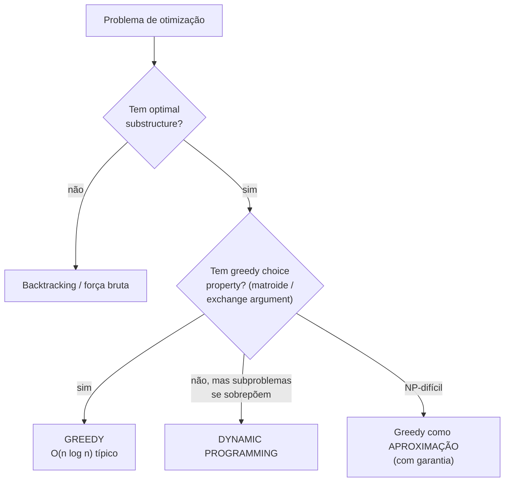
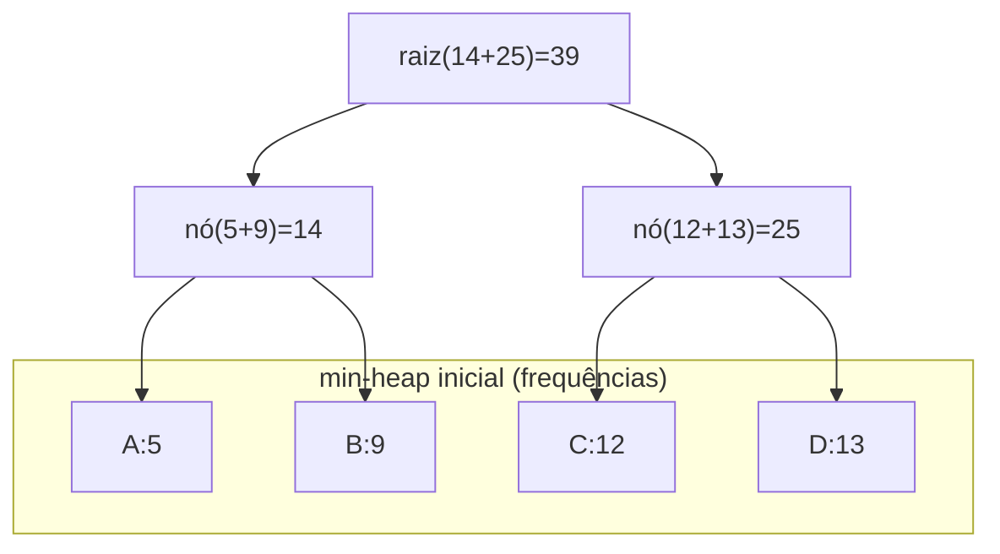
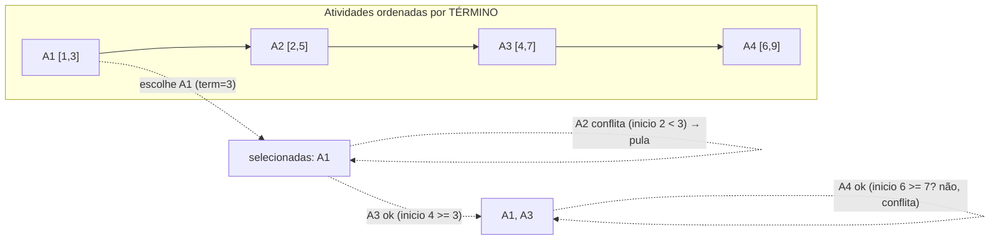

# Greedy Algorithms: Quando Funcionam (Matroides / Exchange Argument), Quando Falham, e os Clássicos (Huffman, Interval Scheduling, Troco)

> **Bloco:** Algoritmos essenciais · **Nível:** Intermediário/Avançado · **Tempo de leitura:** ~30 min

## TL;DR

Um **algoritmo guloso (greedy)** constrói a solução **um passo de cada vez**, sempre escolhendo a opção que **parece melhor localmente** naquele momento (a *escolha gulosa*), sem nunca voltar atrás. É a estratégia mais simples e barata que existe — tipicamente uma ordenação seguida de uma varredura linear, daí complexidades como `O(n log n)`. O problema é que **"localmente ótimo" raramente coincide com "globalmente ótimo"**. Greedy só produz a resposta correta quando o problema tem uma estrutura matemática especial, e a maior armadilha de entrevista é aplicá-lo onde ele *parece* funcionar nos exemplos pequenos mas falha em casos maiores (o exemplo canônico é o problema do troco com moedas arbitrárias). Há duas técnicas formais para *provar* que um greedy está correto: o **exchange argument** (mostrar que qualquer solução ótima pode ser transformada, troca a troca, na solução gulosa sem piorar — logo a gulosa também é ótima) e a **teoria de matroides** (se o problema é um matroide, o greedy é *provadamente* ótimo). Os dois pré-requisitos estruturais que costumam ser citados são **greedy choice property** (existe uma escolha gulosa que faz parte de *alguma* solução ótima) e **optimal substructure** (a solução ótima contém soluções ótimas dos subproblemas). Quando o problema *não* tem essa estrutura, a ferramenta correta é **programação dinâmica** ou **backtracking**, não greedy. Os três clássicos para memorizar: **interval scheduling** (escolher o maior número de atividades não-conflitantes — greedy por *horário de término* é ótimo, com prova por exchange argument), **Huffman coding** (código de prefixo ótimo construído com uma min-heap, mesclando sempre as duas menores frequências) e **coin change / troco** (greedy é ótimo *apenas* para sistemas de moedas "canônicos" como o BRL; para conjuntos arbitrários, exige DP).

## O problema que resolve

Muitos problemas de otimização pedem: dentre todas as soluções viáveis, encontre a que maximiza (ou minimiza) alguma quantidade. O espaço de soluções é tipicamente **exponencial** — escolher um subconjunto de `n` itens dá `2^n` possibilidades, ordenar dá `n!`. Avaliar todas (força bruta) é inviável já para `n` modesto.

A pergunta central que o paradigma guloso ataca é: **"posso construir a solução ótima fazendo, a cada passo, a escolha que parece melhor *agora*, sem nunca reconsiderar?"** Se a resposta for sim, ganhamos um algoritmo dramaticamente mais simples e rápido que DP ou backtracking — geralmente `O(n log n)` (dominado pela ordenação) ou até `O(n)`.

A tentação é enorme porque a estratégia gulosa é **intuitiva** e quase sempre **fácil de codificar**. O perigo, igualmente enorme, é que ela **frequentemente está errada de um jeito sutil**: passa em todos os exemplos pequenos que você testa à mão e só falha num caso particular que você não pensou. Por isso, o problema de fundo deste documento não é *como* escrever um greedy (é trivial), mas **como saber se o greedy está correto** para aquele problema específico — e essa é exatamente a pergunta que separa quem decora algoritmos de quem entende o paradigma.

Há um espectro de situações:

- **Greedy é ótimo e provável:** o problema é um matroide ou tem greedy choice + optimal substructure demonstráveis (interval scheduling, MST via Kruskal/Prim, Huffman, Dijkstra com pesos não-negativos). Aqui greedy é a *ferramenta certa* — mais rápido que qualquer alternativa.
- **Greedy é uma heurística sem garantia, mas útil:** o ótimo exato é NP-difícil e greedy dá uma aproximação razoável e barata (set cover, bin packing, vertex cover por aproximação). Aqui greedy é aceito *conscientemente* como aproximação.
- **Greedy parece funcionar mas está errado:** o caso perigoso (troco com moedas arbitrárias, 0/1 knapsack, LCS). Aqui usar greedy é um *bug*.

Distinguir esses três casos é a habilidade que importa.

## O que é (definição aprofundada)

Um **algoritmo guloso** resolve um problema de otimização tomando uma sequência de decisões, onde cada decisão:

1. é a **localmente ótima** (a melhor de acordo com algum critério míope, avaliado apenas com a informação do momento);
2. é **irrevogável** (uma vez feita, nunca é desfeita — não há backtracking);
3. reduz o problema a um **subproblema menor** do mesmo tipo.

A esperança é que essa sequência de escolhas localmente ótimas produza um **ótimo global**. Essa esperança só se realiza sob condições estruturais específicas.

### As duas propriedades necessárias (CLRS)

O CLRS (Cormen, Leiserson, Rivest, Stein) formaliza dois ingredientes que, juntos, costumam habilitar a prova de correção de um greedy:

- **Greedy choice property (propriedade da escolha gulosa):** existe um ótimo global que *contém* a escolha gulosa do primeiro passo. Ou seja, você nunca se prejudica fazendo a escolha gulosa — sempre há uma solução ótima compatível com ela. Isso é o que diferencia greedy de DP: em DP você considera *todas* as escolhas no passo atual e resolve os subproblemas de cada uma; em greedy você compromete-se com *uma* (a gulosa) sem resolver os subproblemas.
- **Optimal substructure (subestrutura ótima):** a solução ótima do problema contém em si soluções ótimas dos subproblemas. (Esta propriedade é compartilhada com DP.)

Atenção à diferença com DP: greedy faz a escolha *antes* de resolver o subproblema; DP resolve os subproblemas *antes* de escolher. Greedy é "top-down e comprometido"; DP é "considera tudo".

### Exchange argument (argumento de troca)

A técnica de prova mais usada na prática. Para provar que a solução gulosa `G` é ótima:

1. Suponha uma solução ótima qualquer `O`, possivelmente diferente de `G`.
2. Mostre que você pode **transformar `O` em `G` por uma sequência de trocas**, onde cada troca substitui um elemento de `O` por um elemento da escolha gulosa **sem piorar** o valor da solução (e sem torná-la inviável).
3. Como cada troca preserva a otimalidade e ao final chegamos em `G`, conclui-se que `G` é tão boa quanto `O` — logo, `G` é ótima.

O exchange argument é o "canivete suíço" da prova de greedy. Ele aparece, por exemplo, na prova de que ordenar por horário de término é ótimo no interval scheduling (qualquer solução ótima pode ter sua primeira atividade trocada pela de menor término sem reduzir o total).

### Matroides: a teoria por trás de "quando greedy é ótimo"

Para uma classe ampla de problemas, há um arcabouço que *garante* a otimalidade do greedy: a **teoria de matroides**. Um **matroide** é um par `(S, I)` onde `S` é um conjunto finito e `I` (o conjunto de "subconjuntos independentes") é uma família de subconjuntos de `S` satisfazendo:

- **Hereditariedade:** se `B ∈ I` e `A ⊆ B`, então `A ∈ I` (todo subconjunto de um independente é independente).
- **Propriedade de troca (exchange property):** se `A, B ∈ I` e `|A| < |B|`, então existe `x ∈ B \ A` tal que `A ∪ {x} ∈ I` (sempre dá para "crescer" o conjunto menor pegando um elemento do maior).

O **teorema central**: para qualquer matroide com pesos nos elementos, o **algoritmo guloso** (ordene os elementos por peso e adicione cada um se ele mantém a independência) produz um conjunto independente de **peso máximo** — provadamente ótimo. O exemplo arquetípico é o **matroide gráfico**: os conjuntos independentes são as florestas (conjuntos de arestas sem ciclo) de um grafo, e o greedy correspondente é exatamente o **algoritmo de Kruskal** para árvore geradora mínima (MST). Ou seja, Kruskal é ótimo *porque* florestas formam um matroide. Essa é a razão profunda pela qual alguns greedy funcionam e outros não: os que funcionam têm, por baixo, uma estrutura de matroide (ou de greedoid, uma generalização).

A mensagem prática para o arquiteto/entrevistado: você raramente precisa *provar* formalmente que algo é matroide numa entrevista, mas saber que **existe** essa fronteira matemática — e que problemas como knapsack 0/1 ou troco com moedas arbitrárias *não* a respeitam — é o que te impede de aplicar greedy onde ele quebra.

### Greedy como heurística de aproximação

Quando o problema é NP-difícil (set cover, bin packing, vertex cover, TSP), o ótimo exato é inviável e greedy é usado como **algoritmo de aproximação**: rápido, simples, com garantia de quão longe do ótimo ele pode ficar (ex.: o greedy de set cover é uma `H(n)`-aproximação, ~`ln n`). Aqui greedy é uma escolha *consciente* de trocar exatidão por tempo — diferente de aplicá-lo por engano achando que dá o ótimo.

### Glossário rápido

- **Escolha gulosa (greedy choice):** decisão localmente ótima feita a cada passo.
- **Greedy choice property:** existe um ótimo que contém a escolha gulosa.
- **Optimal substructure:** o ótimo contém ótimos dos subproblemas.
- **Exchange argument:** prova que transforma um ótimo qualquer na solução gulosa sem piorar.
- **Matroide:** estrutura `(S, I)` com hereditariedade e propriedade de troca; garante otimalidade do greedy.
- **Matroide gráfico:** independentes = florestas de um grafo; greedy = Kruskal.
- **Sistema de moedas canônico:** conjunto de moedas em que o greedy do troco é ótimo (ex.: BRL).
- **Código de prefixo:** código em que nenhum código é prefixo de outro (decodificação sem ambiguidade) — o que Huffman produz.

## Como funciona

O esqueleto de qualquer algoritmo guloso é quase sempre o mesmo:

```
greedy(itens):
    ordene itens por algum critério (o "critério guloso")
    solucao = vazio
    para cada item na ordem:
        se adicionar item mantém a solução viável:
            adicione item à solucao
    retorne solucao
```

O custo dominante é a **ordenação** (`O(n log n)`), seguida de uma **varredura linear** com um teste de viabilidade por item. Quando o teste de viabilidade exige uma estrutura (ex.: union-find no Kruskal, min-heap no Huffman), o custo agrega o dela.

### Os três clássicos e suas complexidades

**1. Interval scheduling (seleção de atividades).** Dadas `n` atividades com início e fim, escolher o **máximo de atividades mutuamente não-conflitantes**. Critério guloso correto: **ordene por horário de término crescente** e selecione gananciosamente cada atividade que não conflita com a última escolhida.

- Prova (exchange argument): a atividade que termina mais cedo deixa o máximo de tempo para as demais; qualquer ótimo pode ter sua primeira atividade trocada por ela sem perda.
- Complexidade: `O(n log n)` (ordenação) + `O(n)` (varredura) = **`O(n log n)`**.
- Armadilha: ordenar por *início* ou por *duração* parece razoável mas **está errado** (há contraexemplos). É sempre por **término**.

**2. Huffman coding.** Dado um conjunto de caracteres com frequências, construir um **código de prefixo de comprimento médio mínimo** (compressão sem perdas). Ideia gulosa: os dois símbolos **menos frequentes** devem ficar mais fundos na árvore (códigos mais longos), então mescle-os repetidamente.

- Algoritmo: crie um nó-folha por símbolo, ponha todos numa **min-heap** pela frequência. Repita: extraia os **dois menores**, crie um nó interno com frequência igual à soma, reinsira-o. Quando sobra um nó, ele é a raiz da árvore de Huffman; os caminhos esquerda/direita (0/1) dão os códigos.
- Prova (greedy choice + indução): os dois menores podem sempre ser irmãos no nível mais profundo de *algum* ótimo.
- Complexidade: `O(n log n)` (`n` extrações/inserções na heap).

**3. Coin change / troco.** Dar um valor `V` com o **mínimo de moedas** de um conjunto de denominações. O greedy (sempre pegue a maior moeda `≤ valor restante`) é **ótimo apenas para sistemas de moedas canônicos** — como o Real brasileiro (1, 2, 5, 10, 25, 50, 100 centavos…) ou o Dólar. Para conjuntos **arbitrários** ele **falha** (ver Anti-padrões). O caso geral exige **programação dinâmica** (`O(V · n)`).

### Tabela: greedy funciona? como decidir

| Problema | Critério guloso | Greedy é ótimo? | Por quê / prova | Alternativa quando falha |
|---|---|---|---|---|
| Interval scheduling | menor horário de término | **Sim** | exchange argument | — |
| MST (Kruskal/Prim) | menor aresta sem ciclo | **Sim** | matroide gráfico | — |
| Huffman coding | mesclar 2 menores freq. | **Sim** | greedy choice + indução | — |
| Dijkstra (pesos ≥ 0) | menor distância tentativa | **Sim** | invariante de relaxamento | Bellman-Ford (pesos negativos) |
| Troco (moedas canônicas) | maior moeda ≤ resto | **Sim** | propriedade do sistema | — |
| **Troco (moedas arbitrárias)** | maior moeda ≤ resto | **NÃO** | contraexemplo `{1,3,4}, V=6` | **DP** `O(V·n)` |
| **0/1 Knapsack** | maior valor/peso | **NÃO** | item indivisível quebra | **DP** `O(n·W)` |
| Fractional Knapsack | maior valor/peso | **Sim** | exchange argument | — |
| **LCS / Edit distance** | — | **NÃO** | sem greedy choice | **DP** |

A linha de corte mental: se você consegue construir um **contraexemplo pequeno** onde a escolha gulosa força uma solução pior, greedy está descartado. Se você consegue argumentar (exchange/matroide) que a escolha gulosa nunca prejudica, greedy é seguro.

## Diagrama de fluxo

O primeiro diagrama mostra a árvore de decisão para escolher entre greedy, DP e backtracking. O segundo ilustra a construção da árvore de Huffman (mesclando as duas menores frequências). O terceiro mostra o interval scheduling ordenado por término.







## Exemplo prático / caso real

Cenário pt-BR: o time de **logística de uma transportadora brasileira** precisa resolver dois problemas no mesmo dia, e a diferença entre escolher greedy ou DP é a diferença entre uma resposta correta e um bug em produção.

**Problema 1 — Agendamento de uso de uma doca (interval scheduling).** O centro de distribuição em Cajamar tem **uma única doca de carga** e recebe pedidos de janelas de uso de vários caminhões: `[08:00–10:00]`, `[09:00–11:30]`, `[10:00–11:00]`, `[10:30–12:00]`, `[11:00–13:00]`. O objetivo é **maximizar o número de caminhões atendidos** sem sobreposição. A solução é greedy por **horário de término**: ordena-se por fim, escolhe-se `[08:00–10:00]` (termina às 10), pula-se `[09:00–11:30]` (conflita), escolhe-se `[10:00–11:00]`, pula-se `[10:30–12:00]`, escolhe-se `[11:00–13:00]`. Resultado: 3 caminhões. Aqui greedy é **comprovadamente ótimo** (exchange argument) e roda em `O(n log n)` — perfeito para milhares de janelas.

Pseudocódigo conciso:

```
ordena janelas por fim crescente
fim_anterior = -infinito
selecionadas = 0
para cada janela (inicio, fim):
    se inicio >= fim_anterior:
        selecionadas += 1
        fim_anterior = fim
retorna selecionadas
```

**Problema 2 — Troco no terminal de pagamento.** O mesmo time vai configurar a máquina que devolve troco em cédulas/moedas. Para o **Real (BRL)**, o sistema é canônico, então o greedy "sempre a maior denominação ≤ resto" é ótimo: para R$ 0,80 → 50 + 25 + 5 = 3 moedas (ótimo). Tentador generalizar o mesmo código para qualquer país. **Erro perigoso:** se a empresa expandir para um país (ou um vale-brinde interno) com denominações **não-canônicas** como `{1, 3, 4}`, o greedy para `V=6` daria `4 + 1 + 1 = 3 moedas`, mas o ótimo é `3 + 3 = 2 moedas`. O greedy estaria **errado** e ninguém perceberia até auditarem o caixa. A correção é usar **DP de coin change** (`dp[v] = 1 + min(dp[v - moeda])`), que custa `O(V · n)` e é sempre exato.

**Problema 3 (compressão de logs) — Huffman.** A mesma transportadora gera gigabytes de logs de rastreamento com poucos símbolos muito frequentes (status como `ENTREGUE`, `EM_ROTA`). Para arquivamento, aplica-se **Huffman**: símbolos frequentes ganham códigos curtos, raros ganham códigos longos, minimizando o tamanho total — exatamente o que `gzip`/`DEFLATE` fazem internamente. Greedy (mesclar as duas menores frequências numa min-heap) é ótimo e roda em `O(n log n)`.

A lição transversal dos três: **greedy é a ferramenta certa em 1 e 3 (estrutura garante otimalidade) e uma armadilha em 2 quando generalizado** — a mesma linha de código está certa para BRL e errada para `{1,3,4}`.

## Quando usar / Quando evitar

**Use greedy quando:**

- Você consegue **provar** a correção via exchange argument ou identificar uma estrutura de matroide (MST, interval scheduling, Huffman, Dijkstra com pesos ≥ 0, fractional knapsack, troco canônico).
- O problema tem **optimal substructure + greedy choice property** demonstráveis.
- O ótimo exato é NP-difícil e você aceita **conscientemente** uma aproximação rápida com garantia (set cover, bin packing).
- Performance e simplicidade importam e a estrutura permite (`O(n log n)` vence DP `O(n·W)` quando ambos são corretos).

**Evite greedy quando:**

- Você **não consegue provar** a correção e não há matroide óbvio — o sinal de alerta é "passa nos meus exemplos mas não sei *por quê*".
- O problema tem **trade-offs entre escolhas** que se manifestam só no futuro (0/1 knapsack: pegar o item de melhor densidade pode bloquear dois itens melhores juntos).
- A escolha exige **considerar combinações** (LCS, edit distance, partição) — sinal de DP ou backtracking.
- Existe um **contraexemplo pequeno** onde a escolha gulosa força uma solução pior (se você acha um, abandone greedy de imediato).

Regra prática: **greedy não testado/não provado provavelmente está errado.** Se não tem prova nem matroide, trate como heurística (ou troque por DP).

## Anti-padrões e armadilhas comuns

- **Aplicar greedy onde só DP resolve (o pecado clássico de entrevista).** O exemplo canônico: **troco com moedas arbitrárias**. Greedy para `{1,3,4}` e `V=6` dá 3 moedas (`4+1+1`); o ótimo é 2 (`3+3`). E o **0/1 knapsack**: ordenar por densidade valor/peso e pegar gulosamente *não* dá o ótimo (a indivisibilidade dos itens quebra a propriedade — só o *fractional* knapsack é greedy-ótimo). Se o problema permite escolhas que se "arrependem" no futuro, é DP.
- **Escolher o critério guloso errado.** No interval scheduling, ordenar por *início* ou por *duração* falha; só **horário de término** é ótimo. Saber *qual* critério (e por quê) é metade do problema.
- **Confiar em exemplos pequenos como prova.** Greedy errado frequentemente acerta em entradas pequenas e falha numa maior. "Testei e funcionou" não é prova; exchange argument ou matroide é.
- **Esquecer que Dijkstra é greedy e falha com pesos negativos.** Dijkstra é um greedy que assume que, uma vez finalizado o nó de menor distância, ela não muda — premissa que pesos negativos violam. Com aresta negativa, use **Bellman-Ford**. (Detalhado no doc de graph algorithms.)
- **Tratar aproximação gulosa como ótimo exato.** Em problemas NP-difíceis (set cover, bin packing), greedy é uma *aproximação* com garantia conhecida — apresentá-lo como solução exata é incorreto.
- **Não tratar empates / estabilidade.** No critério guloso, empates (ex.: duas atividades terminam ao mesmo tempo) precisam de regra de desempate determinística, senão o resultado vira não-determinístico.
- **Misturar greedy choice com DP transition.** Numa entrevista, ao perceber que precisa de DP, ainda tentar "encaixar" um passo guloso no meio costuma produzir uma transição incorreta. Decida o paradigma primeiro.
- **Assumir que MST/Kruskal funciona em grafo direcionado.** Kruskal/Prim resolvem MST de grafos **não-direcionados**; o análogo direcionado (arborescência mínima) é outro problema (Edmonds), não um greedy ingênuo.

## Relação com outros conceitos

- **Programação dinâmica:** o "primo" que considera *todas* as escolhas em vez de comprometer-se com a gulosa. Quando greedy choice property falha mas há optimal substructure + subproblemas sobrepostos, a resposta é DP (troco arbitrário, 0/1 knapsack, LCS). Saber distinguir os dois é o cerne do paradigma.
- **Estruturas de dados — heaps:** Huffman e Dijkstra dependem de uma **min-heap / priority queue** para extrair o mínimo eficientemente. A complexidade `O(n log n)` do greedy frequentemente vem da heap.
- **Estruturas de dados — union-find (DSU):** o greedy de Kruskal usa **union-find** para testar, em quase-`O(1)` amortizado, se adicionar uma aresta forma ciclo — o teste de viabilidade do passo guloso.
- **Grafos:** MST (Kruskal/Prim) e shortest path (Dijkstra) são greedy clássicos sobre grafos; sua correção vem de matroide e de invariantes de relaxamento, respectivamente (ver doc de graph algorithms).
- **Complexidade:** greedy tipicamente atinge `O(n log n)` ou `O(n)`, ordens de magnitude abaixo de DP/backtracking exponenciais — o ganho de performance *é* a motivação, quando a corretude permite.
- **Divide and conquer:** ambos decompõem o problema, mas D&C resolve subproblemas independentes e combina; greedy faz uma escolha irrevogável e segue. Complementares, não concorrentes.
- **System design (busca, roteamento, mapas):** roteamento em mapas (Google Maps, iFood, Uber) usa Dijkstra/A* (greedy guiado por heurística); escalonadores de tarefas e alocação de recursos usam interval scheduling e suas variantes.

## Modelo mental para o arquiteto

Três ideias para carregar:

1. **Localmente ótimo ≠ globalmente ótimo — por padrão.** A escolha gulosa só leva ao ótimo global sob estrutura especial (matroide / greedy choice property). Sem essa estrutura, greedy é um chute que costuma estar errado de um jeito difícil de ver.
2. **A pergunta certa não é "como faço o greedy?" mas "por que ele estaria correto?".** Antes de codificar, tente provar (exchange argument: posso transformar qualquer ótimo na solução gulosa sem piorar?) ou achar um contraexemplo. Se nenhum dos dois sai, desconfie e considere DP.
3. **Greedy é o paradigma mais barato — use-o quando merecer.** Quando a corretude está garantida, greedy `O(n log n)` derrota DP `O(n·W)` em tempo e simplicidade. O valor está em reconhecer *quando* a estrutura permite — e em não forçar onde não permite.

O fio condutor: a habilidade que separa o sênior não é escrever um greedy (trivial), é **saber se ele está correto** — via exchange argument, matroide, ou um contraexemplo que o derruba.

## Pontos para fixar (revisão)

- Greedy faz a escolha **localmente ótima e irrevogável** a cada passo; correto só sob **greedy choice property + optimal substructure**.
- **Exchange argument:** prova que qualquer ótimo pode virar a solução gulosa sem piorar → greedy é ótimo.
- **Matroides** (`S, I` com hereditariedade + propriedade de troca) garantem otimalidade do greedy; **florestas formam um matroide gráfico** → Kruskal é ótimo.
- **Interval scheduling:** ordene por **horário de término** (não início, não duração); `O(n log n)`; prova por exchange.
- **Huffman:** min-heap, mescle as **duas menores frequências**; código de prefixo ótimo; `O(n log n)`.
- **Troco:** greedy ótimo só para sistemas **canônicos** (BRL, USD); para moedas **arbitrárias** (`{1,3,4}`), use **DP**.
- **0/1 knapsack** *não* é greedy (só o *fractional* é); **LCS/edit distance** não têm greedy choice → DP.
- **Dijkstra é greedy** e falha com **pesos negativos** → Bellman-Ford.
- Em problemas **NP-difíceis**, greedy serve como **aproximação com garantia**, não como ótimo exato.
- Sinal de alerta: "funciona nos meus exemplos mas não sei por quê" → procure contraexemplo ou troque por DP.

## Referências

- [Greedy algorithm — Wikipedia](https://en.wikipedia.org/wiki/Greedy_algorithm)
- [Greedy Algorithms — GeeksforGeeks (visão geral e padrões)](https://www.geeksforgeeks.org/dsa/greedy-algorithm-notes-for-gate-exam/)
- [Huffman Coding (Greedy Algo-3) — GeeksforGeeks](https://www.geeksforgeeks.org/dsa/huffman-coding-greedy-algo-3/)
- [Kruskal's algorithm — Wikipedia (matroide gráfico / MST)](https://en.wikipedia.org/wiki/Kruskal%27s_algorithm)
- [Prim's Minimum Spanning Tree — cp-algorithms.com](https://cp-algorithms.com/graph/mst_prim.html)
- [Matroids and the Greedy Algorithm — Jeff Erickson (notas de Algorithms, UIUC)](https://jeffe.cs.illinois.edu/teaching/algorithms/notes/E-matroids.pdf)
- [Minimum Spanning Tree (Prim's, Kruskal's) — VisuAlgo](https://visualgo.net/en/mst)
- [Greedy Algorithms and Matroids — notas de A. Klappenecker (Texas A&M, CSCE 411)](https://people.engr.tamu.edu/andreas-klappenecker/csce411-s14/csce411-set5b.pdf)
- [Matroids — Design and Analysis of Algorithms (University of Oxford)](https://www.cs.ox.ac.uk/files/13507/matroids.pdf)
