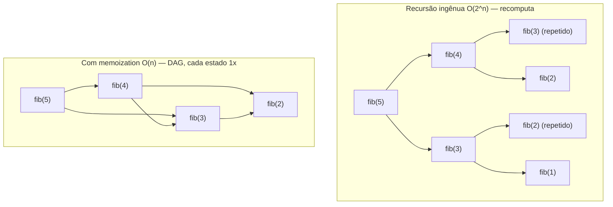
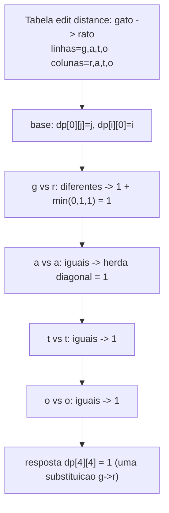
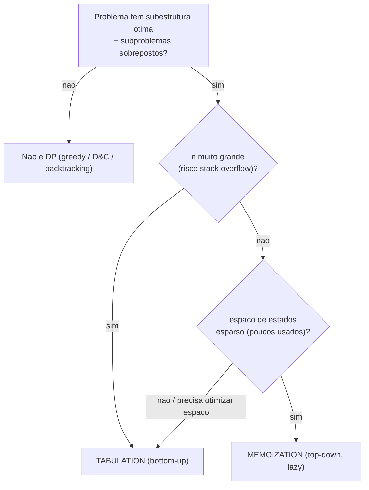

# Dynamic Programming: Memoization vs Tabulation, Subestrutura Ótima e os Clássicos (Knapsack, LIS, LCS, Edit Distance, Coin Change)

> **Bloco:** Algoritmos essenciais · **Nível:** Intermediário/Avançado · **Tempo de leitura:** ~34 min

## TL;DR

**Programação dinâmica (DP)** é a técnica de resolver um problema **quebrando-o em subproblemas que se sobrepõem**, computando cada subproblema **uma única vez** e **reutilizando** o resultado — em vez de recomputá-lo exponencialmente. Ela se aplica quando o problema tem duas propriedades simultâneas: **subestrutura ótima** (a solução ótima é construída a partir de soluções ótimas dos subproblemas) e **subproblemas sobrepostos** (a recursão ingênua resolve os mesmos subproblemas muitas vezes). Sem sobreposição, DP não ajuda (é divide and conquer); sem subestrutura ótima, DP nem se aplica (talvez seja greedy ou backtracking). Há duas formas de implementá-la, equivalentes em resultado mas diferentes na prática: **memoization (top-down)** — escreve-se a recursão natural e *cacheia-se* o retorno de cada estado num mapa/array, computando só os subproblemas necessários (lazy), à custa de overhead de pilha de recursão e risco de **stack overflow** em entradas profundas; e **tabulation (bottom-up)** — preenche-se uma tabela iterativamente, dos casos-base para o resultado, na *ordem de dependência*, sem recursão e geralmente permitindo **otimização de espaço** (manter só a linha anterior, reduzindo `O(n²)` para `O(n)`). O coração de toda DP é a **relação de recorrência** (a fórmula que define `dp[estado]` em função de estados menores) e a **definição de estado** (o que `dp[i]` representa). Os clássicos para dominar: **0/1 knapsack** (`dp[i][w]`), **LIS** (longest increasing subsequence, `O(n²)` ou `O(n log n)`), **LCS** (longest common subsequence), **edit distance / Levenshtein** (distância de edição entre strings) e **coin change** (mínimo de moedas / número de combinações). A receita universal: defina o estado, escreva a recorrência, identifique os casos-base, escolha a ordem de iteração, e retorne a resposta.

## O problema que resolve

Muitos problemas têm uma definição recursiva natural — Fibonacci, o número de caminhos numa grade, o melhor alinhamento de duas strings. A recursão "ingênua" que segue diretamente a definição quase sempre é **exponencial**, porque ela **recomputa os mesmos subproblemas repetidamente**. O exemplo canônico é `fib(n) = fib(n-1) + fib(n-2)`: a árvore de chamadas recalcula `fib(2)` bilhões de vezes para `n` grande, dando `O(2^n)`.

A observação central da DP, devida a **Richard Bellman** (que cunhou o termo nos anos 1950), é: **se os subproblemas se repetem, resolva cada um uma vez e guarde o resultado.** Isso colapsa a árvore exponencial de chamadas num **grafo acíclico dirigido (DAG) de subproblemas distintos**, e o custo passa a ser (número de estados distintos) × (custo por transição) — tipicamente polinomial.

A pergunta central que a DP responde: **"como transformar uma recursão exponencial, que recomputa os mesmos subproblemas, num algoritmo polinomial que computa cada subproblema uma única vez?"**

Os dois pilares que tornam isso possível:

- **Subestrutura ótima (optimal substructure):** a solução ótima do problema pode ser composta a partir de soluções ótimas de subproblemas. Sem isso, conhecer os ótimos dos subproblemas não ajuda a montar o ótimo global, e DP não se aplica. (Esta propriedade é compartilhada com greedy.)
- **Subproblemas sobrepostos (overlapping subproblems):** o mesmo subproblema aparece muitas vezes na recursão. *Esta* é a propriedade que distingue DP de divide and conquer: em D&C (ex.: merge sort) os subproblemas são **disjuntos** e não há nada para cachear; em DP eles **se sobrepõem** e o cache é o que dá o ganho.

A confusão clássica de entrevista é tratar como DP algo que é greedy (não tem sobreposição relevante e a escolha gulosa basta), ou tentar greedy onde só DP resolve (troco com moedas arbitrárias, 0/1 knapsack — ver doc de greedy). A fronteira é exatamente a **greedy choice property**: se existe uma escolha local provadamente ótima, é greedy; se você precisa **considerar todas as escolhas** e combinar resultados de subproblemas, é DP.

## O que é (definição aprofundada)

### A receita universal de DP

Resolver qualquer problema de DP segue cinco passos disciplinados:

1. **Definir o estado.** O que `dp[i]` (ou `dp[i][j]`, etc.) *representa*? Esta é a decisão mais importante e a que mais erra. Ex.: em LIS, `dp[i]` = comprimento da maior subsequência crescente que **termina** em `i`.
2. **Escrever a relação de recorrência.** Como `dp[estado]` se computa a partir de estados menores? É a fórmula que combina as escolhas. Ex.: `dp[i] = 1 + max(dp[j])` para todo `j < i` com `arr[j] < arr[i]`.
3. **Identificar os casos-base.** Os estados que se resolvem sem recursão. Ex.: `dp[i] = 1` (toda posição é uma subsequência de tamanho 1).
4. **Definir a ordem de iteração / avaliação.** Os estados devem ser computados na ordem em que suas dependências já estão prontas (ordem topológica do DAG de subproblemas). Top-down resolve isso automaticamente via recursão; bottom-up exige escolher a ordem dos laços corretamente.
5. **Retornar a resposta** (que pode ser `dp[n]`, `max(dp)`, `dp[n][m]`, etc.) e, se necessário, **reconstruir a solução** seguindo os ponteiros/escolhas que levaram ao ótimo.

### Memoization (top-down)

Escreve-se a **recursão natural** que segue a definição do problema, e adiciona-se um **cache** (mapa ou array, inicializado com um sentinela "não computado"): antes de computar um estado, verifica-se se já está no cache; se sim, retorna direto; se não, computa, guarda e retorna.

```
memo = {}
resolve(estado):
    se estado em casos_base: retorna valor_base
    se estado em memo: retorna memo[estado]
    resultado = combina(resolve(subestado1), resolve(subestado2), ...)
    memo[estado] = resultado
    retorna resultado
```

Vantagens: **fácil de escrever** (segue o raciocínio recursivo direto), **lazy** (computa só os estados realmente alcançados — bom quando o espaço de estados é grande mas só uma fração é usada). Desvantagens: **overhead de pilha de recursão** e, criticamente, **risco de stack overflow** em recursões profundas (ex.: `n = 10⁶`), o que em produção pode derrubar o serviço.

### Tabulation (bottom-up)

Preenche-se uma **tabela iterativamente**, começando pelos casos-base e subindo até o resultado, garantindo que cada estado seja computado **depois** de suas dependências.

```
dp = array dimensionado pelo espaço de estados
inicializa casos-base em dp
para estados na ordem de dependência:
    dp[estado] = combina(dp[subestado1], dp[subestado2], ...)
retorna dp[estado_final]
```

Vantagens: **sem recursão** (zero risco de stack overflow), constante de tempo menor, e — frequentemente — **otimização de espaço**: se `dp[i]` só depende de `dp[i-1]` (ou da linha anterior numa tabela 2D), pode-se manter **apenas a(s) última(s) linha(s)**, reduzindo o espaço de `O(n)` para `O(1)` ou de `O(n·m)` para `O(m)`. Desvantagem: exige descobrir a **ordem de iteração correta** (que top-down te dá de graça) e computa *todos* os estados, mesmo os não-necessários.

### Memoization vs Tabulation: tabela comparativa

| Aspecto | Memoization (top-down) | Tabulation (bottom-up) |
|---|---|---|
| Estrutura | Recursão + cache | Laços + tabela |
| Quais estados computa | só os alcançados (lazy) | todos (eager) |
| Ordem de avaliação | automática (recursão) | manual (você define os laços) |
| Risco de stack overflow | **sim** (recursão profunda) | não |
| Otimização de espaço | difícil | **fácil** (manter só linha anterior) |
| Facilidade de escrever | maior (segue a recursão) | exige pensar a ordem |
| Overhead constante | maior (chamadas/cache) | menor |
| Quando preferir | espaço de estados esparso; protótipo | produção, `n` grande, espaço crítico |

Resultado é o **mesmo** nas duas; a escolha é de engenharia. Em entrevista, comece com a recorrência (top-down deixa-a explícita), depois converta para bottom-up se for pedido para otimizar espaço.

### Subestrutura ótima vs greedy choice (a fronteira com greedy)

Tanto greedy quanto DP exigem subestrutura ótima. A diferença está em **como a escolha é feita**:

- **Greedy:** existe uma escolha local provadamente ótima (greedy choice property); comprometa-se com ela *sem* resolver os subproblemas das outras. Mais rápido.
- **DP:** *não* há escolha local óbvia; é preciso **considerar todas as escolhas possíveis** no estado atual, resolver os subproblemas de cada uma, e ficar com a melhor. Mais caro, porém correto onde greedy falha.

Exemplo: troco com moedas `{1,3,4}` para 6 — greedy daria `4+1+1=3`; DP considera todas (`dp[6] = 1 + min(dp[5], dp[3], dp[2])`) e acha `3+3=2`.

### Glossário rápido

- **Subestrutura ótima:** o ótimo do problema é composto de ótimos dos subproblemas.
- **Subproblemas sobrepostos:** o mesmo subproblema recorre — o que justifica o cache.
- **Estado:** a definição do que `dp[...]` representa; o eixo do espaço de subproblemas.
- **Relação de recorrência:** fórmula que define `dp[estado]` em função de estados menores.
- **Memoization (top-down):** recursão + cache, lazy.
- **Tabulation (bottom-up):** laços preenchendo tabela, eager.
- **Reconstrução (traceback):** seguir as escolhas/ponteiros para recuperar a *solução* (não só o valor ótimo).
- **Pseudo-polinomial:** complexidade polinomial no *valor* numérico da entrada (ex.: `O(n·W)` no knapsack), exponencial no número de *bits* — distinção importante para knapsack/coin change.

## Como funciona

O ganho da DP vem de transformar uma árvore de recursão exponencial num **DAG de subproblemas**: cada nó (estado distinto) é resolvido uma vez. O custo total é **(número de estados) × (custo por transição)**.

### Os clássicos: estado, recorrência e complexidade

**0/1 Knapsack.** `n` itens com peso `w[i]` e valor `v[i]`, capacidade `W`; maximizar valor sem exceder `W`, cada item usado 0 ou 1 vez.

- Estado: `dp[i][c]` = maior valor usando os primeiros `i` itens com capacidade `c`.
- Recorrência: `dp[i][c] = max( dp[i-1][c],  v[i] + dp[i-1][c - w[i]] )` (não pegar vs pegar o item `i`, se couber).
- Caso-base: `dp[0][*] = 0`.
- Complexidade: `O(n · W)` tempo, `O(n · W)` espaço — otimizável para `O(W)` mantendo só a linha anterior (iterando `c` de `W` para baixo). **Pseudo-polinomial** (depende de `W`, não do número de bits).
- Por que *não* é greedy: a indivisibilidade dos itens viola a greedy choice (ver doc de greedy).

**LIS (Longest Increasing Subsequence).** Maior subsequência estritamente crescente.

- Estado: `dp[i]` = comprimento da maior subsequência crescente que **termina** em `i`.
- Recorrência: `dp[i] = 1 + max(dp[j])` para todo `j < i` com `arr[j] < arr[i]` (ou `1` se não houver).
- Resposta: `max(dp)`.
- Complexidade: `O(n²)` direto; **`O(n log n)`** com a variante "patience sorting" (manter um array das menores caudas e fazer busca binária para a posição de inserção).

**LCS (Longest Common Subsequence).** Maior subsequência comum a duas strings `X` (tam `m`) e `Y` (tam `n`).

- Estado: `dp[i][j]` = LCS dos prefixos `X[0..i)` e `Y[0..j)`.
- Recorrência: se `X[i-1] == Y[j-1]`: `dp[i][j] = 1 + dp[i-1][j-1]`; senão `dp[i][j] = max(dp[i-1][j], dp[i][j-1])`.
- Complexidade: `O(m · n)` tempo e espaço (otimizável para `O(min(m,n))` espaço). Base do `diff`.

**Edit Distance (Levenshtein).** Mínimo de operações (inserção, remoção, substituição) para transformar `X` em `Y`.

- Estado: `dp[i][j]` = distância entre `X[0..i)` e `Y[0..j)`.
- Recorrência: se `X[i-1] == Y[j-1]`: `dp[i][j] = dp[i-1][j-1]`; senão `dp[i][j] = 1 + min(dp[i-1][j]` (remoção)`, dp[i][j-1]` (inserção)`, dp[i-1][j-1]` (substituição)`)`.
- Casos-base: `dp[i][0] = i`, `dp[0][j] = j`.
- Complexidade: `O(m · n)`. Usado em corretores ortográficos, dedup e bioinformática.

**Coin Change.** Duas variantes:

- *Mínimo de moedas* para valor `V`: `dp[v] = 1 + min(dp[v - moeda])` sobre todas as moedas `≤ v`; `dp[0] = 0`. `O(V · n)`.
- *Número de combinações* para valor `V`: `dp[v] += dp[v - moeda]` (iterando moedas no laço externo para evitar contar permutações). `O(V · n)`.

### Tabela: os clássicos em uma olhada

| Problema | Estado `dp[...]` | Dimensão | Tempo | Espaço otimizável | Uso real |
|---|---|---|---|---|---|
| 0/1 Knapsack | `dp[i][c]` valor máx. | 2D | `O(n·W)` | `O(W)` | seleção sob orçamento |
| LIS | `dp[i]` LIS terminando em `i` | 1D | `O(n²)` / `O(n log n)` | `O(n)` | versionamento, patches |
| LCS | `dp[i][j]` LCS dos prefixos | 2D | `O(m·n)` | `O(min(m,n))` | `diff`, controle de versão |
| Edit distance | `dp[i][j]` distância | 2D | `O(m·n)` | `O(min(m,n))` | spell-check, dedup, DNA |
| Coin change (min) | `dp[v]` min moedas | 1D | `O(V·n)` | `O(V)` | troco, otimização |

### Reconstrução da solução

`dp[final]` dá o **valor** ótimo, mas frequentemente o usuário quer a **solução** (quais itens, qual alinhamento). Reconstrói-se fazendo o **traceback**: a partir do estado final, descobre-se qual escolha gerou aquele valor (qual subestado foi o melhor) e segue-se de volta até os casos-base. Em LCS, o traceback pelas decisões "diagonal vs cima vs esquerda" reconstrói a própria subsequência.

## Diagrama de fluxo

O primeiro diagrama contrasta a árvore de recursão exponencial do Fibonacci ingênuo com o DAG colapsado pela memoization. O segundo mostra a tabela de edit distance preenchida para `"gato" → "rato"`. O terceiro é a árvore de decisão para escolher entre memoization e tabulation.







## Exemplo prático / caso real

Cenário pt-BR: uma **plataforma de e-commerce brasileira** usa DP em três pontos do produto, cada um mapeando para um clássico.

**1. "Combo que cabe no cupom" (knapsack).** Numa promoção, o cliente tem um cupom de R$ 200 e o sistema sugere o **conjunto de produtos que maximiza o valor aproveitado sem ultrapassar o limite** — cada produto entra 0 ou 1 vez. Isso é **0/1 knapsack** com `W = 200` (em centavos ou reais inteiros). Tentar greedy (pegar o item de melhor "densidade" valor/preço) **falha**: pode-se preferir um item caro e perder dois mais baratos que juntos aproveitam melhor o cupom. A solução correta é a DP `dp[i][c]`, `O(n·W)`, com traceback para listar os produtos sugeridos. Pseudocódigo:

```
para i de 1 até n:
    para c de W até w[i]:        // de cima para baixo -> espaço O(W)
        dp[c] = max(dp[c], v[i] + dp[c - w[i]])
// traceback: reconstrói quais itens entraram comparando dp antes/depois
```

**2. Busca tolerante a erros / "você quis dizer?" (edit distance).** O campo de busca corrige digitação: o usuário busca `"camista"`, o sistema sugere `"camiseta"`. Calcula-se a **edit distance** entre o termo digitado e os termos do catálogo; sugere-se o de menor distância (tipicamente ≤ 2). É também a base da **deduplicação de cadastro**: dois registros de cliente "João da Silva" e "Joao da Silva" têm edit distance 1 e são candidatos a merge. Em escala, pré-filtra-se com índices (n-grams, BK-tree) e aplica-se edit distance só nos candidatos — porque `O(m·n)` por par seria caro contra o catálogo inteiro.

**3. `diff` de descrições / versionamento (LCS).** A ferramenta de edição de produtos mostra um **diff** entre a versão antiga e a nova da descrição de um produto — exatamente o que o `git diff` faz. O algoritmo por baixo é **LCS**: a maior subsequência comum define as linhas/palavras inalteradas; o que sobra de cada lado são as remoções e inserções. `O(m·n)` por documento.

**Bônus — troco no PDV (coin change).** O terminal de pagamento da loja física devolve troco com o **mínimo de cédulas/moedas**. Para o Real, o greedy basta (sistema canônico), mas o time implementou a **DP de coin change** (`dp[v] = 1 + min(dp[v - moeda])`) para ser robusto a configurações de denominação não-canônicas (ex.: vales-brinde internos), evitando o bug clássico do greedy do troco (ver doc de greedy).

A lição transversal: **toda vez que a escolha local não basta e é preciso considerar todas as combinações, o padrão é DP** — e reconhecer *qual* clássico o problema é (knapsack? LCS? edit distance?) é metade da solução.

## Quando usar / Quando evitar

**Use DP quando:**

- O problema tem **subestrutura ótima** *e* **subproblemas sobrepostos** (a recursão ingênua recomputa os mesmos estados).
- A escolha **não** pode ser feita gulosamente (não há greedy choice property provável) — é preciso considerar todas as opções e combinar subproblemas (troco arbitrário, 0/1 knapsack, LCS, edit distance, LIS).
- O espaço de estados é **polinomial** e cabe em memória/tempo (`O(n²)`, `O(n·W)` etc. são viáveis para os tamanhos esperados).

**Evite ou prefira alternativa quando:**

- Os subproblemas são **disjuntos** (sem sobreposição): é **divide and conquer**, não DP — o cache não ajuda.
- Existe uma **escolha gulosa provadamente ótima**: greedy é mais simples e rápido (interval scheduling, MST, troco canônico).
- O espaço de estados é **exponencial** (não há como parametrizar em poucas dimensões): pode exigir backtracking com poda, meet-in-the-middle, ou aproximação.
- O knapsack/coin change é **pseudo-polinomial** e `W`/`V` são astronômicos: `O(n·W)` deixa de ser viável — pode exigir aproximação (FPTAS) ou outra modelagem.

## Anti-padrões e armadilhas comuns

- **Estouro de recursão em DP top-down.** A armadilha mais comum em produção: memoization com `n` grande (ex.: 10⁵–10⁶) estoura a pilha. Solução: converter para **tabulation (bottom-up)** ou aumentar o limite de recursão *conscientemente* (com cautela). Em entrevista, mencione esse risco ao propor top-down.
- **Definição de estado errada/incompleta.** O erro número um conceitual: o estado não captura toda a informação necessária para a transição (ex.: em problemas com restrição adicional, esquecer uma dimensão). Sintoma: a recorrência "não fecha" ou dá respostas erradas em casos específicos.
- **Confundir DP com greedy (e vice-versa).** Aplicar greedy onde só DP resolve (troco `{1,3,4}`, 0/1 knapsack) é incorreto; aplicar DP onde greedy basta é desperdício. A fronteira é a existência (ou não) de uma escolha gulosa provadamente ótima.
- **Ordem de iteração errada no bottom-up.** Preencher a tabela numa ordem em que uma dependência ainda não foi computada produz resultados errados silenciosamente. Em coin change "número de combinações", inverter a ordem dos laços (moedas vs valor) muda o que se conta (combinações vs permutações).
- **Confundir subsequência com substring.** LIS/LCS são sobre **subsequências** (não-contíguas); muitos erram tratando como substring (contígua). São problemas diferentes.
- **Esquecer a otimização de espaço quando ela é viável (ou aplicá-la onde não é).** Reduzir `O(n²)`→`O(n)` só funciona se `dp[i]` depende apenas da linha anterior; aplicar a redução quando a recorrência precisa de linhas mais antigas corrompe o resultado.
- **Não tratar os casos-base / off-by-one.** Tabelas 1-indexed com prefixos vazios (`dp[0][*]`, `dp[*][0]`) são fonte recorrente de bugs de índice em LCS/edit distance.
- **Assumir que `O(n·W)` é "polinomial" sem ressalva.** Knapsack e coin change são **pseudo-polinomiais**: rápidos quando `W`/`V` são moderados, inviáveis quando são enormes. Saber disso evita escolher DP onde ela não escala.
- **Recomputar a resposta em vez de cachear.** Esquecer de *gravar* no memo antes de retornar (ou cachear cedo demais com valor parcial) anula o ganho ou introduz erro.
- **Não reconstruir a solução quando ela é o que se pede.** Computar só o valor ótimo (`dp[final]`) quando o problema pede *qual* é a solução (quais itens, qual alinhamento) — falta o **traceback**.

## Relação com outros conceitos

- **Greedy algorithms:** o paradigma "irmão". Ambos exigem subestrutura ótima; DP é a resposta quando *não* há greedy choice property e é preciso considerar todas as escolhas. Saber distinguir é o cerne (ver doc de greedy).
- **Divide and conquer:** D&C também decompõe, mas com subproblemas **disjuntos** e sem cache; DP é justamente o caso de subproblemas **sobrepostos**. Memoization é "D&C + cache".
- **Grafos:** vários problemas de grafo *são* DP. **Bellman-Ford** é DP sobre número de arestas; **Floyd-Warshall** é DP sobre o conjunto de vértices intermediários (`dp[k][i][j]`); shortest path em DAG é DP em ordem topológica (ver doc de graph algorithms).
- **Estruturas de dados:** tabelas/arrays e hash maps (para o memo) são o substrato; a variante `O(n log n)` da LIS usa busca binária sobre um array de caudas.
- **Complexidade:** DP troca **tempo exponencial por tempo polinomial à custa de espaço**; a distinção pseudo-polinomial (`O(n·W)`) é central para entender quando knapsack/coin change escalam.
- **Strings (KMP, alinhamento):** edit distance e LCS são DP de strings; alinhamento de sequências (Needleman-Wunsch, Smith-Waterman) na bioinformática são extensões diretas (ver doc de string algorithms).
- **System design:** corretores de busca ("você quis dizer?"), dedup de dados, `diff`/merge em controle de versão, sugestões de combo sob orçamento e roteamento (DP em DAG) são aplicações de produção dos clássicos acima.

## Modelo mental para o arquiteto

Três ideias para carregar:

1. **DP = recursão + memória.** Se sua recursão recomputa os mesmos subproblemas, ela é exponencial por desperdício; cachear cada estado uma vez colapsa a árvore num DAG polinomial. Toda DP é, no fundo, isso.
2. **O trabalho difícil é a modelagem, não a implementação.** Definir o **estado** correto e a **recorrência** é onde está a engenharia; uma vez que você tem `dp[estado] = ...`, escrever top-down ou bottom-up é mecânico. Comece sempre pelo estado e pela recorrência.
3. **Memoization para clareza, tabulation para produção.** Top-down deixa a recorrência explícita e é ótimo para raciocinar/prototipar, mas cuidado com stack overflow; bottom-up é o que você quer em produção com `n` grande e quando precisa espremer o espaço (`O(n²)`→`O(n)`).

O fio condutor: DP existe na **fronteira onde greedy falha** — quando a escolha local não basta e é preciso considerar todas as opções, combinando soluções ótimas de subproblemas que se repetem. Reconhecer essa fronteira (e qual clássico o problema é) é a habilidade que importa.

## Pontos para fixar (revisão)

- DP exige **subestrutura ótima** *e* **subproblemas sobrepostos**; sem sobreposição é D&C, sem subestrutura nem se aplica.
- A fronteira com **greedy**: DP entra quando *não* há greedy choice property — é preciso considerar **todas** as escolhas.
- **Receita:** defina o **estado**, escreva a **recorrência**, fixe os **casos-base**, escolha a **ordem de iteração**, retorne (e reconstrua se preciso).
- **Memoization (top-down):** recursão + cache, lazy, fácil de escrever, **risco de stack overflow**.
- **Tabulation (bottom-up):** laços + tabela, sem recursão, permite **otimização de espaço** (`O(n²)`→`O(n)`).
- **Knapsack 0/1** `O(n·W)` (pseudo-polinomial, não é greedy); **LIS** `O(n²)`/`O(n log n)`; **LCS** e **edit distance** `O(m·n)`.
- **Coin change:** mínimo (`dp[v]=1+min(...)`) e número de combinações (cuidado com a ordem dos laços).
- Subsequência (não-contígua) ≠ substring (contígua) — não confundir em LIS/LCS.
- **Traceback** reconstrói a *solução* (não só o valor) seguindo as escolhas ótimas.
- **Bellman-Ford** e **Floyd-Warshall** são DP sobre grafos; shortest path em DAG é DP em ordem topológica.

## Referências

- [Lecture 19: Dynamic Programming I (Fibonacci, Shortest Paths) — MIT 6.006 OCW](https://ocw.mit.edu/courses/6-006-introduction-to-algorithms-fall-2011/resources/lecture-19-dynamic-programming-i-fibonacci-shortest-paths/)
- [Dynamic Programming, Part 2: LCS, LIS, Coins — MIT 6.006 OCW (Spring 2020)](https://ocw.mit.edu/courses/6-006-introduction-to-algorithms-spring-2020/resources/lecture-16-dynamic-programming-part-2-lcs-lis-coins/)
- [Dynamic Programming, Part 3: APSP, Parens, Piano — MIT 6.006 OCW (Spring 2020)](https://ocw.mit.edu/courses/6-006-introduction-to-algorithms-spring-2020/resources/lecture-17-dynamic-programming-part-3-apsp-parens-piano/)
- [NeetCode Roadmap — seção de Dynamic Programming (1-D e 2-D)](https://neetcode.io/roadmap)
- [Edit Distance & Knapsack — notas de aula CS256 (Williams College)](https://www.cs.williams.edu/~shikha/teaching/fall19/cs256/lectures/Lecture15.pdf)
- [Dynamic Programming: Mastering Tabulation and Memoization — AlgoCademy](https://algocademy.com/blog/dynamic-programming-mastering-tabulation-and-memoization/)
- [Introduction to Algorithms (6.006) — MIT OpenCourseWare (curso completo)](https://ocw.mit.edu/courses/6-006-introduction-to-algorithms-fall-2011/)
