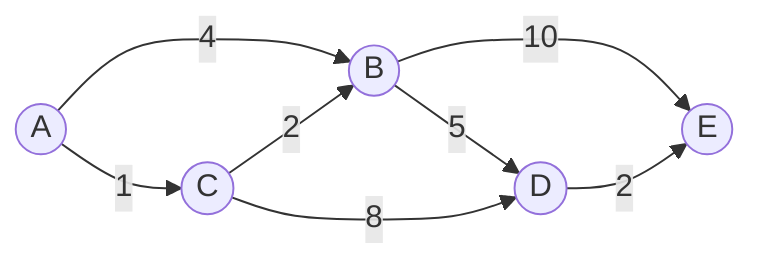
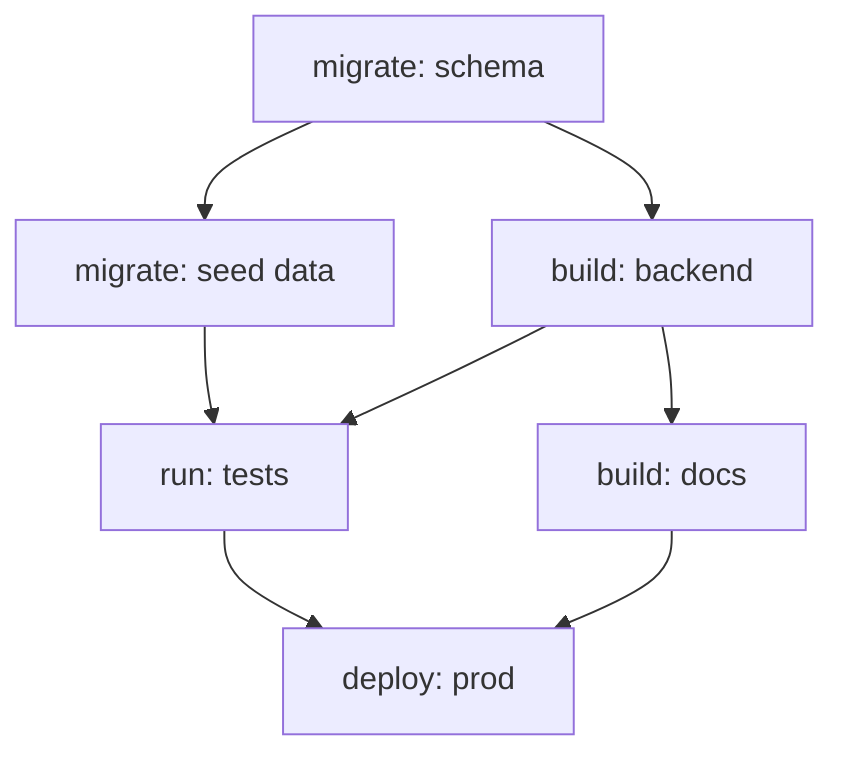
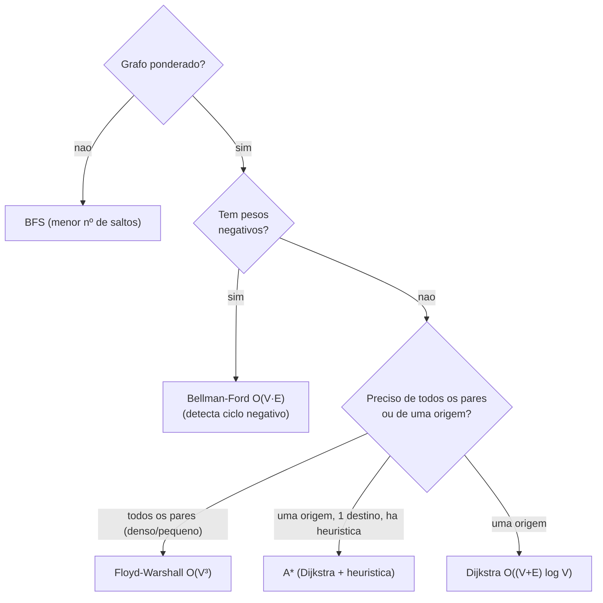

# Algoritmos de Grafos: BFS, DFS, Dijkstra, Bellman-Ford, Floyd-Warshall, A*, Topological Sort, Kruskal e Prim

> **Bloco:** Algoritmos essenciais · **Nível:** Intermediário/Avançado · **Tempo de leitura:** ~36 min

## TL;DR

Grafos modelam praticamente tudo que tem **entidades e relações**: mapas e rotas, dependências de build/deploy, redes sociais, grafos de chamadas de microsserviços, fluxos de dados. Os algoritmos de grafos se organizam em famílias por **o que respondem** e **sob quais restrições**. Para **travessia/ordem**: **BFS** (busca em largura, `O(V+E)`, dá o caminho com menos arestas em grafos não-ponderados e é a base de "níveis"/distância em saltos) e **DFS** (busca em profundidade, `O(V+E)`, base de detecção de ciclo, componentes e ordenação topológica). Para **caminho mínimo de uma origem (single-source)**: **Dijkstra** (`O((V+E) log V)` com heap; ótimo e rápido **mas só com pesos não-negativos** — é greedy), **Bellman-Ford** (`O(V·E)`; mais lento, porém **aceita pesos negativos e detecta ciclos negativos** — é DP) e **A\*** (Dijkstra guiado por uma **heurística admissível**, que poda a busca e é o padrão em roteamento de mapas/jogos). Para **caminho mínimo entre todos os pares (all-pairs)**: **Floyd-Warshall** (`O(V³)`, DP, simples, aceita pesos negativos sem ciclo negativo, bom para grafos densos e pequenos/médios). Para **árvore geradora mínima (MST)** de grafo não-direcionado ponderado: **Kruskal** (greedy por aresta + **union-find**, melhor em grafos esparsos) e **Prim** (greedy por vértice + **heap**, melhor em densos). Para **ordenação topológica** de um **DAG**: Kahn (BFS por grau de entrada) ou DFS pós-ordem — usada em resolução de dependências (build, migrations, escalonamento). A escolha certa depende de quatro perguntas: **tem pesos negativos? o grafo é denso ou esparso? preciso de uma origem ou de todos os pares? é DAG?**

## O problema que resolve

Um **grafo** `G = (V, E)` é um conjunto de **vértices** (nós) e **arestas** (ligações). É a estrutura mais geral para representar relações: as cidades e estradas de um mapa, as tarefas de um pipeline e suas dependências, os serviços de uma arquitetura e suas chamadas, os usuários de uma rede e suas conexões. Quase todo problema "X depende de Y", "como ir de A a B", "o que está conectado a quê" é, no fundo, um problema de grafo.

A pergunta de fundo destes algoritmos: **dada uma rede de entidades e relações, como respondê-la eficientemente — alcançabilidade, ordem, menor caminho, menor custo de conexão — sem enumerar exponencialmente todas as possibilidades?** Os caminhos possíveis entre dois nós podem ser exponenciais; visitar tudo de forma ingênua é inviável. Os algoritmos clássicos exploram a estrutura para responder em tempo **polinomial** (tipicamente `O(V+E)`, `O((V+E) log V)`, `O(V·E)` ou `O(V³)`).

As famílias de pergunta:

- **"Está conectado? Em quantos saltos?"** → travessia (BFS/DFS).
- **"Qual a ordem válida respeitando dependências?"** → ordenação topológica (em DAG).
- **"Qual o caminho mais barato de A para todos (ou para B)?"** → single-source shortest path (Dijkstra / Bellman-Ford / A*).
- **"Qual o caminho mais barato entre cada par?"** → all-pairs shortest path (Floyd-Warshall).
- **"Como conectar tudo com o menor custo total de cabos/estradas?"** → MST (Kruskal / Prim).

A habilidade que importa não é decorar implementações, é **escolher o algoritmo certo** dadas as restrições — porque usar Dijkstra com pesos negativos, ou Floyd-Warshall onde Dijkstra bastaria, são erros caros (de corretude ou de performance).

## O que é (definição aprofundada)

### Travessia: BFS e DFS

**BFS (Breadth-First Search)** explora o grafo em **camadas/níveis**: visita todos os vizinhos do nó inicial, depois os vizinhos dos vizinhos, e assim por diante, usando uma **fila (FIFO)**. Propriedades-chave:

- Encontra o **caminho com o menor número de arestas** (menor número de saltos) da origem a todos os nós — ou seja, é o **shortest path em grafos não-ponderados** (ou com peso unitário).
- Complexidade `O(V + E)`.
- Base de: distância em saltos, detecção de bipartição, e o **algoritmo de Kahn** para ordenação topológica.

**DFS (Depth-First Search)** explora indo **o mais fundo possível** por um ramo antes de retroceder (backtrack), usando uma **pilha** (explícita ou via recursão). Propriedades-chave:

- Produz tempos de **descoberta/finalização** que classificam as arestas (tree, back, forward, cross) — base para **detecção de ciclo** (uma *back edge* indica ciclo), **componentes conexas**, **componentes fortemente conexas** (Tarjan/Kosaraju) e **ordenação topológica** (pós-ordem reversa).
- Complexidade `O(V + E)`.
- Cuidado: DFS recursivo em grafos profundos pode **estourar a pilha** — use versão iterativa.

A escolha BFS vs DFS: BFS para "menor distância em saltos" e exploração por nível; DFS para detecção de ciclo, ordenação e análise estrutural.

### Single-source shortest path: Dijkstra, Bellman-Ford, A*

**Dijkstra** resolve o caminho mínimo de uma origem para todos os nós em grafos com **pesos não-negativos**. É um **greedy**: mantém um conjunto de distâncias provisórias, e a cada passo "finaliza" o nó não-visitado de menor distância (extraído de uma **min-heap / priority queue**), relaxando suas arestas. O invariante que justifica o greedy: como nenhum peso é negativo, uma vez que o nó de menor distância é finalizado, **nenhum caminho futuro pode melhorá-la** (qualquer desvio só acrescenta peso ≥ 0). É exatamente esse invariante que **pesos negativos quebram** — por isso Dijkstra **não** funciona com arestas negativas.

- Complexidade: `O((V + E) log V)` com binary heap; `O(V²)` com array simples (melhor em grafos muito densos). Em grafos esparsos, a versão com heap/set é a preferida.

**Bellman-Ford** resolve single-source shortest path **mesmo com pesos negativos** e **detecta ciclos de peso negativo** (onde "menor caminho" deixa de existir). É um **DP**: relaxa **todas** as arestas repetidamente, `V-1` vezes — após `V-1` rodadas, todas as menores distâncias estão corretas (um caminho mínimo tem no máximo `V-1` arestas). Se uma `V`-ésima rodada ainda relaxa alguma aresta, há um **ciclo negativo**.

- Complexidade: `O(V · E)` — bem mais lento que Dijkstra, mas é o que se usa quando há pesos negativos.

**A\* (A-star)** é o Dijkstra **guiado por uma heurística** `h(n)` que estima o custo restante até o destino. Em vez de expandir sempre o nó de menor distância acumulada `g(n)`, expande o de menor `f(n) = g(n) + h(n)`, **priorizando os nós que parecem mais próximos do alvo** e podando regiões irrelevantes. Garantias:

- Se a heurística é **admissível** (nunca superestima o custo real), A* encontra o **caminho ótimo**.
- Se é também **consistente (monotônica)**, não precisa reprocessar nós.
- Com `h ≡ 0`, A* **degenera em Dijkstra**. Uma boa heurística (ex.: distância em linha reta num mapa) acelera drasticamente a busca para um destino específico. É o padrão em **roteamento de mapas, jogos e GPS**.

### All-pairs shortest path: Floyd-Warshall

**Floyd-Warshall** computa o caminho mínimo entre **todos os pares** de nós. É um **DP** elegante: `dp[k][i][j]` = menor caminho de `i` a `j` usando apenas os primeiros `k` vértices como intermediários; a recorrência é `dist[i][j] = min(dist[i][j], dist[i][k] + dist[k][j])`. Aceita pesos negativos (sem ciclo negativo) e detecta ciclo negativo (diagonal negativa).

- Complexidade: `O(V³)` tempo, `O(V²)` espaço. **Bom para grafos densos e pequenos/médios** (centenas de nós). Para all-pairs em grafos esparsos e grandes, rodar Dijkstra de cada origem (`V · O((V+E) log V)`) pode ser melhor.

### MST: Kruskal e Prim

A **árvore geradora mínima (MST)** de um grafo **não-direcionado, conexo e ponderado** é o subconjunto de arestas que conecta todos os vértices com **custo total mínimo** e sem ciclos. Dois greedy clássicos (ambos ótimos — a estrutura é um matroide gráfico, ver doc de greedy):

- **Kruskal:** ordena **todas as arestas** por peso crescente e adiciona cada uma se ela **não forma ciclo** (teste feito com **union-find / DSU** em quase-`O(1)` amortizado). Complexidade `O(E log E)` (dominada pela ordenação). **Melhor em grafos esparsos.**
- **Prim:** cresce a árvore a partir de um vértice, sempre adicionando a **aresta de menor peso que conecta a árvore a um novo vértice** (extraída de uma **min-heap**). Complexidade `O(E log V)` com binary heap, `O(V²)` com array. **Melhor em grafos densos** (a versão `O(V²)` ou com Fibonacci heap brilha quando `E ≈ V²`).

### Ordenação topológica

Uma **ordenação topológica** de um **DAG (grafo acíclico dirigido)** é uma ordem linear dos vértices tal que, para toda aresta `u → v`, `u` aparece **antes** de `v`. Existe **se e somente se** o grafo é acíclico. Duas abordagens:

- **Kahn (BFS por grau de entrada):** comece pelos nós com **grau de entrada 0**, remova-os, decremente o grau dos sucessores, repita. Se sobrarem nós, há ciclo.
- **DFS pós-ordem:** rode DFS; a ordem inversa de finalização é uma ordenação topológica.

Uso: resolução de **dependências** — ordem de build, ordem de aplicar migrations, escalonamento de tarefas, resolução de dependências de pacotes.

### Tabela comparativa: qual usar?

| Algoritmo | Responde | Pesos negativos? | Denso vs esparso | Complexidade | Paradigma |
|---|---|---|---|---|---|
| **BFS** | menor nº de saltos (não-ponderado) | n/a | qualquer | `O(V+E)` | travessia |
| **DFS** | ciclo, componentes, ordem | n/a | qualquer | `O(V+E)` | travessia |
| **Dijkstra** | single-source min path | **NÃO** | esparso (heap) / denso (array `O(V²)`) | `O((V+E) log V)` | greedy |
| **Bellman-Ford** | single-source min path | **SIM** (+ detecta ciclo neg.) | qualquer | `O(V·E)` | DP |
| **A\*** | single-source → 1 destino | NÃO (como Dijkstra) | guiado por heurística | ≤ Dijkstra | greedy + heurística |
| **Floyd-Warshall** | all-pairs min path | SIM (sem ciclo neg.) | **denso, pequeno/médio** | `O(V³)` | DP |
| **Kruskal** | MST | n/a | **esparso** | `O(E log E)` | greedy + union-find |
| **Prim** | MST | n/a | **denso** | `O(E log V)` / `O(V²)` | greedy + heap |
| **Topological sort** | ordem de dependências (DAG) | n/a | qualquer | `O(V+E)` | BFS (Kahn) / DFS |

A árvore de decisão mental: **DAG e quero ordem?** → topological sort. **Quero conectar tudo barato?** → MST (Kruskal se esparso, Prim se denso). **Quero caminho mais curto?** → não-ponderado: BFS; ponderado de uma origem sem pesos negativos: Dijkstra (com destino único e heurística: A*); com pesos negativos: Bellman-Ford; entre todos os pares e grafo denso/pequeno: Floyd-Warshall.

### Glossário rápido

- **Vértice / aresta:** nós e ligações; aresta pode ser dirigida e/ou ponderada.
- **DAG:** grafo dirigido sem ciclos; pré-requisito da ordenação topológica.
- **Relaxar uma aresta:** tentar melhorar `dist[v]` via `dist[u] + peso(u,v)`.
- **Heurística admissível:** estimativa que nunca superestima o custo restante (garante ótimo no A*).
- **Union-find / DSU:** estrutura de conjuntos disjuntos; testa/une componentes em quase-`O(1)` (usada no Kruskal).
- **MST:** árvore geradora de custo mínimo de grafo não-direcionado ponderado.
- **Ciclo negativo:** ciclo cuja soma de pesos é negativa; torna "caminho mínimo" indefinido.
- **Denso vs esparso:** `E ≈ V²` (denso) vs `E ≈ V` (esparso) — decide heap vs matriz.

## Como funciona

### O coração comum: relaxamento

Os algoritmos de caminho mínimo compartilham a operação de **relaxamento**: para cada aresta `(u, v)` de peso `w`, se `dist[u] + w < dist[v]`, atualiza-se `dist[v] = dist[u] + w` (e o predecessor de `v`). A diferença está na **ordem** em que relaxam: Dijkstra relaxa na ordem do nó de menor distância (greedy, via heap); Bellman-Ford relaxa todas as arestas `V-1` vezes (DP); Floyd-Warshall relaxa via vértices intermediários (DP `O(V³)`).

### Dijkstra: por que falha com pesos negativos

O invariante de Dijkstra é: quando um nó sai da heap (é finalizado), sua distância é **definitiva**. Isso só vale porque, com pesos ≥ 0, qualquer caminho alternativo só pode ser **maior ou igual**. Uma aresta negativa permitiria que um nó já finalizado fosse melhorado depois — violando o invariante e produzindo respostas **erradas silenciosamente** (não dá erro, dá resultado incorreto). Por isso, com pesos negativos, troca-se por **Bellman-Ford**.

### A*: Dijkstra com um GPS

A* prioriza `f(n) = g(n) + h(n)`. `g(n)` é o custo conhecido até `n`; `h(n)` é a estimativa do restante. Numa malha viária, `h` pode ser a distância em linha reta (Haversine) até o destino — sempre `≤` distância real pela estrada (admissível), logo A* acha o ótimo. O efeito prático: em vez de expandir um "círculo" ao redor da origem (como Dijkstra), A* expande uma "elipse" esticada na direção do destino, visitando ordens de magnitude menos nós.

### Kruskal vs Prim: o mesmo ótimo, estruturas diferentes

Ambos produzem uma MST de mesmo custo (a estrutura é matroide). Kruskal pensa em **arestas globais** (ordena todas, usa union-find para evitar ciclo) — eficiente quando há poucas arestas (esparso). Prim pensa em **crescimento local** (expande a árvore por vértices adjacentes, usa heap) — eficiente quando há muitas arestas (denso), especialmente na versão `O(V²)`.

## Diagrama de fluxo

O primeiro diagrama é um grafo ponderado para Dijkstra (caminho mínimo de A). O segundo é um DAG de dependências de build para ordenação topológica. O terceiro é a árvore de decisão para escolher o algoritmo de caminho mínimo.







## Exemplo prático / caso real

Cenário pt-BR: a engenharia de uma **plataforma de logística e entregas** (estilo iFood/Loggi) e a **pipeline de CI/CD** da mesma empresa usam, juntas, quase todos esses algoritmos.

**1. Roteamento de entregas (Dijkstra / A\*).** O serviço de roteamento precisa do **menor tempo de A até B** numa malha viária onde os pesos das arestas são tempos de trajeto (sempre ≥ 0). Como há um **destino específico** e existe uma heurística natural (distância em linha reta via Haversine), usa-se **A\***, que poda a busca e responde em milissegundos mesmo num grafo de milhões de cruzamentos — enquanto Dijkstra puro expandiria muito mais nós. Quando o problema vira "tempo de cada hub para *todos* os bairros" (matriz origem-destino), parte-se para múltiplos Dijkstra ou, se o grafo de hubs for pequeno e denso, **Floyd-Warshall** `O(V³)`. Pseudocódigo do A*:

```
abertos = heap com (f=h(origem), origem)
g[origem] = 0
enquanto abertos não vazio:
    n = extrai menor f
    se n == destino: reconstrói e retorna caminho
    para cada vizinho v de n:
        novo_g = g[n] + peso(n, v)
        se novo_g < g[v]:
            g[v] = novo_g
            f[v] = novo_g + h(v)        // h admissível (linha reta)
            insere/atualiza v em abertos
```

**2. Zonas de entrega e conectividade (BFS / componentes).** Para definir "quais bairros estão alcançáveis a pé a partir de um ponto de retirada em ≤ N quadras", usa-se **BFS** (menor número de saltos em grafo não-ponderado). Para descobrir **regiões desconexas** da malha (ilhas sem ligação rodoviária), usa-se **DFS / componentes conexas**.

**3. Custo mínimo de conectar uma nova região (MST).** Ao expandir para uma cidade nova, o time precisa decidir **quais trechos de "linha-tronco" entre hubs construir** para conectar todos os hubs com o menor custo total de infraestrutura — exatamente uma **MST**. Como o grafo de hubs candidatos é **esparso** (nem todo par de hubs tem trecho viável), usa-se **Kruskal** com union-find; se fosse denso (todos conectáveis a todos), **Prim** seria preferível.

**4. Ordem do pipeline de CI/CD (topological sort).** O build da plataforma tem dependências: `migrate-schema` antes de `seed`, `build-backend` antes de `tests`, `tests` e `build-docs` antes de `deploy`. O orquestrador modela isso como um **DAG** e roda **ordenação topológica** (Kahn) para decidir a ordem de execução — e, de quebra, **detecta dependência circular** (se a ordenação não consome todos os nós, há ciclo, e o build é abortado com erro claro em vez de travar). É o mesmo mecanismo que `make`, Bazel, gerenciadores de pacotes (npm/Maven) e ferramentas de migration usam.

A lição transversal: **a mesma empresa, num dia, usa A* (rotas), BFS (alcance), Kruskal (infra) e topological sort (CI/CD)** — e escolher o algoritmo certo para cada um (atento a pesos negativos, denso/esparso, single-source vs all-pairs, DAG) é o que separa a solução correta e rápida da lenta ou errada.

## Quando usar / Quando evitar

**BFS:** use para menor número de **saltos** em grafos **não-ponderados** (ou peso unitário), exploração por nível, bipartição. Evite onde os pesos importam (não dá caminho de menor *custo* ponderado).

**DFS:** use para **detecção de ciclo**, componentes (conexas e fortemente conexas), ordenação topológica via pós-ordem. Evite a versão recursiva em grafos muito profundos (stack overflow) — use a iterativa.

**Dijkstra:** use para single-source shortest path com **pesos não-negativos**; é o caminho mínimo ponderado "padrão" e rápido. **Evite com pesos negativos** (resultado errado).

**Bellman-Ford:** use quando há **pesos negativos** ou você precisa **detectar ciclo negativo**. Evite quando os pesos são não-negativos e a performance importa (Dijkstra é muito mais rápido).

**A\*:** use quando há **um destino específico** e existe **heurística admissível** boa (mapas, jogos, GPS). Evite (ou degenera em Dijkstra) quando não há heurística informativa, ou quando você precisa das distâncias para *todos* os nós.

**Floyd-Warshall:** use para **all-pairs** em grafos **densos e pequenos/médios** (até centenas de nós); aceita pesos negativos. **Evite** em grafos grandes e esparsos (`O(V³)` explode — prefira Dijkstra repetido).

**Kruskal:** use para MST em grafos **esparsos** (poucas arestas). **Prim:** use para MST em grafos **densos**. Ambos só para grafos **não-direcionados** ponderados (MST direcionada é outro problema — arborescência de Edmonds).

**Topological sort:** use para ordenar **dependências em DAGs** (build, migrations, escalonamento). **Evite/inválido** em grafos com ciclo (a ausência de ordenação *sinaliza* o ciclo — útil para detectá-lo).

## Anti-padrões e armadilhas comuns

- **Dijkstra com pesos negativos (o clássico de entrevista).** Dijkstra dá resultado **errado silenciosamente** com arestas negativas — não lança erro, retorna distância incorreta. Com pesos negativos, use **Bellman-Ford**. Saber *por quê* (o invariante greedy quebra) é o que diferencia.
- **Usar Floyd-Warshall onde Dijkstra bastaria.** Se você precisa de caminho mínimo de **uma** origem, rodar Floyd-Warshall `O(V³)` é desperdício gigante; use Dijkstra `O((V+E) log V)`. E o inverso: rodar `V` Dijkstras quando Floyd-Warshall `O(V³)` é mais simples e suficiente para um grafo pequeno e denso.
- **BFS para caminho mínimo ponderado.** BFS dá o menor número de **arestas**, não o menor **custo** — só coincidem em grafos não-ponderados/peso unitário. Para pesos arbitrários, é Dijkstra.
- **Estouro de pilha em DFS recursivo.** Em grafos com caminhos longos (ou listas encadeadas disfarçadas de grafo), DFS recursivo estoura a pilha. Use a versão iterativa com pilha explícita.
- **Topological sort em grafo com ciclo.** Ordenação topológica só existe em DAG. Aplicá-la num grafo com ciclo deve **detectar e reportar o ciclo** (Kahn: sobram nós; DFS: encontra back edge), não produzir uma ordem inválida silenciosamente — é como gerenciadores de pacotes detectam dependência circular.
- **MST em grafo direcionado.** Kruskal/Prim resolvem MST de grafos **não-direcionados**. O análogo direcionado (mínima arborescência) é o algoritmo de Edmonds, não um greedy ingênuo.
- **Esquecer o union-find no Kruskal (ou usá-lo sem path compression / union by rank).** Sem union-find eficiente, o teste de ciclo vira `O(V)` por aresta e Kruskal degrada; com as otimizações, é quase-`O(1)` amortizado.
- **Heurística não-admissível no A\*.** Se `h` **superestima** o custo restante, A* pode retornar um caminho **subótimo**. Para garantir o ótimo, `h` deve ser admissível (e idealmente consistente).
- **Não detectar ciclo negativo no Bellman-Ford.** Esquecer a `V`-ésima rodada de verificação faz o algoritmo retornar "distâncias" sem sentido quando há ciclo negativo, em vez de sinalizar que não há solução.
- **Recriar Dijkstra sem priority queue.** Implementar Dijkstra varrendo o array para achar o mínimo dá `O(V²)` — aceitável em grafos densos, mas ruim em esparsos, onde a heap dá `O((V+E) log V)`.
- **Confundir denso e esparso na escolha de estrutura.** Usar matriz de adjacência `O(V²)` de memória num grafo esparso e enorme desperdiça memória; usar lista de adjacência é o padrão para esparsos.

## Relação com outros conceitos

- **Estruturas de dados — heaps/priority queue:** Dijkstra, Prim e A* dependem de uma **min-heap** para extrair o nó/aresta de menor custo; a complexidade `log V` vem dela.
- **Estruturas de dados — union-find (DSU):** o Kruskal usa **union-find** com path compression e union by rank para o teste de ciclo em quase-`O(1)` amortizado.
- **Estruturas de dados — grafos:** representação (lista vs matriz de adjacência) impacta diretamente as complexidades e a escolha denso/esparso.
- **Greedy algorithms:** Dijkstra, Prim e Kruskal são **greedy**; a otimalidade de Kruskal/Prim vem do **matroide gráfico**, a de Dijkstra do invariante de relaxamento com pesos ≥ 0 (ver doc de greedy).
- **Dynamic programming:** Bellman-Ford é **DP** sobre o número de arestas; Floyd-Warshall é **DP** sobre vértices intermediários (`dp[k][i][j]`); shortest path em DAG é DP em ordem topológica (ver doc de DP).
- **Complexidade:** as diferenças `O(V+E)` vs `O((V+E) log V)` vs `O(V·E)` vs `O(V³)` são o coração da escolha — entender denso (`E≈V²`) vs esparso (`E≈V`) decide qual ganha.
- **System design (busca, mapas, dependências):** roteamento (Google Maps, Waze, iFood) usa A*/Dijkstra; orquestradores de build/CI (Bazel, make, Airflow) e gerenciadores de pacotes usam ordenação topológica; redes e infraestrutura usam MST; recomendação e fraude usam travessia de grafos.

## Modelo mental para o arquiteto

Três ideias para carregar:

1. **A escolha é guiada por quatro perguntas.** Tem **pesos negativos**? (sim → Bellman-Ford; não → Dijkstra/A*). É **denso ou esparso**? (decide Kruskal vs Prim, heap vs matriz). Preciso de **uma origem ou todos os pares**? (Dijkstra vs Floyd-Warshall). É **DAG e quero ordem**? (topological sort). Responder isso *antes* de codificar evita os erros caros.
2. **`O(V+E)` é quase sempre o ideal — pague mais só quando precisar.** BFS/DFS/topological sort são lineares; Dijkstra adiciona `log V` (pelo heap) só porque há pesos; Bellman-Ford e Floyd-Warshall são mais caros e justificados apenas por pesos negativos ou all-pairs.
3. **Greedy e DP convivem nos grafos.** Dijkstra/Kruskal/Prim são greedy (ótimos por estrutura); Bellman-Ford/Floyd-Warshall são DP (mais lentos, mais gerais). Reconhecer qual paradigma cada um é ajuda a lembrar *por que* funciona e *quando* quebra (Dijkstra greedy → pesos negativos quebram).

O fio condutor: grafos são a estrutura mais geral da computação, e o repertório acima cobre as perguntas universais (alcance, ordem, menor caminho, menor conexão). O sênior não decora os nove — ele sabe, dadas as restrições, **qual** dos nove é o certo, e por quê os outros falhariam ou desperdiçariam.

## Pontos para fixar (revisão)

- **BFS** = menor nº de saltos (não-ponderado), `O(V+E)`; **DFS** = ciclo/componentes/ordem, `O(V+E)`.
- **Dijkstra** = single-source, **só pesos ≥ 0**, greedy, `O((V+E) log V)` com heap.
- **Bellman-Ford** = single-source com **pesos negativos**, **detecta ciclo negativo**, DP, `O(V·E)`.
- **A\*** = Dijkstra + **heurística admissível**; ótimo se `h` não superestima; padrão em mapas/jogos; `h≡0` vira Dijkstra.
- **Floyd-Warshall** = **all-pairs**, DP `O(V³)`, bom para **denso e pequeno/médio**; aceita pesos negativos sem ciclo negativo.
- **Kruskal** = MST greedy + **union-find**, melhor em **esparso**, `O(E log E)`; **Prim** = MST greedy + **heap**, melhor em **denso**.
- **Topological sort** = ordem em **DAG** (Kahn/BFS ou DFS pós-ordem); ausência de ordem ⇒ **ciclo**.
- Quatro perguntas para escolher: **pesos negativos? denso/esparso? single-source/all-pairs? é DAG?**
- Dijkstra com peso negativo erra **silenciosamente**; MST só vale para **não-direcionado**.
- Dijkstra/Kruskal/Prim são **greedy**; Bellman-Ford/Floyd-Warshall são **DP**.

## Referências

- [Breadth-First Search — cp-algorithms.com](https://cp-algorithms.com/graph/breadth-first-search.html)
- [Depth-First Search — cp-algorithms.com](https://cp-algorithms.com/graph/depth-first-search.html)
- [Dijkstra on sparse graphs — cp-algorithms.com](https://cp-algorithms.com/graph/dijkstra_sparse.html)
- [Minimum Spanning Tree — Prim's Algorithm — cp-algorithms.com](https://cp-algorithms.com/graph/mst_prim.html)
- [Navigation (índice de algoritmos de grafos e strings) — cp-algorithms.com](https://cp-algorithms.com/navigation.html)
- [Single-Source Shortest Paths (Dijkstra, BFS, Bellman-Ford, DAG DP) — VisuAlgo](https://visualgo.net/en/sssp)
- [Minimum Spanning Tree (Prim's, Kruskal's) — VisuAlgo](https://visualgo.net/en/mst)
- [Kruskal's algorithm — Wikipedia](https://en.wikipedia.org/wiki/Kruskal%27s_algorithm)
- [Dynamic Programming, Part 3: APSP (Bellman-Ford, Floyd-Warshall) — MIT 6.006 OCW](https://ocw.mit.edu/courses/6-006-introduction-to-algorithms-spring-2020/resources/lecture-17-dynamic-programming-part-3-apsp-parens-piano/)
- [Shortest Path Algorithms — CS 97SI, Stanford](https://web.stanford.edu/class/cs97si/07-shortest-path-algorithms.pdf)
