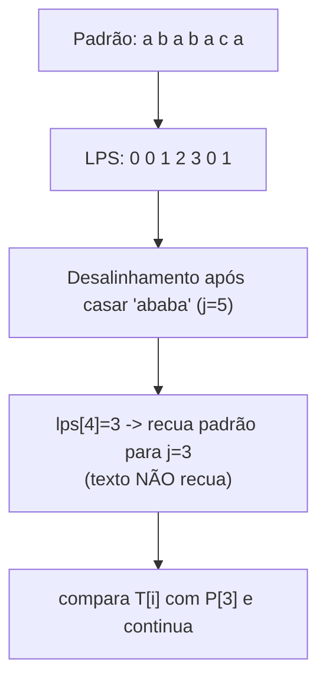
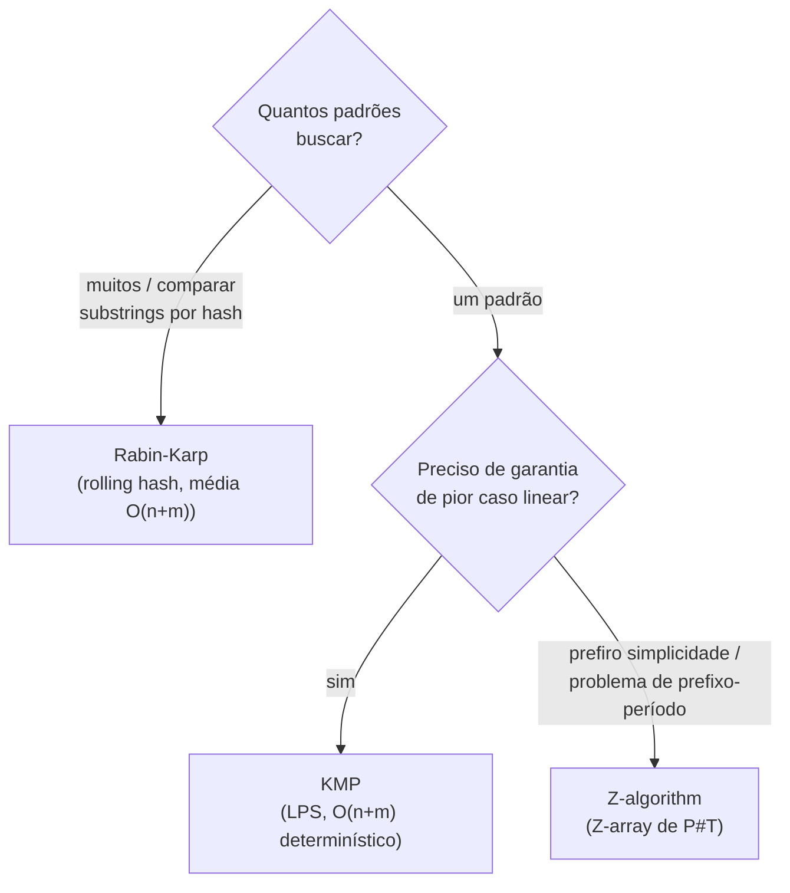

# Algoritmos de Strings: KMP, Rabin-Karp e Z-Algorithm

> **Bloco:** Algoritmos essenciais · **Nível:** Intermediário/Avançado · **Tempo de leitura:** ~30 min

## TL;DR

Os três algoritmos de busca de padrão em texto resolvem o mesmo problema central — **encontrar todas as ocorrências de um padrão `P` (tamanho `m`) num texto `T` (tamanho `n`)** — mas com mecanismos e trade-offs diferentes. A busca **ingênua** (deslizar o padrão posição a posição e comparar) é `O(n·m)` no pior caso, porque a cada desalinhamento ela **descarta toda a informação já obtida** e recomeça do zero. Os três algoritmos clássicos eliminam esse desperdício, atingindo tempo **linear** `O(n + m)`. **KMP (Knuth-Morris-Pratt)** pré-computa a **função prefixo** (também chamada **LPS** — *Longest Proper Prefix which is also Suffix*) do padrão, que diz, num desalinhamento, **quanto recuar sem reler caracteres do texto** — garantindo `O(n + m)` no **pior caso, determinístico**. **Rabin-Karp** usa **hashing com rolling hash**: calcula o hash do padrão e desliza uma janela pelo texto atualizando o hash em `O(1)` por posição; quando os hashes batem, confirma com comparação direta. É `O(n + m)` em média, mas `O(n·m)` no pior caso (muitas colisões/adversarial) — sua força real é a **busca de múltiplos padrões** e a comparação de substrings via hash. **Z-algorithm** computa o **Z-array** (para cada posição `i`, o tamanho do maior prefixo da string que começa em `i`), e resolve a busca concatenando `P + separador + T`; é `O(n + m)`, conceitualmente mais simples que o KMP para muita gente, e poderoso para problemas de prefixo/período. Os três são fundamentais em editores (busca/substituição), grep, antivírus (assinaturas), bioinformática (busca em DNA), detecção de plágio e indexação. A escolha: **KMP** para garantia de pior caso linear num padrão único; **Rabin-Karp** quando há muitos padrões ou comparações de substring por hash; **Z** quando a formulação por prefixos é mais natural.

## O problema que resolve

A operação "encontrar este texto dentro daquele" é onipresente: `Ctrl+F` num editor, `grep` no terminal, busca de uma assinatura de vírus num arquivo, localização de uma subsequência de DNA num genoma, detecção de trechos copiados entre documentos. Formalmente: dado um **texto** `T` de tamanho `n` e um **padrão** `P` de tamanho `m`, encontrar **todas as posições** onde `P` ocorre em `T`.

A solução ingênua é tentadora e correta, mas lenta: posicione `P` no início de `T`, compare caractere a caractere; ao primeiro desalinhamento, **desloque `P` uma posição à direita e recomece a comparação do zero**. O problema é justamente esse "recomece do zero": ao falhar, ela **joga fora tudo que já aprendeu** sobre os caracteres que já bateram. No pior caso — pense em `T = "aaaaaa...a"` e `P = "aaaa...b"` — cada tentativa compara quase `m` caracteres antes de falhar, e há quase `n` tentativas: `O(n·m)`.

A pergunta central destes algoritmos: **"como buscar um padrão sem reprocessar repetidamente os mesmos caracteres do texto — aproveitando a informação já obtida num desalinhamento?"** Os três respondem isso de formas distintas:

- **KMP** pré-processa o **padrão** para saber, num desalinhamento, **o quanto do padrão ainda casa** (sem nunca reler o texto) — informação determinística, pior caso linear.
- **Rabin-Karp** troca comparação caractere-a-caractere por **comparação de hashes** (barata e incremental), confirmando só quando os hashes batem — média linear, à custa de risco de colisão.
- **Z-algorithm** pré-processa a string concatenada `P+#+T` calculando, para cada posição, **o quanto dali em diante coincide com o prefixo** — uma reformulação elegante que resolve a busca e muitos problemas de período/prefixo.

Saber *que existem* algoritmos lineares (e a ideia por trás) é o ponto; saber *qual* escolher dado o cenário (um padrão vs muitos, garantia de pior caso vs simplicidade) é a habilidade sênior.

## O que é (definição aprofundada)

### KMP (Knuth-Morris-Pratt) e a função prefixo

O **KMP** elimina o retrocesso no texto. Sua peça central é a **função prefixo** do padrão, também conhecida como **array LPS (Longest Proper Prefix which is also Suffix)**. Para cada posição `i` do padrão, `lps[i]` é o **comprimento do maior prefixo próprio** de `P[0..i]` que é também um **sufixo** de `P[0..i]`. ("Próprio" = não é a string inteira.)

Por que isso ajuda? Quando, ao casar `P` contra `T`, ocorre um desalinhamento na posição `j` do padrão (mas `j` caracteres já casaram), sabemos que esses `j` caracteres do texto são exatamente `P[0..j-1]`. Em vez de recuar o texto, **recuamos o padrão** para `lps[j-1]`: o maior prefixo do padrão que já está garantidamente alinhado com o final do trecho casado. Assim, **o ponteiro do texto nunca volta** — ele só avança. Cada caractere do texto é examinado um número constante de vezes amortizado.

- **Pré-processamento** (cálculo do LPS): `O(m)`.
- **Busca:** `O(n)`.
- **Total:** `O(n + m)` no **pior caso, determinístico** — esta é a garantia mais forte dos três.

A função prefixo do KMP é, por si só, uma ferramenta poderosa: serve para contar ocorrências de prefixos, encontrar o **período** de uma string, compressão de strings, e construir autômatos de string.

### Rabin-Karp e o rolling hash

O **Rabin-Karp** (Rabin e Karp, 1987) substitui a comparação direta de substrings por **comparação de hashes**. A ideia:

1. Calcula-se o **hash do padrão** `P` e o hash da **primeira janela** de tamanho `m` em `T`.
2. Desliza-se a janela uma posição por vez. Em vez de recomputar o hash do zero (`O(m)`), usa-se um **rolling hash** (hash polinomial): ao avançar, **remove-se a contribuição do caractere que sai e adiciona-se a do que entra**, atualizando o hash em **`O(1)`**.
3. Quando `hash(janela) == hash(P)`, há um **candidato** — mas hashes iguais podem ser **colisão** (strings diferentes, mesmo hash). Confirma-se com uma **comparação direta** caractere a caractere.

Complexidade:

- **Média / caso esperado:** `O(n + m)` (poucas colisões com um bom hash e módulo primo grande).
- **Pior caso:** `O(n·m)` — se houver muitas colisões (hash fraco) ou entrada **adversarial** projetada para colidir, toda janela vira confirmação cara. Hashing duplo (dois módulos) reduz drasticamente a chance de colisão.

A força distintiva do Rabin-Karp: **busca eficiente de múltiplos padrões** (calcule os hashes de todos os padrões de mesmo tamanho e compare a janela contra um conjunto/`set` de hashes) e **comparação de substrings arbitrárias por hash** (string hashing) — comparar se dois trechos quaisquer de `T` são iguais em `O(1)` após pré-computar prefixos de hash. É a base de muitos algoritmos competitivos de string.

### Z-algorithm e o Z-array

O **Z-algorithm** computa o **Z-array** de uma string `S`: para cada posição `i ≥ 1`, `Z[i]` é o **comprimento do maior substring começando em `i` que coincide com um prefixo de `S`**. Ou seja, `Z[i]` = quanto, a partir de `i`, a string "se parece com seu próprio começo".

O cálculo é `O(|S|)` graças à manutenção de uma **janela `[L, R]`** (o intervalo de casamento de prefixo mais à direita já encontrado), que permite reaproveitar valores já computados em vez de comparar tudo de novo — a mesma filosofia de "não reprocessar" do KMP, com formulação diferente.

**Aplicação à busca de padrão:** construa `S = P + # + T`, onde `#` é um separador que não aparece em `P` nem `T`. Compute o `Z-array` de `S`. Toda posição `i` (dentro da parte de `T`) com `Z[i] == m` (tamanho do padrão) marca uma **ocorrência** de `P` em `T`.

- **Complexidade:** `O(n + m)`.
- Muitos consideram o Z-algorithm **mais intuitivo** que o KMP (não exige raciocinar sobre "prefixo que é sufixo"), e ele resolve diretamente problemas de **período**, **borda** e **contagem de prefixos**.

### Tabela comparativa

| Algoritmo | Pré-proc. | Busca | Pior caso | Pré-processa o quê | Força distintiva | Risco |
|---|---|---|---|---|---|---|
| **Ingênuo** | — | `O(n·m)` | `O(n·m)` | nada | trivial de escrever | lento |
| **KMP** | `O(m)` (LPS) | `O(n)` | **`O(n+m)` determinístico** | função prefixo do padrão | garantia de pior caso linear; período | LPS off-by-one |
| **Rabin-Karp** | `O(m)` | `O(n)` médio | `O(n·m)` (colisões) | hash do padrão | **múltiplos padrões**; compara substrings por hash | colisões / adversarial |
| **Z-algorithm** | `O(m)` | `O(n)` | `O(n+m)` | Z-array de `P+#+T` | simplicidade conceitual; prefixo/período | escolha do separador |

A linha de decisão: **um padrão único, preciso de garantia de pior caso linear** → KMP. **Muitos padrões, ou preciso comparar substrings arbitrárias por hash** → Rabin-Karp. **Quero a formulação mais simples de raciocinar, ou o problema é sobre prefixos/períodos** → Z.

### Glossário rápido

- **Texto (`T`, tam `n`) / padrão (`P`, tam `m`):** onde se busca / o que se busca.
- **Função prefixo / LPS:** maior prefixo próprio que também é sufixo, por posição (núcleo do KMP).
- **Prefixo próprio:** prefixo que não é a string inteira.
- **Rolling hash:** hash que se atualiza em `O(1)` ao deslizar a janela (remove o que sai, adiciona o que entra).
- **Colisão de hash:** strings diferentes com mesmo hash; exige confirmação por comparação direta.
- **String hashing:** pré-computar hashes de prefixos para comparar substrings arbitrárias em `O(1)`.
- **Z-array:** para cada `i`, maior substring a partir de `i` que coincide com o prefixo.
- **Separador (`#`):** caractere fora dos alfabetos de `P` e `T`, usado na concatenação do Z.
- **Período de uma string:** menor deslocamento que faz a string casar consigo mesma; computável via LPS ou Z.

## Como funciona

### KMP: o texto nunca volta

A garantia central do KMP é que o ponteiro do **texto só avança**. Quando ocorre um desalinhamento após `j` casamentos, o LPS diz para qual posição do **padrão** voltar (`lps[j-1]`) sem mexer no ponteiro do texto. Como o ponteiro do texto avança `n` vezes e o do padrão retrocede no máximo o total que avançou, o trabalho amortizado é `O(n)`. O LPS é construído em `O(m)` com a mesma técnica de auto-casamento do padrão consigo mesmo.

Esqueleto:

```
// 1) pré-computa LPS do padrão
lps = computa_lps(P)          // O(m)

// 2) busca
i = 0  // ponteiro do texto (NUNCA recua)
j = 0  // ponteiro do padrão
enquanto i < n:
    se T[i] == P[j]:
        i++; j++
        se j == m: registra ocorrência em (i - m); j = lps[j-1]
    senão se j > 0:
        j = lps[j-1]          // recua o padrão, não o texto
    senão:
        i++
```

### Rabin-Karp: hashing incremental

O rolling hash trata a janela como um número numa base (ex.: base 256 ou um primo), módulo um primo grande. Ao deslizar, subtrai-se o termo do caractere que sai (multiplicado pela maior potência da base), multiplica-se por base e soma-se o caractere que entra — tudo `O(1)`. A confirmação por comparação direta é o que garante **corretude** apesar de colisões; o hash só serve para **filtrar baratamente** os candidatos.

```
hp = hash(P)
hw = hash(T[0..m-1])
para i de 0 até n - m:
    se hw == hp e T[i..i+m-1] == P:   // confirma (evita colisão)
        registra ocorrência em i
    hw = roll(hw, sai=T[i], entra=T[i+m])   // O(1)
```

### Z-algorithm: a janela [L, R]

O Z-array é computado mantendo o intervalo `[L, R]` do casamento de prefixo mais à direita conhecido. Para uma posição `i` dentro de `[L, R]`, reaproveita-se o valor `Z[i - L]` já calculado (espelhamento), evitando recomparar; fora da janela, compara-se diretamente e atualiza-se `[L, R]`. Esse reaproveitamento é o que dá a linearidade.

## Diagrama de fluxo

O primeiro diagrama mostra o array LPS do padrão `"ababaca"` e como ele guia o recuo. O segundo ilustra o rolling hash deslizando pela janela. O terceiro é a árvore de decisão para escolher o algoritmo.






## Exemplo prático / caso real

Cenário pt-BR: a engenharia de uma **plataforma de conteúdo e marketplace brasileira** aplica os três algoritmos em pontos distintos do produto.

**1. Filtro de palavras proibidas em descrições (Rabin-Karp, múltiplos padrões).** O marketplace precisa bloquear anúncios que contenham qualquer termo de uma **lista de milhares de palavras proibidas** (golpes, produtos ilegais, ofensas). Buscar cada termo separadamente com KMP rodaria o texto várias vezes; em vez disso, agrupa-se os termos por tamanho, calcula-se o **hash de cada termo** e, deslizando uma janela por hash de cada tamanho, compara-se o hash da janela contra um `set` de hashes em `O(1)` — confirmando só nos candidatos. É o ponto forte do **Rabin-Karp**: muitos padrões de uma vez. Pseudocódigo conciso:

```
para cada tamanho m presente na lista:
    hashes_proibidos = { hash(termo) : termo de tamanho m }
    hw = hash(T[0..m-1])
    para i de 0 até n - m:
        se hw em hashes_proibidos e T[i..i+m-1] in termos:  // confirma
            sinaliza anúncio
        hw = roll(hw, T[i], T[i+m])
```

**2. Busca/substituição no editor de descrições (KMP).** O editor rich-text oferece "localizar e substituir" sobre descrições que podem ter dezenas de milhares de caracteres. Aqui o requisito é **garantia de resposta rápida no pior caso** (descrições adversariais com muita repetição não podem travar a UI), e há **um padrão único** por busca — o cenário ideal do **KMP**, com seu `O(n+m)` determinístico. O mesmo mecanismo está por trás do `grep` e do `Ctrl+F`.

**3. Detecção de plágio / período em URLs e slugs (Z-algorithm).** O time de SEO precisa detectar **slugs duplicados ou com padrões repetidos** (ex.: `promo-promo-promo`) e, no antifraude, identificar **substrings repetidas** em payloads suspeitos. A formulação por **prefixo/período** é natural com o **Z-algorithm**: o menor período de uma string sai diretamente do Z-array, e a busca de um trecho dentro de outro se resolve com `Z(P + # + T)`. A simplicidade conceitual do Z (sem raciocinar sobre "prefixo que é sufixo") foi o que levou o time a escolhê-lo para esses casos.

**4. Bioinformática / busca em logs estruturados.** Embora não seja o core do marketplace, vale citar que os mesmos algoritmos sustentam a busca de subsequências em **DNA/proteínas** (genomas de bilhões de bases) e a varredura de **assinaturas em antivírus** — ambientes onde a diferença entre `O(n·m)` e `O(n+m)` é a diferença entre minutos e horas.

A lição transversal: **um padrão único com garantia de pior caso → KMP; muitos padrões ou comparação por hash → Rabin-Karp; formulação por prefixo/período → Z.** Os três batem `O(n+m)`; a escolha é por *natureza do problema*, não por velocidade bruta.

## Quando usar / Quando evitar

**KMP:** use quando há **um padrão único** e você precisa de **garantia de pior caso linear** `O(n+m)` (entradas adversariais, requisitos de latência), ou quando precisa da **função prefixo** para período/borda/compressão. **Evite** quando o overhead de implementar o LPS não se justifica para textos curtos (a busca ingênua pode bastar) ou quando há muitos padrões (Rabin-Karp é melhor).

**Rabin-Karp:** use para **múltiplos padrões** de mesmo tamanho, ou quando precisa **comparar substrings arbitrárias por hash** em `O(1)` (string hashing). **Evite** quando o pior caso `O(n·m)` é inaceitável e a entrada pode ser adversarial, a menos que use **hashing duplo**; e cuidado com a corretude — sempre **confirme** os candidatos por comparação direta (hash igual não garante string igual).

**Z-algorithm:** use quando a formulação por **prefixos/períodos** é natural, ou quando você prefere uma implementação **conceitualmente mais simples** que o KMP para busca de padrão único. **Evite** quando o problema é claramente de múltiplos padrões (Rabin-Karp) — e atenção à escolha do **separador** (deve estar fora dos alfabetos de `P` e `T`).

Nota geral: para textos curtos e buscas pontuais, a **busca ingênua** `O(n·m)` ou a função `indexOf`/`find` da linguagem (muitas vezes já otimizadas) é suficiente — os três algoritmos brilham em **escala** (textos grandes, muitas buscas, requisitos de pior caso).

## Anti-padrões e armadilhas comuns

- **Esquecer a confirmação no Rabin-Karp (tratar hash igual como string igual).** Hashes iguais podem ser **colisão**; sem a comparação direta dos caracteres, o algoritmo reporta **falsos positivos**. Sempre confirme os candidatos.
- **Hash fraco / módulo pequeno no Rabin-Karp.** Módulo pequeno ou base mal escolhida geram muitas colisões, degradando para `O(n·m)`. Use **primo grande** (e idealmente **hashing duplo** com dois módulos) para tornar colisões praticamente impossíveis.
- **Off-by-one no array LPS do KMP.** O cálculo do LPS e o índice de recuo (`lps[j-1]`) são fonte clássica de bugs de borda. Erros aqui produzem ocorrências perdidas ou posições erradas — teste com padrões periódicos (`"aaaa"`, `"abab"`).
- **Recuar o ponteiro do texto no KMP.** O ponto inteiro do KMP é que **o texto nunca volta**; uma implementação que recua o índice do texto perde a garantia `O(n+m)` e vira a busca ingênua disfarçada.
- **Separador inadequado no Z-algorithm.** Concatenar `P + T` sem um separador (ou com um caractere que aparece nos dados) faz um prefixo "vazar" do `P` para o `T` e gera ocorrências falsas. Use um símbolo garantidamente ausente de ambos.
- **Assumir pior caso linear no Rabin-Karp.** Rabin-Karp é `O(n+m)` **em média**, não no pior caso. Em contexto adversarial (ex.: input controlado por usuário malicioso), randomize a base/módulo ou use KMP/Z para a garantia.
- **Reinventar a roda para casos triviais.** Para buscas simples em strings curtas, as funções nativas (`String.indexOf`, `str.find`, `re`) costumam ser suficientes e já otimizadas; implementar KMP/Z à mão só se justifica por requisitos específicos (pior caso, múltiplos padrões, período).
- **Confundir os problemas que cada um resolve melhor.** Usar KMP para buscar milhares de padrões (rodando o texto N vezes) quando Rabin-Karp faria numa passada; ou usar Rabin-Karp onde o pior caso linear determinístico do KMP era requisito.
- **Ignorar normalização (case, acentos, Unicode).** Em pt-BR, buscar `"acao"` em `"ação"` exige normalização Unicode/acentos *antes* do algoritmo — nenhum dos três trata isso; é pré-processamento.

## Relação com outros conceitos

- **Dynamic programming:** **edit distance** e **LCS** são DP de strings que resolvem problemas *aproximados* (similaridade, distância) onde KMP/Rabin-Karp/Z resolvem casamento *exato*. Complementares: busca exata (estes três) vs busca aproximada/alinhamento (DP — ver doc de DP).
- **Estruturas de dados — hashing:** Rabin-Karp é uma aplicação direta de **hash** (rolling hash, hashing duplo, módulo primo); o string hashing que ele habilita é base de muitos algoritmos competitivos.
- **Estruturas de dados — tries / suffix structures:** para busca de **muitos padrões** simultaneamente, **Aho-Corasick** (autômato sobre uma trie) generaliza o KMP; **suffix array / suffix tree** resolvem múltiplas consultas de padrão no mesmo texto. KMP/Z são a porta de entrada para esse universo.
- **Complexidade:** o salto de `O(n·m)` (ingênuo) para `O(n+m)` (os três) é o exemplo didático de como **não reprocessar trabalho já feito** transforma quadrático em linear — a mesma ideia da memoization em DP.
- **Greedy / DP (paradigmas):** o KMP e o Z reaproveitam informação computada (filosofia próxima da DP/memoization); a função prefixo é, em essência, uma tabela pré-computada.
- **System design (busca, indexação):** motores de busca, `grep`, antivírus (assinaturas), detecção de plágio, sistemas de DNA, e o pré-filtro de moderação de conteúdo usam esses algoritmos em escala; em buscas full-text de produção, eles coexistem com índices invertidos (Elasticsearch/Lucene), que resolvem outro recorte do problema.

## Modelo mental para o arquiteto

Três ideias para carregar:

1. **A ideia única é "não reprocessar".** A busca ingênua é `O(n·m)` porque joga fora o que já aprendeu a cada desalinhamento. Os três algoritmos linearizam isso de formas diferentes: KMP lembra (via LPS) quanto do padrão ainda casa; Rabin-Karp resume a janela num hash atualizável em `O(1)`; Z reaproveita casamentos de prefixo já vistos. Mesmo princípio, três mecanismos.
2. **A escolha é por natureza do problema, não por velocidade.** Os três batem `O(n+m)` (Rabin-Karp em média). Decida por: **garantia de pior caso e padrão único** (KMP), **muitos padrões ou comparação por hash** (Rabin-Karp), **prefixo/período ou simplicidade** (Z).
3. **Conheça os limites e o que vem depois.** Estes resolvem casamento **exato** de um/poucos padrões. Para muitos padrões, **Aho-Corasick**; para múltiplas consultas no mesmo texto, **suffix array/tree**; para similaridade aproximada, **DP (edit distance/LCS)**; para full-text em escala, **índices invertidos**. Saber onde os três terminam e os outros começam é o discernimento sênior.

O fio condutor: busca de padrão é um problema "resolvido", mas saber *qual* das três técnicas encaixa no cenário (e por que a ingênua é `O(n·m)`) é o tipo de fundamento que aparece tanto em entrevistas quanto em decisões reais de moderação, busca e indexação.

## Pontos para fixar (revisão)

- A busca **ingênua** é `O(n·m)` porque **descarta a informação** a cada desalinhamento; os três clássicos atingem `O(n+m)`.
- **KMP:** função prefixo / **LPS** diz quanto recuar o **padrão** sem nunca recuar o **texto**; `O(n+m)` **determinístico** (melhor garantia).
- **Rabin-Karp:** **rolling hash** atualiza a janela em `O(1)`; `O(n+m)` **em média**, `O(n·m)` no pior caso; sempre **confirme colisões**.
- **Rabin-Karp brilha** em **múltiplos padrões** e **comparação de substrings por hash**; use **hashing duplo** contra colisões/adversarial.
- **Z-algorithm:** **Z-array** (maior prefixo a partir de cada posição); busca via `Z(P + # + T)` com `Z[i]==m`; simples e bom para **prefixo/período**.
- Escolha: **padrão único + pior caso** → KMP; **muitos padrões / hash** → Rabin-Karp; **prefixo-período / simplicidade** → Z.
- Armadilhas: não confirmar colisões (RK), off-by-one no LPS e recuar o texto (KMP), separador ruim (Z), normalização Unicode/acentos (pré-processamento).
- Para **muitos padrões** generaliza-se com **Aho-Corasick**; para **múltiplas consultas** no mesmo texto, **suffix array/tree**.
- Busca **exata** (estes três) ≠ busca **aproximada** (edit distance/LCS via DP).
- Em strings curtas, as funções nativas (`indexOf`/`find`) costumam bastar; os três valem em **escala**.

## Referências

- [Prefix function — Knuth-Morris-Pratt — cp-algorithms.com](https://cp-algorithms.com/string/prefix-function.html)
- [Rabin-Karp for String Matching — cp-algorithms.com](https://cp-algorithms.com/string/rabin-karp.html)
- [String Hashing — cp-algorithms.com](https://cp-algorithms.com/string/string-hashing.html)
- [Z-function and its applications — cp-algorithms.com](https://cp-algorithms.com/string/z-function.html)
- [Rabin-Karp Algorithm for Pattern Searching — GeeksforGeeks](https://www.geeksforgeeks.org/dsa/rabin-karp-algorithm-for-pattern-searching/)
- [Rabin–Karp algorithm — Wikipedia](https://en.wikipedia.org/wiki/Rabin%E2%80%93Karp_algorithm)
- [Knuth-Morris-Pratt (KMP) Algorithm — Naukri Code360](https://www.naukri.com/code360/library/prefix-function-knuth-morris-pratt-algorithm)
- [Pattern Matching with Z, KMP, and Rabin-Karp — DEV Community](https://dev.to/picciniuscodes/searching-algorithms-part-2-pattern-matching-in-strings-with-z-kmp-and-rabin-karp-178d)
