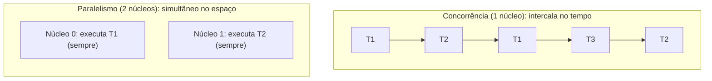
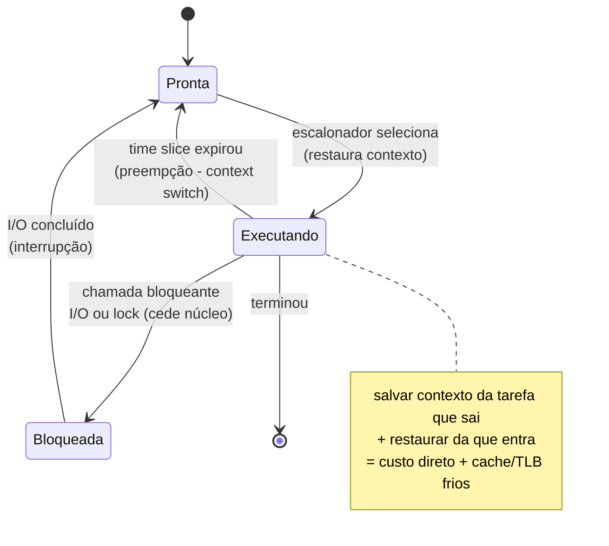

# Concorrência vs Paralelismo e Context Switching

> **Bloco:** Concorrência e paralelismo · **Nível:** Avançado · **Tempo de leitura:** ~22 min

## TL;DR

**Concorrência** e **paralelismo** são conceitos relacionados mas distintos, e confundi-los é um dos erros mais comuns de entrevista. **Concorrência é sobre lidar com muitas coisas ao mesmo tempo (estrutura)**; **paralelismo é sobre executar muitas coisas ao mesmo tempo (execução)**. Na frase consagrada de Rob Pike: *"Concurrency is about dealing with lots of things at once. Parallelism is about doing lots of things at once."* Concorrência é uma propriedade do **design** do programa — decompor o trabalho em tarefas independentes que *podem* progredir de forma intercalada; é possível ter concorrência num único núcleo, intercalando tarefas via **time-slicing** e **context switching**. Paralelismo é uma propriedade da **execução** — precisa de hardware com múltiplas unidades de processamento (múltiplos núcleos/CPUs) para que tarefas rodem *fisicamente ao mesmo tempo*. Um programa concorrente pode ou não executar em paralelo, dependendo do hardware; um programa paralelo é necessariamente concorrente. O **context switching** (troca de contexto) é o mecanismo que viabiliza a concorrência num número limitado de núcleos: o SO salva o estado (registradores, contador de programa, ponteiro de pilha) da tarefa atual e carrega o de outra, dando a ilusão de execução simultânea. Mas essa troca **não é grátis**: tem custo *direto* (salvar/restaurar estado, alternar para o kernel) e, pior, custo *indireto* (poluição de cache e TLB — a nova tarefa começa com caches "frios", causando cache misses que dominam o custo real). Por isso modelos de alta concorrência preferem evitar trocas pesadas de thread do SO: event loops single-thread (Node.js), corrotinas/green threads (goroutines em Go, virtual threads em Java) e I/O assíncrono multiplexam muitas tarefas lógicas sobre poucas threads do SO, minimizando context switches custosos.

## O problema que resolve

Imagine que você precisa escrever um servidor web que atende milhares de clientes simultaneamente. A maioria das requisições passa o tempo **esperando**: esperando o banco responder, esperando uma API externa, esperando o disco. Se o seu programa fosse estritamente sequencial — atender o cliente A do início ao fim, depois o B, depois o C — um único cliente lento (uma query de 2s) bloquearia todos os outros. O recurso (CPU) ficaria **ocioso** durante a espera, e a vazão (throughput) seria péssima.

A pergunta central é: **"Como fazer progresso em múltiplas tarefas sem que uma tarefa bloqueante impeça as demais, e como aproveitar múltiplos núcleos quando eles existem?"** Essas são, na verdade, *duas* perguntas, e separá-las é a chave para entender concorrência vs paralelismo:

1. **Estrutural (concorrência):** como decompor o programa em tarefas que podem progredir independentemente, intercalando-as de modo que a espera de uma não trave as outras? Isso é útil *mesmo num único núcleo* — enquanto a tarefa A espera I/O, a CPU executa a tarefa B.
2. **De execução (paralelismo):** quando há múltiplos núcleos, como distribuir trabalho computacional (CPU-bound) entre eles para terminar mais rápido? Isso só acelera se houver trabalho de CPU genuíno para dividir.

Confundir os dois leva a decisões erradas de arquitetura. Adicionar threads a um problema *I/O-bound* esperando ganho de paralelismo é frustrante (o gargalo é a espera, não a CPU); tentar paralelizar um algoritmo intrinsecamente sequencial esbarra na **Lei de Amdahl** (a fração serial do programa limita o speedup máximo, por mais núcleos que você adicione). O context switching entra como o mecanismo que torna a concorrência viável num número finito de núcleos — mas é também uma fonte de custo que, em alta escala, motiva modelos alternativos (assíncrono, corrotinas) que evitam trocas pesadas.

Vale fixar a distinção desde já com uma metáfora clássica (atribuída a discussões em torno de Rob Pike): **uma barista atendendo uma fila é concorrência** (ela alterna entre tomar pedidos, fazer café e cobrar — lida com várias coisas, mas é uma só pessoa); **duas baristas atendendo duas filas é paralelismo** (duas coisas acontecendo fisicamente ao mesmo tempo). A primeira melhora o aproveitamento do tempo ocioso; a segunda dobra a capacidade de processamento.

## O que é (definição aprofundada)

### Concorrência

**Concorrência** é a capacidade de um sistema de **lidar com múltiplas tarefas em progresso simultâneo**, sem que necessariamente executem no mesmo instante físico. É uma propriedade da **composição/estrutura** do programa: você decompõe o trabalho em unidades independentes (tarefas, processos, threads, corrotinas) cuja execução pode ser **intercalada** (interleaved). Num único núcleo, o processador executa um pedacinho da tarefa A, depois um pedacinho da B, depois volta para A — alternando tão rápido que parece simultâneo, mas em qualquer instante apenas uma instrução está sendo executada.

O ponto crucial: **concorrência existe no nível lógico/estrutural**, independente de quantos núcleos há. Um programa é concorrente se sua estrutura admite que múltiplas tarefas estejam "em andamento" ao mesmo tempo. Isso é o que permite que um servidor mantenha 10.000 conexões abertas com um punhado de threads: cada conexão é uma tarefa lógica, e o sistema intercala o trabalho conforme dados chegam.

### Paralelismo

**Paralelismo** é a **execução física simultânea** de múltiplas tarefas, exigindo hardware com múltiplas unidades de processamento (vários núcleos de CPU, vários processadores, GPU). No paralelismo, no mesmo instante de tempo, o núcleo 0 executa uma instrução da tarefa A *enquanto* o núcleo 1 executa uma instrução da tarefa B. É uma propriedade da **execução**, não do design.

A relação entre os dois:

- Paralelismo **implica** concorrência (se duas coisas rodam ao mesmo tempo, você precisa ter estruturado o programa para tê-las independentes).
- Concorrência **não implica** paralelismo (um programa concorrente num único núcleo intercala, não paraleliza).
- Um programa pode ser concorrente e não paralelo (event loop single-thread), paralelo e (trivialmente) concorrente (cálculo dividido em N núcleos), ou nenhum dos dois (sequencial puro).

### CPU-bound vs I/O-bound

A distinção orienta qual ferramenta usar:

- **I/O-bound:** o tempo é dominado por *espera* (rede, disco, banco). O ganho vem de **concorrência** — manter a CPU ocupada com outras tarefas durante a espera. Mais núcleos não ajudam muito; o que ajuda é não bloquear (async I/O, muitas tarefas leves).
- **CPU-bound:** o tempo é dominado por *computação* (processar imagem, ordenar bilhões de itens, criptografia). O ganho vem de **paralelismo** — dividir o cálculo entre núcleos. Concorrência sem paralelismo não acelera CPU-bound (intercalar duas tarefas de CPU num núcleo só não as faz terminar antes — pelo contrário, adiciona overhead de troca).

### Context switching (troca de contexto)

**Context switch** é o ato do escalonador do SO de **suspender uma tarefa em execução e retomar (ou iniciar) outra** no mesmo núcleo. Para isso, o SO precisa **salvar o contexto** da tarefa que sai e **restaurar o contexto** da que entra. O *contexto* inclui:

- **Registradores** da CPU (incluindo registradores de propósito geral).
- **Program Counter (PC)** — o endereço da próxima instrução.
- **Stack Pointer (SP)** — o topo da pilha da tarefa.
- **Estado de gerenciamento de memória** — em troca entre *processos* diferentes, troca-se também o espaço de endereçamento (page tables), o que **invalida o TLB**; em troca entre *threads* do mesmo processo, o espaço de endereçamento é compartilhado (mais barato).

Context switches acontecem por: (a) **preempção** — o quantum de tempo (time slice) da tarefa expirou e o escalonador a interrompe; (b) **bloqueio** — a tarefa fez uma syscall que bloqueia (ler do disco, esperar lock) e cede o núcleo voluntariamente; (c) **interrupção** — um evento de hardware (chegou um pacote de rede) precisa ser tratado.

### O custo do context switch

Aqui mora a pegadinha de entrevista. O custo tem duas componentes, e a *segunda* geralmente domina:

- **Custo direto:** salvar/restaurar registradores e a transição usuário↔kernel (modo privilegiado). Da ordem de **centenas de nanossegundos a poucos microssegundos**. Mensurável, mas relativamente pequeno.
- **Custo indireto (o que realmente importa):** **poluição de cache e TLB**. Quando a tarefa B começa a rodar, os caches L1/L2/L3 e o TLB estão cheios dos dados da tarefa A (caches "frios" para B). B sofre uma rajada de **cache misses** e **TLB misses**, e cada miss custa dezenas a centenas de ciclos. Esse "aquecimento" do estado da nova tarefa pode custar **muito mais** que o salvamento de registradores — e não aparece nos microbenchmarks ingênuos que só medem o tempo da syscall. Quanto maior o *working set* das tarefas e mais frequente a troca, pior.

Por isso, sistemas de altíssima concorrência **evitam** depender de trocas pesadas de threads do SO. As estratégias:

- **Event loop single-thread + I/O assíncrono não-bloqueante** (Node.js, Nginx, Redis): uma thread multiplexa milhares de conexões via `epoll`/`kqueue`; sem context switch entre tarefas, sem locks, alta vazão para I/O-bound. O preço: trabalho CPU-bound bloqueia o loop.
- **Corrotinas / green threads / virtual threads:** unidades de concorrência **gerenciadas em espaço de usuário** (goroutines do Go, virtual threads do Java 21, async/await), multiplexadas (M:N) sobre poucas threads do SO. A troca entre elas é uma **troca cooperativa barata** (sem entrar no kernel, sem invalidar TLB), permitindo milhões de tarefas concorrentes. O escalonador do runtime decide quando ceder (tipicamente em pontos de I/O).
- **Thread-per-core / afinidade de CPU:** fixar threads a núcleos para preservar a localidade de cache e minimizar migração.

## Como funciona

Considere um único núcleo executando um programa concorrente com três tarefas (T1, T2, T3). O escalonador do SO mantém uma fila de tarefas prontas (run queue). O fluxo:

1. T1 está rodando. Seu *time slice* (digamos 10ms) expira → **interrupção do timer** → o SO assume o controle (entra no kernel).
2. O SO **salva o contexto de T1** no seu *process/thread control block* (PCB/TCB): registradores, PC, SP.
3. O escalonador escolhe a próxima tarefa (T2) pela política (round-robin, prioridades, CFS no Linux).
4. O SO **restaura o contexto de T2** e retorna para o modo usuário no PC de T2. T2 continua de onde parou.
5. Se T2 faz um `read()` que bloqueia (espera disco), T2 cede voluntariamente → novo context switch para T3, *antes* de o time slice acabar. Quando o disco responde (interrupção), T2 volta para a fila de prontos.

Esse ciclo dá a **ilusão de simultaneidade** num único núcleo. Com N núcleos, há N execuções desse loop em paralelo, e o escalonador distribui tarefas entre eles (com cuidado para *load balancing* e *afinidade* — migrar uma tarefa para outro núcleo perde a localidade de cache daquele núcleo).

No modelo **M:N de corrotinas**, há uma camada a mais: o runtime (ex.: o scheduler do Go) mantém suas próprias filas de goroutines e as multiplexa sobre M threads do SO (tipicamente uma por núcleo). Quando uma goroutine faz I/O, o runtime a "estaciona" e roda outra goroutine **na mesma thread do SO, sem context switch do kernel** — só uma troca de pilha em espaço de usuário, barata. O kernel só vê as M threads ocupadas; as milhões de goroutines são invisíveis para ele.

A **Lei de Amdahl** quantifica o limite do paralelismo: se uma fração *p* do programa é paralelizável e *(1−p)* é serial, o speedup máximo com N núcleos é `1 / ((1−p) + p/N)`. Mesmo com infinitos núcleos, o speedup é limitado a `1/(1−p)`. Se 10% do programa é serial, o teto de aceleração é 10×, não importa quantos núcleos. Isso explica por que "jogar mais núcleos no problema" tem retornos decrescentes — e por que reduzir a fração serial (contenção de locks, seções críticas) costuma render mais que adicionar hardware.

## Diagrama de fluxo

O primeiro diagrama contrasta concorrência (intercalação num núcleo) com paralelismo (execução simultânea em dois núcleos). O segundo mostra a máquina de estados de uma tarefa do ponto de vista do escalonador, com os pontos onde ocorre context switch.





## Exemplo prático / caso real

Considere a API de **checkout de um e-commerce brasileiro**. Cada requisição de finalização de pedido precisa: validar o carrinho (CPU, rápido), consultar estoque (chamada de rede, ~50ms), calcular frete via API dos Correios (rede, ~200ms) e autorizar pagamento (rede, ~300ms). Quase todo o tempo de cada requisição é **espera de I/O** — é um workload classicamente **I/O-bound**.

**Abordagem ingênua (thread-per-request bloqueante).** Cada requisição ocupa uma thread do SO que fica **bloqueada** durante os ~550ms de espera de rede. Com um pool de 200 threads, o servidor atende no máximo ~200 requisições simultâneas, mesmo que a CPU esteja 95% ociosa (só esperando rede). Em pico de Black Friday, com 5.000 requisições concorrentes, 4.800 ficam na fila — e o context switching entre 200 threads disputando o tempo ainda adiciona overhead. O recurso escasso não é a CPU; são as **threads bloqueadas**.

**Abordagem concorrente sem mais paralelismo (async / virtual threads).** Reescrevendo com I/O não-bloqueante (ou virtual threads do Java 21 / goroutines), cada requisição vira uma tarefa **leve**. Enquanto espera o estoque/frete/pagamento, a thread do SO subjacente é **liberada** para progredir em *outras* requisições. As mesmas 200 threads do SO agora sustentam **dezenas de milhares** de requisições lógicas concorrentes, porque ninguém fica bloqueado durante a espera de rede. Note: **não adicionamos núcleos** — ganhamos puramente por melhor *concorrência* (estrutura), aproveitando o tempo ocioso. Isso é o ganho que paralelismo *não* daria, porque o gargalo era espera, não cálculo.

**Onde o paralelismo entra.** Suponha agora um job noturno que recalcula recomendações de produtos para 10 milhões de clientes — puro **CPU-bound** (rodar um modelo para cada cliente). Aqui, mais threads concorrentes num único núcleo *não* ajudam (só adicionam context switches). O ganho vem de **paralelismo real**: dividir os 10 milhões de clientes entre os, digamos, 32 núcleos da máquina, cada núcleo processando uma fatia. Com boa divisão e fração serial pequena, aproxima-se de 32× de speedup (limitado pela Lei de Amdahl: se 5% do job é serial — ler config, agregar resultado —, o teto é ~14× mesmo com 32 núcleos).

Pseudocódigo contrastando os dois eixos (estilo Go, ilustrativo):

```
// I/O-bound: concorrência leve resolve (goroutines, sem precisar de + núcleos)
for req := range requests {
    go handle(req)   // milhares de goroutines; runtime multiplexa sobre poucos núcleos
}                    // cada uma cede ao esperar rede; nenhuma thread do SO fica bloqueada

// CPU-bound: paralelismo resolve (dividir trabalho entre os N núcleos)
chunks := split(clients, numCPU())          // uma fatia por núcleo
for _, c := range chunks {
    go func(c []Client) { recompute(c) }(c)  // trabalho real de CPU em paralelo
}
```

A lição: diagnostique se o gargalo é **espera** (concorrência) ou **cálculo** (paralelismo) *antes* de escolher a ferramenta.

## Quando usar / Quando evitar

**Use concorrência (intercalação, async, corrotinas)** quando o workload é **I/O-bound** (rede, disco, banco): servidores web, proxies, gateways, agregadores que orquestram muitas chamadas. O objetivo é não desperdiçar a CPU durante esperas e sustentar muitas tarefas com poucos recursos do SO. **Evite** adicionar concorrência esperando acelerar trabalho CPU-bound num único núcleo — só adiciona overhead de troca.

**Use paralelismo (múltiplos núcleos)** quando o workload é **CPU-bound** e *divisível*: processamento de dados em lote, renderização, criptografia, treino/inferência de modelos, agregações pesadas. O objetivo é reduzir o tempo total dividindo o cálculo. **Evite** quando a fração serial é grande (Lei de Amdahl mata o ganho), quando o trabalho é pequeno demais (o overhead de coordenação supera o ganho) ou quando há forte dependência de dados entre as partes (sincronização excessiva).

**Minimize context switches** quando a vazão é crítica e o número de tarefas é altíssimo: prefira event loops/corrotinas a thread-per-request bloqueante; considere afinidade de CPU e thread pools dimensionados ao número de núcleos para trabalho CPU-bound (mais threads que núcleos em CPU-bound só causa troca inútil). **Não otimize prematuramente:** para cargas modestas, thread-per-request bloqueante é simples e suficiente — a complexidade de async só se paga em escala.

## Anti-padrões e armadilhas comuns

- **Confundir concorrência com paralelismo (a pegadinha clássica).** "Meu código é multi-threaded, logo é paralelo" — falso se roda num único núcleo (é concorrente, não paralelo) ou se as threads passam o tempo bloqueadas/serializadas por um lock. Saiba articular: concorrência = estrutura (lidar com muitas coisas); paralelismo = execução simultânea (fazer muitas coisas).
- **Jogar threads num problema I/O-bound esperando paralelismo.** O gargalo é a espera, não a CPU. Mais threads bloqueadas não aumentam vazão proporcionalmente e ainda multiplicam context switches; a solução é async/não-bloqueante.
- **Mais threads que núcleos para trabalho CPU-bound.** Num cálculo puro de CPU, criar 200 threads numa máquina de 8 núcleos não acelera — adiciona overhead de troca e contenção. O número ótimo de threads CPU-bound é ~número de núcleos.
- **Ignorar a Lei de Amdahl.** Esperar speedup linear com o número de núcleos ignora a fração serial. Se 20% do programa é serial, o teto é 5×, por mais núcleos que se adicione. Reduzir a parte serial (contenção, locks) frequentemente rende mais que adicionar hardware.
- **Medir custo de context switch só pelo custo direto.** Microbenchmarks que medem só a syscall subestimam grosseiramente o custo real, que é dominado pelo **cache/TLB frio** da tarefa que entra. Em workloads com grande working set, o custo indireto domina.
- **Bloquear o event loop.** Em modelos single-thread (Node.js), executar trabalho CPU-bound síncrono no loop trava *todas* as conexões. Trabalho pesado deve ir para workers/threads separados.
- **Achar que corrotinas dão paralelismo de graça.** Goroutines/async dão **concorrência** barata. Para paralelismo real de CPU, ainda é preciso que o runtime distribua sobre múltiplos núcleos (em Go, `GOMAXPROCS`; em Python, o GIL histórico *impede* paralelismo de threads de CPU — concorrência sim, paralelismo de CPU não, daí o uso de multiprocessing).
- **Falsa partilha (false sharing) ao paralelizar.** Threads em núcleos diferentes escrevendo em variáveis *distintas* mas na *mesma linha de cache* causam invalidações de cache constantes (cache line ping-pong), destruindo o ganho do paralelismo. Alinhe/separe dados por linha de cache (padding).

## Relação com outros conceitos

- **Race Condition e Critical Section:** concorrência (acesso intercalado a estado compartilhado) é precondição de race conditions; quanto mais concorrência/paralelismo, mais superfície para corridas. A seção crítica é a parte serial que a Lei de Amdahl penaliza.
- **Primitivas de sincronização (Mutex/Semaphore/Monitor/Spinlock):** servem para coordenar tarefas concorrentes; locks introduzem fração serial e podem causar context switches (mutex que bloqueia) ou busy-wait (spinlock).
- **Atomic / CAS / lock-free:** técnicas para coordenar sem bloquear, evitando os context switches que um lock bloqueante causa — relevantes justamente quando a troca de contexto é o gargalo.
- **Thread pools:** o dimensionamento de pools depende diretamente de I/O-bound vs CPU-bound (mais threads para o primeiro, ~núcleos para o segundo) e do custo de context switch.
- **Memory model:** o reordenamento de instruções e a visibilidade entre threads (happens-before) só fazem sentido sob execução concorrente/paralela; o memory model define o que é observável quando há paralelismo real.
- **Padrões de resiliência (Bulkhead):** isolar pools de threads por dependência é, no fundo, gerenciar concorrência para conter o esgotamento de recursos sob carga.

## Referências

- [Concurrency Is Not Parallelism — Rob Pike (The Go Blog)](https://go.dev/blog/waza-talk)
- [Operating Systems: Three Easy Pieces — Concurrency (cap. de threads), Arpaci-Dusseau](https://pages.cs.wisc.edu/~remzi/OSTEP/)
- [Java Concurrency and Multithreading Tutorial — Jenkov](https://jenkov.com/tutorials/java-concurrency/index.html)
- [Concurrency Models — Jenkov](https://jenkov.com/tutorials/java-concurrency/concurrency-models.html)
- [Amdahl's law — Wikipedia](https://en.wikipedia.org/wiki/Amdahl%27s_law)
- [Context switch — Wikipedia](https://en.wikipedia.org/wiki/Context_switch)
- [The Go Memory Model — go.dev](https://go.dev/ref/mem)
